# 持久化存储入门

## 1、Volumes

Container（容器）中的磁盘文件是短暂的，当容器崩溃时，kubelet会重新启动容器，但最初的文件将丢失，Container会以最干净的状态启动。另外，当一个Pod运行多个Container时，各个容器可能需要共享一些文件。Kubernetes Volume可以解决这两个问题。

一些需要持久化数据的程序才会用到Volumes，或者一些需要共享数据的容器需要volumes。

Redis-Cluster：nodes.conf

日志收集的需求：需要在应用程序的容器里面加一个sidecar，这个容器是一个收集日志的容器，比如filebeat，它通过volumes共享应用程序的日志文件目录。

Volumes：官方文档https://kubernetes.io/docs/concepts/storage/volumes/

1. 背景

Docker也有卷的概念，但是在Docker中卷只是磁盘上或另一个Container中的目录，其生命周期不受管理。虽然目前Docker已经提供了卷驱动程序，但是功能非常有限，例如从Docker 1.7版本开始，每个Container只允许一个卷驱动程序，并且无法将参数传递给卷。

另一方面，Kubernetes卷具有明确的生命周期，与使用它的Pod相同。因此，在Kubernetes中的卷可以比Pod中运行的任何Container都长，并且可以在Container重启或者销毁之后保留数据。Kubernetes支持多种类型的卷，Pod可以同时使用任意数量的卷。

从本质上讲，卷只是一个目录，可能包含一些数据，Pod中的容器可以访问它。要使用卷Pod需要通过.spec.volumes字段指定为Pod提供的卷，以及使用.spec.containers.volumeMounts 字段指定卷挂载的目录。从容器中的进程可以看到由Docker镜像和卷组成的文件系统视图，卷无法挂载其他卷或具有到其他卷的硬链接，Pod中的每个Container必须独立指定每个卷的挂载位置。

### 1、emptyDir

和上述volume不同的是，如果删除Pod，emptyDir卷中的数据也将被删除，一般emptyDir卷用于Pod中的不同Container共享数据。它可以被挂载到相同或不同的路径上。

默认情况下，emptyDir卷支持节点上的任何介质，可能是SSD、磁盘或网络存储，具体取决于自身的环境。可以将emptyDir.medium字段设置为Memory，让Kubernetes使用tmpfs（内存支持的文件系统），虽然tmpfs非常快，但是tmpfs在节点重启时，数据同样会被清除，并且设置的大小会被计入到Container的内存限制当中。

使用emptyDir卷的示例，直接指定emptyDir为{}即可：

```
# cat nginx-deploy.yaml 
apiVersion: apps/v1
kind: Deployment
metadata:
  annotations:
    deployment.kubernetes.io/revision: "1"
  creationTimestamp: "2020-09-19T02:41:11Z"
  generation: 1
  labels:
    app: nginx
  name: nginx
  namespace: default
spec:
  progressDeadlineSeconds: 600
  replicas: 2
  revisionHistoryLimit: 10
  selector:
    matchLabels:
      app: nginx
  strategy:
    rollingUpdate:
      maxSurge: 25%
      maxUnavailable: 25%
    type: RollingUpdate
  template:
    metadata:
      creationTimestamp: null
      labels:
        app: nginx
    spec:
      containers:
      - image: nginx:1.15.2
        imagePullPolicy: IfNotPresent
        name: nginx
        resources: {}
        terminationMessagePath: /dev/termination-log
        terminationMessagePolicy: File
        terminationMessagePath: /dev/termination-log
        terminationMessagePolicy: File
        volumeMounts:
        - mountPath: /opt
          name: share-volume
      - image: nginx:1.15.2
        imagePullPolicy: IfNotPresent
        name: nginx2
        command:
        - sh
        - -c
        - sleep 3600
        resources: {}
        terminationMessagePath: /dev/termination-log
        terminationMessagePolicy: File
        terminationMessagePath: /dev/termination-log
        terminationMessagePolicy: File
        volumeMounts:
        - mountPath: /mnt
          name: share-volume
      dnsPolicy: ClusterFirst
      restartPolicy: Always
      schedulerName: default-scheduler
      securityContext: {}
      terminationGracePeriodSeconds: 30
      volumes:
      - name: share-volume
        emptyDir: {}
          #medium: Memory
```

### 2、hostPath

hostPath卷可将节点上的文件或目录挂载到Pod上，用于Pod自定义日志输出或访问Docker内部的容器等。

使用hostPath卷的示例。将主机的/data目录挂载到Pod的/test-pd目录：

```
     # cat nginx-deploy.yaml 
apiVersion: apps/v1
kind: Deployment
metadata:
  annotations:
    deployment.kubernetes.io/revision: "1"
  creationTimestamp: "2020-09-19T02:41:11Z"
  generation: 1
  labels:
    app: nginx
  name: nginx
  namespace: default
spec:
  progressDeadlineSeconds: 600
  replicas: 2
  revisionHistoryLimit: 10
  selector:
    matchLabels:
      app: nginx
  strategy:
    rollingUpdate:
      maxSurge: 25%
      maxUnavailable: 25%
    type: RollingUpdate
  template:
    metadata:
      creationTimestamp: null
      labels:
        app: nginx
    spec:
      containers:
      - image: nginx:1.15.2
        imagePullPolicy: IfNotPresent
        name: nginx
        resources: {}
        terminationMessagePath: /dev/termination-log
        terminationMessagePolicy: File
        terminationMessagePath: /dev/termination-log
        terminationMessagePolicy: File
        volumeMounts:
        - mountPath: /opt
          name: share-volume
        - mountPath: /etc/timezone
          name: timezone
      - image: nginx:1.15.2
        imagePullPolicy: IfNotPresent
        name: nginx2
        command:
        - sh
        - -c
        - sleep 3600
        resources: {}
        terminationMessagePath: /dev/termination-log
        terminationMessagePolicy: File
        terminationMessagePath: /dev/termination-log
        terminationMessagePolicy: File
        volumeMounts:
        - mountPath: /mnt
          name: share-volume
      dnsPolicy: ClusterFirst
      restartPolicy: Always
      schedulerName: default-scheduler
      securityContext: {}
      terminationGracePeriodSeconds: 30
      volumes:
      - name: share-volume
        emptyDir: {}
          #medium: Memory

      - name: timezone
        hostPath:
          path: /etc/timezone
          type: File
```

hostPath卷常用的type（类型）如下：

l type为空字符串：默认选项，意味着挂载hostPath卷之前不会执行任何检查。

l DirectoryOrCreate：如果给定的path不存在任何东西，那么将根据需要创建一个权限为0755的空目录，和Kubelet具有相同的组和权限。

l Directory：目录必须存在于给定的路径下。

l FileOrCreate：如果给定的路径不存储任何内容，则会根据需要创建一个空文件，权限设置为0644，和Kubelet具有相同的组和所有权。

l File：文件，必须存在于给定路径中。

l Socket：UNIX套接字，必须存在于给定路径中。

l CharDevice：字符设备，必须存在于给定路径中。

l BlockDevice：块设备，必须存在于给定路径中。

### 3、NFS

Exporter配置

/data/nfs/ 192.168.0.0/24(rw,sync,no_subtree_check,no_root_squash)

```
# cat nginx-deploy.yaml 
apiVersion: apps/v1
kind: Deployment
metadata:
  annotations:
    deployment.kubernetes.io/revision: "1"
  creationTimestamp: "2020-09-19T02:41:11Z"
  generation: 1
  labels:
    app: nginx
  name: nginx
  namespace: default
spec:
  progressDeadlineSeconds: 600
  replicas: 2
  revisionHistoryLimit: 10
  selector:
    matchLabels:
      app: nginx
  strategy:
    rollingUpdate:
      maxSurge: 25%
      maxUnavailable: 25%
    type: RollingUpdate
  template:
    metadata:
      creationTimestamp: null
      labels:
        app: nginx
    spec:
      containers:
      - image: nginx:1.15.2
        imagePullPolicy: IfNotPresent
        name: nginx
        resources: {}
        terminationMessagePath: /dev/termination-log
        terminationMessagePolicy: File
        terminationMessagePath: /dev/termination-log
        terminationMessagePolicy: File
        volumeMounts:
        - mountPath: /opt
          name: share-volume
        - mountPath: /etc/timezone
          name: timezone
      - image: nginx:1.15.2
        imagePullPolicy: IfNotPresent
        name: nginx2
        command:
        - sh
        - -c
        - sleep 3600
        resources: {}
        terminationMessagePath: /dev/termination-log
        terminationMessagePolicy: File
        terminationMessagePath: /dev/termination-log
        terminationMessagePolicy: File
        volumeMounts:
        - mountPath: /mnt
          name: share-volume
        - mountPath: /opt
          name: nfs-volume
      dnsPolicy: ClusterFirst
      restartPolicy: Always
      schedulerName: default-scheduler
      securityContext: {}
      terminationGracePeriodSeconds: 30
      volumes:
      - name: share-volume
        emptyDir: {}
          #medium: Memory

      - name: timezone
        hostPath:
          path: /etc/timezone
          type: File
      - name: nfs-volume
        nfs:
          server: 192.168.0.204
          path: /data/nfs/test-dp
```

## PV和PVC


Volume回顾

```
volumes:
      - name: share-volume
        emptyDir: {}
          #medium: Memory

      - name: timezone
        hostPath:
          path: /etc/timezone
          type: File
      - name: nfs-volume
        nfs:
          server: 192.168.0.204
          path: /data/nfs/test-dp
```


只有Volume无法满足生产需求

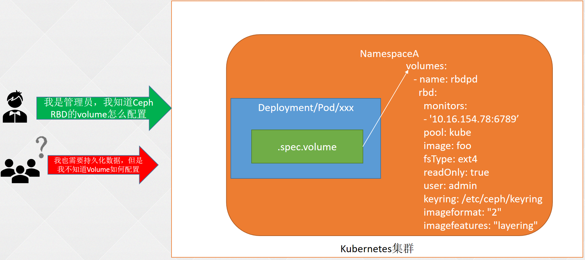


Volume无法解决的问题

```
当某个数据卷不再被挂载使用时，里面的数据如何处理？
如果想要实现只读挂载如何处理？
如果想要只能一个Pod挂载如何处理？
如何只允许某个Pod使用10G的空间？
```


```
PersistentVolume：简称PV，是由Kubernetes管理员设置的存储，可以配置Ceph、NFS、GlusterFS等常用存储配置，相对于Volume配置，提供了更多的功能，比如生命周期的管理、大小的限制。PV分为静态和动态。
PersistentVolumeClaim：简称PVC，是对存储PV的请求，表示需要什么类型的PV，需要存储的技术人员只需要配置PVC即可使用存储，或者Volume配置PVC的名称即可。
```

官方文档：https://kubernetes.io/docs/concepts/storage/persistent-volumes/

更简单的持久化存储方式

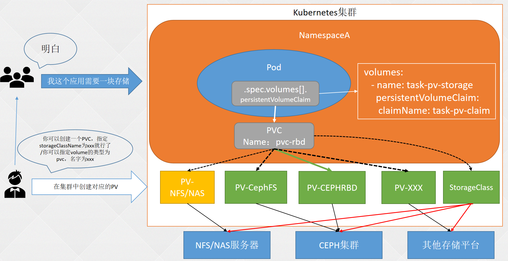


更灵活的存储配置-PV回收策略

Retain：保留，该策略允许手动回收资源，当删除PVC时，PV仍然存在，PV被视为已释放，管理员可以手动回收卷。

Recycle：回收，如果Volume插件支持，Recycle策略会对卷执行rm -rf清理该PV，并使其可用于下一个新的PVC，但是本策略将来会被弃用，目前只有NFS和HostPath支持该策略。

Delete：删除，如果Volume插件支持，删除PVC时会同时删除PV，动态卷默认为Delete，目前支持Delete的存储后端包括AWS EBS, GCE PD, Azure Disk, or OpenStack Cinder等。

可以通过persistentVolumeReclaimPolicy: Recycle字段配置

官方文档：https://kubernetes.io/docs/concepts/storage/persistent-volumes/#reclaim-policy


更灵活的存储配置-PV访问策略

ReadWriteOnce：可以被单节点以读写模式挂载，命令行中可以被缩写为RWO。

ReadOnlyMany：可以被多个节点以只读模式挂载，命令行中可以被缩写为ROX。

ReadWriteMany：可以被多个节点以读写模式挂载，命令行中可以被缩写为RWX。

官方文档：https://kubernetes.io/docs/concepts/storage/persistent-volumes/#access-modes


存储分类

文件存储：一些数据可能需要被多个节点使用，比如用户的头像、用户上传的文件等，实现方式：NFS、NAS、FTP、CephFS等。

块存储：一些数据只能被一个节点使用，或者是需要将一块裸盘整个挂载使用，比如数据库、Redis等，实现方式：Ceph、GlusterFS、公有云。

对象存储：由程序代码直接实现的一种存储方式，云原生应用无状态化常用的实现方式，实现方式：一般是符合S3协议的云存储，比如AWS的S3存储、Minio、七牛云等。


PV配置示例-NFS/NAS

```
apiVersion: v1
kind: PersistentVolume
metadata:
  name: pv-nfs
spec:
  capacity:
    storage: 5Gi
  volumeMode: Filesystem
  accessModes:
    - ReadWriteOnce
  persistentVolumeReclaimPolicy: Recycle
  storageClassName: nfs-slow
  mountOptions:
    - hard
    - nfsvers=4.1
  nfs:
    path: /data/k8s
    server: 10.103.236.205

```

capacity：容量配置

volumeMode：卷的模式，目前支持Filesystem（文件系统） 和 Block（块），其中Block类型需要后端存储支持，默认为文件系统

accessModes：该PV的访问模式

storageClassName：PV的类，一个特定类型的PV只能绑定到特定类别的PVC；persistentVolumeReclaimPolicy：回收策略

mountOptions：非必须，新版本中已弃用

nfs：NFS服务配置，包括以下两个选项

​	path：NFS上的共享目录

​	server：NFS的IP地址


PV配置示例-NFS配置

NFS服务器安装服务端： yum install nfs* rpcbind -y

所有K8s节点安装NFS客户端：yum install nfs-utils -y

NFS服务端：mkdir /data/k8s -p

NFS服务器创建共享目录：vim /etc/exports

```
/data/k8s/ *(rw,sync,no_subtree_check,no_root_squash)
exportfs -r

systemctl restart nfs rpcbind
```

挂载测试：mount -t nfs nfs-serverIP:/data/k8s /mnt/


PV的状态

Available：可用，没有被PVC绑定的空闲资源。

Bound：已绑定，已经被PVC绑定。

Released：已释放，PVC被删除，但是资源还未被重新使用。

Failed：失败，自动回收失败。


PV配置示例-HostPath

```
kind: PersistentVolume
apiVersion: v1
metadata:
  name: task-pv-volume
  labels:
    type: local
spec:
  storageClassName: hostpath
  capacity:
    storage: 10Gi
  accessModes:
    - ReadWriteOnce
  hostPath:
    path: "/mnt/data"
```


```
hostPath：hostPath服务配置
path：宿主机路径
```


PV配置示例-CephRBD

```
apiVersion: v1
kind: PersistentVolume
metadata:
  name: ceph-rbd-pv
spec:
  capacity:
    storage: 1Gi
  storageClassName: ceph-fast
  accessModes:
    - ReadWriteOnce
  rbd:
    monitors:
      - 192.168.1.123:6789
      - 192.168.1.124:6789
      - 192.168.1.125:6789
    pool: rbd
    image: ceph-rbd-pv-test
    user: admin
    secretRef:
      name: ceph-secret
    fsType: ext4
    readOnly: false
```


monitors：Ceph的monitor节点的IP

pool：所用Ceph Pool的名称，可以使用ceph osd pool ls查看

image：Ceph块设备中的磁盘映像文件，可以使用rbd create POOL_NAME/IMAGE_NAME --size 1024创建，使用rbd list POOL_NAME查看

user：Rados的用户名，默认是admin

secretRef：用于验证Ceph身份的密钥

fsType：文件类型，可以是ext4、XFS等

readOnly：是否是只读挂载


PV的请求-PVC

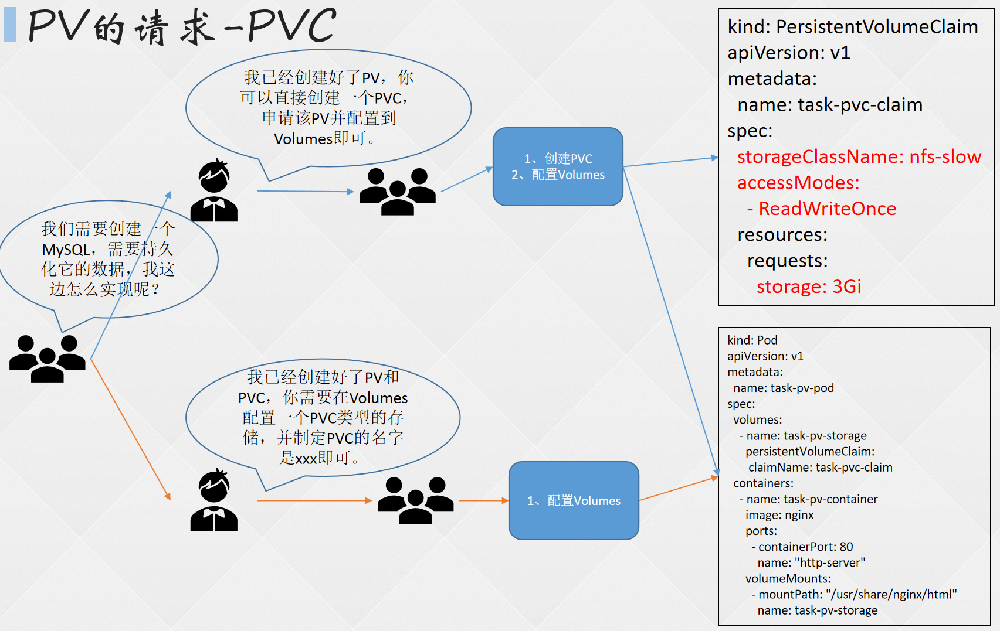


挂载PVC

```
apiVersion: apps/v1
kind: Deployment
metadata:
  labels:
    app: nginx
  name: nginx
  namespace: default
spec:
  replicas: 2
  revisionHistoryLimit: 10
  selector:
    matchLabels:
      app: nginx
  strategy:
    rollingUpdate:
      maxSurge: 1
      maxUnavailable: 0
    type: RollingUpdate
  template:
    metadata:
      creationTimestamp: null
      labels:
        app: nginx
    spec:
      volumes:
      - name: task-pv-storage
        persistentVolumeClaim:
          claimName: task-pvc-claim
      containers:
      - env:
        - name: TZ
          value: Asia/Shanghai
        - name: LANG
          value: C.UTF-8
        image: nginx
        imagePullPolicy: IfNotPresent
        name: nginx
        volumeMounts:
        - mountPath: "/usr/share/nginx/html"
          name: task-pv-storage
```


PVC创建和挂载失败的原因

```
PVC一直Pending的原因：
PVC的空间申请大小大于PV的大小
PVC的StorageClassName没有和PV的一致
PVC的accessModes和PV的不一致
```


```
挂载PVC的Pod一直处于Pending：
PVC没有创建成功/PVC不存在
PVC和Pod不在同一个Namespace
```


# 高级调度计划任务临时容器

## 亲和力Affinity

我们仍然存在的问题

1、Pod和节点之间的关系

某些Pod优先选择有ssd=true标签的节点，如果没有在考虑部署到其它节点；

某些Pod需要部署在ssd=true和type=physical的节点上，但是优先部署在ssd=true的节点上；

2、Pod和Pod之间的关系

同一个应用的Pod不同的副本或者同一个项目的应用尽量或必须不部署在同一个节点或者符合某个标签的一类节点上或者不同的区域；

相互依赖的两个Pod尽量或必须部署在同一个节点上或者同一个域内。


Affinity亲和力：

​	NodeAffinity：节点亲和力/反亲和力

​	PodAffinity：Pod亲和力

​	PodAntiAffinity：Pod反亲和力


Affinity分类

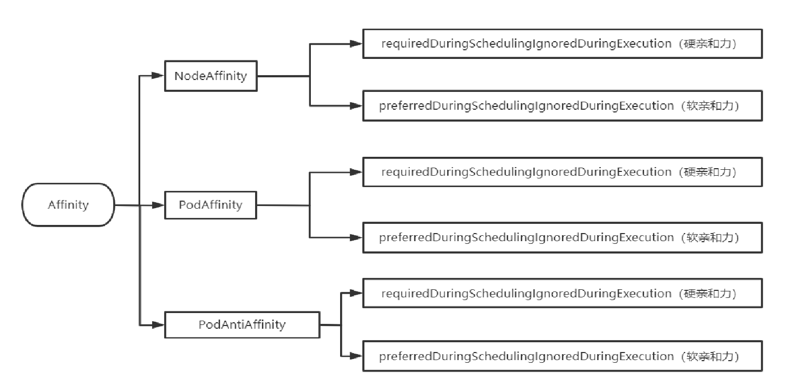

提高可用率--部署至不同宿主机

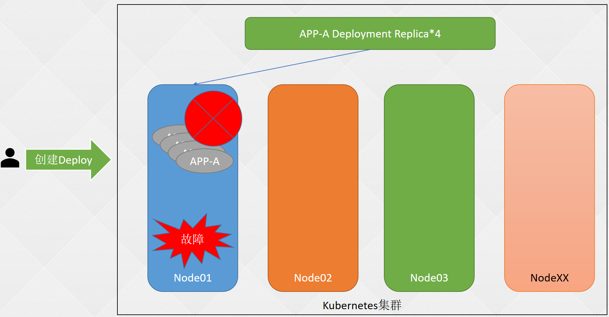


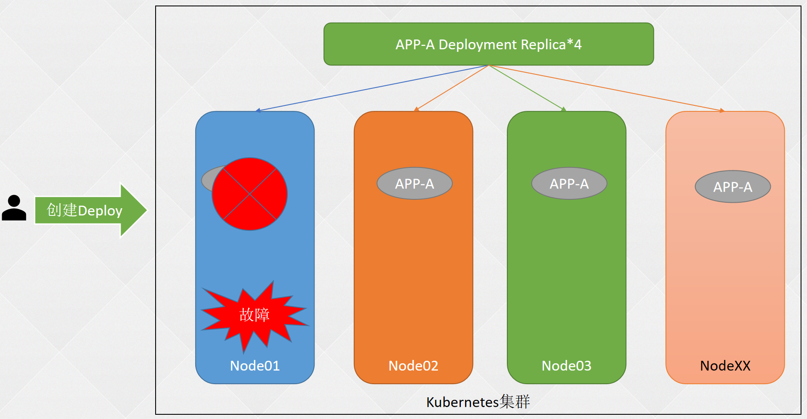


提高可用率--部署至不同机房/机柜

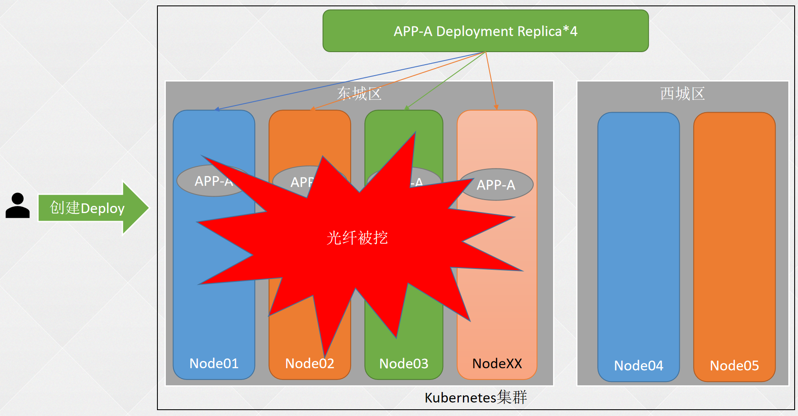

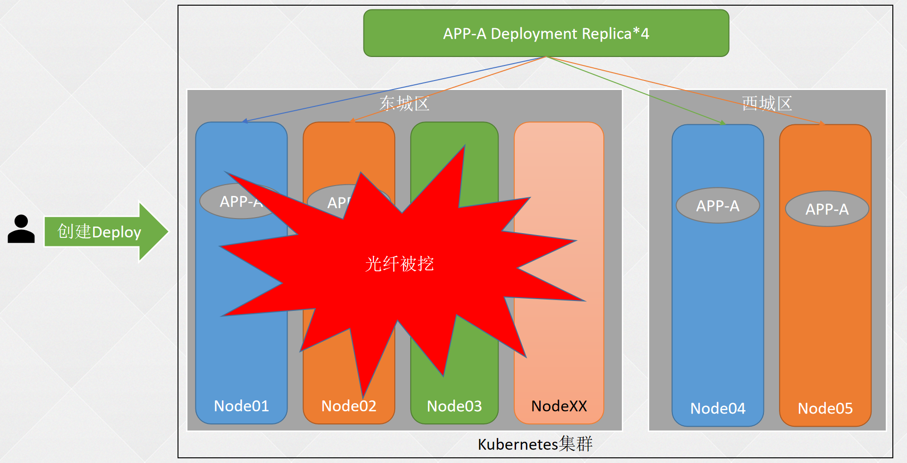

提高可用率—不放在同一个篮子里

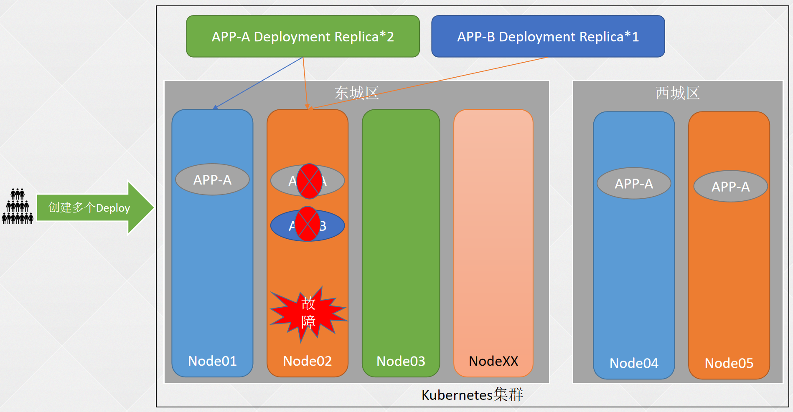

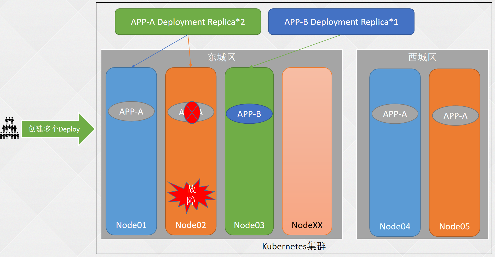


节点亲和力配置详解

```
apiVersion: v1
kind: Pod
metadata:
  name: with-node-affinity
spec:
  affinity:
    nodeAffinity:
      requiredDuringSchedulingIgnoredDuringExecution:
        nodeSelectorTerms:
        - matchExpressions:
          - key: kubernetes.io/e2e-az-name
            operator: In
            values:
            - e2e-az1
            - az-2
      preferredDuringSchedulingIgnoredDuringExecution:
      - weight: 1
        preference:
          matchExpressions:
          - key: another-node-label-key
            operator: In
            values:
            - another-node-label-value
  containers:
  - name: with-node-affinity
    image: nginx
```


requiredDuringSchedulingIgnoredDuringExecution：硬亲和力配置
	nodeSelectorTerms：节点选择器配置，可以配置多个matchExpressions（满足其一），每个matchExpressions下可以配置多个key、value类型的选择器（都需要满足），其中values可以配置多个（满足其一）
preferredDuringSchedulingIgnoredDuringExecution：软亲和力配置
	weight：软亲和力的权重，权重越高优先级越大，范围1-100
	preference：软亲和力配置项，和weight同级，可以配置多个，matchExpressions和硬亲和力一致
operator：标签匹配的方式
	In：相当于key = value的形式
	NotIn：相当于key != value的形式
	Exists：节点存在label的key为指定的值即可，不能配置values字段
	DoesNotExist：节点不存在label的key为指定的值即可，不能配置values字段
	Gt：大于value指定的值
	Lt：小于value指定的值


Pod亲和力和反亲和力详解

```
apiVersion: v1
kind: Pod
metadata:
  name: with-pod-affinity
spec:
  affinity:
    podAffinity:
      requiredDuringSchedulingIgnoredDuringExecution:
      - labelSelector:
          matchExpressions:
          - key: security
            operator: In
            values:
            - S1
        topologyKey: failure-domain.beta.kubernetes.io/zone
    podAntiAffinity:
      preferredDuringSchedulingIgnoredDuringExecution:
      - weight: 100
        podAffinityTerm:
          labelSelector:
            matchExpressions:
            - key: security
              operator: In
              values:
              - S2
          namespaces:
          - default
          topologyKey: failure-domain.beta.kubernetes.io/zone
  containers:
  - name: with-pod-affinity
    image: nginx

```

labelSelector：Pod选择器配置，可以配置多个

matchExpressions：和节点亲和力配置一致	

operator：配置和节点亲和力一致，但是没有Gt和Lt

topologyKey：匹配的拓扑域的key，也就是节点上label的key，key和value相同的为同一个域，可以用于标注不同的机房和地区

Namespaces: 和哪个命名空间的Pod进行匹配，为空为当前命名空间


示例1：同一个应用部署在不同的宿主机

```
apiVersion: apps/v1
kind: Deployment
metadata:
  labels:
    app: must-be-diff-nodes
  name: must-be-diff-nodes
  namespace: kube-public
spec:
  replicas: 3
  selector:
    matchLabels:
      app: must-be-diff-nodes
  template:
    metadata:
      labels:
        app: must-be-diff-nodes
    spec:
      affinity:
        podAntiAffinity:
          requiredDuringSchedulingIgnoredDuringExecution:
          - labelSelector:
              matchExpressions:
              - key: app
                operator: In
                values:
                - must-be-diff-nodes
            topologyKey: kubernetes.io/hostname
      containers:
      - image: nginx
        imagePullPolicy: IfNotPresent
        name: must-be-diff-nodes

```


labelSelector：Pod选择器配置，可以配置多个

matchExpressions：和节点亲和力配置一致	

operator：配置和节点亲和力一致，但是没有Gt和Lt

topologyKey：匹配的拓扑域的key，也就是节点上label的key，key和value相同的为同一个域，可以用于标注不同的机房和地区


示例2：同一个应用不同副本固定节点

```
apiVersion: apps/v1
kind: Deployment
metadata:
  name: redis-cache
spec:
  selector:
    matchLabels:
      app: store
  replicas: 3
  template:
    metadata:
      labels:
        app: store
    spec:
      nodeSelector:
          app: store
      affinity:
        podAntiAffinity:
          requiredDuringSchedulingIgnoredDuringExecution:
          - labelSelector:
              matchExpressions:
              - key: app
                operator: In
                values:
                - store
            topologyKey: "kubernetes.io/hostname"
      containers:
      - name: redis-server
        image: redis:3.2-alpine

```


示例3：应用和缓存尽量部署在同一个域内

```
apiVersion: apps/v1
kind: Deployment
metadata:
  name: web-server
spec:
  selector:
    matchLabels:
      app: web-store
  replicas: 3
  template:
    metadata:
      labels:
        app: web-store
    spec:
      affinity:
        podAntiAffinity:
          requiredDuringSchedulingIgnoredDuringExecution:
          - labelSelector:
              matchExpressions:
              - key: app
                operator: In
                values:
                - web-store
            topologyKey: "kubernetes.io/hostname"
        podAffinity:
          preferredDuringSchedulingIgnoredDuringExecution:
          - weight: 100
            podAffinityTerm:
              labelSelector:
                matchExpressions:
                - key: app
                  operator: In
                  values:
                  - store
              topologyKey: "kubernetes.io/hostname"
      containers:
      - name: web-app
        image: nginx:1.16-alpine
```


示例4：尽量调度到高配置服务器

```
apiVersion: apps/v1
kind: Deployment
metadata:
  labels:
    app: prefer-ssd
  name: prefer-ssd
  namespace: kube-public
spec:
  replicas: 3
  selector:
    matchLabels:
      app: prefer-ssd
  template:
    metadata:
      creationTimestamp: null
      labels:
        app: prefer-ssd
    spec:
      affinity:
        nodeAffinity:
          preferredDuringSchedulingIgnoredDuringExecution:
          - preference:
              matchExpressions:
              - key: ssd
                operator: In
                values:
                - "true"
              - key: master
                operator: NotIn
                values:
                - "true"
            weight: 100
          - preference:
              matchExpressions:
              - key: type
                operator: In
                values:
                - physical
            weight: 10
      containers:
      - env:
        - name: TZ
          value: Asia/Shanghai
        - name: LANG
          value: C.UTF-8
        image: nginx
        imagePullPolicy: IfNotPresent
        name: prefer-ssd
```


拓扑域TopologyKey详解

topologyKey：拓扑域，主要针对宿主机，相当于对宿主机进行区域的划分。用label进行判断，不同的key和不同的value是属于不同的拓扑域

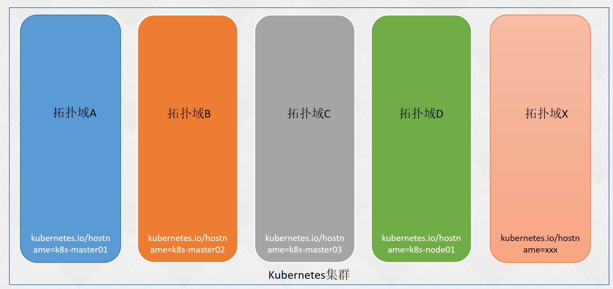

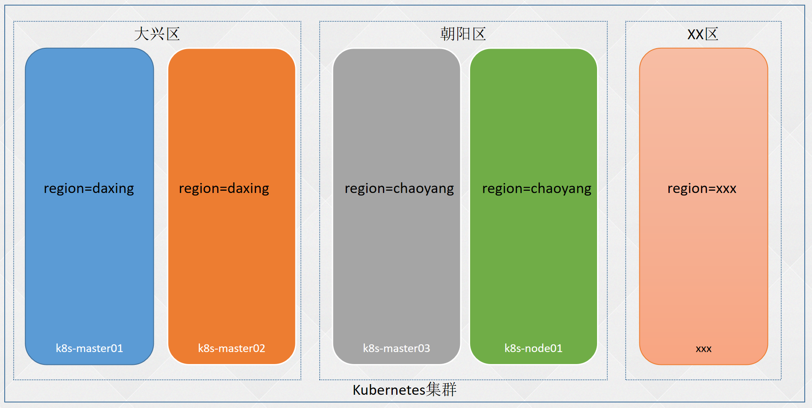

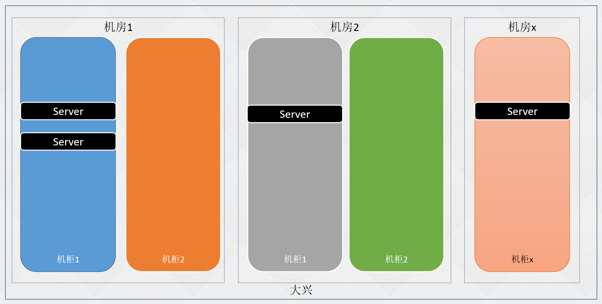

示例4：同一个应用多区域部署

```
apiVersion: apps/v1
kind: Deployment
metadata:
  labels:
    app: must-be-diff-zone
  name: must-be-diff-zone
  namespace: kube-public
spec:
  replicas: 3
  selector:
    matchLabels:
      app: must-be-diff-zone
  template:
    metadata:
      labels:
        app: must-be-diff-zone
    spec:
      affinity:
        podAntiAffinity:
          requiredDuringSchedulingIgnoredDuringExecution:
          - labelSelector:
              matchExpressions:
              - key: app
                operator: In
                values:
                - must-be-diff-zone
            topologyKey: region
      containers:
      - image: nginx
        imagePullPolicy: IfNotPresent
        name: must-be-diff-zone
```


## 计划任务CronJob&Job

Job可以干什么

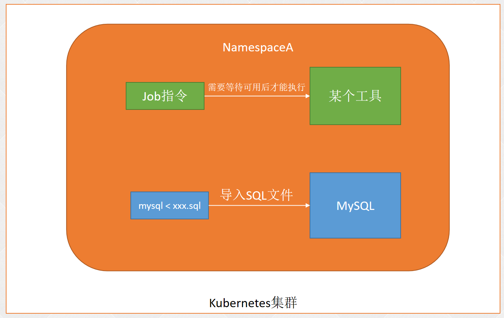

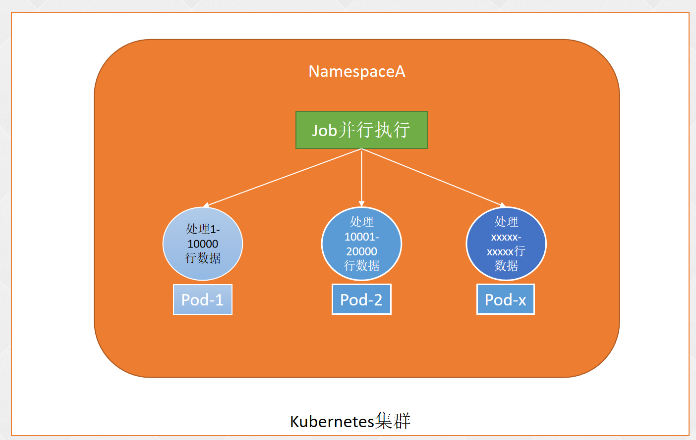


Job配置参数详解

```
apiVersion: batch/v1
kind: Job
metadata:
  labels:
    job-name: echo
  name: echo
  namespace: default
spec:
  suspend: true # 1.21+
  ttlSecondsAfterFinished: 100
  backoffLimit: 4
  completions: 1
  parallelism: 1
  template:
    spec:
      containers:
      - command:
        - echo
        - Hello, Job
        image: registry.cn-beijing.aliyuncs.com/dotbalo/busybox
        imagePullPolicy: Always
        name: echo
        resources: {}
      restartPolicy: Never

```


backoffLimit: 如果任务执行失败，失败多少次后不再执行

completions：有多少个Pod执行成功，认为任务是成功的为空

​	默认和parallelism数值一样

parallelism：并行执行任务的数量

​	如果parallelism数值大于未完成任务数，只会创建未完成的数量；

​	比如completions是4，并发是3，第一次会创建3个Pod执行任务，     第二次只会创建一个Pod执行任务

ttlSecondsAfterFinished：Job在执行结束之后（状态为completed或Failed）自动清理。设置为0表示执行结束立即删除，不设置则不会清除，需要开启TTLAfterFinished特性


更简单的计划任务CronJob

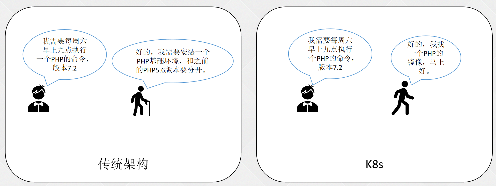

CronJob配置参数详解

```
apiVersion: batch/v1beta1
kind: CronJob
metadata:
  labels:
    run: hello
  name: hello
  namespace: default
spec:
  concurrencyPolicy: Allow
  failedJobsHistoryLimit: 1
  jobTemplate:
    metadata:
```


```
    spec:
      template:
        metadata:
          labels:
            run: hello
        spec:
          containers:
          - args:
            - /bin/sh
            - -c
            - date; echo Hello from the Kubernetes cluster
            image: registry.cn-beijing.aliyuncs.com/dotbalo/busybox
            imagePullPolicy: Always
            name: hello
            resources: {}
          restartPolicy: OnFailure
          securityContext: {}
  schedule: '*/1 * * * *'
  successfulJobsHistoryLimit: 3
  suspend: false
```


apiVersion: batch/v1beta1 #1.21+ batch/v1

schedule：调度周期，和Linux一致，分别是分时日月周。

restartPolicy：重启策略，和Pod一致。

concurrencyPolicy：并发调度策略。可选参数如下：

​	Allow：允许同时运行多个任务。

​	Forbid：不允许并发运行，如果之前的任务尚未完成，新的任务不会被创建。

​	Replace：如果之前的任务尚未完成，新的任务会替换的之前的任务。

suspend：如果设置为true，则暂停后续的任务，默认为false。

successfulJobsHistoryLimit：保留多少已完成的任务，按需配置。

failedJobsHistoryLimit：保留多少失败的任务。


初始化容器InitContainer

初始化容器的用途

```
Init 容器可以包含一些安装过程中应用容器中不存在的实用工具或个性化代码；
Init 容器可以安全地运行这些工具，避免这些工具导致应用镜像的安全性降低；
Init容器可以以root身份运行，执行一些高权限命令；
Init容器相关操作执行完成以后即退出，不会给业务容器带来安全隐患。
```


在主应用启动之前，做一些初始化的操作，比如创建文件、修改内核参数、等待依赖程序启动或其他需要在主程序启动之前需要做的工作


初始化容器和PostStart区别

```
PostStart：依赖主应用的环境，而且并不一定先于Command运行
InitContainer：不依赖主应用的环境，可以有更高的权限和更多的工具，一定会在主应用启动之前完成
```


初始化容器和普通容器的区别

Init 容器与普通的容器非常像，除了如下几点：

​	它们总是运行到完成；

​	上一个运行完成才会运行下一个；

​	如果 Pod 的 Init 容器失败，Kubernetes 会不断地重启该 Pod，直到 Init 容器成功为止，但是Pod 对应的 restartPolicy 值为 Never，Kubernetes 不会重新启动 Pod。

​	Init 容器不支持 lifecycle、livenessProbe、readinessProbe 和 startupProbe


初始化容器配置解析

```
apiVersion: apps/v1
kind: StatefulSet
metadata:
  name: es-cluster
spec:
  serviceName: elasticsearch
  replicas: 3
  selector:
    matchLabels:
      app: elasticsearch
  template:
    metadata:
      labels:
        app: elasticsearch
    spec:
      volumes:
      - name: data
        emptyDir: {}
      initContainers:
      - name: fix-permissions
        image: busybox
        command: ["sh", "-c", "chown -R 1000:1000 /usr/share/elasticsearch/data"]
        securityContext:
          privileged: true
        volumeMounts:
        - name: data
          mountPath: /usr/share/elasticsearch/data
      - name: increase-vm-max-map
        image: busybox
        command: ["sysctl", "-w", "vm.max_map_count=262144"]
        securityContext:
          privileged: true
      - name: increase-fd-ulimit
        image: busybox
        command: ["sh", "-c", "ulimit -n 65536"]
        securityContext:
          privileged: true
      containers:
      - name: elasticsearch
        #image: docker.elastic.co/elasticsearch/elasticsearch-oss:6.4.3
        image: dotbalo/es:2.4.6-cluster
        imagePullPolicy: Always
        resources:
            limits:
              cpu: 1000m
            requests:
              cpu: 100m
        ports:
        - containerPort: 9200
          name: rest
          protocol: TCP
        - containerPort: 9300
          name: inter-node
          protocol: TCP
        volumeMounts:
        - name: data
          mountPath: /usr/share/elasticsearch/data
        env:
          - name: "cluster.name"
            value: "pscm-cluster"
          - name: "CLUSTER_NAME"
            value: "pscm-cluster"
          - name: "discovery.zen.minimum_master_nodes"
            value: "2"
          - name: "MINIMUM_MASTER_NODES"
            value: "2"
          - name: "node.name"
            valueFrom:
              fieldRef:
                fieldPath: metadata.name
          - name: "NODE_NAME"
            valueFrom:
              fieldRef:
                fieldPath: metadata.name
          - name: "discovery.zen.ping.unicast.hosts"
            value: "es-cluster-0.elasticsearch, es-cluster-1.elasticsearch, es-cluster-2.elasticsearch"
          #- name: ES_JAVA_OPTS
          #  value: "-Xms512m -Xmx512m"
```


初始化容器示例：

```
apiVersion: apps/v1
kind: Deployment
metadata:
  labels:
    app: test-init
  name: test-init
  namespace: kube-public
spec:
  replicas: 1
  selector:
    matchLabels:
      app: test-init
  template:
    metadata:
      labels:
        app: test-init
    spec:
      volumes:
      - name: data
        emptyDir: {}
      initContainers:
      - command:
        - sh
        - -c
        - touch /mnt/test-init.txt
        image: nginx
        imagePullPolicy: IfNotPresent
        name: init-touch
        volumeMounts:
        - name: data
          mountPath: /mnt
      containers:
      - image: nginx
        imagePullPolicy: IfNotPresent
        name: test-init
        volumeMounts:
        - name: data
          mountPath: /mnt
```


```
apiVersion: apps/v1
kind: Deployment
metadata:
  labels:
    app: test-init
  name: test-init
  namespace: kube-public
spec:
  replicas: 3
  selector:
    matchLabels:
      app: test-init
  template:
    metadata:
      labels:
        app: test-init
    spec:
      volumes:
      - name: data
        emptyDir: {}
      initContainers:
      - command:
        - sh
        - -c
        - touch /mnt/test-init.txt
        image: nginx
        imagePullPolicy: IfNotPresent
        name: init-touch
        volumeMounts:
        - name: data
          mountPath: /mnt
      - command:
        - sh
        - -c
        - for i in `seq 1 100`; do echo $i; sleep 1; done
        image: nginx
        imagePullPolicy: IfNotPresent
        name: echo
      containers:
      - image: nginx
        imagePullPolicy: IfNotPresent
        name: test-init
        volumeMounts:
        - name: data
          mountPath: /mnt
```


## 临时容器EphemeralContainer

从镜像角度探讨容器安全

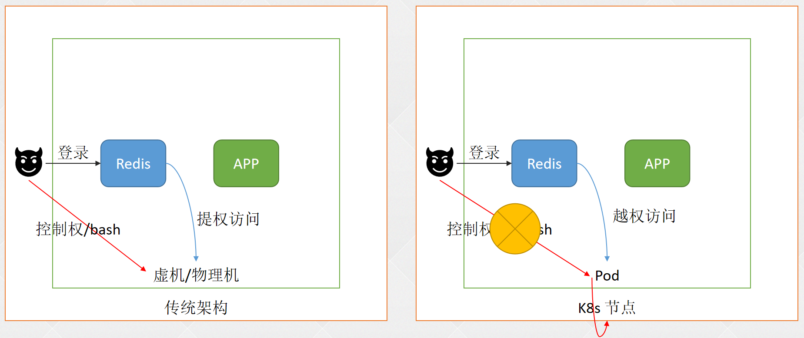

临时容器

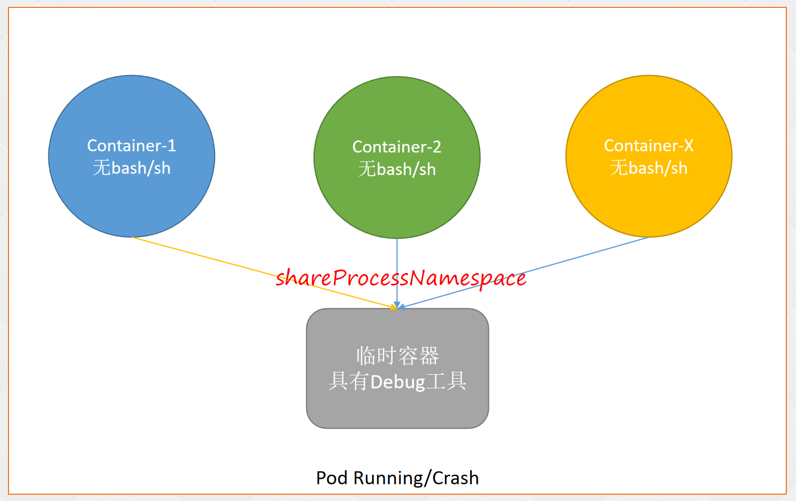

开启临时容器

```
vi /usr/lib/systemd/system/kube-apiserver.service
--feature-gates=EphemeralContainers=true

vi /usr/lib/systemd/system/kube-controller-manager.service
--feature-gates=EphemeralContainers=true

vi /usr/lib/systemd/system/kube-scheduler.service
--feature-gates=EphemeralContainers=true
vi /usr/lib/systemd/system/kube-proxy.service
--feature-gates=EphemeralContainers=true

vi /etc/kubernetes/kubelet-conf.yml
featureGates:
  EphemeralContainers: true

重启所有服务
```


临时容器使用

K8s 1.16+ https://kubernetes.io/docs/concepts/workloads/pods/ephemeral-containers/

K8s 1.18+  kubectl alpha debug redis-new-5b577b46c7-2jv4j -ti --image=registry.cn-beijing.aliyuncs.com/dotbalo/debug-tools

K8s 1.20+  kubectl debug redis-new-5b577b46c7-2jv4j -ti --image=registry.cn-beijing.aliyuncs.com/dotbalo/debug-tools

kubectl debug node/k8s-node01 -it --image=registry.cn-beijing.aliyuncs.com/dotbalo/debug-tools


# 准入控制

## 资源限制LimitRange

只有ResourceQuota是不够的

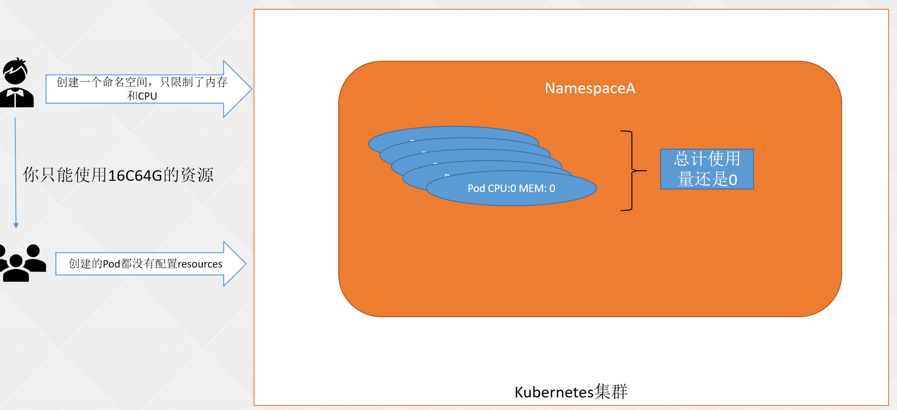

LimitRange做了什么

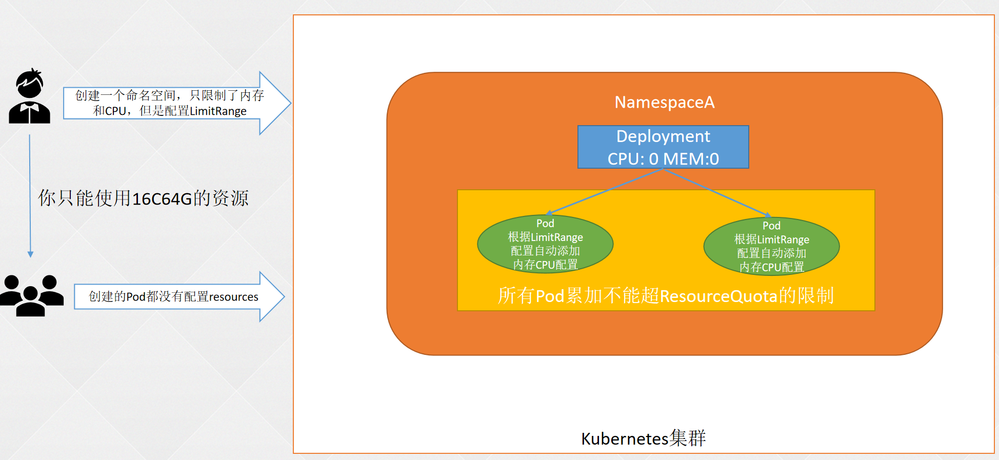


LimitRange配置示例：默认的requests和limits

```
apiVersion: v1
kind: LimitRange
metadata:
  name: cpu-mem-limit-range
spec:
  limits:
  - default:
      cpu: 1
      memory: 512Mi
    defaultRequest:
      cpu: 0.5
      memory: 256Mi
    type: Container
```

```
default：默认limits配置
defaultRequest：默认requests配置
```

LimitRange配置示例：requests和limits的范围

```
apiVersion: v1
kind: LimitRange
metadata:
  name: cpu-min-max-demo-lr
spec:
  limits:
  - max:
      cpu: "800m"
      memory: 1Gi
    min:
      cpu: "200m"
      memory: 500Mi
    type: Container
```

max：内存CPU的最大配置min：内存CPU的最小配置


LimitRange配置示例：限制申请存储空间的大小

```
apiVersion: v1
kind: LimitRange
metadata:
  name: storagelimits
spec:
  limits:
  - type: PersistentVolumeClaim
    max:
      storage: 2Gi
    min:
      storage: 1Gi
```

max：最大PVC的空间

min：最小PVC的空间


## 服务质量QoS

Resources配置的重要性

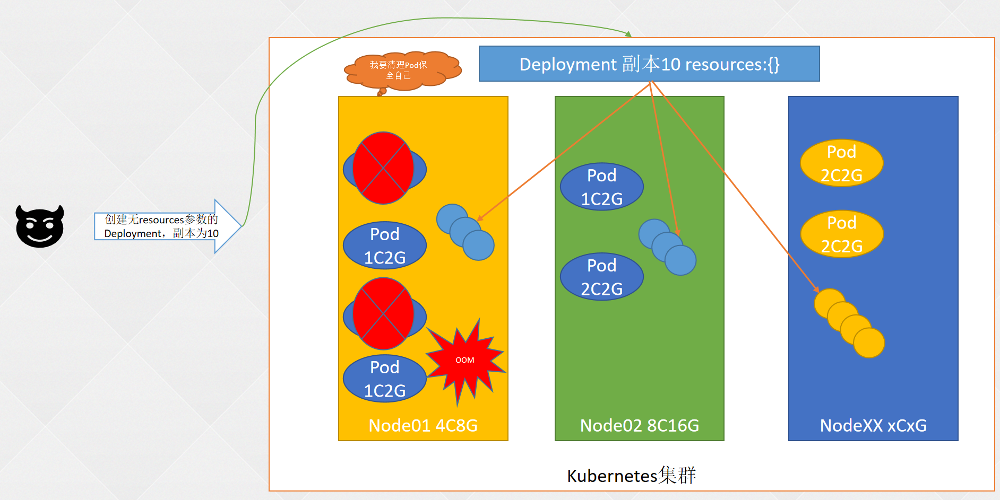

Resources也并非万能

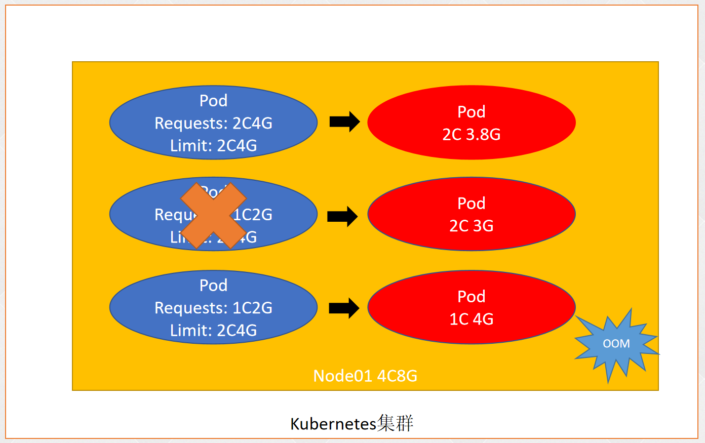


服务质量QoS

```
Guaranteed：最高服务质量，当宿主机内存不够时，会先kill掉QoS为BestEffort和Burstable的Pod，如果内存还是不够，才会kill掉QoS为Guaranteed，该级别Pod的资源占用量一般比较明确，即requests的cpu和memory和limits的cpu和memory配置的一致。

Burstable： 服务质量低于Guaranteed，当宿主机内存不够时，会先kill掉QoS为BestEffort的Pod，如果内存还是不够之后就会kill掉QoS级别为Burstable的Pod，用来保证QoS质量为Guaranteed的Pod，该级别Pod一般知道最小资源使用量，但是当机器资源充足时，还是想尽可能的使用更多的资源，即limits字段的cpu和memory大于requests的cpu和memory的配置。

BestEffort：尽力而为，当宿主机内存不够时，首先kill的就是该QoS的Pod，用以保证Burstable和Guaranteed级别的Pod正常运行。
```


示例1：实现QoS为Guaranteed的Pod

```
apiVersion: v1
kind: Pod
metadata:
  name: qos-demo
  namespace: qos-example
spec:
  containers:
  - name: qos-demo-ctr
    image: nginx
    resources:
      limits:
        memory: "200Mi"
        cpu: "700m"
      requests:
        memory: "200Mi"
        cpu: "700m"

```

Pod中的每个容器必须指定limits.memory和requests.memory，并且两者需要相等；

Pod中的每个容器必须指定limits.cpu和limits.memory，并且两者需要相等。


示例2：实现QoS为Burstable的Pod

```
apiVersion: v1
kind: Pod
metadata:
  name: qos-demo-2
  namespace: qos-example
spec:
  containers:
  - name: qos-demo-2-ctr
    image: nginx
    resources:
      limits:
        memory: "200Mi"
      requests:
        memory: "100Mi"
```


Pod不符合Guaranteed的配置要求；

Pod中至少有一个容器配置了requests.cpu或requests.memory。


示例3：实现QoS为BestEffort的Pod

```
apiVersion: v1
kind: Pod
metadata:
  name: qos-demo-3
  namespace: qos-example
spec:
  containers:
  - name: qos-demo-3-ctr
    image: nginx
```

不设置resources参数


## 资源配额ResourceQuota

资源配额的重要性

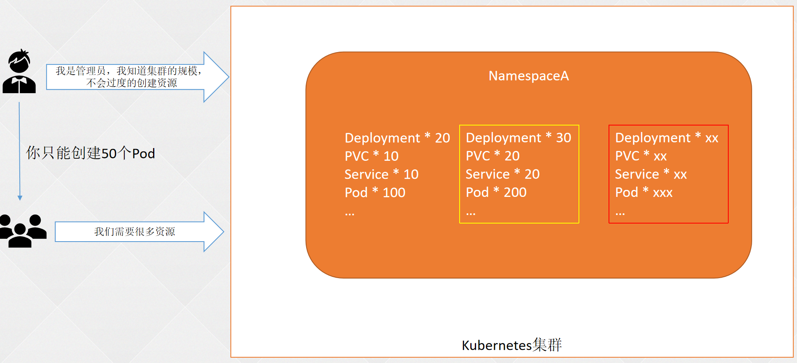

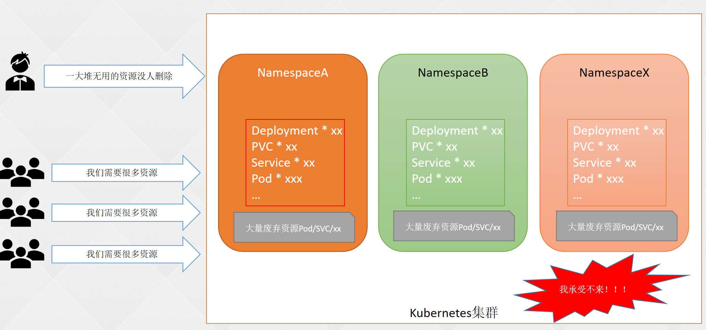

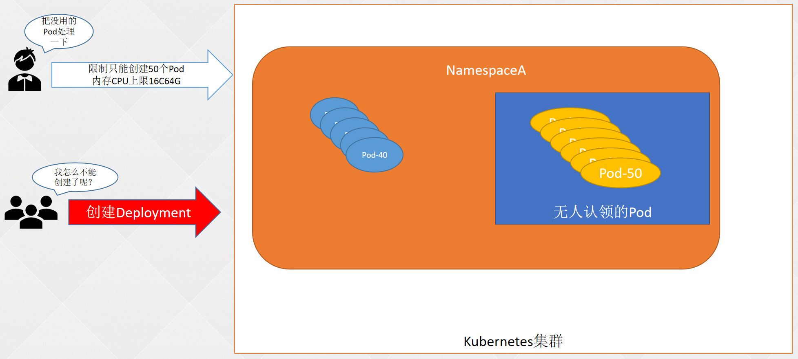

ResourceQuota配置

```
apiVersion: v1
kind: ResourceQuota
metadata:
  name: resource-test
  labels:
    app: resourcequota
spec:
  hard:
    pods: 50
    requests.cpu: 0.5
    requests.memory: 512Mi
    limits.cpu: 5
    limits.memory: 16Gi
    configmaps: 20
    requests.storage: 40Gi
    persistentvolumeclaims: 20
    replicationcontrollers: 20
    secrets: 20
    services: 50
    services.loadbalancers: "2"
    services.nodeports: "10"

```


pods：限制最多启动Pod的个数

requests.cpu：限制最高CPU请求数

requests.memory：限制最高内存的请求数

limits.cpu：限制最高CPU的limit上限

limits.memory：限制最高内存的limit上限


# 细粒度权限控制

## 权限管理RBAC

细粒度权限划分

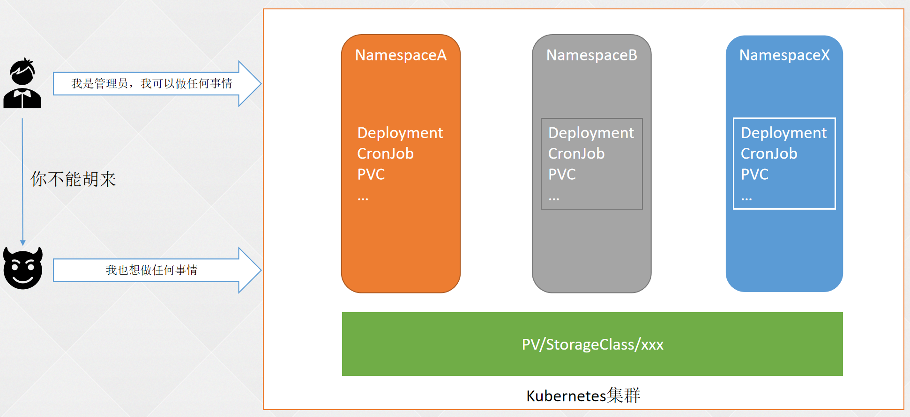

RBAC

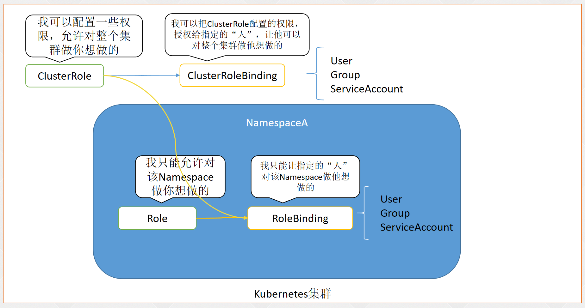

RBAC常用示例

pods/exec	https://kubernetes.io/zh/docs/reference/access-authn-authz/rbac/


Role和ClusterRole

```
kind: Role
apiVersion: rbac.authorization.k8s.io/v1
metadata:
  namespace: default
  name: pod-reader
rules:
- apiGroups: [""] # "" indicates the core API group
  resources: ["pods"]
  verbs: ["get", "watch", "list"]
```


kind：定义资源类型为Role

API Version：定义该资源的API版本，建议使用v1版本，因为其它版本如beta版本在Kubernetes1.22+将被彻底启用

metadata：元数据定义

​	namespace：因为Role是作用单个Namespace下的，具有命名空间隔离，所以需要制定Namespace，不指定则为default

​	name：Role的名称

rules：定义具体的权限，切片类型，可以配置多个

​	API Groups：包含该资源的apiGroup名称，比如extension

​	resources：定义对哪些资源进行授权，切片类型，可以定义多个，比如pods、service等

​	verbs：定义可以执行的操作，切片类型，可以定义多个，比如create、delete、list、get、watch、deletecollection等


RoleBinding和ClusterRoleBinding

```
kind: RoleBinding
apiVersion: rbac.authorization.k8s.io/v1
metadata:
  name: read-pods
  namespace: default
subjects:
- kind: User
  name: jane # Name is case sensitive
  apiGroup: rbac.authorization.k8s.io
roleRef:
  kind: Role
  name: pod-reader
  apiGroup: rbac.authorization.k8s.io
```

roleRef：绑定的类别

​	kind：指定权限来源，可以是Role或ClusterRole

​	name：Role或ClusterRole的名字

​	apiGroup：API 组名

subjects：配置被绑定对象，可以配置多个

​	kind：绑定对象的类别，当前为User，还可以是Group、ServiceAccount

​	name：绑定对象名称


聚合ClusterRole

```
kind: ClusterRole
apiVersion: rbac.authorization.k8s.io/v1
metadata:
  name: monitoring
aggregationRule:
  clusterRoleSelectors:
  - matchLabels:
      rbac.example.com/aggregate-to-monitoring: "true"
rules: []


kind: ClusterRole
apiVersion: rbac.authorization.k8s.io/v1
metadata:
  name: monitoring-endpoints
  labels:
    rbac.example.com/aggregate-to-monitoring: "true"
# These rules will be added to the "monitoring" role.
rules:
- apiGroups: [""]
  resources: ["services", "endpoints", "pods"]
  verbs: ["get", "list", "watch"]
```


## 权限管理RBAC企业实战

细粒度权限划分

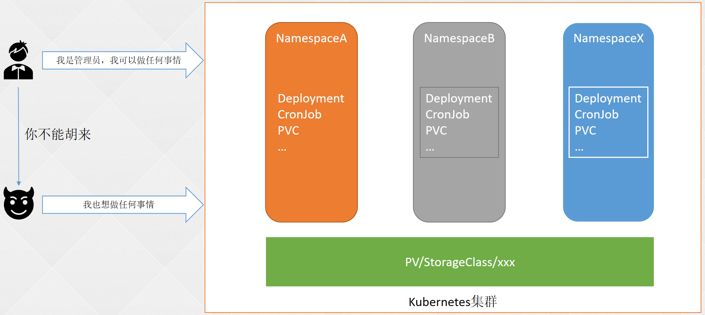


如何进行授权？

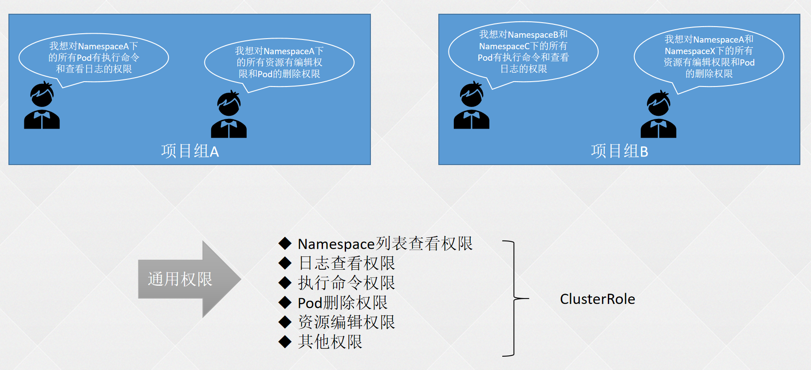

如何进行用户管理？

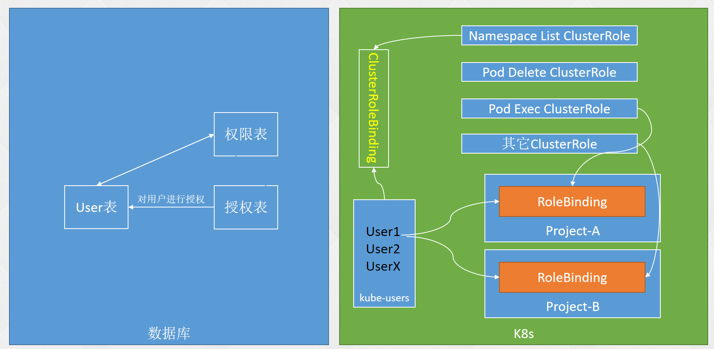

RBAC企业实战：不同用户不同权限

需求：    

​	用户dotbalo可以查看default、kube-system下Pod的日志

​	用户dukuan可以在default下的Pod中执行命令，并且可以删除Pod

```
apiVersion: rbac.authorization.k8s.io/v1
kind: ClusterRole
metadata:
  name: namespace-readonly
rules:
- apiGroups:
  - ""
  resources:
  - namespaces
  verbs:
  - get
  - list
  - watch
- apiGroups:
  - metrics.k8s.io
  resources:
  - pods
  verbs:
  - get
  - list
  - watch

```


```
apiVersion: rbac.authorization.k8s.io/v1
kind: ClusterRole
metadata:
  name: pod-delete
rules:
- apiGroups:
  - ""
  resources:
  - pods
  verbs:
  - get
  - list
  - delete

```


```
apiVersion: rbac.authorization.k8s.io/v1
kind: ClusterRole
metadata:
  name: pod-exec
rules:
- apiGroups:
  - ""
  resources:
  - pods
  verbs:
  - get
  - list
- apiGroups:
  - ""
  resources:
  - pods/exec
  verbs:
  - create

```


```
apiVersion: rbac.authorization.k8s.io/v1
kind: ClusterRole
metadata:
  name: pod-log
rules:
- apiGroups:
  - ""
  resources:
  - pods
  - pods/log
  verbs:
  - get
  - list
  - watch

```


RBAC企业实战：不同用户不同权限

创建用户管理命名空间：kubectl create ns kube-users

绑定全局命名空间查看权限：kubectl create clusterrolebinding namespace-readonly \--clusterrole=namespace-readonly  --serviceaccount=system:serviceaccounts:kube-users

创建用户：kubectl create sa dotbalo dukuan -n kube-users

绑定权限：kubectl create rolebinding dotbalo-pod-log \--clusterrole=pod-log   --serviceaccount=kube-users:dotbalo --namespace=kube-systemkubectl create rolebinding dotbalo-pod-log \--clusterrole=pod-log   --serviceaccount=kube-users:dotbalo --namespace=defaultkubectl create rolebinding dukuan-pod-exec \--clusterrole=pod-exec   --serviceaccount=kube-users:dukuan --namespace=defaultkubectl create rolebinding dukuan-pod-delete \--clusterrole=pod-delete   --serviceaccount=kube-users:dukuan --namespace=default


## RBAC实践

1. 创建一个名为deployment-clusterrole的clusterrole

a) 该clusterrole只允许创建Deployment、Daemonset、Statefulset的create操作

2. 在名字为app-team1的namespace下创建一个名为cicd-token的serviceAccount，并且将上一步创建clusterrole的权限绑定到该serviceAccount

 

创建namespace和serviceAccount

```
[root@k8s-master01 examples]# kubectl  create ns app-team1
namespace/app-team1 created
You have new mail in /var/spool/mail/root
[root@k8s-master01 examples]# kubectl  create sa cicd-token -n app-team1
serviceaccount/cicd-token created
```

创建clusterrole

```
[root@k8s-master01 ~]# cat dp-clusterrole.yaml 
apiVersion: rbac.authorization.k8s.io/v1
kind: ClusterRole
metadata:
  # "namespace" omitted since ClusterRoles are not namespaced
  name: deployment-clusterrole
rules:
- apiGroups: ["extensions", "apps"]
  #
  # at the HTTP level, the name of the resource for accessing Secret
  # objects is "secrets"
  resources: ["deployments","statefulsets","daemonsets"]
  verbs: ["create"]
[root@k8s-master01 ~]# kubectl create -f dp-clusterrole.yaml 
clusterrole.rbac.authorization.k8s.io/deployment-clusterrole created
```

绑定权限

```
[root@k8s-master01 ~]# kubectl create rolebinding deployment-rolebinding --clusterrole=deployment-clusterrole --serviceaccount=app-team1:cicd-token -n app-team1
```

或者

```
apiVersion: rbac.authorization.k8s.io/v1
kind: RoleBinding
metadata:
  name: deployment-rolebinding
  namespace: app-team1
roleRef:
  apiGroup: rbac.authorization.k8s.io
  kind: ClusterRole
  name: deployment-clusterrole
subjects:
- kind: ServiceAccount
  name: cicd-token
  namespace: app-team1
```

创建deployment

```
apiVersion: apps/v1
kind: Deployment
metadata:
  name: nginx
  namespace: app-team1
spec:
  progressDeadlineSeconds: 600
  replicas: 1
  revisionHistoryLimit: 10
  selector:
    matchLabels:
      app: nginx
  strategy:
    rollingUpdate:
      maxSurge: 25%
      maxUnavailable: 25%
    type: RollingUpdate
  template:
    metadata:
      creationTimestamp: null
      labels:
        app: nginx
    spec:
      containers:
      - image: nginx
        imagePullPolicy: Always
        name: nginx
        resources: {}
        terminationMessagePath: /dev/termination-log
        terminationMessagePolicy: File
      - image: redis
        imagePullPolicy: Always
        name: redis
      restartPolicy: Always
```

