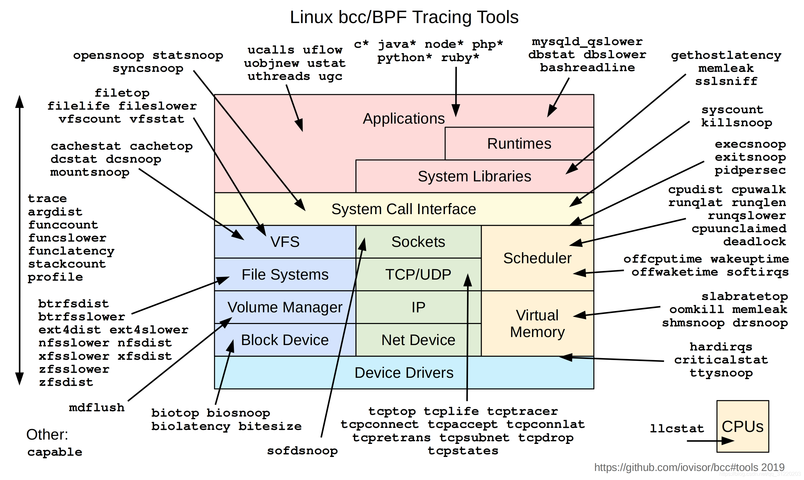
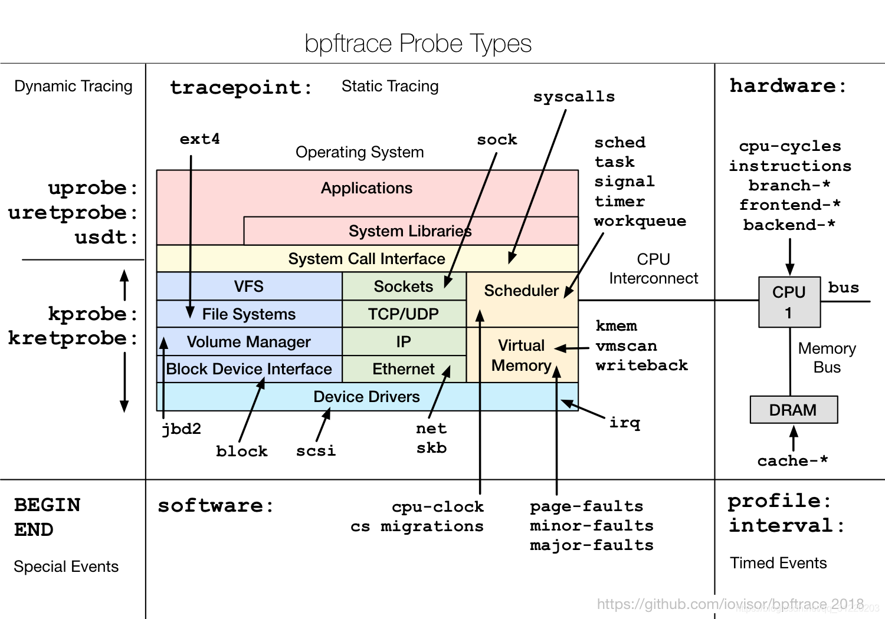
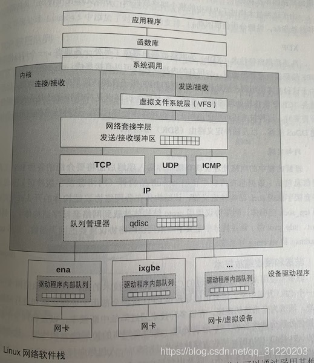

# 安装使用

使用aptitude进行安装：aptitude是一个交互式的软件包管理器，它可以更好地处理软件包之间的依赖关系。如果您还没有安装aptitude，请运行以下命令安装它。

```sh
apt-get install bpfcc-tools linux-headers-$(uname -r) -y //安装bcc
apt-get install bpftrace -y //安装bpftrace
```

1、验证bcc工具，[iovisor/bcc项目地址](https://github.com/iovisor/bcc)

```sh
root@l:~# biolatency.bt
/usr/sbin/biolatency.bt:17-19: WARNING: blk_account_io_start is not traceable (either non-existing, inlined, or marked as "notrace"); attaching to it will likely fail
/usr/sbin/biolatency.bt:22-24: WARNING: blk_account_io_done is not traceable (either non-existing, inlined, or marked as "notrace"); attaching to it will likely fail
Attaching 4 probes...
ERROR: Could not resolve symbol: /proc/self/exe:BEGIN_trigger
```

2、验证bpftrace工具，[iovisor/bpftrace项目地址](https://github.com/iovisor/bpftrace)

```sh
root@l:~# bpftrace --version
bpftrace v0.14.0
```

- 配套资源 https://github.com/brendangregg/bpf-perf-tools-book

**其他方式**

centos 安装

```sh
curl https://repos.baslab.org/bpftools.repo --output /etc/yum.repos.d/bpftools.repo
yum install bpftrace bpftrace-tools bpftrace-doc bcc-static bcc-tools bpftool
```

- bcc安装完成工具在/usr/share/bcc/tools
- bpftrace地址/usr/share/bpftrace/tools
- export PATH=$PATH:/usr/share/bcc/tools:/usr/share/bpftrace/tools

## 隐藏警告信息

要隐藏bpftrace和bcc工具输出时的警告信息，可以在运行命令时使用2>/dev/null将标准错误重定向到空设备。

例如，使用2>/dev/null的命令如下所示：

```sh
opensnoop-bpfcc 2>/dev/null
```

如果你想在`bpftrace`或`bcc`工具中完全关闭警告，那可能需要修改这些工具的源代码或配置，但这通常不推荐，因为警告通常有其存在的原因。


# 第一章 引言
BPF提供了一种在各种内核时间和应用程序事件发生时运行一段小程序的机制。由指令集、存储对象和辅助函数等几部分组成。应用领域分别是网络、可观测性和安全。
跟踪(tracing)是基于事件记录。嗅探(snoop)、时间记录和跟踪，通常指的是一回事。
采样(sampling)：通过获取全部观测量的子集来描绘目标的大致图像；这也被称为生成性能剖析样本或profiling。有一个BPF工具就叫profile，它基于计时器来对运行中的代码定时采样。
可观测性(observability)：通过全面观测来理解一个系统，可以实现这一目标的工具可以归类为可观测工具。
BCC(BPF编辑器集合，BPF Compiler Collection)是最早用于开发BPF跟踪程序的高级框架。它提供了一个编写内核BPF程序的C语言环境，同时还提供了其他高级语言环境来实现用户端接口。
bpftrace是一个新近出现的前端，它提供了专门用于创建BPF工具的高级语言支持。

```shell
bpftrace -e 'tracepoint:syscalls:sys_enter_open { printf("%s %s\n",comm,str(args->filename)); }'

bpftrace -l 'tracepoint:syscalls:sys_enter_open*'
bpftrace -e 'tracepoint:syscalls:sys_enter_open*{@[probe]=count();}'
```

bpftrace在编写功能强大的单行程序、短小的脚本方面甚为理想；BCC则更适合开发复杂的脚本和作为后台进程使用，它还可以调试其他库的支持。

- ​	动态插桩：kprobes和uprobes

  - 可能存在由于软件改名而动态插桩不可用

- ​	静态插桩：tracepoint和USDT。

  - 将稳定的事件名字编码到软件代码中






# 第二章 扩展版BPF
- BPF指令通过BPF验证器验证，再由BPF虚拟机执行。BPF虚拟机的实现既包括一个解释器【非即时编译】，又包括一个JIT编译器：JIT编译器负责生成处理器可直接执行的机器指令。验证器会拒绝那些不安全的操作，这包括针对无界循环的检查。BPF程序必须在有限时间内完成。

- BPF可以利用辅助函数获取内核状态，利用BPF映射表进行存储。BPF程序在特定时间发生时执行，包括kprobes、uprobes和跟踪点等信息。

- BPF具有高效率和生产环境安全性等特点，它已经内置在Linux内核中。有了BPF，就可以在生产环境中直接运行这些工具，而无需增加新的内核组件。

- BPF指令集查看：bpftool

```sh
bpftool prog show
bpftool prog dump xlated id 36
bpftool prog dump xlated id 37 opcodes
```

- bpftrace查看BPF指令集

```sh
bpftrace -v /usr/share/bpftrace/tools/biolatency.bt
```

- 调用栈回溯

  - 基于栈指针的调用栈回溯

  - 调试信息

  - 最后分支记录LBR，目前BPF不支持

  - ORC：oops回滚能力

  - 符号：调用栈信息目前在内核中是以地址数组形式记录的，这些地址可以通过用户态的程序翻译为符号（比如函数的名字）

- 火焰图

  - Linux的perf剖析器将其样本摘要为调用树格式，显示每个分支所占的百分比。

  - BCC的profile工具则采用了另外一种摘要方式：对每个独特的调用栈分别计数。

- 事件源

  - kprobes：内核动态插桩支持。可以对任何内核函数进行插桩，它还可以对函数内部的指令进行插桩。kretprobes可以用来对内核函数的返回进行插桩以获得返回值。当用kprobes和kretprobes对同一个函数进行插桩时，可以使用时间戳来记录函数执行时长。过程如下
    - 将在要插桩的目标地址中的字节内容复制并保存（为的是给单步断点指令腾出位置）

    - 以单步中断指令覆盖目标地址：在x86_64上是int3指令。（如果kprobes开启了优化，则使用jmp指令）

    - 当指令流执行到断点时，断点处理函数会检查这个断点是否是由kprobes注册的，如果是，就会执行kprobes处理函数。

    - 原始的指令会接着执行，指令流继续。

    - 当不再需要kprobes时，原始的字节内容会被复制回目标地址上，这样这些指令就回到了它们的初始状态。

    - ```
    bpftrace -e 'kprobe:vfs_* {@[probe]=count();}'
	
	- uprobes：用户态程序动态插桩。uprobes可以在用户态程序的函数入口、特定偏移处，以及函数返回处进行插桩。
	
	
	- 过程：和kprobes类似。将一个快速断点指令插入目标指令处，该指令将执行转交给uprobes处理函数。当不再需要uprobes时，目标指令会恢复为原来的样子。
	
	  ```sh
	  perf top 
	  find / -name 'libc-2.17.so'
	  
	  #/usr/lib64/libc-2.17.so
	  bpftrace -l 'uprobe:/usr/lib64/libc-2.17.so:gethost*'
	  bpftrace -e 'uprobe:/usr/lib64/libc-2.17.so:gethost*{@[probe]=count();}'
	  ```
	
	- 跟踪点tracepoints：对内核进行静态插桩。内核开发者在内核函数中的特定逻辑位置处，有意放置了这些插桩点；然后这些跟踪点会被编译到内核的二进制文件中。原理如下：
	
	  - 在内核编译阶段会在跟踪点位置插入一条不做任何具体工作的指令。在x86_64架构上，这是一个5字节nop指令。这个长度的选择是为了确保以后可以将它替换为一个5字节的jump指令。
	
	  - 在函数尾部会插入一个跟踪点处理函数，也叫做蹦床函数。这个函数会遍历一个存储跟踪点探针回调函数的数组。（之所以叫蹦床函数，是因为在执行过程中函数会跳入，然后再跳出这个处理函数）。
	
	  - 在执行过程中,当某个跟踪器启用跟踪点时（该跟踪点可能已经被其他跟踪器所启用）
	
	    - 在跟踪点回调函数数组中插入一条新的跟踪器回调函数，以RCU形式进行同步更新。
	    - 如果之前跟踪点处于禁用状态，nop指令地址会重写为跳转到蹦床函数的指令。
	
	  - 当跟踪器禁用某个跟踪点时：
	
	    - 在跟踪点回调函数数组中删除该跟踪器的回调函数，并且以RCU形式进行同步更新。
	
	    - 如果最后一个回调函数也被去除了，那么jmp指令再重写为nop指令。
	
	    - > RCU(Read-Copy Update)机制：首先将需要修改的内容复制出一份副本，然后在副本上进行修改操作。在写者进行修改操作的过程中，旧数据没有做任何更新，不会产生读写竞争，因此依然可以被读者并行访问。当写者修改完成后，写者直接将新数据内存地址替换掉旧数据的内存地址，由于内存地址替换操作是原子的，因此可以保证读写不会产生冲突。内存地址替换后，原有读者访问旧数据，新的读者将访问新数据。当原有读者访问完旧数据，进入静默期后，旧数据将被写者删除回收。当然，通常写者只进行更新、删除指针操作，旧数据内存的回收由另一个线程完成。
	
	  - bpftrace -e 'tracepoint:sched:sched_process_exec {printf("exec by %s\n",comm);}'
	
	- USDT:用户预定义静态跟踪提供了一个用户空间版的跟踪点机制。需要被添加到源代码并编译到最终的二进制文件中，在插桩点留下nop指令，在ELF notes段中存放元数据。
	
	- 原理：当编译应用程序时，在USDT探针的地址放置一个nop指令。在插桩时，这个地址会由内核使用uprobes动态将其修改为一个断点指令。
	
	- 动态USDT：java略
	
	- PMC性能监控计数器。
	
	  - 模式
	
	    - 计数：PMC能够跟踪事件发生的频率。
	
	    - 溢出采样：PMC在所监控的事件发生到一定次数时通知内核，这样内核可以获得额外的状态。监控的事件可能会以每秒百万、亿级别的频率发生，如果对每次事件都进行中断会导致系统性能下降到不可用。解决方案就是利用一个可编程的计数器进行采样，具体来说，是当计数器溢出时就向内核发送信号（比如每10000次LLC缓存未命中事件，或者每百万次阻塞的指令时钟周期）。
	
	  - 采样模式对BPF跟踪来说更值得关注，因为它产生的事件给BPF程序提供了执行的时机。BCC和bpftrace都支持PMC事件跟踪。
	
	- perf_events：perf所依赖的采样和跟踪机制。

# 第三章 性能分析
- 目标：改进最终用户的体验以及降低运行成本。

- 目标量化：延迟、速率、吞吐量、利用率、成本。

- 业务负载画像：理解实际运行的业务负载。推荐步骤如下：

  - 负载是谁产生的（比如，进程ID、用户ID、进程名、IP地址）？

  - 负载为什么会产生（代码路径、调用栈、火焰图）？

  - 负载的组成是什么（IOPS、吞吐量、负载类型）？

  - 负载怎样随着时间发生变化（比较每个周期的摘要信息）？

  - ```sh
    vfsstat
    bpftrace -e 'kprobe:vfs_read {@[comm] = count();}'
    ```

- 下钻分析：从一个指标开始，然后将这个指标拆分成多个组成部分，再将最大的组件进一步拆分为更小的组件，不断重复这个过程直到定位出一个或多个根因。推荐步骤如下

  - 从业务最高层级开始分析
  - 检查下一层次的细节
  - 挑出最感兴趣的部分或者线索。
  - 如果问题没有解决，跳转到第二步。
  - USE方法论：针对每一个资源，分别去检查：使用率、饱和度、错误。
  - 检查清单发：列出一系列工具和指标，用于对照运行和检查。
  - Linux60秒分析

- ```sh
  uptime # 平均负载
  dmesg|tail # 系统日志
  vmstat 1 # r CPU正在执行和等待执行的进程数量。不包括I/O
  mpstat -P ALL 1 # 将每个CPU分解到各个状态下的时间打印出来。
  pidstat 1 # 按每个进程展示CPU的使用情况
  iostat -xz 1 # 显示存储设备的I/O指标
  free -m
  sar -n DEV 1 # 网络设备指标
  sar -n TCP,ETCP 1 # TCP指标和TCP错误信息。active/s 本地发起的TCP连接数/s。passive/s 远端发起的TCP连接数/s。 retrans/s TCP重传数/s
  top
  ```

- BCC工具检查列表

- ```sh
  execsnoop # 跟踪execve系统调用
  opensnoop # 跟踪open系统调用,包括打开文件的路径、打开操作是否成功
  ext4slower(或者brtfs*、xfs*、zfs*) # 跟踪ext4文件系统的常见操作
  biolatency # 跟踪磁盘I/O延迟
  biosnoop # 将每一次磁盘I/O请求打印出来，包含延迟之类的细节信息。
  cachestat # 展示文件系统缓存的统计信息。
  tcpconnect
  tcpaccept
  tcpretrans
  runqlat # 线程等待CPU运行的时间进行统计
  profile # CPU剖析器，可以用来理解那些代码路径消耗了CPU资源。周期性的对调用栈进行采样，然后将消重后的调用栈连同出现的次数一起打印出来。
  ```

# 第四章 BCC
- funccount:对事件--特别是函数调用--进行计数

- ```sh
  funccount [-h] [-p PID] [-i INTERVAL] [-d DURATION] [-T] [-r] [-D] pattern
  Count all malloc() calls in libc:
  #funccount c:malloc
  
  展示每秒块I/O事件的数量
  #funccount -i 1 't:block:*'
  展示每秒libc中getaddrinfo()（域名解析）函数的调用次数
  #funccount -i 1 c:getaddrinfo
  对libgo中全部的“os.*”调用进行计数
  #funccount 'go:os.*'
  u:lib:name 对lib库中名为name的USDT探针进行插桩
  path:name 对位于path路径下文件中的用户态函数name()进行插桩
  ```
  
- stackcount:对导致某事件发生的函数调用栈进行计数。stackcount可以回答如下问题：

  - 某个事件为什么会被调用？调用的代码路径是什么？
  - 有哪些不同的代码路径会调用该事件，它们的调用频次如何。

- ```sh
  火焰图
  stackcount -fP -D 10 ktime_get>out.stackcount01.txt
  git clone https://github.com/brendangregg/FlameGraph.git
  cd FlameGraph
  /Users/junmo/www/FlameGraph/flamegraph.pl --hash --bgcolors=grey < out.stackcount01.txt > out.stackcount01.svg
  
  #对创建块I/O的函数调用栈进行计数
  stackcount t:block:block_rq_insert
  #对发送IP数据包的调用栈进行计数
  stackcount ip_output
  #对导致线程阻塞并且导致脱离CPU的调用栈进行计数
  stackcount t:sched:sched_switch
  #对导致系统调用read()的调用栈进行计数
  stackcount t:syscalls:sys_enter_read
  ```

- trace是一个BCC多用途工具，可以针对多个数据源进行每个事件的跟踪，支持kprobes、uprobes、跟踪点和USDT探针。

  - 它可以回答如下解决问题：
    - 当某个内核态/用户态函数被调用时，调用参数是什么？
    - 这个函数的返回值是什么？调用失败了吗？
    - 这个函数是如何被调用的？相应的用户态或内核态函数调用栈是什么？
    - 因为trace会对每个事件产生一行输出，因此它比较适用于低频事件。对于高频事件，可以采用过滤表达式，只打印感兴趣的事件。

```sh
#arg2是do_sys_open()函数的第二个参数,打印文件名
trace 'do_sys_open "%s",arg2' 
#跟踪内核函数do_sys_open(),并打印返回值
trace 'r::do_sys_open "ret: %d", retval'
#跟踪do_nanosleep()，并且打印用户态的调用栈
trace -U 'do_nanosleep "mode: %d",arg2'
#跟踪通过pam库进行身份鉴别的请求
trace 'pam:pam_start "%s: %s",arg1,arg2'
#bcc使用系统头文件和内核头文件来获取结构体信息
trace 'do_nanosleep(struct hrtimer_sleeper *t) "task: %x",t->task'
trace -I 'net/sock.h' 'udpv6_sendmsg(struct sock *sk) (sk->sk_dport == 13568)'
```

- argdist:针对函数调用参数分析的多用途工具

  - $retval:函数的返回值
  - $latency:从进入到返回的时长，单位是纳秒
  - $entry(param):在探针进入(entry)时param的值。
```sh
argdist -H 'r::__tcp_select_window():int:$retval'
#将内核函数vfs_read的返回值以直方图的形式打印出来
argdist -H 'r::vfs_read()'
#以直方图对pid为1005的进程的用户态调用libc的read()函数的返回值（size）进行统计输出
argdist -p 1005 -H 'r:c:read()'
#Aggregate interrupts by interrupt request (IRQ)
argdist -C 't:irq:irq_handler_entry():int:args->irq'
```

# 第五章 bpftrace

[bpftrace 官方文档](https://github.com/iovisor/bpftrace/blob/master/docs/reference_guide.md) | [bpftrace一行教程](https://github.com/iovisor/bpftrace/blob/master/docs/tutorial_one_liners_chinese.md)

## 用法

命令：

```sh
bpftrace -e program
```

将执行程序，检测它定义的任何事件。程序将一直运行到Ctrl-C，

或者直到它显式调用exit（）。作为-e参数运行的bpftrace程序称为一行程序。

或者，程序可以保存到文件中，并使用以下方法执行：

```sh
bpftrace file.bt //.bt扩展名不是必需的，但有助于以后识别。
```

该文件可以成为可执行的（chmod +x 文件.bt），并像任何其他程序一样运行：

```
./file.bt
```

bpf程序指定解释器：

```sh
#/usr/local/bin/bpftrace //位置可能有变化
```
示例：
```sh
# 设置@ID变量，interval设置时间间隔，s时间单位，2秒
bpftrace -e 'kprobe:vfs_read { @ID = pid ; } interval:s:2 { printf("ID:%d\n",@ID); } '

#展示新进程的创建，以及参数信息
bpftrace -e 'tracepoint:syscalls:sys_enter_execve {printf("%s -> %s\n",comm,str(args->filename))}'
#或
bpftrace -e 'tracepoint:syscalls:sys_enter_execve {join(args->argv)}'
#展示进程的磁盘I/O尺寸
bpftrace -e 'tracepoint:block:block_rq_issue {printf("%d %s %d\n",pid,comm,args->bytes)}'
# 
bpftrace -e 'kprobe:vfs_read { @start[pid] = nsecs } kretprobe:vfs_read /@start[pid]/ { @ns[comm] = nsecs - @start[pid]; delete(@start[pid])}
```

- 探针格式：
- kprobe对内核进行插桩，只需要一个标识符：内核函数名
- uprobe对用户态函数进行插桩，需要两个标识符：二进制文件的路径和函数名
- 可以使用逗号将多个探针并列，指向同一个执行动作。

```sh
#!/usr/bin/bpftrace
BEGIN
{
        printf("Hello world!\n");
}

END
{
        printf("Game over!\n");
}

kprobe:vfs_read
{
        @start[tid] = nsecs; //变量
}

kretprobe:vfs_read
/@start[tid]/ // 过滤器
{
        $duration_us = (nsecs - @start[tid]) / 1000;
        @us[pid,comm] = hist($duration_us);
        delete(@start[tid]);
}
```

## 变量

- 内置变量：由bpftrace预先定义好，通常是一个只读的信息源

- 临时变量：被用于临时计算，字首加"$"作为前缀。

- 映射表变量：使用BPF映射表来存储对象，名字带有"@"前缀。它们可以用作全局存储，在不同动作之间传递数据。

## 探测

| 探针类型   | 缩写 | 描述                     |
| ---------- | ---- | ------------------------ |
| tracepoint | [t]  | 内核静态插桩点           |
| usdt       | [U]  | 用户静态定义插桩点       |
| kprobe     | [k]  | 内核动态函数插桩         |
| kretprobe  | [kr] | 内核动态函数返回值插桩   |
| uprobe     | [u]  | 用户态动态函数插桩       |
| uretprobe  | [ur] | 用户态动态函数返回值插桩 |
| software   | [s]  | 内核软件事件             |
| hardware   | h    | 硬件基于计数器的插装     |
| profile    | p    | 对所有cpu进行定时采样    |
| interval   | i    | 定时报告（来自一个CPU)   |
| BEGIN      |      | bpftrace启动             |
| END        |      | bpftrace退出             |

- 内核软件事件software[s]

```
cpu-clock[cpu] CPU真实时间，默认采样间隔1000000
task-clock CPU任务时间，默认采样间隔1000000
page-faults[faults] 缺页中断，默认采样间隔100
context-switches[cs] 上下文切换，默认采样间隔100
略…
```

- 硬件基于计数器的插桩 hardware[h]

- 对全部CPU进行时间采样 profile[p]
  - ```
    profile:[hz|s|ms|us]:rate；对于全部CPU激活
    ```
  
- 周期性报告(从一个CPU上) interval[i]

```
interval:[s:ms]:rate ;对于一个CPU
```

- BEGIN bpftrace启动

- END bpftrace退出

```sh
bpftrace -lv tracepoint:syscalls:sys_enter_read
```
- bpftrace控制流

```
过滤器 probe /filter/ {action}
```


  - 三元运算符 test ? true_statement : false_statement

  - if 语句 if(test){} else{}

  - 循环展开 unroll(count){statements}

- bpftrace内置变量

```
pid tid uid username								nsecs 时间戳 纳秒
elapsed 时间戳，单位纳秒，字bpftrace启动开始计时		  cpu 处理器ID
comm 进程名										  kstack ustack 调试栈信息
func 被跟踪函数名字									probe 当前探针全名
arg0…argN 跟踪点函数的输入参数0，参数N(N为下标)...		  args.参数名 使用跟踪点的入口参数
retval 跟踪点返回值									ret: 表示函数的返回值
curtask 内核task_struct地址							  cgroup
1,...,N bpftrace程序的位置参数							
```

​    


```sh
# 用户态程序监控，位置，函数名，监控输出内容
bpftrace -e 'uprobe:/home/eBPF/add:adds {printf("ID:%d\n",pid)}'
# 监控函数的入口参数获取
bpftrace -e 'uprobe:/home/eBPF/add:adds {printf("ID:%d,args0:%d\n",pid,arg0)}'


```

- bpftrace函数

```sh
printf()打印 time()时间	str()字符串输出
join #将多个字符串用空格进行连接并打印出来
kstack ustack
ksym usym #地址转换为字符串形式名字
system #执行shell命令
```

- bpftrace映射表的操作函数


```sh
count() sum(int n) avg(int n) min(int n) max(int n)
stats(int n) #返回事假次数、平均值和总和
hist(int n) #打印2的幂方的直方图
lhist(int n,int min,int max,int step) #打印线性直方图,参数分别是value，最小值，最大值，步进值。
delete(@m[key]) #删除key
print(@m[,top[,div]])#打印映射表，top指明只打印最高的top项目，div是一个整数分母，用来将数值整除后输出
bpftrace -e 'k:vfs_* {@[probe] = count();} END {print(@,5);clear(@);}'

clear(@m) #删除映射表中全部的键
zero(@m) #将映射表中所有的值设置为0
```

# 第六章 CPU

## 事件源

- 软中断 irq:softirq* 跟踪点[t:irq:softirq*]
- 硬中断 irq:irq_handler* 跟踪点[t:irq:irq_handler*]
- 运行队列 t:workqueue:*跟踪点
- 定时采样 PMC或是基于定时器的采样器
- CPU电源控制事件 power跟踪点 [t:workqueue:*]
- CPU周期 PMC数据

- 查看所有cpu是否正常使用 mpstat -P ALL
- perf火焰图

```sh
#perf.data
perf record -F 99 -a -g  -o cycle_0526.perf -- sleep 30

#用perf script工具对cycle_0526.perf进行解析
perf script -i cycle_0526.perf &> perf.unfold

#将perf.unfold中的符号进行折叠：
./stackcollapse-perf.pl perf.unfold &> perf.folded

#svg
./flamegraph.pl perf.folded > perf.svg
```

## cpu工具

1、execsnoop 跟踪全系统中新进程执行信息的工具。利用这个工具可以找到消耗大量CPU的短进程，并且可以用来分析软件执行过程，包括启动脚本等。


```sh
#bpftrace版本实现
bpftrace -e 't:syscalls:sys_enter_execve {printf ("%-10u %-5d ",elapsed/1000000,pid);join(args->argv);}'
```

2、exitsnoop 跟踪进程退出事件，打印出进程的总运行时长和退出原因。可以帮助调试短时进程。

3、runqlat: CPU调度延迟分析工具。在需求超过供给，CPU资源处于饱和状态时，这个工具可以用来识别和量化问题的严重性。runqlat利用对CPU调度器的线程唤醒事件和线程上下文切换事件的跟踪来计算线程从唤醒到运行之间的时间间隔。

```sh
runqlat 10 1 # 运行10s，只打印1次。nsecs单位为微秒
#-m 以毫秒为单位输出
#-P 给每个进程打印一个直方图
#--pidnss 给每个PID空间打印一个直方图
#-p PID 指定进程
#-T 输出包含时间戳
```

4、runqlen 采样CPU运队列的长度信息，可以统计有多少线程正在等待运行，并以直方图的方式输出。

```sh
runqlen -C 10 1
#-C 每个CPU输出一个直方图
#-O 运行队列占有率信息，运行队列不为0的时长百分比
#-T 输出时间戳信息
```

5、runqslower 可以列出运行队列中等待延迟超过阈值的线程名字，可以输出受延迟影响的进程名和对应的延时时长。

6、cpudist 用来展示每次线程唤醒之后在CPU上执行的时长分布。在内部跟踪CPU调度器的上下文切换事件，在繁忙的生产环境中发生的频率很高，额外消耗显著，使用时多小心。

7、profile:定时采样调用栈信息并且汇报调用栈出现频率信息。默认以49Hz的频率同时采样所有的CPU的用户态和内核态的调用栈。

```sh
-U 仅输出用户态调用栈信息								-K 仅输出内核态调用栈
-a 在函数名称上加上标记(例如，在内核态函数加上"_[k]")	 -d 在用户态和内核态调用栈之间加上分隔符
-f 以折叠方式输出									  -p PID 仅跟踪给定的进程
```

```sh
profile -af 30 > out.stacks01
./flamegraph.pl --color=java < ../out.stacks01 > out.svg

#核心实现等同于如下bpftrace
bpftrace -e 'profile:hz:49 /pid/ { @samples[ustack,kstack,comm]=count();}'
```

8、offcputime 用于统计线程阻塞和脱离CPU运行的时间，同时输出调用栈信息，以便理解阻塞原因。这个工具正好是profile工具的对立面；这两个工具结合起来覆盖了线程的全部生命周期：profile覆盖在CPU之上运行的分析，而offcputime则分析脱离CPU运行的时间

```sh
-U 仅输出用户态调用栈信息				-K 仅输出内核态调用栈
-u 仅包括用户态线程					  -k 仅包括内核态线程
-f 以折叠方式输出					   -p PID 仅跟踪给定的进程
```

```sh
#内核调用栈5秒的火焰图
offcputime -fKu 5 > out.offcuptime01.txt
./flamegraph.pl --hash --bgcolors=blue --title="OFF-CPU Time Flame Graph" \
< out.offcputime01.txt > out.offcputime01.svg
```

9、syscount 统计系统中的系统调用数量.

```sh
/usr/share/bcc/tools/syscount -LP
bpftrace -e 't:syscalls:sys_enter_*{@[probe]=count();}'
```

10、argdist和trace：针对每个事件自定义处理方法、


```sh
$ tplist -v syscalls:sys_enter_read #获取参数名字
syscalls:sys_enter_read
  int __syscall_nr;
  unsigned int fd;
  char * buf;
  size_t count;

#count read调用缓存的大小
argdist -H 't:syscalls:sys_enter_read():int:args->count'
argdist -H 't:syscalls:sys_exit_read():int:args->ret'

#等价bpftrace程序如下
bpftrace -e 't:syscalls:sys_enter_read {@ = hist(args->count);}'
bpftrace -e 't:syscalls:sys_exit_read {@ = hist(args->ret);}'
#bpftrace针对负值有一个单独的统计区间([...,0])，read的返回值如果是负数就说明出现了错误
#统计出现的错误频率
bpftrace -e 't:syscalls:sys_exit_read /args->ret<0/ {@ = lhist(- args->ret,0,100,1);}'

trace 't:syscalls:sys_enter_execve "-> %s", args->filename'
```

11、funccount 可以统计事件和函数调用频率。此工具是根据函数动态跟踪来统计的：对内核态函数使用kprobes，对用户态函数使用uprobes

```sh
funccount 'tcp_*' # 统计内核以tcp_开头的所有函数
funccount -i 1 get_page_from_freelist

bpftrace -e 'k:tcp_* {@[probe] = count();} interval:s:1{print(@);clear(@);}'
```

12、softirqs 显示系统中软中断消耗的CPU时间。


```sh
bpftrace -e 't:irq:softirq_entry {@[args->vec] = count();}'
```

13、hardirqs 显示系统处理硬中断的时间。

14、cpuwalk.bt 采样每个CPU上运行的进程名，并且以线性直方图的方式输出。

# 第七章 内存

- Linux操作系统采用的虚拟内存机制，每个进程都有自己的虚拟内存地址空间，仅当实际使用内存的时候才会映射到物理内存之上。

- 内存管理机制

  - 页换出守护进程(kswapd):会被定期唤醒，它会批量扫描活跃页的LRU列表和非活跃页的LRU列表以寻找可以释放的内存。当空闲内存低于某个阈值的时候，该进程就会被唤醒，当空闲内存高于另外一个阈值的时才会休息。
  - 物理换页设备(swap device):当系统内存不够时，换页设备允许系统以一种降级模式运行：进程可以继续申请内存，但是不经常使用的页将会被换入换出到对应的换页设备上，但是这一般会导致应用程序运行速度大幅下降。
  - 在极端情况下)直接杀掉内存溢出的进程（OOM Killer）:按预定规则(将除内核关键任务和init(PID 1)进程之外的占用内存最多的进程杀死)杀掉进程。
  - 堆内存：存储在进程虚拟内存地址空间的一段动态区间中的内存
  - 空闲内存列表freelist：内核为每个CPU和DRAM组维护一组空闲内存列表，这样可以直接响应内存分配请求。同时，内核软件本身的内存分配需求也从这个空闲内存列表直接获取，一般通过内核内存分配器进行，例如，slab分配器。
  - 内存页的生命周期:
    - 应用程序发起内存分配请求
    - 应用程序库代码要么直接从空闲列表中响应请求，要么先扩展虚拟内存地址空间再分配。根据内存分配库的不同实现，有以下两种选项：
      - 利用brk()系统调用来扩展堆的尺寸，以便用新的堆地址响应请求。
      - 利用mmap()系统调用来创建一个新的内存段地址。
    - 内存分配之后，应用程序试图使用store/load指令来使用之前分配的内存地址，这就要调用CPU内部的内存管理单元来进行虚拟地址到物理地址的转换。当虚拟地址没有对应的物理地址时，会导致MMU发出一个缺页错误(page fault)。
    - 缺页错误由内核处理。在对应的处理函数中，内核会在物理内存空闲列表中找到一个空闲地址并映射到该虚拟地址。接下来，内存会通知MMU以便未来直接查找该映射。现在用户进程占用了一个物理内存页。进程所使用的全部物理内存数量称为常驻集大小(RSS)。
    - 当系统内存需求超过一定水平时，内核中的页换出守护进程就开始寻找可以释放的内存页。
      - 文件系统页：从磁盘中读出并且是没有被修改过的页（blacked by disk），这些页可以立即释放，需要再读取回来。
      - 被修改过的文件系统页：这些页被称为“脏页”，这些页需要先写回磁盘才能被释放。
      - 应用程序内存页：这些页被称为匿名页(anonymous memory),因为这些页不是来源于某个文件的。如果系统中有换页设备(swap device)，那么这些页可以先存入换页设备，再被释放。将内存页写入换页设备成为换页。
  - 页压缩：内核中有一个压缩程序来移动内存页，以便扩大连续内存。
  - 文件系统缓存和缓冲区：Linux会借用空闲内存作为文件系统的缓存，如果有需要的话会再释放。
  - 事件源

```sh
用户态内存分配  usdt:/usr/lib64/libc-2.28.so:*
内核态内存分配  t:kmem:*
堆内存扩展
共享内存函数
缺页错误    	kprobes、软件事件，以及exception跟踪点
页迁移         t:migration:*'
页压缩         t:compaction:*
VM扫描器       t:vmscan:*
内存访问周期    PMC
bpftrace -l 'usdt:/usr/lib64/libc-2.28.so:*'
```

- 内存分析策略

  - 检查OOM Killer杀掉的进程的信息。（dmesg）


  - 检查系统中是否有换页设备，以及使用的换页空间大小；并且检查这些换页设备是否有活跃的I/O操作（iostat vmstat）

  - 检查系统中的空闲内存的数量，以及整个系统的缓存使用情况（free）

  - 按进程检查内存使用量(top ps)

  - 检查系统的缺页错误的发生频率，并且检查缺页错误发生时的调用栈信息，这可以解释RSS增长的原因

  - 检查缺页错误与那些文件有关

  - 通过跟踪brk()和mmap()系统调用

  - BPF工具

  - 使用PMC测量硬件缓存命中率和内存空间，以便分析导致内存I/O发生的函数和指令信息(perf)

- 传统工具

  - dmesg 内核日志


  - 内核统计信息：/proc/meminfo /proc/swaps

    - swapon:显示系统是否使用换页设备

    - free:统计全系统内存使用量

    - ps:进程状态命令按进程显示内存用量。%MEM 物理内存占比所有内存；VSZ虚拟内存；RSS常驻集大小
    - pmap:按地址空间段展示进程内存用量。pmap -x PID

    - vmstat:按时间展示各种全系统的统计数据，包括内存、CPU，以及存储I/O。

    - sar:是一个可以打印不同目标、不同监控指标的复合工具。-B选项打印的是页统计信息。

  - 硬件统计和硬件采样：用PMC来观测内存I/O事件，这些PMC统计的是处理器中的CPU单元到主内存之间的I/O操作，中间还涉及了CPU缓存。PMC提供两种方式：累计和采样。累计方式提供的是统计信息，额外消耗几乎为0；而采样模式则将发生的事件存入一个文件中供后期分析。

- oomkill：用来跟踪OOM Killer事件的信息，以及打印出平均负载等详细信息。

- memleak：用来跟踪内存分配和释放事件对应的调用栈信息。随着时间的推移，这个工具可以显示长期不被释放的内存。根据内存分配频繁程度，性能会下降，只能用来调试。


- mmapsnoop：跟踪全系统的mmap系统调用并打印出映射请求的详细信息，这对内存映射调试来说是很有用的。


```sh
bpftrace -e 't:syscalls:sys_enter_mmap {@[comm] = count();}'
```

- brkstack:跟踪brk调用

```sh
trace -U t:syscalls:sys_enter_brk
stackcount -PU t:syscalls:sys_enter_brk
  
bpftrace -e 't:syscalls:sys_enter_brk {@[ustack,comm]=count();}'
```

- shmsnoop：可以跟踪System V的共享内存系统调用:shmget()、shmat()、shmdt、以及shmctl()。

- faults:跟踪缺页错误和对应的调用栈信息，截取首次使用该内存触发缺页错误的代码路径。缺页错误会直接导致RSS的增长，所以这里截取的调用栈信息可以用来解释进程内存用量的增长。

- ```sh
  stackcount -U t:exceptions:page_fault_user
  stackcount  t:exceptions:page_fault_kernel
  
  火焰图
  stackcount -f -PU t:exceptions:page_fault_user > out.pagefaults01.txt
  flamegraph.pl --hash --width=800 --title="Page Fault Flame Graph" \
  --color=java --bgcolor=green < out.pagefaults01.txt >out.pagefaults01.svg
  
  bpftrace -e 's:page-faults:1 {@[ustack,comm]=count();}'
  ```

- ffaults根据文件名来跟踪缺页错误。

- ```sh
  find / -name "mm.h"
  bpftrace --include "/usr/src/kernels/4.18.0-193.28.1.el8_2.x86_64/include/linux/mm.h" -e 'k:handle_mm_fault{$vma=(struct vm_area_struct *)arg0; $file=$vma->vm_file->f_path.dentry->d_name.name; @[str($file)]=count();}'
  ```

- vmscan:使用vmscan跟踪点来观察页换出守护进程(kswapd)的操作，该进程在系统内存压力上升时负责释放内存以便重用。

- ```sh
  funccount 't:vmscan:*'
  ```

- drsnoop:用来跟踪内存释放过程中直接回收部分，可以显示受到影响的进程，以及对应的延迟：直接回收所需的时间。可以用来分析内存受限的系统中应用程序的性能影响。
- swapin：展示了那个进程正在从换页设备中换入页，前提是系统有正在使用的换页设备。

```sh
bpftrace -e 'k:swap_readpage{@[comm,pid]=count();} interval:s:1{time();print(@);clear(@)}'
```

- hfaults：通过跟踪巨页相关的缺页错误信息，按进程展示详细信息。

```sh
bpftrace -e 'k:hugetlb_fault{@[pid,comm]=count();}'
```


# 第八章 文件系统
- 逻辑I/O是指向文件系统发送的请求。如果这些请求最终必须要由磁盘设备服务，那么它们就变成了物理I/O。很多逻辑I/O直接从文件缓存中返回，而不必发往磁盘设备。

- 裸I/O：一种应用程序绕过文件系统层直接使用磁盘设备的方式。

- 文件系统缓存：

  - 页缓存：该缓存的内容是虚拟内存页，包括文件的内容，以及I/O缓冲的信息，该缓存的主要作用是提高文件性能和目录I/O性能。
  - inode缓存：inodes（索引节点）是文件系统用来描述所存对象的一个数据结构体。VFS层有一个通用版本的inode，Linux维护这个缓存，是因为检查权限以及读取其他元数据的时候，对这些结构体的读取非常频繁。
  - 目录缓存：又叫dcache，这个缓存包括目录元素名到VFS inode之间的映射信息，这可以提高路径名查找速度。

- 预读取Read-Ahead：又叫预缓存，该功能如果检测到一个顺序式的读操作，就会预测出接下来会使用的页，主动将其加载到页缓存中。

- 写回Write-Back：先在内存中缓存要修改的页，再在一段时间后由内核的工作线程将修改写入磁盘，这样可以避免应用程序阻塞于较慢的磁盘I/O。

- 传统工具

  - df显示文件系统的磁盘用量
  - mount可以将文件系统挂载到系统上，并且可以列出这些文件系统的类型和挂载参数。
  - strace可以跟踪系统中的系统调用，可以用这个命令来观察系统中的文件系统调用操作。

- ```sh
  strace -tttT cksum /usr/bin/cksum
  ```

- perf可以跟踪文件系统跟踪点,利用kprobes来跟踪VFS和文件系统的内部函数

- ```sh
  perf trace cksum /usr/bin/cksum
  perf stat -e 'ext4:*' -a
  perf record -e ext4:ext4_da_write_begin -a #由于perf.data是写入文件系统的，如果跟踪的是文件系统的写事件，那么就会产生一个自反馈循环
  
  bpftrace -e 't:ext4:ext4_da_write_begin{@ = hist(args->len);}'
  ```

- opensnoop：跟踪文件打开事件，对发现系统中使用的数据文件、日志文件以及配置文件来说十分有用。该工具还可以揭示由于快速打开大量文件导致的性能问题

- statsnoop：跟踪stats类型的系统调用。stats返回的是文件的信息。

- syncsnoop：可以配合时间戳展示sync调用信息。sync的作用是将修改过的数据写回磁盘。

- mmapfiles: 跟踪mmap调用，并且统计映射入内存地址范围的文件频率信息

```sh
#!/usr/bin/bpftrace
#include <linux/mm.h>
kprobe:do_mmap{
	$file = (struct file *)arg0;
	$name = $file->f_path.dentry;
	$dir1 = $name->d_parent;
	$dir2 = $dir1->d_parent;
	@[str($dir2->d_name.name), str($dir1->d_name.name),str($name->d_name.name)] = count();
}
```

- scread：跟踪read系统调用，同时展示对应的文件名


```sh
#!/usr/bin/bpftrace
#include <linux/sched.h>
#include <linux/fs.h>
#include <linux/fdtable.h>
t:syscalls:sys_enter_read{
  $task = (struct task_struct *)curtask;
  $file = (struct file *)*($task->files->fdt->fd + args->fd); // 运行失败
  @filename[str($file->f_path.dentry->d_name.name)] = count();
}
```

- fmapfault 跟踪内存映射文件的缺页错误，按进程名和文件名来统计。

```sh
#!/usr/bin/bpftrace
#include <linux/mm.h>
kprobe:filemap_fault{
  $vf = (struct vm_fault *)arg0;
  $file = $vf->vma->vm_file->f_path.dentry->d_name.name;
  @[comm, str($file)] = count();
}
```

- filelife 展示短期文件的生命周期：这些文件在跟踪过程中产生并且随后就被删除了

- vfsstat 可以摘要统计常见的VFS调用：读/写(I/O)、创建、打开，以及fsync。这个工具可以提供一个最高层次的虚拟文件系统操作负载分析。

- vfscount 统计所有的VFS函数。

```sh
funccount 'vfs_*'
bpftrace -e 'kprobe:vfs_* {@[func] = count();}'
```

- vfssize 可以以直方图方式统计VFS读取尺寸和写入尺寸，并按进程名、VFS文件名以及操作类型进行分类。
- fileslower 用于显示延迟超过某个阈值的同步模式的文件读取和写入操作。
- filetop 显示读写最频繁的文件的文件名
- 同步写操作必须要等待存储I/O完全完成，即写穿透(write-through)模式，而普通文件读写的写入操作只要写入缓存就成功了，即写回模式(write-back)。
- cachestat 展示页缓存的命中率统计信息。可以用来检查页缓存的命中率和有效程度。
- cachetop 按进程统计cachestat
- writeback.bt 展示页缓存的写回操作：页扫描的时间、脏页写入磁盘的时间、写回事件的类型，以及持续的时间。
  - periodic 周期性写回操作，涉及的页不多
  - background 后台写回操作，每次写入很多页，一般是在系统空闲内存低的情况下进行的异步页写回操作。
- dcstat 可以展示目录缓存(dcache)的统计信息.
- dcsnoop 跟踪目录缓存的查找操作，展示每次查找的详细信息。
- mountsnoop 输出挂载的文件系统。
- xfsslower 跟踪常见的XFS文件系统操作：对超过阈值的慢速操作打印出每个事件的详细信息。
- xfsdist 作用是观察XFS文件系统，以直方图方式统计常见的操作延迟
- ext4dist 以直方图方式统计常见的操作延迟
- icstat 跟踪inode缓存的查找操作，并打印出每秒统计结果

# 第九章 磁盘I/O
- 磁盘I/O性能：

  - 等待时长：在块服务层调度队列和设备分发队列中等待的时间


  - 服务时长：向设备发布请求到请求完成的时间。这也可能包括在设备自带队列中等待的时间

  - 请求时长：指从I/O进入操作系统队列到强求完成的总时长。在这里，请求时长是最重要的指标，因为在同步I/O中这就是应用程序必须等待的时间。

- 整体分析策略

  - 对应用程序性能问题来说，先从文件系统层分析着手


  - 检查基本的磁盘性能指标：请求时长、IOPS、使用率(如iostat)。

  - 跟踪块I/O延迟的分布情况，检查是否有多峰分布的情况，以及延时超标的情况。（如biolatency）

  - 单独跟踪具体的块I/O，找寻系统中的一些行为模式，例如是否有大量写入请求导致读队列增长等（如biosnoop）

  - 使用本章如下列出的工具

- 传统工具
  - iostat：按磁盘分别输出I/O统计信息，可以提供IOPS、吞吐量、I/O请求时长，以及使用率的信息。


```sh
yum install sysstat
-y 不输出从系统启动就开始的统计信息，默认输出
-x 展示扩展统计
-z 忽略不活跃的设备统计
-d 只统计设备
-c 只统计cpu
rrqm/s：每秒进入队列和被合并的读请求
wrqm/s：每秒进入队列和被合并的写请求
r/s：每秒完成的读请求(合并之后)
w/r：每秒完成的写请求(合并之后)
avgrq-sz：平均请求尺寸，单位为扇区(512字节)
avgqu-sz：等待队列平均长度，包括了在驱动程序队列中等待与在设备内部队列中等待的请求
await：平均I/O请求时长（也就是设备的响应时间），包括在驱动程序队列中等待的时间，以及设备实际响应时长(单位为毫秒)
r_await：和await类似，只包含读
w_await：和await类似，只包含写，对于使用写延迟技术，那么此参数可能不那么重要了。
%util：设备忙于处理I/O的时间比。只测量磁盘的非空时间比。对于多个设备组成的虚拟设备来说意义不大，那些设备的利用率要以实际负载来理解：IOPS(r/s和w/s)，以及吞吐量(rKB/s和wKB/s)
```

- perf:


```sh
#跟踪进入队列的请求、发往存储设备的请求，以及完成的请求
perf record -e block:block_rq_insert,block:block_rq_issue,block:block_rq_complete -a
perf script
```

- blktrace：跟踪块I/O事件的专用工具，可以使用btrace前台程序来跟踪所有事件

```shell
df -h
blktrace /dev/vda1 # 后台统计
blkparse vda1.blktrace.0 # 解析后台统计
btrace /dev/vda1 # 前台展示
```

- SCSI日志

```sh
sysctl -w dev.scsi.logging_level=0x1b6db6db
echo 0x1b6db6db > /proc/sys/dev/scsi/logging_level
dmesg
```

- biolatency：以直方图方式统计块I/O设备的延迟信息。这里的设备延迟指的是向设备发出请求到请求完成的全部时间，这包括在操作系统内部排队的时间。单位微秒


```sh
-Q 同时输出操作系统排队时长
-D 按磁盘分别输出
-F 按不同的I/O标识输出
```

- biosnoop：可以针对每个磁盘I/O打印一行信息

  - -Q 可以用来展示从I/O创建到发送到设备的时间，这个时间基本上都是操作系统队列的排队时间，但是也可能包括内存分配和锁获取的时间。

- biotop: 块设备I/O top版

```sh
-C 不刷新屏幕
```

- bitesize：展示磁盘I/O的尺寸。使用block:block_rq_issue


```sh
顺序型I/O的负载应该尝试使用最大的I/O尺寸，以达到最好的性能
随机访问I/O的负载应该尽量将I/O请求尺寸与应用程序记录尺寸保持一致。过大的I/O尺寸会读取不需要的数据，污染页缓存；而过小的I/O尺寸会导致过多的I/O请求，增加额外开销。
```

- biostacks.bt：可以跟踪完整的I/O延迟（从进入操作系统队列到设备完成I/O请求），同时显示初始化该I/O请求的调用栈信息。


- mdflush：跟踪来自md的缓冲清空请求。md是多重设备驱动程序，用在某些系统上实现软RAID。


- iosched：跟踪I/O请求在I/O调度器中排队的时间，并且按照调度器名称分组显示。【脚本执行报错】


```sh
#!/usr/bin/bpftrace
#include <linux/blkdev.h>
BEGIN{printf("Tracing block I/O schedulers. Hit Ctrl-C to end.\n");}
kprobe:__elv_add_request{@start[arg1] = nsecs;}
kprobe:blk_start_request,kprobe:blk_mq_start_request/@start[arg0]/{
  $r = (struct request*)arg0;
  @usecs[$r->q->elevator->type->elevator_name] = hist((nsecs - @start[arg0])/1000);
  delete(@start[arg0]);
}
END{clear(@start);}
```

# 第十章 网络



- 
  队列管理器：一个可选的网络层，可用于流量分类(tc)、调度、数据包修改、流量过滤，以及流量整形等


- 设备驱动程序：驱动程序内部有可能有自己的驱动程序内部队列（网卡的RX-ring和TX-ring，接收环形缓冲区与发送环形缓冲区）


- NIC（网络接口卡）：包含物理网络端口的设备。也可能是虚拟设备，例如隧道接口、veth虚拟网卡设备，以及回送接口loopback。


- 内核绕过技术：应用程序可以使用数据层开发套件(DPDK)这样的技术来绕过内核网络软件栈，这样可以提高性能，提高网络包处理能力。这种技术需要应用程序在用户态实现自己的网络软件栈，使用DPDK软件库和内核用户态I/O驱动(UIO)或者虚拟I/O驱动(VFIO)来直接向网卡设备驱动程序发送数据。可以通过直接从网卡内存中读取数据包的技术来避免数据的多次复制。由于绕过了整个内核网络栈，导致无法使用传统工具跟踪功能和性能指标。

- 高速数据路径技术(XDP)为网络数据包提供了另外一条通道：一个可以使用扩展BPF编程的快速处理通道，与现有的内核软件栈可以直接集成，无需绕过。由于这种技术使用网卡驱动程序中内置的BPF钩子直接访问原始网络帧数据，因而可以避免TCP/IP软件栈处理的额外消耗，而直接告诉网卡是应该传递还是丢弃数据包。当有需要时，这种技术还可以回退到正常的网络栈处理过程。这种技术的应用场景包括快速DDos缓解，以及软件定义路由SDR等场景。


- TCP积压队列：当内核收到一个TCP SYN包时，就会开启一个新的被动TCP连接。

  - SYN积压队列：SYN请求进入此队列。当出现SYN洪水攻击时，数据包可以从SYN积压队列中直接被丢弃


  - 监听积压队列：建立连接进入此队列，accept出队列。当应用程序无法及时接收连接时也可以从监听积压队列中被丢弃。

- 测量延迟

  - 名字解析延迟：主机将名字翻译为IP地址的时间，一般采用DNS解析，是常见的性能问题来源

  - Ping延迟：ICMP echo包从发送到接收的时间。这个延迟测量的是网络和每个主机内核网络软件栈处理网络包的时间。

  - TCP连接延迟：从发送SYN包到收到SYN、ACK包的时间。由于这里不涉及应用程序层，因此测量的是网络和每个主机内核网络软件栈处理网络包的时间，再加上一些额外的TCP内核处理时间。TCP快速打开技术（TFO）通过在SYN包中加入加密的Cookie来验证客户端，允许服务器无需等待三次握手而直接发送数据，从而消除后续连接的连接延迟。

  - ###### TCP首字节延迟：也称为TTFB，指的是从连接建立到客户端收到第一个字节的时间。这个时间包括各主机上CPU调度和应用程序的工作时间，所以这个指标衡量的更多的是应用程序的性能和当前负载，而不是TCP连接延迟

  - 网络往返时间（RTT）：网络中数据包在两端往返所需的时间。内核可能使用这个信息指导拥塞控制算法。

  - 连接时长：网络连接从初始化到关闭的时间。

- 分析策略

  - 使用基于计数器的工具来理解基本的网络统计信息：网络包速率和吞吐量，如果正在使用TCP，那么查看TCP连接率和TCP重传率（例如，使用ss、netstat、sar、nstat）


  - 通过跟踪新TCP连接的建立和时长来定性分析负载，并且寻找低效之处（例如，使用BCC tcplife）。例如，你可能会发现为了读取远端资源而频繁建立的连接，这些可以通过本地缓存来解决。

  - 检查是否到达了网络吞吐量上限（例如，使用sar或者nicstat中的接口使用率百分比）

  - 跟踪TCP重传和其他的不常见TCP事件（例如，BCC tcpretrans、tcpdrop和skb:kfree_skb跟踪点）。

  - 测量主机名字解析延迟（DNS），因为这往往是一个常见的性能问题（例如，BCC gethostlatency）

  - 从各个不同的角度测量网络延迟：连接延迟、首字节延迟、软件栈各层之间的延迟等
    - 注意，网络延迟测试在有不同负载的情况下可能由于网络中的缓存肿胀问题而有大幅变化（排队过量导致的延迟）。如果可能的话，应该在有负载的情况下和空闲网络中分别测量这些延迟，以进行比较。

  - 使用负载生成工具来探索主机之间的网络吞吐量上限，同时检查在已知负载情况下发生的网络时间（例如，使用iperf和netperf）

  - 从本章BPF工具中列出的工具选择执行

  - 使用高频CPU性能分析抓取内核调用栈信息，以量化CPU资源在网路协议和驱动程序之间的使用情况

  - 使用跟踪点和kprobes来探索网络软件栈的内部情况。

- 传统工具
  - ss：套接字统计工具，可以简要输出当前打开的套接字信息


```sh
ss -tiepm # i 显示tcp内部信息 e 显示扩展套接字信息 p 进程 m 内存用量
ESTAB            0             0                     172.17.142.151:https                       222.217.132.169:37986                  
users:(("nginx",pid=28735,fd=241)) ino:496282700 sk:1916645 <->
skmem:(r0,rb369280,t0,tb188928,f0,w0,o0,bl0,d0) ts sack cubic wscale:5,7 rto:288 rtt:77.815/2.358 
ato:40 mss:1388 pmtu:1500 rcvmss:536 advmss:1448 cwnd:62 ssthresh:57 bytes_acked:222613 bytes_received:2104 
segs_out:167 segs_in:79 data_segs_out:166 data_segs_in:5 send 8.8Mbps lastsnd:13611 lastrcv:13871 
lastack:13531 pacing_rate 10.6Mbps delivery_rate 7.8Mbps app_limited busy:702ms retrans:0/1 rcv_space:28960 
rcv_ssthresh:33248 minrtt:60.914
rto:288:TCP重传超时时间288ms
rtt:77.815/2.358：平均往返时间是77.815ms，2.358ms为平均误差
mss:1388：最大段尺寸为1388
cwnd:62：拥塞窗口尺寸为62*1388
bytes_acked:222613：成功传输了222KB
pacing_rate 10.6Mbps：节奏控制率控制在10.6Mbps
```

- ip 管理路由、网络设备、接口以及隧道的工具


```sh
ip -s link
ip route
```

- nstat 打印内核维护的各种网络指标，运行一次可以清空计数，使用-s选项避免清空


- netstat


```sh
a 列出所有套接字的信息
s 网络软件栈统计信息
i 网络接口统计信息
r 列出路由表
```

- sar 系统活动报表工具

```sh
-n DEV：网路接口统计信息
-n EDEV
-n IP,IP6：IP统计信息
-n EIP,EIP6
-n ICMP,ICMP6
-n EICMP,EICMP6
-n TCP
-n ETCP：TCP错误统计信息
-n SOCK,SOCK6：套接字用量
```

- nicstat 网络接口统计信息

- ethtool 可以利用-i和-k选项检查网络接口的静态配置信息，也可以使用-S来打印驱动程序的统计信息


- tcpdump 网络包嗅探器


```sh
-i 指定网络接口
-w 输出到指定文件
```

- /proc/net


- sockstat 打印套接字统计信息


```sh
#按进程统计
bpftrace -e 'kprobe:sock_sendmsg{ @[comm] =count();}'
```

```sh
#!/usr/bin/bpftrace
BEGIN
{
  printf("Tracing sock statistics, Output every 1 second.\n");
}

tracepoint:syscalls:sys_enter_accept*,
t:syscalls:sys_enter_connect,
t:syscalls:sys_enter_bind,
t:syscalls:sys_enter_socket*,
k:sock_recvmsg,
kprobe:sock_sendmsg
{
  @[probe] = count();
}

interval:s:1
{  
  time();
  print(@);
  clear(@);
}
```

sofamily:通过跟踪accept和connect系统调用来跟踪新的套接字连接，同时展示对应的进程名和协议类型。定量分析目前的系统负载，并且寻找是否有意料之外的套接字使用信息。
```sh
#!/usr/bin/bpftrace
#include <linux/socket.h>
BEGIN
{
  printf("Tracing socket connect/accepts. Ctrl-C to end.\n");
  // from linux/socket.h
  @fam2str[AF_UNSPEC] = "AF_UNSPEC";
  @fam2str[AF_UNIX] = "AF_UNIX";
  @fam2str[AF_INET] = "AF_INET";
  @fam2str[AF_INET6] = "AF_INET6";
}

t:syscalls:sys_enter_connect
{
  @connect[comm,args->uservaddr->sa_family,@fam2str[args->uservaddr->sa_family]] = count();
}

tracepoint:syscalls:sys_enter_accept,
tracepoint:syscalls:sys_enter_accept4
{
  @sockaddr[tid] = args->upeer_sockaddr;
}

tracepoint:syscalls:sys_exit_accept,
tracepoint:syscalls:sys_exit_accept4
/@sockaddr[tid]/
{
  if (args->ret >0){
    $sa = (struct sockaddr *)@sockaddr[tid];
    @accept[comm,$sa->sa_family,@fam2str[$sa->sa_family]] = count();
  }
  delete(@sockaddr[tid]);
}

END
{
  clear(@sockaddr);clear(@fam2str);
}
```

soprotocol：按进程名和传输协议来跟踪新套接字连接的建立。专门针对传输协议。
```sh
#!/usr/bin/bpftrace
#include <net/sock.h>
BEGIN
{
  printf("Tracing socket connect/accepts. Ctrl-C to end.\n");
  // from linux/socket.h
  @prot2str[IPPROTO_IP] = "IPPROTO_IP";
  @prot2str[IPPROTO_ICMP] = "IPPROTO_ICMP";
  @prot2str[IPPROTO_TCP] = "IPPROTO_TCP";
  @prot2str[IPPROTO_UDP] = "IPPROTO_UDP";
}

kprobe:security_socket_accept,
kprobe:security_socket_connect
{
    $sock = (struct socket *)arg0;
    $protocol = $sock->sk->sk_protocol & 0xff; 
    @connect[comm,$protocol,@prot2str[$protocol],$sock->sk->__sk_common.skc_prot->name] = count();
}

END
{
  clear(@prot2str);
}
```

- soconnect 展示了IP协议套接字的connect请求。延迟只包含了connect()系统调用本身的时长，对于ssh这样的应用程序，该数值还包含了与远端主机建立连接的网络延迟。而其他类型的应用程序可能创建的是非阻塞的套接字(SOCK_NONBLOCK)，所以connect()系统调用可能在连接真正建立之前就返回了，curl 请求的状态字段(IN progress)。
- soaccept 展示了IP协议套接字的接收请求
- socketio 按进程、方向、协议和端口来展示套接字的I/O统计信息。
- socksize 按进程和操作方向统计套接字的I/O数量和字节数。

```sh
@read_bytes[nginx]:
[0]                  672 |@@@@@@@@@@@@@@@@@@@@@@@                             |
[1]                  695 |@@@@@@@@@@@@@@@@@@@@@@@@                            |
[2, 4)                 0 |                                                    |
[4, 8)                 3 |                                                    |
[8, 16)                0 |                                                    |
[16, 32)             128 |@@@@                                                |
[32, 64)             209 |@@@@@@@                                             |
[64, 128)            407 |@@@@@@@@@@@@@@                                      |
[128, 256)           547 |@@@@@@@@@@@@@@@@@@@                                 |
[256, 512)           675 |@@@@@@@@@@@@@@@@@@@@@@@                             |
[512, 1K)           1088 |@@@@@@@@@@@@@@@@@@@@@@@@@@@@@@@@@@@@@@              |
[1K, 2K)             187 |@@@@@@                                              |
[2K, 4K)             162 |@@@@@                                               |
[4K, 8K)            1474 |@@@@@@@@@@@@@@@@@@@@@@@@@@@@@@@@@@@@@@@@@@@@@@@@@@@@|
[8K, 16K)           1232 |@@@@@@@@@@@@@@@@@@@@@@@@@@@@@@@@@@@@@@@@@@@         |
[16K, 32K)            50 |@                                                   |
[32K, 64K)           122 |@@@@                                                |
```

可以修改hist为stats，提供另外一种统计信息
```sh
#I/O数量 平均字节数 总吞吐量字节数
@write_bytes[nginx]: count 7135, average 9346, total 66689498
```

- sormem 跟踪套接字接收队列。直方图展示
- @rmem_alloc展示了为接收区缓冲分配了多少内存
- @rmem_limit是接收缓冲区的上限，可以通过sysctl来调节。

```sh
@rmem_alloc:
[0]                 3191 |@@@@@@@@@@@@@@@@@@@@@@@@@@@@@@@@@@@@@@@             |
[1]                    0 |                                                    |
...
[1K, 2K)             287 |@@@                                                 |
[2K, 4K)            4235 |@@@@@@@@@@@@@@@@@@@@@@@@@@@@@@@@@@@@@@@@@@@@@@@@@@@@|
[4K, 8K)             806 |@@@@@@@@@                                           |
[8K, 16K)           1042 |@@@@@@@@@@@@                                        |
[16K, 32K)           607 |@@@@@@@                                             |
[32K, 64K)           558 |@@@@@@                                              |
[64K, 128K)          629 |@@@@@@@                                             |
[128K, 256K)         914 |@@@@@@@@@@@                                         |
[256K, 512K)         140 |@                                                   |

@rmem_limit:
[128K, 256K)        2186 |@@@@@@@@@@@@@@@@                                    |
[256K, 512K)        6721 |@@@@@@@@@@@@@@@@@@@@@@@@@@@@@@@@@@@@@@@@@@@@@@@@@@@@|
[512K, 1M)             0 |                                                    |
[1M, 2M)            2834 |@@@@@@@@@@@@@@@@@@@@@                               |
[2M, 4M)              59 |                                                    |
[4M, 8M)            1119 |@@@@@@@@                                            |
[8M, 16M)              0 |                                                    |
[16M, 32M)             2 |                                                    |
```

- soconnlat 以直方图形式统计套接字连接延迟，同时带有用户态调用栈信息。使用代码路径识别不同的连接。
- tcpconnect 跟踪新的TCP主动连接
- tcpaccept 跟踪新的TCP被动连接。课程配套资源tcpaccept.bt可以跟踪积压队列。

```sh
-t 输出时间戳
-p PID：指定跟踪进程
-P PORT,[PORT…]：指定跟踪端口
```

- tcplife 用来跟踪TCP连接的时长：可以显示进程的连接时长、吞吐量，以及在可能的情况下显示对应的进程ID和进程名。该工具跟踪的是TCP套接字状态变化事件，当状态变成TCP_CLOSE的时候打印摘要信息。

```sh
-p PID ；-t ；-w 以宽列显示
-L PORT[,PORT,…]：仅跟踪指定的本地端口
-D PORT[,PORT,…]：仅跟踪指定的远端端口
```

- tcptop 可以展示使用tcp的进程

```sh
tcp [options] [interval [count]]
-c 不要清除屏幕
-p PID：仅测量给定的进程
```

- tcpretrans：跟踪TCP重传消息，展示IP地址、端口，以及TCP连接状态。

```sh
如果ESTABLISHED状态下的重传发生较多，可能是由于外部网络问题造成的。
如果SYN_SENT状态下的高频重传可能意味着远端应用程序过载，导致无法及时处理SYN积压队列中积压的SYN包
-l 包括所有的丢包率探测数据
-c 按每个TCP流分别统计重传率
```

- tcpsynbl 跟踪的是TCP SYN积压队列的长度和上限。该工具在每次内核检查积压队列的时候都会记录积压队列的长度，并以直方图形式统计输出统计
- tcpwin.bt 跟踪TCP发送窗口的尺寸，以及其他的内核参数，以便分析拥塞控制算法的性能
- tcpnagle.bt 跟踪在TCP发送代码路径上的TCP nagle算法的使用情况，以直方图方式统计发送延迟的时长：这些延迟可能由nagle算法和其他事件导致。
- udpconnect.bt 跟踪本机通过connect系统调用发起的UDP连接（不包括无连接的UDP通信）。
- gethostlatency 跟踪地址解析库函数的调用，getaddrinfo()和gethostbyname()等用来跟踪主机地址解析调用(DNS)过程。
- ipecn.bt 跟踪IPv4显示拥塞通知消息ECN。
- netsize.bt 从网络设备层展示发送和接收的包的大小，可以同时显示软件分段托管之前和之后的大小(GSO和GRO)。
- nettxlat.bt 展示了网络设备的发送延迟：从网络包由设备驱动层加入硬件TX环形队列开始计时，到内核收到硬件信号通知包发送完成(NAPI是常见选择)、内核释放网络包为止。
- skbdrop.bt 跟踪不常见的skb丢弃事件，可以展示对应内核调用栈信息以及对应的网络计数器信息。bpftrace --unsafe skbdrop.bt。
- skblife.bt 测量一个skb_buff(skb)结构体的生命周期时长，这个结构体代表了内核中的一个完整的数据包。该工具跟踪的是内核slab缓存分配函数，在sk_buff分配和释放的时候触发。

# 第十一章 安全
- execsnoop 跟踪execve系统调用，识别可疑进程的执行
- elfsnoop.bt 跟踪Linux中常用的可执行文件和链接格式ELF的二进制文件的执行。该工具跟踪位于内核深处的、一个所有ELF执行都必须通过的函数。
- modsnoop.bt 可以显示内核模块加载的bpftrace工具。
- bashreadline 可以跟踪全系统在bash中交互输入的命令
- shellsnoop.bt 可以镜像另一个shell会话的输出
- ttysnoop 可以镜像tty或pts设备输出的工具

```sh
w # 查看当前的终端
ttysnoop 1
```

- opensnoop 跟踪打开文件。可以用来理解恶意软件行为并监控文件的使用情况

- eperm.bt 统计因EPRM“operation not permitted”或EACCES “permission denied”错误失败的系统调用

- tcpconnect和tcpaccept跟踪新的TCP连接。可以用来定位可疑的网络活动。

- tcpreset.bt 跟踪TCP发送重置(RST)数据包，可以检测TCP端口扫描，端口扫描会将数据包发送到各个端口，包括关的端口，会触发RST回复。

- capable.bt 用于显示安全能力的使用情况，这对于构件一个应用程序所需能力的白名单很有用，目的是组织其他能力以提高安全性

- setuids.bt 跟踪权限提升的系统调用：setuid、setresuid、setfsuid。

# 第十二章 编程语言

- 从ELF符号表中得到函数符号 readelf -s /bin/ls

- tplist 可以列出某个进程当前使用的USDT探针 tplist -p PID


# 第十三章 应用程序
- 静态和动态插桩可以直接用来研究系统中运行着的应用程序，这为理解其他事件提供了重要的应用程序上下文。使用BPF跟踪，你可以学习整个的程序流程，从应用程序的代码和上下文，到程序库、系统调用、内核服务以及设备驱动。
- naptime.bt 跟踪nanosleep系统调用并显示调用者和睡眠的时长

# 第十四章 内核
- workq.bt 跟踪工作队列请求并统计延迟信息。


# go开发BPF工具相关库

如果您正在寻找与eBPF相关的Go库，可以考虑使用以下一些流行的选择：

1. **[cilium/ebpf](https://github.com/cilium/ebpf)**: 这是一个功能强大且广泛使用的eBPF Go库，由Cilium项目开发。它提供了对Linux内核中eBPF功能的全面封装，使您能够编写和加载eBPF程序以及与其进行交互。

   [cilium-Go的标准库](https://pkg.go.dev/github.com/cilium/ebpf)

2. **[iovisor/gobpf](https://github.com/iovisor/gobpf)**: 这个库提供了在Go语言中编写和加载eBPF程序所需的工具。它还包含用于解析bpftrace格式文件、处理内核数据结构等实用函数。

​	3.[ebpf & bcc 中文开发教程及手册](https://blog.cyru1s.com/posts/ebpf-bcc.html)

# 报错

## BEGIN_trigger未找到

```bash
jizy@ sbin > sudo bpftrace -e 'BEGIN { @++ }'
Attaching 1 probe...
ERROR: Could not resolve symbol: /proc/self/exe:BEGIN_trigger
```

### 无法执行原因

此问题是由于在 bpftrace 在集成到发行版中的时候，符号信息被去除了（`strip`）。去除后，在 `bpftrace` 中找不到 `BEGIN_trigger` 等符号了。

```bash
$ nm  /usr/bin/bpftrace
nm: /usr/bin/bpftrace：无符号
```

### 解决措施

安装 分离的调试信息 `debuginfo`。在 `ubuntu` 中称之为 `dbgsym`。可以配置源，也可以进行独立安装。下面我们看如何配置发行版仓库的源进行安装。

1. 配置发行版仓库的源

所有的调试信息包都存放在 `http://ddebs.ubuntu.com` 处。

```bash
$ U=http://ddebs.ubuntu.com
$ D=$(lsb_release -cs)
$ cat <<EOF | sudo tee /etc/apt/sources.list.d/ddebs.list
deb ${U} ${D} main restricted universe multiverse
#deb ${U} ${D}-security main restricted universe multiverse
deb ${U} ${D}-updates main restricted universe multiverse
deb ${U} ${D}-proposed main restricted universe multiverse
EOF
```

2. 为 `http://ddebs.ubuntu.com` 添加公钥 `key`，否则 `apt-get update` 会报验证错误

```bash
$ wget -O - http://ddebs.ubuntu.com/dbgsym-release-key.asc | sudo apt-key add -
```

3. 安装分离的调试信息包

一般形式为：`<package>-dbgsym`

这里我们需要为 `bpftrace` 安装调试信息包

```bash
$ apt update
$ apt-get install bpftrace-dbgsym -y
```

4. 还可以安装对应的源码包

需要在发行版的源中（ubuntu 的配置位置：`/etc/apt/source.list`）添加 `deb-src` 的源信息：

```bash
# enable deb-src
# deb-src https://mirrors.tuna.tsinghua.edu.cn/ubuntu/ jammy main restricted universe multiverse

$ apt source <package> # download package source code
```

5. 检查是否成功

```bash
$ sudo execsnoop.bt
Attaching 3 probes...
TIME(ms)   PID   ARGS
6971       18604 ls --color
27087      18605 git status -z -uall
27087      18605 git status -z -uall
```