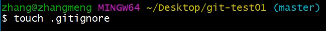

# 使用git初始化项目

对于已经创建好的gitee仓库项目，向仓库中上传文件

```sh
git init # 第一步：初始化项目，然后会生成.git文件夹
git add .  # 第二步：将当前目录加入到git（.代表全部）
git commit -m "first （提交的描述信息也就是提交的说明）" # 第三步：git提交到本地版仓库，并注明提交的缘由
git remote add origin https://gitee.com/hui829/web-vue-project-exercise.git	# 别名项目地址
git push -u origin master # 第四步：将文件上传到gitee中的master分支,-u代表第一次上传
```

注意：一般一个完整项目中只有第一级目录下会生成.git文件夹，如果上传的第二级目录的文件夹中有.git文件夹，则只会上传二级目录文件夹，而不会上传二级目录文件夹下的内容，如果上传的二级目录的文件夹中没有.git文件，则会上传二级目录文件夹下的内容（多级目录同理）

# 使用git更新项目

2.对于已有的仓库，且已经进行过一次或多次上传文件后，还需要更新代码至gitee

```sh
git status  # 第一步：列出自己做出修改的文件，会列出你修改的文件以及新增的文件
git add . # 第二步：将当前目录加入到git, .代表全部更新, 指定文件更新则点替换为指定文件名
git commit -m "更新说明" # 第三步： 添加更新说明
git push origin master  # 第四步： 执行更新操作
```

查看三大区域文件

```sh
git status
```

> 注:新增的文件和修改过后的文件都是红色


# 基础指令

## 配置个人信息

个人信息配置用户名、邮箱【一次即可】:

```sh
git config --global user.email "you@example.com"
git config --global user.name "Your Name"
```


## 版本回滚

回滚至 **之前版本**

```sh
git log
git reset --hard 版本号
```

回滚之之后版本

```sh
git reflog
git reset --hard 版本号
```

#### 添加文件至忽略列表

一般我们总会有些文件无需纳入Git 的管理，也不希望它们总出现在未跟踪文件列表。 通常都是些自动

生成的文件，比如日志文件，或者编译过程中创建的临时文件等。 在这种情况下，我们可以在工作目录

中**创建一个名为 .gitignore 的文件（文件名称固定），列出要忽略的文件模式**。下面是一个示例：




这样后缀为.a的文件就不会被加到缓冲区中，这样git就不会去处理这些文件了

一般.gitignore文件公司会给


# 分支


几乎所有的版本控制系统都以某种形式支持分支。 使用分支意味着你可以把你的工作从开发主线上分离

开来进行重大的Bug修改、开发新的功能，以免影响开发主线。

```sh
git branch				## 查看本地分支 ，-a查看所有分支，-r仅查看远程分支，-m重命名分支<原名><新名>
git branch 分支名					## 创建本地分支
git checkout 分支名				## 切换分支
git checkout -b 分支名				## 我们还可以直接切换到一个不存在的分支（创建并切换
```

**1、合并**

一个分支上的提交可以合并到另一个分支:

```sh
git merge 分支名称 	## 合并分支
```

**2、删除分支**

不能删除当前分支，只能删除其他分支

```sh
git branch -d b1 				## 删除分支时，需要做各种检查
git branch -D b1 				##不做任何检查，强制删除
```

**3、解决冲突**

当两个分支上对文件的修改可能会存在冲突，例如同时修改了同一个文件的同一行，这时就需要手动解

决冲突，解决冲突步骤如下：

1. 处理文件中冲突的地方
2. 将解决完冲突的文件加入暂存区(add)
3. 提交到仓库(commit)

冲突部分的内容处理如下所示：


## 开发中分支使用原则与流程

几乎所有的版本控制系统都以某种形式支持分支。 使用分支意味着你可以把你的工作从开发主线上分离开来进行重大的Bug修改、开发新的功能，以免影响开发主线。在开发中，一般有如下分支使用原则与流程：

- master （生产） 分支

​	线上分支，主分支，中小规模项目作为线上运行的应用对应的分支；

- develop（开发）分支

​	是从master创建的分支，一般作为开发部门的主要开发分支，如果没有其他并行开发不同期上线要求，都可以在此版本进行开发，阶段开发完成后，需要是合并到master分支,准备上线。

- feature/xxxx分支

​	从develop创建的分支，一般是同期并行开发，但不同期上线时创建的分支，分支上的研发任务完成后合并到develop分支。

- hotfix/xxxx分支，

​	从master派生的分支，一般作为线上bug修复使用，修复完成后需要合并到master、test、

- develop分支。

​	还有一些其他分支，在此不再详述，例如test分支（用于代码测试）、pre分支（预上线分支）等等。


