# 一、引言

在Web应用发展的初期，那时关系型数据库受到了较为广泛的关注和应用，原因是因为那时候Web站点基本上访问和并发不高、交互也较少。而在后来，随着访问量的提升，使用关系型数据库的Web站点多多少少都开始在性能上出现了一些瓶颈，而瓶颈的源头一般是在磁盘的I/O上。而随着互联网技术的进一步发展，各种类型的应用层出不穷，这导致在当今云计算、大数据盛行的时代，对性能有了更多的需求，主要体现在以下几个方面：

> 1. 低延迟的读写速度：应用快速地反应能极大地提升用户的满意度
> 2. 支撑海量的数据和流量：对于搜索这样大型应用而言，需要利用PB级别的数据和能应对百万级的流量
> 3. 大规模集群的管理：系统管理员希望分布式应用能更简单的部署和管理

为了克服这一问题，NoSQL应运而生，它同时具备了高性能、可扩展性强、高可用等优点，受到广泛开发人员和仓库管理人员的青睐。

**关系型数据库（RMDBS）与非关系型数据库（NoSQL）的对比：**

RMDBS：数据库中表与表的数据之间存在某种关联的内在关系，因为这种关系，所以我们称这种数据库为关系型数据库。典型：Mysql/MariaDB、postgreSQL、oracle、SQLServer、DB2、Access、SQLlite3。特点： 

> 1. 全部使用SQL（结构化查询语言）进行数据库操作。
> 2. 都存在主外键关系，表，等等关系特征。
> 3. 大部分都支持各种关系型的数据库的特性：事务、存储过程、触发器、视图、临时表、模式、函数

NoSQL：not only sql，泛指非关系型数据库。泛指那些不使用SQL语句进行数据操作的数据库，所有数据库中只要不使用SQL语句的都是非关系型数据库。典型：Redis、MongoDB、hbase、 Hadoop、elasticsearch、图数据库(Neo4j、GraphDB、SequoiaDB)

# 二、redis介绍

## 2.1、定义

> Redis（Remote Dictionary Server ，远程字典服务） 是一个使用ANSIC编写的开源、支持网络、基于内存、可选持久性的键值对存储数据库，是NoSQL数据库。

redis的出现主要是为了替代早期的Memcache缓存系统的。map内存型(数据存放在内存中)的非关系型(nosql)key-value(键值存储)数据库，
支持数据的持久化(基于RDB和AOF，注: 数据持久化时将数据存放到文件中，每次启动redis之后会先将文件中数据加载到内存，经常用来做缓存、数据共享、购物车、消息队列、计数器、限流等。(最基本的就是缓存一些经常用到的数据，提高读写速度)。

redis特性：

> - 速度快
> - 持久化
> - 多种数据结构
> - 支持多种编程语言
> - 主从复制
> - 高可用、分布式

## 2.2、Redis的数据类型及主要特性

Redis提供的数据类型主要分为5种自有类型和一种自定义类型，这5种自有类型包括：**String类型、哈希类型、列表类型、集合类型和顺序集合类型**。

```json
redis={
"name":"yuan",
"age":"23",
"scors":[78,79,98,],
"info":{"gender":"male","tel":"110"},
"set":{1,2,3},
"zset":{1,2,3,}
}
```


## 2.3、Redis的应用场景有哪些？

Redis 的应用场景包括：

> 缓存系统（“热点”数据：高频读、低频写）：缓存用户信息，优惠券过期时间，验证码过期时间、session、token等
>
> 计数器：帖子的浏览数，视频播放次数，评论次数、点赞次数等
>
> 消息队列，秒杀系统
>
> 社交网络：粉丝、共同好友（可能认识的人），兴趣爱好（推荐商品）
>
> 排行榜（有序集合）
>
> 发布订阅：粉丝关注、消息通知

# 三、redis环境安装

redis的官方只提供了linux版本的redis，window系统的redis是微软团队根据官方的linux版本高仿的。

[官方原版](https://redis.io/) | [中文官网](http://www.redis.cn)

## 3.1、下载和安装

**ubuntu下安装**

```bash
安装命令：sudo apt-get install -y redis-server
卸载命令：sudo apt-get purge --auto-remove redis-server 
关闭命令：sudo service redis-server stop 
开启命令：sudo service redis-server start 
重启命令：sudo service redis-server restart
配置文件：/etc/redis/redis.conf
```

如果连接操作redis，可以在终端下，使用以下命令：

```sh
redis-cli
```

**windows服务方式启动**

[下载地址](https://github.com/tporadowski/redis/releases)，使用以下命令启动redis服务端

```
redis-server C:/tool/redis/redis.windows.conf
```

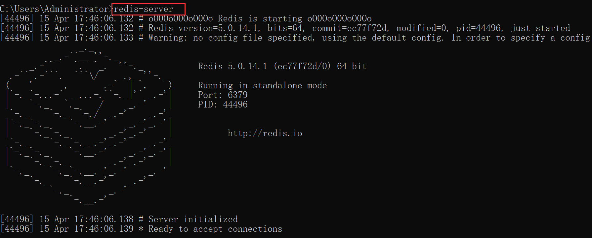

关闭上面这个cmd窗口就关闭redis服务器服务了。

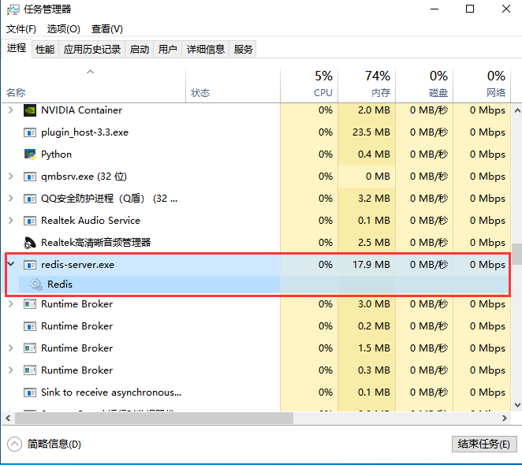
```sh
redis-server --service-install redis.windows.conf、
启动服务：redis-server --service-start
停止服务：redis-server --service-stop
```

## 3.2、redis的配置

```bash
cat /etc/redis/redis.conf
```

redis 安装成功以后,window下的配置文件保存在软件 安装目录下,如果是mac或者linux,则默认安装/etc/redis/redis.conf

### redis核心配置选项

绑定ip：访问白名单，如果需要远程访问，可将此注释，或绑定1个真实ip

```sh
bind 127.0.0.1   xx.xx.xx.xx
```

端⼝，默认为6379

```sh
port 6379
```

是否以守护进程运行

- 如果以守护进程运行，则不会在命令阻塞，类似于服务
- 如果以守护进程运行，则当前终端被阻塞
- 设置为yes表示守护进程，设置为no表示⾮守护进程
- 推荐设置为yes

```bash
daemonize yes
```

RDB持久化的备份策略（RDB备份是默认开启的）

```bash
 # save 时间 读写次数
 save 900 1     # 当redis在900内至少有1次读写操作，则触发一次数据库的备份操作
 save 300 10    # 当redis在300内至少有10次读写操作，则触发一次数据库的备份操作
 save 60 10000  # 当redis在60内至少有10000次读写操作，则触发一次数据库的备份操作
```

RDB持久化的备份文件

```bash
dbfilename dump.rdb
```

RDB持久化数据库数据文件的所在目录

```bash
dir /var/lib/redis
```

日志文件所载目录

```bash
loglevel notice
logfile /var/log/redis/redis-server.log
```

进程ID文件

```bash
pidfile /var/run/redis/redis-server.pid
```

数据库，默认有16个，数据名是不能自定义的，只能是0-15之间，当然这个15是数据库数量-1

```bash
database 16
```

redis的登录密码，生产阶段打开，开发阶段避免麻烦，一般都是注释的。redis在6.0版本以后新增了ACL访问控制机制，新增了用户管理，这个版本以后才有账号和密码，再次之前只有没有密码没有账号

```bash
# requirepass foobared
```

注意：开启了以后，redis-cli终端下使用 `auth 密码`来认证登录。

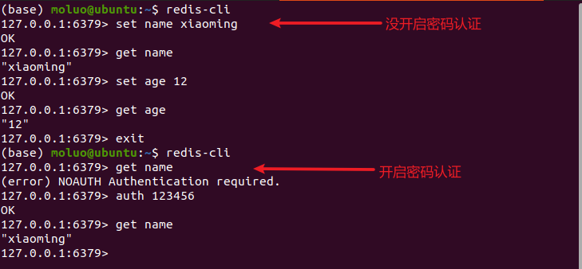

AOF持久化的开启配置项(默认值是no，关闭状态)

```bash
appendonly no
```

AOF持久化的备份文件（AOF的备份数据文件与RDB的备份数据文件保存在同一个目录下，由dir配置项指定）

```bash
appendfilename "appendonly.aof"
```

AOF持久化备份策略[时间]

```bash
# appendfsync always
appendfsync everysec    # 工作中最常用。每一秒备份一次
# appendfsync no
```

哨兵集群：一主二从三哨兵(3台服务器)

### Redis的使用

redis是一款基于**CS**架构的数据库，所以redis有客户端redis-cli，也有服务端redis-server。

其中，客户端可以使用go、java、python等编程语言，也可以终端下使用命令行工具管理redis数据库，甚至可以安装一些别人开发的界面工具，例如：RDM。


redis-cli客户端连接服务器：

```bash
redis-cli -h 10.16.244.3 -p 6379		# -h `redis服务器ip` -p `redis服务器port`
```

# 四、redis 5种数据类型


```sh
redis可以理解成一个全局的大字典，key就是数据的唯一标识符。根据key对应的值不同，可以划分成5个基本数据类型。
1. string类型:
	字符串类型，是 Redis 中最为基础的数据存储类型，它在 Redis 中是二进制安全的，也就是byte类型。
	单个数据的最大容量是512M。
		key: "值",
		"name":"yuan",

3. list类型:
	列表类型，它的子成员类型为string。
		key: [值1，值2, 值3.....]
		"scors":["100","89","78"],

2. hash类型:
	哈希类型，用于存储对象/字典，对象/字典的结构为键值对。key、域、值的类型都为string。域在同一个hash中是唯一的。
		key:{
            域（属性）: 值，
            域:值，            
            域:值，
            域:值，
            ...
		}
		"user:1": {
      		"name": "John",
      		"age": 30,
      		"email": "john@example.com"
    	}

4. set类型:
	无序集合，它的子成员类型为string类型，元素唯一不重复，没有修改操作。
		key: {值1, 值4, 值3, ...., 值5}
		"s":{item1,itme2,..}

5. zset类型(sortedSet):
	有序集合，它的子成员值的类型为string类型，元素唯一不重复，没有修改操作。权重值(score,分数)从小到大排列。
		key: {
			值1 权重值1(数字);
			值2 权重值2;
			值3 权重值3;
			值4 权重值4;
		}
		"leaderboard": {
      		"Player1": 1000,
      		"Player2": 800,
      		"Player3": 600
    	}
```

## 4.1. string（字符串）

**1、set/setex/mset/msetnx**

- `set key value`: 设置指定键的值为指定的字符串。
- `setex key seconds value`: 设置指定键的值为指定的字符串，并设置过期时间（以秒为单位）。
- `mset key value [key value ...]`: 设置多个键值对。
- `msetnx key value [key value ...]`: 仅当所有指定的键都不存在时，同时设置多个键值对。

示例：

```sh
set user:1:name "John"
setex user:1:session 3600 "session_token"
mset user:2:name "Alice" user:2:age 25
msetnx user:3:name "Bob" user:3:age 30
```

**2、get/mget**

- `get key`: 获取指定键的值。
- `mget key [key ...]`: 获取多个键的值。

示例：

```
get user:1:name
mget user:1:name user:2:name user:3:name
```

**3、getset**

- `getset key value`: 设置指定键的值为指定的字符串，并返回键的旧值。

示例：

```
getset user:1:name "Johnny"
```

**4、incr/decr**

- `incr key`: 将指定键的值递增 1。
- `decrkey`: 将指定键的值递减 1。

示例：

```
incr user:1:visits
decr user:2:age
```

**5、del**

- `DEL key [key ...]`: 删除一个或多个键。

示例：

```
DEL  user:1:name
```

### 1. 设置键值

set 设置的数据没有额外操作时，是不会过期的。

```bash
set key value
```

设置键为`name`值为`yuan`的数据

```bash
set name yuan
set name rain # 一个变量可以设置多次
```

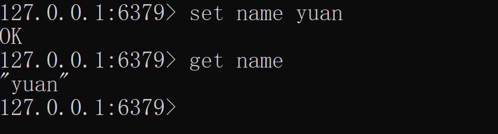

注意：redis中的所有数据操作，如果设置的键不存在则为添加，如果设置的键已经存在则修改。

设置一个键，当键不存在时才能设置成功，用于一个变量只能被设置一次的情况。

```bash
setnx  key  value
```

一般用于给数据加锁(分布式锁)

```bash
127.0.0.1:6379> setnx goods_1 101
(integer) 1
127.0.0.1:6379> setnx goods_1 102
(integer) 0  # 表示设置不成功
127.0.0.1:6379> del goods_1
(integer) 1
127.0.0.1:6379> setnx goods_1 102
(integer) 1
```

### 2. 设置键值的过期时间

redis中可以对一切的数据进行设置有效期。以秒为单位

```bash
setex key seconds value
setex name goods_1 10 //设置键为`goods_1`值为`101`过期时间为10秒的数据
```

### 3. 关于设置保存数据的有效期

setex 添加保存数据到redis，同时设置有效期，格式：

```bash
setex key time value
```

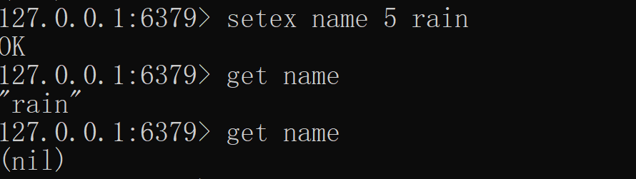

### 4. 设置多个键值

```bash
mset key1 value1 key2 value2 ...
mset a1 goland a2 java a3 c //设置键为`a1`值为`goland`、键为`a2`值为`java`、键为`a3`值为`c`
```

### 5. 字符串拼接值

常见于大文件上传

```bash
append key value
```

向键为`a1`中拼接值`haha`

```bash
set title 123
append title 123
127.0.0.1:6379> get title
"123123"
```

### 6. 根据键获取值

根据键获取值，如果不存在此键则返回`nil`

```bash
get key
get name //获取 name 的值
```

根据多个键获取多个值

```bash
mget key1 key2 ...
mget a1 a2 a3 // 获取键`a1、a2、a3`的值
```

getset：设置key的新值，返回旧值

```bash
redis> GETSET db mongodb    # 没有旧值，返回 nil
(nil)
redis> GET db
"mongodb"
redis> GETSET db redis      # 返回旧值 mongodb
"mongodb"
redis> GET db
"redis"
```

###  7. 自增自减

web开发中的电商抢购、秒杀。游戏里面的投票、攻击计数。系统中计算当前在线人数、

```bash
set id 1
incr id   # 相当于id+1
get id    # 2
incr id   # 相当于id+1
get id    # 3

set goods_id_1 10
decr goods_id_1  # 相当于 id-1
get goods_id_1    # "9"
decr goods_id_1   # 相当于id-1
get goods_id_1    # 8

set age 22
incrby age 2 # 自增自减大于1的值时候用incrby
```

### 8. 获取字符串的长度

```bash
set name xiaoming
strlen name  # 8 
```

### 9. 比特流操作  

————————

mykey  00000011

1字节=8比特  1kb = 1024字节  1mb = 1024kb 1gb = 1024mb

1个int8就是一个字节，一个中文：3个字节

```bash
setbit     # setbit key offset value 按从左到右的偏移量设置一个bit数据的值 
getbit     # 获取一个bit数据的值
bitcount   # 统计字符串被设置为1的bit数.
BITPOS     # 返回字符串里面第一个被设置为1或者0的bit位。
```

案例1：

```bash
setbit mykey 7 1
# 00000001
getbit mykey 7
# 00000001
setbit mykey 4 1
# 00001001
setbit mykey 15 1
# 0000100100000001
```

我们知道 'a' 的ASCII码是 97。转换为二进制是：01100001。offset的学名叫做“偏移” 。二进制中的每一位就是offset值啦，比如在这里 offset 0 等于 ‘0’ ，offset 1等于 '1' ,offset 2 等于 '1',offset 6 等于 '0' ，没错，offset是从左往右计数的，也就是从**高位往低位**。

我们通过setbit 命令将 andy中的 'a' 变成 'b' 应该怎么变呢？

也就是将 01100001 变成 01100010 （b的ASCII码是98），这个很简单啦，也就是将'a'中的offset 6从0变成1，将offset 7 从1变成0 。

案例2：签到系统

````bash
setbit user_1 6 1
setbit user_1 5 1
setbit user_1 4 0
setbit user_1 3 1
setbit user_1 2 0
setbit user_1 1 1
setbit user_1 0 1
bitcount user_1 # 统计一周的打卡情况
````

## 4.2. key操作

redis中所有的数据都是通过key（键）来进行操作，这里我们学习一下关于任何数据类型都通用的命令。

### （1）查找键

参数支持简单的正则表达式

```bash
keys pattern
keys *			 # 查看所有键
keys *	--raw	 # 显示中文，查看所有键
```

例子：

```bash
keys *a* 		# 查看名称中包含`a`的键
keys a*			# 查看以a开头的键
keys *a			# 查看以a结尾的键
```

### （2）判断键是否存在

如果存在返回`1`，不存在返回`0`

```bash
exists key1
exists title 	# 判断键`title`是否存在
```

### （3）查看键的的值的数据类型

```bash
type key
# string    字符串
# hash      哈希类型
# list      列表类型
# set       无序集合
# zset      有序集合
```

查看键的值类型

```bash
type a1
# string
sadd member_list xiaoming xiaohong xiaobai
# (integer) 3
type member_list
# set
hset user_1 name xiaobai age 17 sex 1
# (integer) 3
type user_1
# hash
lpush brothers zhangfei guangyu liubei xiaohei
# (integer) 4
type brothers
# list

zadd achievements 61 xiaoming 62 xiaohong 83 xiaobai  78 xiaohei 87 xiaohui 99 xiaolong
# (integer) 6
type achievements
# zset
```

### （4）删除键以及键对应的值

```bash
del key1 key2 ...
```

### （5）查看键的有效期

```bash
ttl key

# 结果结果是秒作为单位的整数
# -1 表示永不过期
# -2 表示当前数据已经过期，查看一个不存在的数据的有效期就是-2
```

### （6）设置key的有效期

给已有的数据重新设置有效期，redis中所有的数据都可以通过expire来设置它的有效期。有效期到了，数据就被删除。

```bash
expire key seconds
```

### （7）清空所有key

慎用，一旦执行，则redis所有数据库0~15的全部key都会被清除

```bash
flushall
```

### （8）key重命名

```bash
rename oldkey newkey
```

把name重命名为username

```bash
set name yuan
rename name username
get username
```

select切换数据库，每个数据库数据是独立的

```bash
select <数据库ID>		# redis的配置文件中，默认有0~15之间的16个数据库，默认操作的就是0号数据库
```

操作效果：

```bash
# 默认处于0号库
127.0.0.1:6379> select 1
OK
# 这是在1号库
127.0.0.1:6379[1]> set name xiaoming
OK
127.0.0.1:6379[1]> select 2
OK
# 这是在2号库
127.0.0.1:6379[2]> set name xiaohei
OK
```

## 4.3. list（数组）

队列，列表的子成员类型为string

> lpush key value # 将一个或多个值插入列表的头部
>
> rpush key value # 将一个或多个值插入列表的尾部 
>
> linsert key after|before  指定元素 value # 在列表中指定元素的前面或后面插入一个新元素
>
> lindex key index # 获取列表中指定索引位置的元素
>
> lrange key start stop # 获取列表中指定范围内的元素
>
> lset key index value # 设置列表中指定索引位置的元素值
>
> lrem key count value # 从列表中移除指定数量的元素，count > 0 时从表头开始移除指定值，count < 0 时从表尾开始移除指定值，count = 0 时移除所有指定值 

### （1）添加子成员

```bash
# 在左侧(前)添加一条或多条数据
lpush key value1 value2 ...
# 在右侧(后)添加一条或多条数据
rpush key value1 value2 ...

# 在指定元素的左边(前)/右边（后）插入一个或多个数据
linsert key before/after 指定元素 value1 value2 ....
```

从键为`brother`的列表左侧添加一个或多个数据`liubei、guanyu、zhangfei`

```bash
lpush brother liubei
# [liubei]
lpush brother guanyu zhangfei xiaoming
# [xiaoming,zhangfei,guanyu,liubei]
```

从键为brother的列表右侧添加一个或多个数据，`xiaohong,xiaobai,xiaohui`

```bash
rpush brother xiaohong
# [xiaoming,zhangfei,guanyu,liubei,xiaohong]
rpush brother xiaobai xiaohui
# [xiaoming,zhangfei,guanyu,liubei,xiaohong,xiaobai,xiaohui]
```

从key=brother的xiaohong的列表位置左侧添加一个数据，`xiaoA,xiaoB`

```bash
linsert brother before xiaohong xiaoA
# [xiaoming,zhangfei,guanyu,liubei,xiaoA,xiaohong,xiaobai,xiaohui]
linsert brother before xiaohong xiaoB
# [xiaoming,zhangfei,guanyu,liubei,xiaoA,xiaoB,xiaohong,xiaobai,xiaohui]
```

从key=brother，key=xiaohong的列表位置右侧添加一个数据，`xiaoC,xiaoD`

```bash
linsert brother after xiaohong xiaoC
# [xiaoming,zhangfei,guanyu,liubei,xiaoA,xiaohong,xiaoC,xiaobai,xiaohui]
linsert brother after xiaohong xiaoD
# [xiaoming,zhangfei,guanyu,liubei,xiaoA,xiaohong,xiaoD,xiaoC,xiaobai,xiaohui]
```

注意：当列表如果存在多个成员值一致的情况下，默认只识别第一个。

```bash
127.0.0.1:6379> linsert brother before xiaoA xiaohong
# [xiaoming,zhangfei,guanyu,liubei,xiaohong,xiaoA,xiaohong,xiaoD,xiaoC,xiaobai,xiaohui]
127.0.0.1:6379> linsert brother before xiaohong xiaoE
# [xiaoming,zhangfei,guanyu,liubei,xiaoE,xiaohong,xiaoA,xiaohong,xiaoD,xiaoC,xiaobai,xiaohui]
127.0.0.1:6379> linsert brother after xiaohong xiaoF
# [xiaoming,zhangfei,guanyu,liubei,xiaoE,xiaohong,xiaoF,xiaoA,xiaohong,xiaoD,xiaoC,xiaobai,xiaohui]
```

### （2）基于索引获取列表成员

根据指定的索引(下标)获取成员的值，负数下标从右边-1开始，逐个递减

```bash
lindex key index
```

获取brother下标为2以及-2的成员

```bash
del brother
lpush brother guanyu zhangfei xiaoming
lindex brother 2
# "guanyu"
lindex brother -2
# "zhangfei"
```

### （3）获取列表的切片

闭区间[包括stop]

```bash
lrange key start stop
```

操作：

```bash
del brother
rpush brother liubei guanyu zhangfei xiaoming xaiohong
# 获取btother的全部成员
lrange brother 0 -1
# 获取brother的前2个成员
lrange brother 0 1
# 获取brother的后2个成员
lrange brother -2 -1
```

### （4）获取列表的长度

```bash
llen key
```

获取brother列表的成员个数

```bash
llen brother
```

### （5）按索引设置值

```bash
lset key index value
# 注意：
# redis的列表也有索引，从左往右，从0开始，逐一递增，第1个元素下标为0
# 索引可以是负数，表示尾部开始计数，如`-1`表示最后1个元素
```

修改键为`brother`的列表中下标为`4`的元素值为`xiaohongmao`

```bash
lset brother 4 xiaohonghong
```

### （6）删除指定成员

移除并获取列表的第一个成员或最后一个成员

```bash
lpop key  # 第一个成员出列
rpop key  # 最后一个成员出列
```

获取并移除brother中的第一个成员

```bash
lpop brother
# 开发中往往使用rpush和lpop实现队列的数据结构->实现入列和出列
```

```bash
lrem key count value

# 注意：
# count表示删除的数量，value表示要删除的成员。该命令默认表示将列表从左侧前count个value的元素移除
# count==0，表示删除列表所有值为value的成员
# count >0，表示删除列表左侧开始的前count个value成员
# count <0，表示删除列表右侧开始的前count个value成员

del brother
rpush brother A B A C A
lrem brother 0 A
["B","C"]

del brother
rpush brother A B A C A
lrem brother -2 A
["A","B","C"]

del brother
rpush brother A B A C A
lrem brother 2 A
["B","C","A"]
```

## 4.4. hash（哈希）

> hset key field value 		# 设置哈希表中指定字段的值
>
> hget key field 				# 获取哈希表中指定字段的值
>
> hgetall key 				# 获取哈希表中指定键的所有字段和值
>
> hmget key field1 field2 ...  	# 获取哈希表中指定键的多个字段的值
>
> hincrby key field number 	# 将哈希表中指定字段的值增加指定增量（整数）

专门用于结构化的数据信息。对应的就是map/结构体

结构：

```text
键key:{
   	域field: 值value,
   	域field: 值value,
   	域field: 值value,
}
```

### （1）设置指定键的属性/域

设置指定键的单个属性

```bash
hset key field value
```

设置键 `user_1`的属性`name`为`xiaoming`

```bash
127.0.0.1:6379> hset user_1 name xiaoming   # user_1没有会自动创建
(integer) 1
127.0.0.1:6379> hset user_1 name xiaohei    # user_1中重复的属性会被修改
(integer) 0
127.0.0.1:6379> hset user_1 age 16          # user_1中不存在的属性会被新增
(integer) 1
127.0.0.1:6379> hset user:1 name xiaohui    # user:1会在redis界面操作中以:作为目录分隔符
(integer) 1
127.0.0.1:6379> hset user:1 age 15
(integer) 1
127.0.0.1:6379> hset user:2 name xiaohong age 16  # 一次性添加或修改多个属性
```

### （2）获取指定键的域/属性的值

获取指定键所有的域/属性

```bash
hkeys key
```

获取键user的所有域/属性

```bash
127.0.0.1:6379> hkeys user:2
1) "name"
2) "age"
127.0.0.1:6379> hkeys user:3
1) "name"
2) "age"
3) "sex"
```

获取指定键的单个域/属性的值

```sh
hget key field
127.0.0.1:6379> hget user:3 name	# 获取键`user:3`属性`name`的值
"xiaohong"
```

获取指定键的多个域/属性的值

```bash
hmget key field1 field2 ...
127.0.0.1:6379> hmget user:2 name age	# 获取键`user:2`属性`name`、`age`的值
1) "xiaohong"
2) "16"
```

获取指定键的所有值

```bash
hvals key
127.0.0.1:6379> hvals user:3	# 获取指定键的所有域值对
1) "xiaohong"
2) "17"
3) "1"
```

### （3）获取hash的所有域值对

```bash
127.0.0.1:6379> hset user:1 name xiaoming age 16 sex 1
(integer) 3
127.0.0.1:6379> hgetall user:1
1) "name"
2) "xiaoming"
3) "age"
4) "16"
5) "sex"
6) "1"
```

### （4）删除指定键的域/属性

```bash
hdel key field1 field2 ...
```

删除键`user:3`的属性`sex/age/name`，当键中的hash数据没有任何属性，则当前键会被redis删除

```bash
hdel user:3 sex age name
```

### （5）判断指定属性/域是否存在于当前键对应的hash中

```bash
hexists   key  field
```

判断user:2中是否存在age属性

```bash
127.0.0.1:6379> hexists user:3 age
(integer) 0
127.0.0.1:6379> hexists user:2 age
(integer) 1
127.0.0.1:6379> 
```

### （6）属性值自增自减

```bash
hincrby key field number
```

给user:2的age属性在原值基础上+/-10，然后在age现有值的基础上-2

```bash
# 按指定数值自增
127.0.0.1:6379> hincrby user:2 age 10
(integer) 77
127.0.0.1:6379> hincrby user:2 age 10
(integer) 87

# 按指定数值自减
127.0.0.1:6379> hincrby user:2 age -10
(integer) 77
127.0.0.1:6379> hincrby user:2 age -10
```

## 4.5. set（集合）

无序集合，重点就是去重和无序。

> sadd key member [member ...]    # 向集合添加一个或多个成员
>
> smembers key    # 返回集合中的所有成员
>
> scard key    # 返回集合中成员的数量
>
> sismember key member    # 判断指定成员是否是集合的成员
>
> srem key member [member ...]    # 移除集合中的一个或多个成员
>
> sdiff key [key ...]    # 返回两个集合的差集
>
> sinter key [key ...]    # 返回两个或多个集合的交集
>
> sunion key [key ...]    # 返回两个或多个集合的并集
>
> smove source destination member    # 将指定成员从一个集合移动到另一个集合
>
> srandmember key [count]    # 随机返回集合中的一个或多个元素
>
> spop key [count]    # 移除并返回集合中的一个或多个随机元素
>
> srandmember key [count]    # 移除并返回集合中的一个或多个随机元素，不会删除元素

### （1）添加元素

```bash
sadd key member1 member2 ...

# 向键`authors`的集合中添加元素`zhangsan`、`lisi`、`wangwu`
sadd authors zhangsan lisi wangwu
```

### （2）获取集合的所有的成员

```bash
smembers key
smembers authors	# 获取键`authors`的集合中所有元素
```

### （3）获取集合的长度

```bash
scard keys

sadd s2 a b c d e
127.0.0.1:6379> scard s2	# 获取s2集合的长度
(integer) 5
```

### （4）随机抽取一个或多个元素

抽取出来的成员被删除掉 

```bash
spop key [count=1]
# 注意：
# count为可选参数，不填则默认一个。被提取成员会从集合中被删除掉
```

随机获取s2集合的成员

```bash
sadd s2 a c d e

127.0.0.1:6379> spop s2 
"d"
127.0.0.1:6379> spop s2 
"c"
```

### （5）删除指定元素

```bash
srem key value
```

删除键`authors`的集合中元素`wangwu`

```bash
srem authors wangwu
```

### （6）交集、差集和并集

推荐、（协同过滤，基于用户、基于物品）

```bash
sinter  key1 key2 key3 ....    # 交集、比较多个集合中共同存在的成员
sdiff   key1 key2 key3 ....    # 差集、比较多个集合中不同的成员
sunion  key1 key2 key3 ....    # 并集、合并所有集合的成员，并去重
```

```bash
del user:1 user:2 user:3 user:4
sadd user:1 1 2 3 4     # user:1 = {1,2,3,4}
sadd user:2 1 3 4 5     # user:2 = {1,3,4,5}
sadd user:3 1 3 5 6     # user:3 = {1,3,5,6}
sadd user:4 2 3 4       # user:4 = {2,3,4}

# 交集
127.0.0.1:6379> sinter user:1 user:2
1) "1"
2) "3"
3) "4"
127.0.0.1:6379> sinter user:1 user:3
1) "1"
2) "3"
127.0.0.1:6379> sinter user:1 user:4
1) "2"
2) "3"
3) "4"

127.0.0.1:6379> sinter user:2 user:4
1) "3"
2) "4"

# 并集
127.0.0.1:6379> sunion user:1 user:2 user:4
1) "1"
2) "2"
3) "3"
4) "4"
5) "5"

# 差集
127.0.0.1:6379> sdiff user:2 user:3
1) "4"  # 此时可以给user:3推荐4

127.0.0.1:6379> sdiff user:3 user:2
1) "6"  # 此时可以给user:2推荐6

127.0.0.1:6379> sdiff user:1 user:3
1) "2"
2) "4"
```

## 4.6. zset（有序集合）

ZSET（有序集合）是⼀种复合类型的数据结构，它将Set和Hash两种数据结构进行了结合。

在ZSET中，每个元素都是唯⼀的（就像Set），但每个元素关联了⼀个socre（就像Hash中的Value）。

有序集合（score/value），去重并且根据score权重值来进行排序的。score从小到大排列。

可以简单理解为在set的基础上，增加了⼀个值，例如： zset k1 score v1

特点：可排序、元素不重复、查询速度快

由于这个特点所以Zset经常被⽤于排⾏榜类型的功能

**注意：**所有的排序默认都是升序排序，如果需要降序需要在Z后⾯加上REV

其实zset对⽐set就是多了⼀个有序，所以它不仅仅可以⽤于排序，排⾏榜等功能，其实它也可以作为权重来进⾏使⽤，⽐如某⼀个数据的score为1，权重为最⾼，其他的score设置为2、3、4、5等等 以此类推，权重由1～n来进⾏排序

> zadd key [NX|XX] [CH] [INCR] score member [score member ...]    # 添加一个或多个成员到有序集合，可以指定选项如：NX（仅在成员不存在时添加）、XX（仅在成员存在时添加）、CH（修改成员的分数时，同时返回修改的成员数量）、INCR（增加成员的分数时，以增量形式返回成员的分数）
>
> zrange key start stop [WITHSCorES]    # 返回有序集合中指定索引范围内的成员，默认按成员分数从低到高排序，可选返回成员的分数
>
> zrevrange key start stop [WITHSCorES]    # 返回有序集合中指定索引范围内的成员（逆序），默认按成员分数从高到低排序，可选返回成员的分数
>
> zrangebyscore key min max [WITHSCorES] [LIMIT offset count]    # 返回有序集合中指定分数范围内的成员，默认按成员分数从低到高排序，可选返回成员的分数，并可指定返回数量范围
>
> zrevrangebyscore key max min [WITHSCorES] [LIMIT offset count]    # 返回有序集合中指定分数范围内的成员（逆序），默认按成员分数从高到低排序，可选返回成员的分数，并可指定返回数量范围
>
> zrem key member [member ...]    # 从有序集合中移除一个或多个成员
>
> zcard key    # 返回有序集合的成员数量
>
> zscore key member    # 返回有序集合中指定成员的分数
>
> zrank key member    # 返回有序集合中指定成员的排名（从低到高）
>
> zrevrank key member    # 返回有序集合中指定成员的排名（从高到低）
>
> zcount key min max    # 返回有序集合中指定分数范围内的成员数量
>
> zincrby key increment member    # 增加有序集合中指定成员的分数值
>
> zremrangebyrank key start stop    # 移除有序集合中指定排名范围内的所有成员
>
> zremrangebyscore key min max    # 移除有序集合中指定分数范围内的所有成员

### （1）添加成员

```bash
zadd key score1 member1 score2 member2 score3 member3 ....
```

设置榜单achievements，设置成绩和用户名作为achievements的成员

```bash
127.0.0.1:6379> zadd achievements 61 xiaoming 62 xiaohong 83 xiaobai  78 xiaohei 87 xiaohui 99 xiaolan
(integer) 6
127.0.0.1:6379> zadd achievements 85 xiaohuang 
(integer) 1
127.0.0.1:6379> zadd achievements 54 xiaoqing
```

### （2）获取score在指定区间的所有成员

```python
zrangebyscore key min max     # 按score进行从低往高排序获取指定score区间
zrevrangebyscore key min max  # 按score进行从高往低排序获取指定score区间
zrange key start stop         # 按scoer进行从低往高排序获取指定索引区间
zrevrange key start stop      # 按scoer进行从高往低排序获取指定索引区间
```

```python
zrange achievements 0 -1  # 从低到高全部成员
```

### （3）获取集合长度

```bash
zcard key
zcard achievements		# 获取users的长度
```

### （4）获取指定成员的权重值

```bash
zscore key member
```

获取users中xiaoming的成绩

```bash
127.0.0.1:6379> zscore achievements xiaobai
"93"
127.0.0.1:6379> zscore achievements xiaohong
"62"
127.0.0.1:6379> zscore achievements xiaoming
"61"
```

### （5）获取指定成员在集合中的排名

排名从0开始计算

```bash
zrank key member      # score从小到大的排名
zrevrank key member   # score从大到小的排名
```

获取achievements中xiaohei的分数排名，从大到小

```bash
127.0.0.1:6379> zrevrank achievements xiaohei
(integer) 4
```

### （6）获取score在指定区间的所有成员数量

```bash
zcount key min max
```

获取achievements从0~60分之间的人数[闭区间]

```bash
127.0.0.1:6379> zcount achievements 0 60
(integer) 2
127.0.0.1:6379> zcount achievements 54 60
(integer) 2
```

### （7）给指定成员增加增加权重值

```bash
zincrby key score member
127.0.0.1:6379> ZINCRBY achievements 10 xiaobai		# 给achievements中xiaobai增加10分
"93
```

### （8）删除成员

```bash
zrem key member1 member2 member3 ....
zrem achievements xiaoming					# 从achievements中删除xiaoming的数据
```

### （9）删除指定数量的成员

```bash
zpopmin key [count]			# 删除指定数量的成员，从最低score开始删除
zpopmax key [count]			# 删除指定数量的成员，从最高score开始删除
```

例子：

```bash
# 从achievements中提取并删除成绩最低的2个数据
127.0.0.1:6379> zpopmin achievements 2
1) "xiaoqing"
2) "54"
3) "xiaolv"
4) "60"

# 从achievements中提取并删除成绩最高的2个数据
127.0.0.1:6379> zpopmax achievements 2
1) "xiaolan"
2) "99"
3) "xiaobai"
4) "93"
```

# 五、redis 3种特殊数据类型

## Geospatial 地理位置

Redis的地理空间（Geospatial）数据结构是从3.2版本开始加⼊的，主要⽤于需要地理位置的应⽤场景。这种数据结构允许⽤户将指定的地理空间位置（经度、纬度、名称）添加到指定的key中，这些数据将会存储到sorted set中，这样设计的⽬的是为了⽅便使⽤GEorADIUS或者GEorADIUSBYMEMBER命令对数据进⾏半径查询等操作。

此命令能实现类似地理位置推算、两地之间的距离、附近的⼈等功能

**实现原理**

1、将某个地理位置的经度纬度分别转换成2进制

2、再将两个⼆进制交错合并成⼀个即可，经度占偶数位，纬度占奇数位，得到最终的⼆进制

3、将合并的⼆进制做base32编码，得到最终结果

4、将最终结果通过geohash处理后成功的将⼀个⼆维信息转换成了⼀维信息，节省存储空间，便于前缀检索

**相关命令**

### geoAdd 

1、geoAdd 添加⼀个或多个地理位置元素到key中 

```sh
geoAdd key lng lat member lng1 lat1 member1
```

要求：满⾜经度在 -180 和 180 之间，纬度在 -85.05112878 和 85.05112878 之间。

```sh
# GEOADD添加城市经纬度
127.0.0.1:6379> GEOADD city 116.405285 39.904989
(error) ERR wrong number of arguments for 'geoadd' command
127.0.0.1:6379> GEOADD city 116.405285 39.904989 beijing
(integer) 1
127.0.0.1:6379> GEOADD city 117.190182 39.125596 tianjin
(integer) 1
127.0.0.1:6379> GEOADD city 121.472644 31.231706 shanghai
106.504962 29.533155 chongqing
(integer) 2
```

### GeoDist 

2、GeoDist 返回⼀个key中指定两个位置之间的距离

```sh
GeoDist key member1 member2
```

- m表示单位为⽶
- km表示单位为千⽶
- mi表示单位为英⾥
- ft表示单位为英尺

```sh
# GeoDist 可以实现的功能：返回两个⼈之间的距离
127.0.0.1:6379> GeoDist city beijing tianjin
"109775.3239"
127.0.0.1:6379> GeoDist city beijing tianjin km #带单位km
"109.7753"
```

### Geopos

3、Geopos返回⼀个或多个位置的经纬度信息

```sh
Geopos key member1 member2

# GEOPOS获取指定城市经纬度
127.0.0.1:6379> Geopos city beijing tianjin chongqing shanghai
1) 1) "116.40528291463851929"
 2) "39.90498842291249559"
2) 1) "117.19018310308456421"
 2) "39.12559715251200032"
3) 1) "106.50495976209640503"
 2) "29.53315530684997015"
4) 1) "121.47264629602432251"
 2) "31.23170490709807012"
```

### Geohash

返回一个或多个位置元素的 Geohash 表示

### georadius

georadius 以给定的经纬度为中心，找出某一半径内的元素

```sh
127.0.0.1:6379> georadius china:city 110 30 1000 km ## 以110, 30 这个点为中心，寻找方圆 1000km 的城市
1) "chongqing"
2) "xian"
3) "shengzhen"
4) "hangzhou"
127.0.0.1:6379> georadius china:city 110 30 500 km 
1) "chongqing"
2) "xian"
127.0.0.1:6379> georadius china:city 110 30 500 km withcoord	##  显示他人的定位信息
1) 1) "chongqing"
   2) 1) "106.49999767541885376"
      2) "29.52999957900659211"
2) 1) "xian"
   2) 1) "108.96000176668167114"
      2) "34.25999964418929977"
127.0.0.1:6379> 
127.0.0.1:6379> georadius china:city 110 30 500 km withdist ##  显示到中心点的距离
1) 1) "chongqing"
   2) "341.9374"
2) 1) "xian"
   2) "483.8340"
127.0.0.1:6379> georadius china:city 110 30 500 km withdist withcoord count 1  ## 指定数量
1) 1) "chongqing"
   2) "341.9374"
   3) 1) "106.49999767541885376"
      2) "29.52999957900659211"
127.0.0.1:6379> georadius china:city 110 30 500 km withdist withcoord count 2
1) 1) "chongqing"
   2) "341.9374"
   3) 1) "106.49999767541885376"
      2) "29.52999957900659211"
2) 1) "xian"
   2) "483.8340"
   3) 1) "108.96000176668167114"
      2) "34.25999964418929977"
127.0.0.1:6379> 
```

### georadiusbymember

georadiusbymember 找出位于指定元素周围的其他元素

```bash
127.0.0.1:6379> georadiusbymember china:city shanghai 1000 km
1) "hangzhou"
2) "shanghai"
127.0.0.1:6379>
```


### geosearch

4、geosearch命令允许你从⼀个给定的地理位置开始，查询在⼀个给定半径内的元素。此外，你可以指定搜索区域的形状为圆形（byradius）或矩形（BYBOX）。

```sh
geosearch key [frommember member] [FROMLONLAT longitude latitude] [byradius radius m|km|ft|mi] [BYBOX width height m|km|ft|mi] [WITHCOorD] [WITHDIST] [WITHHASH] [COUNT count [ANY]] [ASC|DESC] [STorE key] [STorEDIST key]
```

frommember member ：从键中的⼀个元素开始搜索。 member 是键中的⼀个元素。

FROMLONLAT longitude latitude ：从指定的经度和纬度开始搜索。

byradius radius m|km|ft|mi ：按半径搜索。 radius 是半径，单位可以是⽶（m）、公⾥（km）、英尺（ft）或英⾥（mi）。

BYBOX width height m|km|ft|mi ：按矩形搜索。 width 和 height分别是矩形的宽度和⾼度，单位可以是⽶（m）、公⾥（km）、英尺（ft）或英⾥（mi）。

WITHCOorD ：返回元素的经度和纬度。

WITHDIST ：返回元素到中⼼的距离。

WITHHASH ：返回元素的 geohash。

COUNT count [ANY] ：返回的元素数量。如果指定了 ANY ，那么只要找到了 count 个元素就⽴即返回。

ASC|DESC ：按距离排序。 ASC 是升序， DESC 是降序。

STorE key ：将返回的元素存储到⼀个键中。

STorEDIST key ：将返回的元素的距离存储到⼀个键中。

注意， frommember 和 FROMLONLAT 必须指定其中之⼀， byradius 和BYBOX 也必须指定其中之⼀。

```sh
# geosearch 以给定位置为中⼼，搜索给定的半径范围的定位 此命令可以做附近的⼈等功能
# 返回给定key中 beijing 元素 半径为500km 内搜索的内容
127.0.0.1:6379> geosearch city frommember beijing byradius 500 km
1) "beijing"
2) "tianjin"
# asc默认正序（从近到远）withcoord输出⽬标经纬度
127.0.0.1:6379> geosearch city frommember beijing byradius 500 km
asc withcoord
1) 1) "beijing"
 2) 1) "116.40528291463851929"
 2) "39.90498842291249559"
2) 1) "tianjin"
 2) 1) "117.19018310308456421"
 2) "39.12559715251200032"
# desc倒序（从远到近）
127.0.0.1:6379> geosearch city frommember beijing byradius 500 km
desc
1) "tianjin"
2) "beijing"
# withdist 显示制定半径单位的距离
127.0.0.1:6379> geosearch city frommember beijing byradius 500 km
asc withdist
1) 1) "beijing"
 2) "0.0000"
2) 1) "tianjin"
 2) "109.7753"
```

### geosearchstore

4、geosearchstore 命令是 geosearch命令的⼀个扩展。该命令将 geosearch命令的返回值存储在⼀个键中。这可以提⾼效率，因为你可以在不必重新计算相同的 geosearch 结果的情况下，重复使⽤这些结果

```sh
geosearchstore destkey srckey [frommember member] [FROMLONLAT longitude latitude][byradius radius m|km|ft|mi] [BYBOX width height m|km|ft|mi] [WITHCOorD] [WITHDIST][WITHHASH] [COUNT count [ANY]] [ASC|DESC]
```

说明：所有的选项都和 geosearch 命令⼀样，只是前⾯多了两个参数

destkey ：将结果存储到这个键中。

srckey ：源键，要从这个键中搜索元素。

使⽤ geosearchstore 命令时需要注意，如果 destkey 已经存在，那么这个命令会覆盖它。所以，如果你要保留 destkey 的原有值，需要提前做好备份。

这⾥我们为了⽅便演示，⼤家可以访问这个⽹站来查询城市的经纬度：http://jingweidu.757dy.com/

```sh
# geosearchstore
geosearchstore destkey city frommember beijing byradius 500 km
(integer) 2
# 因为本质上Geospatial类型的底层就是Zset，我们可以已通过zrange来查看数据
# 当然⽐如说我们要清楚地理位置，完全可以使⽤Zset中的ZREM命令来完成
127.0.0.1:6379> zrange destkey 0 -1
1) "tianjin"
2) "beijing"
```

### 使用zset操作

> 注意：因为GEO的底层就是Zset，所以完全可以使⽤Zset的命令来操作GEO

```bash
127.0.0.1:6379> zrange china:city 0 -1
1) "chongqing"
2) "xian"
3) "shengzhen"
4) "hangzhou"
5) "shanghai"
6) "beijing"
127.0.0.1:6379> zrem china:city beijing		## 删除一个元素
(integer) 1
127.0.0.1:6379> zrange china:city 0 -1
1) "chongqing"
2) "xian"
3) "shengzhen"
4) "hangzhou"
5) "shanghai"
127.0.0.1:6379> 
```

## Hyperloglog 基数统计

HyperLogLog 是⼀种概率数据结构，⽤于估计集合的基数。

HLL（简称）其实代替了通过Set保存⽤户ID，统计set中元素数量来计算⽤户访问量的传统⽅式，因为我们的⽬的是为了统计独⽴⽤户访问量，⽽并⾮记录⽤户id或者⽤户表示等数据

计算唯⼀项⽬通常需要与要计算的项⽬数量成⽐例的内存量，因为需要记住过去已经⻅过的元素，以避免多次计算它们。所以这就会导致计算基数内存量会占⽤较多。但是HyperLogLog实现最多使⽤12KB内存，就可以计算进阶2^64个不同元素的基数。

每个HyperLogLog只会根据输⼊元素来计算基数，⽽本身不会储存元素，所以HLL不能像其他集合那样返回各个元素本身

> 什么是基数？

基数：⽤于统计⼀个集合中不重复的元素个数，其本身就是对集合去重后，统计剩余元素的个数

> A:{1,2,4,6,3,2,1}
>
> 去掉重复的元素
>
> B:{1,2,4,6,3} = 5(基数)

注意：HLL官⽅说明中提出了，会有标准0.81%的误差，但是在⼤数据统计的时候可以忽略不计（因为占用少，可接受误差）

**常见使用场景**

统计⽹站的访问uv（⽹站独⽴⽤户访问量）

- 当前⻚⾯独⽴访问次数统计
- ⼀⾸歌曲的独⽴⽤户播放⼈数
- ⼀个视频的独⽴⽤户观看⼈数

### pfadd

pfadd key element [element...] 添加指定元素到HyperLogLog中

```sh
# pfadd 添加第⼀个HLL
127.0.0.1:6379> pfadd hll1 1 3 4 5 6 7
(integer) 1
# pfadd 添加第⼆个HLL
127.0.0.1:6379> pfadd hll2 2 2 1 8 9 3 7
(integer) 1
```

### pfcount

pfcount 返回给定HyperLogLog的基数估算值

```sh
# pfcount 计算hll2的基数
127.0.0.1:6379> pfcount hll2
(integer) 6
```

### pfmerge

pfmerge将多个HyperLogLog合并为⼀个HLL

```sh
# pfmerge 将两个HLL组合在⼀起
127.0.0.1:6379> pfmerge hll3 hll1 hll2
OK
# pfcount 两个组合成⼀个的HLL最终计算的基数为9
127.0.0.1:6379> pfcount hll3
(integer) 9
```

## BitMaps

Redis的Bitmaps是⼀种紧凑的数据结构，⽤于存储⼆进制逻辑和状态。然⽽，需要注意的是，Bitmaps并不是实际的数据类型，⽽是定义在String类型上的⼀组位操作。

简单理解Bitmaps其实就是通过 位来保存⼆进制数据，通过0 1的⽅式来表示两种状态

**适合的场景**

- 钉钉打卡 0表示未打卡 1表示打卡
- 登录状态 

⼀个byte（字节）为8位

**例⼦**

统计某个员⼯⼀周的打卡情况

- 0表示未打卡
- 1表示打卡


按照这个逻辑就算是统计⽤户⼀年的打卡情况，内存的使⽤量也⾮常少

365 = 365bit 1byte=8bit 总量：46byte

**相关命令**

### setbit

setbit key offset val 命令在提供的偏移处（offset）将位设置为0或1

```sh
# setbit 记录⽤户⼀周的打卡
127.0.0.1:6379> setbit week 0 1
(integer) 0
127.0.0.1:6379> setbit week 1 1
(integer) 0
127.0.0.1:6379> setbit week 2 0
(integer) 0
127.0.0.1:6379> setbit week 3 1
(integer) 0
127.0.0.1:6379> setbit week 4 0
(integer) 0
127.0.0.1:6379> setbit week 5 0
(integer) 0
127.0.0.1:6379> setbit week 6 1
(integer) 0
```

### getbit 

getbit key offset 此命令返回给定偏移处的位的值

```sh
# getbit 具体获取某⼀天是否打卡
127.0.0.1:6379> getbit week 0
(integer) 1
127.0.0.1:6379> getbit week 1
(integer) 1
127.0.0.1:6379> getbit week 2
(integer) 0
127.0.0.1:6379> getbit week 3
(integer) 1
```

### bitop 

bitop operation destkey key [key ...] 命令可以在⼀个或多个字符串上执⾏位运算，包括and、or、xor和not操作

- and : 这是按位与操作。在每⼀位上，如果两个数字都为1，结果就是1，否则是0。例如， 0101 and 0011 结果为 0001 。
- or : 这是按位或操作。在每⼀位上，如果任何⼀个数字为1，结果就是1，否则是0。例如， 0101 or 0011 结果为 0111 。
- xor : 这是按位异或操作。在每⼀位上，如果两个数字不相同，结果就是1，否则是0。例如， 0101 xor 0011 结果为 0110 。
- not : 这是按位⾮操作。这个操作将输⼊键的每个位反转（0变为1，1变为0）。例如， not 0101 结果为 1010 

```sh
# bitop 可以⽤于联合统计 ⽐如查询出连续两天登录的⽤户有⼏个
# 1号⽤户
127.0.0.1:6379> setbit user:1 0 1
(integer) 0
127.0.0.1:6379> setbit user:1 1 1
(integer) 0
127.0.0.1:6379> setbit user:1 2 1
(integer) 0
127.0.0.1:6379> setbit user:1 3 0
(integer) 0
# 2号⽤户
127.0.0.1:6379> setbit user:2 0 0
(integer) 0
127.0.0.1:6379> setbit user:2 1 0
(integer) 0
127.0.0.1:6379> setbit user:2 2 1
(integer) 0
127.0.0.1:6379> setbit user:2 3 0
(integer) 0
# 通过位运算and 把连续登录两天的⽤户数量保存到key中
127.0.0.1:6379> bitop and key user:1 user:2
(integer) 1
# 最后结果为1的数量只有1个⽤户
127.0.0.1:6379> bitcount key
(integer) 1
# user:1 {1 1 1 0}
# and
# user:2 {0 0 1 0}
# 结果：{0 0 1 0}
```

### bitcount 

bitcount key start end 这个命令⽤于报告设置为1的位的数量

- 注意： start 和 end 参数定义了要检查的字节范围（不是位的范围）
- 这两个参数都是基于字节的，⽽不是基于位的。也就是说，如果你有⼀个包含8位的字符串， start=0 和 end=0 将只检查第⼀个字节（即前8位）

```sh
# bitcount 统计这⼀周打卡次数 start end可以限定范围
127.0.0.1:6379> bitcount week
(integer) 4
127.0.0.1:6379> bitcount week 0 0 # ⽬前只有⼀个字节，所以start end都
是0
(integer) 4
```

### strlen 

strlen key ⽤于统计占⽤的字节数

```sh
# strlen 查看占⽤字节
127.0.0.1:6379> strlen week
(integer) 1
```

# redis事务

ACID：原子性，一致性，隔离性，持久性

Redis 事务的本质：一组命令的集合！一个事务中的所有命令都会被序列化，在事务执行过程中，会按照顺序执行。

一次性、顺序性、排他性的执行一组命令。

Redis 事务没有隔离级别的概念。

所有的命令在事务中，并没有直接被执行，只有发起执行命令的时候才会执行（exec）。

Redis 单条命令是保证原子性的，但是事务不保证原子性。

Redis 事务的命令：

- 开启事务：multi
- 命令入队
- 执行事务：exec
- 撤销事务：discard

## 正常执行事务

```bash
127.0.0.1:6379> multi		## 开启事务
OK
127.0.0.1:6379> set k1 v1
QUEUED
127.0.0.1:6379> set k2 v2
QUEUED
127.0.0.1:6379> get k2
QUEUED
127.0.0.1:6379> set k3 v3
QUEUED
127.0.0.1:6379> exec			## 执行事务
1) OK
2) OK
3) "v2"
4) OK
127.0.0.1:6379> 
```

## 放弃事务

```bash
127.0.0.1:6379> multi
OK
127.0.0.1:6379> set m1 n1
QUEUED
127.0.0.1:6379> set m2 n2
QUEUED
127.0.0.1:6379> DISCARD		## 放弃事务
OK
127.0.0.1:6379> get m1		## 事务队列中命令都不会被执行
(nil)
```

> 编译型异常：命令有错，事务中所有的命令都不会被执行

```bash
127.0.0.1:6379> multi
OK
127.0.0.1:6379> set k1 v1
QUEUED
127.0.0.1:6379> set k2 v2
QUEUED
127.0.0.1:6379> setget k3 v3		## 错误的命令
(error) ERR unknown command `setget`, with args beginning with: `k3`, `v3`, 
127.0.0.1:6379> set k4 v4
QUEUED
127.0.0.1:6379> exec		## 执行事务报错
(error) EXECABORT Transaction discarded because of previous errors.
127.0.0.1:6379> get k4		## 所有的命令都不会被执行
(nil)
```

> 运行时异常：如果事务中某条命令执行结果报错，其他命令是可以正常执行的，错误命令抛出异常

```bash
127.0.0.1:6379> set k1 "v1"
OK
127.0.0.1:6379> multi
OK
127.0.0.1:6379> incr k1		## 会执行失败
QUEUED
127.0.0.1:6379> set k2 v2
QUEUED
127.0.0.1:6379> set k3 v3
QUEUED
127.0.0.1:6379> get k3
QUEUED
127.0.0.1:6379> exec
1) (error) ERR value is not an integer or out of range		## 第一条命令执行失败，其余的正常执行
2) OK
3) OK
4) "v3"
127.0.0.1:6379> get k2
"v2"
```

## 监视 Watch （面试常问）

悲观锁：很悲观，认为什么时候都会出问题，无论什么都会加锁。影响效率，实际情况一般会使用乐观锁。

乐观锁：很乐观，认为什么时候都不会出现问题，所以不上锁。更新数据的时候会判断一下，在此期间是否修改过监视的数据。

首先要了解redis事务中watch的作用，watch命令可以监控一个或多个key，一旦其中有一个key被修改（或删除），之后的事务就不会执行。监控一直持续到exec命令（事务中的命令是在exec之后才执行的，所以在multi命令后可以修改watch监控的键值）。假设我们通过watch命令在事务执行之前监控了多个Keys，倘若在watch之后有任何Key的值发生了变化，exec命令执行的事务都将被放弃，同时返回Null multi-bulk应答以通知调用者事务执行失败。

所以，需要注意的是watch监控键之后，再去操作这些键，否则watch可能会起不到效果。

> Redis 监视测试

正常测试：

```bash
127.0.0.1:6379> set money 100		
OK
127.0.0.1:6379> set out 0
OK
127.0.0.1:6379> watch money		## 监视 money 对象
OK
127.0.0.1:6379> multi		## 事务正常结束，执行期间，money 没有变动，这个时候就能执行成功了
OK
127.0.0.1:6379> DECRBY money 20
QUEUED
127.0.0.1:6379> INCRBY out 20
QUEUED
127.0.0.1:6379> exec
1) (integer) 80
2) (integer) 20
```

测试多线程修改值，使用 watch 可以当做 Redis 的乐观锁操作。

```bash
127.0.0.1:6379> set money 100
OK
127.0.0.1:6379> set out 10
OK
127.0.0.1:6379> watch money	## 监视 money
OK
127.0.0.1:6379> multi
OK
127.0.0.1:6379> DECRBY money 10
QUEUED
127.0.0.1:6379> DECRBY out 10
QUEUED
127.0.0.1:6379> exec		## 执行之前，在另外一个线程 B 中修改 money 的值，下面就是执行失败。
(nil)
```

B 线程：

```bash
[root@coder bin]## redis-cli -p 6379
127.0.0.1:6379> set money 30
OK
```

如果修改失败，获取最新的值就好。

```bash
127.0.0.1:6379> UNWATCH		## 事务执行失败，先解锁
OK
127.0.0.1:6379> WATCH money		## 获取最新的值，再次监视。相当于 MySQL 中的 select version
OK
127.0.0.1:6379> multi
OK
127.0.0.1:6379> DECRBY money 1
QUEUED
127.0.0.1:6379> INCRBY out 1
QUEUED
127.0.0.1:6379> exec		## 执行的时候会对比监视的值，如果发生变化会执行失败。
1) (integer) 29
2) (integer) 11
```


# Redis配置文件

## 4.1 Redis.conf详解

找到启动时指定的配置文件：

```bash
[root@coder ~]## cd /usr/local/bin/redis-config/
[root@coder redis-config]## vim redis.conf 
```

### 4.1.1 单位

```bash
## Redis configuration file example.
##
## Note that in order to read the configuration file, Redis must be
## started with the file path as first argument:
##
## ./redis-server /path/to/redis.conf

## Note on units: when memory size is needed, it is possible to specify
## it in the usual form of 1k 5GB 4M and so forth:
##
## 1k => 1000 bytes
## 1kb => 1024 bytes
## 1m => 1000000 bytes
## 1mb => 1024*1024 bytes
## 1g => 1000000000 bytes
## 1gb => 1024*1024*1024 bytes
##
## units are case insensitive so 1GB 1Gb 1gB are all the same.
```

配置文件中 unit 单位对大小写不敏感。

### 4.1.2 包含

```bash
######################################### INCLUDES ###########################################

## Include one or more other config files here.  This is useful if you
## have a standard template that goes to all Redis servers but also need
## to customize a few per-server settings.  Include files can include
## other files, so use this wisely.
##
## Notice option "include" won't be rewritten by command "CONFIG REWRITE"
## from admin or Redis Sentinel. Since Redis always uses the last processed
## line as value of a configuration directive, you'd better put includes
## at the beginning of this file to avoid overwriting config change at runtime.
##
## If instead you are interested in using includes to override configuration
## options, it is better to use include as the last line.
##
## include /path/to/local.conf
## include /path/to/other.conf
```

配置文件可以将多个配置文件合起来使用。

### 4.1.3 NETWORK 网络

```bash
bind 127.0.0.1		## 绑定的 IP 只有127.0.0.1 可以访问redis服务，0.0.0.0 代表所有的ip都可以访问
protected-mode no   ## 保护模式
port 6379			## 端口设置
```

### 4.1.4 GENERAL 通用

```bash
daemonize yes		## 以守护进程的方式运行，默认是 no ，我们需要自己开启为 yes
pidfile /var/run/redis_6379.pid		##  如果是后台启动，我们需要指定一个pid 文件

## 日志级别
## Specify the server verbosity level.
## This can be one of:
## debug (a lot of information, useful for development/testing)
## verbose (many rarely useful info, but not a mess like the debug level)
## notice (moderately verbose, what you want in production probably)
## warning (only very important / critical messages are logged)
loglevel notice
logfile ""				## 日志文件的位置
databases 16			## 数据库的数量，默认是 16
always-show-logo yes  	## 是否总是显示 LOGO
```

### 4.1.5 快照 SNAPSHOTTING

持久化，在规定的时间内，执行了多少次操作则会持久化到文件

Redis 是内存数据库，如果没有持久化，那么数据断电即失。

```bash
####################################### SNAPSHOTTING  #######################################
##
## Save the DB on disk:
##
##   save <seconds> <changes>
##
##   Will save the DB if both the given number of seconds and the given
##   number of write operations against the DB occurred.
##
##   In the example below the behaviour will be to save:
##   after 900 sec (15 min) if at least 1 key changed
##   after 300 sec (5 min) if at least 10 keys changed
##   after 60 sec if at least 10000 keys changed
##
##   Note: you can disable saving completely by commenting out all "save" lines.
##
##   It is also possible to remove all the previously configured save
##   points by adding a save directive with a single empty string argument
##   like in the following example:
##
##   save ""
## 如果 900s 内，至少有 1 个 key 进行了修改，进行持久化操作
save 900 1

## 如果 300s 内，至少有 10 个 key 进行了修改，进行持久化操作
save 300 10
save 60 10000

stop-writes-on-bgsave-error yes  ## 如果持久化出错，是否还要继续工作
rdbcompression yes    ## 是否压缩 rdb 文件，需要消耗一些 cpu 资源
rdbchecksum yes ## 保存 rdb 文件的时候，进行错误的检查校验
dir ./  ## rdb 文件保存的目录
```


### 4.1.6 SECURITY 安全

可以设置 Redis 的密码，默认是没有密码的。

```bash
[root@coder bin]## redis-cli -p 6379
127.0.0.1:6379> ping
PONG
127.0.0.1:6379> config get requirepass		## 获取 redis 密码
1) "requirepass"
2) ""
127.0.0.1:6379> config set requirepass "123456"  ## 设置 redis 密码
OK
127.0.0.1:6379> ping
(error) NOAUTH Authentication required.		## 发现所有的命令都没有权限了
127.0.0.1:6379> auth 123456					## 使用密码登录
OK
127.0.0.1:6379> config get requirepass
1) "requirepass"
2) "123456"
```

其他方式，找到密码配置项

```sh
requirepass foobared 	# foobared为密码
```


### 4.1.7 CLIENTS 限制

客户端的一些配置、淘汰策略

```bash
########################################### CLIENTS ############################################

## Set the max number of connected clients at the same time. By default
## this limit is set to 10000 clients, however if the Redis server is not
## able to configure the process file limit to allow for the specified limit
## the max number of allowed clients is set to the current file limit
## minus 32 (as Redis reserves a few file descriptors for internal uses).
##
## Once the limit is reached Redis will close all the new connections sending
## an error 'max number of clients reached'.
##
## maxclients 10000		## 设置能链接上 redis 的最大客户端数量
## maxmemory <bytes>		## redis 设置最大的内存容量
 maxmemory-policy noeviction  ## 内存达到上限之后的处理策略
    - noeviction：当内存使用达到阈值的时候，所有引起申请内存的命令会报错。
    - allkeys-lru：在所有键中采用lru算法删除键，直到腾出足够内存为止。
    - volatile-lru：在设置了过期时间的键中采用lru算法删除键，直到腾出足够内存为止。
    - allkeys-random：在所有键中采用随机删除键，直到腾出足够内存为止。
    - volatile-random：在设置了过期时间的键中随机删除键，直到腾出足够内存为止。
    - volatile-ttl：在设置了过期时间的键空间中，具有更早过期时间的key优先移除。
```


###  4.1.8 APPEND ONLY 模式 AOF 配置

持久化存储（存储在本地磁盘），默认关闭

```bash
appendonly no  ## 默认是不开启 AOF 模式的，默认使用 rdb 方式持久化，大部分情况下，rdb 完全够用

appendfilename "appendonly.aof"		## 持久化的文件的名字
## appendfsync always  ## 每次修改都会 sync 消耗性能
appendfsync everysec  ## 每秒执行一次 sync 可能会丢失这 1s 的数据。
## appendfsync no      ## 不执行 sync 这个时候操作系统自己同步数据，速度最快。
```


# 持久化方式（面试和工作重点）

Redis 是内存数据库，如果不将内存中的数据库状态保存到磁盘，那么一旦服务器进程退出，服务器中的数据库状态就会消失，所以 Redis 提供了持久化功能。

### 4.2.1 RDB (Redis DataBase)

> 什么是 RDB

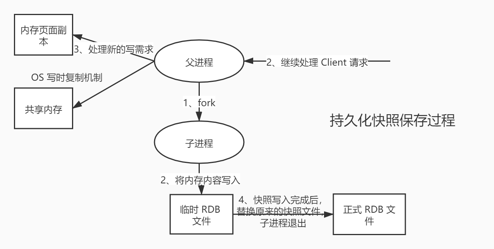

在指定的时间间隔内，将内存中的数据集快照写入磁盘，也就是 Snapshot 快照，它恢复时是将快照文件直接读取到内存里的。

Redis 会单独创建（fork）一个子进程进行持久化，会先将数据写入一个临时文件中，待持久化过程结束了，再用这个临时文件替换上次持久化好的文件。整个过程中，主进程不进行任何 IO 操作，这就确保的极高的性能。如果需要大规模的数据的恢复，且对数据恢复的完整性不是非常敏感，那 RDB 方式要比 AOF 方式更加高效。

> RDB 唯一的缺点是最后一次持久化的数据可能会丢失。
>
> 当fork时间点后的数据没有进入子进程，--->父进程将时间搓内数据进入共享内存---》此时会进入os写时复制机制（简称cow）--->创建新的RDB文件


生产环境下，需要对这个文件备份。

默认持久化方式是 RDB，一般不需要修改。rdb 保存的文件是 dump.rdb ：

```bash
dbfilename dump.rdb		## The filename where to dump the DB
```

**测试1：**

首先修改配置文件保存快照的策略

```bash
####################################### SNAPSHOTTING  #######################################
##
## Save the DB on disk:
##
##   save <seconds> <changes>
##
##   save ""

## save 900 1
## save 300 10
## save 60 10000
save 60 5  ## 只要 60s 内修改了 5 次 key 就会触发 rdb 操作。
```

```sh
root@lnb:~# redis-server /etc/redis/redis.conf // 保存redis配置
```

保存配置文件：

```bash
127.0.0.1:6379> save
OK
```

删除原始的 dump.rdb 文件：

```bash
[root@coder bin]## rm -rf dump.rdb 
[root@coder bin]## ls
```

60s 内修改 5 次 key ：

```bash
127.0.0.1:6379> set k1 v1
OK
127.0.0.1:6379> set k2 v2
OK
127.0.0.1:6379> set k3 v3
OK
127.0.0.1:6379> set k4 v4
OK
127.0.0.1:6379> set k5 v5
OK
```

dump.rdb 文件再次出现。

```bash
[root@coder bin]## ls
dump.rdb
```

恢复数据：

关闭 Redis 服务和客户端，再次进入时数据被自动恢复：

```bash
127.0.0.1:6379> shutdown		## 关闭 Redis 服务
not connected> exit
[root@coder bin]## ps -ef|grep redis		## redis 已经关闭了
root     25989 23576  0 14:27 pts/1    00:00:00 grep --color=auto redis
[root@coder bin]## redis-server redis-config/redis.conf 		## 再次开启服务
25994:C 02 May 2020 14:28:01.003 ## oO0OoO0OoO0Oo Redis is starting oO0OoO0OoO0Oo
25994:C 02 May 2020 14:28:01.003 ## Redis version=5.0.8, bits=64, commit=00000000, modified=0, pid=25994, just started
25994:C 02 May 2020 14:28:01.003 ## Configuration loaded
[root@coder bin]## redis-cli -p 6379		## 客户端连接
127.0.0.1:6379> get k2						## 可以直接获取数据，说明k2 被持久化了。
"v2"
```

------

保存数据方式一：save: 阻塞

保存数据方式二：bgsave: 非阻塞

**测试2：**

删除 dump.rdb 文件

```bash
[root@coder bin]## rm -rf dump.rdb 
[root@coder bin]## ls
```

在客户端清除所有数据：

```bash
127.0.0.1:6379> flushall
OK
```

再次检验 dump.rdb 文件：

```bash
[root@coder bin]## ls
dump.rdb
```

dump.rdb 文件再次出现。

> 触发机制

1、save 的规则满足的情况下，会自动触发 rdb 规则

2、执行 flushall 命令，也会触发 rdb 规则

3、退出 redis 也会产生 rdb 文件

备份就自动生成一个 dump.rdb 文件。

> 如何恢复 rdb 文件

1、只需要将 rdb 文件放在 Redis 启动目录就可以，Redis 启动的时候会自动检查 dump.rdb ，恢复其中的数据；

2、查看存放 rdb 文件的位置，在客户端中使用如下命令。

```bash
127.0.0.1:6379> config get dir
1) "dir"
2) "/usr/local/bin"  ## 如果在这个目录下存在 dump.rdb 文件，启动就会自动恢复其中的数据
127.0.0.1:6379> 
```

> RDB 的优缺点

**优点：**

1、适合大规模的数据恢复

2、对数据的完整性要求不高

**缺点：**

1、需要一定的时间间隔进行操作，如果 Redis 意外宕机，最后一次修改的数据就没有了

2、fork 进程的时候，会占用一定的空间。

### 4.2.2 AOF（Append Only File）

AOF( append only file )持久化以独立日志的方式记录每次写命令，并在 Redis 重启时在重新执行 AOF 文件中的命令以达到恢复数据的目的。AOF 的主要作用是解决数据持久化的实时性。

以日志形式来记录每个操作，将 Redis 执行的过程的所有指令记录下来（读操作不记录），只追加文件但不可以改写文件，redis 启动之初会读取该文件重新构建数据，换言之，redis 重启的话就根据日志文件的内容将写指令从前到后执行一遍以完成数据的恢复工作。

AOF 保存的是 appendonly.aof 文件。

> 开启 AOF 模式

将配置文件中默认为 no 的 appendonly 修改为 yes ，重启服务。

```bash
appendonly yes
## The name of the append only file (default: "appendonly.aof")
appendfilename "appendonly.aof"
```

重启后可以看到 AOF 文件：

```bash
[root@coder bin]## ls
appendonly.aof
```

但是文件是空的。使用客户端添加一些数据再次查看：

```bash
[root@coder bin]## redis-cli -p 6379
127.0.0.1:6379> set k1 v1
OK
127.0.0.1:6379> set k2 v2
OK
127.0.0.1:6379> set k3 v3
OK
127.0.0.1:6379> 
[root@coder bin]## cat appendonly.aof 
*2
$6
SELECT
$1
0
*3
$3
set
$2
k1
$2
v1
*3
$3
set
$2
k2
$2
v2
*3
$3
set
$2
k3
$2
v3
```

> 自动修复 AOF文件

如果手动修改AOF 文件，可能导致 Redis 服务不能启动。比如这里我手动在 AOF 文件的最后一行随便添加一些命令：

```bash
set
$2
k3
$2
v3
gjjjjjjjjj
```

删除 dump.rdb 文件，重启服务：

```bash
[root@coder bin]## rm -rf dump.rdb 
[root@coder bin]## ls
appendonly.aof  
[root@coder bin]## redis-server redis-config/redis.conf 
13746:C 02 May 2020 16:22:43.345 ## oO0OoO0OoO0Oo Redis is starting oO0OoO0OoO0Oo
13746:C 02 May 2020 16:22:43.346 ## Redis version=5.0.8, bits=64, commit=00000000, modified=0, pid=13746, just started
13746:C 02 May 2020 16:22:43.346 ## Configuration loaded
[root@coder bin]## redis-cli -p 6379
Could not connect to Redis at 127.0.0.1:6379: Connection refused		## 连接失败
not connected>
```

如果这个 AOF 文件有错位，客户端就不能链接了，需要修复 AOF 文件。Redis 提供了工具 `redis-check-aof --fix`

```bash
[root@coder bin]## redis-check-aof --fix appendonly.aof 
0x              6e: Expected prefix '*', got: 'g'
AOF analyzed: size=122, ok_up_to=110, diff=12
This will shrink the AOF from 122 bytes, with 12 bytes, to 110 bytes
Continue? [y/N]: y
Successfully truncated AOF
[root@coder bin]## 
```

重启服务，再次尝试链接成功。

> AOF 的优缺点

```bash
appendonly yes		## 默认是 no
appendfilename "appendonly.aof"  ## 持久化的文件的名字
## appendfsync always   ## 每次修改都会 sync ，消耗性能
appendfsync everysec   ## 每秒执行一次 sync ，可能会丢失这 1s 的数据
## appendfsync no       ## 不执行 sync，这个时候操作系统自己同步数据，速度最快
```

**优点：**

1、每一次修改都同步，文件的完整性更加好

2、每秒同步一次，可能会丢失一秒的数据

3、从不同步，效率最高的

**缺点：**

1、相对于数据文件来说， AOF 远远大于 RDB ，修复的速度也比 RDB 慢

2、AOF 的运行效率也比 RDB 慢，所以 Redis 默认的配置就是 RDB 持久化。

问题：如果每次写命令 都保存 ， set k1 v1 set k1 v2 set k1 v3 , 数据最终是v3 ，但是 每条命令都需要存储吗？ 如果存储，数据恢复的时候 每条命令执行，效率是不是有影响？

aof 有 重写功能，只会保留最后一条修改的命令。

### 4.2.3 拓展

1、RDB 持久化方式能够在指定的时间间隔内对你的数据进行快照存储

2、AOF 持久化方式记录每次对服务器写的操作，当服务器重启的时候会重新执行这些命令来恢复原始的数据，AOF 命令以Redis 协议追加保存每次写的操作到文件尾部，Redis 还能对 AOF 文件进性后台重写，使得AOF 文件的体积不至于过大（多次修改，只保留最后一次修改的命令）

3、只做缓存，如果你只希望你的数据在服务器运行的时候存在，你也可以不使用任何持久化

4、同时开启两种持久化方式

- 在这种情况下，当 Redis 重启的时候会优先加载AOF 文件来恢复原始的数据，因为在通常情况下，AOF 文件保存的数据集要比 RDB 文件保存的数据集要完整。
- RDB 的数据不实时，同步使用两者时服务器重启也只会找 AOF 文件。那要不要只使用 AOF 呢？作者建议不要，因为 RDB 更适合用于备份数据库（AOF 在不断变化不好备份），快速重启，而且不会有 AOF 可能潜在的 BUG，留着作为一个万一的手段。

5、性能建议

- 因为 RDB 文件只用作后备用途，建议只在 Slave 上持久化 RDB 文件，而且只要 15 分钟备份一次就够了，只保留save 900 1 这条规则。
- 如果 Enable AOF ，好处是在最恶劣情况下也只会丢失不超过两秒的数据，启动脚本较简单只 load 自己的 AOF 文件就可以了，代价是一是带来了持续的IO，二是 AOF rewrite 的最后将rewrite 过程中产生的新数据写到新文件造成的阻塞几乎是不可避免的。只要硬盘许可，应该尽量减少 AOF rewrite 的频率，AOF 重写的基础大小默认值是 64M 太小了，可以设置到 5G 以上，默认值超过原大小 100% 时重写，可以改到适当的数值。
- 如果不 Enable AOF ，仅靠 Master-Slave Repllcation 实现高可用也可以，能省掉一大笔 IO ，也减少了 rewrite 时带来的系统波动。代价是如果 Master/Slave 同时宕掉，会丢失十几分钟的数据，启动脚本也要比较两个 Master/Slave 中的 RDB 文件，载入较新的那个，微博就是这种架构

# 消息模式

Redis 发布订阅（pub/sub）是一种消息通信模式：发送者发（pub）送消息，订阅者(sub)接收消息。

Redis 客户端可以订阅任意数量的频道。

订阅 / 发布消息图：

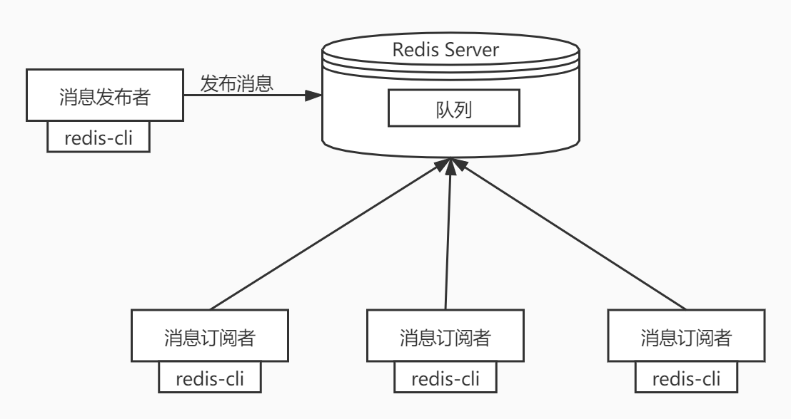

下图展示了频道 channel1，已经订阅这个频道的三个客户端。

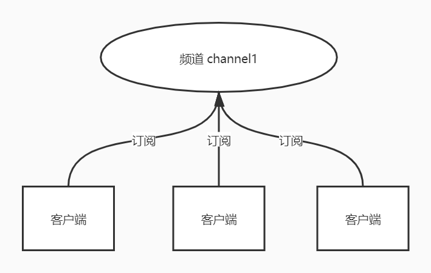

当有新消息通过 publish 命令发送给频道 channel1 时，这个消息就会被发送给订阅它的三个客户端。

> 命令

这些命令被广泛应用于构建即时通讯应用、比如网络聊天室和实时广播、实时提醒等。

| 序号 | 命令及描述                                                   |
| :--- | :----------------------------------------------------------- |
| 1    | [Psubscribe pattern [pattern ...\]open in new window](https://www.runoob.com/redis/pub-sub-psubscribe.html) 订阅一个或多个符合给定模式的频道。 |
| 2    | [PUBSUB subcommand [argument [argument ...\]]open in new window](https://www.runoob.com/redis/pub-sub-pubsub.html) 查看订阅与发布系统状态。 |
| 3    | [publish channel messageopen in new window](https://www.runoob.com/redis/pub-sub-publish.html) 将信息发送到指定的频道。 |
| 4    | [PUNsubscribe [pattern [pattern ...\]]open in new window](https://www.runoob.com/redis/pub-sub-punsubscribe.html) 退订所有给定模式的频道。 |
| 5    | [subscribe channel [channel ...\]open in new window](https://www.runoob.com/redis/pub-sub-subscribe.html) 订阅给定的一个或多个频道的信息。 |
| 6    | [UNsubscribe [channel [channel ...\]]open in new window](https://www.runoob.com/redis/pub-sub-unsubscribe.html) 指退订给定的频道。 |

> 测试

以下实例演示了发布订阅是如何工作的。在我们实例中我们创建了订阅频道名为 **redisChat**:

```bash
redis 127.0.0.1:6379> subscribe redisChat
Reading messages... (press Ctrl-C to quit)
1) "subscribe"
2) "redisChat"
3) (integer) 1
```

现在，我们先重新开启个 redis 客户端，然后在同一个频道 redisChat 发布两次消息，订阅者就能接收到消息。

```bash
redis 127.0.0.1:6379> publish redisChat "Redis is a great caching technique"
(integer) 1
redis 127.0.0.1:6379> publish redisChat "Learn redis by mszlu.com"
(integer) 1

## 订阅者的客户端会显示如下消息
1) "message"
2) "redisChat"
3) "Redis is a great caching technique"
1) "message"
2) "redisChat"
3) "Learn redis by mszlu.com"
```

> 原理

Redis 是使用 C 实现的，通过分析 Redis 源码里的 public.c 文件，了解发布和订阅机制的底层实现，借此加深对 Redis 的理解。Redis 通过 public 、subscribe 和 psubscribe 等命令实现发布和订阅功能。

**使用场景：**

1、实时消息系统

2、实时聊天

3、订阅、关注系统都可以

稍微复杂的场景更多的使用消息中间件 MQ。

# redis集群

##  主从复制

### 5.2.1 概念

主从复制，是指将一台 Redis 服务器的数据，复制到其他的 Redis 服务器。前者称之为主节点（master/leader），后者称之为从节点（slave/flower）；数据的复制都是单向的，只能从主节点到从节点。Master 以写为主，Slave 以读为主。

默认情况下，每台 Redis 服务器都是主节点。且一个主节点可以有多个从节点或者没有从节点，但是一个从节点只能有一个主节点。

### 5.2.2 主从复制的作用

> 1、数据冗余：主从复制实现了数据的热备份，是持久化的之外的一种数据冗余方式。
>
> 2、故障恢复：当主节点出现问题时，可以由从节点提供服务，实现快速的故障恢复。实际也是一种服务的冗余。
>
> 3、负载均衡：在主从复制的基础上，配合读写分离，可以由主节点提供写服务，由从节点提供读服务（即写 Redis 数据时应用连接主节点，读 Redis 的时候应用连接从节点），分担服务器负载；尤其是在写少读多的场景下，通过多个节点分担读负载，可以大大提高 Redis 服务器的并发量。
>
> 4、高可用（集群）的基石：除了上述作用以外，主从复制还是哨兵模式和集群能够实施的基础，因此说主从复制是 Redis 高可用的基础。

一般来说，要将Redis 运用于工程项目中，只使用一台 Redis 是万万不能的（可能会宕机），原因如下：

1、从结构上，单个 Redis 服务器会发生单点故障，并且一台服务器需要处理所有的请求负载，压力很大；

2、从容量上，单个 Redis 服务器内存容量有限，就算一台 Redis 服务器内存容量为 256G， 也不能将所有的内存用作 Redis 存储内存，一般来说，**单台 Redis最大使用内存不应该超过 20G**。

电商网站上的商品，一般都是一次上传，无数次浏览的，说专业点就是“读多写少”。

对于这种场景，我们可以使用如下这种架构：

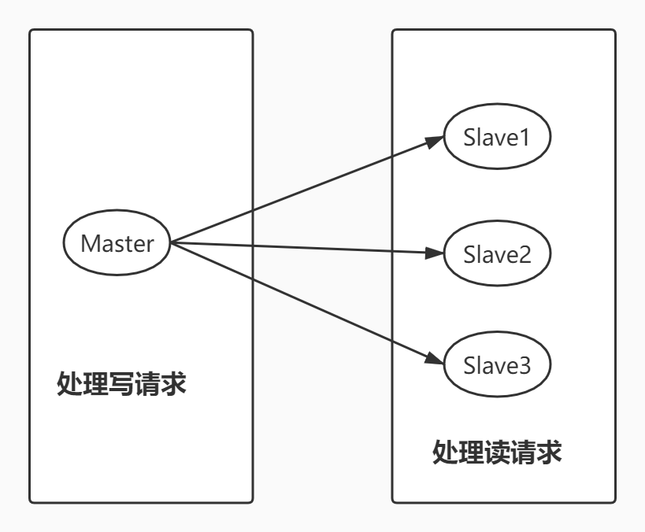

主从复制，读写分离！80% 的情况下，都是在进行读操作。这种架构可以减少服务器压力，经常使用实际生产环境中，最少是“一主二从”的配置。真实环境中不可能使用单机 Redis。

### 5.2.3 环境配置

只配置从库，不用配置主库。

```bash
[root@coder bin]## redis-cli -p 6379
127.0.0.1:6379> ping
PONG
127.0.0.1:6379> info replication			## 查看当前库的信息
## Replication
role:master									## 角色
connected_slaves:0							## 当前没有从库
master_replid:2467dd9bd1c252ce80df280c925187b3417055ad
master_replid2:0000000000000000000000000000000000000000
master_repl_offset:0
second_repl_offset:-1
repl_backlog_active:0
repl_backlog_size:1048576
repl_backlog_first_byte_offset:0
repl_backlog_histlen:0
127.0.0.1:6379> 
```

复制 3 个配置文件，然后修改对应的信息

1、端口

2、pid 名称

3、log 文件名称

4、dump.rdb 名称

```bash
port 6381
pidfile /var/run/redis_6381.pid
logfile "6381.log"
dbfilename dump6381.rdb
```

修改完毕后，启动我们的 3 个 redis 服务器，可以通过进程信息查询。

```bash
[root@coder ~]## ps -ef|grep redis
root       426     1  0 16:53 ?        00:00:00 redis-server *:6379
root       446     1  0 16:54 ?        00:00:00 redis-server *:6380
root       457     1  0 16:54 ?        00:00:00 redis-server *:6381
root       464   304  0 16:54 pts/3    00:00:00 grep --color=auto redis
```


### 5.2.4 一主二从

默认情况下，每台 Redis 服务器都是主节点，我们一般情况下，只用配置从机就好了。

主机：6379， 从机：6380 和 6381

配置的方式有两种：

- 一种是直接使用命令配置，这种方式当 Redis 重启后配置会失效。

- 另一种方式是使用配置文件。这里使用命令演示一下。

第一种方式：下面将80 和 81 两个配置为在从机。

```bash
127.0.0.1:6380> SLAVEOF 127.0.0.1 6379		## SLAVEOF host  port
OK
127.0.0.1:6380> info replication
## Replication
role:slave				## 角色已经是从机了
master_host:127.0.0.1	## 主节点地址
master_port:6379		## 主节点端口
master_link_status:up
master_last_io_seconds_ago:6
master_sync_in_progress:0
slave_repl_offset:0
slave_priority:100
slave_read_only:1
connected_slaves:0
master_replid:907bcdf00c69d361ede43f4f6181004e2148efb7
master_replid2:0000000000000000000000000000000000000000
master_repl_offset:0
second_repl_offset:-1
repl_backlog_active:1
repl_backlog_size:1048576
repl_backlog_first_byte_offset:1
repl_backlog_histlen:0
127.0.0.1:6380> 
```

配置好了之后，看主机：

```bash
127.0.0.1:6379> info replication
## Replication
role:master
connected_slaves:2		## 主节点下有两个从节点
slave0:ip=127.0.0.1,port=6380,state=online,offset=420,lag=1
slave1:ip=127.0.0.1,port=6381,state=online,offset=420,lag=1
master_replid:907bcdf00c69d361ede43f4f6181004e2148efb7
master_replid2:0000000000000000000000000000000000000000
master_repl_offset:420
second_repl_offset:-1
repl_backlog_active:1
repl_backlog_size:1048576
repl_backlog_first_byte_offset:1
repl_backlog_histlen:420
127.0.0.1:6379> 
```

第二种方式：真实的主从配置应该是在配置文件中配置，这样才是永久的。这里使用命令是暂时的。配置文件 redis.conf

```bash
######################################## REPLICATION ########################################
## Master-Replica replication. Use replicaof to make a Redis instance a copy of
## another Redis server. A few things to understand ASAP about Redis replication.
##
##   +------------------+      +---------------+
##   |      Master      | ---> |    Replica    |
##   | (receive writes) |      |  (exact copy) |
##   +------------------+      +---------------+
##
## 1) Redis replication is asynchronous, but you can configure a master to
##    stop accepting writes if it appears to be not connected with at least
##    a given number of replicas.
## 2) Redis replicas are able to perform a partial resynchronization with the
##    master if the replication link is lost for a relatively small amount of
##    time. You may want to configure the replication backlog size (see the next
##    sections of this file) with a sensible value depending on your needs.
## 3) Replication is automatic and does not need user intervention. After a
##    network partition replicas automatically try to reconnect to masters
##    and resynchronize with them.
##
replicaof <masterip> <masterport>			## 这里配置

## If the master is password protected (using the "requirepass" configuration
## directive below) it is possible to tell the replica to authenticate before
## starting the replication synchronization process, otherwise the master will
## refuse the replica request.
##
## masterauth <master-password>
```

配置方式也是一样的。

### 5.2.5 几个问题

1、主机可以写，从机不能写只能读。主机中的所有信息和数据都会保存在从机中。如果从机尝试进行写操作就会报错。

```bash
127.0.0.1:6381> get k1			## k1的值是在主机中写入的，从机中可以读取到。
"v1"
127.0.0.1:6381> set k2 v2			## 从机尝试写操作，报错了
(error) READONLY You can't write against a read only replica.
127.0.0.1:6381> 
```

2、如果主机断开了，从机依然链接到主机，可以进行读操作，但是还是没有写操作。这个时候，主机如果恢复了，从机依然可以直接从主机同步信息。

3、使用命令行配置的主从机，如果从机重启了，就会变回主机。如果再通过命令变回从机的话，立马就可以从主机中获取值。这是复制原理决定的。

### 5.2.6 复制原理

**Slave 启动成功连接到 Master 后会发送一个 sync 同步命令。**

Master 接收到命令后，启动后台的存盘进程，同时收集所有接收到的用于修改数据集的命令，在后台进程执行完毕后，master 将传送整个数据文件到 slave ，并完成一次完全同步。

同步的数据 使用的是RDB文件，收到同步命令之后，master会bgsave 把数据保存在rdb中，发送给从机。

bgsave：fork出来一个子进程 进行处理，不影响主进程的使用。

**全量复制：**Slave 服务在接收到数据库文件后，将其存盘并加载到内存中。

**增量复制：** Master 继续将新的所有收集到的修改命令一次传给 slave，完成同步。

但是只要重新连接 master ，一次完全同步（全量复制）将被自动执行。我们的数据一定可以在从机中看到。

这种模式的原理图：

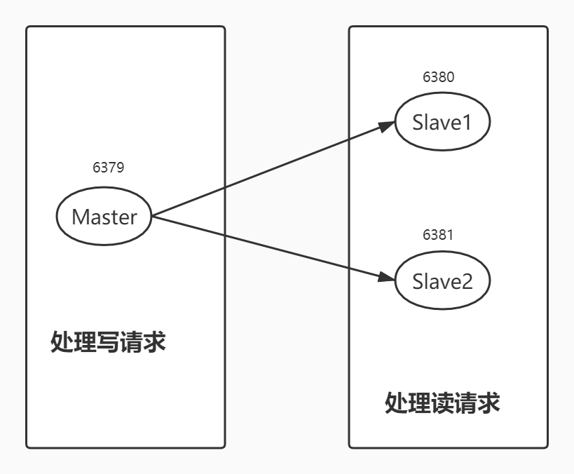

**第二种模式**

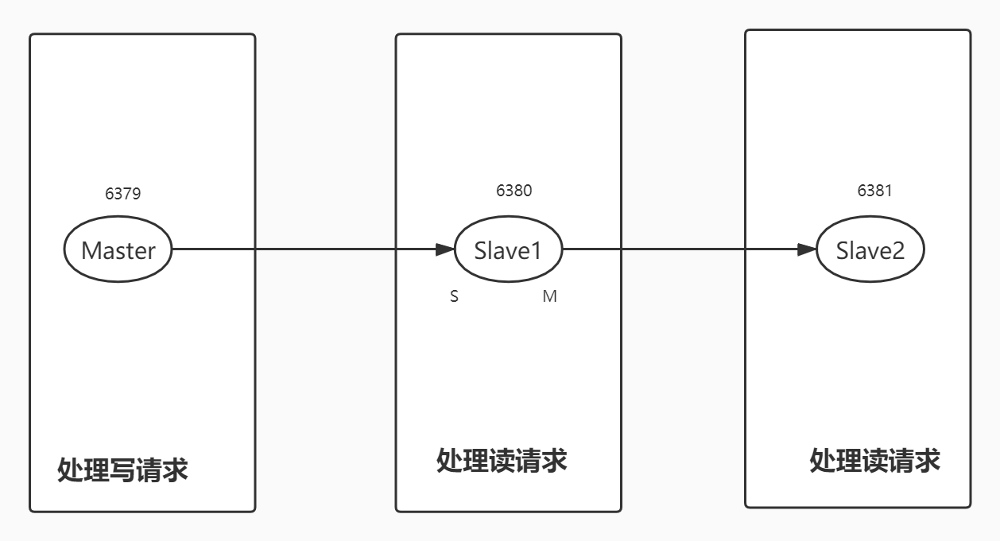

这种模式的话，将 6381 的主节点配置为 6380 。主节点 6379 只有一个从机。

如果现在 6379 节点宕机了， 6380 和 6381 节点都是从节点，只能进行读操作，都不会自动变为主节点。需要手动将其中一个变为主节点，使用如下命令：

```bash
SLAVEOF no one
```

## 哨兵模式

### 5.3.1 概述

主从切换技术的方式是：当主机服务器宕机之后，需要手动将一台服务器切换为主服务器，这需要人工干预，费时费力，还会造成一段时间内的服务不可用。这不是一种推荐的方式，更多的时候我们优先考虑的的是哨兵模式。Redis 从 2.8 开始正式提供了 Sentinel（哨兵）架构来解决这个问题。

哨兵模式能够后台监控主机是否故障，如果故障了根据投票数（投哨兵节点）自动将从库转换为主库。

当有多个哨兵节点的时候，需要选出一个哨兵节点 来去进行主从切换。

哨兵模式是一种特殊的模式，首先 Redis 提供了哨兵的命令，哨兵是一个独立的进程，作为进程，它独立运行。其原理是**哨兵通过发送命令，等待 Redis 服务器响应，从而监控运行的多个 Redis 实例**。

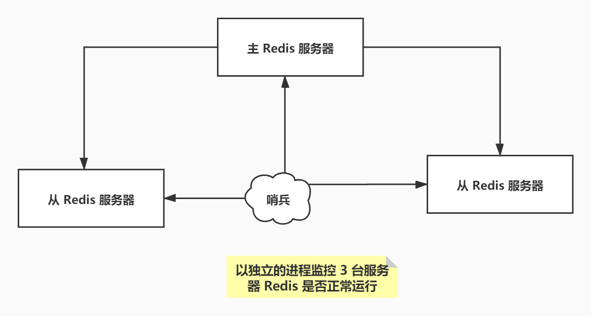

这里的哨兵有两个作用

- 通过发送命令，让 Redis 服务器返回监控其运行状态，包括主服务器和从服务器
- 当哨兵检测到 master 宕机，会自动将 slave 切换为 master，然后通过发布订阅模式通知其他的从放服务器，修改配置文件，让他们切换主机。

然而一个哨兵进程对 Redis 服务器进行监控，可能会出现问题，为此，我们可以使用多个哨兵进行监控。各个哨兵之间还会进行监控，这样就形成了多哨兵模式。

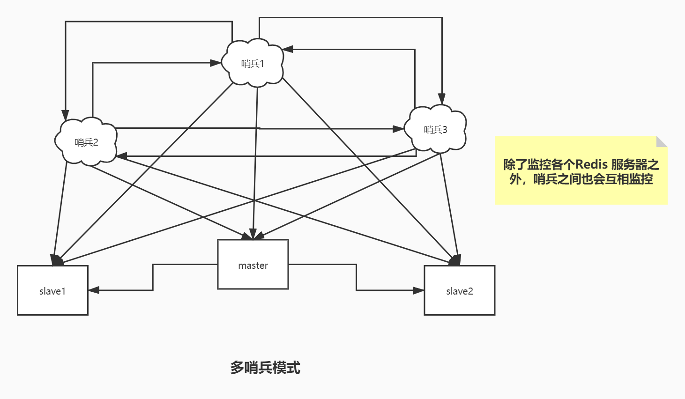

假设主服务器宕机了，哨兵1先检测到这个结果，系统并不会马上进行 failover 过程，仅仅是哨兵 1 主观认为主服务器不可用，这个现象称之为**主观下线**。当后面的哨兵也检测到主服务器不可用，并且数量达到一定值时，这个过程称之为**客观下线**，那么哨兵之间就会进行一次投票，投票的结果由一个哨兵发起，最终会选出来一个leader（哨兵节点），进行 failover 【故障转移】。切换成功后，就会通过发布订阅模式，让各个哨兵把自己监控的从服务器实现切换主从切换。

### 5.3.2 配置一个一主两从的哨兵模式

1、配置哨兵模式配置文件，新建文件 `/usr/local/bin/redis-config/sentinel.conf`。

```bash
sentinel monitor myredis 127.0.0.1 1	## sentinel monitor 被监控的名字（随便写） host 1
```

后面的数字1代表主机宕机后，slave投票决定谁成为新的主机，票数最多成为主机。

2、启动哨兵

```bash
[root@coder bin]## ls
6379.log  6381.log      dump6380.rdb  dump.rdb  redis-benchmark  redis-check-rdb  redis-sentinel
6380.log  dump6379.rdb  dump6381.rdb  redis-config   redis-check-aof  redis-cli        redis-server
[root@coder bin]## redis-sentinel redis-config/sentinel.conf 
2421:X 15 May 2020 20:24:06.847 ## oO0OoO0OoO0Oo Redis is starting oO0OoO0OoO0Oo
2421:X 15 May 2020 20:24:06.847 ## Redis version=5.0.5, bits=64, commit=00000000, modified=0, pid=2421, just started
2421:X 15 May 2020 20:24:06.847 ## Configuration loaded
                _._                                                  
           _.-``__ ''-._                                             
      _.-``    `.  `_.  ''-._           Redis 5.0.5 (00000000/0) 64 bit
  .-`` .-```.  ```\/    _.,_ ''-._                                   
 (    '      ,       .-`  | `,    )     Running in sentinel mode
 |`-._`-...-` __...-.``-._|'` _.-'|     Port: 26379
 |    `-._   `._    /     _.-'    |     PID: 2421
  `-._    `-._  `-./  _.-'    _.-'                                   
 |`-._`-._    `-.__.-'    _.-'_.-'|                                  
 |    `-._`-._        _.-'_.-'    |           http://redis.io        
  `-._    `-._`-.__.-'_.-'    _.-'                                   
 |`-._`-._    `-.__.-'    _.-'_.-'|                                  
 |    `-._`-._        _.-'_.-'    |                                  
  `-._    `-._`-.__.-'_.-'    _.-'                                   
      `-._    `-.__.-'    _.-'                                       
          `-._        _.-'                                           
              `-.__.-'                                               

2421:X 15 May 2020 20:24:06.848 ## WARNING: The TCP backlog setting of 511 cannot be enforced because /proc/sys/net/core/somaxconn is set to the lower value of 128.
2421:X 15 May 2020 20:24:06.851 ## Sentinel ID is 100430af0018d23bd1ae2fe57e71e0d45f64d9a5
2421:X 15 May 2020 20:24:06.851 ## +monitor master myredis 127.0.0.1 6379 quorum 1
2421:X 15 May 2020 20:24:06.852 * +slave slave 127.0.0.1:6381 127.0.0.1 6381 @ myredis 127.0.0.1 6379
```

启动成功~！

如果现在 Master 节点宕机了，这个时候会从从机中根据投票算法选择一个作为主机。

如果原来的主机恢复运行了，只能归到新的主机下，作为从机， 这就是哨兵模式的规则。

> 哨兵模式的优点

1、哨兵集群，基于主从复制模式，所有的主从配置优点，它全有

2、主从可以切换，故障可以转移，系统的可用性就会更好

3、哨兵模式就是主从模式的升级，手动到自动，更加健壮。

> 哨兵模式的缺点

1、Redis 不方便在线扩容，集群达到一定的上限，在线扩容就会十分麻烦；

2、实现哨兵模式的配置其实也很麻烦，里面有甚多的配置项。


## Redis Cluster集群

> 随着业务系统功能、模块、规模、复杂性的增加，我们对Redis的要求越来越高，尤其是在高低峰场景的动态伸缩能力，比如：电商平台平日流量较低且平稳，双十一大促流量是平日的数倍，两种情况下对于各系统的数量要求必然不同。如果始终配备高峰时的硬件及中间件配置，必然带来大量的资源浪费。
>
> Redis作为业界优秀的缓存产品，成为了各类系统的必备中间件。哨兵模式虽然优秀，但由于其不具备动态水平伸缩能力，无法满足日益复杂的应用场景。在官方推出集群模式之前，业界就已经推出了各种优秀实践，比如：Codis、twemproxy等。

为了弥补这一缺陷，自3.0版本起，Redis官方推出了一种新的运行模式——**Redis Cluster**。

**Redis Cluster**采用无中心结构，具备多个节点之间自动进行数据分片的能力，支持节点动态添加与移除，可以在部分节点不可用时进行自动故障转移，确保系统高可用的一种集群化运行模式。按照官方的阐述，Redis Cluster有以下设计目标：

- 高性能可扩展，支持扩展到1000个节点。多个节点之间数据分片，采用异步复制模式完成主从同步，无代理方式完成重定向。
- 一定程度内可接受的写入安全：系统将尽可能去保留客户端通过大多数主节点所在网络分区所有的写入操作，通常情况下存在写入命令已确认却丢失的较短时间窗口。如果客户端连接至少量节点所处的网络分区，这个时间窗口可能较大。
- 可用性：如果大多数节点是可达的，并且不可达主节点至少存在一个可达的从节点，那么Redis Cluster可以在网络分区下工作。而且，如果某个主节点A无从节点，但是某些主节点B拥有多个（大于1）从节点，可以通过从节点迁移操作，把B的某个从节点转移至A。

简单概述。结合以上三个目标，我认为Redis Cluster最大的特点在于可扩展性，多个主节点通过分片机制存储所有数据，即每个主从复制结构单元管理部分key。

因为在主从复制、哨兵模式下，同样具备其他优点。

当系统容量足够大时，读请求可以通过增加从节点进行分摊压力，但是写请求只能通过主节点，这样存在以下风险点：

- 所有写入请求集中在一个Redis实例，随着请求的增加，单个主节点可能出现写入延迟。
- 每个节点都保存系统的全量数据，如果存储数据过多，执行rdb备份或aof重写时fork耗时增加，主从复制传输及数据恢复耗时增加，甚至失败；
- 如果该主节点故障，在故障转移期间可能导致所有服务短时的数据丢失或不可用。

所以，动态伸缩能力是Redis Cluster最耀眼的特色。

### 1. 哈希槽

Redis-cluster引入了**哈希槽**的概念。

Redis-cluster中有16384(即2^14次方）个哈希槽，每个key通过CRC16校验后对16384取模（%）来决定放置哪个槽。

Cluster中的每个节点负责一部分hash槽（hash slot）。

比如集群中存在三个节点，则可能存在的一种分配如下：

- 节点A包含0到5500号哈希槽；
- 节点B包含5501到11000号哈希槽；
- 节点C包含11001 到 16383号哈希槽。

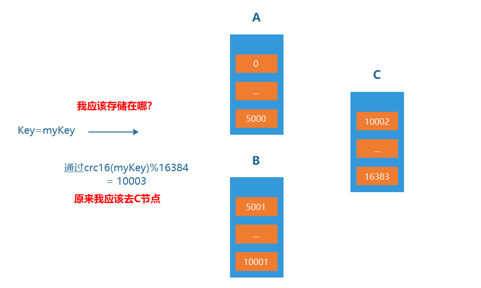

### 2. 请求重定向

Redis cluster采用去中心化的架构，集群的主节点各自负责一部分槽，客户端如何确定key到底会映射到哪个节点上呢？这就是我们要讲的请求重定向。

在cluster模式下，**节点对请求的处理过程**如下：

- 检查当前key是否存在当前NODE？
  - 通过crc16（key）/16384计算出slot
  - 查询负责该slot负责的节点，得到节点指针
  - 该指针与自身节点比较
- 若slot不是由自身负责，则返回MOVED重定向
- 若slot由自身负责，且key在slot中，则返回该key对应结果
- 若key不存在此slot中，检查该slot是否正在迁出（MIGRATING）？
- 若key正在迁出，返回ASK错误重定向客户端到迁移的目的服务器上
- 若Slot未迁出，检查Slot是否导入中？
- 若Slot导入中且有ASKING标记，则直接操作
- 否则返回MOVED重定向

move重定向：

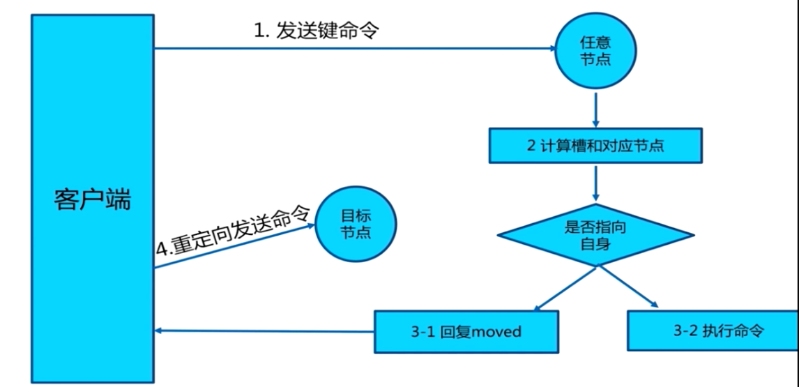

- 槽命中：直接返回结果
- 槽不命中：即当前键命令所请求的键不在当前请求的节点中，则当前节点会向客户端发送一个Moved 重定向，客户端根据Moved 重定向所包含的内容找到目标节点，再一次发送命令。

ASK 重定向：

Ask重定向发生于集群伸缩时，集群伸缩会导致槽迁移，当我们去源节点访问时，此时数据已经可能已经迁移到了目标节点，使用Ask重定向来解决此种情况


### 3. Cluster集群结构搭建

**搭建方式**

1. 配置服务器（3主3从） 2. 建立通信（Meet） 3. 分槽（Slot） 4. 搭建主从（master-slave）

**Cluster配置：**

1. 是否启用cluster，加入cluster节点

 ```properties
 cluster-enabled yes|no
 ```

2. cluster配置文件名，该文件属于自动生成，仅用于快速查找文件并查询文件内容

 ```properties
 cluster-config-file filename
 ```

3. 节点服务响应超时时间，用于判定该节点是否下线或切换为从节点

 ```properties
 cluster-node-timeout milliseconds
 ```

4. master连接的slave最小数量

```properties
cluster-migration-barrier min_slave_number
```

**Cluster节点操作命令:**

1. 查看集群节点信息

 ```properties
 cluster nodes
 ```

2. 更改slave指向新的master

 ```properties
 cluster replicate master-id
 ```

3. 发现一个新节点，新增master

 ```properties
 cluster meet ip:port
 ```

4. 忽略一个没有solt的节点

 ```properties
 cluster forget server_id
 ```

5. 手动故障转移

 ```properties
 cluster failover
 ```

**redis-cli命令**

1. 创建集群

 ```properties
   redis-cli –-cluster create masterhost1:masterport1 masterhost2:masterport2
   masterhost3:masterport3 [masterhostn:masterportn …] slavehost1:slaveport1
   slavehost2:slaveport2 slavehost3:slaveport3 ––cluster-replicas n
 ```

   master与slave的数量要匹配，一个master对应n个slave，由最后的参数n决定

   master与slave的匹配顺序为第一个master与前n个slave分为一组，形成主从结构

2. 添加master到当前集群中，连接时可以指定任意现有节点地址与端口

 ```properties
   redis-cli --cluster add-node new-master-host:new-master-port now-host:now-port
 ```

3. 添加slave

 ```properties
   redis-cli --cluster add-node new-slave-host:new-slave-port
   master-host:master-port --cluster-slave --cluster-master-id masterid
 ```

4. 删除节点，如果删除的节点是master，必须保障其中没有槽slot

 ```properties
   redis-cli --cluster del-node del-slave-host:del-slave-port del-slave-id
 ```

5. 重新分槽，分槽是从具有槽的master中划分一部分给其他master，过程中不创建新的槽

 ```properties
   redis-cli --cluster reshard new-master-host:new-master:port --cluster-from srcmaster-id1, src-master-id2, src-master-idn --cluster-to target-master-id --cluster-slots slots
 ```

将需要参与分槽的所有masterid不分先后顺序添加到参数中，使用，分隔指定目标得到的槽的数量，所有的槽将平均从每个来源的master处获取

1. 重新分配槽，从具有槽的master中分配指定数量的槽到另一个master中，常用于清空指定master中的槽

 ```properties
   redis-cli --cluster reshard src-master-host:src-master-port --cluster-from srcmaster-id --cluster-to target-master-id --cluster-slots slots --cluster-yes 
 ```

# 7. 缓存穿透、缓存击穿和缓存雪崩

## 7.1 Redis可能的问题

Redis 缓存的使用，极大的提升了应用程序的性能和效率，特别是数据查询方面。但同时，它也带了一些问题。其中，最要害的是问题，就是数据一致性的问题，从严格意义上讲，这个问题无解。如果对数据的一致性要求很高，那么久不能使用缓存。

另外一些典型的问题就是，缓存穿透、缓存雪崩缓存击穿，目前，是业界也都有比较流行的解决方案。

## 7.2 缓存穿透（查不到数据导致）

**问题**：缓存穿透是指查询一个根本不存在的数据，由于缓存中没有该数据的缓存，且数据库中也没有该数据，导致每次请求都要到数据库查询，失去了缓存的意义。

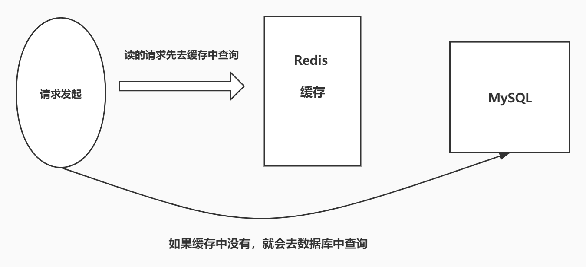

> 解决方案：布隆过滤器

### 7.2.1 布隆过滤器

布隆过滤器是一种数据结构，对所有可能查询的参数以 hash 形式存储，在控制层先进行校验，不符合则丢弃，从而避免了对底层存储系统的查询压力。

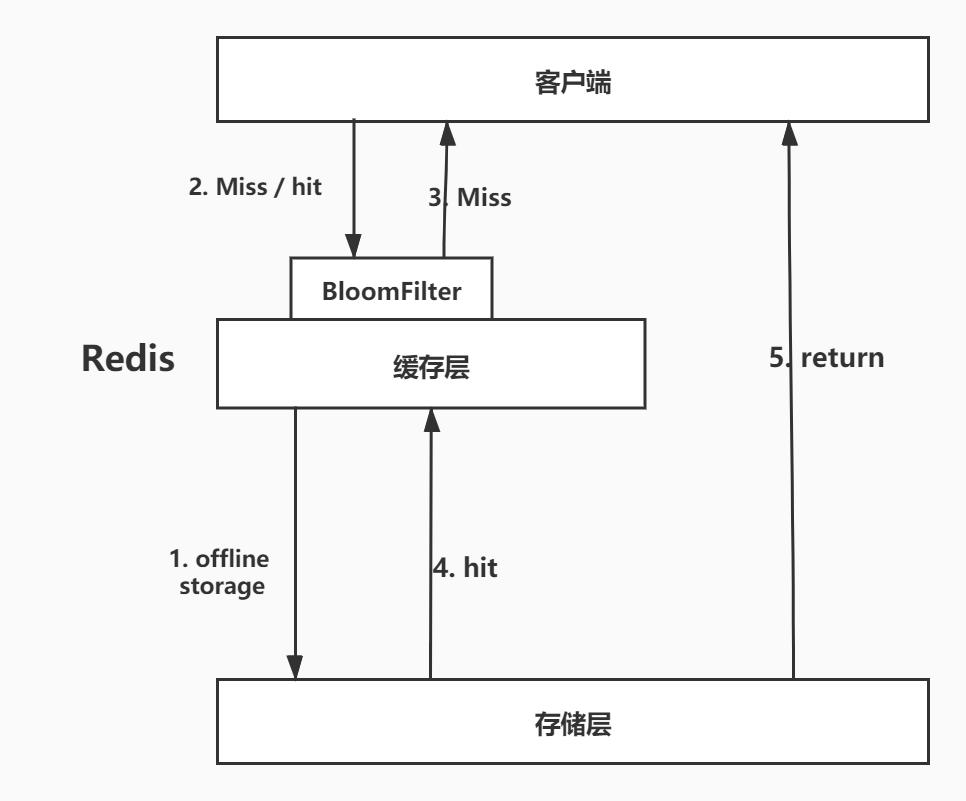

### 7.2.2 缓存空对象

当存储层不命中后，即使返回的空对象也将其缓存起来，同步会同步一个过期时间，之后再访问这个数据将会从存储中获取，保护了后端数据源。

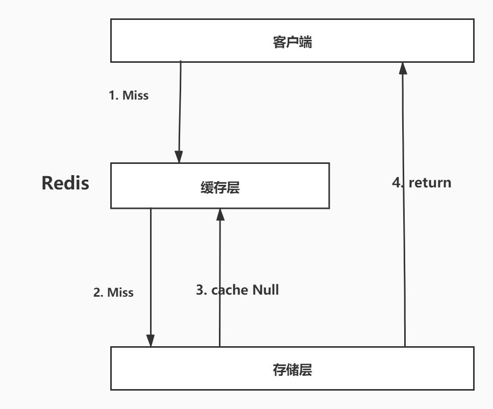

但是这种方法会存在两个问题：

1、如果控制能够被缓存起来，这就意味着缓存需要更多的空间存储，因为这当中可能会有很多的空值的键；

2、即使对空值设置了过期时间，还是会存在缓存层和存储层的数据会有一段时间窗口的不一致，这对于需要保持一致性的业务会有影响。

## 7.3 缓存击穿

**热点数据在缓存过期瞬间被大量请求**

**问题**：缓存击穿是指某个热点数据在缓存过期的瞬间，有大量请求同时到达，导致请求直接打到数据库，可能引起数据库压力过大。

> 解决方案：

### 7.3.1 设置热点数据永不过期

从缓存层来看，没有设置过期时间，所以不会出现热点 key 过期后产生的问题。

### 7.3.2 加互斥锁

分布式锁：使用分布式锁，保证对于每个 key 同时只有一个线程去查询后端服务，其他线程没有获得分布式锁的权限，因此只需要等待即可。这种方式将高并发的压力转移到了分布式锁，因对分布式锁的考验很大。

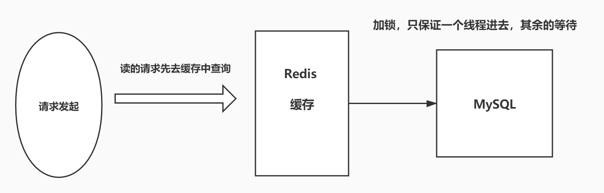

## 7.4 缓存雪崩

**问题**：缓存雪崩是指在某一时刻，大量缓存同时过期，导致大量请求直接打到数据库，可能引起数据库崩溃。

产生雪崩的原因之一，比如马上就要双十二零点，很快就会有一波抢购，这波商品时间比较集中的放在了缓存，假设缓存一个小时。那么到了凌晨一点钟的时候，这批商品的缓存就都会过期了。而对这批商品的访问查询，都落到数据库上，对于数据库而言，就会产生周期性的压力波峰。于是所有的请求都会到达存储层，存储层的调用量会暴增，造成存储层也回掉的情况。

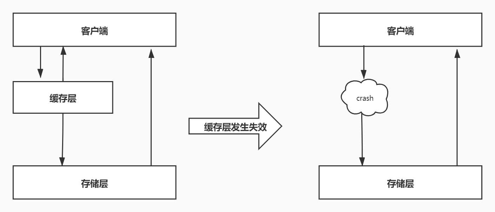

其实集中时期，倒不是非常致命，比较致命的缓存雪崩，是缓存服务器某个节点宕机或者断网。因为自然形成 的缓存雪崩，一定是某个时间段中创建缓存，这个时候也是可以顶住压力的。无非就是对数据库产生周期性的压力而已。而缓存服务节点的宕机，对于数据库服务器的压力是不可预的，很有可能瞬间就把数据库压垮。

> 解决方案

### 7.4.1 Redis 高可用

这个思想的含义是，既然 redis 有可能挂掉，那我多增设几台 redis，这样一台挂掉之后其他的还可以继续工作，其实就是搭建的集群

### 7.4.2 限流降级

这个解决方案的思想是，在缓存失效后，通过加锁或者队列来控制数据库写缓存的线程数量。比如对某个 key 只允许一个线程查询数据和写缓存，其他线程等待。

### 7.4.3 数据预热

数据预热的含义是在正式部署之前，把可能的数据线预先访问一遍，这样部分可能大量访问的数据就会加载到缓存。在即将发生大并发访问前手动触发加载缓存不同的key，设置不同的过期时间，让缓存失效的时间点尽量均匀。


# 8. Redis面试题

## 8.1 什么是Redis？有什么特点

Redis 是一款开源，高性能的 key-value 的非关系型数据库。内存数据库 **特点**： 1）支持持久化，可以将内存中的数据持久化到磁盘，重启可以再次从磁盘中加载使用； 2）支持多种数据结构； 3）支持数据的备份：主从模式的备份；支持集群 4）高性能，读速度达 11 万次/秒，写速度达到 8.1 万次/秒 5）支持事务

## 8.2 说说 Redis 的数据类型

一共 8 种 5 种基本数据类型：String、Hash、List、Set、Zset 3 种特殊类型：geospatial、hyperloglog、bitmap

## 8.3 Redis 和 Memcache 的区别？

1）Memcache 数据都存储在内存中，断电即失，数据不能超过内存大小；而 Redis 的数据可以持久化到硬盘。 2） Memcache 只支持简单的字符串，Redis 有丰富的数据结构； 3）底层实现方式不一样，Redis 自行构建了 VM 机制，速度更快。

## 8.4 Redis 是单线程的？

Redis 将数据放在内存中，单线程执行效率最高，多线程执行反而需要进行 CPU 上下文切换，这是个耗时操作，单线程效率最高。

## 8.5 说说 Redis的持久化

Redis 提供了两种持久化机制：RDB 和 AOF

RDB 持久化机制指的是，用**数据集快照的方式记录 Redis 数据库的所有键值对，在某个时间点写入一个临时文件**，持久化结束后，用这个临时文件替换上次持久化的文件，达到数据恢复的目的。 **优点**： 1）只有一个文件 dump.rdb 方便持久化； 2）容灾性好，一个文件可以保存到安全的磁盘； 3）性能最大化，Redis 会单独创建（fork）一个子进程进行持久化，主进程不进行任何 IO 操作，保证了性能； 4）在数据较多时，比 AOF 的启动效率高。 **缺点**： 最后一次持久化的数据可能会丢失。

AOF 持久化，是以独立日志的方式记录每次写命令，并在 Redis 重启时重新执行 AOF 文件中的命令以达到恢复数据的目的。AOF 主要解决数据持久化的实时性。 **优点**： 1）数据安全，配置 appendfsync 属性，可以选择不同的同步策略； 2）自动修复功能， redis-check-aof工具可以解决数据一致性问题； **缺点**： 1）AOF 文件比 RDB 文件大，且恢复速度慢； 2）数据多时，效率低于 RDB。

AOF如何防止文件过大？AOF重写，只保留最后一次的修改记录。

## 8.6 Redis 的主从复制

主从复制值的是将一台 Redis 服务器的数据复制其他 Redis 服务器，前者称之为主节点，后者称之为从节点。

**主从复制的作用**： 1）数据冗余：主从复制实现了数据的热备份； 2）故障修复：当主节点出现故障后，从节点还可以提供服务，实现快速的故障修复。 3）负载均衡：在主从复制的基础上，配合读写分离，可以由主节点提供写操作，从节点提供读操作，实现负载均衡，提高并发量； 4）高可用的基石：主从复制是哨兵模式的基础。

**复制原理**： 从节点启动成功连接到主节点后，会发送一个 sync 的同步命令。主节点接收到命令之后，启动后台的存盘进程，收集所有修改数据库的命令，在后台执行完毕后将整个数据文件传送到从节点，完成一次完全同步。 **全量复制**：从节点在接收到了数据文件后，将其存盘文件加载都内存中； **增量复制**：主节点继续将新收集到修改命令传递给从节点，完成同步

## 8.7 说说哨兵模式

哨兵模式是为了解决手动切换主节点的问题。Redis 提供了哨兵的命令，哨兵是一个**独立的进程**。哨兵能够后台监控主节点是否故障，如果故障需要将从节点选举为主节点。

其原理是哨兵通过发送命令，等待 Redis 服务器的响应，从而监控多个 Redis 节点。

当只有一个哨兵时，还是可能会出现问题的，比如哨兵自己挂掉。为此，可以使用多哨兵模式，多个哨兵之间相互监控。当主节点宕机了，哨兵1先检测到这个结果，系统并不会马上进行 failover 【故障转移】的过程。仅仅是哨兵1认为主节点不可用的现象称之为**主观下线**。当其余的哨兵也检测到主节点不可用之后，哨兵之间会进行一次投票选举从节点中的一个作为新的主节点，这个过程称之为**客观下线**。

**哨兵模式的优点**： 1）基于主从复制，高可用； 2）主从可以切换，进行故障转移，系统可用性好； 3）哨兵模式是主从模式的升级版，手动到自动，更加健壮。

**哨兵模式的缺点**： 1）不方便在线扩容； 2）实现哨兵模式需要很多的配置。

## 8.8 缓存穿透、缓存击穿和缓存雪崩

缓存穿透：

**概念**：用户需要查询一个数据，缓存中没有，也就是没有命中，于是向数据库中发起请求，发现也没有。当用户很多的时候，缓存都没有命中，于是都去请求数据库，这给数据库造成很大的压力。

**解决方案**：

- 布隆过滤器：是一种数据结构，对所有可能查询的参数以 hash 方式存储，先在控制层进行校验，不符合则丢弃，避免了过多访问数据库。
- 缓存空对象：当存储层没有命中时，即使返回空对象也将其缓存起来。（意味着更多的空间存储，即使设置了过期时间，缓存和数据库还是有段时间数据不一致。）

缓存击穿：

**概念**：当一个 key 非常热点时，在不断扛高并发，集中对这个热点数据进行访问，当这个 key 失效的瞬间，请求直接到达数据库，给数据库瞬间的高压力。

**解决方案**：

- 设置热点数据永不过期
- 加分布式锁：保证每个 key 同时只有一个线程去查询后端服务。

缓存雪崩：

**概念**：某个时间段，缓存集中失效

**解决方案**：

- 增加 Redis 集群的数量
- 缓存过期时间的时候，错峰设置
- 限流降级：在缓存失效后，通过加锁和队列来控制数据库写缓存的线程数量
- 数据预热：正式部署之前，将数据预先访问一遍，让缓存失效的时间尽量均匀

## 8.9 Redis 的使用场景

1）会话缓存：如 单点登录，使用 Redis 模拟 session，SSO 系统生成一个 token，将用户信息存到 Redis 中，并设置过期时间； 2）全页缓存 3）作为消息队列平台 4）排行榜和计数器 5）发布/订阅：比如聊天系统 6）热点数据：比如ES中搜索的热词

## 8.10 Redis 缓存如何保持一致性

读数据的时候首先去 Redis 中读取，没有读到再去 MySQL 中读取，读取到数据更新到 Redis 中作为下一次的缓存。

写数据的时候会产生数据不一致的问题。无论是先写入 Redis 再写入 MySQL 中，还是先写入 MySQL 再写入 Redis 中，这两步操作**都不能保证原子性**，所以会出现 Redis 和 MySQL 中数据不一致的问题。

**无论采取何种方式都不能保证强一致性**，如果对 Redis 中的数据设置了**过期时间，能够保证最终一致性**，对架构的优化只能降低发生的概率，不能从根本上避免不一致性。

更新缓存的两种方式：删除失效缓存、更新缓存 更新缓存和数据库有两种顺序：先数据库后缓存、先缓存后数据库 两两组合，分为四种更新策略。

## 8.11 集群

redis cluster 分为 16384个槽，最多可支持1000个节点，数据存放时，根据CRC16(key)%16384取模，得到对应的槽，存放到槽对应的节点上。

取数据时，会计算槽，进行请求重定向，如果在当前节点，直接返回数据，不在move到对应节点，获取数据
