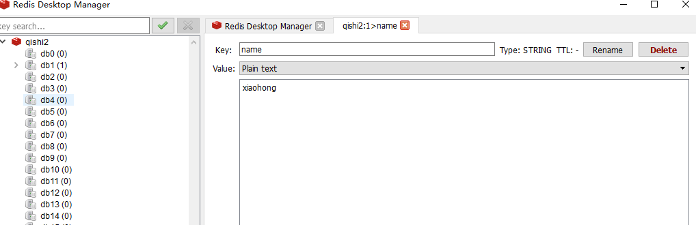

# 一、引言

在Web应用发展的初期，那时关系型数据库受到了较为广泛的关注和应用，原因是因为那时候Web站点基本上访问和并发不高、交互也较少。而在后来，随着访问量的提升，使用关系型数据库的Web站点多多少少都开始在性能上出现了一些瓶颈，而瓶颈的源头一般是在磁盘的I/O上。而随着互联网技术的进一步发展，各种类型的应用层出不穷，这导致在当今云计算、大数据盛行的时代，对性能有了更多的需求，主要体现在以下几个方面：

> 1. 低延迟的读写速度：应用快速地反应能极大地提升用户的满意度
> 2. 支撑海量的数据和流量：对于搜索这样大型应用而言，需要利用PB级别的数据和能应对百万级的流量
> 3. 大规模集群的管理：系统管理员希望分布式应用能更简单的部署和管理

为了克服这一问题，NoSQL应运而生，它同时具备了高性能、可扩展性强、高可用等优点，受到广泛开发人员和仓库管理人员的青睐。

**关系型数据库（RMDBS）与非关系型数据库（NoSQL）的对比：**

数据库中表与表的数据之间存在某种关联的内在关系，因为这种关系，所以我们称这种数据库为关系型数据库。典型：Mysql/MariaDB、postgreSQL、Oracle、SQLServer、DB2、Access、SQLlite3。特点： 

> 1. 全部使用SQL（结构化查询语言）进行数据库操作。
> 2. 都存在主外键关系，表，等等关系特征。
> 3. 大部分都支持各种关系型的数据库的特性：事务、存储过程、触发器、视图、临时表、模式、函数

NOSQL：not only sql，泛指非关系型数据库。泛指那些不使用SQL语句进行数据操作的数据库，所有数据库中只要不使用SQL语句的都是非关系型数据库。典型：Redis、MongoDB、hbase、 Hadoop、elasticsearch、图数据库(Neo4j、GraphDB、SequoiaDB)

# 二、redis介绍

## 2.1、定义

> Redis（Remote Dictionary Server ，远程字典服务） 是一个使用ANSI C编写的开源、支持网络、基于内存、可选持久性的键值对存储数据库，是NoSQL数据库。

redis的出现主要是为了替代早期的Memcache缓存系统的。map内存型(数据存放在内存中)的非关系型(nosql)key-value(键值存储)数据库，
支持数据的持久化(基于RDB和AOF，注: 数据持久化时将数据存放到文件中，每次启动redis之后会先将文件中数据加载到内存，经常用来做缓存、数据共享、购物车、消息队列、计数器、限流等。(最基本的就是缓存一些经常用到的数据，提高读写速度)。

redis特性：

> - 速度快
> - 持久化
> - 多种数据结构
> - 支持多种编程语言
> - 主从复制
> - 高可用、分布式

## 2.2、Redis的数据类型及主要特性

Redis提供的数据类型主要分为5种自有类型和一种自定义类型，这5种自有类型包括：String类型、哈希类型、列表类型、集合类型和顺序集合类型。

```
redis={
"name":"yuan",
"age":"23",
"scors":[78,79,98,],
"info":{"gender":"male","tel":"110"},
"set":{1,2,3},
"zset":{1,2,3,}
}
```


## 2.3、Redis的应用场景有哪些？

Redis 的应用场景包括：

> 缓存系统（“热点”数据：高频读、低频写）：缓存用户信息，优惠券过期时间，验证码过期时间、session、token等
>
> 计数器：帖子的浏览数，视频播放次数，评论次数、点赞次数等
>
> 消息队列，秒杀系统
>
> 社交网络：粉丝、共同好友（可能认识的人），兴趣爱好（推荐商品）
>
> 排行榜（有序集合）
>
> 发布订阅：粉丝关注、消息通知

# 三、redis环境安装

redis的官方只提供了linux版本的redis，window系统的redis是微软团队根据官方的linux版本高仿的。

[官方原版](https://redis.io/) | [中文官网](http://www.redis.cn)

## 3.1、下载和安装

**ubuntu下安装**

```bash
安装命令：sudo apt-get install -y redis-server
卸载命令：sudo apt-get purge --auto-remove redis-server 
关闭命令：sudo service redis-server stop 
开启命令：sudo service redis-server start 
重启命令：sudo service redis-server restart
配置文件：/etc/redis/redis.conf
```

如果连接操作redis，可以在终端下，使用以下命令：

```sh
redis-cli
```

**redis作为windows服务启动方式**

下载地址：https://github.com/tporadowski/redis/releases

使用以下命令启动redis服务端

```
redis-server C:/tool/redis/redis.windows.conf
```


关闭上面这个cmd窗口就关闭redis服务器服务了。


```text
redis-server --service-install redis.windows.conf
```

启动服务：redis-server --service-start
停止服务：redis-server --service-stop


## 3.2、redis的配置

```bash
cat /etc/redis/redis.conf
```

redis 安装成功以后,window下的配置文件保存在软件 安装目录下,如果是mac或者linux,则默认安装/etc/redis/redis.conf

### redis的核心配置选项

绑定ip：访问白名单，如果需要远程访问，可将此注释，或绑定1个真实ip

```bash
bind 127.0.0.1   xx.xx.xx.xx
```

端⼝，默认为6379

```bash
port 6379
```

是否以守护进程运行

- 如果以守护进程运行，则不会在命令阻塞，类似于服务
- 如果以守护进程运行，则当前终端被阻塞
- 设置为yes表示守护进程，设置为no表示⾮守护进程
- 推荐设置为yes

```bash
daemonize yes
```

RDB持久化的备份策略（RDB备份是默认开启的）

```bash
 # save 时间 读写次数
 save 900 1     # 当redis在900内至少有1次读写操作，则触发一次数据库的备份操作
 save 300 10    # 当redis在300内至少有10次读写操作，则触发一次数据库的备份操作
 save 60 10000  # 当redis在60内至少有10000次读写操作，则触发一次数据库的备份操作
```

RDB持久化的备份文件

```bash
dbfilename dump.rdb
```

RDB持久化数据库数据文件的所在目录

```bash
dir /var/lib/redis
```

日志文件所载目录

```bash
loglevel notice
logfile /var/log/redis/redis-server.log
```

进程ID文件

```bash
pidfile /var/run/redis/redis-server.pid
```

数据库，默认有16个，数据名是不能自定义的，只能是0-15之间，当然这个15是数据库数量-1

```bash
database 16
```

redis的登录密码，生产阶段打开，开发阶段避免麻烦，一般都是注释的。redis在6.0版本以后新增了ACL访问控制机制，新增了用户管理，这个版本以后才有账号和密码，再次之前只有没有密码没有账号

```bash
# requirepass foobared
```

注意：开启了以后，redis-cli终端下使用 `auth 密码`来认证登录。


AOF持久化的开启配置项(默认值是no，关闭状态)

```bash
appendonly no
```

AOF持久化的备份文件（AOF的备份数据文件与RDB的备份数据文件保存在同一个目录下，由dir配置项指定）

```bash
appendfilename "appendonly.aof"
```

AOF持久化备份策略[时间]

```bash
# appendfsync always
appendfsync everysec    # 工作中最常用。每一秒备份一次
# appendfsync no
```

哨兵集群：一主二从三哨兵(3台服务器)

### Redis的使用

redis是一款基于**CS**架构的数据库，所以redis有客户端redis-cli，也有服务端redis-server。

其中，客户端可以使用go、java、python等编程语言，也可以终端下使用命令行工具管理redis数据库，甚至可以安装一些别人开发的界面工具，例如：RDM。



redis-cli客户端连接服务器：

```bash
# redis-cli -h `redis服务器ip` -p `redis服务器port`
redis-cli -h 10.16.244.3 -p 6379
```

# 四、redis数据类型


```
redis可以理解成一个全局的大字典，key就是数据的唯一标识符。根据key对应的值不同，可以划分成5个基本数据类型。
1. string类型:
	字符串类型，是 Redis 中最为基础的数据存储类型，它在 Redis 中是二进制安全的，也就是byte类型。
	单个数据的最大容量是512M。
		key: "值",
		"name":"yuan",

3. list类型:
	列表类型，它的子成员类型为string。
		key: [值1，值2, 值3.....]
		"scors":["100","89","78"],

2. hash类型:
	哈希类型，用于存储对象/字典，对象/字典的结构为键值对。key、域、值的类型都为string。域在同一个hash中是唯一的。
		key:{
            域（属性）: 值，
            域:值，            
            域:值，
            域:值，
            ...
		}
		"user:1": {
      		"name": "John",
      		"age": 30,
      		"email": "john@example.com"
    	}

4. set类型:
	无序集合，它的子成员类型为string类型，元素唯一不重复，没有修改操作。
		key: {值1, 值4, 值3, ...., 值5}
		"s":{item1,itme2,..}

5. zset类型(sortedSet):
	有序集合，它的子成员值的类型为string类型，元素唯一不重复，没有修改操作。权重值(score,分数)从小到大排列。
		key: {
			值1 权重值1(数字);
			值2 权重值2;
			值3 权重值3;
			值4 权重值4;
		}
		"leaderboard": {
      		"Player1": 1000,
      		"Player2": 800,
      		"Player3": 600
    	}
```

## 4.1. string（字符串）

**1、set/setex/mset/msetnx**

- `set key value`: 设置指定键的值为指定的字符串。
- `setex key seconds value`: 设置指定键的值为指定的字符串，并设置过期时间（以秒为单位）。
- `mset key value [key value ...]`: 设置多个键值对。
- `msetnx key value [key value ...]`: 仅当所有指定的键都不存在时，同时设置多个键值对。

示例：

```
set user:1:name "John"
setex user:1:session 3600 "session_token"
mset user:2:name "Alice" user:2:age 25
msetnx user:3:name "Bob" user:3:age 30
```

**2、get/mget**

- `get key`: 获取指定键的值。
- `mget key [key ...]`: 获取多个键的值。

示例：

```
get user:1:name
mget user:1:name user:2:name user:3:name
```

**3、getset**

- `getset key value`: 设置指定键的值为指定的字符串，并返回键的旧值。

示例：

```
getset user:1:name "Johnny"
```

**4、incr/decr**

- `incr key`: 将指定键的值递增 1。
- `decrkey`: 将指定键的值递减 1。

示例：

```
incr user:1:visits
decr user:2:age
```

**5、del**

- `DEL key [key ...]`: 删除一个或多个键。

示例：

```
DEL  user:1:name
```


### 1. 设置键值

set 设置的数据没有额外操作时，是不会过期的。

```bash
set key value
```

设置键为`name`值为`yuan`的数据

```bash
set name yuan
set name rain # 一个变量可以设置多次
```


注意：redis中的所有数据操作，如果设置的键不存在则为添加，如果设置的键已经存在则修改。

设置一个键，当键不存在时才能设置成功，用于一个变量只能被设置一次的情况。

```bash
setnx  key  value
```

一般用于给数据加锁(分布式锁)

```bash
127.0.0.1:6379> setnx goods_1 101
(integer) 1
127.0.0.1:6379> setnx goods_1 102
(integer) 0  # 表示设置不成功
127.0.0.1:6379> del goods_1
(integer) 1
127.0.0.1:6379> setnx goods_1 102
(integer) 1
```

### 2. 设置键值的过期时间

redis中可以对一切的数据进行设置有效期。以秒为单位

```bash
setex key seconds value
setex name goods_1 10 //设置键为`goods_1`值为`101`过期时间为10秒的数据
```

### 3. 关于设置保存数据的有效期

setex 添加保存数据到redis，同时设置有效期，格式：

```bash
setex key time value
```


### 4. 设置多个键值

```bash
mset key1 value1 key2 value2 ...
mset a1 goland a2 java a3 c //设置键为`a1`值为`goland`、键为`a2`值为`java`、键为`a3`值为`c`
```

### 5. 字符串拼接值

常见于大文件上传

```bash
append key value
```

向键为`a1`中拼接值`haha`

```bash
set title 123
append title 123
127.0.0.1:6379> get title
"123123"
```

### 6. 根据键获取值

根据键获取值，如果不存在此键则返回`nil`

```bash
get key
get name //获取 name 的值
```

根据多个键获取多个值

```bash
mget key1 key2 ...
mget a1 a2 a3 // 获取键`a1、a2、a3`的值
```

getset：设置key的新值，返回旧值

```bash
redis> GETSET db mongodb    # 没有旧值，返回 nil
(nil)
redis> GET db
"mongodb"
redis> GETSET db redis      # 返回旧值 mongodb
"mongodb"
redis> GET db
"redis"
```

###  7. 自增自减

web开发中的电商抢购、秒杀。游戏里面的投票、攻击计数。系统中计算当前在线人数、

```bash
set id 1
incr id   # 相当于id+1
get id    # 2
incr id   # 相当于id+1
get id    # 3

set goods_id_1 10
decr goods_id_1  # 相当于 id-1
get goods_id_1    # "9"
decr goods_id_1   # 相当于id-1
get goods_id_1    # 8

set age 22
incrby age 2 # 自增自减大于1的值时候用incrby
```

### 8. 获取字符串的长度

```bash
set name xiaoming
strlen name  # 8 
```

### 9. 比特流操作  

————————

mykey  00000011

1字节=8比特  1kb = 1024字节  1mb = 1024kb 1gb = 1024mb

1个int8就是一个字节，一个中文：3个字节

```bash
SETBIT     # SETBIT key offset value 按从左到右的偏移量设置一个bit数据的值 
GETBIT     # 获取一个bit数据的值
BITCOUNT   # 统计字符串被设置为1的bit数.
BITPOS     # 返回字符串里面第一个被设置为1或者0的bit位。
```

案例1：

```bash
SETBIT mykey 7 1
# 00000001
getbit mykey 7
# 00000001
SETBIT mykey 4 1
# 00001001
SETBIT mykey 15 1
# 0000100100000001
```

我们知道 'a' 的ASCII码是 97。转换为二进制是：01100001。offset的学名叫做“偏移” 。二进制中的每一位就是offset值啦，比如在这里 offset 0 等于 ‘0’ ，offset 1等于 '1' ,offset 2 等于 '1',offset 6 等于 '0' ，没错，offset是从左往右计数的，也就是从**高位往低位**。

我们通过SETBIT 命令将 andy中的 'a' 变成 'b' 应该怎么变呢？

也就是将 01100001 变成 01100010 （b的ASCII码是98），这个很简单啦，也就是将'a'中的offset 6从0变成1，将offset 7 从1变成0 。

案例2：签到系统

````bash
setbit user_1 6 1
setbit user_1 5 1
setbit user_1 4 0
setbit user_1 3 1
setbit user_1 2 0
setbit user_1 1 1
setbit user_1 0 1
BITCOUNT user_1 # 统计一周的打卡情况
````

## 4.2. key操作

redis中所有的数据都是通过key（键）来进行操作，这里我们学习一下关于任何数据类型都通用的命令。

### （1）查找键

参数支持简单的正则表达式

```bash
keys pattern
keys *			 # 查看所有键
```

例子：

```bash
keys *a* 		# 查看名称中包含`a`的键
keys a*			# 查看以a开头的键
keys *a			# 查看以a结尾的键
```

### （2）判断键是否存在

如果存在返回`1`，不存在返回`0`

```bash
exists key1
exists title // 判断键`title`是否存在
```

### （3）查看键的的值的数据类型

```bash
type key
# string    字符串
# hash      哈希类型
# list      列表类型
# set       无序集合
# zset      有序集合
```

查看键的值类型

```bash
type a1
# string
sadd member_list xiaoming xiaohong xiaobai
# (integer) 3
type member_list
# set
hset user_1 name xiaobai age 17 sex 1
# (integer) 3
type user_1
# hash
lpush brothers zhangfei guangyu liubei xiaohei
# (integer) 4
type brothers
# list

zadd achievements 61 xiaoming 62 xiaohong 83 xiaobai  78 xiaohei 87 xiaohui 99 xiaolong
# (integer) 6
type achievements
# zset
```

### （4）删除键以及键对应的值

```bash
del key1 key2 ...
```

### （5）查看键的有效期

```bash
ttl key

# 结果结果是秒作为单位的整数
# -1 表示永不过期
# -2 表示当前数据已经过期，查看一个不存在的数据的有效期就是-2
```

### （6）设置key的有效期

给已有的数据重新设置有效期，redis中所有的数据都可以通过expire来设置它的有效期。有效期到了，数据就被删除。

```bash
expire key seconds
```

### （7）清空所有key

慎用，一旦执行，则redis所有数据库0~15的全部key都会被清除

```bash
flushall
```

### （8）key重命名

```bash
rename oldkey newkey
```

把name重命名为username

```bash
set name yuan
rename name username
get username
```

select切换数据库，每个数据库数据是独立的

```bash
select <数据库ID>		# redis的配置文件中，默认有0~15之间的16个数据库，默认操作的就是0号数据库
```

操作效果：

```bash
# 默认处于0号库
127.0.0.1:6379> select 1
OK
# 这是在1号库
127.0.0.1:6379[1]> set name xiaoming
OK
127.0.0.1:6379[1]> select 2
OK
# 这是在2号库
127.0.0.1:6379[2]> set name xiaohei
OK
```

## 4.3. list（数组）

队列，列表的子成员类型为string

> lpush key value # 将一个或多个值插入列表的头部
>
> rpush key value # 将一个或多个值插入列表的尾部 
>
> linsert key after|before  指定元素 value # 在列表中指定元素的前面或后面插入一个新元素
>
> lindex key index # 获取列表中指定索引位置的元素
>
> lrange key start stop # 获取列表中指定范围内的元素
>
> lset key index value # 设置列表中指定索引位置的元素值
>
> lrem key count value # 从列表中移除指定数量的元素，count > 0 时从表头开始移除指定值，count < 0 时从表尾开始移除指定值，count = 0 时移除所有指定值 

### （1）添加子成员

```bash
# 在左侧(前)添加一条或多条数据
lpush key value1 value2 ...
# 在右侧(后)添加一条或多条数据
rpush key value1 value2 ...

# 在指定元素的左边(前)/右边（后）插入一个或多个数据
linsert key before/after 指定元素 value1 value2 ....
```

从键为`brother`的列表左侧添加一个或多个数据`liubei、guanyu、zhangfei`

```bash
lpush brother liubei
# [liubei]
lpush brother guanyu zhangfei xiaoming
# [xiaoming,zhangfei,guanyu,liubei]
```

从键为brother的列表右侧添加一个或多个数据，`xiaohong,xiaobai,xiaohui`

```bash
rpush brother xiaohong
# [xiaoming,zhangfei,guanyu,liubei,xiaohong]
rpush brother xiaobai xiaohui
# [xiaoming,zhangfei,guanyu,liubei,xiaohong,xiaobai,xiaohui]
```

从key=brother的xiaohong的列表位置左侧添加一个数据，`xiaoA,xiaoB`

```bash
linsert brother before xiaohong xiaoA
# [xiaoming,zhangfei,guanyu,liubei,xiaoA,xiaohong,xiaobai,xiaohui]
linsert brother before xiaohong xiaoB
# [xiaoming,zhangfei,guanyu,liubei,xiaoA,xiaoB,xiaohong,xiaobai,xiaohui]
```

从key=brother，key=xiaohong的列表位置右侧添加一个数据，`xiaoC,xiaoD`

```bash
linsert brother after xiaohong xiaoC
# [xiaoming,zhangfei,guanyu,liubei,xiaoA,xiaohong,xiaoC,xiaobai,xiaohui]
linsert brother after xiaohong xiaoD
# [xiaoming,zhangfei,guanyu,liubei,xiaoA,xiaohong,xiaoD,xiaoC,xiaobai,xiaohui]
```

注意：当列表如果存在多个成员值一致的情况下，默认只识别第一个。

```bash
127.0.0.1:6379> linsert brother before xiaoA xiaohong
# [xiaoming,zhangfei,guanyu,liubei,xiaohong,xiaoA,xiaohong,xiaoD,xiaoC,xiaobai,xiaohui]
127.0.0.1:6379> linsert brother before xiaohong xiaoE
# [xiaoming,zhangfei,guanyu,liubei,xiaoE,xiaohong,xiaoA,xiaohong,xiaoD,xiaoC,xiaobai,xiaohui]
127.0.0.1:6379> linsert brother after xiaohong xiaoF
# [xiaoming,zhangfei,guanyu,liubei,xiaoE,xiaohong,xiaoF,xiaoA,xiaohong,xiaoD,xiaoC,xiaobai,xiaohui]
```

### （2）基于索引获取列表成员

根据指定的索引(下标)获取成员的值，负数下标从右边-1开始，逐个递减

```bash
lindex key index
```

获取brother下标为2以及-2的成员

```bash
del brother
lpush brother guanyu zhangfei xiaoming
lindex brother 2
# "guanyu"
lindex brother -2
# "zhangfei"
```

### （3）获取列表的切片

闭区间[包括stop]

```bash
lrange key start stop
```

操作：

```bash
del brother
rpush brother liubei guanyu zhangfei xiaoming xaiohong
# 获取btother的全部成员
lrange brother 0 -1
# 获取brother的前2个成员
lrange brother 0 1
# 获取brother的后2个成员
lrange brother -2 -1
```

### （4）获取列表的长度

```bash
llen key
```

获取brother列表的成员个数

```bash
llen brother
```

### （5）按索引设置值

```bash
lset key index value
# 注意：
# redis的列表也有索引，从左往右，从0开始，逐一递增，第1个元素下标为0
# 索引可以是负数，表示尾部开始计数，如`-1`表示最后1个元素
```

修改键为`brother`的列表中下标为`4`的元素值为`xiaohongmao`

```bash
lset brother 4 xiaohonghong
```

### （6）删除指定成员

移除并获取列表的第一个成员或最后一个成员

```bash
lpop key  # 第一个成员出列
rpop key  # 最后一个成员出列
```

获取并移除brother中的第一个成员

```bash
lpop brother
# 开发中往往使用rpush和lpop实现队列的数据结构->实现入列和出列
```

```bash
lrem key count value

# 注意：
# count表示删除的数量，value表示要删除的成员。该命令默认表示将列表从左侧前count个value的元素移除
# count==0，表示删除列表所有值为value的成员
# count >0，表示删除列表左侧开始的前count个value成员
# count <0，表示删除列表右侧开始的前count个value成员

del brother
rpush brother A B A C A
lrem brother 0 A
["B","C"]

del brother
rpush brother A B A C A
lrem brother -2 A
["A","B","C"]

del brother
rpush brother A B A C A
lrem brother 2 A
["B","C","A"]
```

## 4.4. hash（哈希）

> hset key field value 		# 设置哈希表中指定字段的值
>
> hget key field 				# 获取哈希表中指定字段的值
>
> hgetall key 				# 获取哈希表中指定键的所有字段和值
>
> hmget key field1 field2 ...  	# 获取哈希表中指定键的多个字段的值
>
> hincrby key field number 	# 将哈希表中指定字段的值增加指定增量（整数）

专门用于结构化的数据信息。对应的就是map/结构体

结构：

```text
键key:{
   	域field: 值value,
   	域field: 值value,
   	域field: 值value,
}
```

### （1）设置指定键的属性/域

设置指定键的单个属性

```bash
hset key field value
```

设置键 `user_1`的属性`name`为`xiaoming`

```bash
127.0.0.1:6379> hset user_1 name xiaoming   # user_1没有会自动创建
(integer) 1
127.0.0.1:6379> hset user_1 name xiaohei    # user_1中重复的属性会被修改
(integer) 0
127.0.0.1:6379> hset user_1 age 16          # user_1中不存在的属性会被新增
(integer) 1
127.0.0.1:6379> hset user:1 name xiaohui    # user:1会在redis界面操作中以:作为目录分隔符
(integer) 1
127.0.0.1:6379> hset user:1 age 15
(integer) 1
127.0.0.1:6379> hset user:2 name xiaohong age 16  # 一次性添加或修改多个属性
```

### （2）获取指定键的域/属性的值

获取指定键所有的域/属性

```bash
hkeys key
```

获取键user的所有域/属性

```bash
127.0.0.1:6379> hkeys user:2
1) "name"
2) "age"
127.0.0.1:6379> hkeys user:3
1) "name"
2) "age"
3) "sex"
```

获取指定键的单个域/属性的值

```sh
hget key field
127.0.0.1:6379> hget user:3 name	# 获取键`user:3`属性`name`的值
"xiaohong"
```

获取指定键的多个域/属性的值

```bash
hmget key field1 field2 ...
127.0.0.1:6379> hmget user:2 name age	# 获取键`user:2`属性`name`、`age`的值
1) "xiaohong"
2) "16"
```

获取指定键的所有值

```bash
hvals key
127.0.0.1:6379> hvals user:3	# 获取指定键的所有域值对
1) "xiaohong"
2) "17"
3) "1"
```

### （3）获取hash的所有域值对

```bash
127.0.0.1:6379> hset user:1 name xiaoming age 16 sex 1
(integer) 3
127.0.0.1:6379> hgetall user:1
1) "name"
2) "xiaoming"
3) "age"
4) "16"
5) "sex"
6) "1"
```

### （4）删除指定键的域/属性

```bash
hdel key field1 field2 ...
```

删除键`user:3`的属性`sex/age/name`，当键中的hash数据没有任何属性，则当前键会被redis删除

```bash
hdel user:3 sex age name
```

### （5）判断指定属性/域是否存在于当前键对应的hash中

```bash
hexists   key  field
```

判断user:2中是否存在age属性

```bash
127.0.0.1:6379> hexists user:3 age
(integer) 0
127.0.0.1:6379> hexists user:2 age
(integer) 1
127.0.0.1:6379> 
```

### （6）属性值自增自减

```bash
hincrby key field number
```

给user:2的age属性在原值基础上+/-10，然后在age现有值的基础上-2

```bash
# 按指定数值自增
127.0.0.1:6379> hincrby user:2 age 10
(integer) 77
127.0.0.1:6379> hincrby user:2 age 10
(integer) 87

# 按指定数值自减
127.0.0.1:6379> hincrby user:2 age -10
(integer) 77
127.0.0.1:6379> hincrby user:2 age -10
```

## 4.5. set（集合）

无序集合，重点就是去重和无序。

> sadd key member [member ...]    # 向集合添加一个或多个成员
>
> smembers key    # 返回集合中的所有成员
>
> scard key    # 返回集合中成员的数量
>
> sismember key member    # 判断指定成员是否是集合的成员
>
> srem key member [member ...]    # 移除集合中的一个或多个成员
>
> sdiff key [key ...]    # 返回两个集合的差集
>
> sinter key [key ...]    # 返回两个或多个集合的交集
>
> sunion key [key ...]    # 返回两个或多个集合的并集
>
> smove source destination member    # 将指定成员从一个集合移动到另一个集合
>
> srandmember key [count]    # 随机返回集合中的一个或多个元素
>
> spop key [count]    # 移除并返回集合中的一个或多个随机元素
>
> srandmember key [count]    # 移除并返回集合中的一个或多个随机元素，不会删除元素

### （1）添加元素

```bash
sadd key member1 member2 ...

# 向键`authors`的集合中添加元素`zhangsan`、`lisi`、`wangwu`
sadd authors zhangsan lisi wangwu
```

### （2）获取集合的所有的成员

```bash
smembers key
smembers authors	# 获取键`authors`的集合中所有元素
```

### （3）获取集合的长度

```bash
scard keys

sadd s2 a b c d e
127.0.0.1:6379> scard s2	# 获取s2集合的长度
(integer) 5
```

### （4）随机抽取一个或多个元素

抽取出来的成员被删除掉 

```bash
spop key [count=1]
# 注意：
# count为可选参数，不填则默认一个。被提取成员会从集合中被删除掉
```

随机获取s2集合的成员

```bash
sadd s2 a c d e

127.0.0.1:6379> spop s2 
"d"
127.0.0.1:6379> spop s2 
"c"
```

### （5）删除指定元素

```bash
srem key value
```

删除键`authors`的集合中元素`wangwu`

```bash
srem authors wangwu
```

### （6）交集、差集和并集

推荐、（协同过滤，基于用户、基于物品）

```bash
sinter  key1 key2 key3 ....    # 交集、比较多个集合中共同存在的成员
sdiff   key1 key2 key3 ....    # 差集、比较多个集合中不同的成员
sunion  key1 key2 key3 ....    # 并集、合并所有集合的成员，并去重
```

```bash
del user:1 user:2 user:3 user:4
sadd user:1 1 2 3 4     # user:1 = {1,2,3,4}
sadd user:2 1 3 4 5     # user:2 = {1,3,4,5}
sadd user:3 1 3 5 6     # user:3 = {1,3,5,6}
sadd user:4 2 3 4       # user:4 = {2,3,4}

# 交集
127.0.0.1:6379> sinter user:1 user:2
1) "1"
2) "3"
3) "4"
127.0.0.1:6379> sinter user:1 user:3
1) "1"
2) "3"
127.0.0.1:6379> sinter user:1 user:4
1) "2"
2) "3"
3) "4"

127.0.0.1:6379> sinter user:2 user:4
1) "3"
2) "4"

# 并集
127.0.0.1:6379> sunion user:1 user:2 user:4
1) "1"
2) "2"
3) "3"
4) "4"
5) "5"

# 差集
127.0.0.1:6379> sdiff user:2 user:3
1) "4"  # 此时可以给user:3推荐4

127.0.0.1:6379> sdiff user:3 user:2
1) "6"  # 此时可以给user:2推荐6

127.0.0.1:6379> sdiff user:1 user:3
1) "2"
2) "4"
```

## 4.6. zset（有序集合）

有序集合（score/value），去重并且根据score权重值来进行排序的。score从小到大排列。

> zadd key [NX|XX] [CH] [INCR] score member [score member ...]    # 添加一个或多个成员到有序集合，可以指定选项如：NX（仅在成员不存在时添加）、XX（仅在成员存在时添加）、CH（修改成员的分数时，同时返回修改的成员数量）、INCR（增加成员的分数时，以增量形式返回成员的分数）
>
> zrange key start stop [WITHSCORES]    # 返回有序集合中指定索引范围内的成员，默认按成员分数从低到高排序，可选返回成员的分数
>
> zrevrange key start stop [WITHSCORES]    # 返回有序集合中指定索引范围内的成员（逆序），默认按成员分数从高到低排序，可选返回成员的分数
>
> zrangebyscore key min max [WITHSCORES] [LIMIT offset count]    # 返回有序集合中指定分数范围内的成员，默认按成员分数从低到高排序，可选返回成员的分数，并可指定返回数量范围
>
> zrevrangebyscore key max min [WITHSCORES] [LIMIT offset count]    # 返回有序集合中指定分数范围内的成员（逆序），默认按成员分数从高到低排序，可选返回成员的分数，并可指定返回数量范围
>
> zrem key member [member ...]    # 从有序集合中移除一个或多个成员
>
> zcard key    # 返回有序集合的成员数量
>
> zscore key member    # 返回有序集合中指定成员的分数
>
> zrank key member    # 返回有序集合中指定成员的排名（从低到高）
>
> zrevrank key member    # 返回有序集合中指定成员的排名（从高到低）
>
> zcount key min max    # 返回有序集合中指定分数范围内的成员数量
>
> zincrby key increment member    # 增加有序集合中指定成员的分数值
>
> zremrangebyrank key start stop    # 移除有序集合中指定排名范围内的所有成员
>
> zremrangebyscore key min max    # 移除有序集合中指定分数范围内的所有成员

### （1）添加成员

```bash
zadd key score1 member1 score2 member2 score3 member3 ....
```

设置榜单achievements，设置成绩和用户名作为achievements的成员

```bash
127.0.0.1:6379> zadd achievements 61 xiaoming 62 xiaohong 83 xiaobai  78 xiaohei 87 xiaohui 99 xiaolan
(integer) 6
127.0.0.1:6379> zadd achievements 85 xiaohuang 
(integer) 1
127.0.0.1:6379> zadd achievements 54 xiaoqing
```

### （2）获取score在指定区间的所有成员

```python
zrangebyscore key min max     # 按score进行从低往高排序获取指定score区间
zrevrangebyscore key min max  # 按score进行从高往低排序获取指定score区间
zrange key start stop         # 按scoer进行从低往高排序获取指定索引区间
zrevrange key start stop      # 按scoer进行从高往低排序获取指定索引区间
```

```python
zrange achievements 0 -1  # 从低到高全部成员
```

### （3）获取集合长度

```bash
zcard key
zcard achievements		# 获取users的长度
```

### （4）获取指定成员的权重值

```bash
zscore key member
```

获取users中xiaoming的成绩

```bash
127.0.0.1:6379> zscore achievements xiaobai
"93"
127.0.0.1:6379> zscore achievements xiaohong
"62"
127.0.0.1:6379> zscore achievements xiaoming
"61"
```

### （5）获取指定成员在集合中的排名

排名从0开始计算

```bash
zrank key member      # score从小到大的排名
zrevrank key member   # score从大到小的排名
```

获取achievements中xiaohei的分数排名，从大到小

```bash
127.0.0.1:6379> zrevrank achievements xiaohei
(integer) 4
```

### （6）获取score在指定区间的所有成员数量

```bash
zcount key min max
```

获取achievements从0~60分之间的人数[闭区间]

```bash
127.0.0.1:6379> zcount achievements 0 60
(integer) 2
127.0.0.1:6379> zcount achievements 54 60
(integer) 2
```

### （7）给指定成员增加增加权重值

```bash
zincrby key score member
127.0.0.1:6379> ZINCRBY achievements 10 xiaobai		# 给achievements中xiaobai增加10分
"93
```

### （8）删除成员

```bash
zrem key member1 member2 member3 ....
zrem achievements xiaoming					# 从achievements中删除xiaoming的数据
```

### （9）删除指定数量的成员

```bash
zpopmin key [count]			# 删除指定数量的成员，从最低score开始删除
zpopmax key [count]			# 删除指定数量的成员，从最高score开始删除
```

例子：

```bash
# 从achievements中提取并删除成绩最低的2个数据
127.0.0.1:6379> zpopmin achievements 2
1) "xiaoqing"
2) "54"
3) "xiaolv"
4) "60"

# 从achievements中提取并删除成绩最高的2个数据
127.0.0.1:6379> zpopmax achievements 2
1) "xiaolan"
2) "99"
3) "xiaobai"
4) "93"
```
