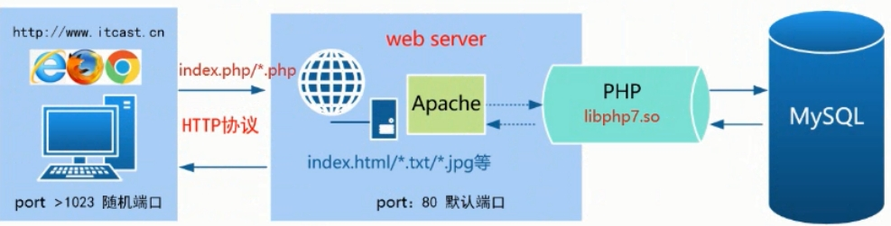

# NoSQL数据库

NoSQL（Not Only SQL），指的是非关系型的数据库。是对不同于传统的关系型数据库的数据库管理系统的统称。NoSQL用于超大规模数据的存储。这些类型的数据存储不需要固定的模式，无需多余操作就可以横向扩展

1. **键值数据库**		**2. 列式数据库**		**3. 文档数据库**		**4. 图形数据库**

**1. CouchDB，**所用语言： Erlang。特点：DB一致性，易于使用

**最佳应用场景：**适用于数据变化较少，执行预定义查询，进行数据统计的应用程序。适用于需要提供数据版本支持的应用程序。

**例如：** CRM、CMS系统。

**2.Redis，**所用语言：C/C++。特点：运行异常快

**最佳应用场景：**适用于数据变化快且数据库大小可遇见（适合内存容量）的应用程序。

**例如：**股票价格、数据分析、实时数据搜集、实时通讯。

**3. MongoDB，**所用语言：C++。特点：保留了SQL一些友好的特性（查询，索引）

**最佳应用场景**：适用于需要动态查询支持；需要使用索引而不是 map/reduce功能；需要对大数据库有性能要求；需要使用 CouchDB但因为数据改变太频繁而占满内存的应用程序。

**例如：**你本打算采用 MySQL或 PostgreSQL，但因为它们本身自带的预定义栏让你望而却步。

**4. Membase，**所用语言： Erlang和C。特点：兼容 Memcache，但同时兼具持久化和支持集群

**最佳应用场景：**适用于需要低延迟数据访问，高并发支持以及高可用性的应用程序

**例如：**低延迟数据访问比如以广告为目标的应用，高并发的 web 应用比如网络游戏（例如 Zynga）

# Memcached数据库

Memcached 是一套开源的高性能分布式内存对象缓存系统，它将所有的数据都存储在内存中，因为在内存中会统一维护一张巨大的Hash表，所以支持任意存储类型的数据。很多网站通过使用Memcached提高网站的访问速度，尤其是对于大型的需要频繁访问数据的网站。使用C语言编写

Memcached是典型的C/S架构，因此需要安装Memcached服务端与MemcachedAPI客户端。

```sh
yum install gcc gcc-c++ make -y #yum安装gcc编译环境包
yum install libevent-devel.x86_64 -y #安装依赖包
wget -O memcached-latest.tar.gz http://memcached.org/latest #下载安装包
tar -xzvf memcached-latest.tar.gz  #解压文件包
./configure --prefix=/usr/local/memcached #指定libevent安装路径
make && make test && make install
ln -s /usr/local/memcached/bin/* /usr/local/bin/	#创建软连接，方便使用memcached服务命令
memcached -d -m 32m -p 11211 -u root	#启动 memcached
```

-d：守护进程后台模式、-m：指定缓存大小为32M 、-p：指定默认端口11211 、 -u：指定登陆用户为 root

ss -tupln | grep memcached		#查看服务启动状态（默认端口号11211）

Memcached数据库操作与管理：Memcached协议简单，可直接使用telenet连接Memcached的11211端口操作

[root@localhost memcached-1.6.6]# telnet localhost 11211	#本地登录服务

gitlab部署安装

Git：是一种版本控制系统，是一个命令，是一种工具。

Gitlib：是用于实现Git功能的开发库。

Github：是一个基于Git实现的在线代码托管仓库，包含一个网站界面，向互联网开放。

GitLab：是一个基于Git实现的在线代码仓库托管软件，你可以用gitlab自己搭建一个类似于Github一样的系统，一般用于在企业、学校等内部网络搭建git私服。

GitLab是利用Ruby on Rails一个开源的版本管理系统，实现一个私有的自托管Git项目仓库，可通过Web界面进行访问公开的或者私人项目。

与Github类似，GitLab能够浏览源代码，管理缺陷和注释。可以管理团队对仓库的访问，它非常易于浏览提交过的版本并提供一个文件历史库。团队成员可以利用内置的简单聊天程序(Wall)进行交流。

它还提供一个代码片段收集功能可以轻松实现代码复用，便于日后有需要的时候进行查找。

```
gitlab-ctl start  #启动所有gitlab组件；			gitlab-ctl stop  #停止所有gitlab组件； 
gitlab-ctl restart  #重启所有gitlab组件； 			gitlab-ctl status  #查看服务状态； 
gitlab-ctl reconfigure  #修改配置文件之后,重新加载gitlab配置文件并启动所有gitlab组件
vim /etc/gitlab/gitlab.rb  #修改默认的配置文件； 
gitlab-rake gitlab:check SANITIZE=true --trace  #检查gitlab； 
gitlab-ctl tail  #查看日志；						gitlab-ctl --help  #查看gitlab命令的帮助
```

安装使用GitLab需要至少4GB可用内存(RAM + Swap)! 由于操作系统和其他正在运行的应用也会使用内存, 所以安装GitLab前一定要注意当前服务器至少有4GB的可用内存. 少于4GB内存会出现各种诡异的问题, 而且在使用过程中也经常会出现500错误.

1. 安装依赖软件	yum -y install policycoreutils openssh-server openssh-clients postfix

2.设置postfix开机自启并启动，postfix支持gitlab发信功能	systemctl enable postfix && systemctl start postfix

3.下载gitlab安装包，然后安装：[centos 6系统的下载地址](https://mirrors.tuna.tsinghua.edu.cn/gitlab-ce/yum/el6)		[centos 7系统的下载地址](https://mirrors.tuna.tsinghua.edu.cn/gitlab-ce/yum/el7)

```sh
wget https://mirrors.tuna.tsinghua.edu.cn/gitlab-ce/yum/el7/gitlab-ce-9.5.9-ce.0.el7.x86_64.rpm
rpm -ivh gitlab-ce-9.5.9-ce.0.el7.x86_64.rpm
```

4.修改gitlab配置文件指定服务器ip和自定义端口	echo "xternal_url 'http://localhost'" >> /etc/gitlab/gitlab.rb

5.设置发邮件功能	

```sh
[root@web1134 ~]# vim /etc/gitlab/gitlab.rb
gitlab_rails['smtp_enable'] = true
gitlab_rails['smtp_address'] = "smtp.163.com"
gitlab_rails['smtp_port'] = 25
gitlab_rails['smtp_user_name'] = "smtp user@163.com"
gitlab_rails['smtp_password'] = "password"
gitlab_rails['smtp_domain'] = "163.com"
gitlab_rails['smtp_authentication'] = "login"
gitlab_rails['smtp_enable_starttls_auto'] = true
```

## 修改gitlab配置的发信人

```
gitlab_rails['gitlab_email_from'] = "smtp user@163.com"
user["git_user_email"] = "smtp user@163.com"
6.GitLab重置并启动	gitlab-ctl reconfigure && gitlab-ctl restart
ok: run: gitlab-git-http-server: (pid 3922) 1s
ok: run: logrotate: (pid 3929) 0s
ok: run: nginx: (pid 3936) 1s
ok: run: postgresql: (pid 3941) 0s
ok: run: redis: (pid 3950) 0s
ok: run: sidekiq: (pid 3955) 0s
ok: run: unicorn: (pid 3961) 1s
提示“ok: run:”表示启动成功。
```

6.访问 GitLab页面http:192.168.3.8，如果没有域名，直接输入服务器ip和指定端口进行访问，设置初始化密码如: 5iveL!fe，默认账户root

安装过程出现的报错处理

（1）登录502报错：一般是权限问题，解决方法：chmod -R 755 /var/log/gitlab

（2）执行gitlab-ctl reconfigure命令出现账户权限报错

n itdb: could not obtain information about current user: Permission denied

Error executing action `run` on resource 'execute[/opt/gitlab/embedded/bin/initdb -D /var/opt/gitlab/postgresql/data -E UTF8]'

根据报错信息大概锁定用户的权限问题,安装gitlab-ce会自动添加用户四个用户:

gitlab-www:x:497:498::/var/opt/gitlab/nginx:/bin/false

git:x:496:497::/var/opt/gitlab:/bin/sh

gitlab-redis:x:495:496::/var/opt/gitlab/redis:/bin/nologin

gitlab-psql:x:494:495::/var/opt/gitlab/postgresql:/bin/sh

文件/etc/passwd的权限是600,给予644权限后,成功解决报错问题

LAMP 架构部署动态网站环境

免费、高效、扩展性强且资源消耗低

使用linux系统架构 > apache提供服务,接受用户连接请求 > 调用libphpx.so模块 > 访问mysqld

 

 

 

 

作用:PHP主要负责PHP脚本程序的解析以及实现与 MYSQL数据库的交互工作,我们项目中的注册登录/下单皮付等大多数功能都是基于PHP+ MYSQL进行实现。PHP是一种通用开源脚本

 

作用:MSQL是一个关系型数据库管理系统,由瑞典 MYSQL AB公司开发,目前属于 Oracl旗下产品。其主要作用用于永久的存储数据

安装启动httpd	php	(非服务不启动)	mariadb-server

```sh
mysqladmin -u root password 123456设置mysql数据库密码	mysql -u root -p进入数据库
```

默认数据库文件/var/lib/mysql		测试网站能否解析php文件cat /var/www/html/index.php

```php
<?php
	phpinfo();
?>
```

传递网页文件		修改文件权限chmod html/		安装

个人博客

```sh
安装apache、php、mariadb更新 yum 中 PHP 的软件源
rpm -Uvh https://mirrors.cloud.tencent.com/epel/epel-release-latest-7.noarch.rpm
rpm -Uvh https://mirror.webtatic.com/yum/el7/webtatic-release.rpm
yum -y install mod_php72w.x86_64 php72w-cli.x86_64 php72w-common.x86_64 php72w-mysqlnd php72w-fpm.x86_64
echo "<?php phpinfo(); ?>" >> /usr/share/nginx/html/index.php检测环境

配置mariadb数据库
[mariadb]
name = MariaDB
baseurl = http://yum.mariadb.org/10.5/centos8-amd64
module_hotfixes=1    #是解决被告知的dnf错误的方法
gpgkey=https://yum.mariadb.org/RPM-GPG-KEY-MariaDB
gpgcheck=1

yum -y install MariaDB-client MariaDB-server安装
yum install -y httpd mariadb-server

启动相应的服务systemctl start httpd mariadb
chown  apache /var/www/html			修改apache账户为不可登录
mysqladmin -u root password 123456	设置mysql数据库密码

传递wordpress至web服务器根目录
create database wordpress；创建一个名为wordpress的数据库

重启服务	systemctl enable httpd  mariadb && systemctl start mariadb httpd
wp-config.php为wordpres站点基础配置文件

vim /etc/php.ini	修改上传值大小
  `upload_max_filesize = 50M` （最大上传文件大小）
  `post_max_size = 50M`（POST数据最大字节长度）`
  `max_execution_time = 300 `（最大执行时间，单位秒）`
```

修改ECS云服务器selinux需重启服务器