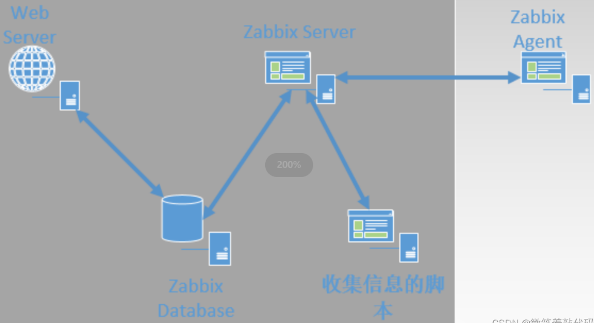
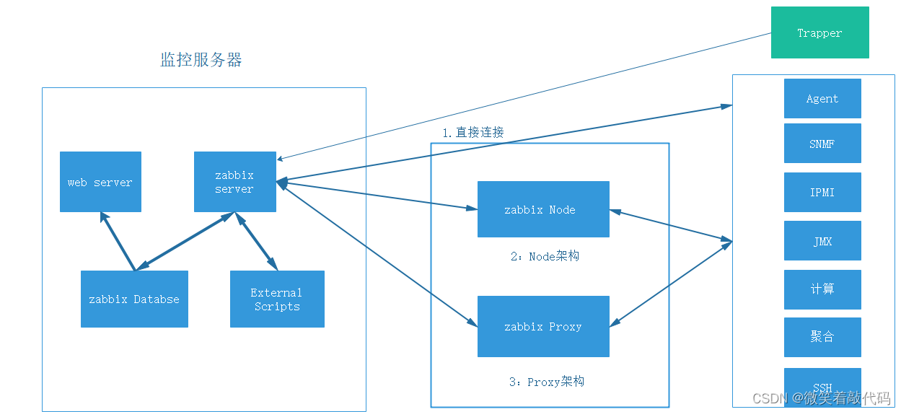
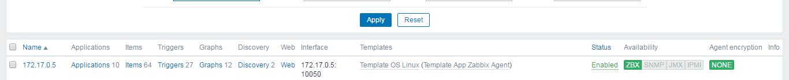
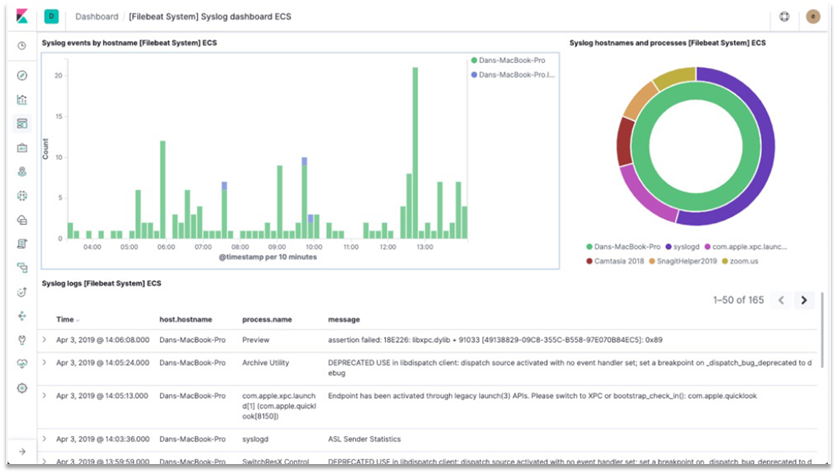

# Zabbix集中监控系统

官方文档  [Zabbix 使用手册](https://www.zabbix.com/documentation/6.0/zh/manual)

## 基本概述

zabbix是一个监控软件，其可以监控各种网络参数，保证企业服务架构安全运营，同时支持灵活的告警机制，可以使得运维人员快速定位故障、解决问题。zabbix支持分布式功能，支持复杂架构下的监控解决方案，也支持web页面，为主机监控提供了良好直观的展现。

## 架构构成

zabbix主要由以下5个组件构成：
1、Server
zabbix server是zabbix的核心组件，server内部存储了所有的配置信息、统计信息和操作信息。zabbix agent会向zabbix server报告可用性、完整性及其他统计信息。

2、web页面
web页面也是zabbix的一部分，通常和zabbix server位于一台物理设备上，但是在特殊情况下也可以分开配置。web页面主要提供了直观的监控信息，以方便运维人员监控管理。

3、数据库
zabbix数据库内存储了配置信息、统计信息等zabbix的相关内容。

4、proxy
zabbix proxy可以根据具体生产环境进行采用或者放弃。如果使用了zabbix proxy，则其会替代zabbix server采集数据信息，可以很好的分担zabbix server的负载。zabbix proxy通常运用与架构过大、zabbix server负载过重，或者是企业设备跨机房、跨网段、zabbix server无法与zabbix agent直接通信的场景。

5、Agent
zabbix agent通常部署在被监控目标上，用于主动监控本地资源和应用程序，并将监控的数据发送给zabbix server。

## 监控对象

zabbix支持监控各种系统平台，包括Linux和Windows等主流操作系统，也可以借助SNMP或者是SSH协议监控路由交换设备。

zabbix如果部署在服务器上，可以监控其CPU、内存、网络性能等硬件参数，也可以监控具体的服务或者应用程序、服务运行情况及性能。

**硬件监控**：Zabbix IPMI Interface ，通过IPMI接口进行监控，我们可以通过标准的IPMI硬件接口，监控被监控对象的物理特征，比如电压、温度、风扇状态、电源状态等。
**系统监控**：Zabbix Agent Interface ，通过专用的代理程序进行监控，与常见的master/agent模型类似，如果被监控对象支持对应的agent，推荐首选这种方式。
**Java监控**：Zabbix JMX Interface ，通过JMX进行监控，JMX（java management extensions，即java管理扩展），监控JVM虚拟机时，使用这种方法是非常不错的选择。
**网络设备监控**：Zabbix SNMP Interface ，通过SNMP协议与被监控对象进行通信，SNMP协议的全称为simple network management protocol，被译为简单网络管理协议，通常来说，我们无法在路由器、交换机这种硬件上安装agent，但是这些硬件都支持SNMP协议。
**应用服务监控**：Zabbix Agent UserParameter
**MySQL数据库监控**：percona-monitoring-plulgins   
**URL监控**：Zabbix Web 监控

## 常用术语

zabbix的学习需要掌握一些zabbix的常用术语，zabbix常用术语列举如下：
1、主机（host）
要监控的设备，可以由IP或者是主机名（必须可解析）指定。

2、主机组（host group）
主机的逻辑容器，包含主机和模板，主机组通常在给用户或者是用户组指派监控权限时使用。

3、监控项（item）
一个特定监控指标的相关数据，比如内存的大小、CPU的使用率，甚至是服务的运行状态等等。监控项数据来源于被监控对象，并且每个监控项都由一个key来标识。

4、触发器（trigger）
一个表达式，用于评估监控项的值是否在合理的范围内。当接收的值超出触发器的规定时，就被认为是故障，如果超出后再次符合，就被认为是正常。

5、事件（event）
触发器触发的一个特定事件，或者是zabbix定义的一个自动上线注册主机的事件。

6、动作（action）
指根据配置，zabbix对于触发器触发的特定事件进行处理的具体措施，如执行某个脚本，或者是向管理员邮箱发送邮件等等。

7、报警升级（escalation）
发送警报或者是执行远程命令的自定义方案。

8、媒介（media）
发送通知（告警）的手段，如微信、邮件、钉钉等等。

9、通知（notification）
通过指定的媒介，向用户发送的有关事件的信息。

10、远程命令（remote command）
指运维人员提前写好的命令，可以让被监控主机在触发事件后执行。

11、模板（template）
用于快速定义被监控主机的预设条目集合，通常包括了监控项、触发器、应用等，模板可以直接链接至某个主机。

12、应用（application）
一组监控项的集合。

13、web场景（web scennario）
用于检测web站点可用性的一个或多个HTTP请求。

14、前端（frontend）
zabbix的web接口。

这些术语，我们都会在后文中直接使用而不过多赘述，在企业技术交流中也会经常使用。


## 工作流程

Zabbix在进行监控时，zabbix客户端要安装在被监控设备上，负责定期收集数据，并将其发送给zabbix服务端；zabbix服务端要安装在监控设备上，其将zabbix客户端发送的数据存储的数据库中，zabbix web根据数据在前端进行展示和绘图。

==zabbix的数据收集分为两种模式==：

**1、主动模式**
zabbix客户端主动向zabbix server请求监控项列表，并主动将监控项内需要的数据提交给zabbix server。

**2、被动模式**
zabbix server向 agent 请求获取监控项的数据，zabbix agent返回数据。
由此可以看出zabbix的主动和被动模式是以zabbxi客户端为基准的。




## 进程详解

在默认的情况下，zabbix有6个工作进程；分别是 zabbix_agentd，zabbix_get，zabbix_proxy，zabbix_sender，zabbix_server 和 zabbix_gateway。

其中，zabbix_java_gateway是可选进程。这6个进程的作用如下：
**1、zabbix_agentd**
zabbix-agentd为zabbix客户端守护进程 ，主要负责收集客户端监控项数据。

**2、zabbix_server**
zabbix_server为zabbix服务端守护进程，主要负责收集zabbix客户端数据。（端口为10051）

**3、zabbix_proxy**
zabbix_proxy是zabbix的代理程序，其功能类似于server，作用上类似于一个中转站，最终会把收集的数据再次提交给zabbix_server。

**4、zabbix_get**
zabbix_get作为zabbix工具，通常运行在zabbix_server或者zabbix_proxy上，用于远程获取客户端信息，通常用于排错。

**5、zabbix_sender**
zabbix_sender也是zabbix的一个工具，通常运行在zabbix的客户端，用于耗时比较长的检查，其作用是主动发送数据。

**6、zabbix_java_gateway**
zabbix_java_gateway是zabbix2.0以后引入的新功能，可以用于JAVA方面的设备；但是只能主动获取数据，而不能被动获取数据。

## 监控框架

在实际的工作环境中，根据网络环境和监控的规模不同，zabbix一共有三种框架，分别是server_client架构、master_node_client架构和server_proxy_client架构。

1、server_client架构

zabbix最简单的架构，监控设备和被监控设备之间直接相连，zabbix_server 和 zabbix_client 之间直接进行数据交互。

2、zabbix_proxy_client架构

proxy是连接 server 和 client 之间的桥梁，其本身不存放数据，只是将zabbix_agent端发来的数据暂存，然后再提交给server。这种架构一般用于跨机房、跨网络的中型网络架构。

在server_proxy_client架构中，server设备的宕机会导致整个系统瘫痪而无法正常工作。

3、master_node_client架构

master_node_client架构是zabbix最复杂的架构。一般用于跨机房、跨网络、监控设备较多的大型网络架构。与server_proxy_client架构相比，master_node_client架构的主要区别在于node与proxy上.

在master_node_client架构中，每个node可以理解为一个小的server端，在自己的配置文件和数据库，node下游可以直接连接client，也可以再次经过proxy代理后连接client。

在master_node_client架构中，master设备宕机不会影响node节点的正常工作。

### 三种架构模式的架构图如下：



### 每个模块的工作职责：

1、Zabbix_Server：zabbix_server作为核心组件，用来获取agent存活情况和监控数据。所有的配置、统计、操作数据均通过server进行存取到database；

2、Zabbix_Database：用户存储所有的zabbix的配置信息、监控数据的数据库；

3、Zabbix_Web：zabbix的web界面，管理员通过web界面管理zabbix配置以及查看zabbix相关监控信息，通常与zabbix_server运行在同一台主机上，也可以单独部署在独立的服务器上；

4、Zabbix_Agent：部署在被监控主机上，负责收集被监控主机的数据，并发送给servre端或者proxy端；

5、Zabbix_Proxy：通常用于分布式监控，代理zabbix_server收集部分被监控的数据并统一发送给server端；（==通常大于500台主机需要使用==）

Zabbix Server、Proxy、Agent都有自己的配置文件以及log文件，重要的参数需要在这里配置，后面会详细说明。 


## docker容器化部署

本次使用docker搭建zabbix的组合是mysql+docker+zabix-server

确定zabbix数据挂载位置

```sh
docker volume create zabbix-mysql-data
docker volume create zabbix-mysql-log
docker volume create zabbix-server-conf
docker volume create zabbix-server-data
```

### 1 先安装数据库mysql

```sh
docker run --name zabbix-mysql-server --hostname zabbix-mysql-server \
-e MYSQL_ROOT_PASSWORD="kylin123." \
-e MYSQL_USER="zabbix" \
-e MYSQL_PASSWORD="kylin123." \
-e MYSQL_DATABASE="zabbix" \
-v zabbix-mysql-data:/var/lib/mysql \
-v zabbix-mysql-log:/var/log/mysql \
-p 3306:3306 \
-d mysql:8.0 \
--character-set-server=utf8 --collation-server=utf8_bin
```

出现报错：ERROR 1419 (HY000) at line 9: You do not have the SUPER privilege and binary logging is enabled (you *might* want to use the less safe log_bin_trust_function_creators variable）

解决办法：

```mysql
mysql> SET GLOBAL log_bin_trust_function_creators = 1;
mysql> flush privileges;
```


### 2 创建zabbix-server

```sh
docker run  --name zabbix-server-mysql --hostname zabbix-server-mysql \
--link zabbix-mysql-server:mysql \
-e DB_SERVER_HOST="mysql" \
-e MYSQL_USER="zabbix" \
-e MYSQL_DATABASE="zabbix" \
-e MYSQL_PASSWORD="kylin123." \
-v zabbix-server-conf:/etc/zabbix \
-v zabbix-server-data:/var/lib/zabbix \
-p 10051:10051 \
-d zabbix/zabbix-server-mysql
```

### 3 最后web-nginx

```sh
最后安装zabbix-web-nginx
docker run --name zabbix-web-nginx-mysql --hostname zabbix-web-nginx-mysql \
--link zabbix-mysql-server:mysql \
--link zabbix-server-mysql:zabbix-server \
-e DB_SERVER_HOST="mysql" \
-e MYSQL_USER="zabbix" \
-e MYSQL_PASSWORD="kylin123." \
-e MYSQL_DATABASE="zabbix" \
-e ZBX_SERVER_HOST="zabbix-server" \
-e PHP_TZ="Asia/Shanghai" \
-p 8080:8080 \
-d zabbix/zabbix-web-nginx-mysql
```

登录访问测试

```sh
浏览器访问ip:8000查看
默认登录
username:Admin
password:zabbix
```

这里说明下，mysql没做数据卷的映射，nginx也没做数据卷的映射，在实际生产环境下，最好做数据映射。防止数据丢失。

### 安装agent

zabbix agent部署较为简单，你可以使用docker，也可以使用Yum、二进制包等方式安装，此处演示基于docker的安装方式。

下载镜像

```sh
$ docker pull zabbix/zabbix-agent:alpine-6.2-latest
```

创建存储卷，用于存储agent配置文件。

```sh
$ docker volume create -d local  zabbix_agent
```

启动agent容器

```sh
$ docker run --name zabbix-agent -t \
      -v zabbix_agent:/etc/zabbix \
      -e ZBX_HOSTNAME="host-01" \
      -e ZBX_SERVER_HOST="192.168.214.112" \ 
      -e ZBX_SERVER_PORT=10051 \
      -p 10050:10050 \
      --restart=unless-stopped \
      --privileged \
      -d zabbix/zabbix-agent:alpine-6.2-latest
```

注释：如果是部署在zabbix Server主机上的监控agent，此时的ZBX_SERVER_HOST需改为zabbix server的容器IP，而不能用主机IP。

```sh
docker run --name zabbix-agent --link zabbix-server-mysql:zabbix-server -d zabbix/zabbix-agent:latest
```

最后需要在web端将，zabbix-agent添加到zabbix-server的host列表里面。



## 脚本部署

服务端安装脚本

```sh
#!/bin/bash
# 关闭防火墙，关闭selinux
systemctl stop firewalld && setenforce 0

#配置yum源
rpm -ivh http://repo.zabbix.com/zabbix/4.0/rhel/7/x86_64/zabbix-release-4.0-2.el7.noarch.rpm && yum repolist

if [ -e /etc/yum.repos.d/zabbix.repo ];then
	echo "已存在"
	yum -y install zabbix-server-mysql zabbix-web-mysql zabbix-agent mariadb mariadb-server
	else
	echo "不存在"
	exit
fi

systemctl start mariadb
if [ $? -eq 0 ];then
	echo "service is started"
	else
	echo "service not started"
fi

#数据库的操作
mysql -e 'create database zabbix character set utf8 collate utf8_bin;'

#授权
mysql -e 'grant all privileges on zabbix.* to zabbix@localhost identified by "zabbix";'

#导入初始数据库
zcat `find / -name zabbix-server-mysql-*`/create.sql.gz | mysql -uzabbix -pzabbix zabbix

#修改配置文件
sed -i 's/# DBPassword=/DBPassword=zabbix/' /etc/zabbix/zabbix_server.conf

#编辑php文件
sed -i 's#;date.timezone =#date.timezone = Asia/Shanghai#' /etc/php.ini

#启动服务
systemctl start httpd zabbix-agent zabbix-server

#解决中文乱码，cp强制覆盖且不提示
yum -y install wqy-microhei-fonts
cp /usr/share/fonts/wqy-microhei/wqy-microhei.ttc /usr/share/fonts/dejavu/DejaVuSans.ttf

#输出信息
echo "浏览器访问 http://`hostname -I|awk '{print $1}'`/zabbix"
echo "登陆界面(区分大小写) 账号Admin密码zabbix"
```

 #zabbix客户端快速安装脚本

```sh
#!/bin/bash
# 安装zabbix源
rpm -Uvh https://repo.zabbix.com/zabbix/4.0/rhel/7/x86_64/zabbix-release-4.0-2.el7.noarch.rpm
yum clean all && yum -y install zabbix-agent

# 修改Master为节点地址，ServerActive为被动接收监控
sed -i.brk "s/Server=127.0.0.1/Server=192.168.3.5/g" /etc/zabbix/zabbix_agentd.conf
sed -i "s/ServerActive=127.0.0.1/ServerActive=192.168.3.5/g" /etc/zabbix/zabbix_agentd.conf

# 修改该node机的主机名，在添加被监控时使用的
sed -i "s/Hostname=Zabbix server/Hostname=zabbix node1/g" /etc/zabbix/zabbix_agentd.conf 

# 开机自启服务
systemctl start  zabbix-agent.service && systemctl enable  zabbix-agent.service && service firewalld stop
echo 本机IP:`hostname -I|awk '{print $1}'`
```

# ES分布式搜索引擎

[ElasticSearch (ES从入门到精通一篇就够了) - 不吃紫菜 - 博客园 (cnblogs.com)](https://www.cnblogs.com/buchizicai/p/17093719.html)

> 注意： 在没有创建库的时候搜索，ES会创建一个库并自动创建该字段并且设置为String类型也就是text

什么是elasticsearch？

- 一个开源的分布式搜索引擎，可以用来实现搜索、日志统计、分析、系统监控等功能

什么是elastic stack（ELK）？

- 是以elasticsearch为核心的技术栈，包括beats、Logstash、kibana、elasticsearch

什么是Lucene？

- 是Apache的开源搜索引擎类库，提供了搜索引擎的核心API

elasticsearch是一款非常强大的开源搜索引擎，具备非常多强大功能，可以帮助我们从海量数据中快速找到需要的内容

**ELK技术栈**

> 本文只使用了elasticsearch，以及kibana做可视化界面

elasticsearch结合kibana、Logstash、Beats，也就是elastic stack（ELK）。被广泛应用在日志数据分析、实时监控等领域：



而elasticsearch是elastic stack的核心，负责存储、搜索、分析数据。


# Prometheus普罗米修斯监控系统


# kibana安装


# kafka分布式消息队列

Kafka是一个分布式数据流平台，可以运行在单台服务器上，也可以在多台服务器上部署形成集群。它提供了发布和订阅功能，使用者可以发送数据到Kafka中，也可以从Kafka中读取数据(以便进行后续的处理)。

Kafka是一种高吞吐量的分布式发布订阅消息系统，它可以处理消费者规模的网站中的所有动作流数据，具有高性能、持久化、多副本备份、横向扩展等特点。


# zookeeper服务注册发现

ZooKeeper是一个分布式的，开放源码的分布式应用程序协调服务，是Google的Chubby一个开源的实现，它是集群的管理者，监视着集群中各个节点的状态根据节点提交的反馈进行下一步合理操作。最终，将简单易用的接口和性能高效、功能稳定的系统提供给用户。


# Cacti服务器监控

C/S模式，采集监控数据		B/S模式，管理监测平台

Cacti是一套基于PHP,MySQL,SNMP及RRDTool开发的网络流量监测图形分析工具。它通过snmpget来获取数据，使用 RRDtool绘画图形，而且你完全可以不需要了解RRDtool复杂的参数。它提供了非常强大的数据和用户管理功能，可以指定每一个用户能查看树状结构、host以及任何一张图，还可以与LDAP结合进行用户验证，同时也能自己增加模板，功能非常强大完善。Cacti 的发展是基于让 RRDTool 使用者更方便使用该软件，除了基本的 Snmp 流量跟系统资讯监控外，Cacti 也可外挂 Scripts 及加上 Templates 来作出各式各样的监控图。

cacti是用php语言实现的一个软件，它的主要功能是用snmp服务获取数据，然后用rrdtool储存和更新数据，当用户需要查看数据的时候用rrdtool生成图表呈现给用户。因此，snmp和rrdtool是cacti的关键。Snmp关系着数据的收集，rrdtool关系着数据存储和图表的生成。

Mysql配合PHP程序存储一些变量数据并对变量数据进行调用，如：主机名、主机ip、snmp团体名、端口号、模板信息等变量

snmp抓到数据不是存储在mysql中，而是存在rrdtool生成的rrd文件中（在cacti根目录的rra文件夹下）。rrdtool对数据的更新和存储就是对rrd文件的处理，rrd文件是大小固定的档案文件（Round Robin Archive），它能够存储的数据笔数在创建时就已经定义。关于RRDTool的知识请参阅RRDTool教学。

snmp(Simple Network Management Protocal, 简单网络管理协议)在架构体系的监控子系统中将扮演重要角色。大体上，其基本原理是，在每一个被监控的主机或节点上 (如交换机)都运行了一个 agent，用来收集这个节点的所有相关的信息，同时监听 snmp 的 port，也就是 UDP 161，并从这个端口接收来自监控主机的指令(查询和设置)。

如果安装 net-snmp，被监控主机需要安装 net-snmp(包含了 snmpd 这个 agent)，而监控端需要安装 net-snmp-utils，若接受被监控端通过trap-communicate发来的信息的话，则需要安装net-snmp，并启用trap服务。如果自行编译，需要 beecrypt(libbeecrypt)和 elf(libraryelf)的库。

RRDtool是指Round Robin Database 工具（环状数据库）。Round robin是一种处理定量数据、以及当前元素指针的技术。想象一个周边标有点的圆环－－这些点就是时间存储的位置。从圆心画一条到圆周的某个点的箭头－－这就是指针。就像我们在一个圆环上一样，没有起点和终点，你可以一直往下走下去。过来一段时间，所有可用的位置都会被用过，该循环过程会自动重用原来的位置。这样，数据集不会增大，并且不需要维护。RRDtool处理RRD数据库。它用向RRD数据库存储数据、从RRD数据库中提取数据。

工作原理：snmp关系着数据的收集，rrdtool关系数据存储和图表的生成，snmp抓取的数据不是存储在数据库中，而是存储在rrdtool生成的rrd文件中


 

# Nagios监控系统

Nagios是一款开源的电脑系统和网络监视工具，能有效监控Windows、Linux和Unix的主机状态，交换机路由器等网络设备，打印机等。在系统或服务状态异常发出邮件或短信报警第一时间通知网站运维人员，在状态恢复后发出正常的邮件或者短信通知。

