# 一：web架构介绍：

单机房架构：

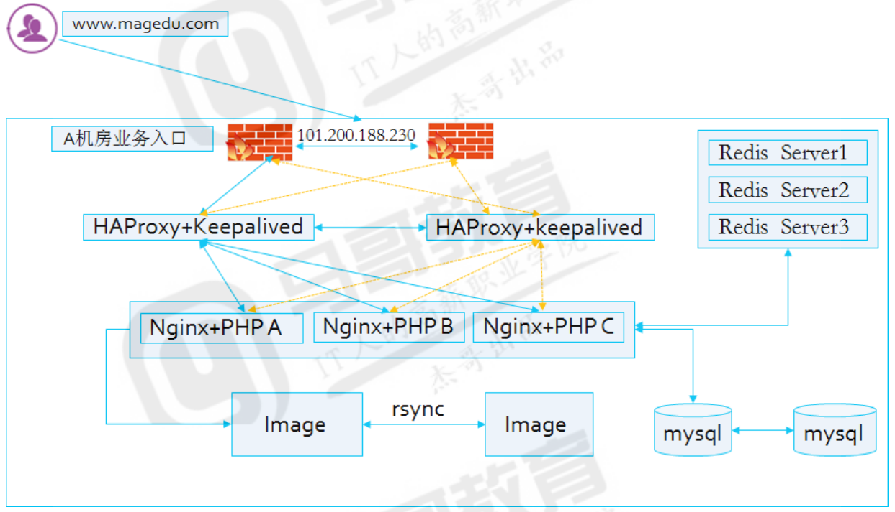

多机房架构

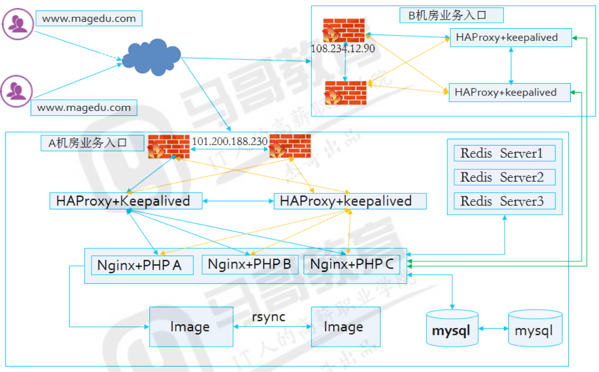

公有云架构：

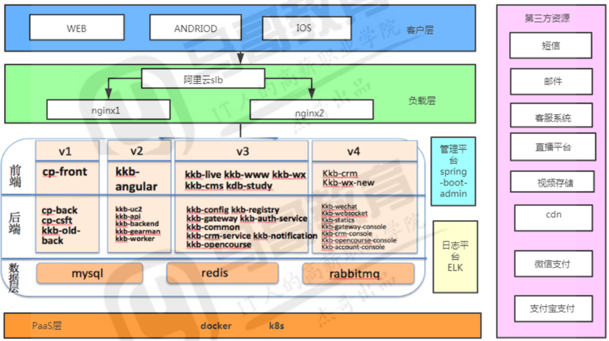

私有云架构：

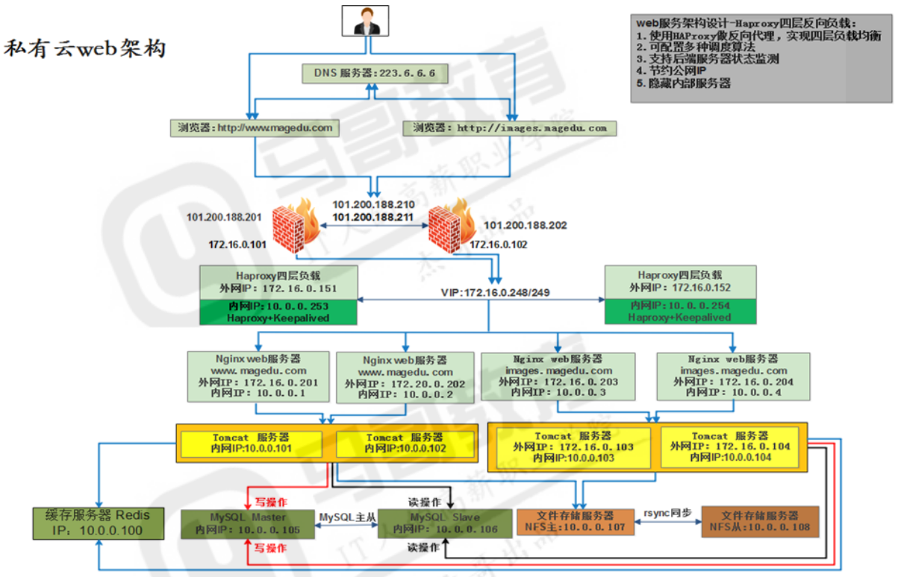

# 二：负载均衡简介：

负载均衡(Load Balance，简称LB)是一种服务或基于硬件设备等实现的高可用反向代理技术，负载均衡将特定的业

务(web服务、网络流量等)分担给指定的一个或多个后端特定的服务器或设备，从而提高了公司业务的并发处理能

力、保证了业务的高可用性、方便了业务后期的水平动态扩展。

https://yq.aliyun.com/articles/1803 #阿里云SLB介绍

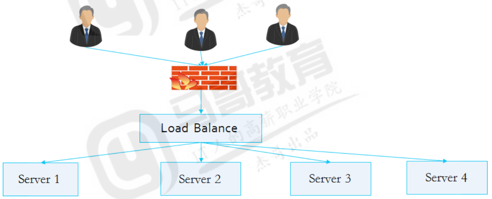

## 2.1：为什么使用负载均衡：

Web服务器的动态水平扩展-->对用户无感知

增加业务并发访问及处理能力-->解决单服务器瓶颈问题

节约公网IP地址-->降低IT支出成本

隐藏内部服务器IP-->提高内部服务器安全性

配置简单-->固定格式的配置文件

功能丰富-->支持四层和七层，支持动态下线主机

性能较强-->并发数万甚至数十万

## 2.2：负载均衡类型：

四层：LVS(Linux Virtual Server)	、HAProxy(High Availability Proxy)	、Nginx(1.9)

七层：HAProxy	、Nginx

硬件：

```
F5    #https://f5.com/zh
Netscaler #https://www.citrix.com.cn/products/citrix-adc/
Array   #https://www.arraynetworks.com.cn/
深信服   #http://www.sangfor.com.cn/
北京灵州  #http://www.lingzhou.com.cn/cpzx/llfzjh/
```

## 2.3：应用场景：

四层：Redis、Mysql、RabbitMQ、Memcache等

七层：Nginx、Tomcat、Apache、PHP 、图片、动静分离、API等

## 2.4：HAProxy介绍：

HAProxy是法国开发者 威利塔罗(Willy Tarreau) 在2000年使用C语言开发的一个开源软件，是一款具备高并发(一万以上)、高性能的TCP和HTTP负载均衡器，支持基于cookie的持久性，自动故障切换，支持正则表达式及web状态统计，目前最新TLS版本为2.0

从2013年HAProxy 分为社区版和企业版，企业版将提供更多的特性和功能以及全天24小时的技术支持等服务

[企业版](https://www.haproxy.com/)、[社区版](http://www.haproxy.org/)、[github](https://github.com/haproxy)

### 2.4.4：HAProxy功能：

**HAProxy功能**：

  TCP和HTTP反向代理

  SSL/TSL服务器

  可以针对HTTP请求添加cookie，进行路由后端服务器

  可平衡负载至后端服务器，并支持持久连接

  支持所有主服务器故障切换至备用服务器

  支持专用端口实现监控服务

  支持不影响现有连接情况下停止接受新连接请求

  可以在双向添加，修改或删除HTTP报文首部

  响应报文压缩

  支持基于pattern实现连接请求的访问控制

  通过特定的URI为授权用户提供详细的状态信息

**不具备的功能**：

 正向代理--squid，nginx

 缓存代理--varnish

 web服务--nginx、tengine、apache、php、tomcat

 UDP--目前不支持UDP协议，2.1版本会支持UDP协议代理

 单机性能--LVS

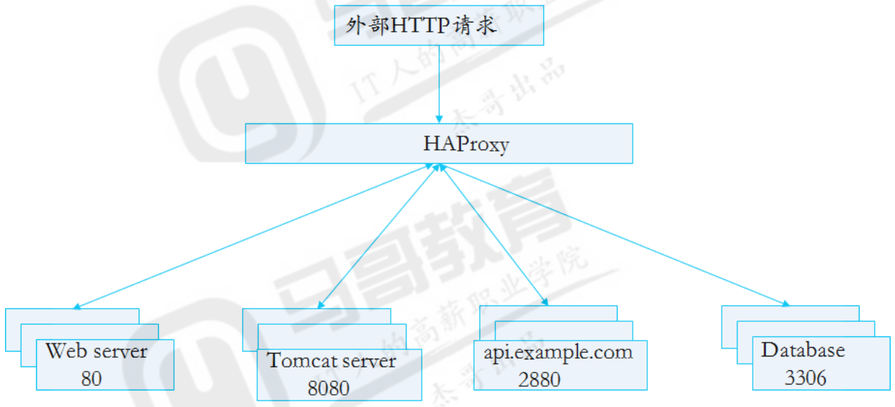

#  三：HAProxy安装及基础配置：

介绍HAProxy的基础安装及基础配置

IP地址划分：

```
掩码：192.168.0.0/21
可用地址范围：192.168.0.1-192.168.7.254
```

## 安装

### Ubuntu安装：

```
~# apt-get install software-properties-common
~# add-apt-repository ppa:vbernat/haproxy-2.0
~# apt update
~# apt-cache madison haproxy
~# apt install haproxy=2.0.4-1ppa1~bionic
#验证haproxy版本
# haproxy -v
 HA-Proxy version 2.0.4-1ppa1~bionic 2019/08/09 - https://haproxy.org/
```

### Centos 安装：

#### 默认yum源：

默认的base仓库中包含haproxy的安装包文件，但是版本比较旧，是1.5.18的版本，距离当前版本已经有较长时间没有更新，由于版本比较旧所以有很多功能不支持，如果对功能和性能没有要求可以使用此版本，否则推荐使用新版本。

```
# yum install haproxy -y
# 验证haproxy版本
# haproxy -v
HA-Proxy version 1.5.18 2016/05/10
Copyright 2000-2016 Willy Tarreau <willy@haproxy.org>
```

#### 第三方安装包：

[下载rpm包](https://pkgs.org/download/haproxy)

```
#基于互联网在线安装
# rpm -ivh cheese-release-7-1.noarch.rpm
# yum install haproxy-1.8.14-1.el7.x86_64.rpm -y
#验证haproxy版本
# haproxy -v
HA-Proxy version 1.8.14-52e4d43 2018/09/20
Copyright 2000-2018 Willy Tarreau <willy@haproxy.org>
```

#### 编译安装HAProxy：

编译安装HAProxy 2.0 LTS版本，更多源码包下载地址：http://www.haproxy.org/download/

#### 解决lua环境：

HAProxy 支持基于lua实现功能扩展，lua是一种小巧的脚本语言，于1993年由巴西里约热内卢天主教大学（Pontififical Catholic University of Rio de Janeiro）里的一个研究小组开发，其设计目的是为了嵌入应用程序中，从而为应用程序提供灵活的扩展和定制功能。

```
Lua 应用场景
游戏开发
独立应用脚本
Web 应用脚本
扩展和数据库插件，如MySQL Proxy
安全系统，如入侵检测系统
```

由于centos自带的lua版本比较低并不符合HAProxy要求的lua最低版本(5.3)的要求，因此需要编译安装较新版本的lua环境，然后才能编译安装HAProxy，过程如下：

```sh
# yum install libtermcap-devel ncurses-devel libevent-devel readline-devel
# wget http://www.lua.org/ftp/lua-5.3.5.tar.gz
# tar xvf lua-5.3.5.tar.gz
# cd lua-5.3.5
# make linux test
# pwd
/usr/local/src/lua-5.3.5
# lua -v #当前系统版本
Lua 5.1.4 Copyright (C) 1994-2008 Lua.org, PUC-Rio
# ./src/lua -v #编译安装的版本
Lua 5.3.5 Copyright (C) 1994-2018 Lua.org, PUC-Rio
```

#### 编译安装HAProxy：

```
# pwd
/usr/local/src
# tar xvf haproxy-2.0.4.tar.gz
# yum install gcc gcc-c++ glibc glibc-devel pcre pcre-devel openssl openssl-devel 
systemd-devel net-tools vim iotop bc zip unzip zlib-devel lrzsz tree screen lsof 
tcpdump wget ntpdate #安装编译环境
#HAProxy 1.8及1.9版本编译参数：
make ARCH=x86_64 TARGET=linux2628 USE_PCRE=1 USE_OPENSSL=1 USE_ZLIB=1 USE_SYSTEMD=1 
USE_CPU_AFFINITY=1 PREFIX=/usr/local/haproxy 
#HAProxy 2.0编译参数：
# make ARCH=x86_64 TARGET=linux-glibc USE_PCRE=1 USE_OPENSSL=1 USE_ZLIB=1 
USE_SYSTEMD=1 USE_CPU_AFFINITY=1 USE_LUA=1 LUA_INC=/usr/local/src/lua-5.3.5/src/ 
LUA_LIB=/usr/local/src/lua-5.3.5/src/ PREFIX=/usr/local/haproxy
# make install PREFIX=/usr/local/haproxy
# cp haproxy /usr/sbin/
```

#### 验证HAProxy版本：

```
#验证HAProxy版本：
# /usr/local/haproxy/sbin/haproxy -v
HA-Proxy version 2.0.4 2019/08/06 - https://haproxy.org/
```

## HAProxy启动脚本：

```
# cat /usr/lib/systemd/system/haproxy.service
[Unit]
Description=HAProxy Load Balancer
After=syslog.target network.target
[Service]
ExecStartPre=/usr/sbin/haproxy -f /etc/haproxy/haproxy.cfg -c -q
ExecStart=/usr/sbin/haproxy -Ws -f /etc/haproxy/haproxy.cfg -p 
/var/lib/haproxy/haproxy.pid
ExecReload=/bin/kill -USR2 $MAINPID
[Install]
WantedBy=multi-user.target
```

## 配置文件：

```
# mkdir /etc/haproxy
# cat /etc/haproxy/haproxy.cfg 
global
maxconn 100000
chroot /usr/local/haproxy
stats socket /var/lib/haproxy/haproxy.sock mode 600 level admin
uid 99
gid 99
daemon
#nbproc 4
#cpu-map 1 0
#cpu-map 2 1
#cpu-map 3 2
#cpu-map 4 3
pidfile /var/lib/haproxy/haproxy.pid
log 127.0.0.1 local3 info
defaults
option http-keep-alive
option forwardfor
maxconn 100000
mode http
timeout connect 300000ms
timeout client 300000ms
timeout server 300000ms
listen stats
 mode http
 bind 0.0.0.0:9999
 stats enable
 log global
 stats uri     /haproxy-status
 stats auth   haadmin:q1w2e3r4ys
listen web_port
 bind 192.168.7.101:80
 mode http
 log global
 server web1 127.0.0.1:8080 check inter 3000 fall 2 rise 5
```

## 启动haproxy：

```
# mkdir /var/lib/haproxy
# chown 99.99 /var/lib/haproxy/ -R
# systemctl start haproxy
# systemctl enable haproxy
# systemctl status haproxy
```

## 验证haproxy状态：

haproxy.cfg文件中定义了chroot、pidfifile、user、group等参数，如果系统没有相应的资源会导致haproxy无法启动，具体参考日志文件/var/log/messages

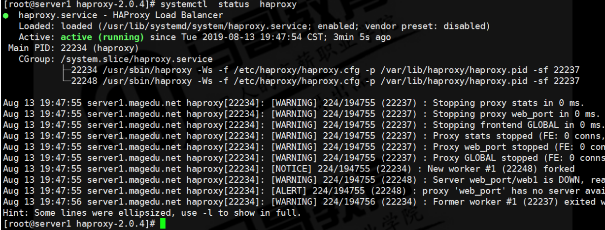

## 3.4：基础配置详解：

HAPrpxy的配置文件haproxy.cfg由两大部分组成，分别是global和proxies部分。

global：全局配置段

```
进程及安全配置相关的参数
性能调整相关参数
Debug参数
```

proxies：代理配置段

```
defaults：为frontend, backend, listen提供默认配置
frontend：前端，相当于nginx中的server {}
backend：后端，相当于nginx中的upstream {}
listen：同时拥有前端和后端配置
```

### 3.4.1：global配置参数：

[官方文档](https://cbonte.github.io/haproxy-dconv/2.0/intro.html)

```
chroot #锁定运行目录
deamon #以守护进程运行
#stats socket /var/lib/haproxy/haproxy.sock mode 600 level admin #socket文件
user, group, uid, gid #运行haproxy的用户身份
nbproc   #开启的haproxy进程数，与CPU保持一致
nbthread #指定每个haproxy进程开启的线程数，默认为每个进程一个线程
cpu-map 1 0   #绑定haproxy 进程至指定CPU
maxconn       #每个haproxy进程的最大并发连接数
maxsslconn   #每个haproxy进程ssl最大连接数,用于haproxy配置了证书的场景下
maxconnrate   #每个进程每秒创建的最大连接数量
spread-checks #后端server状态check随机提前或延迟百分比时间，建议2-5(20%-50%)之间
pidfile #指定pid文件路径
log 127.0.0.1 local3 info #定义全局的syslog服务器；最多可以定义两个
```

### 3.4.2：Proxies配置：

https://cbonte.github.io/haproxy-dconv/2.0/confifiguration.html#4

```
defaults [<name>] #默认配置项，针对以下的frontend、backend和lsiten生效，可以多个name也可以没有
name
frontend <name>   #前端servername，类似于Nginx的一个虚拟主机 server。
backend <name>   #后端服务器组，等于nginx的upstream
listen   <name>   #将frontend和backend合并在一起配置
```

•注：name字段只能使用”-”、”_”、”.”、和”:”，并且严格区分大小写，例如：Web和web是完全不同的两组服务器。

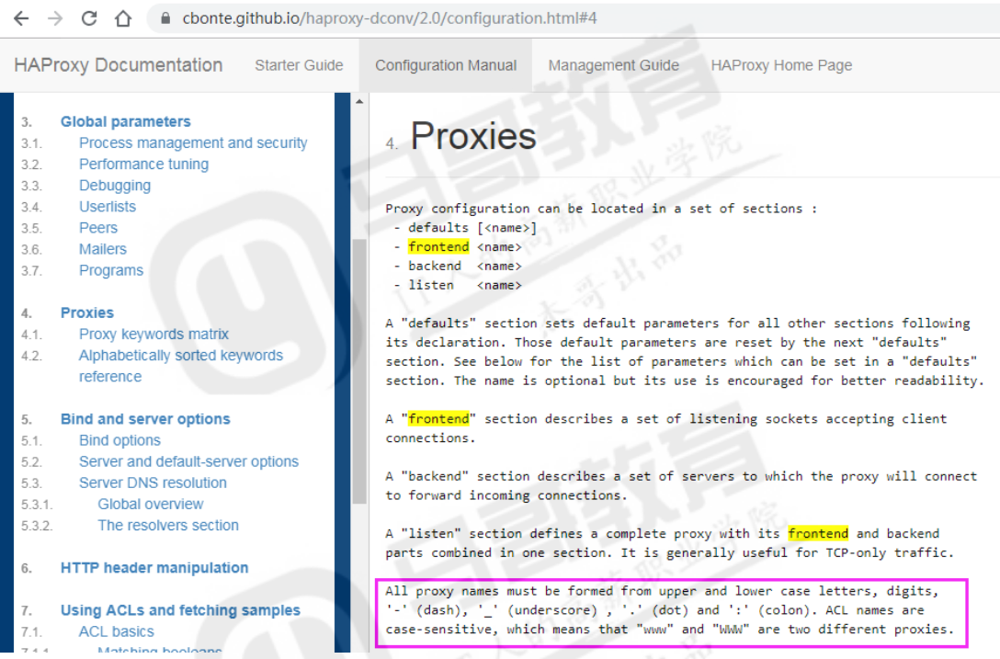

#### 3.4.2.1：Proxies配置-defaults：

defaults 配置参数：

```
option redispatch     #当server Id对应的服务器挂掉后，强制定向到其他健康的服务器，重新派发
option abortonclose   #当服务器负载很高的时候，自动结束掉当前队列处理比较久的链接，关闭
option http-keep-alive #开启与客户端的会话保持
option forwardfor     #透传客户端真实IP至后端web服务器
mode http #设置默认工作类型
timeout http-keep-alive 120s #session 会话保持超时时间，范围内会转发到相同的后端服务器
timeout connect 120s #客户端请求从haproxy到后端server的最长连接等待时间(TCP之前)
timeout server 600s #客户端请求从haproxy到后端服务端的请求处理超时时长（TCP之后）
timeout client 600s #设置haproxy与客户端的最长非活动时间
timeout check   5s   #对后端服务器的默认检测超时时间
```

#### 3.4.2.2：Proxies配置-frontend：

frontend配置参数：

```
bind：指定HAProxy的监听地址，可以是IPV4或IPV6，可以同时监听多个IP或端口，可同时用于listen字段中
bind [<address>]:<port_range> [, ...] [param*]
listen http_proxy #监听http的多个IP的多个端口和sock文件
   bind :80,:443,:8801-8810
   bind 10.0.0.1:10080,10.0.0.1:10443
   bind /var/run/ssl-frontend.sock user root mode 600 accept-proxy
listen http_https_proxy #https监听
   bind :80
   bind :443 ssl crt /etc/haproxy/site.pem
   listen http_https_proxy_explicit #监听ipv6、ipv4和unix sock文件
   bind ipv6@:80
   bind ipv4@public_ssl:443 ssl crt /etc/haproxy/site.pem
   bind unix@ssl-frontend.sock user root mode 600 accept-proxy
listen external_bind_app1 #监听file descriptor
   bind "fd@${FD_APP1}"
生产示例：
frontend WEB_PORT
   bind :80,:8080
   bind 192.168.7.102:10080,:8801-8810,192.168.7.101:9001-9010
   mode http/tcp     #指定负载协议类型
   use_backend backend_name #调用的后端服务器组名称
```

#### 3.4.2.3：Proxies配置-backend：

定义一组后端服务器，backend服务器将被frontend进行调用。

```
mode http/tcp     #指定负载协议类型
option #配置选项
server   #定义后端real server
```

注意：option后面加httpchk，smtpchk,mysql-check,pgsql-check，ssl-hello-chk方法，可用于实现更多应用层检测功能。

```
check #对指定real进行健康状态检查，默认不开启
 addr IP   #可指定的健康状态监测IP
 port num #指定的健康状态监测端口
 inter num #健康状态检查间隔时间，默认2000 ms
 fall num   #后端服务器失效检查次数，默认为3
 rise num   #后端服务器从下线恢复检查次数，默认为2
weight #默认为1，最大值为256，0表示不参与负载均衡
backup #将后端服务器标记为备份状态
disabled #将后端服务器标记为不可用状态
redirect prefix http://www.magedu.net/   #将请求临时重定向至其它URL，只适用于http模式
maxconn <maxconn>：当前后端server的最大并发连接数
backlog <backlog>：当server的连接数达到上限后的后援队列长度
```

#### 3.4.2.4：frontend+backend配置实例：

```
#官网业务访问入口======================================
frontend WEB_PORT_80
   bind 192.168.7.248:80
   mode http
   use_backend web_prot_http_nodes
backend web_prot_http_nodes
   mode http
   option forwardfor
   server 192.168.7.101 192.168.7.101:8080   check inter 3000 fall 3 rise 5
   server 192.168.7.102 192.168.7.102:8080   check inter 3000 fall 3 rise 5
```

#### 3.4.2.5：Proxies配置-listen替代frontend+backend：

```
使用listen替换frontend和backend的配置方式：
#官网业务访问入口=====================================
listen WEB_PORT_80
   bind 192.168.7.102:80
   mode http
   option forwardfor
   server web1   192.168.7.101:80   check inter 3000 fall 3 rise 5
   server web2   192.168.7.101:80   check inter 3000 fall 3 rise 5
```

## 四：HAProxy调度算法：

```
HAProxy通过固定参数balance指明对后端服务器的调度算法，该参数可以配置在listen或backend选项中。
HAProxy的调度算法分为静态和动态调度算法，但是有些算法可以根据参数在静态和动态算法中相互转换。
https://cbonte.github.io/haproxy-dconv/2.0/configuration.html#4 #官方文档
```

### 4.1：静态算法：

静态算法：按照事先定义好的规则轮询公平调度，不关心后端服务器的当前负载、链接数和相应速度等，且无法实时修改权重，只能靠重启HAProxy生效。服务器动态权重调整：

```
# yum install socat #Socat 是 Linux 下的一个多功能的网络工具，名字来由是Socket CAT，Socat 的
主要特点就是在两个数据流之间建立通道，且支持众多协议和链接方式。如 IP、TCP、 UDP、IPv6、Socket文件
等。
# echo "show info" | socat stdio /var/lib/haproxy/haproxy.sock
# echo "get weight web_host/web1" | socat stdio /var/lib/haproxy/haproxy.sock 
1 (initial 1)
# echo "set weight web_host/web1 2" | socat stdio /var/lib/haproxy/haproxy.sock 
Backend is using a static LB algorithm and only accepts weights '0%' and '100%'.
```

### 4.1.1：static-rr：

static-rr：基于权重的轮询调度，不支持权重的运行时调整及后端服务器慢启动，其后端主机数量没有限制

```
listen web_host
 bind 192.168.7.101:80,:8801-8810,192.168.7.101:9001-9010
 mode http
 log global
 balance static-rr
 server web1 192.168.7.103:80 weight 1 check inter 3000 fall 2 rise 5
 server web2 192.168.7.104:80 weight 2 check inter 3000 fall 2 rise 5
```

### 4.1.2：fifirst：

fifirst：根据服务器在列表中的位置，自上而下进行调度，但是其只会当第一台服务器的连接数达到上限，新请求才会分配给下一台服务，因此会忽略服务器的权重设置。

```
listen web_host 
 bind 192.168.7.101:80,:8801-8810,192.168.7.101:9001-9010 
 mode http 
 log global 
 balance first 
 server web1 192.168.7.103:80 maxconn 2 weight 1 check inter 3000 fall 2 rise 5 
 server web2 192.168.7.104:80 weight 1 check inter 3000 fall 2 rise 5
```

测试访问效果

```
# while true;do curl http://192.168.7.101/app/index.html ; sleep 0.1;done
```

## 4.2：动态算法：

动态算法：基于后端服务器 状态进行调度适当调整，比如优先调度至当前负载较低的服务器，且权重可以在haproxy运行时动态调整无需重启。

### 4.2.1：roundrobin：

roundrobin：基于权重的轮询动态调度算法，支持权重的运行时调整，不完全等于lvs中的rr轮训模式，HAProxy中的roundrobin支持慢启动(新加的服务器会逐渐增加转发数)，其每个后端backend中最多支持4095个real server，roundrobin为默认调度算法，且支持对real server权重动态调整。

```
listen web_host 
 bind 192.168.7.101:80,:8801-8810,192.168.7.101:9001-9010 
 mode http 
 log global 
 balance roundrobin 
 server web1 192.168.7.103:80 weight 1 check inter 3000 fall 2 rise 5 
 server web2 192.168.7.104:80 weight 2 check inter 3000 fall 2 rise 5
```

动态调整权限：

```
# echo "get weight web_host/web1" | socat stdio /var/lib/haproxy/haproxy.sock 
1 (initial 1) 
# echo "set weight web_host/web1 3" | socat stdio /var/lib/haproxy/haproxy.sock 
# echo "get weight web_host/web1" | socat stdio /var/lib/haproxy/haproxy.sock 
3 (initial 1)
```

### 4.2.2：leastconn

leastconn加权的最少连接的动态，支持权重的运行时调整和慢启动，即当前后端服务器连接最少的优先调度(新客户端连接)，比较适合长连接的场景使用，比如MySQL等场景。

```
listen web_host 
 bind 192.168.7.101:80,:8801-8810,192.168.7.101:9001-9010 
 mode http 
 log global 
 balance leastconn 
 server web1 192.168.7.103:80 weight 1 check inter 3000 fall 2 rise 5 
 server web2 192.168.7.104:80 weight 1 check inter 3000 fall 2 rise 5
```

## 4.3：其他算法：

其他部分算法即可作为静态算法，又可以通过选项成为动态算法

### 4.3.1：source：

源地址hash，基于用户源地址hash并将请求转发到后端服务器，默认为静态即取模方式，但是可以通过hash-type支持的选项更改，后续同一个源地址请求将被转发至同一个后端web服务器，比较适用于session保持/缓存业务等场景。

源地址有两种转发客户端请求到后端服务器的服务器选取计算方式，分别是取模法和一致性hash

#### 4.3.1.1：map-base取模法：

​	map-based：取模法，基于服务器总权重的hash数组取模，该hash是静态的即不支持在线调整权重，不支持慢启动，其对后端服务器调度均衡，缺点是当服务器的总权重发生变化时，即有服务器上线或下线，都会因权重发生变化而导致调度结果整体改变。

​	所谓取模运算，就是计算两个数相除之后的余数，10%7=3, 7%4=3，基于权重取模：(2^32-1)%(1+1+2) 

##### 4.3.1.1.1：取模法示意图：

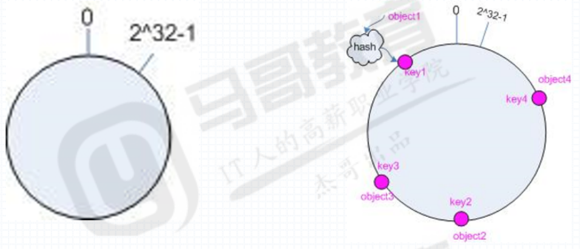

##### 4.3.1.1.2：取模法配置示例：

```
listen web_host 
 bind 192.168.7.101:80,:8801-8810,192.168.7.101:9001-9010 
 mode tcp 
 log global 
 balance source 
 server web1 192.168.7.103:80 weight 1 check inter 3000 fall 2 rise 5 
 server web2 192.168.7.104:80 weight 1 check inter 3000 fall 2 rise 5
```

#### 4.3.1.2：一致性hash：

一致性哈希，该hash是动态的，支持在线调整权重，支持慢启动，优点在于当服务器的总权重发生变化时，对调度结果影响是局部的，不会引起大的变动，hash（o）mod n 。

##### 4.3.1.2.1：hash对象：

Hash对象到后端服务器的映射关系：

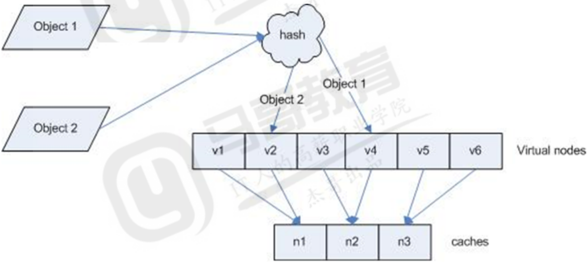

##### 4.3.1.2.2：一致性hash示意图：

后端服务器在线与离线的调度方式

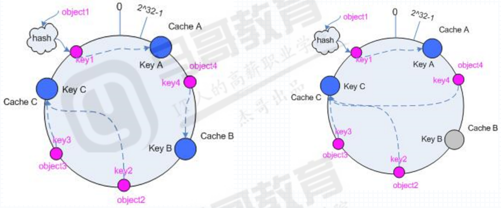

##### 4.3.1.2.3：一致性hash配置示例：

```
listen web_host 
 bind 192.168.7.101:80,:8801-8810,192.168.7.101:9001-9010 
 mode tcp 
 log global 
 balance source 
 hash-type consistent 
 server web1 192.168.7.103:80 weight 1 check inter 3000 fall 2 rise 5 
 server web2 192.168.7.104:80 weight 1 check inter 3000 fall 2 rise 5
```

### 4.3.2：uri：

基于对用户请求的uri做hash并将请求转发到后端指定服务器，也可以通过map-based和consistent定义使用取模法还是一致性hash。

```
http://example.org/absolute/URI/with/absolute/path/to/resource.txt #URI/URL 
ftp://example.org/resource.txt #URI/URL 
/relative/URI/with/absolute/path/to/resource.txt #URI
```


#### 4.3.2.1：uri 取模法配置示例：

```
listen web_host 
 bind 192.168.7.101:80,:8801-8810,192.168.7.101:9001-9010 
 mode http 
 log global 
 balance uri 
 server web1 192.168.7.103:80 weight 1 check inter 3000 fall 2 rise 5 
 server web2 192.168.7.104:80 weight 1 check inter 3000 fall 2 rise 5
```

#### 4.3.2.2：uri 一致性hash配置示例：

```
listen web_host 
 bind 192.168.7.101:80,:8801-8810,192.168.7.101:9001-9010 
 mode http 
 log global 
 balance uri 
 hash-type consistent 
 server web1 192.168.7.103:80 weight 1 check inter 3000 fall 2 rise 5 
 server web2 192.168.7.104:80 weight 1 check inter 3000 fall 2 rise 5
```

#### 4.3.2.3：访问测试：

访问不同的uri，确认可以将用户同样的请求转发至相同的服务器

```
# curl http://192.168.7.101/app/index.html 
# curl http://192.168.7.101/app/index1.html
```

### 4.3.3：url_param：

url_param对用户请求的url中的 params 部分中的参数name作hash计算，并由服务器总权重相除以后派发至某挑出的服务器；通常用于追踪用户，以确保来自同一个用户的请求始终发往同一个real server

```
假设：url = http://www.magedu.com/foo/bar/index.php?k1=v1&k2=v2 
则：
host = "www.magedu.com" 
url_param = "k1=v1&k2=v2"
```

#### 4.3.3.1：url_param取模法配置示例：

```
listen web_host 
 bind 192.168.7.101:80,:8801-8810,192.168.7.101:9001-9010 
 mode http 
 log global 
 balance url_param name,age #支持对单个及多个url_param 值hash 
 server web1 192.168.7.103:80 weight 1 check inter 3000 fall 2 rise 5 
 server web2 192.168.7.104:80 weight 1 check inter 3000 fall 2 rise 5
```

#### 4.3.3.2：url_param一致性hash配置示例：

```
listen web_host 
 bind 192.168.7.101:80,:8801-8810,192.168.7.101:9001-9010 
 mode http 
 log global 
 balance url_param name,age #支持对单个及多个url_param 值hash 
 hash-type consistent 
 server web1 192.168.7.103:80 weight 1 check inter 3000 fall 2 rise 5 
 server web2 192.168.7.104:80 weight 1 check inter 3000 fall 2 rise 5
```

#### 4.3.3.3：测试访问：

```
# curl http://192.168.7.101/app/index.html?name=NAME #单个参数访问
# curl http://192.168.7.101/app/index.html?age=AGE 
# curl http://192.168.7.101/app/index.html?age=AGE&&name=NAME #多个参数访问
```

### 4.3.4：hdr：

针对用户每个http头部(header)请求中的指定信息做hash，此处由 name 指定的http首部将会被取出并做hash计算，然后由服务器总权重相除以后派发至某挑出的服务器，假如无有效的值，则会使用默认的轮询调度。

#### 4.3.4.1：hdr取模法配置示例：

```
listen web_host 
 bind 192.168.7.101:80,:8801-8810,192.168.7.101:9001-9010 
 mode http 
 log global 
 balance hdr(User-Agent) 
 server web1 192.168.7.103:80 weight 1 check inter 3000 fall 2 rise 5 
 server web2 192.168.7.104:80 weight 1 check inter 3000 fall 2 rise 5
```

#### 4.3.4.2：一致性hash配置示例：

```
listen web_host 
 bind 192.168.7.101:80,:8801-8810,192.168.7.101:9001-9010 
 mode http 
 log global 
 balance hdr(User-Agent) 
 hash-type consistent 
 server web1 192.168.7.103:80 weight 1 check inter 3000 fall 2 rise 5 
 server web2 192.168.7.104:80 weight 1 check inter 3000 fall 2 rise 5
```


#### 4.3.3.3：测试访问：

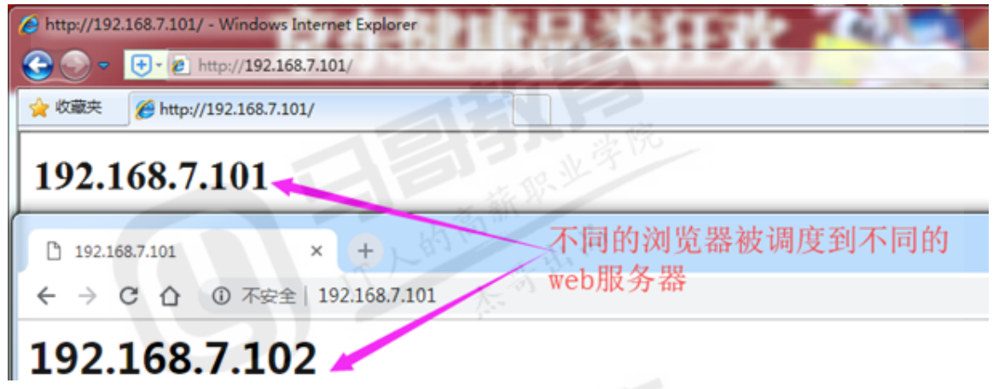

### 4.3.5：rdp-cookie：

rdp-cookie对远windows程桌面的负载，使用cookie保持会话

**rdp-cookie取模法配置示例**：

```
listen RDP 
 bind 192.168.7.101:3389 
 balance rdp-cookie 
 mode tcp 
 server rdp0 172.18.132.20:3389 check fall 3 rise 5 inter 2000 weight 1
```

**rdp-cookie一致性hash配置示例**：

```
listen RDP 
 bind 192.168.7.101:3389 
 balance rdp-cookie 
 hash-type consistent 
 mode tcp 
 server rdp0 172.18.132.20:3389 check fall 3 rise 5 inter 2000 weight 1
```

测试访问：

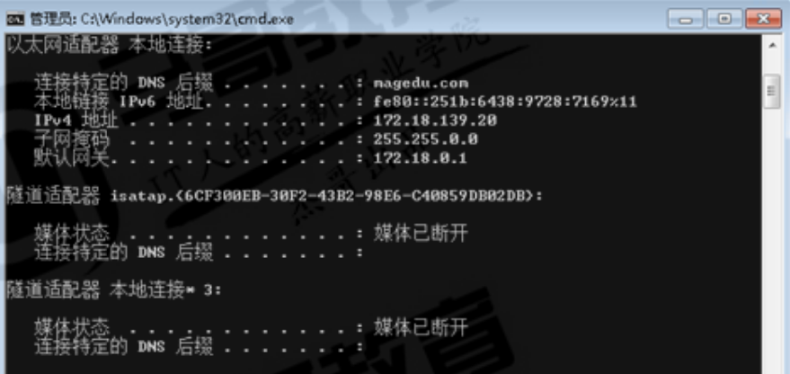

#### 4.3.5.4：基于iptables实现：

net.ipv4.ip_forward = 1 #必须开启ip转发功能

```
# iptables -t nat -A PREROUTING -d 192.168.7.101 -p tcp --dport 3389 -j DNAT --to-destination 172.18.139.20:3389 
# iptables -t nat -A POSTROUTING -s 192.168.0.0/21 -j SNAT --to-source 192.168.7.101
```

### 4.3.6：random：

在1.9版本开始增加一个叫做random的负载平衡算法，其基于一个随机数作为一致性hash的key，随机负载平衡对于大型服务器场或经常添加或删除服务器非常有用，因为它可以避免在这种情况下由roundrobin或leastconn导致的锤击效应。

#### 4.3.6.1：random配置实例：

```
listen web_host 
 bind 192.168.7.101:80,:8801-8810,192.168.7.101:9001-9010 
 mode http 
 log global 
 balance random 
 server web1 192.168.7.103:80 weight 1 check inter 3000 fall 2 rise 5 
 server web2 192.168.7.104:80 weight 1 check inter 3000 fall 2 rise 5
```

### 4.3.7：算法总结：

```
static-rr--------->tcp/http 静态
first------------->tcp/http 静态
roundrobin-------->tcp/http 动态
leastconn--------->tcp/http 动态
random------------>tcp/http 动态
source------------>tcp/http 
Uri--------------->http 
url_param--------->http 取决于hash_type是否consistent 
hdr--------------->http 
rdp-cookie-------->tcp
```

### 4.3.8：各算法使用场景：

```
first #使用较少
static-rr #做了session共享的web集群
roundrobin 
random 
leastconn #数据库
source #基于客户端公网IP的会话保持
Uri--------------->http #缓存服务器，CDN服务商，蓝汛、百度、阿里云、腾讯
url_param--------->http 
hdr #基于客户端请求报文头部做下一步处理
rdp-cookie #很少使用
```

### 4.3.9：layer 4与layer 7：

四层：IP+PORT转发

七层：协议+内容交换

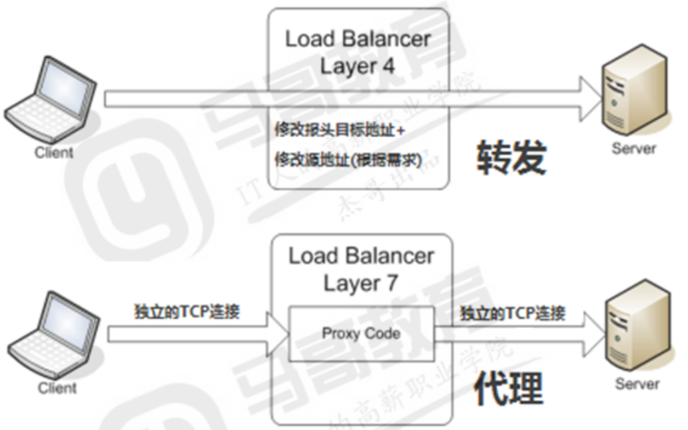

#### 4.3.9.1：四层负载：

在四层负载设备中，把client发送的报文目标地址(原来是负载均衡设备的IP地址)，根据均衡设备设置的选择web服务器的规则选择对应的web服务器IP地址，这样client就可以直接跟此服务器建立TCP连接并发送数据。

#### 4.3.9.2：七层代理：

七层负载均衡服务器起了一个反向代理服务器的作用，服务器建立一次TCP连接要三次握手，而client要访问webserver要先与七层负载设备进行三次握手后建立TCP连接，把要访问的报文信息发送给七层负载均衡；然后七层负载均衡再根据设置的均衡规则选择特定的webserver，然后通过三次握手与此台webserver建立TCP连接，然后webserver把需要的数据发送给七层负载均衡设备，负载均衡设备再把数据发送给client；所以，七层负载均衡设备起到了代理服务器的作用。

```
# tcpdump tcp -i eth0 -nn port ! 22 -w dump-tcp.pcap -v
```

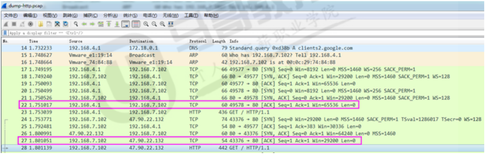

## 4.4：IP透传：

web服务器中需要记录客户端的真实IP地址，用于做访问统计、安全防护、行为分析、区域排行等场景。

### 4.4.1：四层IP透传：

```
haproxy 配置：
listen web_prot_http_nodes 
 bind 192.168.7.101:80 
 mode tcp 
 balance roundrobin 
 server web1 blogs.studylinux.net:80 send-proxy check inter 3000 fall 3 rise 5 
nginx配置：
 server { 
 listen 80 proxy_protocol; 
 #listen 80; 
 server_name blogs.studylinux.net; 
......
```

### 4.4.2：七层IP透传：

当haproxy工作在七层的时候，如何透传客户端真实IP至后端服务器

#### 4.4.2.1：HAProxy配置：

```
haproxy 配置：
defaults 
option forwardfor 
或者：
option forwardfor header X-Forwarded-xxx #自定义传递IP参数,后端web服务器写X-Forwarded-xxx，如
果写option forwardfor则后端服务器web格式为X-Forwarded-For 
listen配置：
listen web_host 
 bind 192.168.7.101:80 
 mode http 
 log global 
 balance random 
 server web1 192.168.7.103:80 weight 1 check inter 3000 fall 2 rise 5 
 server web2 192.168.7.104:80 weight 1 check inter 3000 fall 2 rise 5
```

#### 4.4.2.2：web服务器日志格式配置：

配置web服务器，记录负载均衡透传的客户端IP地址

```
#apache 配置：
LogFormat "%{X-Forwarded-For}i %a %l %u %t \"%r\" %>s %b \"%{Referer}i\" \"%{UserAgent}i\"" combined 
#tomcat 配置：
pattern='%{X-Forwarded-For}i %l %T %t &quot;%r&quot; %s %b &quot;%{User-Agent}i&quot;'/> 
#nginx 日志格式：
log_format main '"$http_x_forwarded_For" - $remote_user [$time_local] "$request" ' 
 '$status $body_bytes_sent "$http_referer" ' 
 '"$http_user_agent" ';
```

#### 4.4.2.3：验证客户端IP地址：

Nginx访问日志：

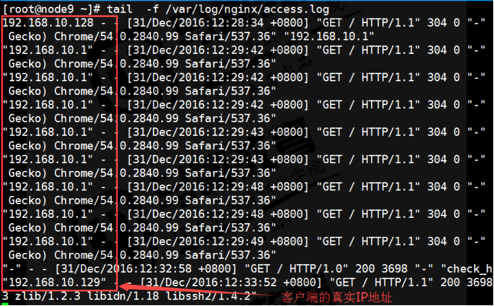

apache日志：

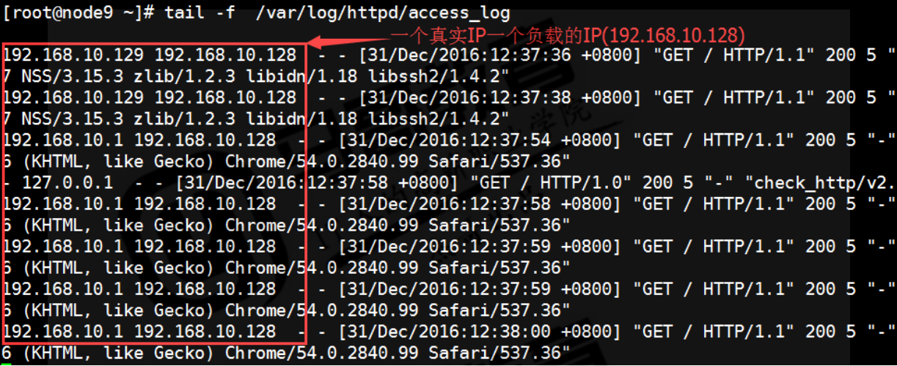

# 五：高级功能及配置：

介绍HAProxy高级配置及实用案例

**配置选项**：

cookie value：为当前server指定cookie值，实现基于cookie的会话黏性

**配置选项**：

```
cookie name [ rewrite | insert | prefix ][ indirect ] [ nocache ][ postonly ] [ preserve 
][ httponly ] [ secure ][ domain ]* [ maxidle <idle> ][ maxlife ] 
 name：cookie 的key名称，用于实现持久连接
 insert：如果没有就插入新的cookie 
 indirect：不会向客户端发送服务器已经处理过请求的cookie信息，间接
 nocache：当client和hapoxy之间有缓存时，不缓存cookie
```

**配置示例**：

```
listen web_host 
 bind 192.168.7.101:80 
 mode http 
 log global 
 balance roundrobin 
 cookie SERVER-COOKIE insert indirect nocache 
 server web1 192.168.7.103:80 cookie web1 check inter 3000 fall 3 rise 5 
 server web2 192.168.7.104:80 cookie web2 check inter 3000 fall 3 rise 5
```

### 5.1.3：验证cookie信息：

浏览器验证：

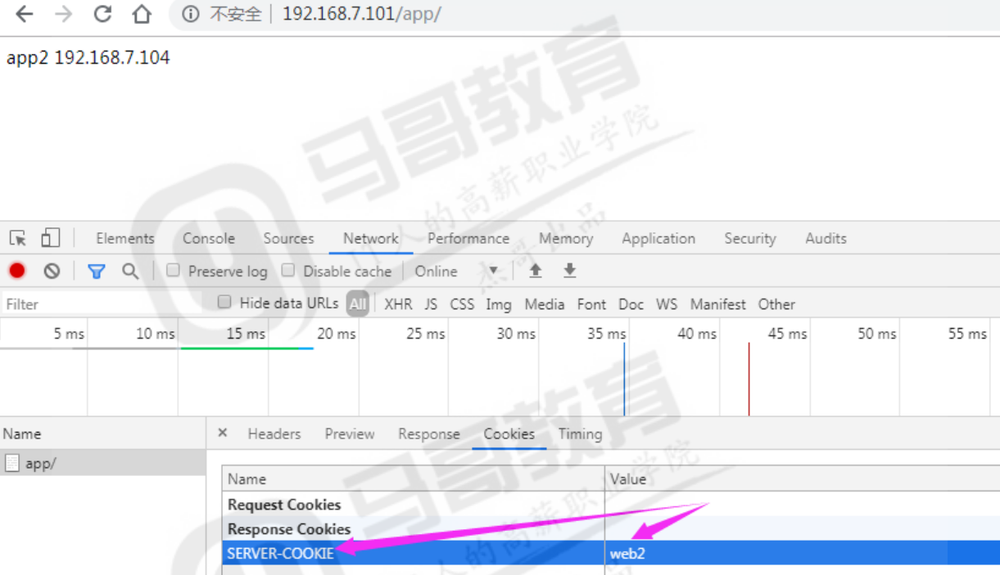

通过命令行验证：

```
[root@server3 app]# curl --cookie "SERVER-COOKIE=web1" 
http://192.168.7.101/app/index.html 
app1 192.168.7.103 
[root@server3 app]# curl --cookie "SERVER-COOKIE=web2" 
http://192.168.7.101/app/index.html 
app2 192.168.7.104
```

### 5.2：HAProxy状态页：

通过web界面，显示当前HAProxy的运行状态。

```
https://cbonte.github.io/haproxy-dconv/2.0/configuration.html#4-stats%20uri
```

### 5.2.1：状态页配置项：

```
stats enable #基于默认的参数启用stats page 
stats hide-version #隐藏版本
stats refresh <delay> #设定自动刷新时间间隔
stats uri <prefix> #自定义stats page uri，默认值：/haproxy?stats 
stats realm <realm> #账户认证时的提示信息，示例：stats realm : HAProxy\ Statistics 
stats auth <user>:<passwd> #认证时的账号和密码，可使用多次，默认：no authentication 
stats admin { if | unless } <cond> #启用stats page中的管理功能
```

### 5.2.2：启用状态页：

```
listen stats 
 bind :9009 
 stats enable 
 #stats hide-version 
 stats uri /haproxy-status 
 stats realm HAPorxy\ Stats\ Page 
 stats auth haadmin:123456 
 stats auth admin:123456 
 #stats refresh 30s 
 #stats admin if TRUE
```

### 5.2.3：登录状态页：

```
pid = 3698 (process #2, nbproc = 2, nbthread = 2) #pid为当前pid号，process为当前进程号，
nbproc和nbthread为一共多少进程和每个进程多少个线程
uptime = 0d 0h00m08s #启动了多长时间
system limits: memmax = unlimited; ulimit-n = 131124 #系统资源限制：内存/最大打开文件数/ 
maxsock = 131124; maxconn = 65536; maxpipes = 0 #最大socket连接数/单进程最大连接数/最大管道数
maxpipes 
current conns = 1; current pipes = 0/0; conn rate = 1/sec #当前连接数/当前管道数/当前连接速率
Running tasks: 1/9; idle = 100 % #运行的任务/当前空闲率
active UP：#在线服务器
backup UP：#标记为backup的服务器
active UP, going down：#监测未通过正在进入down过程
backup UP, going down：#备份服务器正在进入down过程
active DOWN, going up：#down的服务器正在进入up过程
backup DOWN, going up：#备份服务器正在进入up过程
active or backup DOWN：#在线的服务器或者是backup的服务器已经转换成了down状态
not checked：#标记为不监测的服务器
active or backup DOWN for maintenance (MAINT) #active或者backup服务器人为下线的
active or backup SOFT STOPPED for maintenance #active或者backup被人为软下线(人为将weight改成
0)
```

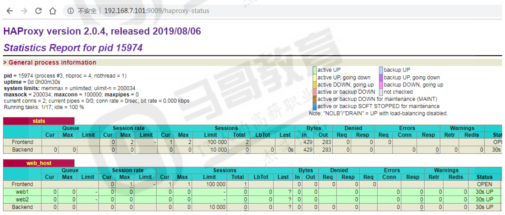

### 5.2.4：backend server信息：

| session rate(每秒的连接会话信息)   | Errors(错误统计信息)              |
| ---------------------------------- | --------------------------------- |
| cur:每秒的当前会话数量             | Req:错误请求量                    |
| max:每秒新的最大会话数量           | conn:错误链接量                   |
| limit:每秒新的会话限制量           | Resp:错误响应量                   |
| sessions(会话信息)                 | Warnings(警告统计信息)            |
| cur:当前会话量                     | Retr:重新尝试次数                 |
| max:最大会话量                     | Redis:再次发送次数                |
| limit: 限制会话量                  |                                   |
| Total:总共会话量                   | Server(real server信息)           |
| LBTot:选中一台服务器所用的总时间   | Status:后端机的状态，包括UP和DOWN |
| Last：和服务器的持续连接时间       | LastChk:持续检查后端服务器的时间  |
| Wght:权重                          |                                   |
| Bytes(流量统计)                    | Act:活动链接数量                  |
| In:网络的字节输入总量              | Bck:备份的服务器数量              |
| Out:网络的字节输出总量             | Chk:心跳检测时间                  |
| Dwn:后端服务器连接后都是DOWN的数量 |                                   |
| Denied(拒绝统计信息)               | Dwntme:总的downtime时间           |
| Req:拒绝请求量                     | Thrtle:server 状态                |
| Resp:拒绝回复量                    |                                   |

## 5.3：报文修改：

在http模式下，基于实际需求修改客户端的请求报文与响应报文，通过reqadd和reqdel在请求报文添加删除字段，通过rspadd与rspidel在响应报文中添加与删除字段。

```
在请求报文尾部添加指定首部
 reqadd <string> [{if | unless} <cond>] 
 
从请求报文中删除匹配正则表达式的首部
 reqdel <search> [{if | unless} <cond>] 
 reqidel <search> [{if | unless} <cond>] 
 
在响应报文尾部添加指定首部
 rspadd <string> [{if | unless} <cond>] 
 示例：
 rspadd X-Via:\ HAPorxy
 从响应报文中删除匹配正则表达式的首部
 rspdel <search> [{if | unless} <cond>] 
 rspidel <search> [{if | unless} <cond>] 
 示例： 
 rspidel server.* #从响应报文删除server信息
 rspidel X-Powered-By:.* #从响应报文删除X-Powered-By信息
```

## 5.4：HAProxy日志配置：

配置HAProxy记录日志到指定日志文件中

### 5.4.1：HAProxy配置：

在global配置项定义：

```
log 127.0.0.1 local{1-7} info #基于syslog记录日志到指定设备，级别有(err、warning、info、
debug)

listen web_port 
 bind 127.0.0.1:80 
 mode http 
 log global 
 server web1 127.0.0.1:8080 check inter 3000 fall 2 rise 5 

# systemctl restart haproxy 
```

### 5.4.2：Rsyslog配置：

```
vim /etc/rsyslog.conf 
$ModLoad imudp 
$UDPServerRun 514 
local3.* /var/log/haproxy.log 
# systemctl restart rsyslog
```

### 5.4.3：验证HAProxy日志：

重启syslog服务并访问app页面，然后验证是否生成日志

```
# tail -f /var/log/haproxy.log 
Aug 14 20:21:06 localhost haproxy[18253]: Connect from 192.168.0.1:3050 to 
192.168.7.101:80 (web_host/HTTP) 
Aug 14 20:21:06 localhost haproxy[18253]: Connect from 192.168.0.1:3051 to 
192.168.7.101:80 (web_host/HTTP) 
Aug 14 20:21:06 localhost haproxy[18253]: Connect from 192.168.0.1:3050 to 
192.168.7.101:80 (web_host/HTTP)
```

## 5.5：自定义日志格式：

将特定信息记录在日志中

### 5.5.1：配置选项：

```
capture cookie <name> len <length> #捕获请求和响应报文中的 cookie并记录日志 
capture request header <name> len <length> #捕获请求报文中指定的首部内容和长度并记录日志
capture response header <name> len <length> #捕获响应报文中指定的内容和长度首部并记录日志
示例：
capture request header Host len 256 
capture request header User-Agent len 512 
capture request header Referer len 15
```

配置示例：

```
listen web_host 
 bind 192.168.7.101:80 
 mode http 
 balance roundrobin 
 log global 
 option httplog #日志格式选项
 capture request header X-Forwarded-For len 15 
 capture request header User-Agent len 512 
 cookie SERVER-COOKIE insert indirect nocache 
 server web1 192.168.7.103:80 cookie web1 check inter 3000 fall 3 rise 5 
 server web2 192.168.7.104:80 cookie web2 check inter 3000 fall 3 rise 5
```

### 5.5.3：验证日志格式：

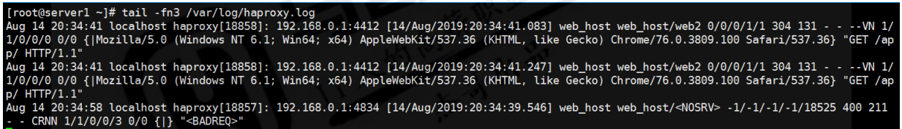

## 5.6：压缩功能

对响应给客户端的报文进行压缩，以节省网络带宽，但是会占用部分CPU性能

### 5.6.1：配置选项：

```
compression algo #启用http协议中的压缩机制，常用算法有gzip deflate 
 identity #调试使用的压缩方式
 gzip #常用的压缩方式，与各浏览器兼容较好
 deflate #有些浏览器不支持
 raw-deflate #新出的压缩方式
compression type #要压缩的文件类型
```

### 5.6.2：配置示例：

```
listen web_host 
 bind 192.168.7.101:80 
 mode http 
 balance roundrobin 
 log global 
 option httplog 
 #capture request header X-Forwarded-For len 15 
 #capture request header User-Agent len 512 
 compression algo gzip deflate 
 compression type compression type text/plain text/html text/css text/xml 
text/javascript application/javascript 
 cookie SERVER-COOKIE insert indirect nocache 
 server web1 192.168.7.103:80 cookie web1 check inter 3000 fall 3 rise 5 
 server web2 192.168.7.104:80 cookie web2 check inter 3000 fall 3 rise 5
```

## 5.6.3：验证压缩功能：

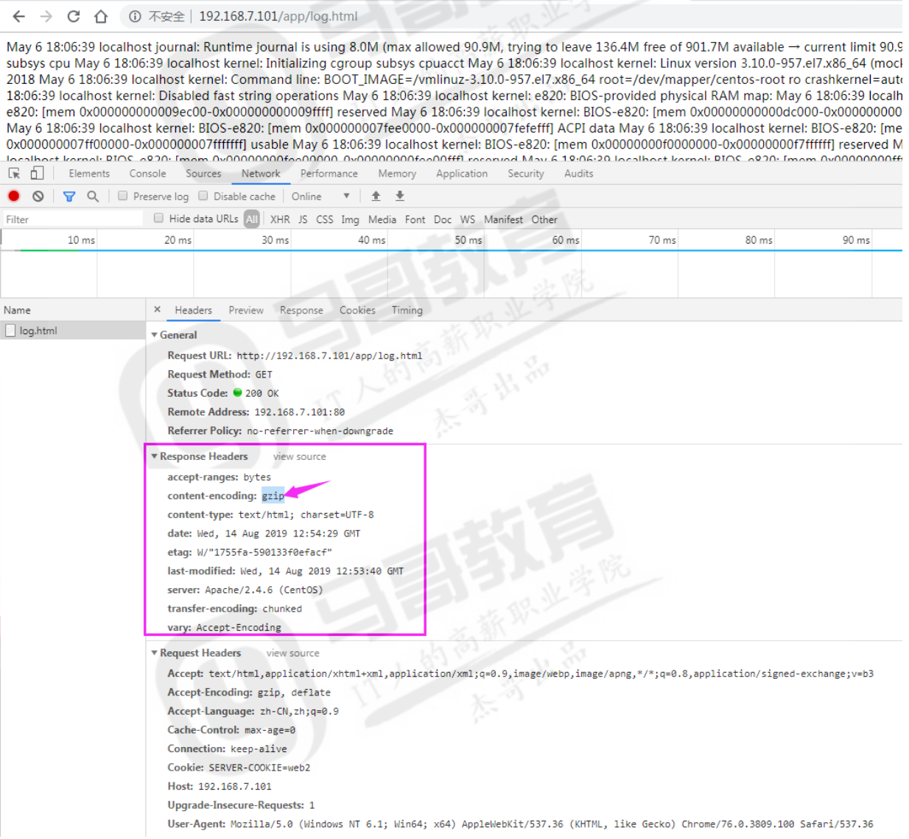

## 5.7：web服务器状态监测：

基于不同的监测方式，对后端real server进行状态监测

```
option httpchk 
option httpchk <uri> 
option httpchk <method> <uri> 
option httpchk <method> <uri> <version>
```

### 5.7.1：三种状态监测方式：

基于四层的传输端口做状态监测

基于指定URI 做状态监测

基于指定URI的request请求头部内容做状态监测

### 5.7.2：配置示例：

```
listen web_host 
 bind 192.168.7.101:80 
 mode http 
 balance roundrobin 
 log global 
 option httplog 
 #option httpchk GET /app/monitor/check.html HTTP/1.0 
 option httpchk HEAD /app/monitor/check.html HTTP/1.0\r\nHost:\ 192.168.7.102 
 cookie SERVER-COOKIE insert indirect nocache 
 server web1 192.168.7.103:80 cookie web1 check inter 3000 fall 3 rise 5 
 server web2 192.168.7.104:80 cookie web2 check inter 3000 fall 3 rise 5
```

### 5.7.3：验证http监测：

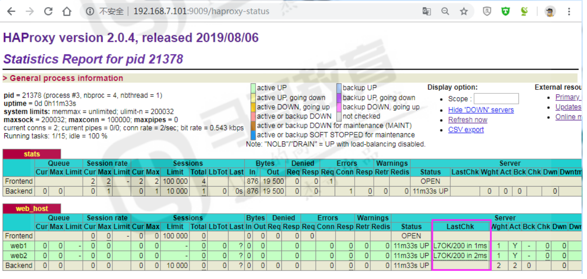

## 5.8：ACL：

访问控制列表（ACL，Access Control Lists）是一种基于包过滤的访问控制技术，它可以根据设定的条件对经过服务器传输的数据包进行过滤(条件匹配)，即对接收到的报文进行匹配和过滤，基于请求报文头部中的源地址、源端口、目标地址、目标端口、请求方法、URL、文件后缀等信息内容进行匹配并执行进一步操作，比如允许其通过或丢弃。

```
http://cbonte.github.io/haproxy-dconv/2.0/configuration.html#7
```

**ACL配置选项**：

```
acl <aclname> <criterion> [flags] [operator] [<value>] 
acl 名称 匹配规范 匹配模式 具体操作符 操作对象类型
```

#### 5.8.1.1：ACL-Name：

```
acl image_service hdr_dom(host) -i img.magedu.com 

ACL名称，可以使用大字母A-Z、小写字母a-z、数字0-9、冒号：、点.、中横线和下划线，并且严格区分大小写，必
须Image_site和image_site完全是两个acl。
```

#### 5.8.1.2：ACL-criterion：

定义ACL匹配规范

```
 hdr（[<name> [，<occ>]]）：完全匹配字符串,header的指定信息
  hdr_beg（[<name> [，<occ>]]）：前缀匹配，header中指定匹配内容的begin 
  hdr_end（[<name> [，<occ>]]）：后缀匹配，header中指定匹配内容end 
  hdr_dom（[<name> [，<occ>]]）：域匹配，header中的domain name 
   
  hdr_dir（[<name> [，<occ>]]）：路径匹配，header的uri路径
  hdr_len（[<name> [，<occ>]]）：长度匹配，header的长度匹配
  hdr_reg（[<name> [，<occ>]]）：正则表达式匹配，自定义表达式(regex)模糊匹配
  hdr_sub（[<name> [，<occ>]]）：子串匹配，header中的uri模糊匹配
  
 dst 目标IP 
 dst_port 目标PORT 
 src 源IP 
 src_port 源PORT 
 
示例：
 hdr(<string>) 用于测试请求头部首部指定内容
 hdr_dom(host) 请求的host名称，如 www.magedu.com 
 hdr_beg(host) 请求的host开头，如 www. img. video. download. ftp. 
 hdr_end(host) 请求的host结尾，如 .com .net .cn 
 path_beg 请求的URL开头，如/static、/images、/img、/css 
 path_end  请求的URL中资源的结尾，如 .gif .png .css .js .jpg .jpeg 
有些功能是类似的，比如以下几个都是匹配用户请求报文中host的开头是不是www：
 acl short_form hdr_beg(host) www. 
 acl alternate1 hdr_beg(host) -m beg www. 
 acl alternate2 hdr_dom(host) -m beg www. 
 acl alternate3 hdr(host) -m beg www.
```


#### 5.8.1.3：ACL-flflags：

ACL匹配模式

```
-i 不区分大小写
-m 使用指定的pattern匹配方法
-n 不做DNS解析
-u 禁止acl重名，否则多个同名ACL匹配或关系
```

#### 5.8.1.4：ACL-operator：

ACL 操作符

```
整数比较：eq、ge、gt、le、lt 
字符比较：
- exact match (-m str) :字符串必须完全匹配模式
- substring match (-m sub) :在提取的字符串中查找模式，如果其中任何一个被发现，ACL将匹配
- prefix match (-m beg) :在提取的字符串首部中查找模式，如果其中任何一个被发现，ACL将匹配
- suffix match (-m end) :将模式与提取字符串的尾部进行比较，如果其中任何一个匹配，则ACL进行匹配
- subdir match (-m dir) :查看提取出来的用斜线分隔（“/”）的字符串，如果其中任何一个匹配，则ACL进
行匹配
- domain match (-m dom) :查找提取的用点（“.”）分隔字符串，如果其中任何一个匹配，则ACL进行匹配
```


#### 5.8.1.5：ACL-value:

value的类型

```
The ACL engine can match these types against patterns of the following types : 
- Boolean #布尔值
- integer or integer range #整数或整数范围，比如用于匹配端口范围
- IP address / network #IP地址或IP范围, 192.168.0.1 ,192.168.0.1/24 
- string--> www.magedu.com 
 exact –精确比较
 substring—子串
 suffix-后缀比较
 prefix-前缀比较
 subdir-路径， /wp-includes/js/jquery/jquery.js 
 domain-域名，www.magedu.com 
- regular expression #正则表达式
- hex block #16进制
```


### 5.8.2：ACL调用方式：

ACL调用方式：

```
- 与：隐式（默认）使用
- 或：使用“or” 或 “||”表示
- 否定：使用“!“ 表示 
示例：
 if valid_src valid_port #与关系,A和B都要满足为true 
 if invalid_src || invalid_port #或，A或者B满足一个为true 
 if ! invalid_src #非，取反，A和B哪个也不满足为true
```


### 5.8.3：ACL示例-域名匹配：

```
listen web_host
     bind 192.168.7.101:80
     mode http
     balance roundrobin
     log global
     option httplog
     acl web_host hdr_dom(host) www.magedu.net
     use_backend magedu_host if web_host
     default_backend default_web 
backend magedu_host 
     mode http
     server web1 192.168.7.103 check inter 2000 fall 3 rise
backend default_web
     mode http
     server web1 192.168.7.104:80 check inter 2000 fall 3 rise 5
```


### 5.8.4：ACL示例-基于源IP或子网调度访问：

将指定的源地址调度至指定的web服务器组

```
listen web_host 
 bind 192.168.7.101:80 
 mode http 
 balance roundrobin 
 log global 
 option httplog 
 acl ip_range_test src 172.18.0.0/16 192.168.7.103 
 use_backend magedu_host if ip_range_test 
 
 default_backend default_web 
backend magedu_host 
 mode http 
 server web1 192.168.7.103 check inter 2000 fall 3 rise 5 
backend default_web 
 mode http 
 server web1 192.168.7.104:80 check inter 2000 fall 3 rise 5
```


### 5.8.5：ACL示例-基于源地址的访问控制：

拒绝指定IP或者IP范围访问

```
listen web_host 
 bind 192.168.7.101:80 
 mode http 
 balance roundrobin 
 log global 
 option httplog 
 acl block_test src 192.168.7.103 192.168.0.0/24 
 block if block_test 
 default_backend default_web 
backend magedu_host 
 mode http 
 server web1 192.168.7.103 check inter 2000 fall 3 rise 5 
backend default_web 
 mode http 
 server web1 192.168.7.104:80 check inter 2000 fall 3 rise 5
```


### 5.8.6：ACL示例-匹配浏览器类型：

匹配客户端浏览器，将不同类型的浏览器调动至不同的服务器组

```
listen web_host 
 bind 192.168.7.101:80 
 mode http 
 balance roundrobin 
 log global 
 option httplog 
 acl web_host hdr_dom(host) www.magedu.net 
 use_backend magedu_host if web_host 
 acl redirect_test hdr(User-Agent) -m sub -i "Mozilla/5.0 (Windows NT 6.1; WOW64; 
Trident/7.0; rv:11.0) like Gecko" 
 redirect prefix http://192.168.7.103 if redirect_test 
 default_backend default_web 
backend magedu_host 
 mode http 
 server web1 192.168.7.103 check inter 2000 fall 3 rise 5 
backend default_web 
 mode http 
 server web1 192.168.7.104:80 check inter 2000 fall 3 rise 5
```


### 5.8.7：ACL示例-基于文件后缀名实现动静分离：

```
listen web_host 
 bind 192.168.7.101:80 
 mode http 
 balance roundrobin 
 log global 
 option httplog 
 acl php_server path_end -i .php 
 use_backend php_server_host if php_server 
 acl image_server path_end -i .jpg .png .jpeg .gif 
 use_backend image_server_host if image_server 
 default_backend default_web 
 
backend php_server_host 
 mode http 
 server web1 192.168.7.103 check inter 2000 fall 3 rise 5 
 
backend image_server_host 
 mode http 
 server web1 192.168.7.104 check inter 2000 fall 3 rise 5 
 
backend default_web 
 mode http 
 server web1 192.168.7.102:80 check inter 2000 fall 3 rise 5 
# curl http://192.168.7.101/app/test.php 
php
```


### 5.8.8：ACL-匹配访问路径实现动静分离：

```
listen web_host 
 bind 192.168.7.101:80 
 mode http 
 balance roundrobin 
 log global 
 option httplog 
 acl static_path path_beg -i /static /images /javascript 
 use_backend static_path_host if static_path 
 default_backend default_web 
 
backend static_path_host 
 mode http 
 server web1 192.168.7.104 check inter 2000 fall 3 rise 5 
 
backend default_web 
 mode http 
 server web1 192.168.7.102:80 check inter 2000 fall 3 rise 5
```

### 5.8.9：ACL示例-基于ACL的HTTP访问控制：

```
listen web_host 
 bind 192.168.7.101:80 
 mode http 
 balance roundrobin 
 log global 
 option httplog 
 acl static_path path_beg -i /static /images /javascript 
 use_backend static_path_host if static_path 
 
 acl badguy_deny src 192.168.7.102 
 http-request deny if badguy_deny 
 http-request allow 
 default_backend default_web 
 
backend static_path_host 
 mode http 
 server web1 192.168.7.104 check inter 2000 fall 3 rise 5 
backend default_web 
 mode http 
 server web1 192.168.7.102:80 check inter 2000 fall 3 rise 5
```

测试：

```
[root@server2 ~]# curl --head http://192.168.7.101/static/1.jpg 
HTTP/1.1 403 Forbidden 
Content-length: 93 
Cache-Control: no-cache 
Connection: close 
Content-Type: text/html
```

### 5.8.10：ACL示例-预定义ACL使用：

http://cbonte.github.io/haproxy-dconv/2.0/confifiguration.html#7.4

#### 5.8.10.1：预定义ACL：

| **ACL name**   | **Equivalent to**            | **Usage**                          |
| -------------- | ---------------------------- | ---------------------------------- |
| FALSE          | always_false                 | never match                        |
| HTTP           | req_proto_http               | match if protocol is valid HTTP    |
| HTTP_1.0       | req_ver 1.0                  | match HTTP version 1.0             |
| HTTP_1.1       | req_ver 1.1                  | match HTTP version 1.1             |
| HTTP_CONTENT   | hdr_val(content-length) gt 0 | match an existing content-length   |
| HTTP_URL_ABS   | url_reg ^[^/:]*://           | match absolute URL with scheme     |
| HTTP_URL_SLASH | url_beg /                    | match URL beginning with "/"       |
| HTTP_URL_STAR  | url *                        | match URL equal to "*"             |
| LOCALHOST      | src 127.0.0.1/8              | match connection from local host   |
| METH_CONNECT   | method CONNECT               | match HTTP CONNECT method          |
| METH_DELETE    | method DELETE                | match HTTP DELETE method           |
| METH_GET       | method GET HEAD              | match HTTP GET or HEAD method      |
| METH_HEAD      | method HEAD                  | match HTTP HEAD method             |
| METH_OPTIONS   | method OPTIONS               | match HTTP OPTIONS method          |
| METH_POST      | method POST                  | match HTTP POST method             |
| METH_PUT       | method PUT                   | match HTTP PUT method              |
| METH_TRACE     | method TRACE                 | match HTTP TRACE method            |
| RDP_COOKIE     | req_rdp_cookie_cnt gt 0      | match presence of an RDP cookie    |
| REQ_CONTENT    | req_len gt 0                 | match data in the request buffffer |
| TRUE           | always_true                  | always match                       |
| WAIT_END       | wait_end                     | wait for end of content analysis   |

#### 5.8.10.2：预定义ACL使用：

```
listen web_host 
 bind 192.168.7.101:80 
 mode http 
 balance roundrobin 
 log global 
 option httplog 
 
 acl static_path path_beg -i /static /images /javascript 
 use_backend static_path_host if HTTP_1.1 TRUE static_path 
 default_backend default_web 
 
backend php_server_host 
 mode http 
 server web1 192.168.7.103 check inter 2000 fall 3 rise 5 
 
backend static_path_host 
 mode http 
 server web1 192.168.7.104 check inter 2000 fall 3 rise 5 
 
backend default_web 
 mode http 
 server web1 192.168.7.102:80 check inter 2000 fall 3 rise 5
```

## 5.9：自定义HAProxy错误界面：

对指定的报错进行重定向，进行优雅的显示错误页面


### 5.9.1：基于错误页面文件：

```
defaults 
#option forwardfor 
#no option http-use-htx 
#...... #以下三行
errorfile 500 /usr/local/haproxy/html/500.html 
errorfile 502 /usr/local/haproxy/html/502.html 
errorfile 503 /usr/local/haproxy/html/503.html
```


## 5.9.2：基于http重定向：

```
defaults 
\#option http-keep-alive 
\#option forwardfor 
\#no option http-use-htx 
\#...... 以下一行
errorloc 503 http://192.168.7.102/error_page/503.html
```

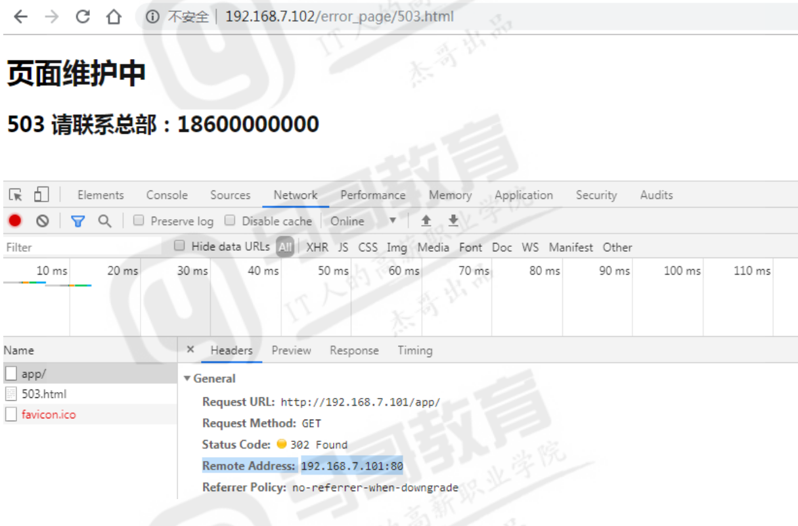

## 5.10：HAProxy四层负载：

针对有特殊访问写完的应用场景

​	Memcache、Redis、MySQL 、RabbitMQ

### 5.10.1：四层负载示例：

```
listen redis-port 
 bind 192.168.7.102:6379 
 mode tcp 
 balance leastconn 
 server server1 192.168.7.104:6379 check 
 server server1 192.168.7.103:6379 check backup
```

### 5.10.2：ACL示例-四层访问控制：

```
listen web_host 
 bind 192.168.7.101:80 
 mode http 
 balance roundrobin 
 log global 
 option httplog 
 
 acl static_path path_beg -i /static /images /javascript 
 use_backend static_path_host if HTTP_1.1 TRUE static_path 
 
 acl invalid_src src 192.168.1.0/24 192.168.7.102 
 tcp-request connection reject if invalid_src 
 
 default_backend default_web 
 
backend php_server_host 
 mode http 
 server web1 192.168.7.103 check inter 2000 fall 3 rise 5 
 
backend static_path_host 
 mode http 
 server web1 192.168.7.104 check inter 2000 fall 3 rise 5 
 
backend default_web 
 mode http 
 server web1 192.168.7.102:80 check inter 2000 fall 3 rise 5
```

## 5.11：HAProxy https实现：

```
配置HAProxy支持https协议： 
支持ssl会话；
 bind *:443 ssl crt /PATH/TO/SOME_PEM_FILE 
 crt 后证书文件为PEM格式，且同时包含证书和所有私钥 
 cat demo.crt demo.key > demo.pem 
把80端口的请求重向定443 
 bind *:80 
 redirect scheme https if !{ ssl_fc } 
向后端传递用户请求的协议和端口（frontend或backend）
 http_request set-header X-Forwarded-Port %[dst_port] 
 http_request add-header X-Forwared-Proto https if { ssl_fc }
```


### 5.11.1：证书制作：

```
# mkdir /usr/local/haproxy/certs 
# cd /usr/local/haproxy/certs 
# openssl genrsa -out haproxy.key 2048 
# openssl req -new -x509 -key haproxy.key -out haproxy.crt -subj "/CN=www.magedu.net" 
# cat haproxy.key haproxy.crt > haproxy.pem 
# openssl x509 -in haproxy.pem -noout -text #查看证书
```


### 5.11.2：https配置示例：

```
#web server http 
frontend web_server-http 
 bind 192.168.7.101:80 
 redirect scheme https if !{ ssl_fc } 
 mode http 
 use_backend web_host 
#web server https 
frontend web_server-https 
 bind 192.168.7.101:443 ssl crt /usr/local/haproxy/certs/haproxy.pem 
 mode http 
 use_backend web_host 
backend default_host 
 mode http 
 server web1 192.168.7.102:80 check inter 2000 fall 3 rise 5 
backend web_host 
 mode http 
 http-request set-header X-Forwarded-Port %[dst_port] 
 http-request add-header X-Forwarded-Proto https if { ssl_fc } 
 server web1 192.168.7.103:80 check inter 2000 fall 3 rise 5 
 server web2 192.168.7.104:80 check inter 2000 fall 3 rise 5
```


### 5.11.3：验证https：

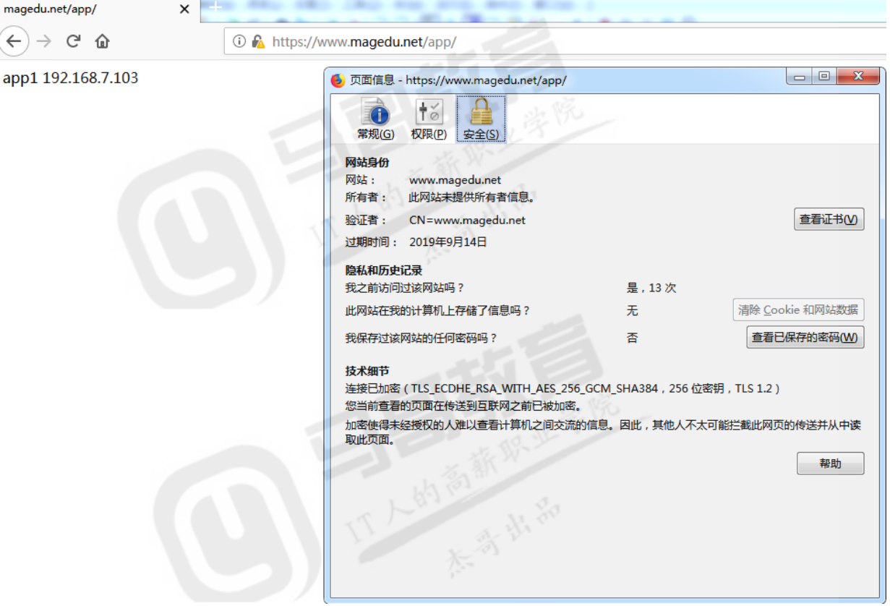

# 六：重点部分：

## 6.1：HAProxy调度算法

## 6.2：动静分离与客户端源IP透传：

## 6.3：ACL使用与报文修改：

## 6.4：服务器动态下线

编写shell脚本，实现能够基于参数传递real server服务器IP，并实现将其从多个HAProxy进程下线与上线

```
stats socket /var/lib/haproxy/haproxy1.sock mode 600 level admin process 1 
stats socket /var/lib/haproxy/haproxy2.sock mode 600 level admin process 2 
```

