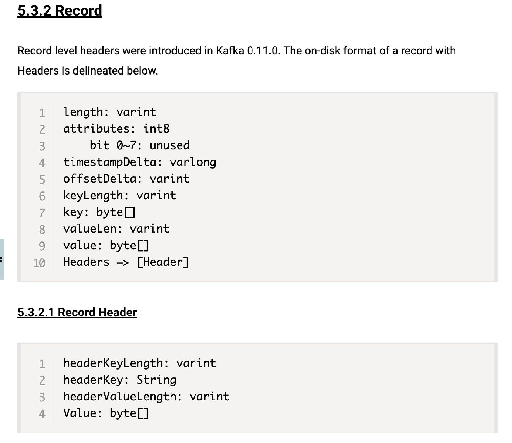

# kafka介绍

[Apache Kafka](https://kafka.apache.org/documentation/)

Kafka是一个分布式数据流平台，支持部署形成集群。它提供了发布和订阅功能，使用者可以发送数据到Kafka中，也可以从Kafka中读取数据(以便进行后续的处理)。
Kafka是一种高吞吐量的分布式发布订阅消息系统，它可以处理消费者规模的网站中的所有动作流数据，具有高性能、持久化、多副本备份、横向扩展等特点。


# Kafka架构组件

kafka cluster: kafka集群

**1、Broker**: 指部署了Kafka实例的**服务器节点**（有唯一的标识）。每个服务器.上有一个或多个kafka的实例，我们姑且认为每个broker对应一台服务器。每个kafka集群内的broker都有一个不重复的编号，如图中的broker-0、broker-1等....
**2、Topic**: 消息的主题（如nginx专用），kafka的数据就保存在topic。在每个broker上都可以创建多个topic。实际应用中通常是一个业务线建一个topic。
**3、Partition**: Topic的分区，每个topic可以有多个分区，分区的作用是做负载，提高kafka的吞吐量。Topic分区的角色（Follower:分区的从节点）。同一个topic的不同Partition分区数据是不重复的，partition的表现形式就是一个一个的文件夹!
**4、Replication**:备份文件，每一个分区都有多个副本。当主分区(Leader) 故障的时候会选择一个备胎(Follower)上位， 成为Leader。
在kafka中默认副本的最大数量是10个，且副本的数量不能大于Broker的数量，follower和leader在不同的机器，同一机器对同一个分区也只可能存放一个副本(包括自己)。
**5、Consumer**:消费者，即消息的消费方，是消息的出口。
**Consumer Group**:我们可以将多个消费组组成一个消费者组，在kafka的设计中同一个分区的数据只能被消费者组中的某一个消费者消费。同一个消费者组的消费者可以消费同一个topic的不同分区的数据，这也是为了提高kafka的吞吐量!

**6、Producer**: 即生产者，消息的产生者，是消息的入口。

Zookeeper：kafka集群依赖zookeeper来保存集群的的元信息，来保证系统的可用性。

**7、offset**：偏移量

- offset记录着下一条将要发送给Consumer的消息的序号
- 默认Kafka将offset存储在ZooKeeper中
- 在一个分区中，消息是有顺序的方式存储着，每个在分区的消费都是有一个递增的id。这个就是偏移量offset
- 偏移量在分区中才是有意义的。在分区之间，offset是没有任何意义的

## 工作流程

生产者往kafka发送数据的流程（6步）


1、生产者从Kafka集群获取分区leader信息
2、生产者将消息发送给leader
3、leader将消息写入本地磁盘
4、follower从leader拉取消息数据
5、follower将消息写入本地磁盘后向leader发送ACK
6、leader收到所有的follower的ACK之后向生产者发送ACK

## 选择partition的原则

某个 topic可以设置多个parition目录，生产者数据应该发往哪个分区呢？
1、partition在写入的时候可以指定需要写入的partition,如果有指定，则写入对应的partition。
2、如果没有指定partition,但是设置了数据的key,则会根据key的值hash出一个partition。
3、如果既没指定partition，又没有设置key,则会采用轮询方式，即每次取一小段时间的数据写入某个partition，下一小段的时间写入下一个partition。

# Topic分区数据和日志文件结构

对于每个Topic主题下 partition数据存储如下，Kafka集群维护了一个partition分区数据日志文件结构如下:

如上图，假如某个Topic有三个partition分区，采用轮询方式，在同一个partition上数据是有序存储的

每个partition都是一个有序并且不可变的消息记录集合。
	当新的数据写入时，追加到partition的末尾。在每个partition中，每条消息都会被分配一个顺序的唯一标识， 这个标识被称为offset（即偏移量），Kafka只保证在同一个partition内部消息是有序的，在不同partition之间并不能保证消息有序。

Kafka可以配置一个保留期限，用来标识日志会在Kafka集群内保留多长时间。Kafka集群会保留在保留期限内所有被发布的消息，不管这些消息是否被消费过，超过保留期，这些数据将会被清空。由于Kafka会将数据进行持久化存储(即写入到硬盘上)，所以保留的数据大小可以设置为一个比较大的值。

## Partition结构
Partition以文件夹的形式存在， 每个partition文件夹下面会有多组segment文件，每组segment文件又包含. index文件、.1og文件、.timeindex文件三个文件

- `.1og`文件就是实际存储message的地方
- `.index`和`.time .index`文件为索引文件，用于检索消息。

## 为什么kafka快?
虽然是写入物理磁盘，但是每条记录都是通过index索引能快速定位

# 消费模型

**发布-订阅模式(一对多)**

多个消费者实例可以组成一个消费者组，并用consumer group 标识这个消费者组。

一个消费者组中的不同消费者实例可以运行在不同的进程甚至不同的服务器上。如果所有的消费者实例都在同一个消费者组中，那么消息记录会被很好的均衡的发送到每个消费者实例。
如果所有的消费者实例都在不同的消费者组，那么每一条消息记录会被广播到每一个消费者实例。


- 分区是最小的并行单位
- 一个消费者可以消费多个分区
- 一个分区可以被多个消费者组里的消费者消费
- 但是，一个分区不能同时被同一个消费者组里的多个消费者消费

**点对点（一对一）**

消息生产者生产消息发送到queu消息队列中，然后消息消费者从queue中取出并且消费消息。一条消息被消费以后，queue中就没有了，不存在重复消费。

所有消费者都属于同一个消费者组


# 消息顺序及传递方式

**数据发送ack应答机制**

生产者往kafka发送数据的模式（3种）：
producer在向kafka写入消息的时候，设置确认参数确定kafka接收到数据，这个参数可设置的值为0、1、all。
● 0代表producer往集群发送数据不需要等到集群的返回，不确保消息发送成功。安全性最低但是效率最高。
● 1代表producer往集群发送数据只要leader应答就可以发送下一条，只确保leader发送成功。
● all代表producer往集群发送数据需要所有的follower都完成从leader的同步才会发送下一条，确保leader发送成功和所有的副本都完成备份。安全性最高，但是效率最低。

**分区与消息顺序**


- 同一个生产者发送到同一分区的消息，先发送的offset比后发送的offset小。（m1 offest < m2 offest）
- 同一个生产者发送到不同分区的消息，消息顺序无法保证。（不能保证m4和m1的顺序关系）

**分区与消费顺序**


- 消费者按照消息在分区里的存放顺序进行消费的
- Kafka只保证分区内的消息顺序，不能保证分区间的消息顺序

解决办法：

> 1.设置一个分区，这样就可以保证所有消息的顺序，但是失去了拓展性和性能
>
> 2.支持通过设置消息的key,相同key的消息会发送的同一个分区

**消息传递方式**

最多一次——消息可能会丢失，永远不重复发送


最少一次——消息不会丢失，但是可能会重复


精确一次——保证消息被传递到服务端且在服务端不重复

**幂等性**（Idempotence）指的是一个操作可以重复执行多次而不会改变结果。换句话说，无论执行多少次，操作的效果都是一样的。

在Kafka中，幂等性是指生产者可以确保消息只会被写入一次，即使在网络故障或重试的情况下。Kafka的幂等性通过以下机制实现：

1. **Producer ID (PID)**: 每个生产者实例都有一个唯一的PID。
2. **Sequence Number**: 每条消息都有一个序列号，生产者在发送消息时会附带这个序列号。
3. **Broker端的去重逻辑**: Broker会记录每个生产者的PID和对应的序列号，当接收到消息时，会检查序列号是否已经存在，如果存在则丢弃重复的消息。

通过这些机制，Kafka可以确保在网络故障或重试的情况下，消息不会被重复写入，从而实现幂等性。

需要生产者和消费者共同来保证。修改下面配置信息

```sh
enable.idempotence=true			# 开启幂等

//retries= Integer.MAX_VALUE

acts= all
```

通过offset来防止重复消费不是一个好的办法
通常在消息中加入唯一ID(例如流水ID，订单ID)，在处理业务时，通过判断ID来防止重复处理


# 事务

kafka支持事务（0.11.0 or later）

隔离级别solation level
默认为:read_uncommitted 脏读 （事务中未提交的数据可以读取）
读取成功提交的数据，不会脏读read committed


# 消息序列化

recode消息序列化：将一个完整的数据拆分传输

将对象以二进制的方式在网络之间传输或者保存到文件中，并可以根据特定的规则进行还原

[message   format消息序列化文档](https://kafka.apache.org/documentation/#messageformat)

**优点**

- 1.节省空间，提高网络传输效率
- 2.跨平台
- 3.跨语言

**常用消息格式**

- csv适合简单数据传输
- json可读性高（支持ES），占用空间
- protubuf 序列化消息


**Record Header用法 **


使用场景：

一个新用户注册成功之后、购买商品生成了一个订单，之后又取消了这个订单。

这些事件之间的顺序很重要。

Kafka 是不保证分区之间的顺序的。如果取消订单这条消息在注册用户或者购买商品之前，处理逻辑就会有问题。


这种情况下：为了保证消费顺秀，将所有事件放在同一个主题的同一个分区中。因此使用用户 ID 作为分区的key，使它们位于相同分区。

同时引入Record Header使用，标记不同的事件类型





# 监听器和负载均衡配置

server.properties 必要配置项

- broker.id
- log.dirs
- zookeeper.connect

**监听器**

listeners:指定broker启动时本机的监听名称、端口

```sh
监听地址配置									默认名称(协议)
listeners=PLAINTEXT://:9092					PLAINTEXT
listeners=PLAINTEXT://192.168.1.10:9092		SSL
listeners=PLAINTEXT://hostname:9092			SASL
listeners=PLAINTEXT://0.0.0.0:9092			PLAINTEXTSASL_SSL 
```

**监听器 listeners 和 advertised.listeners**

- listeners:指定broker启动时的本机监听端口，给服务器端使用
- advertised.listeners:对外发布的访问IP和端口，注册到zookeeper中，给客户端(client)使用


**负载均衡配置**

内外部网络使用，负载均衡使用kafka。


advertised.listeners配置需要配置成公网IP


配置文件示例

```sh
listenerS=INTERNAL://:9092,EXTERNAL://0.0.0.0:9093
advertised.listeners=INTERNAL://kafka-0:9092,EXTERNAL://公网IP:9093
listener.security.protocol.map=INTERNAL:PLAINTEXT,EXTERNAL:PLAINTEXT
inter.broker.listener.name=INTERNAL
```


# kafka安装教程

## 一、需要jdk1.8.0_201环境

```sh
方式一:
ubantu : apt-get install openjdk-8-jdk -y
centos : yum install openjdk-8-jdk -y

方式二: tar -zxf jdk1.8.0_201.tar# 解压文件
```

配置环境变量

```sh
vim /etc/profile # 在 profile 文件最后加上
export JAVA_HOME=/usr/local/java/jdk1.8.0_201
export PATH=$JAVA_HOME/bin:$PATH
export CLASSPATH=.:$JAVA_HOME/lib/dt.jar:$JAVA_HOME/lib/tool.jar

source /etc/profile			# 使配置生效
java -v # 进行检测
```

 

## 二、使用并启动kafka内置 zookeeper

kafka 依赖 zookeeper，kafka内置zookeeper

作用：查询kafka节点及进行连接

使用内置kafka内置zk

```sh
bin/zookeeper-server-start.sh -daemon config/zookeeper.properties # 
bin/zookeeper-server-start.sh config/zookeeper.properties &  # 后台启动，不会打印日志到控制台
ss -pln | grep 2181 #查看进程端口状态
```

**zookeeper安装**

```go
tar ‐zxvf apache‐zookeeper‐3.5.8‐bin.tar.gz	# 解压文件
cp conf/zoo_sample.cfg conf/zoo.cfg	# 复制一份配置文件, 方便修改
bin/zkServer.sh start	# 启动
```


## 三、安装 kafka

```go
wget https://dlcdn.apache.org/kafka/3.6.0/kafka_2.13-3.6.0.tgz

tar -xvf kafka_2.13-3.6.0.tgz -C /usr/local/
```

修改配置文件

```sh
vim config/server.config

broker.id=0		# broker.id属性在kafka集群中必须要是唯一

listeners=PLAINTEXT://192.xxx.xx.xx:9092		# kafka部署的机器ip和提供服务的端口号,切勿设0.0.0.0可能报错

log.dir=/usr/local/data/kafka‐logs# kafka的消息存储文件

zookeeper.connect=192.xxx.xx.xx:2181# kafka 连接 zookeeper 的地址
```

**启动服务**

运行的日志打印在 logs 目录里的server.log 里

```go
方式一：bin/kafka‐server‐start.sh ‐daemon config/server.properties 
方式二：bin/kafka‐server‐start.sh config/server.properties &  # 后台启动，不会打印日志到控制台
```

**停止kafka**

```go
bin/kafka‐server‐stop.sh
```

启动成功后，可以进入zookeeper 查看kafka节点

```go
root@123:/usr/local/kafka_2.13-3.6.0# bin/zookeeper-shell.sh  192.168.0.3:2181
Connecting to 192.168.0.3:2181
Welcome to ZooKeeper!
JLine support is disabled

ls /brokers/ids
WATCHER::

WatchedEvent state:SyncConnected type:None path:null
[0]
```


## 四、kafka使用相关命令

参数说明：

`--bootstrapver`指定连接服务器		 `--from-beginning`从最前开始读取

`-group test_group`指定 Group


**topic**----相关命令

```sh
#创建topic
bin/kafka-topics.sh --create --bootstrap-server 192.168.0.3:9092 --replication-factor 1 --partitions 1 --topic test2

#查看所有topic
bin/kafka-topics.sh --bootstrap-server 192.168.0.3:9092 --list

#查看topic具体内容
bin/kafka-console-consumer.sh --bootstrap-server 192.168.0.3:9092 --topic test2 --from-beginning

#清楚 Topic内数据
bin/kaftopics.sh --bootstrap-server 192.168.0.3:9092 --topic ehminer --delete
```

**producer生产者**----使用命令

```sh
#向指定topic中生产数据
bin/kafka-console-producer.sh --broker-list 192.168.0.3:9092 --topic test2
#例如：{"id":"1","name":"xiaoming","age":"20"}
```

**consumer消费者**----使用命令

```sh
#创建消费者组
bin/kafka-console-consumer.sh --bootstrap-server 192.168.0.3:9092 --topic test2 --group kafkatest

#消费数据，从头部开始
bin/kafka-console-consumer.sh --bootstrap-server 192.168.0.3:9092 --topic test2 --from-beginning

#消费数据，尾部开始，必需要指定分区：
/bin/kafka-console-consumer.sh --bootstrap-server localhost:9092 --topic test --offset latest --partition 0

#查看消费者组
bin/kafka-consumer-groups.sh --bootstrap-server 192.168.0.3:9092 --list

#查看消费者详情
bin/kafka-consumer-groups.sh --bootstrap-server 192.168.0.3:9092 --describe  --group kafkatest
```


