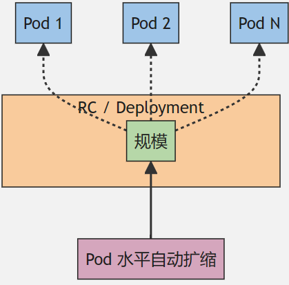

# 第三章 Pod

## 1 什么是 Pod？

Pod 是可以在 Kubernetes 中**创建和管理的、最小的可部署的计算单元**。
**Pod**（就像在鲸鱼荚或者豌豆荚中）**是一组（一个或多个）容器**； 这些容器共享存储、网络、以及怎样运行这些容器的声明。 Pod 中的**内容总是并置（colocated）的并且一同调度，在共享的上下文中运行**。简言之如果用 Docker 的术语来描述，**Pod 类似于共享名字空间并共享文件系统卷的一组容器。**

Pod 的共享上下文包括一组 Linux 名字空间、控制组（cgroup）和可能一些其他的隔离方面， 即用来隔离[容器](https://kubernetes.io/zh-cn/docs/concepts/containers/)的技术。 在 Pod 的上下文中，每个独立的应用可能会进一步实施隔离。Pod 类似于共享名字空间并共享文件系统卷的一组容器。

`定义: Pod 就是用来管理一组(一个|多个)容器的集合 特点: 共享网络 共享存储 共享上下文环境`

### 1.2 Pod 怎样管理多个容器?

Pod 中的容器被自动安排到集群中的同一物理机或虚拟机上，并可以一起进行调度。 容器之间可以共享资源和依赖、彼此通信、协调何时以及何种方式终止自身。例如，你可能有一个容器，为共享卷中的文件提供 Web 服务器支持，以及一个单独的 "边车 (sidercar)" 容器负责从远端更新这些文件，如下图所示：


### 1.3 如何使用 Pod?

通常你不需要直接创建 Pod，甚至单实例 Pod。 相反，你会使用诸如 Deployment 或 Job 这类工作负载资源来创建 Pod。 如果 Pod 需要跟踪状态，可以考虑 StatefulSet 资源。

Kubernetes 集群中的 Pod 主要有两种用法：

- **运行单个容器的 Pod**。"每个 Pod 一个容器" 模型是最常见的 Kubernetes 用例； 在这种情况下，可以将 Pod 看作单个容器的包装器，并且 Kubernetes 直接管理 Pod，而不是容器。
- **运行多个协同工作的容器 的 Pod**。 Pod 可能封装由多个紧密耦合且需要共享资源的共处容器组成的应用程序。 这些**位于同一位置的**容器可能形成单个内聚的服务单元 —— 一个容器将文件从共享卷提供给公众， 而另一个单独的 “边车”（sidecar）容器则刷新或更新这些文件。 Pod 将这些容器和存储资源打包为一个可管理的实体。

**说明: **

- 将多个并置、同管的容器组织到一个 Pod 中是一种相对高级的使用场景。 只有在一些场景中，容器之间紧密关联时你才应该使用这种模式。
- 每个 Pod 都旨在运行给定应用程序的单个实例。如果希望横向扩展应用程序 （例如，运行多个实例以提供更多的资源），则应该使用多个 Pod，每个实例使用一个 Pod。 在 Kubernetes 中，这通常被称为**副本（Replication）**。 通常使用一种工作负载资源及其控制器来创建和管理一组 Pod 副本。

## 2 Pod 基本操作

### 2.1 查看 pod

```shell
$ kubectl get pods|pod -A					# 查看所有命名空间的 pod
$ kubectl get pods|pod|po -n 命名空间名称
$ kubectl get pods -o wide -A				# 查看所有命名空间下 pod 的详细信息
$ kubectl get pod -w						# 实时监控 pod 的状态
$ kubectl get all -n <namespace>			# 查询指定命名空间下的所有资源

$ kubectl describe pod nginx				# 查看 pod 描述信息

$ kubectl logs -f(可选,实时) nginx			# 注意: 默认只查看 pod 中第一个容器日志
$ kubectl logs -f pod名称 -c 容器名称			# 注意: 查看 pod 中指定容器的日志
```

### 2.2 [创建 pod](https://kubernetes.io/zh-cn/docs/reference/kubernetes-api/workload-resources/pod-v1/)

```sh
pod      :  kubectl run nginx(pod名称) --image=nginx:1.19
container:  docker run --name nginx nginx:1.19
```

```yml
apiVersion: v1			# 指定 Kubernetes API 版本
kind: Pod				# 定义 Kubernetes 资源的类型为 Pod
metadata:				# 元数据部分，包含有关 Pod 的元信息
  name: nginx			# 指定 Pod 的名称为 nginx
spec:					# Pod 的规范部分，描述了 Pod 的规格
  containers:			# 容器列表，指定 Pod 中运行的容器
    - name: nginx		# 第一个容器的配置
      image: nginx:1.19	# 使用的镜像为 nginx 版本 1.19
      imagePullPolicy: {IfNotPresent|Always|Never} # 镜像拉取策略
      ports:			# 容器暴露的端口
        - containerPort: 80		# 容器监听的端口为 80
  restartPolicy: Always
```

```shell
$ kubectl create -f nginx-pod.yml	# 创建 pod
$ kubectl apply -f nginx-pod.yml
```

> `注意: create 仅仅是不存在时创建,如果已经存在则报错！apply 不存在创建，存在更新配置。推荐使用 apply！`

### 2.3 删除 pod

```shell
$ kubectl delete pod  pod名称
$ kubectl delete -f pod.yml
```

### 2.4 进入 pod 中容器

```shell
$ kubectl exec -it nginx -- bash(执行命令)				# 注意: 这种方式进入容器默认只会进入 pod 中第一个容器
$ kubectl exec -it pod名称 -c 容器名称 -- bash(执行命令) 	# 注意: 进入指定 pod 中指定容器
```

### 2.7 快速构建yaml模板

idea中安装kubernetes插件
新建nginx-pod.yaml--->输入kpod一键生成yaml模板文档

## 5 Pod 的[生命周期](https://kubernetes.io/zh-cn/docs/concepts/workloads/pods/pod-lifecycle/)

 Pod 遵循预定义的生命周期，起始于 `Pending` 阶段， 如果至少其中有一个主要容器正常启动，则进入 `Running`，之后取决于 Pod 中是否有容器以失败状态结束而进入 `Succeeded` 或者 `Failed` 阶段。与此同时Pod 在其生命周期中只会被调度一次。 一旦 Pod 被调度（分派）到某个节点，Pod 会一直在该节点运行，直到 Pod 停止或者被终止。

### 5.1 生命周期

和一个个独立的应用容器一样，Pod 也被认为是相对临时性（而不是长期存在）的实体。 Pod 会被创建、赋予一个唯一的 ID(UID)， 并被调度到节点，并在终止（根据重启策略）或删除之前一直运行在该节点。如果一个节点死掉了，调度到该节点的 Pod 也被计划在给定超时期限结束后删除。

Pod 自身不具有自愈能力。如果 Pod 被调度到某节点而该节点之后失效， Pod 会被删除；类似地，Pod 无法在因节点资源耗尽或者节点维护而被驱逐期间继续存活。 Kubernetes 使用一种高级抽象来管理这些相对而言可随时丢弃的 Pod 实例， 称作控制器。

任何给定的 Pod （由 UID 定义）从不会被“重新调度（rescheduled）”到不同的节点； 相反，这一 Pod 可以被一个新的、几乎完全相同的 Pod 替换掉。 如果需要，新 Pod 的名字可以不变，但是其 UID 会不同。

如果某物声称其生命期与某 Pod 相同，例如存储卷， 这就意味着该对象在此 Pod （UID 亦相同）存在期间也一直存在。 如果 Pod 因为任何原因被删除，甚至完全相同的替代 Pod 被创建时， 这个相关的对象（例如这里的卷）也会被删除并重建。

### 5.2 pod 阶段

Pod 的 `status` 字段是一个 [PodStatus](https://kubernetes.io/docs/reference/generated/kubernetes-api/v1.30/#podstatus-v1-core) 对象，其中包含一个 `phase` 字段。

Pod 的阶段（Phase）是 Pod 在其生命周期中所处位置的简单宏观概述。 该阶段并不是对容器或 Pod 状态的综合汇总，也不是为了成为完整的状态机。

Pod 阶段的数量和含义是严格定义的。 除了本文档中列举的内容外，不应该再假定 Pod 有其他的 `phase` 值。

| 取值                | 描述                                                         |
| :------------------ | :----------------------------------------------------------- |
| `Pending`（悬决）   | Pod 已被 Kubernetes 系统接受，但有一个或者多个容器尚未创建亦未运行。此阶段包括等待 Pod 被调度的时间和通过网络下载镜像的时间。 |
| `Running`（运行中） | Pod 已经绑定到了某个节点，Pod 中所有的容器都已被创建。至少有一个容器仍在运行，或者正处于启动或重启状态。 |
| `Succeeded`（成功） | Pod 中的所有容器都已成功终止，并且不会再重启。               |
| `Failed`（失败）    | Pod 中的所有容器都已终止，并且至少有一个容器是因为失败终止。也就是说，容器以非 0 状态退出或者被系统终止。 |
| `Unknown`（未知）   | 因为某些原因无法取得 Pod 的状态。这种情况通常是因为与 Pod 所在主机通信失败。 |

> **说明：**
>
> 1. 当一个 Pod 被删除时，执行一些 kubectl 命令会展示这个 Pod 的状态为 `Terminating`（终止）。 这个 `Terminating` 状态并不是 Pod 阶段之一。 Pod 被赋予一个可以体面终止的期限，默认为 30 秒。 你可以使用 `--force` 参数来强制终止 Pod。
> 2. 如果某节点死掉或者与集群中其他节点失联，Kubernetes 会实施一种策略，将失去的节点上运行的所有 Pod 的 `phase` 设置为 `Failed`。

### 5.3 Pod 状况

Pod 有一个 PodStatus 对象，其中包含一个 [PodConditions](https://kubernetes.io/docs/reference/generated/kubernetes-api/v1.30/#podcondition-v1-core) 数组。Pod 可能通过也可能未通过其中的一些状况测试。 Kubelet 管理以下 PodCondition：

- `PodScheduled`：Pod 已经被调度到某节点；
- `PodReadyToStartContainers`：Pod 沙箱被成功创建并且配置了网络（Beta 特性，[默认](https://kubernetes.io/zh-cn/docs/concepts/workloads/pods/pod-lifecycle/#pod-has-network)启用）；
- `ContainersReady`：Pod 中所有容器都已就绪；
- `Initialized`：所有的 [Init 容器](https://kubernetes.io/zh-cn/docs/concepts/workloads/pods/init-containers/)都已成功完成；
- `Ready`：Pod 可以为请求提供服务，并且应该被添加到对应服务的负载均衡池中。

这里是一个例子：

```sh
$ kubectl get pod -o yaml
kind: Pod
...
spec:
  readinessGates:
    - conditionType: "www.example.com/feature-1"
status:
  conditions:
    - type: Ready                              # Pod 状况的名称
      status: "False"							# 表明该状况是否适用，可能的取值有 "True"、"False" 或 "Unknown"
      lastProbeTime: null						# 上次探测 Pod 状况时的时间戳
      lastTransitionTime: 2018-01-01T00:00:00Z	# Pod 上次从一种状态转换到另一种状态时的时间戳
    - type: "www.example.com/feature-1"        # 额外的 Pod 状况
      status: "False"
      lastProbeTime: null
      lastTransitionTime: 2018-01-01T00:00:00Z
  containerStatuses:
    - containerID: docker://abcd...
      ready: true
...
```

## 7 Pod 中 init 容器

是一种特殊容器，在Pod 内的应用容器启动之前运行。Init 容器可以包括一些应用镜像中不存在的实用工具和安装脚本。

### 7.1 init 容器特点

init 容器与普通的容器非常像，除了如下几点：

- 它们总是运行到完成。如果 Pod 的 Init 容器失败，kubelet 会不断地重启该 Init 容器直到该容器成功为止。 然而，如果 Pod 对应的 `restartPolicy` 值为 "Never"，并且 Pod 的 Init 容器失败， 则 Kubernetes 会将整个 Pod 状态设置为失败。
- 每个都必须在下一个启动之前成功完成。
- 同时 Init 容器不支持 `lifecycle`、`livenessProbe`、`readinessProbe` 和 `startupProbe`， 因为它们必须在 Pod 就绪之前运行完成。
- 如果为一个 Pod 指定了多个 Init 容器，这些容器会按顺序逐个运行。 每个 Init 容器必须运行成功，下一个才能够运行。当所有的 Init 容器运行完成时， K8S 才会为 Pod 初始化应用容器并像平常一样运行。
- Init 容器支持应用容器的全部字段和特性，包括资源限制、数据卷和安全设置。 然而，Init 容器对资源请求和限制的处理稍有不同。

### 7.2 [使用 init 容器](https://kubernetes.io/zh-cn/docs/concepts/workloads/pods/init-containers/)

一个应用容器和一个 Init 容器的 Pod。Init 容器在应用容器启动前运行完成。

```yaml
apiVersion: v1
kind: Pod
metadata:
  name: init-demo
spec:
  containers:
  - name: nginx
    image: nginx
    ports:
    - containerPort: 80
    volumeMounts:
    - name: workdir
      mountPath: /usr/share/nginx/html
  initContainers:		# 这些容器在 Pod 初始化期间运行
  - name: install
    image: busybox:1.28
    command:
    - wget
    - "-O"
    - "/work-dir/index.html"
    - http://info.cern.ch
    volumeMounts:
    - name: workdir
      mountPath: "/work-dir"
  dnsPolicy: Default
  volumes:
  - name: workdir
    emptyDir: {}
```

配置文件中，你可以看到应用容器和 Init 容器共享了一个卷。

Init 容器将共享卷挂载到了 `/work-dir` 目录，应用容器将共享卷挂载到了 `/usr/share/nginx/html` 目录。 Init 容器执行完下面的命令就终止：

```shell
wget -O /work-dir/index.html http://info.cern.ch
```

请注意 Init 容器在 nginx 服务器的根目录写入 `index.html`。

## 8 [静态pod](https://kubernetes.io/zh-cn/docs/tasks/configure-pod-container/static-pod/)

静态Pod是一种不由Kubernetes API服务器直接管理的Pod。它们不受Kubernetes控制平面的控制，而是由kubelet直接管理。静态Pod的配置文件通常存储在kubelet配置目录中，并且kubelet会监视这些目录以启动、停止和管理这些Pod。

静态Pod的主要特点包括：

1. **不由Kubernetes API服务器管理**：静态Pod不受Kubernetes API服务器的管理，而是由各个节点上的kubelet直接管理。
2. **配置文件位置**：静态Pod的配置文件通常存储在kubelet的配置目录中（如`/etc/kubernetes/manifests`），而不是存储在etcd中。
3. **自动启动和监控**：kubelet会监视指定目录中的配置文件，并根据其中的配置启动、停止和重新启动Pod。如果一个静态Pod被删除，kubelet会尝试重新启动该Pod。
4. **独立于控制平面**：静态Pod不依赖于Kubernetes控制平面的可用性。这使得它们在一些特定场景下非常有用，比如在控制平面不可用时启动关键服务。

创建静态 Pod 有两种方式：`配置文件方式`和 `HTTP方式`。

### 1 配置文件方式

声明文件是标准的 Pod 定义文件，以 JSON 或者 YAML 格式存储在指定目录。路径设置在 [Kubelet 配置文件](https://kubernetes.io/zh-cn/docs/reference/config-api/kubelet-config.v1beta1/)的 `staticPodPath: <目录>` 字段，kubelet 会定期的扫描这个文件夹下的 YAML/JSON 文件来创建/删除静态 Pod。 注意 kubelet 扫描目录的时候会忽略以点开头的文件。

例如：下面是如何以静态 Pod 的方式启动一个简单 web 服务：

1. 选择一个目录，比如在 `/etc/kubernetes/manifests` 目录来保存 Web 服务 Pod 的定义文件，例如 `static-web.yaml`：

   ```shell
   $ cat <<EOF >/etc/kubernetes/manifests/static-web.yaml	# 在 kubelet 运行的节点上执行以下命令
   apiVersion: v1
   kind: Pod
   metadata:
     name: static-web
     labels:
       role: myrole
   spec:
     containers:
       - name: web
         image: nginx
         ports:
           - name: web
             containerPort: 80
             protocol: TCP
   EOF
   ```
   
1. 在该节点上配置 kubelet，在 [kubelet 配置文件](https://kubernetes.io/zh-cn/docs/reference/config-api/kubelet-config.v1beta1/)中设定 `staticPodPath` 值。 更多信息，请参考[通过配置文件设定 kubelet 参数](https://kubernetes.io/zh-cn/docs/tasks/administer-cluster/kubelet-config-file/)。

1. 重启 kubelet。在 Fedora 上，你将使用下面的命令：

   ```shell
   systemctl restart kubelet	# 在 kubelet 运行的节点上执行以下命令
   ```

### 2 Web 网上的静态 Pod 声明文件

Kubelet 根据 `--manifest-url=<URL>` 参数的配置定期的下载指定文件，并且转换成 JSON/YAML 格式的 Pod 定义文件。 与[文件系统上的清单文件](https://kubernetes.io/zh-cn/docs/tasks/configure-pod-container/static-pod/#configuration-files)使用方式类似，kubelet 调度获取清单文件。 如果静态 Pod 的清单文件有改变，kubelet 会应用这些改变。

按照下面的方式来：

1. 创建一个 YAML 文件，并保存在 Web 服务器上，这样你就可以将该文件的 URL 传递给 kubelet。

   ```yaml
   apiVersion: v1
   kind: Pod
   metadata:
     name: static-web
     labels:
       role: myrole
   spec:
     containers:
       - name: web
         image: nginx
         ports:
           - name: web
             containerPort: 80
             protocol: TCP
   ```

1. 通过在选择的节点上使用 `--manifest-url=<manifest-url>` 配置运行 kubelet。 在 Fedora 添加下面这行到 `/etc/kubernetes/kubelet`：

   ```shell
   KUBELET_ARGS="--cluster-dns=10.254.0.10 --cluster-domain=kube.local --manifest-url=<manifest-url>"
   ```

1. 重启 kubelet。在 Fedora 上，你将运行如下命令：

   ```shell
   systemctl restart kubelet # 在 kubelet 运行的节点上执行以下命令
   ```


## 9 Pod 的终止

通常 Pod 体面终止的过程为：

- kubelet 先发送一个带有体面超时限期的 TERM（又名 SIGTERM） 信号到每个容器中的主进程，将请求发送到容器运行时来尝试停止 Pod 中的容器。 
- 停止容器的这些请求由容器运行时以异步方式处理。这些请求的处理顺序无法被保证。许多容器运行时遵循容器镜像内定义的 `STOPSIGNAL` 值，
- 如果不同，则发送容器镜像中配置的 STOPSIGNAL，而不是 TERM 信号。
- 一旦超出了体面终止限期，容器运行时会向所有剩余进程发送 KILL 信号，之后 Pod 就会被从 [API 服务器](https://kubernetes.io/zh-cn/docs/concepts/overview/components/#kube-apiserver)上移除。
- 如果 `kubelet` 或者容器运行时的管理服务在等待进程终止期间被重启， 集群会从头开始重试，赋予 Pod 完整的体面终止限期。

**一个例子**：

1、你使用 `kubectl` 工具手动删除某个特定的 Pod，而该 Pod 的体面终止限期是默认值（30 秒）。

2、API 服务器中的 Pod 对象被更新，记录涵盖体面终止限期在内 Pod 的最终死期，超出所计算时间点则认为 Pod 已死（dead）。 

如果你使用 `kubectl describe` 来查验你正在删除的 Pod，该 Pod 会显示为 "Terminating" （正在终止）。 在 Pod 运行所在的节点上：`kubelet` 一旦看到 Pod 被标记为正在终止（已经设置了体面终止限期），`kubelet` 即开始本地的 Pod 关闭过程。

- 1、如果 Pod 中的容器之一定义了 `preStop` [回调](https://kubernetes.io/zh-cn/docs/concepts/containers/container-lifecycle-hooks)， `kubelet` 开始在容器内运行该回调逻辑。如果超出体面终止限期时， `preStop` 回调逻辑仍在运行，`kubelet` 会请求给予该 Pod 的宽限期一次性增加 2 秒钟。
  - 如果 `preStop` 回调在体面期结束后仍在运行，kubelet 将请求短暂的、一次性的体面期延长 2 秒。

> **说明**：  如果 `preStop` 回调所需要的时间长于默认的体面终止限期，你必须修改 `terminationGracePeriodSeconds` 属性值来使其正常工作。

- 2、`kubelet` 接下来触发容器运行时发送 TERM 信号给每个容器中的进程 1。

> **说明**：  Pod 中的容器会在不同时刻收到 TERM 信号，接收顺序也是不确定的。如果关闭的顺序很重要，可以考虑使用 `preStop` 回调逻辑来协调。

- 3、在 `kubelet` 启动 Pod 的体面关闭逻辑的同时，控制平面会评估是否将关闭的 Pod 从对应的 EndpointSlice（和端点）对象中移除，过滤条件是 Pod 被对应的[服务](https://kubernetes.io/zh-cn/docs/concepts/services-networking/service/)以某 [选择算符](https://kubernetes.io/zh-cn/docs/concepts/overview/working-with-objects/labels/)选定。 [ReplicaSet](https://kubernetes.io/zh-cn/docs/concepts/workloads/controllers/replicaset/) 和其他工作负载资源不再将关闭进程中的 Pod 视为合法的、能够提供服务的副本。

关闭动作很慢的 Pod 不应继续处理常规服务请求，而应开始终止并完成对打开的连接的处理。 一些应用程序不仅需要完成对打开的连接的处理，还需要更进一步的体面终止逻辑 - 比如：排空和完成会话。

任何正在终止的 Pod 所对应的端点都不会立即从 EndpointSlice 中被删除，EndpointSlice API（以及传统的 Endpoints API）会公开一个状态来指示其处于 [终止状态](https://kubernetes.io/zh-cn/docs/concepts/services-networking/endpoint-slices/#conditions)。 正在终止的端点始终将其 `ready` 状态设置为 `false`（为了向后兼容 1.26 之前的版本）， 因此负载均衡器不会将其用于常规流量。

如果需要排空正被终止的 Pod 上的流量，可以将 `serving` 状况作为实际的就绪状态。你可以在教程 [探索 Pod 及其端点的终止行为](https://kubernetes.io/zh-cn/docs/tutorials/services/pods-and-endpoint-termination-flow/) 中找到有关如何实现连接排空的更多详细信息。

### 强制终止 Pod

默认情况下，所有的删除操作都会附有 30 秒钟的宽限期限。

 `kubectl delete` 命令支持 `--grace-period=<seconds>` 选项，允许你重载默认值， 设定自己希望的期限值。将宽限期限强制设置为 `0` 意味着立即从 API 服务器删除 Pod。 如果 Pod 仍然运行于某节点上，强制删除操作会触发 `kubelet` 立即执行清理操作。

```sh
kubectl delete pods <pod> --grace-period=0 --force
```

执行强制删除操作时，API 服务器不再等待来自 `kubelet` 的、关于 Pod 已经在原来运行的节点上终止执行的确认消息。 API 服务器直接删除 Pod 对象，这样新的与之同名的 Pod 即可以被创建。 在节点侧，被设置为立即终止的 Pod 仍然会在被强行杀死之前获得一点点的宽限时间。

如果在执行这些命令后 Pod 仍处于 `Unknown` 状态，请使用以下命令从集群中删除 Pod：

```shell
kubectl patch pod <pod> -p '{"metadata":{"finalizers":null}}'
```


## 调试运行中的 Pod

```sh
kubectl describe pod	# 1、获取 Pod 详情
kubectl get events 		# 2、查看events 事件
kubectl get pod nginx-deployment-1006230814-6winp -o yaml	# 3、查看yaml格式详细信息

# 4、检查 Pod 的日志
# 首先，查看受到影响的容器的日志：
kubectl logs ${POD_NAME} ${CONTAINER_NAME}
# 如果你的容器之前崩溃过，你可以通过下面命令访问之前容器的崩溃日志：
kubectl logs --previous ${POD_NAME} ${CONTAINER_NAME}

# 5、使用容器 exec 进行调试
kubectl exec -it cassandra -- sh	# 在kubectl exec命令后面加上 -i 和 -t 来运行一个连接到你的终端的 Shell
# 6、使用临时调试容器来进行调试
# 你可以使用 kubectl debug 命令来给正在运行中的 Pod 增加一个临时容器。 首先，像示例一样创建一个 pod：
kubectl run ephemeral-demo --image=registry.k8s.io/pause:3.1 --restart=Never
# 或者使用 kubectl debug 添加调试容器。 如果你指定 -i 或者 --interactive 参数，kubectl 将自动挂接到临时容器的控制台。
kubectl debug -it ephemeral-demo --image=busybox:1.28 --target=ephemeral-demo
```

# 第三章 [Pod亲和性分配](http://kubernetes.p2hp.com/docs/concepts/scheduling-eviction/assign-pod-node.html)

**Pod亲和性** 是用于控制Pod在哪些节点上优先调度的机制之一。是用 **标签选择算符** 来进行选择

通过Pod亲和性，您可以定义细致的条件，以确保Pod被调度到符合特定规则的节点上。有两种类型的亲和性：

- 亲和性（Affinity）允许Pod优先调度到满足特定条件的节点，
- 反亲和性（Anti-affinity）则可以防止Pod被调度到某些节点上。

您可以通过设置Pod规范文件中的规则来配置Pod亲和性和反亲和性。这些规则可以是必需的（required）或首选的（preferred），

你可以使用下列方法中的任何一种来选择 Kubernetes 对特定 Pod 的调度：

- 与节点标签匹配的 nodeSelector  **推荐**
- 亲和性与反亲和性 **推荐**
- nodeName
- Pod 拓扑分布约束 **推荐**

**节点添加标签**

通过为节点添加标签，你可以准备让 Pod 调度到特定节点或节点组上。选择一个节点，给它添加一个标签：

```shell
kubectl label nodes k8s-node1 disktype=ssd
```

## [nodeSelector]分配节点

`nodeSelector` 选择标签：是节点选择约束的最简单推荐形式。Kubernetes 只会将 Pod 调度到拥有你所指定的每个标签的节点上。

```yml
apiVersion: v1
kind: Pod
metadata:
  name: nginx
  labels:
    env: nginx
spec:
  containers:
  - name: nginx
    image: nginx:1.19
    imagePullPolicy: IfNotPresent
  nodeSelector:
    disktype: ssd  # 选择节点为标签为 ssd 的节点
```

## [nodeName]分配节点

`nodeName` 节点名称：是比亲和性或者 `nodeSelector` 更为直接的形式。指定节点上的 kubelet 会尝试将 Pod 放到该节点上。 使用 `nodeName` 规则的优先级会高于使用 `nodeSelector` 或亲和性与非亲和性的规则。

使用 `nodeName` 来选择节点的方式有一些局限性：

- 如果所指代的节点不存在，则 Pod 无法运行，而且在某些情况下可能会被自动删除。
- 如果所指代的节点无法提供用来运行 Pod 所需的资源，Pod 会失败， 而其失败原因中会给出是否因为内存或 CPU 不足而造成无法运行。
- 在云环境中的节点名称并不总是可预测的，也不总是稳定的。

下面是一个使用 `nodeName` 字段的 Pod 规约示例：

```yml
apiVersion: v1
kind: Pod
metadata:
  name: nginx
spec:
  containers:
  - name: nginx
    image: nginx
  nodeName: k8s-node1		# Pod 只能运行在节点 kube-01 之上
```

## affinity亲和性分类

亲和性/反亲和性扩展了你可以定义的约束类型。使用亲和性与反亲和性的一些好处有：

- `nodeSelector` 只能选择拥有所有指定标签的节点。 亲和性/反亲和性为你提供对选择逻辑的更强控制能力。
- 你可以标明某规则是“软需求”或者“偏好”，这样调度器在无法找到匹配节点时仍然调度该 Pod。
- 你可以使用节点上（或其他拓扑域中）运行的其他 Pod 的标签来实施调度约束， 而不是只能使用节点本身的标签。这个能力让你能够定义规则允许哪些 Pod 可以被放置在一起。

亲和性功能由**两种类型的亲和性**组成：

- **nodeAffinity节点亲和性 ** 功能类似于 `nodeSelector` 字段，但它的表达能力更强，并且允许你指定软规则。
- **Pod 间亲和性/反亲和性** 允许你根据其他 Pod 的标签来约束 Pod。

### nodeAffinity节点亲和性

**节点亲和性** 概念上类似于 `nodeSelector`，可以根据节点上的标签来约束 Pod 可以调度到哪些节点上。 节点亲和性有两种：

- `requiredDuringSchedulingIgnoredDuringExecution`：调度器只有在规则被满足的时候才能执行调度。此功能类似于 `nodeSelector`， 但其语法表达能力更强。
- `preferredDuringSchedulingIgnoredDuringExecution`：调度器会尝试寻找满足对应规则的节点。如果找不到匹配的节点，调度器仍然会调度该 Pod。

> **注意**：`IgnoredDuringExecution` 类型意味着如果节点标签在 Kubernetes 调度 Pod 后发生了变更，Pod 仍将继续运行。

```yml
apiVersion: v1
kind: Pod
metadata:
  name: with-node-affinity
spec:
  affinity:
    nodeAffinity:
      # 节点必须包含一个键名为 ssd 的标签， 并且该标签的取值必须为 fast 或 superfast。
      requiredDuringSchedulingIgnoredDuringExecution:
        nodeSelectorTerms:
        - matchExpressions:
          - key: topology.kubernetes.io/zone
            operator: In
            values:
            - antarctica-east1
            - antarctica-west1
      preferredDuringSchedulingIgnoredDuringExecution:
      - weight: 1
        preference:
          matchExpressions:
          - key: another-node-label-key
            operator: In		# 
            values:
            - another-node-label-value
  containers:
  - name: with-node-affinity
    image: registry.k8s.io/pause:2.0
```

在这一示例中，所应用的规则如下：

- 节点**必须**包含一个键名为 `topology.kubernetes.io/zone` 的标签， 并且该标签的取值**必须**为 `antarctica-east1` 或 `antarctica-west1`。
- 节点**最好**具有一个键名为 `another-node-label-key` 且取值为 `another-node-label-value` 的标签。

你可以使用 `In`、`NotIn`、`Exists`、`DoesNotExist`、`Gt` 和 `Lt` 之一作为操作符。`NotIn` 和 `DoesNotExist` 可用来实现节点反亲和性行为。`NotIn` 和 `DoesNotExist` 可用来实现节点反亲和性行为。 你也可以使用 节点污点 将 Pod 从特定节点上驱逐。

> **说明：**如果你同时指定了 `nodeSelector` 和 `nodeAffinity`，**两者** 必须都要满足， 才能将 Pod 调度到候选节点上。
>
> - 如果你指定了多个与 `nodeAffinity` 类型关联的 `nodeSelectorTerms`， 只要其中一个 `nodeSelectorTerms` 满足的话，Pod 就可以被调度到节点上。
>
>
> - 如果你指定了多个与同一 `nodeSelectorTerms` 关联的 `matchExpressions`， 则只有当所有 `matchExpressions` 都满足时 Pod 才可以被调度到节点上。

### nodeAffinity权重

`preferredDuringSchedulingIgnoredDuringExecution` 亲和性类型的每个实例设置 `weight` 字段，其取值范围是 1 到 100。 当调度器找到能够满足 Pod 的其他调度请求的节点时，调度器会遍历节点满足的所有的偏好性规则， 并将对应表达式的 `weight` 值加和。

最终的加和值会添加到该节点的其他优先级函数的评分之上。 在调度器为 Pod 作出调度决定时，总分最高的节点的优先级也最高。

```yml
apiVersion: v1
kind: Pod
metadata:
  name: with-affinity-anti-affinity
spec:
  affinity:
    nodeAffinity:	# 节点最好具有一个键名为 app 且取值为 fast 的标签。
      requiredDuringSchedulingIgnoredDuringExecution:
        nodeSelectorTerms:
        - matchExpressions:
          - key: kubernetes.io/os
            operator: In
            values:
            - linux
      preferredDuringSchedulingIgnoredDuringExecution:
      - weight: 1	# 取值范围是 1 到 100
        preference:
          matchExpressions:
          - key: label-1
            operator: In
            values:
            - key-1
      - weight: 50
        preference:
          matchExpressions:
          - key: label-2
            operator: In
            values:
            - key-2
  containers:
  - name: with-node-affinity
    image: registry.k8s.io/pause:2.0
```

如果存在两个候选节点，都满足 `preferredDuringSchedulingIgnoredDuringExecution` 规则， 其中一个节点具有标签 `label-1:key-1`，另一个节点具有标签 `label-2:key-2`， 调度器会考察各个节点的 `weight` 取值，并将该权重值添加到节点的其他得分值之上，

> **说明：**如果你希望 Kubernetes 能够成功地调度此例中的 Pod，你必须拥有打了 `kubernetes.io/os=linux` 标签的节点。

### podAffinity及权重

pod 间亲和性/反亲和性及权重，你可以基于已经在节点上运行的 **Pod** 的标签来约束 Pod 可以调度到的节点。也有两种类型：

- `requiredDuringSchedulingIgnoredDuringExecution`：你可以使用 他 来告诉调度器， 将两个服务的 Pod 放到同一个云提供商可用区内，因为它们彼此之间通信非常频繁。

- `preferredDuringSchedulingIgnoredDuringExecution`：你可以使用 他 反亲和性来将同一服务的多个 Pod 分布到多个云提供商可用区中。

**Pod 间亲和性/反亲和性的规则格式**：“如果 X 上已经运行了一个或多个满足规则 Y 的 Pod， 则这个 Pod 应该（或者在反亲和性的情况下不应该）运行在 X 上”。 这里的 X 可以是节点、机架、云提供商可用区或地理区域或类似的拓扑域， Y 则是 Kubernetes 尝试满足的规则。

> **说明：**Pod 间亲和性和反亲和性都需要相当的计算量，因此会在大规模集群中显著降低调度速度。 我们不建议在包含数百个节点的集群中使用这类设置。

```yml
apiVersion: v1
kind: Pod
metadata:
  name: with-pod-affinity
spec:
  affinity:
    podAffinity:		# Pod 间亲和性
      requiredDuringSchedulingIgnoredDuringExecution:
      - labelSelector:
          matchExpressions:
          - key: security
            operator: In
            values:
            - S1
        topologyKey: topology.kubernetes.io/zone
    podAntiAffinity:	# Pod 间反亲和性
      preferredDuringSchedulingIgnoredDuringExecution:
      - weight: 100
        podAffinityTerm:
          labelSelector:
            matchExpressions:
            - key: security
              operator: In
              values:
              - S2
          topologyKey: topology.kubernetes.io/zone
  containers:
  - name: with-pod-affinity
    image: registry.k8s.io/pause:2.0
```

- 亲和性规则：仅当节点和至少一个已运行且有 `security=S1` 的标签的 Pod 处于同一区域时，才可以将该 Pod 调度到节点上。 更确切的说，调度器必须将 Pod 调度到具有 `topology.kubernetes.io/zone=V` 标签的节点上，并且集群中至少有一个位于该可用区的节点上运行着带有 `security=S1` 标签的 Pod。

- 反亲和性规则：如果节点处于 Pod 所在的同一可用区且至少一个 Pod 具有 `security=S2` 标签，则该 Pod 不应被调度到该节点上。 更确切地说， 如果同一可用区中存在其他运行着带有 `security=S2` 标签的 Pod 节点， 并且节点具有标签 `topology.kubernetes.io/zone=R`，Pod 不能被调度到该节点上。

`operator` 字段使用 `In`、`NotIn`、`Exists`、 `DoesNotExist` 等值。原则上，`topologyKey` 可以是任何合法的标签键。出于性能和安全原因，`topologyKey` 有一些限制：

- 对于 Pod 亲和性而言，在 `requiredDuringSchedulingIgnoredDuringExecution` 和 `preferredDuringSchedulingIgnoredDuringExecution` 中，`topologyKey` 不允许为空。
- 对于 `requiredDuringSchedulingIgnoredDuringExecution` 要求的 Pod 反亲和性， 准入控制器 `LimitPodHardAntiAffinityTopology` 要求 `topologyKey` 只能是 `kubernetes.io/hostname`。如果你希望使用其他定制拓扑逻辑， 你可以更改准入控制器或者禁用之。

除了 `labelSelector` 和 `topologyKey`，你也可以指定 `labelSelector` 要匹配的命名空间列表，方法是在 `labelSelector` 和 `topologyKey` 所在层同一层次上设置 `namespaces`。 如果 `namespaces` 被忽略或者为空，则默认为 Pod 亲和性/反亲和性的定义所在的命名空间。

### 实际用例

Pod 间亲和性/反亲和性在与更高级别的集合（例如 ReplicaSet、StatefulSet、 Deployment 等）一起使用时，它们可能更加有用。 这些规则使得你可以配置一组工作负载，使其位于所定义的同一拓扑中； 例如优先将两个相关的 Pod 置于相同的节点上。

以一个三节点的集群为例。你使用该集群运行一个带有内存缓存（例如 Redis）的 Web 应用程序。 在此例中，还假设 Web 应用程序和内存缓存之间的延迟应尽可能低。 可以使用 Pod 间的亲和性/反亲和性来尽可能地将该 Web 服务器与缓存并置。

在下面的 Redis 缓存 示例中，副本上设置了标签 `app=store`。 `podAntiAffinity` 规则告诉调度器避免将多个带有 `app=store` 标签的副本部署到同一节点上。 因此，每个独立节点上会创建一个缓存实例。

```yaml
apiVersion: apps/v1
kind: Deployment
metadata:
  name: redis-cache
spec:
  selector:
    matchLabels:
      app: store
  replicas: 3
  template:
    metadata:
      labels:
        app: store
    spec:
      affinity:
        podAntiAffinity:
          requiredDuringSchedulingIgnoredDuringExecution:
          - labelSelector:
              matchExpressions:
              - key: app
                operator: In
                values:
                - store
            topologyKey: "kubernetes.io/hostname"
      containers:
      - name: redis-server
        image: redis:3.2-alpine
```

下例的 Deployment 为 Web 服务器创建带有标签 `app=web-store` 的副本。 Pod 亲和性规则告诉调度器将每个副本放到存在标签为 `app=store` 的 Pod 的节点上。 Pod 反亲和性规则告诉调度器决不要在单个节点上放置多个 `app=web-store` 服务器。

```yaml
apiVersion: apps/v1
kind: Deployment
metadata:
  name: web-server
spec:
  selector:
    matchLabels:
      app: web-store
  replicas: 3
  template:
    metadata:
      labels:
        app: web-store
    spec:
      affinity:
        podAntiAffinity:
          requiredDuringSchedulingIgnoredDuringExecution:
          - labelSelector:
              matchExpressions:
              - key: app
                operator: In
                values:
                - web-store
            topologyKey: "kubernetes.io/hostname"
        podAffinity:
          requiredDuringSchedulingIgnoredDuringExecution:
          - labelSelector:
              matchExpressions:
              - key: app
                operator: In
                values:
                - store
            topologyKey: "kubernetes.io/hostname"
      containers:
      - name: web-app
        image: nginx:1.16-alpine
```

创建前面两个 Deployment 会产生如下的集群布局，每个 Web 服务器与一个缓存实例并置， 并分别运行在三个独立的节点上。

|    node-1     |    node-2     |    node-3     |
| :-----------: | :-----------: | :-----------: |
| *webserver-1* | *webserver-2* | *webserver-3* |
|   *cache-1*   |   *cache-2*   |   *cache-3*   |

总体效果是每个缓存实例都非常可能被在同一个节点上运行的某个客户端访问。 这种方法旨在最大限度地减少偏差（负载不平衡）和延迟。

你可能还有使用 Pod 反亲和性的一些其他原因。 参阅 [ZooKeeper 教程](https://kubernetes.p2hp.com/docs/tutorials/stateful-application/zookeeper/index.html#tolerating-node-failure) 了解一个 StatefulSet 的示例，该 StatefulSet 配置了反亲和性以实现高可用， 所使用的是与此例相同的技术。

### 名字空间选择算符

用户也可以使用 `namespaceSelector` 选择匹配的名字空间，`namespaceSelector` 是对名字空间集合进行标签查询的机制。 亲和性条件会应用到 `namespaceSelector` 所选择的名字空间和 `namespaces` 字段中所列举的名字空间之上。 

> **注意**，空的 `namespaceSelector`（`{}`）会匹配所有名字空间，而 null 或者空的 `namespaces` 列表以及 null 值 `namespaceSelector` 意味着“当前 Pod 的名字空间”。

## Pod 拓扑分布约束

**拓扑分布约束（Topology Spread Constraints）** 用来控制 Pod 在集群内故障域之间的分布。用label进行判断，不同的key和不同的value是属于不同的拓扑域。故障域的示例有区域（Region）、可用区（Zone）、节点和其他用户自定义的拓扑域。

> 这样做有助于提升性能、实现高可用或提升资源利用率。

**问**：假设你有一个最多包含二十个节点的集群，你想要运行一个自动扩缩的 工作负载，请问要使用多少个副本？

答案可能是最少 2 个 Pod，最多 15 个 Pod。 当只有 2 个 Pod 时，你倾向于这 2 个 Pod 不要同时在同一个节点上运行： 你所遭遇的风险是如果放在同一个节点上且单节点出现故障，可能会让你的工作负载下线。

除了这个基本的用法之外，还有一些高级的使用案例，能够让你的工作负载受益于高可用性并提高集群利用率。

**问**：随着你的工作负载扩容，运行的 Pod 变多，将需要考虑另一个重要问题。 假设你有 3 个节点，每个节点运行 5 个 Pod。这些节点有足够的容量能够运行许多副本； 但与这个工作负载互动的客户端分散在三个不同的数据中心（或基础设施可用区）。 现在你可能不太关注单节点故障问题，但你会注意到延迟高于自己的预期， 在不同的可用区之间发送网络流量会产生一些网络成本。

你决定在正常运营时倾向于将类似数量的副本 调度 到每个基础设施可用区，且你想要该集群在遇到问题时能够自愈。

### `topologySpreadConstraints` 字段

这个字段的用法如下所示：

```yaml
---
apiVersion: v1
kind: Pod
metadata:
  name: example-pod
spec:
  topologySpreadConstraints:	# 配置一个拓扑分布约束
    - maxSkew: <integer>
      minDomains: <integer> # 可选；自从 v1.25 开始成为 Beta
      topologyKey: <string>
      whenUnsatisfiable: <string>	
      labelSelector: <object>	# 用于查找匹配的 Pod。匹配此标签的 Pod 将被统计，以确定相应拓扑域中 Pod 的数量。
      matchLabelKeys: <list> # 可选；自从 v1.25 开始成为 Alpha
      nodeAffinityPolicy: [Honor|Ignore] # 可选；自从 v1.25 开始成为 Alpha
      nodeTaintsPolicy: [Honor|Ignore] # 可选；自从 v1.25 开始成为 Alpha
  ### 其他 Pod 字段置于此处
```

运行 `kubectl explain Pod.spec.topologySpreadConstraints` 或参阅 Pod API 参考的[调度](https://kubernetes.p2hp.com/docs/reference/kubernetes-api/workload-resources/pod-v1/index.html#scheduling)一节， 了解有关此字段的更多信息。

#### 分布约束定义

你可以定义一个或多个 `topologySpreadConstraints` 条目以指导 kube-scheduler 如何将每个新来的 Pod 与跨集群的现有 Pod 相关联。这些字段包括：

- **maxSkew** 描述这些 Pod 可能被均匀分布的程度（必须指定此字段且数值必须大于零）。 其语义将随着 `whenUnsatisfiable` 的值发生变化：
  - `whenUnsatisfiable: DoNotSchedule`，则 `maxSkew` 定义目标拓扑中匹配 Pod 的数量与 **全局最小值**（符合条件的域中匹配的最小 Pod 数量，如果符合条件的域数量小于 MinDomains 则为零） 之间的最大允许差值。例如，如果你有 3 个可用区，分别有 2、2 和 1 个匹配的 Pod，则 `MaxSkew` 设为 1， 且全局最小值为 1。
  - `whenUnsatisfiable: ScheduleAnyway`，则该调度器会更为偏向能够降低偏差值的拓扑域。

- **minDomains** 表示符合条件的域的最小数量（可选）。域是拓扑的一个特定实例。 符合条件的域是其节点与节点选择器匹配的域。
  - 指定的 `minDomains` 值必须大于 0。你可以结合 `whenUnsatisfiable: DoNotSchedule` 仅指定 `minDomains`。
  - 当符合条件的、拓扑键匹配的域的数量小于 `minDomains` 时，拓扑分布将“全局最小值”（global minimum）设为 0， 然后进行 `skew` 计算。“全局最小值” 是一个符合条件的域中匹配 Pod 的最小数量， 如果符合条件的域的数量小于 `minDomains`，则全局最小值为零。
  - 当符合条件的拓扑键匹配域的个数等于或大于 `minDomains` 时，该值对调度没有影响。
  - 如果你未指定 `minDomains`，则约束行为类似于 `minDomains` 等于 1。

- **topologyKey** 是[节点标签](https://kubernetes.p2hp.com/docs/concepts/scheduling-eviction/topology-spread-constraints/index.html#node-labels)的键。如果节点使用此键标记并且具有相同的标签值， 则将这些节点视为处于同一拓扑域中。我们将拓扑域中（即键值对）的每个实例称为一个域。 调度器将尝试在每个拓扑域中放置数量均衡的 Pod。 另外，我们将符合条件的域定义为其节点满足 nodeAffinityPolicy 和 nodeTaintsPolicy 要求的域。
- **whenUnsatisfiable** 指示如果 Pod 不满足分布约束时如何处理：
  - `DoNotSchedule`（默认）告诉调度器不要调度。
  - `ScheduleAnyway` 告诉调度器仍然继续调度，只是根据如何能将偏差最小化来对节点进行排序。
- **matchLabelKeys** 是一个 Pod 标签键的列表，用于选择需要计算分布方式的 Pod 集合。 这些键用于从 Pod 标签中查找值，这些键值标签与 `labelSelector` 进行逻辑与运算，以选择一组已有的 Pod， 通过这些 Pod 计算新来 Pod 的分布方式。Pod 标签中不存在的键将被忽略。 null 或空列表意味着仅与 `labelSelector` 匹配。
  - 借助 `matchLabelKeys`，用户无需在变更 Pod 修订版本时更新 `pod.spec`。 控制器或 Operator 只需要将不同修订版的 `label` 键设为不同的值。 调度器将根据 `matchLabelKeys` 自动确定取值。例如，如果用户使用 Deployment， 则他们可以使用由 Deployment 控制器自动添加的、以 `pod-template-hash` 为键的标签来区分单个 Deployment 的不同修订版。

```yaml
    topologySpreadConstraints:
        - maxSkew: 1
          topologyKey: kubernetes.io/hostname
          whenUnsatisfiable: DoNotSchedule
          matchLabelKeys:
            - app
            - pod-template-hash
```

> **说明：**`matchLabelKeys` 是 1.25 中新增的一个 Alpha 字段。 须启用 `MatchLabelKeysInPodTopologySpread` 才能使用此字段。

- **nodeAffinityPolicy** 表示我们在计算 Pod 拓扑分布偏差时将如何处理 Pod 的 nodeAffinity/nodeSelector。 选项为：

  - Honor：只有与 nodeAffinity/nodeSelector 匹配的节点才会包括到计算中。
  - Ignore：nodeAffinity/nodeSelector 被忽略。所有节点均包括到计算中。

  如果此值为 nil，此行为等同于 Honor 策略。

  **说明：** 须启用 `NodeInclusionPolicyInPodTopologySpread`才能使用此字段。

- **nodeTaintsPolicy** 表示我们在计算 Pod 拓扑分布偏差时将如何处理节点污点。选项为：

  - Honor：包括不带污点的节点以及污点被新 Pod 所容忍的节点。
  - Ignore：节点污点被忽略。包括所有节点。

  如果此值为 null，此行为等同于 Ignore 策略。

  **说明：**须启用 `NodeInclusionPolicyInPodTopologySpread`才能使用此字段。

当 Pod 定义了不止一个 `topologySpreadConstraint`，这些约束之间是逻辑与的关系。 kube-scheduler 会为新的 Pod 寻找一个能够满足所有约束的节点。

#### 节点标签

拓扑分布约束依赖于节点标签来标识每个 节点 所在的拓扑域。 例如，某节点可能具有标签：

```yaml
  region: us-east-1
  zone: us-east-1a
```

**说明：**为了简便，此示例未使用[众所周知](https://kubernetes.p2hp.com/docs/reference/labels-annotations-taints/)的标签键 `topology.kubernetes.io/zone` 和 `topology.kubernetes.io/region`。 但是，建议使用那些已注册的标签键，而不是此处使用的私有（不合格）标签键 `region` 和 `zone`。

你无法对不同上下文之间的私有标签键的含义做出可靠的假设。

假设你有一个 4 节点的集群且带有以下标签：

```
NAME    STATUS   ROLES    AGE     VERSION   LABELS
node1   Ready    <none>   4m26s   v1.16.0   node=node1,zone=zoneA
node2   Ready    <none>   3m58s   v1.16.0   node=node2,zone=zoneA
node3   Ready    <none>   3m17s   v1.16.0   node=node3,zone=zoneB
node4   Ready    <none>   2m43s   v1.16.0   node=node4,zone=zoneB
```

那么，从逻辑上看集群如下：


### 一致性

你应该为一个组中的所有 Pod 设置相同的 Pod 拓扑分布约束。

通常，如果你正使用一个工作负载控制器，例如 Deployment，则 Pod 模板会帮你解决这个问题。 如果你混合不同的分布约束，则 Kubernetes 会遵循该字段的 API 定义； 但是，该行为可能更令人困惑，并且故障排除也没那么简单。

你需要一种机制来确保拓扑域（例如云提供商区域）中的所有节点具有一致的标签。 为了避免你需要手动为节点打标签，大多数集群会自动填充知名的标签， 例如 `topology.kubernetes.io/hostname`。检查你的集群是否支持此功能。

## 拓扑分布约束示例

### 示例：一个拓扑分布约束

假设你拥有一个 4 节点集群，其中标记为 `foo: bar` 的 3 个 Pod 分别位于 node1、node2 和 node3 中：


如果你希望新来的 Pod 均匀分布在现有的可用区域，则可以按如下设置其清单：

```yaml
kind: Pod
apiVersion: v1
metadata:
  name: mypod
  labels:
    foo: bar
spec:
  topologySpreadConstraints:
  - maxSkew: 1
    topologyKey: zone
    whenUnsatisfiable: DoNotSchedule
    labelSelector:
      matchLabels:
        foo: bar
  containers:
  - name: pause
    image: registry.k8s.io/pause:3.1
```

从此清单看，`topologyKey: zone` 意味着均匀分布将只应用于存在标签键值对为 `zone: <any value>` 的节点 （没有 `zone` 标签的节点将被跳过）。如果调度器找不到一种方式来满足此约束， 则 `whenUnsatisfiable: DoNotSchedule` 字段告诉该调度器将新来的 Pod 保持在 pending 状态。

如果该调度器将这个新来的 Pod 放到可用区 `A`，则 Pod 的分布将成为 `[3, 1]`。 这意味着实际偏差是 2（计算公式为 `3 - 1`），这违反了 `maxSkew: 1` 的约定。 为了满足这个示例的约束和上下文，新来的 Pod 只能放到可用区 `B` 中的一个节点上：

或者

你可以调整 Pod 规约以满足各种要求：

- 将 `maxSkew` 更改为更大的值，例如 `2`，这样新来的 Pod 也可以放在可用区 `A` 中。
- 将 `topologyKey` 更改为 `node`，以便将 Pod 均匀分布在节点上而不是可用区中。 在上面的例子中，如果 `maxSkew` 保持为 `1`，则新来的 Pod 只能放到 `node4` 节点上。
- 将 `whenUnsatisfiable: DoNotSchedule` 更改为 `whenUnsatisfiable: ScheduleAnyway`， 以确保新来的 Pod 始终可以被调度（假设满足其他的调度 API）。但是，最好将其放置在匹配 Pod 数量较少的拓扑域中。 请注意，这一优先判定会与其他内部调度优先级（如资源使用率等）排序准则一起进行标准化。

### 示例：多个拓扑分布约束

下面的例子建立在前面例子的基础上。假设你拥有一个 4 节点集群， 其中 3 个标记为 `foo: bar` 的 Pod 分别位于 node1、node2 和 node3 上：


可以组合使用 2 个拓扑分布约束来控制 Pod 在节点和可用区两个维度上的分布：

```yaml
kind: Pod
apiVersion: v1
metadata:
  name: mypod
  labels:
    foo: bar
spec:
  topologySpreadConstraints:
  - maxSkew: 1
    topologyKey: zone
    whenUnsatisfiable: DoNotSchedule
    labelSelector:
      matchLabels:
        foo: bar
  - maxSkew: 1
    topologyKey: node
    whenUnsatisfiable: DoNotSchedule
    labelSelector:
      matchLabels:
        foo: bar
  containers:
  - name: pause
    image: registry.k8s.io/pause:3.1
```

在这种情况下，为了匹配第一个约束，新的 Pod 只能放置在可用区 `B` 中； 而在第二个约束中，新来的 Pod 只能调度到节点 `node4` 上。 该调度器仅考虑满足所有已定义约束的选项，因此唯一可行的选择是放置在节点 `node4` 上。

### 示例：有冲突的拓扑分布约束

多个约束可能导致冲突。假设有一个跨 2 个可用区的 3 节点集群：


如果你将 [`two-constraints.yaml`](https://raw.githubusercontent.com/kubernetes/website/main/content/en/examples/pods/topology-spread-constraints/two-constraints.yaml) （来自上一个示例的清单）应用到**这个**集群，你将看到 Pod `mypod` 保持在 `Pending` 状态。 出现这种情况的原因为：为了满足第一个约束，Pod `mypod` 只能放置在可用区 `B` 中； 而在第二个约束中，Pod `mypod` 只能调度到节点 `node2` 上。 两个约束的交集将返回一个空集，且调度器无法放置该 Pod。

为了应对这种情形，你可以提高 `maxSkew` 的值或修改其中一个约束才能使用 `whenUnsatisfiable: ScheduleAnyway`。 根据实际情形，例如若你在故障排查时发现某个漏洞修复工作毫无进展，你还可能决定手动删除一个现有的 Pod。

#### 与节点亲和性和节点选择算符的相互作用

如果 Pod 定义了 `spec.nodeSelector` 或 `spec.affinity.nodeAffinity`， 调度器将在偏差计算中跳过不匹配的节点。

### 示例：带节点亲和性的拓扑分布约束

假设你有一个跨可用区 A 到 C 的 5 节点集群：

 

而且你知道可用区 `C` 必须被排除在外。在这种情况下，可以按如下方式编写清单， 以便将 Pod `mypod` 放置在可用区 `B` 上，而不是可用区 `C` 上。 同样，Kubernetes 也会一样处理 `spec.nodeSelector`。

```yaml
kind: Pod
apiVersion: v1
metadata:
  name: mypod
  labels:
    foo: bar
spec:
  topologySpreadConstraints:
  - maxSkew: 1
    topologyKey: zone
    whenUnsatisfiable: DoNotSchedule
    labelSelector:
      matchLabels:
        foo: bar
  affinity:
    nodeAffinity:
      requiredDuringSchedulingIgnoredDuringExecution:
        nodeSelectorTerms:
        - matchExpressions:
          - key: zone
            operator: NotIn
            values:
            - zoneC
  containers:
  - name: pause
    image: registry.k8s.io/pause:3.1
```

## 隐式约定

这里有一些值得注意的隐式约定：

- 只有与新来的 Pod 具有相同命名空间的 Pod 才能作为匹配候选者。
- 调度器会忽略没有任何 `topologySpreadConstraints[*].topologyKey` 的节点。这意味着：
  1. 位于这些节点上的 Pod 不影响 `maxSkew` 计算，在上面的例子中，假设节点 `node1` 没有标签 "zone"， 则 2 个 Pod 将被忽略，因此新来的 Pod 将被调度到可用区 `A` 中。
  2. 新的 Pod 没有机会被调度到这类节点上。在上面的例子中， 假设节点 `node5` 带有 **拼写错误的** 标签 `zone-typo: zoneC`（且没有设置 `zone` 标签）。 节点 `node5` 接入集群之后，该节点将被忽略且针对该工作负载的 Pod 不会被调度到那里。

- 注意，如果新 Pod 的 `topologySpreadConstraints[*].labelSelector` 与自身的标签不匹配，将会发生什么。 在上面的例子中，如果移除新 Pod 的标签，则 Pod 仍然可以放置到可用区 `B` 中的节点上，因为这些约束仍然满足。 然而，在放置之后，集群的不平衡程度保持不变。可用区 `A` 仍然有 2 个 Pod 带有标签 `foo: bar`， 而可用区 `B` 有 1 个 Pod 带有标签 `foo: bar`。如果这不是你所期望的， 更新工作负载的 `topologySpreadConstraints[*].labelSelector` 以匹配 Pod 模板中的标签。

### 集群级别的默认约束

为集群设置默认的拓扑分布约束也是可能的。默认拓扑分布约束在且仅在以下条件满足时才会被应用到 Pod 上：

- Pod 没有在其 `.spec.topologySpreadConstraints` 中定义任何约束。
- Pod 隶属于某个 Service、ReplicaSet、StatefulSet 或 ReplicationController。

默认约束可以设置为[调度方案](https://kubernetes.p2hp.com/docs/reference/scheduling/config.html#profiles)中 `PodTopologySpread` 插件参数的一部分。约束的设置采用[如前所述的 API](https://kubernetes.p2hp.com/docs/concepts/scheduling-eviction/topology-spread-constraints/index.html#topologyspreadconstraints-field)， 只是 `labelSelector` 必须为空。 选择算符是根据 Pod 所属的 Service、ReplicaSet、StatefulSet 或 ReplicationController 来设置的。

配置的示例可能看起来像下面这个样子：

```yaml
apiVersion: kubescheduler.config.k8s.io/v1beta3
kind: KubeSchedulerConfiguration

profiles:
  - schedulerName: default-scheduler
    pluginConfig:
      - name: PodTopologySpread
        args:
          defaultConstraints:
            - maxSkew: 1
              topologyKey: topology.kubernetes.io/zone
              whenUnsatisfiable: ScheduleAnyway
          defaultingType: List
```

**说明：**

默认配置下，[`SelectorSpread` 插件](https://kubernetes.p2hp.com/docs/reference/scheduling/config.html#scheduling-plugins)是被禁用的。 Kubernetes 项目建议使用 `PodTopologySpread` 以执行类似行为。

### 内置默认约束

**特性状态：** `Kubernetes v1.24 [stable]`

如果你没有为 Pod 拓扑分布配置任何集群级别的默认约束， kube-scheduler 的行为就像你指定了以下默认拓扑约束一样：

```yaml
defaultConstraints:
  - maxSkew: 3
    topologyKey: "kubernetes.io/hostname"
    whenUnsatisfiable: ScheduleAnyway
  - maxSkew: 5
    topologyKey: "topology.kubernetes.io/zone"
    whenUnsatisfiable: ScheduleAnyway
```

此外，原来用于提供等同行为的 `SelectorSpread` 插件默认被禁用。

**说明：**

对于分布约束中所指定的拓扑键而言，`PodTopologySpread` 插件不会为不包含这些拓扑键的节点评分。 这可能导致在使用默认拓扑约束时，其行为与原来的 `SelectorSpread` 插件的默认行为不同。

如果你的节点不会 **同时** 设置 `kubernetes.io/hostname` 和 `topology.kubernetes.io/zone` 标签， 你应该定义自己的约束而不是使用 Kubernetes 的默认约束。

如果你不想为集群使用默认的 Pod 分布约束，你可以通过设置 `defaultingType` 参数为 `List`， 并将 `PodTopologySpread` 插件配置中的 `defaultConstraints` 参数置空来禁用默认 Pod 分布约束：

```yaml
apiVersion: kubescheduler.config.k8s.io/v1beta3
kind: KubeSchedulerConfiguration

profiles:
  - schedulerName: default-scheduler
    pluginConfig:
      - name: PodTopologySpread
        args:
          defaultConstraints: []
          defaultingType: List
```

## 比较 podAffinity 和 podAntiAffinity

在 Kubernetes 中， [Pod 间亲和性和反亲和性](https://kubernetes.p2hp.com/docs/concepts/scheduling-eviction/assign-pod-node.html#inter-pod-affinity-and-anti-affinity)控制 Pod 彼此的调度方式（更密集或更分散）。

- `podAffinity`吸引 Pod；你可以尝试将任意数量的 Pod 集中到符合条件的拓扑域中。

- `podAntiAffinity`驱逐 Pod。如果将此设为 `requiredDuringSchedulingIgnoredDuringExecution` 模式， 则只有单个 Pod 可以调度到单个拓扑域；如果你选择 `preferredDuringSchedulingIgnoredDuringExecution`， 则你将丢失强制执行此约束的能力。

要实现更细粒度的控制，你可以设置拓扑分布约束来将 Pod 分布到不同的拓扑域下，从而实现高可用性或节省成本。 这也有助于工作负载的滚动更新和平稳地扩展副本规模。

有关详细信息，请参阅有关 Pod 拓扑分布约束的增强倡议的 [动机](https://github.com/kubernetes/enhancements/tree/master/keps/sig-scheduling/895-pod-topology-spread#motivation)一节。

## 已知局限性

- 当 Pod 被移除时，无法保证约束仍被满足。例如，缩减某 Deployment 的规模时，Pod 的分布可能不再均衡。

  你可以使用 [Descheduler](https://github.com/kubernetes-sigs/descheduler) 来重新实现 Pod 分布的均衡。

- 具有污点的节点上匹配的 Pod 也会被统计。 参考 [Issue 80921](https://github.com/kubernetes/kubernetes/issues/80921)。

- 该调度器不会预先知道集群拥有的所有可用区和其他拓扑域。 拓扑域由集群中存在的节点确定。在自动扩缩的集群中，如果一个节点池（或节点组）的节点数量缩减为零， 而用户正期望其扩容时，可能会导致调度出现问题。 因为在这种情况下，调度器不会考虑这些拓扑域，因为其中至少有一个节点。

  你可以通过使用感知 Pod 拓扑分布约束并感知整个拓扑域集的集群自动扩缩工具来解决此问题。


# [污点和容忍度](http://kubernetes.p2hp.com/docs/concepts/scheduling-eviction/taint-and-toleration.html)

[节点亲和性](https://kubernetes.io/zh-cn/docs/concepts/scheduling-eviction/assign-pod-node/#affinity-and-anti-affinity) 是 Pod 的一种属性，它使 Pod 被吸引到一类特定的 node节点（这可能出于一种偏好，也可能是硬性要求）。

**污点（Taint）** 则相反——它使节点能够排斥一类特定的 Pod。

**容忍度（Toleration）** 是应用于 Pod 上的。容忍度允许调度器调度带有对应污点的 Pod。 容忍度允许调度但并不保证调度：作为其功能的一部分， 调度器也会[评估其他参数](https://kubernetes.io/zh-cn/docs/concepts/scheduling-eviction/pod-priority-preemption/)。

污点和容忍度 相互配合，可以用来避免 Pod 被分配到不合适的节点上。 每个节点上都可以应用一个或多个污点，这表示对于那些不能容忍这些污点的 Pod， 是不会被该节点接受的。

> 用途：
>
> **专用节点**：如果想将某些节点专门分配给特定的一组用户使用
>
> **配备了特殊硬件的节点**：在部分节点配备了特殊硬件（比如 GPU）的集群中， 我们希望不需要这类硬件的 Pod 不要被调度到这些特殊节点，以便为后继需要这类硬件的 Pod 保留资源。
>
> **基于污点的驱逐**：这是在 Pod 中配置的在节点出现问题时的驱逐行为， 

## 创建

> 基本命令与 kubectl label类似

使用命令 [kubectl taint](https://kubernetes.io/docs/reference/generated/kubectl/kubectl-commands#taint) 给节点增加一个污点。比如：

```shell
kubectl taint nodes node1 key1=value1:NoSchedule
```

给节点 `node1` 增加一个污点，它的键名是 `key1`，键值是 `value1`，效果是 `NoSchedule`。只有拥有和这个污点相匹配的容忍度的 Pod 才能够被分配到 `node1` 这个节点。

```shell
kubectl taint nodes node1 key1=value1:NoSchedule-		# 移除
```

下面两个容忍度均与上面例子中使用 `kubectl taint` 命令创建的污点相匹配， 因此如果一个 Pod 拥有其中的任何一个容忍度，都能够被调度到 `node1`：

```yaml
tolerations:
- key: "key1"
  operator: "Equal"		# 完全匹配
  value: "value1"
  effect: "NoSchedule"
  
tolerations:
- key: "key1"
  operator: "Exists"	# 不完全匹配
  effect: "NoSchedule"
```

默认的 Kubernetes 调度器在选择一个节点来运行特定的 Pod 时会考虑污点和容忍度。 

如果你手动为一个 Pod 指定了 `.spec.nodeName`，那么选节点操作会绕过调度器； 这个 Pod 将会绑定到你指定的节点上，即使你选择的节点上有 `NoSchedule` 的污点。 如果这种情况发生，且节点上还设置了 `NoExecute` 的污点，kubelet 会将 Pod 驱逐出去，除非有适当的容忍度设置。

## Pod使用示例

下面是一个定义了一些容忍度的 Pod 的例子：

```yaml
apiVersion: v1
kind: Pod
metadata:
  name: nginx
  labels:
    env: test
spec:
  containers:
  - name: nginx
    image: nginx
    imagePullPolicy: IfNotPresent
  tolerations:
  - key: "example-key"
    operator: "Exists"			# operator的默认值是Equal
    effect: "NoSchedule"
```

一个容忍度和一个污点相“匹配”是指它们有一样的key和effect。并且，如果 `operator` 是 `Exists`（此时容忍度不能指定 `value`），或者，如果 `operator` 是 `Equal`，则它们的值应该相等。


> **存在两种特殊情况**：
> 1、如果一个容忍度的 `key` 为空且 `operator` 为 `Exists`， 表示这个tolerations与任意的 key、value 和 effect 都匹配，即这个容忍度能容忍任何taint。
> 2、如果 `effect` 为空，则可以与所有键名 `key1` 的效果相匹配。

## effect 三种效果

`effect` 字段的允许值包括：

- `NoExecute`：这会影响已在节点上运行的 Pod，具体影响如下：
  - 如果 Pod 不能容忍这类污点，会马上被驱逐。
  - 如果 Pod 能够容忍这类污点，但是在容忍度定义中没有指定 `tolerationSeconds`， 则 Pod 还会一直在这个节点上运行。
  - 如果 Pod 能够容忍这类污点，而且指定了 `tolerationSeconds`， 则 Pod 还能在这个节点上继续运行这个指定的时间长度。 这段时间过去后，节点生命周期控制器从节点驱除这些 Pod。

- `NoSchedule`：新的 Pod 不会被调度到带有污点的节点上（当前正在节点上运行的 Pod **不会**被驱逐）除非具有匹配的容忍度规约。 

- `PreferNoSchedule`：控制平面将**尝试**避免将不能容忍污点的 Pod 调度到的节点上，但不能保证完全避免。

你可以给一个节点添加多个污点，也可以给一个 Pod 添加多个容忍度设置。 Kubernetes 处理多个污点和容忍度的过程就像一个过滤器：从一个节点的所有污点开始遍历， 过滤掉那些 Pod 中存在与之相匹配的容忍度的污点。余下未被过滤的污点的 effect 值决定了 Pod 是否会被分配到该节点。需要注意以下情况：

- 如果未被忽略的污点中存在至少一个 effect 值为 `NoSchedule` 的污点， 则 Kubernetes 不会将 Pod 调度到该节点。
- 如果未被忽略的污点中不存在 effect 值为 `NoSchedule` 的污点， 但是存在至少一个 effect 值为 `PreferNoSchedule` 的污点， 则 Kubernetes 会**尝试**不将 Pod 调度到该节点。
- 如果未被忽略的污点中存在至少一个 effect 值为 `NoExecute` 的污点， 则 Kubernetes 不会将 Pod 调度到该节点（如果 Pod 还未在节点上运行）， 并且会将 Pod 从该节点驱逐（如果 Pod 已经在节点上运行）。

例如，假设你给一个节点添加了如下污点：

```shell
kubectl taint nodes node1 key1=value1:NoSchedule
kubectl taint nodes node1 key1=value1:NoExecute
kubectl taint nodes node1 key2=value2:NoSchedule
```

假定某个 Pod 有两个容忍度：

```yaml
tolerations:
- key: "key1"
  operator: "Equal"
  value: "value1"
  effect: "NoSchedule"
- key: "key1"
  operator: "Equal"
  value: "value1"
  effect: "NoExecute"
```

在这种情况下，上述 Pod 不会被调度到上述节点，因为其没有容忍度和第三个污点相匹配。 但是如果在给节点添加上述污点之前，该 Pod 已经在上述节点运行， 那么它还可以继续运行在该节点上，因为第三个污点是三个污点中唯一不能被这个 Pod 容忍的。

通常情况下，如果给一个节点添加了一个 effect 值为 `NoExecute` 的污点， 则任何不能容忍这个污点的 Pod 都会马上被驱逐，任何可以容忍这个污点的 Pod 都不会被驱逐。 但是，如果 Pod 存在一个 effect 值为 `NoExecute` 的容忍度指定了可选属性 `tolerationSeconds` 的值，则表示在给节点添加了上述污点之后， Pod 还能继续在节点上运行的时间。例如，

```yaml
tolerations:
- key: "key1"
  operator: "Equal"
  value: "value1"
  effect: "NoExecute"
  tolerationSeconds: 3600
```

这表示如果这个 Pod 正在运行，同时一个匹配的污点被添加到其所在的节点， 那么 Pod 还将继续在节点上运行 3600 秒，然后被驱逐。 如果在此之前上述污点被删除了，则 Pod 不会被驱逐。

## 基于内置污点的驱逐

当某种条件为真时，节点控制器会自动给节点添加一个污点。当前**内置污点**包括：

- `node.kubernetes.io/not-ready`：节点未准备好。这相当于节点状况 `Ready` 的值为 "`False`"。
- `node.kubernetes.io/unreachable`：节点控制器访问不到节点. 这相当于节点状况 `Ready` 的值为 "`Unknown`"。
- `node.kubernetes.io/memory-pressure`：节点存在内存压力。
- `node.kubernetes.io/disk-pressure`：节点存在磁盘压力。
- `node.kubernetes.io/pid-pressure`：节点的 PID 压力。
- `node.kubernetes.io/network-unavailable`：节点网络不可用。
- `node.kubernetes.io/unschedulable`：节点不可调度。
- `node.cloudprovider.kubernetes.io/uninitialized`：如果 kubelet 启动时指定了一个“外部”云平台驱动， 它将给当前节点添加一个污点将其标志为不可用。在 cloud-controller-manager 的一个控制器初始化这个节点后，kubelet 将删除这个污点。

在节点被排空时，节点控制器或者 kubelet 会添加带有 `NoExecute` 效果的相关污点。默认被添加到 `node.kubernetes.io/not-ready` 和 `node.kubernetes.io/unreachable` 污点中。 如果异常状态恢复正常，kubelet 或节点控制器能够移除相关的污点。

> 在某些情况下，当节点不可达时，API 服务器无法与节点上的 kubelet 进行通信。 在与 API 服务器的通信被重新建立之前，删除 Pod 的决定无法传递到 kubelet。 同时，被调度进行删除的那些 Pod 可能会继续运行在分区后的节点上。

### tolerationSeconds

**问题：**控制面会限制向node添加新污点的速率。这一速率限制可以管理多个node同时不可达时 （例如出现网络中断的情况），可能触发的驱逐的数量。

答：你可以为 Pod 设置 `tolerationSeconds`，以指定当节点失效或者不响应时， Pod 维系与该节点间绑定关系的时长。

比如，你可能希望在出现网络分裂事件时，对于一个与节点本地状态有着深度绑定的应用而言， 仍然停留在当前节点上运行一段较长的时间，以等待网络恢复以避免被驱逐。 你为这种 Pod 所设置的容忍度看起来可能是这样：

```yaml
tolerations:
- key: "node.kubernetes.io/unreachable" 	# 内置污点
  operator: "Exists"
  effect: "NoExecute"
  tolerationSeconds: 6000
```

> **说明：**默认会自动给 Pod 添加针对 `node.kubernetes.io/not-ready` 和 `node.kubernetes.io/unreachable` 的容忍度，且配置 `tolerationSeconds=300`。这些自动添加的容忍度意味着 Pod 可以在检测到对应的问题之一时，在 5 分钟内保持绑定在该节点上。

DaemonSet 中的 Pod 被创建时，针对以下污点自动添加的 `NoExecute` 的容忍度将不会指定 `tolerationSeconds`：

- `node.kubernetes.io/unreachable`
- `node.kubernetes.io/not-ready`

这保证了出现上述问题时 DaemonSet 中的 Pod 永远不会被驱逐。

## 基于节点状态添加污点

控制平面使用节点 控制器 自动创建 与[节点状况](https://kubernetes.io/zh-cn/docs/concepts/scheduling-eviction/node-pressure-eviction/#node-conditions) 对应的、效果为 `NoSchedule` 的污点。

调度器在进行调度时检查污点，而不是检查节点状况。这确保节点状况不会直接影响调度。 例如，

- 如果 `DiskPressure` 节点状况处于活跃状态，则控制平面添加 `node.kubernetes.io/disk-pressure` 污点并且不会调度新的 Pod 到受影响的节点。
- 如果 `MemoryPressure` 节点状况处于活跃状态，则控制平面添加 `node.kubernetes.io/memory-pressure` 污点。

对于新创建的 Pod，可以通过添加相应的 Pod 容忍度来忽略节点状况。 控制平面还在具有除 `BestEffort` 之外的 [QoS 类](https://kubernetes.io/zh-cn/docs/concepts/workloads/pods/pod-qos/)的 Pod 上添加 `node.kubernetes.io/memory-pressure` 容忍度。 这是因为 Kubernetes 将 `Guaranteed` 或 `Burstable` QoS 类中的 Pod（甚至没有设置内存请求的 Pod） 视为能够应对内存压力，而新创建的 `BestEffort` Pod 不会被调度到受影响的节点上。

DaemonSet 控制器自动为所有守护进程添加如下 `NoSchedule` 容忍度，以防 DaemonSet 崩溃：

- `node.kubernetes.io/memory-pressure`
- `node.kubernetes.io/disk-pressure`
- `node.kubernetes.io/pid-pressure`（1.14 或更高版本）
- `node.kubernetes.io/unschedulable`（1.10 或更高版本）
- `node.kubernetes.io/network-unavailable`（**只适合主机网络配置**）

添加上述容忍度确保了向后兼容，你也可以选择自由向 DaemonSet 添加容忍度。

# 第三章 Contrainer 容器特性

## 1 Contrainer的生命周期

Kubernetes 会跟踪 Pod 中每个容器的状态，就像它跟踪 Pod 总体上的阶段一样。 你可以使用容器生命周期回调来在容器生命周期中的特定时间点触发事件。

一旦调度器将 Pod 分派给某个节点，`kubelet` 就通过容器运行时开始为 Pod 创建容器。你可以使用 `kubectl describe pod <pod 名称>`，输出 Pod 中每个容器的状态。

容器的状态及特定的含义：

- `Waiting` （等待）：如果容器并不处在 `Running` 或 `Terminated` 状态之一，它就处在 `Waiting` 状态。 处于 `Waiting` 状态的容器仍在运行它完成启动所需要的操作：例如， 从某个容器镜像仓库拉取容器镜像，或者向容器应用 Secret 数据等等。 当你使用 `kubectl` 来查询包含 `Waiting` 状态的容器的 Pod 时，你也会看到一个 Reason 字段，其中给出了容器处于等待状态的原因。

- `Running`（运行中）：表明容器正在执行状态并且没有问题发生。 如果配置了 `postStart` 回调，那么该回调已经执行且已完成。 如果你使用 `kubectl` 来查询包含 `Running` 状态的容器的 Pod 时， 你也会看到关于容器进入 `Running` 状态的信息。

- `Terminated`（已终止）：该状态的容器已经开始执行并且或者正常结束或者因为某些原因失败。 如果你使用 `kubectl` 来查询包含 `Terminated` 状态的容器的 Pod 时， 你会看到容器进入此状态的原因、退出代码以及容器执行期间的起止时间。

如果容器配置了 `preStop` 回调，则该回调会在容器进入 `Terminated` 状态之前执行。

## 2 容器生命周期回调

类似于许多具有生命周期回调组件的编程语言框架，例如 Angular、Vue、Kubernetes 为容器提供了生命周期回调。 回调使容器能够了解其管理生命周期中的事件，并在执行相应的生命周期回调时运行在处理程序中实现的代码。

有两个回调暴露给容器：

- `PostStart` 这个回调在容器被创建之后立即被执行。 但是，不能保证回调会在容器入口点（ENTRYPOINT）之前执行。
- `PreStop` 在容器因 API 请求或者管理事件（诸如存活态探针、启动探针失败、资源抢占、资源竞争等） 而被终止之前，此回调会被调用。 
  - 如果容器已经处于已终止或者已完成状态，则对 preStop 回调的调用将失败。 在用来停止容器的 TERM 信号被发出之前，回调必须执行结束。
  - Pod 的终止宽限周期在 `PreStop` 回调被执行之前即开始计数， 所以无论回调函数的执行结果如何，容器最终都会在 Pod 的终止宽限期内被终止。 没有参数会被传递给处理程序。


```yaml
apiVersion: v1
kind: Pod
metadata:
  name: lifecycle-demo
spec:
  containers:
  - name: lifecycle-demo-container
    image: nginx
    lifecycle:
      postStart:
        exec:
          command: ["/bin/sh", "-c", "echo Hello from the postStart handler > /usr/share/message"]
      preStop:
        exec:
          command: ["/bin/sh","-c","nginx -s quit; while killall -0 nginx; do sleep 1; done"]
```

## 3 容器重启策略

Pod 的 `spec` 中包含一个 `restartPolicy` 字段，包括三种策略 `Always(总是重启，默认)、OnFailure(容器异常退出状态码非 0,重启) 和 Never`。

`restartPolicy` 适用于 Pod 中的所有容器。`restartPolicy` 仅针对同一节点上 `kubelet` 的容器重启动作。当 Pod 中的容器退出时，`kubelet` 会按指数回退方式计算重启的延迟（10s、20s、40s、...），其最长延迟为 5 分钟。 一旦某容器执行了 10 分钟并且没有出现问题，`kubelet` 对该容器的重启回退计时器执行重置操作。

```yaml
apiVersion: v1
kind: Pod
metadata:
  name: nginx
  labels:
    app: nginx
spec:
  containers:
    - name: nginx
      image: nginx:1.19
      imagePullPolicy: IfNotPresent
  restartPolicy: Always 	# OnFailure Never
```

## 4 容器启动命令定义

和 Docker 容器一样,k8s中容器也可以通过command、args 用来修改容器启动默认执行命令以及传递相关参数。**但一般推荐使用 command 修改启动命令，使用 args 为启动命令传递参数。**

```yaml
apiVersion: v1
kind: Pod
metadata:
  name: redis
  labels:
    app: redis
spec:
  containers:
    - name: redis
      image: redis:5.0.10
      command: ["redis-server"] #用来指定启动命令
      args: ["--appendonly yes"] # 用来为启动命令传递参数
      #args: ["redis-server","--appendonly yes"] # 单独使用修改启动命令并传递参数
      #args:                                     # 另一种语法格式
      #  - redis-server
      #  - "--appendonly yes"
      imagePullPolicy: IfNotPresent
  restartPolicy: Always
```

## 5 [容器探针](https://kubernetes.io/zh-cn/docs/tasks/configure-pod-container/configure-liveness-readiness-startup-probes/)

probe 是由 kubelet对容器执行的定期诊断的方法。 要执行诊断，kubelet 既可以在容器内执行代码，也可以发出一个网络请求。

**探针机制**

使用探针来检查容器有四种不同的方法。 每个探针都必须准确定义为这四种机制中的一种：

- `exec`在容器内执行指定命令。如果命令退出时返回码为 0 则认为诊断成功。

- `grpc`使用 gRPC 执行一个远程过程调用。 目标应该实现 gRPC健康检查。 如果响应的状态是 "SERVING"，则认为诊断成功。 gRPC 探针是一个 Alpha 特性，只有在你启用了 "GRPCContainerProbe" 特性门控时才能使用。

- `httpGet`对容器的 IP 地址上指定端口和路径执行 HTTP `GET` 请求。如果响应的状态码大于等于 200 且小于 400，则诊断被认为是成功的。

- `tcpSocket`对容器的 IP 地址上的指定端口执行 TCP 检查。如果端口打开，则诊断被认为是成功的。 如果远程系统（容器）在打开连接后立即将其关闭，这算作是健康的。

**探测类型**

针对运行中的容器，`kubelet` 可以选择是否执行以下三种探针，以及如何针对探测结果作出反应：

- `livenessProbe` **指示容器是否正在运行**。如果存活态探测失败，则 kubelet 会杀死容器， 并且容器将根据其重启策略决定未来。如果容器不提供存活探针， 则默认状态为 `Success`。
- `readinessProbe`**指示容器是否准备好为请求提供服**。如果就绪态探测失败， 端点控制器将从与 Pod 匹配的所有服务的端点列表中删除该 Pod 的 IP 地址。 初始延迟之前的就绪态的状态值默认为 `Failure`。 如果容器不提供就绪态探针，则默认状态为 `Success`。
- `startupProbe 1.7+`**指示容器中的应用是否已经启动**。如果提供了启动探针，则所有其他探针都会被 禁用，直到此探针成功为止。如果启动探测失败，`kubelet` 将杀死容器， 而容器依其重启策略进行重启。 如果容器没有提供启动探测，则默认状态为 `Success`。

**探针结果**

每次探测都将获得以下三种结果之一：

- `Success`（成功）容器通过了诊断。
- `Failure`（失败）容器未通过诊断。
- `Unknown`（未知）诊断失败，因此不会采取任何行动。

**探针参数**

```yml
initialDelaySeconds: 5  #初始化时间5s
periodSeconds: 4    	#检测间隔时间4s
timeoutSeconds: 1  		#默认检测超时时间为1s
failureThreshold: 3  	#默认失败次数为3次，达到3次后重启pod
successThreshold: 1   	#默认成功次数为1次，1次监测成功代表成功
```

### exec 探针

```yaml
apiVersion: v1
kind: Pod
metadata:
  name: liveness-exec
  labels:
    action: exec
spec:
  containers:
  - name: nginx
    image: nginx:1.19
    ports:
    - containerPort: 80
    args:
    - /bin/sh
    - -c
    - sleep 7;nginx -g "daemon off;" #这一步会和初始化同时开始运行，也就是在初始化5s后和7秒之间，会检测出一次失败，7秒后启动后检测正常，所以pod不会重启
    imagePullPolicy: IfNotPresent
    livenessProbe:
      exec:    #这里使用 exec 执行 shell 命令检测容器状态
        command:  
        - ls
        - /var/run/nginx.pid  #查看是否有pid文件
      initialDelaySeconds: 5	#初始化时间5s。容器启动5s后就去检测一次
      periodSeconds: 4    		#检测间隔时间4s。距离上次检测时间
      timeoutSeconds: 1   		#默认检测超时时间为1s
      failureThreshold: 3		#默认失败次数为3次，达到3次后重启pod
      successThreshold: 1		#默认成功次数为1次，1 次代表容器启动成功
```

**说明**：

1. 如果 sleep 7s，第一次检测发现失败，但是第二次检测发现成功后容器就一直处于健康状态不会重启。
2. 如果 sleep 30s，第一次检测失败，超过 3 次检测同样失败，k8s 就回杀死容器进行重启，反复循环这个过程。


### tcpSocket 探针

```yaml
apiVersion: v1
kind: Pod
metadata:
  name: goproxy
  labels:
    app: goproxy
spec:
  containers:
  - name: goproxy
    image: registry.k8s.io/goproxy:0.1
    ports:
    - containerPort: 8080
    readinessProbe:
      tcpSocket:
        port: 8080
      initialDelaySeconds: 15
      periodSeconds: 10
    livenessProbe:
      tcpSocket:
        port: 8080
      initialDelaySeconds: 15
      periodSeconds: 20
```

### httpGet 探针

```yaml
apiVersion: v1
kind: Pod
metadata:
  labels:
    test: liveness
  name: liveness-http
spec:
  containers:
  - name: liveness
    image: registry.k8s.io/e2e-test-images/agnhost:2.40
    args:
    - liveness
    livenessProbe:
      httpGet:
        path: /healthz
        port: 8080
        httpHeaders:	# 请求中自定义的 HTTP 头。HTTP 头字段允许重复。
        - name: Custom-Header
          value: Awesome
      initialDelaySeconds: 3
      periodSeconds: 3
```

### GRPC 探针


```yaml
apiVersion: v1
kind: Pod
metadata:
  name: etcd-with-grpc
spec:
  containers:
  - name: etcd
    image: registry.k8s.io/etcd:3.5.1-0
    command: [ "/usr/local/bin/etcd", "--data-dir",  "/var/lib/etcd", "--listen-client-urls", "http://0.0.0.0:2379", "--advertise-client-urls", "http://127.0.0.1:2379", "--log-level", "debug"]
    ports:
    - containerPort: 2379
    livenessProbe:
      grpc:
        port: 2379
      initialDelaySeconds: 10
```

## 6 [init临时容器](https://kubernetes.io/zh-cn/docs/concepts/workloads/pods/ephemeral-containers/)

一种特殊的容器，该容器在现有 Pod 中临时运行。以便完成例如：故障排查。 

当由于容器崩溃或容器镜像不包含调试工具而导致 `kubectl exec` 无用时， 临时容器对于交互式故障排查很有用。

使用临时容器时， 需要启用[进程名字空间共享](https://kubernetes.io/zh-cn/docs/tasks/configure-pod-container/share-process-namespace/)， 这样可以查看其他容器中的进程。

### 为什么会有临时容器？

由于 Pod 是一次性且可替换的，因此一旦 Pod 创建，就无法将容器加入到 Pod 中。 取而代之的是，通常使用 [Deployment](https://kubernetes.io/zh-cn/docs/concepts/workloads/controllers/deployment/) 以受控的方式来删除并替换 Pod。

有时有必要检查现有 Pod 的状态。例如，对于难以复现的故障进行排查。 在这些场景中，可以在现有 Pod 中运行临时容器来检查其状态并运行任意命令。

### 临时容器的特点

临时容器与其他容器的不同之处在于，它们缺少对资源或执行的保证，并且永远不会自动重启， 因此不适用于构建应用程序。 临时容器使用与常规容器相同的 `ContainerSpec` 节来描述，但许多字段是不兼容和不允许的。

- 临时容器没有端口配置，因此像 `ports`、`livenessProbe`、`readinessProbe` 这样的字段是不允许的。
- Pod 资源分配是不可变的，因此 `resources` 配置是不允许的。
- 有关允许字段的完整列表，请参见 [EphemeralContainer 参考文档](https://kubernetes.io/docs/reference/generated/kubernetes-api/v1.30/#ephemeralcontainer-v1-core)。

临时容器是使用 API 中的一种特殊的 `ephemeralcontainers` 处理器进行创建的， 而不是直接添加到 `pod.spec` 段，因此无法使用 `kubectl edit` 来添加一个临时容器。

与常规容器一样，将临时容器添加到 Pod 后，将不能更改或删除临时容器。

### 使用临时容器

你可以使用 `kubectl debug` 命令来给正在运行中的 Pod 增加一个临时容器。 首先，像示例一样创建一个 pod：

```shell
kubectl run ephemeral-demo --image=registry.aliyuncs.com/google_containers/pause:3.1 --restart=Never
```

本节示例中使用 `pause` 容器镜像，因为它不包含调试程序，但是这个方法适用于所有容器镜像。

如果你尝试使用 `kubectl exec` 来创建一个 shell，你将会看到一个错误，因为这个容器镜像中没有 shell。

```shell
kubectl exec -it ephemeral-demo -- sh
OCI runtime exec failed: exec failed: container_linux.go:346: starting container process caused "exec: \"sh\": executable file not found in $PATH": unknown
```

你可以改为使用 `kubectl debug` 添加调试容器。 如果你指定 `-i` 或者 `--interactive` 参数，`kubectl` 将自动挂接到临时容器的控制台。

```shell
kubectl debug -it ephemeral-demo --image=busybox:1.28 --target=ephemeral-demo
Defaulting debug container name to debugger-8xzrl.
If you don't see a command prompt, try pressing enter.
/ #
```

此命令添加一个新的 busybox 容器并将其挂接到该容器。`--target` 参数指定另一个容器的进程命名空间。 这个指定进程命名空间的操作是必需的，因为 `kubectl run` 不能在它创建的 Pod 中启用[共享进程命名空间](https://kubernetes.io/zh-cn/docs/tasks/configure-pod-container/share-process-namespace/)。

**说明：** [容器运行时](https://kubernetes.io/zh-cn/docs/setup/production-environment/container-runtimes)必须支持 `--target` 参数。 如果不支持，则临时容器可能不会启动，或者可能使用隔离的进程命名空间启动， 导致 `ps` 不显示其他容器内的进程。

## 7  [Sidecar边车容器](https://kubernetes.io/zh-cn/docs/concepts/workloads/pods/sidecar-containers/)

init容器的分支，是与主应用容器在同一个 [Pod](https://kubernetes.io/zh-cn/docs/concepts/workloads/pods/) 中运行的辅助容器。 这些容器通过提供额外的服务或功能（如日志记录、监控、安全性或数据同步）来增强或扩展主应用容器的功能， 而无需直接修改主应用代码。

### 边车容器的Pod 生命周期

如果创建 Init 容器时将 `restartPolicy` 设置为 `Always`， 则它将在整个 Pod 的生命周期内启动并持续运行。这对于运行与主应用容器分离的支持服务非常有帮助。为此 Init 容器指定了 `readinessProbe`，其结果将用于确定 Pod 的 `ready` 状态。

由于这些容器被定义为 Init 容器，所以它们享有与其他 Init 容器相同的顺序和按序执行保证， 可以将它们与其他 Init 容器混合在一起，形成复杂的 Pod 初始化流程。

与常规 Init 容器相比，在 `initContainers` 中定义的**边车容器**在启动后继续运行。 当 Pod 的 `.spec.initContainers` 中有多个条目时，这一点非常重要。 在**边车风格**的 Init 容器运行后（kubelet 将该 Init 容器的 `started` 状态设置为 true）， kubelet 启动 `.spec.initContainers` 这一有序列表中的下一个 Init 容器。 该状态要么因为容器中有一个正在运行的进程且没有定义启动探针而变为 true， 要么是其 `startupProbe` 成功而返回的结果。

边车容器和init容器配置相同。以下是一个具有两个容器的 Deployment 示例，其中一个是边车：

```yaml
apiVersion: apps/v1
kind: Deployment
metadata:
  name: myapp
  labels:
    app: myapp
spec:
  replicas: 1
  selector:
    matchLabels:
      app: myapp
  template:
    metadata:
      labels:
        app: myapp
    spec:
      containers:
        - name: myapp
          image: alpine:latest
          command: ['sh', '-c', 'echo "logging" > /opt/logs.txt']
          volumeMounts:
            - name: data
              mountPath: /opt
      initContainers:
        - name: logshipper
          image: alpine:latest
          restartPolicy: Always
          command: ['sh', '-c', 'tail /opt/logs.txt']
          volumeMounts:
            - name: data
              mountPath: /opt
  volumes:
    - name: data
      emptyDir: {}
```

## 8 Pause容器

Pause容器、Init容器和Sidecar容器都是用于支持应用程序容器的辅助容器。

1. **Pause容器**：Pause容器是Pod中的一个特殊容器，它主要负责维持Pod的生命周期。当Pod中的其他容器启动前，Pause容器首先被创建并启动，然后进入暂停状态。这样做的目的是为了让Pod的生命周期与Pause容器的生命周期一致，从而确保所有容器都能够在同一时间启动和停止。Pause容器通常不执行任何实际的任务，只是保持运行状态。
2. **Init容器**：Init容器是一种在Pod中运行的短暂容器，它负责在应用容器启动之前执行特定的初始化任务。这些任务可以包括数据准备、配置加载、文件下载等。Init容器可以确保在应用容器启动之前，所需的环境或资源已经准备好。
3. **Sidecar容器**：Sidecar容器是与主应用容器并行运行的辅助容器，它们共享相同的资源和生命周期。Sidecar容器通常用于扩展主应用容器的功能，例如日志收集、监控、安全代理等。通过将这些功能从主应用容器中分离出来，可以提高应用的可维护性和灵活性。

## 9 [容器资源限制](https://kubernetes.io/zh-cn/docs/concepts/workloads/pods/pod-qos/)

在k8s中对于容器资源限制主要分为以下两类:

- 内存资源限制: 内存**请求**（request）和内存**限制**（limit）分配给一个容器。 我们保障容器拥有它请求数量的内存，但不允许使用超过限制数量的内存。[官网参考地址](https://kubernetes.io/zh-cn/docs/tasks/configure-pod-container/assign-memory-resource/) 
- CPU资源限制: 为容器设置 CPU **request（请求）** 和 CPU **limit（限制）**。 容器使用的 CPU 不能超过所配置的限制。 如果系统有空闲的 CPU 时间，则可以保证给容器分配其所请求数量的 CPU 资源。[官网参考地址](https://kubernetes.io/zh-cn/docs/tasks/configure-pod-container/assign-cpu-resource/)

请求 request memory cpu :可以使用的基础资源  100M

限制 limit   memory cpu :可以使用的最大资源  200M 超过最大资源之后容器会被 kill , OOM 错误

> 需要安装[metrics-server插件](https://github.com/kubernetes-sigs/metrics-server)。默认不安装

### [指定内存请求和限制](https://kubernetes.io/zh-cn/docs/tasks/configure-pod-container/assign-memory-resource/)

为容器指定内存请求，请在容器资源清单中包含 `resources：requests` 字段。 同理，要指定内存限制，请包含 `resources：limits`。

```yaml
# nginx-memory-demo.yaml
# 内存资源的基本单位是字节（byte）。你可以使用这些后缀之一，将内存表示为 纯整数或定点整数：E、P、T、G、M、K、Ei、Pi、Ti、Gi、Mi、Ki。 例如，下面是一些近似相同的值：128974848, 129e6, 129M, 123Mi
apiVersion: v1
kind: Pod
metadata:
  name: nginx-memory-demo
spec:
  containers:
  - name: nginx-memory-demo
    image: nginx:1.19
    resources:
      requests:
        memory: "100Mi"
      limits:
        memory: "200Mi"
```

- `查看容器内存使用情况`

```shell
$ kubectl get pod nginx-memory-demo --output=yaml
```

- `查看容器正在使用内存情况`

```shell
$ kubectl top pod nginx-memory-demo
```

- 内存请求和限制的目的

  通过为集群中运行的容器配置内存请求和限制，你可以有效利用集群节点上可用的内存资源。 通过将 Pod 的内存请求保持在较低水平，你可以更好地安排 Pod 调度。 通过让内存限制大于内存请求，你可以完成两件事：

  - Pod 可以进行一些突发活动，从而更好的利用可用内存。
  - Pod 在突发活动期间，可使用的内存被限制为合理的数量。

- 没有指定内存限制

  如果你没有为一个容器指定内存限制，则自动遵循以下情况之一：

  - 容器可无限制地使用内存。容器可以使用其所在节点所有的可用内存， 进而可能导致该节点调用 OOM Killer。 此外，如果发生 OOM Kill，没有资源限制的容器将被杀掉的可行性更大。
  - 运行的容器所在命名空间有默认的内存限制，那么该容器会被自动分配默认限制。

### [指定 CPU 请求和限制](https://kubernetes.io/zh-cn/docs/tasks/configure-pod-container/assign-cpu-resource/)

为容器指定 CPU 请求，请在容器资源清单中包含 `resources: requests` 字段。 要指定 CPU 限制，请包含 `resources:limits`。

```yaml
# nginx-cpu-demo.yaml
#CPU 资源以 CPU 单位度量。小数值是可以使用的。一个请求 0.5 CPU 的容器保证会获得请求 1 个 CPU 的容器的 CPU 的一半。 你可以使用后缀 m 表示毫。例如 100m CPU、100 milliCPU 和 0.1 CPU 都相同。 CPU 请求只能使用绝对数量，而不是相对数量。0.1 在单核、双核或 48 核计算机上的 CPU 数量值是一样的。
apiVersion: v1
kind: Pod
metadata:
  name: nginx-cpu-demo
spec:
  containers:
  - name: nginx-cpu-demo
    image: nginx:1.19
    resources:
      limits:
        cpu: "1"
      requests:
        cpu: "0.5"
```

- 显示 pod 详细信息

```shell
$ kubectl get pod nginx-cpu-demo --output=yaml 
```

- 显示 pod 运行指标

```shell
$ kubectl top pod nginx-cpu-demo
```

- `CPU 请求和限制的初衷`

  通过配置你的集群中运行的容器的 CPU 请求和限制，你可以有效利用集群上可用的 CPU 资源。 通过将 Pod CPU 请求保持在较低水平，可以使 Pod 更有机会被调度。 通过使 CPU 限制大于 CPU 请求，你可以完成两件事：

  - Pod 可能会有突发性的活动，它可以利用碰巧可用的 CPU 资源。
  - Pod 在突发负载期间可以使用的 CPU 资源数量仍被限制为合理的数量。

- 如果不指定 CPU 限制

  如果你没有为容器指定 CPU 限制，则会发生以下情况之一：

  - 容器在可以使用的 CPU 资源上没有上限。因而可以使用所在节点上所有的可用 CPU 资源。

  - 容器在具有默认 CPU 限制的名字空间中运行，系统会自动为容器设置默认限制。

- 如果你设置了 CPU 限制但未设置 CPU 请求

​	如果你为容器指定了 CPU 限制值但未为其设置 CPU 请求，Kubernetes 会自动为其 设置与 CPU 限制相同的 CPU 请求值。类似的，如果容器设置了内存限制值但未设置 内存请求值，Kubernetes 也会为其设置与内存限制值相同的内存请求。


# 第四章 [Controller 控制器](http://kubernetes.p2hp.com/docs/concepts/architecture/controller.html)

Kubernetes 通常不会直接创建 Pod， 而是通过 Controller 来管理 Pod 的。**Controller 中定义了 Pod 的部署特性，比如有几个副本、在什么样的 Node 上运行等**。通俗的说可以认为 Controller 就是用来管理 Pod 一个对象。其核心作用可以通过一句话总结： **`通过监控集群的公共状态，并致力于将当前状态转变为期望的状态。`**

**通俗定义:  controller 可以管理 pod 让 pod 更具有运维能力**

**常见的 Controller 控制器**

-  `Deployment` 是最常用的 Controller。Deployment 可以管理 Pod 的多个副本，并确保 Pod 按照期望的状态运行。
   -  ReplicaSet 实现了 Pod 的多副本管理。使用 Deployment 时会自动创建 ReplicaSet,也就是说 Deployment 是通过 ReplicaSet 来管理 Pod 的多个副本的，我们通常不需要直接使用 ReplicaSet。

-  `Daemonset` 用于每个Node 最多只运行一个 Pod 副本的场景。正如其名称所揭示的，DaemonSet 通常用于运行 daemon。
-  `Statefuleset` 能够保证 Pod 的每个副本在整个生命周期中名称是不变的，而其他Controller 不提供这个功能。当某个 Pod 发生故障需要删除并重新启动时，Pod 的名称会发生变化，同时 StatefuleSet 会保证副本按照固定的顺序启动、更新或者删除。
-  `Job`  用于运行结束就删除的应用，而其他 Controller 中的 Pod 通常是长期持续运行。

**Controller 如何管理 Pod**

**`注意: Controller 通过 label 关联起来 Pods`**


## 2 [Deployment](http://kubernetes.p2hp.com/docs/concepts/workloads/controllers/deployment.html)

一个 Deployment 为 Pod 和 ReplicaSet提供声明式的更新能力。

你负责描述 Deployment 中的 **目标状态**，而 Deployment 控制器（Controller）以受控速率更改实际状态， 使其变为期望状态。你可以定义 Deployment 以创建新的 ReplicaSet，或删除现有 Deployment， 并通过新的 Deployment 收养其资源。

### 2.1 创建 deployment

[deploy字段说明](https://kubernetes.io/zh-cn/docs/reference/kubernetes-api/workload-resources/deployment-v1/)

```yml
apiVersion: apps/v1
kind: Deployment
metadata:
  name: nginx-deployment
  labels:
    app: nginx
spec:
  replicas: 3		# replicast 设置副本数量。默认值是1
  selector:			# 选择器，定义所创建的 ReplicaSet 如何查找要管理的 Pod
    matchLabels:	# 选择标签
      app: nginx	# key = value
  template:			# template 描述将要创建的 Pod。
    metadata:
      labels:
        app: nginx
    spec:
      containers:
        - name: nginx
          image: nginx:1.19
          ports:
            - containerPort: 80
```

### 2.2 查看 deployment

```shell
$ kubectl apply -f app.yaml			# 部署应用
$ kubectl get deployment			# 查看 deployment
$ kubectl get pod -o wide			# 查看 pod
$ kubectl describe pod pod-name		# 查看 pod 详情
$ kubectl describe deployment 名称	# 查看 deployment 详细
$ kubectl logs pod-name				# 查看 log
$ kubectl exec -it pod-name -- bash	# 进入 Pod 容器终端， -c container-name 可以指定进入哪个容器。
$ kubectl get deployment nginx-deployment -o yaml >> test.yaml	# 输出到文件

[root@k8s-node1 ~]# kubectl get deployments/nginx
NAME    READY   UP-TO-DATE   AVAILABLE   AGE
nginx   1/1     1            1           12h
```

- `NAME` 列出了名字空间中 Deployment 的名称。
- `READY` 显示应用程序的可用的“副本”数。显示的模式是“就绪个数/期望个数”。
- `UP-TO-DATE` 显示为了达到期望状态已经更新的副本数。
- `AVAILABLE` 显示应用可供用户使用的副本数。
- `AGE` 显示应用程序运行的时间。

### 更新 Deployment

仅当 Deployment Pod 模板（即 `.spec.template`）发生改变时，例如模板的标签或容器镜像被更新， 才会触发 Deploy回滚版本。其他更新（如对 Deployment 执行扩缩容的操作）不会触发上线动作。

```sh
# 1、更新 nginx Pod 以使用 nginx:1.16.1 镜像
$ kubectl set image deployment/nginx-deployment nginx=nginx:1.16.1
# 2、查看上线状态
$ kubectl rollout status deployment/nginx-deployment
NAME               READY   UP-TO-DATE   AVAILABLE   AGE
nginx-deployment   3/3     3            3           36s
```

### 2.3 扩缩 deployment

```shell
$ kubectl get rs|replicaset						# 查询副本
$ kubectl scale deployment nginx --replicas=5	# 伸缩扩展副本
```

#### 比例缩放

RollingUpdate 的 Deployment 支持同时运行应用程序的多个版本。 当自动缩放器缩放处于上线进程（仍在进行中或暂停）中的 RollingUpdate Deployment 时， Deployment 控制器会平衡现有的活跃状态的 ReplicaSet（含 Pod 的 ReplicaSet）中的额外副本， 以降低风险。这称为 *比例缩放（Proportional Scaling）*。

例如，你正在运行一个 10 个副本的 Deployment，其 [maxSurge](https://kubernetes.io/zh-cn/docs/concepts/workloads/controllers/deployment/#max-surge)=3，[maxUnavailable](https://kubernetes.io/zh-cn/docs/concepts/workloads/controllers/deployment/#max-unavailable)=2。

```yaml
apiVersion: apps/v1
kind: Deployment
metadata:
  name: nginx-deployment
  labels:
    app: nginx
spec:
  replicas: 3
  selector:
    matchLabels:
      app: nginx
  template:
    metadata:
      labels:
        app: nginx
    spec:
      containers:
      - name: nginx
        image: nginx:1.14.2
        ports:
        - containerPort: 80
  strategy:
    type: RollingUpdate
    rollingUpdate:
      maxSurge: 3
      maxUnavailable: 2
```

镜像更新使用 ReplicaSet `nginx-deployment-1989198191` 启动新的上线过程， 但由于上面提到的 `maxUnavailable` 要求，该进程被阻塞了。检查上线状态：

```sh
$ kubectl get rs
NAME                          DESIRED   CURRENT   READY     AGE
nginx-deployment-1989198191   5         5         0         9s
nginx-deployment-618515232    8         8         8         1m
```

### 2.4 回滚 deployment

有时，你可能想要回滚 Deployment；例如，当 Deployment 不稳定时（例如进入反复崩溃状态）。 默认情况下，Deployment 的所有上线记录都保留在系统中，以便可以随时回滚 （你可以通过修改修订历史记录限制来更改这一约束）。

```shell
$ kubectl rollout history deployment nginx-deployment		# 查看历史	
deployments "nginx-deployment"
REVISION    CHANGE-CAUSE
1           kubectl apply --filename=https://k8s.io/examples/controllers/nginx-deployment.yaml
2           kubectl set image deployment/nginx-deployment nginx=nginx:1.16.1
3           kubectl set image deployment/nginx-deployment nginx=nginx:1.161
```

```sh
# 查看扩缩容 上线状态
$ kubectl rollout status deployment/nginx
# 查看某次历史的详细信息
$ kubectl rollout history deployment/nginx-deployment --revision=2
# 回到上个版本
$ kubectl rollout undo deployment nginx-deployment
# 回到指定版本
$ kubectl rollout undo deployment nginx-deployment --to-revision=2
# 重新部署
$ kubectl rollout restart deployment nginx-deployment
```

#### 暂停/恢复 Deployment 的上线过程

在你更新一个 Deployment 的时候，或者计划更新它的时候， 你可以在触发一个或多个更新之前暂停 Deployment 的上线过程。 当你准备应用这些变更时，你可以重新恢复 Deployment 上线过程。 这样做使得你能够在暂停和恢复执行之间应用多个修补程序，而不会触发不必要的上线操作。

```sh
# 暂停运行，暂停后，对 deployment 的修改不会立刻生效，恢复后才应用设置
$ kubectl rollout pause deployment ngixn-deployment
# 恢复
$ kubectl rollout resume deployment nginx-deployment
```

#### 回滚清理策略

你可以在 Deployment 中设置 `.spec.revisionHistoryLimit` 字段以指定保留此 Deployment 的多少个旧有 ReplicaSet。其余的 ReplicaSet 将在后台被垃圾回收。 默认情况下，此值为 10。

### 2.5 删除 deployment

```shell
# 删除 Deployment
$ kubect delete -f nginx-deployment.yml			#推荐
$ kubectl delete deployment nginx-deployment
$ kubectl delete all --all						# 删除默认命名空间下全部资源
$ kubectl delete all --all -n 命名空间的名称		# 删除指定命名空间的资源
```

## 3 [StatefulSet](https://kubernetes.io/zh-cn/docs/concepts/workloads/controllers/statefulset/)

StatefulSet（sts）是用来管理`有状态应用`的工作负载 API 对象。

- **无状态应用**: 应用本身**不存储任何数据的应用**称之为无状态应用。

- **有状态应用**: 应用本身需要**存储相关数据应用**称之为有状态应用。

如果希望使用存储卷为工作负载提供持久存储，可以使用 StatefulSet 作为解决方案的一部分。 尽管 StatefulSet 中的单个 Pod 仍可能出现故障， 但持久的 Pod 标识符使得将现有卷与替换已失败 Pod 的新 Pod 相匹配变得更加容易。

**特点**：和 Deployment 不同的是，StatefulSet 对以下一个或多个需求的应用程序很有价值：

- 稳定的、唯一的**网络标识符**。`$(服务名称).$(namespace).$(svc).cluster.local`
- 稳定的、持久的**存储**。
- 有序的、优雅的**部署和扩缩**。
- 有序的、自动的**滚动更新**。

在上面描述中，“稳定的”意味着 Pod 调度或重调度的整个过程是有持久性的。

如果应用程序不需要任何稳定的标识符或有序的部署、删除或扩缩， 则应该使用由一组无状态的副本控制器提供的工作负载来部署应用程序，Deployment可能更适用于你的无状态应用部署需要。

**使用要求**：

- 给定 Pod 的存储必须由 PersistentVolume Provisioner 基于所请求的 `storage class` 来制备，或者由管理员预先制备。
- 删除或者扩缩 StatefulSet 并**不会**删除它关联的存储卷。 这样做是为了保证数据安全，它通常比自动清除 StatefulSet 所有相关的资源更有价值。
- StatefulSet 当前需要[无头服务](https://kubernetes.io/zh-cn/docs/concepts/services-networking/service/#headless-services)来负责 Pod 的网络标识。你需要负责创建此服务。
- 当删除一个 StatefulSet 时，该 StatefulSet 不提供任何终止 Pod 的保证。 为了实现 StatefulSet 中的 Pod 可以有序且体面地终止，可以在删除之前将 StatefulSet 缩容到 0。
- 在默认 Pod 管理策略(`OrderedReady`) 时使用滚动更新， 可能进入需要人工干预才能修复的损坏状态。

### StatefulSet模板

如下示例创建一个 StatefulSet。创建了一个 Headless Service的`nginx` 用来发布 StatefulSet `web` 中的 Pod 的 IP 地址。

```yaml
apiVersion: v1
kind: Service
metadata:
  name: nginx
  labels:
    app: nginx
spec:
  ports:
  - port: 80
    name: web
  clusterIP: None
  selector:
    app: nginx
---
apiVersion: apps/v1
kind: StatefulSet
metadata:			# 用来描述StatefulSet元数据的部分。
  name: web			# 这里指定了StatefulSet的名称为"web"。
spec:
  serviceName: "nginx"	# 这里指定了StatefulSet网络标识符前缀名称为"web"。
  replicas: 2
  selector:			# 选择将被StatefulSet控制的Pod，是对 Pod 的标签查询，查询结果应该匹配副本个数。 
    matchLabels:	# 这里指定了用于匹配Pod的标签。必须与 Pod 模板中的 label 匹配。
      app: nginx
  template:
    metadata:
      labels:
        app: nginx
    spec:
      containers:	# 此示例没有添加存储配置，后面的章节会单独讲解存储相关的知识点
      - name: nginx
        image: nginx
        ports:
        - containerPort: 80
          name: web
```

- Service定义了一个名字为Nginx的Headless Service，创建的Service格式为nginx-0.nginx.default.svc.cluster.local，其他的类似，因为没有指定Namespace（命名空间），所以默认部署在default。

- StatefulSet定义了一个名字为web的StatefulSet，replicas表示部署Pod的副本数，本实例为2。

在StatefulSet中必须设置Pod选择器（.spec.selector）用来匹配其标签（.spec.template.metadata.labels）。当StatefulSet控制器创建Pod时，它会添加一个标签statefulset.kubernetes.io/pod-name，该标签的值为Pod的名称，用于匹配Service。

### StatefulSet使用

```sh
[root@k8s-master01 ~]# kubectl get svc
NAME         TYPE        CLUSTER-IP   EXTERNAL-IP   PORT(S)   AGE
kubernetes   ClusterIP   10.96.0.1    <none>        443/TCP   14d
nginx        ClusterIP   None         <none>        80/TCP    <invalid>
[root@k8s-master01 ~]# kubectl get po 
NAME    READY   STATUS    RESTARTS   AGE
web-0   1/1     Running   0          24s
web-1   1/1     Running   0          19s
[root@k8s-master01 ~]# kubectl scale --replicas=3 sts web 	# 更改副本数为3
[root@k8s-master01 ~]# kubectl get po
NAME    READY   STATUS              RESTARTS   AGE
web-0   1/1     Running             0          58s
web-1   1/1     Running             0          53s
web-2   0/1     ContainerCreating   0          13s
[root@k8s-master01 ~]# # 解析无头service
cat<<EOF | kubectl apply -f -
apiVersion: v1
kind: Pod
metadata:
  name: busybox
  namespace: default
spec:
  containers:
  - name: busybox
    image: busybox:1.28
    command:
      - sleep
      - "3600"
    imagePullPolicy: IfNotPresent
  restartPolicy: Always
EOF

[root@k8s-master01 ~]# kubectl exec -ti busybox -- sh
/ # nslookup web-0.nginx
Server:    10.96.0.10
Address 1: 10.96.0.10 kube-dns.kube-system.svc.cluster.local
Name:      web-0.nginx
Address 1: 10.244.32.152 web-0.nginx.default.svc.cluster.local
```

### StatefulSet更新策略

StatefulSet 中`.spec.updateStrategy` 字段让你可以配置和禁用掉自动滚动更新 Pod 的容器、标签、资源请求或限制、以及注解。有两个允许的值：

- `OnDelete`：控制器将不会自动更新 StatefulSet 中的 Pod。 用户必须手动删除 Pod 以便让控制器创建新的 Pod，以此来对 StatefulSet 的 `.spec.template` 的变动作出反应。
- `RollingUpdate`：更新策略对 StatefulSet 重建每个 Pod（采用与序号索引相反的顺序），执行自动的滚动更新。这是默认的更新策略。如果设置了 `.spec.minReadySeconds`， 控制平面在 Pod 就绪后会额外等待一定的时间再执行下一步。
  - **分区滚动更新**：通过声明 `.spec.updateStrategy.rollingUpdate.partition` 可以实现分区。 如果声明了一个分区，当 StatefulSet 的 `.spec.template` 被更新时， 所有序号大于等于该分区序号的 Pod 都会被更新。 所有序号小于该分区序号的 Pod 都不会被更新，并且，即使它们被删除也会依据之前的版本进行重建。 如果 StatefulSet 的 `.spec.updateStrategy.rollingUpdate.partition` 大于它的 `.spec.replicas`，则对它的 `.spec.template` 的更新将不会传递到它的 Pod。 在大多数情况下，你不需要使用分区，但如果你希望进行阶段更新、执行金丝雀或执行分阶段上线，则这些分区会非常有用

```yaml
apiVersion: apps/v1
kind: StatefulSet
metadata:
  creationTimestamp: "2020-09-19T07:46:49Z"
  generation: 5
  name: web
  namespace: default
spec:
  podManagementPolicy: OrderedReady
  replicas: 2
  revisionHistoryLimit: 10
  selector:
    matchLabels:
      app: nginx
  serviceName: nginx
  template:
    metadata:
      creationTimestamp: null
      labels:
        app: nginx
    spec:
      containers:
      - image: nginx:1.15.2
        imagePullPolicy: IfNotPresent
        name: nginx
        ports:
        - containerPort: 80
          name: web
          protocol: TCP
        resources: {}
        terminationMessagePath: /dev/termination-log
        terminationMessagePolicy: File
      dnsPolicy: ClusterFirst
      restartPolicy: Always
      schedulerName: default-scheduler
      securityContext: {}
      terminationGracePeriodSeconds: 30
  updateStrategy:			# 
    rollingUpdate:
      partition: 0
    type: RollingUpdate
```

###  StatefulSet删除

StatefulSet 同时支持**非级联**和**级联**删除。使用非级联方式**删除** StatefulSet 时，StatefulSet 的 Pod 不会被删除。使用级联**删除**时，StatefulSet 和它的 Pod 都会被删除。

**非级联删除**

使用`kubectl delete`删除 StatefulSet。添加 `--cascade=orphan` 参数。这个参数只删除 StatefulSet 而**不**删除它的任何 Pod。

```shell
kubectl delete statefulset web --cascade=orphan
```

**级联删除**

这次省略 `--cascade=orphan` 参数。或者通过yaml配置文件删除

```sh
kubectl delete statefulset web
```

> **说明：**尽管级联删除会删除 StatefulSet 及其 Pod，但级联**不会**删除与 StatefulSet 关联的 Headless Service。须手动删除 `nginx` Service。

## 4 [DaemonSet](https://kubernetes.io/zh-cn/docs/concepts/workloads/controllers/daemonset/)

DaemonSet（守护进程集）和守护进程类似，它在符合匹配条件的节点上均部署一个Pod。

DaemonSet确保全部（或者某些）节点上运行一个Pod副本。当有新节点加入集群时，也会为它们新增一个Pod。当节点从集群中移除时，这些Pod也会被回收，删除DaemonSet将会删除它创建的所有Pod。

DaemonSet的一些典型用法：

- 在每个节点上运行**集群守护进程**，例如在每个节点上运行Glusterd、Ceph等。

- 在每个节点运行**日志收集**daemon，例如Fluentd、Logstash。

- 在每个节点**运行监控**daemon，比如Prometheus Node Exporter、Collectd、Datadog代理、New Relic代理或 Ganglia gmond。

### 4.2 使用 DaemonSet

```yaml
apiVersion: apps/v1
kind: DaemonSet
metadata:
  labels:
    app: nginx
  name: nginx
spec:
  selector:
    matchLabels:
      app: nginx
  template:
    metadata:
      labels:
        app: nginx
    spec:
      containers:
      - image: nginx:1.19
        imagePullPolicy: IfNotPresent
        name: nginx
        resources: {}
      restartPolicy: Always
```

## 5 [Job](https://kubernetes.io/zh-cn/docs/concepts/workloads/controllers/job/)

运行一次性任务的pod。

Job 会创建一个或者多个 Pod，并将继续重试 Pod 的执行，直到指定数量的 Pod 成功终止。 随着 Pod 成功结束，Job 跟踪记录成功完成的 Pod 个数。 当数量达到指定的成功个数阈值时，任务（即 Job）结束。 删除 Job 的操作会清除所创建的全部 Pod。 挂起 Job 的操作会删除 Job 的所有活跃 Pod，直到 Job 被再次恢复执行。

一种简单的使用场景下，你会创建一个 Job 对象以便以一种可靠的方式运行某 Pod 直到完成。 当第一个 Pod 失败或者被删除（比如因为节点硬件失效或者重启）时，Job 对象会启动一个新的 Pod。

你也可以使用 Job 以并行的方式运行多个 Pod。

### 5.2 使用 Job

```yaml
apiVersion: batch/v1
kind: Job
metadata:
  name: pi
spec:
  template:
    spec:
      containers:
      - name: pi
        image: perl:5.34.0
        command: ["perl",  "-Mbignum=bpi", "-wle", "print bpi(2000)"]
      restartPolicy: Never
  backoffLimit: 4	# 当前任务出现失败 最大的重试次数
```

### 5.3 自动清理完成的 Job

完成的 Job 通常不需要留存在系统中。在系统中一直保留它们会给 API 服务器带来额外的压力。 如果 Job 由某种更高级别的控制器来管理，例如 [CronJob](https://kubernetes.io/zh-cn/docs/concepts/workloads/controllers/cron-jobs/)， 则 Job 可以被 CronJob 基于特定的根据容量裁定的清理策略清理掉。

- **已完成 Job 的 TTL 机制**

  自动清理已完成 Job （状态为 `Complete` 或 `Failed`）的另一种方式是使用由 TTL 控制器所提供的 TTL 机制。 通过设置 Job 的 `.spec.ttlSecondsAfterFinished` 字段，可以让该控制器清理掉已结束的资源。TTL 控制器清理 Job 时，会级联式地删除 Job 对象。 换言之，它会删除所有依赖的对象，包括 Pod 及 Job 本身。 注意，当 Job 被删除时，系统会考虑其生命周期保障，例如其 Finalizers。

```yaml
apiVersion: batch/v1
kind: Job
metadata:
  name: pi-with-ttl
spec:
  ttlSecondsAfterFinished: 100 # TTL 机制，自动清理完成的 Job
  template:
    spec:
      containers:
      - name: pi
        image: perl:5.34.0
        command: ["perl",  "-Mbignum=bpi", "-wle", "print bpi(2000)"]
      restartPolicy: Never
```

Job `pi-with-ttl` 在结束 100 秒之后，可以成为被自动删除的对象。如果该字段设置为 `0`，Job 在结束之后立即成为可被自动删除的对象。 如果该字段没有设置，Job 不会在结束之后被 TTL 控制器自动清除。

### 了解运行 Job 的不同的方式：

- [使用工作队列进行粗粒度并行处理](https://kubernetes.io/zh-cn/docs/tasks/job/coarse-parallel-processing-work-queue/)
- [使用工作队列进行精细的并行处理](https://kubernetes.io/zh-cn/docs/tasks/job/fine-parallel-processing-work-queue/)
- [使用索引作业完成静态工作分配下的并行处理](https://kubernetes.io/zh-cn/docs/tasks/job/indexed-parallel-processing-static/)
- 基于一个模板运行多个 Job：[使用展开的方式进行并行处理](https://kubernetes.io/zh-cn/docs/tasks/job/parallel-processing-expansion/)

## 6 [CronJob](https://kubernetes.io/zh-cn/docs/concepts/workloads/controllers/cron-jobs/)

**CronJob** 基于时隔重复调度的 Job。用于执行**定期操作**(例如备份、生成报告等)。 

一个 CronJob 对象就像 Unix 系统上的 **crontab**（cron table）文件中的一行。 它用 [Cron](https://zh.wikipedia.org/wiki/Cron) 格式进行编写， 并周期性地在给定的调度时间执行 Job。

CronJob 有所限制，也比较特殊。 例如在某些情况下，单个 CronJob 可以创建多个并发任务。

下面的 CronJob 示例清单会在每分钟打印出当前时间和问候消息：

```sh
kubectl run hello --schedule="*/1 * * * *" --restart=OnFailure --image=busybox -- /bin/sh -c "date; echo Hello from the Kubernetes cluster"
# 或者
apiVersion: batch/v1
kind: CronJob
metadata:
  name: hello
spec:
  jobTemplate:
    spec:
      template:
        spec:
          containers:
          - name: hello
            image: busybox:1.28
            imagePullPolicy: IfNotPresent
            command:
            - /bin/sh
            - -c
            - date; echo Hello from the Kubernetes cluster
          restartPolicy: OnFailure
  schedule: "* * * * *"			# 分 时 日 月 周
  successfulJobsHistoryLimit: 3	# 保留多少已完成的任务，按需配置
  suspend: false				# 如果设置为true，则暂停后续的任务，默认为false
  failedJobsHistoryLimit: 1		# 保留多少失败的任务
  concurrencyPolicy: Allow		# 并发调度策略。可选参数如下：
									# Allow：允许同时运行多个任务。
									# Forbid：不允许并发运行，如果之前的任务尚未完成，新的任务不会被创建。
									# Replace：如果之前的任务尚未完成，新的任务会替换的之前的任务。
```

### 时区设置

对于没有指定时区的 CronJob， [kube-controller-manager](https://kubernetes.io/zh-cn/docs/reference/command-line-tools-reference/kube-controller-manager/) 基于本地时区解释排期表（Schedule）。

你可以通过将 `.spec.timeZone` 设置为一个有效[时区](https://en.wikipedia.org/wiki/List_of_tz_database_time_zones)的名称， 为 CronJob 指定一个时区。例如设置 `.spec.timeZone: "Etc/UTC"` 将告诉 Kubernetes 基于世界标准时间解读排期表。

### 修改 CronJob 后的执行顺序

按照设计，CronJob 包含一个用于**新** Job 的模板。 如果你修改现有的 CronJob，你所做的更改将应用于修改完成后开始运行的新任务。 已经开始的任务（及其 Pod）将继续运行而不会发生任何变化。 也就是说，CronJob **不** 会更新现有任务，即使这些任务仍在运行。

# HPA

HPA（Horizontal Pod Autoscaler，水平Pod自动伸缩器）通过观察到的**CPU、内存使用率**或**自定义度量标准**来自动扩展或缩容Pod的数量。HPA不适用于无法缩放的对象，比如DaemonSet。

HPA控制器会定期调整RC或Deployment的副本数，以使观察到的平均CPU利用率与目标阈值相匹配。

> HPA需要[metrics-serve插件](https://github.com/kubernetes-incubator/metrics-server)获取度量指标。

## HPA 是如何工作的？



图 1. HorizontalPodAutoscaler 控制 Deployment 及其 ReplicaSet 的规模

K8S将水平 Pod 自动扩缩实现为一个间歇运行的控制回路（它不是一个连续的过程）。间隔由 [`kube-controller-manager`](https://kubernetes.io/zh-cn/docs/reference/command-line-tools-reference/kube-controller-manager/) 的 `--horizontal-pod-autoscaler-sync-period` 参数设置（默认间隔为 15 秒）。

在每个时间段内，控制器管理器都会根据每个 HPA 定义中指定的指标查询资源利用率。 控制器管理器找到由 `scaleTargetRef` 定义的目标资源，然后根据目标资源的 `.spec.selector` 标签选择 Pod， 并从资源指标 API（针对每个 Pod 的资源指标）或自定义指标获取指标 API（适用于所有其他指标）。

- 对于按 Pod 统计的资源指标（如 CPU），控制器从资源指标 API 中获取每一个 HorizontalPodAutoscaler 指定的 Pod 的度量值，如果设置了目标使用率，控制器获取每个 Pod 中的容器[资源使用](https://kubernetes.io/zh-cn/docs/concepts/configuration/manage-resources-containers/#requests-and-limits)情况， 并计算资源使用率。如果设置了 target 值，将直接使用原始数据（不再计算百分比）。 接下来，控制器根据平均的资源使用率或原始值计算出扩缩的比例，进而计算出目标副本数。

  需要注意的是，如果 Pod 某些容器不支持资源采集，那么控制器将不会使用该 Pod 的 CPU 使用率。 下面的[算法细节](https://kubernetes.io/zh-cn/docs/tasks/run-application/horizontal-pod-autoscale/#algorithm-details)章节将会介绍详细的算法。

- 如果 Pod 使用自定义指示，控制器机制与资源指标类似，区别在于自定义指标只使用原始值，而不是使用率。

- 如果 Pod 使用对象指标和外部指标（每个指标描述一个对象信息）。 这个指标将直接根据目标设定值相比较，并生成一个上面提到的扩缩比例。 在 `autoscaling/v2` 版本 API 中，这个指标也可以根据 Pod 数量平分后再计算。

HPA 的常见用途是将其配置为从[聚合 API](https://kubernetes.io/zh-cn/docs/concepts/extend-kubernetes/api-extension/apiserver-aggregation/) （如metrics插件）获取指标。 `metrics.k8s.io` API 通常由名为 Metrics Server 的插件提供。

HPA 控制器访问支持扩缩的相应工作负载资源（例如：Deployment 和 StatefulSet）。 这些资源每个都有一个名为 `scale` 的子资源，该接口允许你动态设置副本的数量并检查它们的每个当前状态。

## HPA 示例

```yaml
apiVersion: autoscaling/v2
kind: HorizontalPodAutoscaler
metadata:
  name: php-apache
spec:
  scaleTargetRef:	# 绑定目标资源对象
    apiVersion: apps/v1
    kind: Deployment
    name: php-apache
  minReplicas: 1	# 扩缩范围
  maxReplicas: 10
  metrics:
  - type: Resource
    resource:
      name: cpu
      target:
        type: Utilization
        averageUtilization: 50
```

## 设置资源用量指标

HPA 的任何目标资源都可以基于其中的 Pod 的资源用量来实现扩缩。 在定义 Pod 规约时，类似 `cpu` 和 `memory` 这类资源请求必须被设定。 这些设定值被用来确定资源利用量并被 HPA 控制器用来对目标资源完成扩缩操作。 要使用基于资源利用率的扩缩，可以像下面这样指定一个指标源：

```yaml
type: Resource
resource:
  name: cpu
  target:
    type: Utilization
    averageUtilization: 60
```

基于这一指标设定，HPA 控制器会维持扩缩目标中的 Pods 的平均资源利用率在 60%。 

## 设置容器资源指标

可以跟踪记录一组 Pod 中各个容器的资源用量，进而触发扩缩目标对象的操作。

```yaml
type: ContainerResource
containerResource:
  name: cpu
  container: application
  target:
    type: Utilization
    averageUtilization: 60
```

在上面的例子中，HPA 控制器会对目标对象执行扩缩操作以确保所有 Pod 中 `application` 容器的平均 CPU 用量为 60%。

> **说明：**在更新定义容器的资源（如 Deployment）之前，你需要先更新相关的 HPA， 使之能够同时跟踪记录新的和老的容器名称。这样，HPA 就能够在整个更新过程中继续计算并提供扩缩操作建议。
>
> 一旦你已经将容器名称变更这一操作应用到整个负载对象至上，就可以从 HPA 的规约中去掉老的容器名称，完成清理操作。

## 自定义扩缩行为

在HPA中，你可以使用 `behavior` 字段 （ [API 参考](https://kubernetes.io/zh-cn/docs/reference/kubernetes-api/workload-resources/horizontal-pod-autoscaler-v2/#HorizontalPodAutoscalerSpec)） 来配置单独的放大和缩小行为。你可以通过在行为字段下设置 `scaleUp` 和/或 `scaleDown` 来指定这些行为。

你可以指定一个“稳定窗口”，以防止扩缩目标的副本计数发生[波动](https://kubernetes.io/zh-cn/docs/tasks/run-application/horizontal-pod-autoscale/#flapping)。 扩缩策略还允许你在扩缩时控制副本的变化率。

### 自定义扩缩策略

可以在规约的 `behavior` 部分中指定一个或多个扩缩策略。当指定多个策略时， 允许最大更改量的策略是默认选择的策略。以下示例显示了缩小时的这种行为：

```yaml
behavior:
  scaleDown:
    policies:
    - type: Pods
      value: 4			# 副本数量
      periodSeconds: 60	# 时间周期，最大值为 1800（半小时）
    - type: Percent
      value: 10
      periodSeconds: 60
    selectPolicy: Min|Disabled
```

- 第一个策略（Pods）允许在一分钟内最多缩容 4 个副本。

- 第二个策略（Percent） 允许在一分钟内最多缩容当前副本个数的百分之十。

由于默认情况下会选择容许更大程度作出变更的策略，只有 Pod 副本数大于 40 时， 第二个策略才会被采用。如果副本数为 40 或者更少，则应用第一个策略。 

例如，如果有 80 个副本，并且目标必须缩小到 10 个副本，那么在第一步中将减少 8 个副本。 在下一轮迭代中，当副本的数量为 72 时，10% 的 Pod 数为 7.2，但是这个数字向上取整为 8。 在 autoscaler 控制器的每个循环中，将根据当前副本的数量重新计算要更改的 Pod 数量。 当副本数量低于 40 时，应用第一个策略（Pods），一次减少 4 个副本。

可以指定扩缩方向的 `selectPolicy` 字段来更改策略选择。 通过设置 `Min` 的值，它将选择副本数变化最小的策略。 将该值设置为 `Disabled` 将完全禁用该方向的扩缩。

### 稳定窗口

当用于扩缩的指标不断波动时，稳定窗口用于限制副本计数的[波动](https://kubernetes.io/zh-cn/docs/tasks/run-application/horizontal-pod-autoscale/#flapping)。 自动扩缩算法使用此窗口来推断先前的期望状态并避免对工作负载规模进行不必要的更改。

例如，在以下示例代码段中，为 `scaleDown` 指定了稳定窗口。

```yaml
behavior:
  scaleDown:
    stabilizationWindowSeconds: 300
```

当指标显示目标应该缩容时，自动扩缩算法查看之前计算的期望状态，并使用指定时间间隔内的最大值。 在上面的例子中，过去 5 分钟的所有期望状态都会被考虑。

这近似于滚动最大值，并避免了扩缩算法频繁删除 Pod 而又触发重新创建等效 Pod。

### 默认行为

要使用自定义扩缩，不必指定所有字段。 只有需要自定义的字段才需要指定。 这些自定义值与默认值合并。 默认值与 HPA 算法中的现有行为匹配。

```yaml
behavior:
  scaleDown:
    stabilizationWindowSeconds: 300
    policies:
    - type: Percent
      value: 100
      periodSeconds: 15
  scaleUp:
    stabilizationWindowSeconds: 0
    policies:
    - type: Percent
      value: 100
      periodSeconds: 15
    - type: Pods
      value: 4
      periodSeconds: 15
    selectPolicy: Max
```

用于缩小稳定窗口的时间为 **300** 秒（或是 `--horizontal-pod-autoscaler-downscale-stabilization` 参数设定值）。 只有一种缩容的策略，允许 100% 删除当前运行的副本，这意味着扩缩目标可以缩小到允许的最小副本数。 对于扩容，没有稳定窗口。当指标显示目标应该扩容时，目标会立即扩容。 这里有两种策略，每 15 秒最多添加 4 个 Pod 或 100% 当前运行的副本数，直到 HPA 达到稳定状态。

## 使用示例

运行 php-apache 服务器并暴露服务。为了演示 HPA，启动一个 Deployment 用 `hpa-example` 镜像运行一个容器，然后暴露 Service

```yaml
apiVersion: apps/v1
kind: Deployment
metadata:
  name: php-apache
spec:
  selector:
    matchLabels:
      run: php-apache
  template:
    metadata:
      labels:
        run: php-apache
    spec:
      containers:
      - name: php-apache
        image: registry.k8s.io/hpa-example
        ports:
        - containerPort: 80
        resources:
          limits:
            cpu: 500m
          requests:
            cpu: 200m
---
apiVersion: v1
kind: Service
metadata:
  name: php-apache
  labels:
    run: php-apache
spec:
  ports:
  - port: 80
  selector:
    run: php-apache
```

### 创建 HPA

HPA 控制器将增加和减少副本的数量 （通过更新 Deployment）以保持所有 Pod 的平均 CPU 利用率为 50%。 Deployment 然后更新 ReplicaSet —— 这是所有 Deployment 在 Kubernetes 中工作方式的一部分 —— 然后 ReplicaSet 根据其 `.spec` 的更改添加或删除 Pod。

该 HPA 维护上一步中创建的 php-apache Deployment 控制的 Pod 存在 1 到 10 个副本。由于每个 Pod 通过 `kubectl run` 请求 200 milli-cores，这意味着平均 CPU 使用率为 100 milli-cores。 阅读 [`kubectl autoscale`](https://kubernetes.io/docs/reference/generated/kubectl/kubectl-commands/#autoscale) 的文档。

```shell
kubectl autoscale deployment php-apache --cpu-percent=50 --min=1 --max=10
horizontalpodautoscaler.autoscaling/php-apache autoscaled
```

或者

```yaml
apiVersion: autoscaling/v2
kind: HorizontalPodAutoscaler
metadata:
  name: php-apache
spec:
  scaleTargetRef:
    apiVersion: apps/v1
    kind: Deployment
    name: php-apache
  minReplicas: 1
  maxReplicas: 10
  metrics:
  - type: Resource
    resource:
      name: cpu
      target:
        type: Utilization
        averageUtilization: 50
```

### 增加负载

接下来，看看自动扩缩器如何对增加的负载做出反应。 为此，你将启动一个不同的 Pod 作为客户端。 客户端 Pod 中的容器在无限循环中运行，向 php-apache 服务发送查询。

```shell
# 生成负载
kubectl run -i --tty load-generator --rm --image=busybox:1.28 --restart=Never -- /bin/sh -c "while sleep 0.01; do wget -q -O- http://php-apache; done"
```

现在执行：

```shell
kubectl get hpa php-apache --watch	# 准备好后按 Ctrl+C 结束观察
```

一分钟时间左右之后，通过以下命令，我们可以看到 CPU 负载升高了；例如：

```
NAME         REFERENCE                     TARGET      MINPODS   MAXPODS   REPLICAS   AGE
php-apache   Deployment/php-apache/scale   305% / 50%  1         10        1          3m
```

然后，更多的副本被创建。例如：

```
NAME         REFERENCE                     TARGET      MINPODS   MAXPODS   REPLICAS   AGE
php-apache   Deployment/php-apache/scale   305% / 50%  1         10        7          3m
```

这时，由于请求增多，CPU 利用率已经升至请求值的 305%。 可以看到，Deployment 的副本数量已经增长到了 7：

```shell
kubectl get deployment php-apache
```

你应该会看到与 HorizontalPodAutoscaler 中的数字与副本数匹配

```
NAME         READY   UP-TO-DATE   AVAILABLE   AGE
php-apache   7/7      7           7           19m
```

**说明：** 有时最终副本的数量可能需要几分钟才能稳定下来。由于环境的差异， 不同环境中最终的副本数量可能与本示例中的数量不同。

### 停止产生负载

在我们创建 `busybox` 容器的终端中，输入 `<Ctrl> + C` 来终止负载的产生。然后验证结果状态（大约一分钟后）：

```shell
kubectl get hpa php-apache --watch	# 准备好后按 Ctrl+C 结束观察
```

输出类似于：

```
NAME         REFERENCE                     TARGET       MINPODS   MAXPODS   REPLICAS   AGE
php-apache   Deployment/php-apache/scale   0% / 50%     1         10        1          11m
```

Deployment 也显示它已经缩小了：

```shell
kubectl get deployment php-apache
NAME         READY   UP-TO-DATE   AVAILABLE   AGE
php-apache   1/1     1            1           27m
```

一旦 CPU 利用率降至 0，HPA 会自动将副本数缩减为 1。自动扩缩完成副本数量的改变可能需要几分钟的时间。

### 扩缩容指标更多示例

首先，将 HPA 的 YAML 文件改为 `autoscaling/v2` 格式：

```shell
kubectl get hpa php-apache -o yaml > /tmp/hpa-v2.yaml
```

在编辑器中打开 `/tmp/hpa-v2.yaml`，你应看到如下所示的 YAML 文件：

```yaml
apiVersion: autoscaling/v2
kind: HorizontalPodAutoscaler
metadata:
  name: php-apache
spec:
  scaleTargetRef:
    apiVersion: apps/v1
    kind: Deployment
    name: php-apache
  minReplicas: 1
  maxReplicas: 10
  metrics: #
  - type: Resource
    resource:
      name: cpu
      target:
        type: Utilization
        averageUtilization: 50
status:
  observedGeneration: 1
  lastScaleTime: <some-time>
  currentReplicas: 1
  desiredReplicas: 1
  currentMetrics:
  - type: Resource
    resource:
      name: cpu
      current:
        averageUtilization: 0
        averageValue: 0
```

需要注意的是，`targetCPUUtilizationPercentage` 字段已经被名为 `metrics` 的数组所取代。 CPU 利用率这个度量指标是一个 **resource metric**（资源度量指标），因为它表示容器上指定资源的百分比。 除 CPU 外，你还可以指定其他资源度量指标。默认情况下，目前唯一支持的其他资源度量指标为内存。 只要 `metrics.k8s.io` API 存在，这些资源度量指标就是可用的，并且他们不会在不同的 Kubernetes 集群中改变名称。

你还可以指定资源度量指标使用绝对数值，而不是百分比，你需要将 `target.type` 从 `Utilization` 替换成 `AverageValue`，同时设置 `target.averageValue` 而非 `target.averageUtilization` 的值。

还有两种其他类型的度量指标，他们被认为是 **custom metrics**（自定义度量指标）： 即 Pod 度量指标和 Object 度量指标。 这些度量指标可能具有特定于集群的名称，并且需要更高级的集群监控设置。

第一种可选的度量指标类型是 **Pod 度量指标**。这些指标从某一方面描述了 Pod， 在不同 Pod 之间进行平均，并通过与一个目标值比对来确定副本的数量。 它们的工作方式与资源度量指标非常相像，只是它们**仅**支持 `target` 类型为 `AverageValue`。

Pod 度量指标通过如下代码块定义：

```yaml
type: Pods
pods:
  metric:
    name: packets-per-second
  target:
    type: AverageValue
    averageValue: 1k
```

第二种可选的度量指标类型是对象 **（Object）度量指标**。 这些度量指标用于描述在相同名字空间中的别的对象，而非 Pod。 请注意这些度量指标不一定来自某对象，它们仅用于描述这些对象。 对象度量指标支持的 `target` 类型包括 `Value` 和 `AverageValue`。 如果是 `Value` 类型，`target` 值将直接与 API 返回的度量指标比较， 而对于 `AverageValue` 类型，API 返回的度量值将按照 Pod 数量拆分， 然后再与 `target` 值比较。 下面的 YAML 文件展示了一个表示 `requests-per-second` 的度量指标。

```yaml
type: Object
object:
  metric:
    name: requests-per-second
  describedObject:
    apiVersion: networking.k8s.io/v1
    kind: Ingress
    name: main-route
  target:
    type: Value
    value: 2k
```

如果你指定了多个上述类型的度量指标，HorizontalPodAutoscaler 将会依次考量各个指标。 HorizontalPodAutoscaler 将会计算每一个指标所提议的副本数量，然后最终选择一个最高值。

比如，如果你的监控系统能够提供网络流量数据，你可以通过 `kubectl edit` 命令将上述 Horizontal Pod Autoscaler 的定义更改为：

```yaml
apiVersion: autoscaling/v2
kind: HorizontalPodAutoscaler
metadata:
  name: php-apache
spec:
  scaleTargetRef:
    apiVersion: apps/v1
    kind: Deployment
    name: php-apache
  minReplicas: 1
  maxReplicas: 10
  metrics:
  - type: Resource
    resource:
      name: cpu
      target:
        type: Utilization
        averageUtilization: 50
  - type: Pods
    pods:
      metric:
        name: packets-per-second
      target:
        type: AverageValue
        averageValue: 1k
  - type: Object
    object:
      metric:
        name: requests-per-second
      describedObject:
        apiVersion: networking.k8s.io/v1
        kind: Ingress
        name: main-route
      target:
        type: Value
        value: 10k
status:
  observedGeneration: 1
  lastScaleTime: <some-time>
  currentReplicas: 1
  desiredReplicas: 1
  currentMetrics:
  - type: Resource
    resource:
      name: cpu
    current:
      averageUtilization: 0
      averageValue: 0
  - type: Object
    object:
      metric:
        name: requests-per-second
      describedObject:
        apiVersion: networking.k8s.io/v1
        kind: Ingress
        name: main-route
      current:
        value: 10k
```

这样，你的 HorizontalPodAutoscaler 将会尝试确保每个 Pod 的 CPU 利用率在 50% 以内， 每秒能够服务 1000 个数据包请求， 并确保所有在 Ingress 后的 Pod 每秒能够服务的请求总数达到 10000 个。

### 基于更特别的度量值来扩缩

许多度量流水线允许你通过名称或附加的**标签**来描述度量指标。 对于所有非资源类型度量指标（Pod、Object 和后面将介绍的 External）， 可以额外指定一个标签选择算符。例如，如果你希望收集包含 `verb` 标签的 `http_requests` 度量指标，可以按如下所示设置度量指标块，使得扩缩操作仅针对 GET 请求执行：

```yaml
type: Object
object:
  metric:
    name: http_requests
    selector: {matchLabels: {verb: GET}}
```

这个选择算符使用与 Kubernetes 标签选择算符相同的语法。 如果名称和标签选择算符匹配到多个系列，监测管道会决定如何将多个系列合并成单个值。 选择算符是可以累加的，它不会选择目标以外的对象（类型为 `Pods` 的目标 Pod 或者类型为 `Object` 的目标对象）。

## HPA 状态条件

HPA 的状态条件（Status Conditions）展示了这些状态条件。 可以显示当前 HPA 是否能够执行扩缩以及是否受到一定的限制。可以通过 `kubectl describe hpa` 命令查看当前影响 HorizontalPodAutoscaler 的各种状态条件信息：

```shell
$ kubectl describe hpa cm-test
Name:                           cm-test
Namespace:                      prom
Labels:                         <none>
Annotations:                    <none>
CreationTimestamp:              Fri, 16 Jun 2017 18:09:22 +0000
Reference:                      ReplicationController/cm-test
Metrics:                        ( current / target )
  "http_requests" on pods:      66m / 500m
Min replicas:                   1
Max replicas:                   4
ReplicationController pods:     1 current / 1 desired
Conditions:
  Type                  Status  Reason                  Message
  ----                  ------  ------                  -------
  AbleToScale           True    ReadyForNewScale        the last scale time was sufficiently old as to warrant a new scale
  ScalingActive         True    ValidMetricFound        the HPA was able to successfully calculate a replica count from pods metric http_requests
  ScalingLimited        False   DesiredWithinRange      the desired replica count is within the acceptable range
Events:
```

对于上面展示的这个 HPA，我们可以看出有若干状态条件处于健康状态。 

- `AbleToScale` 表明 HPA 是否可以获取和更新扩缩信息，以及是否存在阻止扩缩的各种回退条件。 
- `ScalingActive` 表明 HPA 是否被启用（即目标的副本数量不为零）以及是否能够完成扩缩计算。 Status= `False` 时，通常表明获取度量指标存在问题。 
- `ScalingLimited` 表明所需扩缩的值被 HPA 所定义的最大或者最小值所限制（即已经达到最大或者最小扩缩值）。 这通常表明你可能需要调整 HPA 所定义的最大或者最小副本数量的限制了。


# 第五章 [Service](https://kubernetes.io/zh-cn/docs/concepts/services-networking/service/)

Service 主要用于提供网络服务，通过 Service 的定义，能够为客户端应用提供稳定的访问地址（域名或 IP 地址）和负载均衡功能。

**通俗定义: Service 用来为 pod 提供网络服务的一种方式。**

## 1 为什么需要 Service

我们有一组在一个扁平的、集群范围的地址空间中运行 Nginx 服务的 Pod。 理论上，你可以直接连接到这些 Pod，但如果某个节点宕机会发生什么呢？ Pod 会终止，Deployment 内的 ReplicaSet 将创建新的 Pod，且使用不同的 IP。这正是 Service 要解决的问题。


Service 是集群中提供相同功能的一组 Pod 的抽象表达。 当每个 Service 创建时，会被分配一个唯一的 IP 地址（也称为 clusterIP）。 这个 IP 地址与 Service 的生命周期绑定在一起，只要 Service 存在，它就不会改变。 可以配置 Pod 使它与 Service 进行通信，Pod 知道与 Service 通信将被自动地负载均衡到该 Service 中的某些 Pod 上。


**特性**

- Service 通过 label 关联对应的 Pod
- Servcie 生命周期不跟 Pod 绑定，不会因为 Pod 重新创建而改变 IP
- 提供了负载均衡功能，自动转发流量到不同 Pod
- 可对集群外部提供访问端口
- 集群内部可通过服务名字访问

## 2 定义 Service

例如，假定有一组 Pod，每个 Pod 都在侦听 TCP 端口 9376，并且它们还被打上 `app.kubernetes.io/name=MyApp` 标签。你可以定义一个 Service 来发布该 TCP 侦听器。

```yaml
apiVersion: v1
kind: Service
metadata:
  name: my-service
spec:
  selector:			  # 通过标签选择器绑定资源
    app.kubernetes.io/name: MyApp
  ports:
  - name: name-of-service-port	# 可以配置多个端口组
    protocol: TCP
    port: 80		  # service 端口
    targetPort: 9376  # 容器端口
```

上述yaml中，系统将创建一个名为 "my-service" 的[服务类型](https://kubernetes.io/zh-cn/docs/concepts/services-networking/service/#publishing-services-service-types)默认为 ClusterIP 的 Service。 该 Service 指向带有标签 `app.kubernetes.io/name: MyApp` 的所有 Pod 的 TCP 端口 9376。

K8S 为该服务分配一个 IP 地址（称为 “集群 IP”），供虚拟 IP 地址机制使用。有关该机制的更多详情，请阅读[虚拟 IP 和服务代理](https://kubernetes.io/zh-cn/docs/reference/networking/virtual-ips/)。

此 Service 的控制器不断扫描与其selector选择算符匹配的 Pod 集合，然后对 Service 的 EndpointSlice 集合执行必要的更新。

> **说明：**Service 能够将**任意**入站 `port` 映射到某个 `targetPort`。 默认情况下，出于方便考虑，`targetPort` 会被设置为与 `port` 字段相同的值。

## 3 [service类型](https://kubernetes.io/zh-cn/docs/concepts/services-networking/service/)

对一些应用的某些部分（如前端），你可能希望将其公开于某外部 IP 地址， 也就是可以从集群外部访问的某个地址。

Kubernetes Service 类型允许指定你所需要的 Service 类型。可用的 `type` 值及其行为有：

- `ClusterIP (默认类型)`：通过集群的内部 IP 公开 Service，选择该值时 Service 只能够在集群内部访问。你可以使用 [Ingress](https://kubernetes.io/zh-cn/docs/concepts/services-networking/ingress/) 或者 [Gateway API](https://gateway-api.sigs.k8s.io/) 向公共互联网公开服务。
- `NodePort`：通过每个节点上的 IP 和静态端口（`NodePort`）公开 Service。 为了让 Service 可通过节点端口访问，Kubernetes 会为 Service 配置集群 IP 地址， 相当于你请求了 `type: ClusterIP` 的服务。

- `LoadBalancer`：使用云平台的负载均衡器向外部公开 Service。Kubernetes 不直接提供负载均衡组件； 你必须提供一个，或者将你的 Kubernetes 集群与某个云平台集成。
- `ExternalName `：将服务映射到 `ExternalName ` 字段的内容（如映射到主机名 `api.foo.bar.example`）。该映射将集群的 DNS 服务器配置为返回具有该外部主机名值的 `CNAME` 记录。 集群不会为之创建任何类型代理。

服务 API 中的 `type` 字段被设计为层层递进的形式 - 每层都建立在前一层的基础上。但是，这种层层递进的形式有一个例外。 你可以在定义 `LoadBalancer` 服务时[禁止负载均衡器分配 `NodePort`](https://kubernetes.io/zh-cn/docs/concepts/services-networking/service/#load-balancer-nodeport-allocation)

### [ClusterIP](https://kubernetes.io/zh-cn/docs/concepts/services-networking/cluster-ip-allocation/)

`默认 Service 类型`。此默认 Service 类型从你的集群中为此预留的 IP 地址池中分配一个 IP 地址。它可以被其他在同一集群内的 Pod 访问，但不能被集群外部的请求所访问。

> 这种类型的服务通常用于内部服务的暴露，例如数据库或者缓存服务。比如在一个 Web 应用中，你可能需要连接到一个数据库，但是这个数据库并不需要在应用之外暴露。这时候，你可以使用 ClusterIP 类型的 Service，让应用可以访问到数据库。

其他几种 Service 类型在 `ClusterIP` 类型的基础上进行构建。

- **选择自己的 IP 地址**

  在创建 `Service` 的请求中，你可以通过设置 `spec.clusterIP` 字段来指定自己的集群 IP 地址。 比如，希望复用一个已存在的 DNS 条目，或者遗留系统已经配置了一个固定的 IP 且很难重新配置。

  你所选择的 IP 地址必须是合法的 IPv4 或者 IPv6 地址，并且这个 IP 地址在 API 服务器上所配置的 `service-cluster-ip-range` CIDR 范围内。 如果你尝试创建一个带有非法 `clusterIP` 地址值的 Service，API 服务器会返回 HTTP 状态码 422， 表示值不合法。

#### 使用

创建deployment

```yaml
apiVersion: apps/v1
kind: Deployment
metadata:
  name: my-nginx
spec:
  selector:
    matchLabels:
      run: my-nginx
  replicas: 2
  template:
    metadata:
      labels:
        run: my-nginx
    spec:
      containers:
      - name: my-nginx
        image: nginx
        ports:
        - containerPort: 80
```

方法一：可以使用 `kubectl expose` 命令为上面deployment创建一个 Service：

```sh
$ kubectl expose deployment/my-nginx
# 或者
apiVersion: v1
kind: Service
metadata:
  name: my-nginx
  labels:
    run: my-nginx
spec:
  selector:
    run: my-nginx
  ports:
  - port: 80
    protocol: TCP
```

上述将创建一个 Service，该 Service 会将所有具有标签 `run: my-nginx` 的 Pod 的 TCP 80 端口暴露到一个抽象的 Service 端口上（`targetPort`：容器接收流量的端口；`port`： 可任意取值的抽象的 Service 端口，其他 Pod 通过该端口访问 Service）。 查看 [Service](https://kubernetes.io/docs/reference/generated/kubernetes-api/v1.30/#service-v1-core) API 对象以了解 Service 所能接受的字段列表。 查看你的 Service 资源:

```shell
$ kubectl get svc my-nginx
NAME       TYPE        CLUSTER-IP     EXTERNAL-IP   PORT(S)   AGE
my-nginx   ClusterIP   10.0.162.149   <none>        80/TCP    21s
```

正如前面所提到的，一个 Service 由一组 Pod 提供支撑。这些 Pod 通过 [EndpointSlices](https://kubernetes.io/zh-cn/docs/concepts/services-networking/endpoint-slices/) 暴露出来。 Service Selector 将持续评估，结果被 POST 到使用[标签](https://kubernetes.io/zh-cn/docs/concepts/overview/working-with-objects/labels/)与该 Service 连接的一个 EndpointSlice。

当 Pod 终止后，它会自动从包含该 Pod 的 EndpointSlices 中移除。 新的能够匹配上 Service Selector 的 Pod 将被自动地为该 Service 添加到 EndpointSlice 中。 检查 Endpoint，注意到 IP 地址与在第一步创建的 Pod 是相同的。

```shell
$ kubectl describe svc my-nginx
Name:                my-nginx
Namespace:           default
Labels:              run=my-nginx
Annotations:         <none>
Selector:            run=my-nginx
Type:                ClusterIP
IP Family Policy:    SingleStack
IP Families:         IPv4
IP:                  10.0.162.149
IPs:                 10.0.162.149
Port:                <unset> 80/TCP
TargetPort:          80/TCP
Endpoints:           10.244.2.5:80,10.244.3.4:80
Session Affinity:    None
Events:              <none>

$ kubectl get endpointslices -l kubernetes.io/service-name=my-nginx
NAME             ADDRESSTYPE   PORTS   ENDPOINTS               AGE
my-nginx-7vzhx   IPv4          80      10.244.2.5,10.244.3.4   21s
```

现在，你应该能够从集群中任意节点上使用 curl 命令向 `<CLUSTER-IP>:<PORT>` 发送请求以访问 Nginx Service。 注意 Service IP 完全是虚拟的，它从来没有走过网络，如果对它如何工作的原理感到好奇， 可以进一步阅读[服务代理](https://kubernetes.io/zh-cn/docs/reference/networking/virtual-ips/)的内容。

### NodePort

这种类型的 Service 将会创建一个端口，并绑定到每个集群节点上，从而允许外部流量访问 Service。

> 这个类型通常用于公共服务的暴露，例如 Web 应用或者 API。比如你需要在集群外部访问到一个运行在集群中的 Web 应用，你就可以创建一个 NodePort 类型的 Service，通过指定 Service 的 `nodePort` 字段，来将 Service 暴露给集群外部。

如果你将 `type` 字段设置为 `NodePort`，则 Kubernetes 控制平面将在 `--service-node-port-range` 标志指定的范围内分配端口（默认值：30000-32767）。 

```sh
kubectl expose deployment hello-world --type=NodePort --name=example-service
```

或者

```sh
apiVersion: v1
kind: Service
metadata:
  name: nginx
spec:
  selector:
    app: nginx
  ports:
    - port: 8080 		# service 端口。可以配置多个端口组
      targetPort: 80 	# 容器端口
      nodePort: 31001 	# node 节点端口 固定在 30000-32767 之间
#   - port: 8081
#     name: read
#     targetPort: 80
#     nodePort: 31002
  type: NodePort
```

使用节点地址和 node port 来访问 Hello World 应用：

```sh
curl http://<public-node-ip>:<node-port>
```

### LoadBalancer

这种类型的 Service 类似于 NodePort，但是会在云厂商中创建一个负载均衡器。这个类型通常用于在云平台上部署应用。云平台的负载均衡器将流量分发到集群中的节点。这个类型的 Service 只能在云平台上使用，并且需要云厂商提供支持。

```yaml
apiVersion: v1
kind: Service
metadata:
  name: my-service
spec:
  selector:
    app.kubernetes.io/name: MyApp
  ports:
    - protocol: TCP
      port: 80
      targetPort: 9376
  clusterIP: 10.0.171.239
  type: LoadBalancer
status:
  loadBalancer:
    ingress:
    - ip: 192.0.2.127
```

### ExternalName

这种类型的 Service 允许 Service 到任何需要访问的 CNAME DNS 条目的转发。与其它类型的 Service 不同，它并不会代理请求到任何 Pod。相反，它将请求转发到配置的外部地址。这种类型的 Service 通常用于将服务代理到集群外部的其他服务。

> 比如你有一个运行在外部网络上的服务，你希望在 Kubernetes 集群中使用该服务，这时候你可以创建一个 ExternalName 类型的 Service，将服务的 DNS 解析到 Kubernetes 集群中。

例如，以下 Service 定义将 prod 名字空间中的 my-service 服务映射到 my.database.example.com：

```yaml
apiVersion: v1
kind: Service
metadata:
  name: my-service
  namespace: prod
spec:
  type: ExternalName
  externalName: my.database.example.com
```

## 4 [EndpointSlice](https://kubernetes.io/zh-cn/docs/concepts/services-networking/endpoint-slices/)

EndpointSlice API 提供了一种简单的方法来跟踪 K8S 集群中的网络端点（network endpoints）。EndpointSlices 为 [Endpoints](https://kubernetes.io/zh-cn/docs/concepts/services-networking/service/#endpoints) 提供了一种可扩缩和可拓展的替代方案。

### EndpointSlice API

在 K8S 中，`EndpointSlice` 包含对一组网络端点的引用。 控制面会自动为设置了[选择算符](https://kubernetes.io/zh-cn/docs/concepts/overview/working-with-objects/labels/)的 Service 创建 EndpointSlice。 这些 EndpointSlice 将包含对与 Service 选择算符匹配的所有 Pod 的引用。 EndpointSlice 通过唯一的协议、端口号和 Service 名称将网络端点组织在一起。 EndpointSlice 的名称必须是合法的 [DNS 子域名](https://kubernetes.io/zh-cn/docs/concepts/overview/working-with-objects/names#dns-subdomain-names)。

例如，下面是 Kubernetes Service `example` 所拥有的 EndpointSlice 对象示例。

```yaml
apiVersion: discovery.k8s.io/v1
kind: EndpointSlice
metadata:
  name: example-abc
  labels:
    kubernetes.io/service-name: example
addressType: IPv4
ports:
  - name: http
    protocol: TCP
    port: 80
endpoints:
  - addresses:
      - "10.1.2.3"
    conditions:
      ready: true
    hostname: pod-1
    nodeName: node-1
    zone: us-west2-a
```

默认情况下，控制面创建和管理的 EndpointSlice 将包含不超过 100 个端点。 你可以使用 [kube-controller-manager](https://kubernetes.io/zh-cn/docs/reference/command-line-tools-reference/kube-controller-manager/) 的 `--max-endpoints-per-slice` 标志设置此值，最大值为 1000。

当涉及如何路由内部流量时，EndpointSlice 可以充当 [kube-proxy](https://kubernetes.io/zh-cn/docs/reference/command-line-tools-reference/kube-proxy/) 的决策依据

## 5 服务发现

对于在集群内运行的客户端，Kubernetes 支持两种主要的服务发现模式：环境变量和 DNS

### 环境变量

当 Pod 运行在某 Node 上时，kubelet 会在其中为每个活跃的 Service 添加一组环境变量。 kubelet 会添加环境变量 `{SVCNAME}_SERVICE_HOST` 和 `{SVCNAME}_SERVICE_PORT`。 这里 Service 的名称被转为大写字母，横线被转换成下划线。

例如，一个 Service `redis-primary` 公开了 TCP 端口 6379， 同时被分配了集群 IP 地址 10.0.0.11，这个 Service 生成的环境变量如下：

```shell
REDIS_PRIMARY_SERVICE_HOST=10.0.0.11
REDIS_PRIMARY_SERVICE_PORT=6379
REDIS_PRIMARY_PORT=tcp://10.0.0.11:6379
REDIS_PRIMARY_PORT_6379_TCP=tcp://10.0.0.11:6379
REDIS_PRIMARY_PORT_6379_TCP_PROTO=tcp
REDIS_PRIMARY_PORT_6379_TCP_PORT=6379
REDIS_PRIMARY_PORT_6379_TCP_ADDR=10.0.0.11
```

#### 说明：

当你的 Pod 需要访问某 Service，并且你在使用环境变量方法将端口和集群 IP 发布到客户端 Pod 时，必须在客户端 Pod 出现**之前**创建该 Service。 否则，这些客户端 Pod 中将不会出现对应的环境变量。

如果仅使用 DNS 来发现 Service 的集群 IP，则无需担心此顺序问题。

### DNS

你可以（并且几乎总是应该）使用[插件（add-on）](https://kubernetes.io/zh-cn/docs/concepts/cluster-administration/addons/) 来为 Kubernetes 集群安装 DNS 服务。

能够感知集群的 DNS 服务器（例如 CoreDNS）会监视 Kubernetes API 中的新 Service， 并为每个 Service 创建一组 DNS 记录。如果在整个集群中都启用了 DNS，则所有 Pod 都应该能够通过 DNS 名称自动解析 Service。

**例如**，如果你在 Kubernetes 命名空间 `my-ns` 中有一个名为 `my-service` 的 Service， 则控制平面和 DNS 服务共同为 `my-service.my-ns` 生成 DNS 记录。 名字空间 `my-ns` 中的 Pod 应该能够通过按名检索 `my-service` 来找到服务 （`my-service.my-ns` 也可以）。

其他名字空间中的 Pod 必须将名称限定为 `my-service.my-ns`。 这些名称将解析为分配给 Service 的集群 IP。

Kubernetes 还支持命名端口的 DNS SRV（Service）记录。 如果 Service `my-service.my-ns` 具有名为 `http`　的端口，且协议设置为 TCP， 则可以用 `_http._tcp.my-service.my-ns` 执行 DNS SRV 查询以发现 `http` 的端口号以及 IP 地址。

Kubernetes DNS 服务器是唯一的一种能够访问 `ExternalName` 类型的 Service 的方式。 关于 `ExternalName` 解析的更多信息可以查看 [Service 与 Pod 的 DNS](https://kubernetes.io/zh-cn/docs/concepts/services-networking/dns-pod-service/)。


## 6 Headless Services无头服务

Headless Services 是 K8S 中的一种特殊类型的服务。

1、Headless Services 不会为其所关联的 Pod 提供负载均衡或代理功能。
2、它允许直接访问由该服务管理的 Pod 的网络细节。
3、当您创建一个 Headless Service 时，K8S 不会为该服务创建 ClusterIP。
4、它会创建与服务名称相匹配的 DNS 记录，该记录将解析为关联 Pod 的 IP 地址。这意味着无论 Pod 在集群中的位置如何，都可以通过 DNS 查询直接访问这些 Pod。

Headless Services 对于一些特定的应用场景非常有用，比如需要直接与特定 Pod 通信，或者需要自定义负载均衡和发现策略的情况。它们通常用于 StatefulSet 控制器管理的有状态应用程序，因为这些应用程序可能需要直接访问其 Pod 的网络细节。

### 带选择算符的服务

对定义了选择算符的无头 Service，Kubernetes 控制平面在 Kubernetes API 中创建 EndpointSlice 对象，并且修改 DNS 配置返回 A 或 AAAA 记录（IPv4 或 IPv6 地址）， 这些记录直接指向 Service 的后端 Pod 集合。

### 无选择算符的服务

对没有定义选择算符的无头 Service，控制平面不会创建 EndpointSlice 对象。 然而 DNS 系统会执行以下操作之一：

- 对于 [`type: ExternalName`](https://kubernetes.io/zh-cn/docs/concepts/services-networking/service/#externalname) Service，查找和配置其 CNAME 记录；
- 对所有其他类型的 Service，针对 Service 的就绪端点的所有 IP 地址，查找和配置 DNS A / AAAA 记录：
  - 对于 IPv4 端点，DNS 系统创建 A 记录。
  - 对于 IPv6 端点，DNS 系统创建 AAAA 记录。

当你定义无选择算符的无头 Service 时，`port` 必须与 `targetPort` 匹配。

**举个例子**：假设你有一个 StatefulSet，其中运行着多个具有唯一标识的 Pod，你可能希望直接访问这些 Pod，而不是通过 ClusterIP 进行负载均衡。这时就可以使用 Headless Services。当你创建一个 Headless Service 时，它将为每个 Pod 创建一个 DNS 记录，从而允许你直接访问每个 Pod。

例如，下面是一个 Headless Service 的配置示例：

```yaml
apiVersion: v1
kind: Service
metadata:
  name: my-headless-service
spec:
  clusterIP: None
  selector:
    app: my-app
  ports:
    - protocol: TCP
      port: 80
      targetPort: 9376
```

在这个示例中，`clusterIP: None` 表示这是一个 Headless Service。它会选择具有 `app: my-app` 标签的 Pod，并为每个 Pod 创建一个 DNS 记录，允许直接访问这些 Pod。

## [前端连接后端示例](https://kubernetes.io/zh-cn/docs/tasks/access-application-cluster/connecting-frontend-backend/)

本任务会描述如何创建前端（Frontend）微服务和后端（Backend）微服务。后端微服务是一个 hello 欢迎程序。 前端通过 nginx 和一个 Kubernetes [服务](https://kubernetes.io/zh-cn/docs/concepts/services-networking/service/) 暴露后端所提供的服务。

### 使用部署对象（Deployment）创建后端

后端是一个简单的 hello 欢迎微服务应用。这是后端应用的 Deployment 配置文件：

```yaml
---
apiVersion: apps/v1
kind: Deployment
metadata:
  name: backend
spec:
  selector:
    matchLabels:
      app: hello
      tier: backend
      track: stable
  replicas: 3
  template:
    metadata:
      labels:
        app: hello
        tier: backend
        track: stable
    spec:
      containers:
        - name: hello
          image: "gcr.io/google-samples/hello-go-gke:1.0"
          ports:
            - name: http
              containerPort: 80
...
```

### 创建 `hello` Service 对象

将请求从前端发送到后端的关键是后端 Service。Service 创建一个固定 IP 和 DNS 解析名入口， 使得后端微服务总是可达。Service 使用 [选择算符](https://kubernetes.io/zh-cn/docs/concepts/overview/working-with-objects/labels/) 来寻找目标 Pod。

首先，浏览 Service 的配置文件：

```yaml
---
apiVersion: v1
kind: Service
metadata:
  name: hello
spec:
  selector:
    app: hello
    tier: backend
  ports:
  - protocol: TCP
    port: 80
    targetPort: http
...
```

配置文件中，你可以看到名为 `hello` 的 Service 将流量路由到包含 `app: hello` 和 `tier: backend` 标签的 Pod。

### 创建前端

现在你已经有了运行中的后端应用，你可以创建一个可在集群外部访问的前端，并通过代理 前端的请求连接到后端。

前端使用被赋予后端 Service 的 DNS 名称将请求发送到后端工作 Pods。这一 DNS 名称为 `hello`，也就是 `examples/service/access/backend-service.yaml` 配置 文件中 `name` 字段的取值。

前端 Deployment 中的 Pods 运行一个 nginx 镜像，这个已经配置好的镜像会将请求转发 给后端的 `hello` Service。下面是 nginx 的配置文件：

```conf
# Backend 是 nginx 的内部标识符，用于命名以下特定的 upstream
upstream Backend {
    # hello 是 Kubernetes 中的后端服务所使用的内部 DNS 名称
    server hello;
}
server {
listen 80;
location / {
    # 以下语句将流量通过代理方式转发到名为 Backend 的上游
    proxy_pass http://Backend;
}
}
```

与后端类似，前端用包含一个 Deployment 和一个 Service。后端与前端服务之间的一个 重要区别是前端 Service 的配置文件包含了 `type: LoadBalancer`，也就是说，Service 会使用你的云服务商的默认负载均衡设备，从而实现从集群外访问的目的。

```yaml
---
apiVersion: v1
kind: Service
metadata:
  name: frontend
spec:
  selector:
    app: hello
    tier: frontend
  ports:
  - protocol: "TCP"
    port: 80
    targetPort: 80
  type: LoadBalancer
...
```

```yaml
---
apiVersion: apps/v1
kind: Deployment
metadata:
  name: frontend
spec:
  selector:
    matchLabels:
      app: hello
      tier: frontend
      track: stable
  replicas: 1
  template:
    metadata:
      labels:
        app: hello
        tier: frontend
        track: stable
    spec:
      containers:
        - name: nginx
          image: "gcr.io/google-samples/hello-frontend:1.0"
          lifecycle:
            preStop:
              exec:
                command: ["/usr/sbin/nginx","-s","quit"]
...
```

> 说明：这个 nginx 配置文件是被打包在 [容器镜像](https://kubernetes.io/examples/service/access/Dockerfile) 里的。 更好的方法是使用 [ConfigMap](https://kubernetes.io/zh-cn/docs/tasks/configure-pod-container/configure-pod-configmap/)， 这样的话你可以更轻易地更改配置。

### 与前端 Service 交互

一旦你创建了 LoadBalancer 类型的 Service，你可以使用这条命令查看外部 IP：

```shell
kubectl get service frontend --watch
```

外部 IP 字段的生成可能需要一些时间。如果是这种情况，外部 IP 会显示为 `<pending>`。

```
NAME       TYPE           CLUSTER-IP      EXTERNAL-IP   PORT(S)  AGE
frontend   LoadBalancer   10.51.252.116   <pending>     80/TCP   10s
```

当外部 IP 地址被分配可用时，配置会更新，在 `EXTERNAL-IP` 头部下显示新的 IP：

```
NAME       TYPE           CLUSTER-IP      EXTERNAL-IP        PORT(S)  AGE
frontend   LoadBalancer   10.51.252.116   XXX.XXX.XXX.XXX    80/TCP   1m
```

这一新的 IP 地址就可以用来从集群外与 `frontend` 服务交互了。

### 通过前端发送流量

前端和后端已经完成连接了。你可以使用 curl 命令通过你的前端 Service 的外部 IP 访问服务端点。

```shell
curl http://${EXTERNAL_IP} # 将 EXTERNAL_IP 替换为你之前看到的外部 IP
```

输出显示后端生成的消息：

```json
{"message":"Hello"}
```


# 第六章 [Volume](https://kubernetes.io/zh-cn/docs/concepts/storage/volumes/)

Container 中的文件在磁盘上是临时存放的，这给 Container 中运行的较重要的应用程序带来一些问题。

- 问题一：当容器崩溃或停止时会出现一个问题。此时容器状态未保存， 因此在容器生命周期内创建或修改的所有文件都将丢失。 在崩溃期间，kubelet 会以干净的状态重新启动容器。 
- 另一个问题：当多个容器在一个 Pod 中运行并且需要共享文件时。在所有容器之间设置和访问共享文件系统可能会很具挑战性。

## 1 卷

Kubernetes 支持很多类型的卷。 Pod 可以同时使用任意数目的卷类型。 临时卷类型的生命周期与 Pod 相同，但持久卷可以比 Pod 的存活期长。 当 Pod 不再存在时，Kubernetes 也会销毁临时卷；不过 Kubernetes 不会销毁持久卷。 对于给定 Pod 中任何类型的卷，在容器重启期间数据都不会丢失。

卷的核心是一个目录，其中可能存有数据，Pod 中的容器可以访问该目录中的数据。不同卷的类型将决定该目录如何形成的、使用何种介质保存数据以及目录中存放的内容。

```yaml
apiVersion: v1
kind: Pod
metadata:
  name: configmap-pod
spec:
  containers:
    - name: test
      image: busybox:1.28
      volumeMounts:	# 声明卷在容器中的挂载位置
     		..........
  volumes:
  	............
```

## 2 存储分类

**文件存储**：一些数据可能需要被多个节点使用，比如用户的头像、用户上传的文件等，实现方式：NFS、NAS、FTP、CephFS等。

**块存储**：一些数据只能被一个节点使用，或者是需要将一块裸盘整个挂载使用，比如数据库、Redis等，实现方式：Ceph、GlusterFS、公有云。

**对象存储**：由程序代码直接实现的一种存储方式，云原生应用无状态化常用的实现方式，实现方式：一般是符合S3协议的云存储，比如AWS的S3存储、Minio、七牛云等。

## 3 卷类型及使用

**[临时卷](https://kubernetes.io/zh-cn/docs/concepts/storage/ephemeral-volumes/)**

有些应用程序需要额外的存储，但并不关心数据在重启后是否仍然可用。 例如，缓存服务经常受限于内存大小，而且可以将不常用的数据转移到比内存慢的存储中，对总体性能的影响并不大。

另有些应用程序需要以文件形式注入的只读数据，比如配置数据或密钥。**临时卷（Ephemeral Volume）**就是为此类用例设计的。因为卷会遵从 Pod 的生命周期，与 Pod 一起创建和删除， 所以停止和重新启动 Pod 时，不会受持久卷在何处可用的限制。

临时卷在 Pod 规约中以 **内联** 方式定义，这简化了应用程序的部署和管理。

- **ConfigMap**：可以将配置文件以键值对的形式保存到 ConfigMap 中，并且可以在 Pod 中以文件或环境变量的形式使用。ConfigMap 可以用来存储不敏感的配置信息，如应用程序的配置文件。

- **EmptyDir**：Pod 启动时为空，存储空间来自本地的 kubelet 根目录（通常是根磁盘）或内存。当 Pod 被删除时，该目录也会被删除。

- **[DownwardAPI](https://kubernetes.io/zh-cn/docs/concepts/workloads/pods/downward-api/)**：允许容器在不使用 Kubernetes 客户端或 API 服务器的情况下获得自己或集群的信息。

- **Local**：将本地文件系统的目录或文件映射到 Pod 中的一个 Volume 中，可以用来在 Pod 中共享文件或数据。

- **NFS**：将网络上的一个或多个 NFS 共享目录挂载到 Pod 中的 Volume 中，可以用来在多个 Pod 之间共享数据。

- [CSI 临时卷](https://kubernetes.io/zh-cn/docs/concepts/storage/ephemeral-volumes/#csi-ephemeral-volumes)： 类似于前面的卷类型，但由专门[支持此特性](https://kubernetes-csi.github.io/docs/ephemeral-local-volumes.html) 的指定 [CSI](https://kubernetes.io/zh-cn/docs/concepts/storage/volumes/#csi) 驱动程序提供

- [通用临时卷](https://kubernetes.io/zh-cn/docs/concepts/storage/ephemeral-volumes/#generic-ephemeral-volumes)： 它可以由所有支持持久卷的存储驱动程序提供

`emptyDir`、`configMap`、`downwardAPI`、`secret` 是作为 [本地临时存储](https://kubernetes.io/zh-cn/docs/concepts/configuration/manage-resources-containers/#local-ephemeral-storage) 提供的。它们由各个节点上的 kubelet 管理。

CSI 临时卷 **必须** 由第三方 CSI 存储驱动程序提供。

通用临时卷 **可以** 由第三方 CSI 存储驱动程序提供，也可以由支持动态制备的任何其他存储驱动程序提供。 一些专门为 CSI 临时卷编写的 CSI 驱动程序，不支持动态制备：因此这些驱动程序不能用于通用临时卷。

使用第三方驱动程序的优势在于，它们可以提供 K8S 本身不支持的功能， 例如，与 kubelet 管理的磁盘具有不同性能特征的存储，或者用来注入不同的数据。

### 2.1 configMap

[`configMap`](https://kubernetes.io/zh-cn/docs/tasks/configure-pod-container/configure-pod-configmap/) 卷提供了向 Pod 注入配置数据的方法。 ConfigMap 对象中存储的数据可以被 `configMap` 类型的卷引用，然后被 Pod 中运行的容器化应用使用。

引用 configMap 对象时，你可以在卷中通过它的名称来引用。 你可以自定义 ConfigMap 中特定条目所要使用的路径。 下面的配置显示了如何将名为 `log-config` 的 ConfigMap 挂载到名为 `configmap-pod` 的 Pod 中：

```yaml
apiVersion: v1
kind: Pod
metadata:
  name: configmap-pod
spec:
  containers:
    - name: test
      image: busybox:1.28
      command: ['sh', '-c', 'echo "The app is running!" && tail -f /dev/null']
      volumeMounts:
        - name: config-vol
          mountPath: /etc/config
  volumes:
    - name: config-vol
      configMap:
        name: log-config
        items:
          - key: log_level
            path: log_level
```

`log-config` ConfigMap 以卷的形式挂载，并且存储在 `log_level` 条目中的所有内容都被挂载到 Pod 的 `/etc/config/log_level` 路径下。 请注意，这个路径来源于卷的 `mountPath` 和 `log_level` 键对应的 `path`。

### 2.2 emptyDir

对于定义了 `emptyDir` 卷的 Pod，在 Pod 被指派到某节点时此卷会被创建。 就像其名称所表示的那样，`emptyDir` 卷最初是空的。尽管 Pod 中的容器挂载 `emptyDir` 卷的路径可能相同也可能不同，但这些容器都可以读写 `emptyDir` 卷中相同的文件。 当 Pod 因为某些原因被从节点上删除时，`emptyDir` 卷中的数据也会被永久删除。

> 说明：容器崩溃并**不**会导致 Pod 被从节点上移除，因此容器崩溃期间 `emptyDir` 卷中的数据是安全的。

`emptyDir` 的一些用途：

- 缓存空间，例如基于磁盘的归并排序。
- 为耗时较长的计算任务提供检查点，以便任务能方便地从崩溃前状态恢复执行。
- 在 Web 服务器容器服务数据时，保存内容管理器容器获取的文件。

`emptyDir.medium` 字段用来控制 `emptyDir` 卷的存储位置。 默认情况下，`emptyDir` 卷存储在该节点所使用的介质上； 此处的介质可以是磁盘、SSD 或网络存储，这取决于你的环境。 你可以将 `emptyDir.medium` 字段设置为 `"Memory"`， 以告诉 Kubernetes 为你挂载 tmpfs（基于 RAM 的文件系统）。 虽然 tmpfs 速度非常快，但是要注意它与磁盘不同， 并且你所写入的所有文件都会计入容器的内存消耗，受容器内存限制约束。

你可以通过为默认介质指定大小限制，来限制 `emptyDir` 卷的存储容量。 此存储是从[节点临时存储](https://kubernetes.io/zh-cn/docs/concepts/configuration/manage-resources-containers/#setting-requests-and-limits-for-local-ephemeral-storage)中分配的。 如果来自其他来源（如日志文件或镜像分层数据）的数据占满了存储，`emptyDir` 可能会在达到此限制之前发生存储容量不足的问题。

**说明：**当启用 `SizeMemoryBackedVolumes` [特性门控](https://kubernetes.io/zh-cn/docs/reference/command-line-tools-reference/feature-gates/)时， 你可以为基于内存提供的卷指定大小。 如果未指定大小，内存提供的卷的大小根据节点可分配内存进行调整。

```yaml
apiVersion: v1
kind: Pod
metadata:
  name: test-pd
spec:
  containers:
  - image: registry.k8s.io/test-webserver
    name: test-container
    volumeMounts:
    - mountPath: /cache		# 容器内路径
      name: cache-volume
  volumes:
  - name: cache-volume
    emptyDir:
      sizeLimit: 500Mi
```

### 2.3 downwardAPI

[downwardAPI示例| 通过文件将 Pod 信息呈现给容器](https://kubernetes.io/zh-cn/docs/tasks/inject-data-application/downward-api-volume-expose-pod-information/#准备开始)

### 2.3 hostPath

`hostPath` 卷能将主机节点文件系统上的文件或目录挂载到你的 Pod 中。 虽然这不是大多数 Pod 需要的，但是它为一些应用程序提供了强大的逃生舱。例如，`hostPath` 的一些用法有：

- 运行一个需要访问 Docker 内部机制的容器；可使用 `hostPath` 挂载 `/var/lib/docker` 路径。
- 在容器中运行 cAdvisor 时，以 `hostPath` 方式挂载 `/sys`。
- 允许 Pod 指定给定的 `hostPath` 在运行 Pod 之前是否应该存在，是否应该创建以及应该以什么方式存在。

除了必需的 `path` 属性之外，你可以选择性地为 `hostPath` 卷指定 `type`。支持的 `type` 值如下：

| 取值                | 行为                                                         |
| :------------------ | :----------------------------------------------------------- |
|                     | 空字符串（默认）用于向后兼容，这意味着在安装 hostPath 卷之前不会执行任何检查。 |
| `DirectoryOrCreate` | 如果在给定路径上什么都不存在，那么将根据需要创建空目录，权限设置为 0755，具有与 kubelet 相同的组和属主信息。 |
| `Directory`         | 在给定路径上必须存在的目录。                                 |
| `FileOrCreate`      | 如果在给定路径上什么都不存在，那么将在那里根据需要创建空文件，权限设置为 0644，具有与 kubelet 相同的组和所有权。 |
| `File`              | 在给定路径上必须存在的文件。                                 |
| `Socket`            | 在给定路径上必须存在的 UNIX 套接字。                         |
| `CharDevice`        | 在给定路径上必须存在的字符设备。                             |
| `BlockDevice`       | 在给定路径上必须存在的块设备。                               |

```yaml
apiVersion: v1
kind: Pod
metadata:
  name: test-pd
spec:
  containers:
  - image: registry.k8s.io/test-webserver
    name: test-container
    volumeMounts:
    - mountPath: /test-pd
      name: test-volume
  volumes:
  - name: test-volume
    hostPath:
      path: /data		# 宿主机上目录位置
      type: Directory	 # 此字段为可选
```

> **警告：**HostPath 卷存在许多安全风险，最佳做法是尽可能避免使用 HostPath。 当必须使用 HostPath 卷时，它的范围应仅限于所需的文件或目录，并以只读方式挂载。
>
> 如果通过 AdmissionPolicy 限制 HostPath 对特定目录的访问，则必须要求 `volumeMounts` 使用 `readOnly` 挂载以使策略生效
>
> 当使用这种类型的卷时要小心，因为：
>
> - HostPath 卷可能会暴露特权系统凭据（例如 Kubelet）或特权 API（例如容器运行时套接字），可用于容器逃逸或攻击集群的其他部分。
> - 具有相同配置（例如基于同一 PodTemplate 创建）的多个 Pod 会由于节点上文件的不同而在不同节点上有不同的行为。
> - 下层主机上创建的文件或目录只能由 root 用户写入。 你需要在[特权容器](https://kubernetes.io/zh-cn/docs/tasks/configure-pod-container/security-context/)中以 root 身份运行进程，或者修改主机上的文件权限以便容器能够写入 `hostPath` 卷

### 4.4 nfs

`nfs` 卷能将 NFS (network filesystem网络文件系统) 挂载到你的 Pod 中。 不像 `emptyDir` 那样会在删除 Pod 的同时也会被删除，`nfs` 卷的内容在删除 Pod 时会被保存，卷只是被卸载。 这意味着 `nfs` 卷可以被预先填充数据，并且这些数据可以在 Pod 之间共享。

```yaml
apiVersion: v1
kind: Pod
metadata:
  name: test-pd
spec:
  containers:
  - image: registry.k8s.io/test-webserver
    name: test-container
    volumeMounts:
    - mountPath: /my-nfs-data
      name: test-volume
  volumes:
  - name: test-volume
    nfs:
      server: my-nfs-server.example.com
      path: /my-nfs-volume
      readOnly: true
```

> **说明：**在使用 NFS 卷之前，你必须运行自己的 NFS 服务器并将目标 share 导出备用。
>
> 还需要注意，不能在 Pod spec 中指定 NFS 挂载可选项。 可以选择设置服务端的挂载可选项，或者使用 [/etc/nfsmount.conf](https://man7.org/linux/man-pages/man5/nfsmount.conf.5.html)。 此外，还可以通过允许设置挂载可选项的持久卷挂载 NFS 卷。

如需了解用持久卷挂载 NFS 卷的示例，请参考 [NFS 示例](https://github.com/kubernetes/examples/tree/master/staging/volumes/nfs)。

###  基于Ceph RBD的PV

Ceph可能是目前企业内最常用的一种分布式存储之一，同时支持文件系统、块存储及对象存储，和上述NFS和HostPath相比，具有高可用性和读写高效性。 接下来看一下Ceph RBD类型的PV配置：

```yaml
# Rados的用户名，默认是admin。	# Ceph块设备中的磁盘映像文件，可以使用rbd create POOL_NAME/IMAGE_NAME--size 1024创建，使用rbd list POOL_NAME查看。apiVersion: v1
kind: PersistentVolume
metadata:
  name: ceph-rbd-pv
spec:
  capacity:
    storage: 1Gi
  accessModes:
    - ReadWriteOnce
  rbd:
    monitors:	# Ceph的monitor节点的IP。
      - 192.168.1.123:6789
      - 192.168.1.124:6789
      - 192.168.1.125:6789
    pool: rbd	# 所用Ceph Pool的名称，可以使用ceph osd pool ls查看。
    image: ceph-rbd-pv-test	# Ceph块设备中的磁盘映像文件，可以使用rbd create POOL_NAME/IMAGE_NAME--size 1024创建，使用rbd list POOL_NAME查看。
    user: admin	# Rados的用户名，默认是admin。
    secretRef:	# 用于验证Ceph身份的密钥。
      name: ceph-secret
    fsType: ext4	# 文件类型，可以是Ext4、XFS等。
    readOnly: false
```

**注意**：Ceph的Pool和Image需要提前创建才能使用。

虽然前面讲述了RBD类型的PV配置示例，但是在实际使用时，大多数Ceph存储的使用都是采用动态存储的方式，很少通过静态方式去管理。同时，Kubernetes所有的节点都需要安装ceph-common才能正常挂载Ceph。

## 4 使用 subPath

`volumeMounts.subPath` 属性可用于指定所引用的卷内的子路径，而不是其根路径。使用SubPath可以解决挂载覆盖问题

下面例子展示了如何配置某包含 LAMP 堆栈（Linux Apache MySQL PHP）的 Pod 使用同一共享卷。 此示例中的 `subPath` 配置不建议在生产环境中使用。 PHP 应用的代码和相关数据映射到卷的 `html` 文件夹，MySQL 数据库存储在卷的 `mysql` 文件夹中：

```yaml
apiVersion: v1
kind: Pod
metadata:
  name: my-lamp-site
spec:
    containers:
    - name: mysql
      image: mysql
      env:
      - name: MYSQL_ROOT_PASSWORD
        value: "rootpasswd"
      volumeMounts:
      - mountPath: /var/lib/mysql
        name: site-data
        subPath: mysql				# 
    - name: php
      image: php:7.0-apache
      volumeMounts:
      - mountPath: /var/www/html
        name: site-data
        subPath: html
    volumes:
    - name: site-data
      persistentVolumeClaim:
        claimName: my-lamp-site-data
```

### 使用带有环境变量的subPathExpr

 `subPathExpr` 字段可以基于 downward API 环境变量来构造 `subPath` 目录名。 `subPath` 和 `subPathExpr` 属性是互斥的。

在这个示例中，`Pod` 使用 `subPathExpr` 来 `hostPath` 卷 `/var/log/pods` 中创建目录 `pod1`。 `hostPath` 卷采用来自 `downwardAPI` 的 Pod 名称生成目录名。 宿主机目录 `/var/log/pods/pod1` 被挂载到容器的 `/logs` 中。

```yaml
apiVersion: v1
kind: Pod
metadata:
  name: pod1
spec:
  containers:
  - name: container1
    env:
    - name: POD_NAME
      valueFrom:
        fieldRef:
          apiVersion: v1
          fieldPath: metadata.name
    image: busybox:1.28
    command: [ "sh", "-c", "while [ true ]; do echo 'Hello'; sleep 10; done | tee -a /logs/hello.txt" ]
    volumeMounts:
    - name: workdir1
      mountPath: /logs
      subPathExpr: $(POD_NAME)		# 包裹变量名的是小括号，而不是大括号
  restartPolicy: Never
  volumes:
  - name: workdir1
    hostPath:
      path: /var/log/pods
```

## 5 [PV & PVC的生命周期](https://kubernetes.io/zh-cn/docs/concepts/storage/persistent-volumes/#reserving-a-persistentvolume)

**持久卷（PersistentVolume，PV）** 是集群中的一块存储，由管理员创建和维护，或者使用[存储类（Storage Class）](https://kubernetes.io/zh-cn/docs/concepts/storage/storage-classes/)来动态制备。 PV是集群资源，就像节点也是集群资源一样。PV 和普通的 Volume 一样， 也是使用卷插件来实现的，只是它们拥有独立于任何使用 PV 的 Pod 的生命周期。 PV的存储是CSI插件决定的。

**持久卷申领（PersistentVolumeClaim，PVC）**是表达用户对存储的申请 (Claim）。PVC 通常由普通用户创建和维护。需要为 Pod 分配存储资源时，用户可以创建一个PVC，指明存储资源的容量大小和访问模式 （比如只读）等信息，Kubernetes 会查找并提供满足条件的 PV。

- 有了 PVC ，用户只需要告诉 Kubernetes 需要什么样的存储资源，而不必关心真正的空间从哪里分配、如何访问等底层细节信息。这些 Storage Provider 的底层信息交给管理员来处理，只有管理员才应该关心创建 PV的细节信息。


**存储类（StorageClass）**：尽管 PVC 允许用户消耗抽象的存储资源， 常见的情况是针对不同的问题用户需要的是具有不同属性（如，性能）的 PV卷。 集群管理员需要能够提供不同性质的 PV， 并且这些 PV 卷之间的差别不仅限于卷大小和访问模式，同时又不能将卷是如何实现的这些细节暴露给用户。 为了满足这类需求，就有了存储类（StorageClass）资源。参见[基于运行示例的详细演练](https://kubernetes.io/zh-cn/docs/tasks/configure-pod-container/configure-persistent-volume-storage/)。

```sh
$ kubectl get pv
NAME             CAPACITY   ACCESSMODES   RECLAIMPOLICY   STATUS      CLAIM     STORAGECLASS   REASON    AGE
task-pv-volume   10Gi       RWO           Retain          Available             manual                   4s
```

PV 和PVC 之间的互动遵循如下生命周期。每个持久卷会处于以下阶段（Phase）之一：

- `Available`：卷是一个空闲资源，尚未绑定到任何申领
- `Bound`：该卷已经绑定到某申领
- `Released`：所绑定的申领已被删除，但是关联存储资源尚未被集群回收
- `Failed`：卷的自动回收操作失败

你可以使用 `kubectl describe persistentvolume <name>` 查看已绑定到 PV 的 PVC 的名称。

### PV 卷制备

PV 卷的制备有两种方式：静态制备或动态制备。

- 静态制备：集群管理员创建若干 PV 卷。这些卷对象带有真实存储的细节信息， 并且对集群用户可用（可见）。PV 卷对象存在于 Kubernetes API 中，可供用户消费（使用）。

- 动态制备：如果管理员所创建的所有静态 PV 卷都无法与用户的 PersistentVolumeClaim 匹配， 集群可以尝试为该 PVC 申领动态制备一个存储卷。 这一制备操作是基于 StorageClass 来实现的：PVC 申领必须请求某个 [存储类](https://kubernetes.io/zh-cn/docs/concepts/storage/storage-classes/)， 同时集群管理员必须已经创建并配置了该类，这样动态制备卷的动作才会发生。 如果 PVC 申领指定存储类为 `""`，则为禁止使用动态制备的卷。

为了基于存储类完成动态的存储制备，集群管理员需要在 API 服务器上启用 `DefaultStorageClass` [准入控制器](https://kubernetes.io/zh-cn/docs/reference/access-authn-authz/admission-controllers/#defaultstorageclass)。

### 绑定

用户创建（或在动态配置的情况下，已经创建了）一个具有特定存储请求量和特定访问模式的 PersistentVolumeClaim（PVC）。控制平面中的控制循环会监视新的 PVC，找到匹配的 PV（如果可能的话），并将它们绑定在一起。如果为新的 PVC 动态配置了 PV，该循环将始终将该 PV 绑定到 PVC。否则，用户将始终至少获得他们请求的内容，但卷可能超出了请求的内容。一旦绑定，PVC的绑定是排他的，无论它们是如何绑定的。PVC 到 PV 的绑定是一对一的映射，使用 ClaimRef 进行双向绑定，它是 PV 和 PVC之间的双向绑定。

如果没有匹配的卷存在，声明将无限期地保持未绑定状态。当匹配的卷可用时，声明将被绑定。例如，一个具有许多 50Gi PV 的集群将不会与请求 100Gi 的 PVC 匹配。当将 100Gi 的 PV 添加到集群时，可以绑定 PVC。

### 使用

Pods使用PVC作为卷。集群检查PVC以找到绑定的PV卷，并为Pod挂载该卷。对于支持多个访问模式的卷，用户在将声明用作Pod卷时指定所需的模式。

一旦用户有了PVC对象并且该PVC已经被绑定， 则所绑定的 PV 卷在用户仍然需要它期间一直属于该用户。用户通过在 Pod 的 `volumes` 块中包含 `persistentVolumeClaim` 节区来调度 Pod，访问所申领的 PV 卷。 相关细节可参阅[使用申领作为卷](https://kubernetes.io/zh-cn/docs/concepts/storage/persistent-volumes/#claims-as-volumes)。

### 保护使用中的存储对象

保护使用中的存储对象（Storage Object in Use Protection） 这一功能特性的目的是确保仍被 Pod 使用的 PersistentVolumeClaim（PVC） 对象及其所绑定的 PersistentVolume（PV）对象在系统中不会被删除，因为这样做可能会引起数据丢失。

> 如果用户删除被某 Pod 使用的 PVC 对象，该 PVC 申领不会被立即移除。 PVC 对象的移除会被推迟，直至其不再被任何 Pod 使用。 此外，如果管理员删除已绑定到某 PVC 申领的 PV 卷，该 PV 卷也不会被立即移除。 PV 对象的移除也要推迟到该 PV 不再绑定到 PVC。

你可以看到当 PVC 的状态为 `Terminating` 且其 `Finalizers` 列表中包含 `kubernetes.io/pvc-protection` 时，PVC 对象是处于被保护状态的。

```sh
kubectl describe pvc hostpath
Name:          hostpath
Namespace:     default
StorageClass:  example-hostpath
Status:        Terminating
Volume:
Labels:        <none>
Annotations:   volume.beta.kubernetes.io/storage-class=example-hostpath
               volume.beta.kubernetes.io/storage-provisioner=example.com/hostpath
Finalizers:    [kubernetes.io/pvc-protection]
...
```

你也可以看到当 PV 对象的状态为 `Terminating` 且其 `Finalizers` 列表中包含 `kubernetes.io/pv-protection` 时，PV 对象是处于被保护状态的。

```shell
kubectl describe pv task-pv-volume
Name:            task-pv-volume
Labels:          type=local
Annotations:     <none>
Finalizers:      [kubernetes.io/pv-protection]
StorageClass:    standard
Status:          Terminating
Claim:
Reclaim Policy:  Delete
Access Modes:    RWO
Capacity:        1Gi
Message:
Source:
    Type:          HostPath (bare host directory volume)
    Path:          /tmp/data
    HostPathType:
Events:            <none>
```

### 回收（Reclaiming）

当用户不再使用其存储卷时，他们可以从 API 中将 PVC 对象删除， 从而允许该资源被回收再利用。PersistentVolume 对象的回收策略告诉集群， 当其被从申领中释放时如何处理该数据卷。 目前，数据卷可以被 Retained（保留）、Recycled（回收）或 Deleted（删除）。

###  PVC的扩充

现在，对 PVC的扩充 默认处于被启用状态。你可以扩充以下类型的卷：

- csi
- rbd

只有当 PVC 的存储类中将 `allowVolumeExpansion` 设置为 true 时，你才可以扩充该 PVC 申领。

```yaml
apiVersion: storage.k8s.io/v1
kind: StorageClass
metadata:
  name: example-vol-default
provisioner: vendor-name.example/magicstorage
parameters:
  resturl: "http://192.168.10.100:8080"
  restuser: ""
  secretNamespace: ""
  secretName: ""
allowVolumeExpansion: true
```

如果要为某 PVC 请求较大的存储卷，可以编辑 PVC 对象，设置一个更大的尺寸值。 这一编辑操作会触发为下层 PersistentVolume 提供存储的卷的扩充。 Kubernetes 不会创建新的 PV 卷来满足此申领的请求。 与之相反，现有的卷会被调整大小。

> **警告：**直接编辑 PersistentVolume 的大小可以阻止该卷自动调整大小。 如果对 PersistentVolume 的容量进行编辑，然后又将其所对应的 PersistentVolumeClaim 的 `.spec` 进行编辑，使该 PersistentVolumeClaim 的大小匹配 PersistentVolume 的话，则不会发生存储大小的调整。 Kubernetes 控制平面将看到两个资源的所需状态匹配， 并认为其后备卷的大小已被手动增加，无需调整。

更多资料查看官网

## 创建 PV

```yaml
apiVersion: v1
kind: PersistentVolume
metadata:
  name: pv0003
spec:
  capacity:
    storage: 5Gi	 #指定容量大小
  volumeMode: Filesystem
  accessModes:		# 访问模式 
    - ReadWriteOnce
  persistentVolumeReclaimPolicy: Retain	# { Retain保留 | Delete删除 | Recycle回收 }
  storageClassName: slow	# 存储类标记
  mountOptions:	# 管理员可以指定持久卷被挂载到节点上时使用的附加挂载选项。并非所有持久卷类型都支持挂载选项。
    - hard
    - nfsvers=4.1
  nfs:
    path: /tmp
    server: 172.17.0.2
```

### volumeMode卷模式

Kubernetes 支持两种卷模式（`volumeModes`）：**Filesystem（文件系统）** 和 **Block（块）**。默认是 `Filesystem`模式。

- `volumeMode` 属性设置为 `Filesystem` 的卷会被 Pod **挂载（Mount）** 到某个目录。 如果卷的存储来自某Block块设备而该设备目前为空，K8S 会在第一次挂载卷之前在设备上创建文件系统。
- `volumeMode` 设置为 `Block`，以便将卷作为原始块设备来使用。 这类卷以Block块设备的方式交给 Pod 使用，其上没有任何文件系统。 这种模式对于为 Pod 提供一种使用最快可能方式来访问卷而言很有帮助， Pod 和卷之间不存在文件系统层。

### accessModes访问模式

- `ReadWriteOnce`：卷可以被**一个节点**以读写方式挂载。该访问模式仍然可以在同一节点上运行的多个 Pod 访问该卷。 
- `ReadOnlyMany`：卷可以被**多个节点**以只读方式挂载。
- `ReadWriteMany`：卷可以被**多个节点**以读写方式挂载。
- `ReadWriteOncePod`：卷可以**被单个 Pod**以读写方式挂载。 如果你想确保整个集群中只有一个 Pod 可以读取或写入该 PVC， 请使用 ReadWriteOncePod 访问模式。

### storageClassName类

每个 PV 可以属于某个类（Class），通过将其 `storageClassName` 属性设置为某个 [StorageClass](https://kubernetes.io/zh-cn/docs/concepts/storage/storage-classes/) 的名称来指定。 特定类的 PV 卷只能绑定到请求该类存储卷的 PVC 申领。 未设置 `storageClassName` 的 PV 卷没有类设定，只能绑定到那些没有指定特定存储类的 PVC 申领。

### PV ReclaimPolicy回收策略

对于 Kubernetes 1.30 来说，只有 `nfs` 和 `hostPath` 卷类型支持回收（Recycle）。目前的回收策略有：

- Retain -- 手动回收
- Recycle -- 简单擦除（`rm -rf /thevolume/*`）
- Delete -- 删除存储卷

## 创建 PVC

```yaml
apiVersion: v1
kind: PersistentVolumeClaim
metadata:
  name: myclaim
spec:
  accessModes:	# 与 PV 一致
    - ReadWriteOnce
  volumeMode: Filesystem	# 与 PV 一致
  resources:
    requests:
      storage: 8Gi
  storageClassName: slow	# 存储类，来请求动态制备的存储
  selector:		# selector选择算符
    matchLabels:
      release: "stable"
    matchExpressions:
      - {key: environment, operator: In, values: [dev]}
```

### selector选择算符

申领可以设置[标签选择算符](https://kubernetes.io/zh-cn/docs/concepts/overview/working-with-objects/labels/#label-selectors) 来进一步过滤卷集合。只有标签与选择算符相匹配的卷能够绑定到申领上。 选择算符包含两个字段：

- `matchLabels` - 卷必须包含带有此值的标签
- `matchExpressions` - 通过设定键（key）、值列表和操作符（operator） 来构造的需求。合法的操作符有 In、NotIn、Exists 和 DoesNotExist。

来自 `matchLabels` 和 `matchExpressions` 的所有需求都按逻辑与的方式组合在一起。 这些需求都必须被满足才被视为匹配。

### storageClassName类

申领可以通过为 `storageClassName` 属性设置 [StorageClass](https://kubernetes.io/zh-cn/docs/concepts/storage/storage-classes/) 的名称来请求特定的存储类。 只有所请求的类的 PV 卷，即 `storageClassName` 值与 PVC 设置相同的 PV 卷， 才能绑定到 PVC 申领。

PVC 不必一定要请求某个类。如果 PVC 的 `storageClassName` 属性值设置为 `""`， 则被视为要请求的是没有设置存储类的 PV 卷，因此这一 PVC 申领只能绑定到未设置存储类的 PV 卷（未设置注解或者注解值为 `""` 的 PV对象 在系统中不会被删除， 因为这样做可能会引起数据丢失）。未设置 `storageClassName` 的 PVC 与此大不相同， 也会被集群作不同处理。具体筛查方式取决于 [`DefaultStorageClass` 准入控制器插件](https://kubernetes.io/zh-cn/docs/reference/access-authn-authz/admission-controllers/#defaultstorageclass) 是否被启用。

- 如果准入控制器插件被启用，则管理员可以设置一个默认的 StorageClass。 所有未设置 `storageClassName` 的 PVC 都只能绑定到隶属于默认存储类的 PV 卷。 设置默认 StorageClass 的工作是通过将对应 StorageClass 对象的注解 `storageclass.kubernetes.io/is-default-class` 赋值为 `true` 来完成的。 如果管理员未设置默认存储类，集群对 PVC 创建的处理方式与未启用准入控制器插件时相同。 如果设定的默认存储类不止一个，当 PVC 被动态制备时将使用最新的默认存储类。
- 如果准入控制器插件被关闭，则不存在默认 StorageClass 的说法。 所有将 `storageClassName` 设为 `""` 的 PVC 只能被绑定到也将 `storageClassName` 设为 `""` 的 PV。 不过，只要默认的 StorageClass 可用，就可以稍后更新缺少 `storageClassName` 的 PVC。 如果这个 PVC 更新了，它将不再绑定到也将 `storageClassName` 设为 `""` 的 PV。

当某 PVC 除了请求 StorageClass 之外还设置了 `selector`，则这两种需求会按逻辑与关系处理： 只有隶属于所请求类且带有所请求标签的 PV 才能绑定到 PVC。

> **说明：**设置了非空 `selector` 的 PVC 对象无法让集群为其动态制备 PV 卷。

## 使用示例

在本练习中，你将创建一个 **hostPath** 类型的 PV。 Kubernetes 支持用于在单节点集群上开发和测试的 hostPath 类型的 PV。 hostPath 类型的 PV 使用节点上的文件或目录来模拟网络附加存储。

在生产集群中，你不会使用 hostPath。 集群管理员会提供网络存储资源，比如 Google Compute Engine 持久盘卷、NFS 共享卷或 Amazon Elastic Block Store 卷。

### 创建 PV

下面是 hostPath PersistentVolume 的配置文件：

```yaml
apiVersion: v1
kind: PersistentVolume
metadata:
  name: task-pv-volume
  labels:
    type: local
spec:
  storageClassName: manual
  capacity:
    storage: 10Gi
  accessModes:
    - ReadWriteOnce 	# 对于生产环境，建议改用 ReadWriteOncePod` 
  hostPath:
    path: "/mnt/data"
```

此配置文件还在 PV 中定义了 [StorageClass 的名称](https://kubernetes.io/zh-cn/docs/concepts/storage/persistent-volumes/#class)为 `manual`。 它将用于将 PVC 的请求绑定到此 PV

### 创建 PVC

 Pod 使用 PersistentVolumeClaim 来请求物理存储。 在本练习中，你将创建一个 PersistentVolumeClaim，它请求至少 3 GB 容量的卷， 该卷一次最多可以为一个节点提供读写访问。下面是 PersistentVolumeClaim 的配置文件：

```yaml
apiVersion: v1
kind: PersistentVolumeClaim
metadata:
  name: task-pv-claim
spec:
  storageClassName: manual
  accessModes:
    - ReadWriteOnce
  resources:
    requests:
      storage: 3Gi
```

### 创建 Pod

下一步是创建一个使用你的 PersistentVolumeClaim 作为存储卷的 Pod。下面是此 Pod 的配置文件：

```yaml
apiVersion: v1
kind: Pod
metadata:
  name: task-pv-pod
spec:
  volumes:
    - name: task-pv-storage
      persistentVolumeClaim:
        claimName: task-pv-claim
  containers:
    - name: task-pv-container
      image: nginx
      ports:
        - containerPort: 80
          name: "http-server"
      volumeMounts:
        - mountPath: "/usr/share/nginx/html"
          name: task-pv-storage
```

### 在两个地方挂载相同的 PV

```yaml
apiVersion: v1
kind: Pod
metadata:
  name: test
spec:
  containers:
    - name: test
      image: nginx
      volumeMounts:
        - name: config				# 网站数据挂载
          mountPath: /usr/share/nginx/html
          subPath: html
        - name: config				# Nginx 配置挂载
          mountPath: /etc/nginx/nginx.conf
          subPath: nginx.conf
  volumes:
    - name: config
      persistentVolumeClaim:
        claimName: test-nfs-claim
```

### 访问控制

使用组 ID（GID）配置的存储仅允许 Pod 使用相同的 GID 进行写入。 GID 不匹配或缺失将会导致无权访问错误。 为了减少与用户的协调，管理员可以对 PV 添加 GID 注解。 这样 GID 就能自动添加到使用 PV 的任何 Pod 中。

使用 `pv.beta.kubernetes.io/gid` 注解的方法如下所示：

```yaml
apiVersion: v1
kind: PersistentVolume
metadata:
  name: pv1
  annotations:
    pv.beta.kubernetes.io/gid: "1234"
```

当 Pod 使用带有 GID 注解的 PV 时，注解的 GID 会被应用于 Pod 中的所有容器， 应用的方法与 Pod 的安全上下文中指定的 GID 相同。 每个 GID，无论是来自 PV 注解还是来自 Pod 规约，都会被应用于每个容器中运行的第一个进程。

**说明：**当 Pod 使用 PV 时，与 PV 关联的 GID 不会在 Pod 资源本身的对象上出现。


## [使用原始block块卷示例](https://kubernetes.io/zh-cn/docs/concepts/storage/persistent-volumes/#claims-as-volumes)

## [VolumeSnapshot卷快照](https://kubernetes.io/zh-cn/docs/concepts/storage/volume-snapshots/)

## [CSI 卷克隆](https://kubernetes.io/zh-cn/docs/concepts/storage/volume-pvc-datasource/)

## [Projected Volumes投射卷](https://kubernetes.io/zh-cn/docs/concepts/storage/projected-volumes/)

一个 `projected` 卷可以将若干现有的卷源映射到同一个目录之上。

## [存储容量](https://kubernetes.io/zh-cn/docs/concepts/storage/storage-capacity/)

存储容量是有限的，并且会因为运行 Pod 的节点不同而变化： 网络存储可能并非所有节点都能够访问，或者对于某个节点存储是本地的。

本页面描述了 Kubernetes 如何跟踪存储容量以及调度程序如何为了余下的尚未挂载的卷使用该信息将 Pod 调度 到能够访问到足够存储容量的节点上。 如果没有跟踪存储容量，调度程序可能会选择一个没有足够容量来提供卷的节点，并且需要多次调度重试


# 第六章 Volume动态卷

在前面的例子中的方式叫作静态供给 (Static Provision)与之对应的是**动态供给 (Dynamical Provision）**，即如果没有满足PVC 条件的PV，会动态创建 PV。

相比静态供给，动态供给有明显的优势：不需要提前创建 PV，减少了管理员的工作量，效率高。动态供给是通过 StorageClass 实现的，[StorageClass](https://kubernetes.io/zh-cn/docs/concepts/storage/storage-classes/) 定义了如何创建 PV，但需要注意的是每个 StorageClass 都有一个制备器（Provisioner），用来决定使用哪个卷插件制备 PV。 该字段必须指定。

## StorageClass 存储类

StorageClass 为管理员提供了描述存储"类"的方法。用于动态PV的管理，可以链接至不同的后端存储，比如Ceph、GlusterFS等。之后对存储的请求可以指向StorageClass，然后StorageClass会自动的创建、删除PV。 

不同的StorageClass类型可能会映射到不同的服务质量等级或备份策略，或是由集群管理员制定的任意策略。

实现方式：

- in-tree: 内置于K8s核心代码，对于存储的管理，都需要编写相应的代码。
- out-of-tree：由存储厂商提供一个驱动（CSI或Flex Volume）。安装到K8s集群，然后StorageClass只需要配置该驱动即可，驱动器会代替StorageClass管理存储

```yaml
apiVersion: storage.k8s.io/v1
kind: StorageClass
metadata:
  name: standard
provisioner: kubernetes.io/glusterfs
reclaimPolicy: {Retain | Delete}
allowVolumeExpansion: true
mountOptions:
  - debug
volumeBindingMode: Immediate
parameters:
  resturl: "http://127.0.0.1:8081"
  clusterid: "630372ccdc720a92c681fb928f27b53f"
  restauthenabled: "true"
  restuser: "admin"
  secretNamespace: "default"
  secretName: "heketi-secret"
  gidMin: "40000"
  gidMax: "50000"
  volumetype: "replicate:3"
```

该示例是使用StorageClass链接GlusterFS的一个示例。Volume是针对某个Pod使用的，而StorageClass是一个全局的配置，没有命名空间隔离性，任何命名空间下有存储需求的应用都可以配置对应的StorageClass来获取存储。

**存储制备器provisioner**：每个 StorageClass 都有一个制备器（Provisioner），用来决定使用哪个卷插件制备 PV。 该字段必须指定。

**回收策略reclaimPolicy**：由 StorageClass 动态创建的 PersistentVolume 会在类的 reclaimPolicy 字段中指定回收策略。默认为 Delete。通过 StorageClass 手动创建并管理的 PV 会使用它们被创建时指定的回收策略。

**允许卷扩展allowVolumeExpansion**：PV可以配置为可扩展。设置为 true 时，允许用户通过编辑相应的 PVC 对象来调整卷大小。此功能仅可用于扩容卷，不能用于缩小卷。

**挂载选项mountOptions**：由 StorageClass 动态创建的 PV将使用类中 mountOptions 字段指定的挂载选项。如果卷插件不支持挂载选项，却指定了挂载选项，则制备操作会失败。 挂载选项在 StorageClass 和 PV 上都不会做验证，如果其中一个挂载选项无效，那么这个 PV 挂载操作就会失败。

**卷绑定模式volumeBindingMode**：volumeBindingMode 字段控制了卷绑定和动态制备应该发生在什么时候。

- **Immediate 模式**：默认情况下，Immediate 模式表示一旦创建了 PVC 也就完成了卷绑定和动态制备。 对于由于拓扑限制而非集群所有节点可达的存储后端，PV会在不知道 Pod 调度要求的情况下绑定或者制备。
- **WaitForFirstConsumer 模式**：集群管理员可以通过指定 WaitForFirstConsumer 模式来解决此问题。 该模式将延迟 PersistentVolume 的绑定和制备，直到使用该 PVC 的 Pod 被创建。 PV会根据 Pod 调度约束指定的拓扑来选择或制备。 这些包括但不限于资源需求、 节点筛选器、 Pod 亲和性和互斥性、 以及污点和容忍度。

> **注意**：如果你选择使用 WaitForFirstConsumer，请不要在 Pod 规约中使用 **nodeName** 来指定节点亲和性。 如果在这种情况下使用 nodeName，Pod 将会绕过调度程序，PVC 将停留在 pending 状态。相反，在这种情况下，你可以使用**节点选择器nodeSelector**指定主机名。

**参数parameters**：StorageClasses 的参数描述了存储类的卷。取决于制备器，可以接受不同的参数。 例如，参数 type 的值 io1 和参数 iopsPerGB 特定于 EBS PV。 **当参数被省略时，会使用默认值**。一个 StorageClass 最多可以定义 512 个参数。这些参数对象的总长度不能超过 256 KiB, 包括参数的键和值。

## 动态卷制备示例（nfs）

才能实现动态创建，下面我们以 NFS 为例：

#### 1 搭建 NFS 服务

```shell
# 安装nfs-utils
$ yum install -y rpcbind nfs-utils
# 创建nfs目录
mkdir -p /root/nfs/data
# 编辑/etc/exports输入如下内容
# insecure:通过 1024 以上端口发送 rw: 读写 sync:请求时写入共享 no_root_squash:root用户有完全根目录访问权限
echo  "/root/nfs/data *(insecure,rw,sync,no_root_squash)" >> /etc/exports
# 启动相关服务并配置开机自启动
systemctl start rpcbind
systemctl start nfs-server
systemctl enable rpcbind
systemctl enable nfs-server

exportfs -r		# 重新挂载 使 /etc/exports生效
exportfs		# 查看共享情况
```

#### 2 客户端测试

```shell
$ yum install -y nfs-utils						# 1.安装客户端 所有节点安装
$ mkdir -p /root/nfs							# 2.创建本地目录
$ mount -t nfs 10.15.0.9:/root/nfs /root/nfs	# 3.挂载远程nfs目录到本地
$ echo "hello nfs server" > /root/nfs/test.txt	# 4.写入一个测试文件
$ cat /root/nfs/test.txt						# 5.去远程 nfs 目录查看

$ umount -f -l nfs目录							# 挂取消载
```

#### 3 使用 statefulset

- class.yml

```yml
apiVersion: storage.k8s.io/v1
kind: StorageClass
metadata:
  name: nfs-client
provisioner: k8s-sigs.io/nfs-subdir-external-provisioner # or choose another name, must match deployment's env PROVISIONER_NAME'
parameters:
  archiveOnDelete: "false"
```

- nfs-client-provider

```yaml
apiVersion: apps/v1
kind: Deployment
metadata:
  name: nfs-client-provisioner
  labels:
    app: nfs-client-provisioner
  # replace with namespace where provisioner is deployed
  namespace: kube-system
spec:
  replicas: 1
  strategy:
    type: Recreate
  selector:
    matchLabels:
      app: nfs-client-provisioner
  template:
    metadata:
      labels:
        app: nfs-client-provisioner
    spec:
      serviceAccountName: nfs-client-provisioner
      containers:
        - name: nfs-client-provisioner
          image: chronolaw/nfs-subdir-external-provisioner:v4.0.2
          volumeMounts:
            - name: nfs-client-root
              mountPath: /persistentvolumes
          env:
            - name: PROVISIONER_NAME
              value: k8s-sigs.io/nfs-subdir-external-provisioner
            - name: NFS_SERVER
              value: 10.15.0.10
            - name: NFS_PATH
              value: /root/nfs/data
      volumes:
        - name: nfs-client-root
          nfs:
            server: 10.15.0.10
            path: /root/nfs/data
```

- rbac.yml  	rbac = role base access controller	resource base access controller

```yml
apiVersion: v1
kind: ServiceAccount
metadata:
  name: nfs-client-provisioner
  # replace with namespace where provisioner is deployed
  namespace: kube-system
---
kind: ClusterRole
apiVersion: rbac.authorization.k8s.io/v1
metadata:
  name: nfs-client-provisioner-runner
rules:
  - apiGroups: [""]
    resources: ["nodes"]
    verbs: ["get", "list", "watch"]
  - apiGroups: [""]
    resources: ["persistentvolumes"]
    verbs: ["get", "list", "watch", "create", "delete"]
  - apiGroups: [""]
    resources: ["persistentvolumeclaims"]
    verbs: ["get", "list", "watch", "update"]
  - apiGroups: ["storage.k8s.io"]
    resources: ["storageclasses"]
    verbs: ["get", "list", "watch"]
  - apiGroups: [""]
    resources: ["events"]
    verbs: ["create", "update", "patch"]
---
kind: ClusterRoleBinding
apiVersion: rbac.authorization.k8s.io/v1
metadata:
  name: run-nfs-client-provisioner
subjects:
  - kind: ServiceAccount
    name: nfs-client-provisioner
    # replace with namespace where provisioner is deployed
    namespace: kube-system
roleRef:
  kind: ClusterRole
  name: nfs-client-provisioner-runner
  apiGroup: rbac.authorization.k8s.io
---
kind: Role
apiVersion: rbac.authorization.k8s.io/v1
metadata:
  name: leader-locking-nfs-client-provisioner
  # replace with namespace where provisioner is deployed
  namespace: kube-system
rules:
  - apiGroups: [""]
    resources: ["endpoints"]
    verbs: ["get", "list", "watch", "create", "update", "patch"]
---
kind: RoleBinding
apiVersion: rbac.authorization.k8s.io/v1
metadata:
  name: leader-locking-nfs-client-provisioner
  # replace with namespace where provisioner is deployed
  namespace: kube-system
subjects:
  - kind: ServiceAccount
    name: nfs-client-provisioner
    # replace with namespace where provisioner is deployed
    namespace: kube-system
roleRef:
  kind: Role
  name: leader-locking-nfs-client-provisioner
  apiGroup: rbac.authorization.k8s.io
```

- mysql.yml

```YAML
apiVersion: v1
kind: Namespace
metadata:
  name: ems
---
apiVersion: storage.k8s.io/v1
kind: StorageClass
metadata:
  name: mysql-nfs-sc
  namespace: ems
provisioner: k8s-sigs.io/nfs-subdir-external-provisioner
parameters:
  onDelete: "remain"
---
apiVersion: apps/v1
kind: StatefulSet
metadata:
  name: mysql
  labels:
    app: mysql
  namespace: ems
spec:
  serviceName: mysql #headless 无头服务  保证网络标识符唯一  必须存在
  replicas: 1
  template:
    metadata:
      name: mysql
      labels:
        app: mysql
    spec:
      containers:
        - name: mysql
          image: mysql/mysql-server:8.0
          imagePullPolicy: IfNotPresent
          env:
            - name: MYSQL_ROOT_PASSWORD
              value: root
          volumeMounts:
            - mountPath: /var/lib/mysql #自己容器写入数据目录
              name: data    #保存到指定一个变量中 变量名字就是 data
          ports:
            - containerPort: 3306
      restartPolicy: Always
  volumeClaimTemplates:  #声明动态创建数据卷模板
    - metadata:
        name: data      # 数据卷变量名称
        namespace: ems  # 在哪个命名空间创建数据卷
      spec:
        accessModes:    # 访问数据卷模式是什么  
          - ReadWriteMany
        storageClassName: mysql-nfs-sc # 使用哪个 storage class 模板存储数据
        resources:
          requests:
            storage: 2G
  selector:
    matchLabels:
      app: mysql
---
```

### 定义NFS Provider

```yaml
apiVersion: apps/v1
kind: Deployment
metadata:
  name: nfs-client-provisioner
  labels:
    app: nfs-client-provisioner
  # replace with namespace where provisioner is deployed
  namespace: kube-system
spec:
  replicas: 1
  strategy:
    type: Recreate
  selector:
    matchLabels:
      app: nfs-client-provisioner
  template:
    metadata:
      labels:
        app: nfs-client-provisioner
    spec:
      serviceAccountName: nfs-client-provisioner
      containers:
        - name: nfs-client-provisioner
          image: chronolaw/nfs-subdir-external-provisioner:v4.0.2
          volumeMounts:
            - name: nfs-client-root
              mountPath: /persistentvolumes
          env:
            - name: PROVISIONER_NAME
              value: k8s-sigs.io/nfs-subdir-external-provisioner
            - name: NFS_SERVER
              value: 10.15.0.25
            - name: NFS_PATH
              value: /root/nfs/data
      volumes:
        - name: nfs-client-root
          nfs:
            server: 10.15.0.25
            path: /root/nfs/data
```

### 定义ServiceAccount

```yaml
apiVersion: v1
kind: ServiceAccount
metadata:
  name: nfs-client-provisioner
  # replace with namespace where provisioner is deployed
  namespace: kube-system
---
kind: ClusterRole
apiVersion: rbac.authorization.k8s.io/v1
metadata:
  name: nfs-client-provisioner-runner
rules:
  - apiGroups: [""]
    resources: ["nodes"]
    verbs: ["get", "list", "watch"]
  - apiGroups: [""]
    resources: ["persistentvolumes"]
    verbs: ["get", "list", "watch", "create", "delete"]
  - apiGroups: [""]
    resources: ["persistentvolumeclaims"]
    verbs: ["get", "list", "watch", "update"]
  - apiGroups: ["storage.k8s.io"]
    resources: ["storageclasses"]
    verbs: ["get", "list", "watch"]
  - apiGroups: [""]
    resources: ["events"]
    verbs: ["create", "update", "patch"]
---
kind: ClusterRoleBinding
apiVersion: rbac.authorization.k8s.io/v1
metadata:
  name: run-nfs-client-provisioner
subjects:
  - kind: ServiceAccount
    name: nfs-client-provisioner
    # replace with namespace where provisioner is deployed
    namespace: kube-system
roleRef:
  kind: ClusterRole
  name: nfs-client-provisioner-runner
  apiGroup: rbac.authorization.k8s.io
---
kind: Role
apiVersion: rbac.authorization.k8s.io/v1
metadata:
  name: leader-locking-nfs-client-provisioner
  # replace with namespace where provisioner is deployed
  namespace: kube-system
rules:
  - apiGroups: [""]
    resources: ["endpoints"]
    verbs: ["get", "list", "watch", "create", "update", "patch"]
---
kind: RoleBinding
apiVersion: rbac.authorization.k8s.io/v1
metadata:
  name: leader-locking-nfs-client-provisioner
  # replace with namespace where provisioner is deployed
  namespace: kube-system
subjects:
  - kind: ServiceAccount
    name: nfs-client-provisioner
    # replace with namespace where provisioner is deployed
    namespace: kube-system
roleRef:
  kind: Role
  name: leader-locking-nfs-client-provisioner
  apiGroup: rbac.authorization.k8s.io
```

### 定义StorageClass

NFS类型的StorageClass没有内部制备器provisioner，但可以使用外部制备器。 也有第三方存储供应商提供自己的外部制备器。Kubernetes 不包含内部 NFS 驱动。你需要使用外部驱动为 NFS 创建 StorageClass。

```yaml
apiVersion: storage.k8s.io/v1
kind: StorageClass
metadata:
  name: mysql-nfs-sc
provisioner: k8s-sigs.io/nfs-subdir-external-provisioner
parameters:
  onDelete: "remain"
```

### Pod使用动态卷

包含StatefulSet和PVC使用StorageClass

```yaml
apiVersion: apps/v1
kind: StatefulSet
metadata:
  name: mysql
  labels:
    app: mysql
spec:
  serviceName: mysql #headless 无头服务  保证网络标识符唯一  必须存在
  replicas: 1
  template:
    metadata:
      name: mysql
      labels:
        app: mysql
    spec:
      containers:
        - name: mysql
          image: mysql/mysql-server:8.0
          imagePullPolicy: IfNotPresent
          env:
            - name: MYSQL_ROOT_PASSWORD
              value: root
          volumeMounts:
            - mountPath: /var/lib/mysql #自己容器写入数据目录
              name: data    #保存到指定一个变量中 变量名字就是 data
          ports:
            - containerPort: 3306
      restartPolicy: Always
  volumeClaimTemplates:  #声明动态创建数据卷模板
    - metadata:
        name: data      # 数据卷变量名称
      spec:
        accessModes:    # 访问模式
          - ReadWriteMany
        storageClassName: mysql-nfs-sc # 使用哪个 storage class 模板存储数据
        resources:
          requests:
            storage: 2G
  selector:
    matchLabels:
      app: mysql
```


# 第七章 ConfigMap

ConfigMap 是一种 API 对象，用来将非机密性的数据保存到键值对中。使用时，Pod 可以将其用作环境变量、命令行参数或者存储卷中的配置文件。

目的：ConfigMap 将你的环境配置信息和 容器镜像 解耦，便于应用配置的修改。

**优点**：

1. 避免了硬编码，将配置数据与应用代码分离。
2. 便于维护和更新，可以单独修改 ConfigMap 而不需要重新构建镜像。
3. 可以通过多种方式注入配置数据，更加灵活。
4. 可以通过 Kubernetes 的自动化机制对 ConfigMap 进行版本控制和回滚。
5. ConfigMap 可以被多个 Pod 共享，减少了配置数据的重复存储。

## 定义 ConfigMap

**通过配置文件创建**：

可以通过创建YAML文件的方式来定义configmap的内容。例如，创建一个名为`my-config`的configmap，内容如下：

```sh
apiVersion: v1
kind: ConfigMap
metadata:
  name: game-demo
data:
  # 方式一 类属性键；每一个键都映射到一个简单的值
  player_initial_lives: "3"
  ui_properties_file_name: "user-interface.properties"

  # 方式二 类文件键
  game.properties: |
    enemy.types=aliens,monsters
    player.maximum-lives=5    
  user-interface.properties: |
    color.good=purple
    color.bad=yellow
    allow.textmode=true   
```

你可以使用四种方式来使用 ConfigMap 配置 Pod 中的容器：

1. 在容器命令和参数内
2. 容器的环境变量
3. 在只读卷里面添加一个文件，让应用来读取
4. 编写代码在 Pod 中运行，使用 Kubernetes API 来读取 ConfigMap。

**[命令行创建](https://kubernetes.io/zh-cn/docs/tasks/configure-pod-container/configure-pod-configmap/)**：

可以使用`kubectl create configmap`命令来创建configmap，具体命令如下：

```shell
$ kubectl create configmap my-config --from-literal=key1=value1 --from-literal=key2=value2

# 通过环境变量创建
$ kubectl create configmap my-config --from-env-file=<(env)	
# 通过文件夹创建
$ kubectl create configmap my-config --from-file=config-files/
# 通过文件创建
$ echo -n admin >./username
$ echo -n 123456 > ./password
$ kubectl create configmap myconfigmap --from-file=./username --from-file=./password
```

**基本操作**

```shell
$ kubectl get configmap/cm  				# 查看 configmap
$ kubectl describe configmap/cm my-config	# 查看详细
$ kubectl delete cm my-config				# 删除 cm
```

## Pod使用ConfigMap

```yml
apiVersion: v1
kind: Pod
metadata:
  name: configmap-demo-pod
spec:
  containers:
    - name: demo
      image: alpine
      command: ["sleep", "3600"]
      env: # 使用 Configmap 作为环境变量
        - name: PLAYER_INITIAL_LIVES 	# 创建pod中用到的键
          valueFrom:
            configMapKeyRef:
              name: game-demo           # 使用的ConfigMap
              key: player_initial_lives # 需要取值的键
        - name: UI_PROPERTIES_FILE_NAME
          valueFrom:
            configMapKeyRef:
              name: game-demo
              key: ui_properties_file_name
      volumeMounts:	# 作为卷挂载
      - name: config
        mountPath: "/config"
        readOnly: true
  volumes:
  - name: config	# 你可以在 Pod 级别设置卷，然后将其挂载到 Pod 内的容器中
    configMap:
      name: game-demo	# 提供你想要挂载的 ConfigMap 的名字
      items:	# 来自 ConfigMap 的一组键，将被创建为文件
      - key: "game.properties"
        path: "game.properties"
      - key: "user-interface.properties"
        path: "user-interface.properties"
        mode: 0644 # 目录权限
	  defaultMode: 0666  # 默认权限，设置 POSIX 权限
```

上面的例子，configMap定义为卷并将它作为 `/config` 目录挂载到 `demo` 容器内。

创建两个文件，`/config/game.properties` 和 `/config/user-interface.properties`， 尽管 ConfigMap 中包含了四个键。 这是因为 Pod 定义中在 `volumes` 节指定了一个 `items` 数组。

如果去除忽略 `items` 内容，则 ConfigMap 中的每个键都会变成一个与该键同名的文件， 因此你会得到四个文件。

```sh
/config # ls
game.properties            player_initial_lives       ui_properties_file_name    user-interface.properties
```

## 不可变更的ConfigMap & Secret

Kubernetes 特性 *Immutable Secret 和 ConfigMaps* 提供了一种将各个 Secret 和 ConfigMap 设置为不可变更的选项。对于大量使用 ConfigMap 的集群 （至少有数万个各不相同的 ConfigMap 给 Pod 挂载）而言，禁止更改 ConfigMap 的数据有以下好处：

- 保护应用，使之免受意外（不想要的）更新所带来的负面影响。
- 通过大幅降低对 kube-apiserver 的压力提升集群性能， 这是因为系统会关闭对已标记为不可变更的 ConfigMap 的监视操作。

你可以通过将 `immutable` 字段设置为 `true` 创建不可变更的 ConfigMap。 例如：

```yaml
apiVersion: v1
kind: ConfigMap
metadata:
  ...
data:
  ...
immutable: true
```

一旦某 ConfigMap 被标记为不可变更，则 *无法* 逆转这一变化，，也无法更改 `data` 或 `binaryData` 字段的内容。你只能删除并重建 ConfigMap。 因为现有的 Pod 会维护一个已被删除的 ConfigMap 的挂载点，建议重新创建这些 Pods。

## ConfigMap&Secret使用限制

- envFrom、valueFrom无法热更新环境变量，subPath也是无法热更新的
- envFrom配置环境变量，如果key是无效的，它会忽略掉无效的key
- ConfigMap和Secret必须要和Pod或者是引用它资源在同一个命名空间
- ConfigMap和Secret最好不要太大（<1M）
- 不可以在静态 Pod 中使用 ConfigMap 或 Secret

# 第七章 Secret

Secret 是一种用于存储和管理敏感信息的对象类型，如密码、API密钥、证书等等。与 ConfigMap 相似，但在处理敏感信息时，Secret 会提供更高的安全性和保密性。Secret 可以用于将这些敏感信息注入到容器中，并确保这些信息在运行时不会被意外泄漏或暴露给其他人。Secret 可以通过多种方式定义和使用，例如直接定义、从文件中加载、从环境变量中加载等。

通常被用于以下场景：

- 作为卷挂载到 Pod 中，用于存储证书、密钥等敏感文件
- 在 Pod 中使用环境变量，用于存储用户名和密码等敏感信息
- 用于存储 Docker 镜像仓库的登录信息
- 用于存储外部服务的 API 密钥

Secrets 可以在 Pod 的 spec 中通过 volume 和环境变量的方式引用。当容器使用 volume 来引用 Secret 时，Secret 会以文件的形式挂载到容器中。当容器使用环境变量来引用 Secret 时，Secret 中的数据会以 base64 编码后，以键值对的形式注入到容器的环境变量中。

> 注意：Secret 并不提供强大的安全保证，只是简单地将数据存储在 base64 编码的形式下，并不提供加密或其他安全措施，因此不要将高度敏感的信息存储在 Secret 中。在处理高度敏感的信息时，需要使用更高级别的保护机制，如使用加密数据的 Volume 类型，或者使用第三方加密解决方案等。

## Secret 的类型

创建 Secret 时，你可以使用 Secret 资源的 `type` 字段

| 内置类型                              | 用法                                     |
| ------------------------------------- | ---------------------------------------- |
| `Opaque`                              | 用户定义的任意数据                       |
| `kubernetes.io/service-account-token` | 服务账号令牌                             |
| `kubernetes.io/dockercfg`             | `~/.dockercfg` 文件的序列化形式          |
| `kubernetes.io/dockerconfigjson`      | `~/.docker/config.json` 文件的序列化形式 |
| `kubernetes.io/basic-auth`            | 用于基本身份认证的凭据                   |
| `kubernetes.io/ssh-auth`              | 用于 SSH 身份认证的凭据                  |
| `kubernetes.io/tls`                   | 用于 TLS 客户端或者服务器端的数据        |
| `bootstrap.kubernetes.io/token`       | 启动引导令牌数据                         |

### 2.2 Opaque

默认的 Secret 类型是 `Opaque`。

**使用命令行创建**：

可以使用 kubectl create secret 命令来创建 secret，例如：

```shell
$ kubectl create secret generic my-secret --from-literal=username=admin --from-literal=password=admin123
NAME           TYPE     DATA   AGE		# DATA 列显示 Secret 中保存的数据条目个数
empty-secret   Opaque   2      2m6s

# 通过环境变量创建
$ kubectl create secret generic  my-config --from-env-file=<(env)
# 使用文件创建
$ echo -n admin >./username
$ echo -n 123456 > ./password
$ kubectl create secret generic mysecret --from-file=./username --from-file=./password
```

**使用 YAML 文件定义**：

可以创建一个 YAML 文件来定义 Secret 对象，例如：

```yaml
apiVersion: v1
kind: Secret
metadata:
  name: my-secret
type: Opaque	# 默认的 Secret 类型
data:			# 用来存储 base64 编码的任意数据。 
  username: YWRtaW4= 		# base64 编码后的用户名 admin
  password: MWYyZDFlMmU2N2Rm # base64 编码后的密码 1f2d1e2e67df
stringData:		# 为了方便，它允许 Secret 使用未编码的字符串
  config.yaml: |
    apiUrl: "https://my.api.com/api/v1"
    username: <user>
    password: <password>
```

### ServiceAccount 令牌 Secret

该类型的 Secret 用来存放标识某 ServiceAccount 的令牌凭据。 这是为 Pod 提供长期有效 ServiceAccount 凭据的传统机制。

在 Kubernetes v1.22 及更高版本中，推荐的方法是通过使用 [`TokenRequest`](https://kubernetes.io/zh-cn/docs/reference/kubernetes-api/authentication-resources/token-request-v1/) API 来获取短期自动轮换的 ServiceAccount 令牌。你可以使用以下方法获取这些短期令牌：

- 直接调用 `TokenRequest` API，或者使用像 `kubectl` 这样的 API 客户端。 例如使用 [`kubectl create token`](https://kubernetes.io/docs/reference/generated/kubectl/kubectl-commands#-em-token-em-) 命令。
- 在 Pod 清单中请求使用[投射卷](https://kubernetes.io/zh-cn/docs/reference/access-authn-authz/service-accounts-admin/#bound-service-account-token-volume)挂载的令牌。 Kubernetes 会创建令牌并将其挂载到 Pod 中。 当挂载令牌的 Pod 被删除时，此令牌会自动失效。 更多细节参阅[启动使用服务账号令牌投射的 Pod](https://kubernetes.io/zh-cn/docs/tasks/configure-pod-container/configure-service-account/#launch-a-pod-using-service-account-token-projection)。

> **说明：**只有在你无法使用 `TokenRequest` API 来获取令牌， 并且你能够接受因为将永不过期的令牌凭据写入到可读取的 API 对象而带来的安全风险时， 才应该创建 ServiceAccount 令牌 Secret。 更多细节[为 ServiceAccount 手动创建长期有效的 API 令牌](https://kubernetes.io/zh-cn/docs/tasks/configure-pod-container/configure-service-account/#manually-create-an-api-token-for-a-serviceaccount)。

使用这种 Secret 类型时，你需要确保对象的注解 `kubernetes.io/service-account-name` 被设置为某个已有的 ServiceAccount 名称。 如果你同时创建 ServiceAccount 和 Secret 对象，应该先创建 ServiceAccount 对象。

当 Secret 对象被创建之后，某个 k8s [控制器](https://kubernetes.io/zh-cn/docs/concepts/architecture/controller/)会填写 Secret 的其它字段，例如 `kubernetes.io/service-account.uid` 注解和 `data` 字段中的 `token` 键值（该键包含一个身份认证令牌）。下面的配置实例声明了一个 ServiceAccount 令牌 Secret：

```yaml
apiVersion: v1
kind: Secret
metadata:
  name: secret-sa-sample
  annotations:
    kubernetes.io/service-account.name: "sa-name"
type: kubernetes.io/service-account-token
data:
  extra: YmFyCg==
```

创建了 Secret 之后，等待 Kubernetes 在 `data` 字段中填充 `token` 主键。

参考 [ServiceAccount](https://kubernetes.io/zh-cn/docs/concepts/security/service-accounts/) 文档了解 ServiceAccount 的工作原理。你也可以查看 [`Pod`](https://kubernetes.io/docs/reference/generated/kubernetes-api/v1.30/#pod-v1-core) 资源中的 `automountServiceAccountToken` 和 `serviceAccountName` 字段文档， 进一步了解从 Pod 中引用 ServiceAccount 凭据。

### dockerconfigjson

如果你要创建 Secret 用来存放用于访问容器镜像仓库的凭据，则必须选用以下 `type` 值之一来创建 Secret：

- `kubernetes.io/dockercfg`：存放 `~/.dockercfg` 文件的序列化形式，它是配置 Docker 命令行的一种老旧形式。Secret 的 `data` 字段包含名为 `.dockercfg` 的主键， 其值是用 base64 编码的某 `~/.dockercfg` 文件的内容。
- `kubernetes.io/dockerconfigjson`：存放 JSON 数据的序列化形式， 该 JSON 也遵从 `~/.docker/config.json` 文件的格式规则，而后者是 `~/.dockercfg` 的新版本格式。

**使用 YAML 文件定义**：

下面是一个 `kubernetes.io/dockerconfigjson` 类型 Secret 的示例：

```yaml
apiVersion: v1
kind: Secret
metadata:
  name: secret-dockerconfigjson
type: kubernetes.io/dockerconfigjson # 必须包含
data:	# 如果你不希望执行 base64 编码转换，可以使用 `stringData` 字段代替
  .dockerconfigjson: |
    eyJhdXRocyI6eyJodHRwczovL2V4YW1wbGUvdjEvIjp7ImF1dGgiOiJvcGVuc2VzYW1lIn19fQo=
```

API 服务器会检查 `data` 字段中是否存在所期望的主键， 并且验证其中所提供的键值是否是合法的 JSON 数据。 不过，API 服务器不会检查 JSON 数据本身是否是一个合法的 Docker 配置文件内容。

**使用命令行创建**：

你还可以使用 `kubectl` 创建一个 Secret 来访问容器仓库：

```shell
kubectl create secret docker-registry secret-tiger-docker \
  --docker-email=tiger@acme.example \
  --docker-username=tiger \
  --docker-password=pass1234 \
  --docker-server=my-registry.example:5000
```

**pod中使用**

```yaml
apiVersion: v1
kind: Pod
metadata:
  name: foo
  namespace: awesomeapps
spec:
  containers:
    - name: foo
      image: janedoe/awesomeapp:v1
  imagePullSecrets:
    - name: myregistrykey	# 可配置多个，通过域名自动匹配
```

### basic-auth

`kubernetes.io/basic-auth` 类型用来存放用于基本身份认证所需的凭据信息。 使用这种 Secret 类型时，Secret 的 `data` 字段必须包含以下两个键之一：

- `username`: 用于身份认证的用户名；
- `password`: 用于身份认证的密码或令牌。

以上两个键的键值都是 base64 编码的字符串。 当然你也可以在 Secret 清单中的使用 `stringData` 字段来提供明文形式的内容。

以下清单是基本身份验证 Secret 的示例：

```yaml
apiVersion: v1
kind: Secret
metadata:
  name: secret-basic-auth
type: kubernetes.io/basic-auth
stringData:
  username: admin      # kubernetes.io/basic-auth 类型的必需字段
  password: t0p-Secret # kubernetes.io/basic-auth 类型的必需字段
```

提供基本身份认证类型的 Secret 仅仅是出于方便性考虑。 你也可以使用 `Opaque` 类型来保存用于基本身份认证的凭据。 不过，使用预定义的、公开的 Secret 类型（`kubernetes.io/basic-auth`） 有助于帮助其他用户理解 Secret 的目的，并且对其中存在的主键形成一种约定。 API 服务器会检查 Secret 配置中是否提供了所需要的主键。

### ssh-auth

Kubernetes 所提供的内置类型 `kubernetes.io/ssh-auth` 用来存放 SSH 身份认证中所需要的凭据。 使用这种 Secret 类型时，你就必须在其 `data` （或 `stringData`） 字段中提供一个 `ssh-privatekey` 键值对，作为要使用的 SSH 凭据。

下面的清单是一个 SSH 公钥/私钥身份认证的 Secret 示例：

```yaml
apiVersion: v1
kind: Secret
metadata:
  name: secret-ssh-auth
type: kubernetes.io/ssh-auth
data:
  ssh-privatekey: |				
     MIIEpQIBAAKCAQEAulqb/Y ...     # 此例中的实际数据被截断
```

提供 SSH 身份认证类型的 Secret 仅仅是出于方便性考虑。 你可以使用 `Opaque` 类型来保存用于 SSH 身份认证的凭据。 不过，使用预定义的、公开的 Secret 类型（`kubernetes.io/tls`） 有助于其他人理解你的 Secret 的用途，也可以就其中包含的主键名形成约定。 Kubernetes API 会验证这种类型的 Secret 中是否设定了所需的主键。

> **注意：**SSH 私钥自身无法建立 SSH 客户端与服务器端之间的可信连接。 需要其它方式来建立这种信任关系，以缓解“中间人（Man In The Middle）” 攻击，例如向 ConfigMap 中添加一个 `known_hosts` 文件。

创建包含一些 SSH 密钥的 Secret：

```shell
kubectl create secret generic ssh-key-secret --from-file=ssh-privatekey=/path/to/.ssh/id_rsa --from-file=ssh-publickey=/path/to/.ssh/id_rsa.pub
```

> **注意：**在提供你自己的 SSH 密钥之前要仔细思考：集群的其他用户可能有权访问该 Secret。
>
> 你也可以创建一个 SSH 私钥，代表一个你希望与你共享 Kubernetes 集群的其他用户分享的服务标识。 当凭据信息被泄露时，你可以收回该访问权限。

现在你可以创建一个 Pod，在其中访问包含 SSH 密钥的 Secret，并通过卷的方式来使用它：

```yaml
apiVersion: v1
kind: Pod
metadata:
  name: secret-test-pod
  labels:
    name: secret-test
spec:
  volumes:
  - name: secret-volume
    secret:
      secretName: ssh-key-secret
  containers:
  - name: ssh-test-container
    image: mySshImage
    volumeMounts:
    - name: secret-volume
      readOnly: true
      mountPath: "/etc/secret-volume"
```

容器命令执行时，秘钥的数据可以在下面的位置访问到：

```sh
/etc/secret-volume/ssh-publickey
/etc/secret-volume/ssh-privatekey
```

容器就可以随便使用 Secret 数据来建立 SSH 连接。

### tls

`kubernetes.io/tls` Secret 类型用来存放 TLS 场合通常要使用的证书及其相关密钥。

TLS Secret 的一种典型用法是为 Ingress 资源配置传输过程中的数据加密，不过也可以用于其他资源或者直接在负载中使用。 当使用此类型的 Secret 时，Secret 配置中的 `data` （或 `stringData`）字段必须包含 `tls.key` 和 `tls.crt` 主键，尽管 API 服务器实际上并不会对每个键的取值作进一步的合法性检查。

作为使用 `stringData` 的替代方法，你可以使用 `data` 字段来指定 base64 编码的证书和私钥。 有关详细信息，请参阅 [Secret 名称和数据的限制](https://kubernetes.io/zh-cn/docs/concepts/configuration/secret/#restriction-names-data)。

- 下面的 YAML 包含一个 TLS Secret 的配置示例：


```yaml
apiVersion: v1
kind: Secret
metadata:
  name: secret-tls
type: kubernetes.io/tls
data:
  tls.crt: |	# 值为 base64 编码，这样会掩盖它们，但不会提供任何有用的机密性级别
    LS0tLS1CRUdJTiBDRVJUSUZJQ0FURS0tLS0tCk1JSUNVakNDQWJzQ0FnMytNQTBHQ1NxR1NJYjNE
    UUVCQlFVQU1JR2JNUXN3Q1FZRFZRUUdFd0pLVURFT01Bd0cKQTFVRUNCTUZWRzlyZVc4eEVEQU9C
    Z05WQkFjVEIwTm9kVzh0YTNVeEVUQVBCZ05WQkFvVENFWnlZVzVyTkVSRQpNUmd3RmdZRFZRUUxF
    dzlYWldKRFpYSjBJRk4xY0hCdmNuUXhHREFXQmdOVkJBTVREMFp5WVc1ck5FUkVJRmRsCllpQkRR
    VEVqTUNFR0NTcUdTSWIzRFFFSkFSWVVjM1Z3Y0c5eWRFQm1jbUZ1YXpSa1pDNWpiMjB3SGhjTk1U
    TXcKTVRFeE1EUTFNVE01V2hjTk1UZ3dNVEV3TURRMU1UTTVXakJMTVFzd0NRWURWUVFHREFKS1VE
    RVBNQTBHQTFVRQpDQXdHWEZSdmEzbHZNUkV3RHdZRFZRUUtEQWhHY21GdWF6UkVSREVZTUJZR0Ex
    VUVBd3dQZDNkM0xtVjRZVzF3CmJHVXVZMjl0TUlHYU1BMEdDU3FHU0liM0RRRUJBUVVBQTRHSUFE
    Q0JoQUo5WThFaUhmeHhNL25PbjJTbkkxWHgKRHdPdEJEVDFKRjBReTliMVlKanV2YjdjaTEwZjVN
    Vm1UQllqMUZTVWZNOU1vejJDVVFZdW4yRFljV29IcFA4ZQpqSG1BUFVrNVd5cDJRN1ArMjh1bklI
    QkphVGZlQ09PekZSUFY2MEdTWWUzNmFScG04L3dVVm16eGFLOGtCOWVaCmhPN3F1TjdtSWQxL2pW
    cTNKODhDQXdFQUFUQU5CZ2txaGtpRzl3MEJBUVVGQUFPQmdRQU1meTQzeE15OHh3QTUKVjF2T2NS
    OEtyNWNaSXdtbFhCUU8xeFEzazlxSGtyNFlUY1JxTVQ5WjVKTm1rWHYxK2VSaGcwTi9WMW5NUTRZ
    RgpnWXcxbnlESnBnOTduZUV4VzQyeXVlMFlHSDYyV1hYUUhyOVNVREgrRlowVnQvRGZsdklVTWRj
    UUFEZjM4aU9zCjlQbG1kb3YrcE0vNCs5a1h5aDhSUEkzZXZ6OS9NQT09Ci0tLS0tRU5EIENFUlRJ
    RklDQVRFLS0tLS0K    
  tls.key: |		# 在这个例子中，密钥数据不是真正的 PEM 编码的私钥
    RXhhbXBsZSBkYXRhIGZvciB0aGUgVExTIGNydCBmaWVsZA==    
```

提供 TLS 类型的 Secret 仅仅是出于方便性考虑。 你可以创建 `Opaque` 类型的 Secret 来保存用于 TLS 身份认证的凭据。 不过，使用已定义和公开的 Secret 类型（`kubernetes.io/tls`）有助于确保你自己项目中的 Secret 格式的一致性。 API 服务器会验证这种类型的 Secret 是否设定了所需的主键。

- 要使用 `kubectl` 创建 TLS Secret，你可以使用 `tls` 子命令：


```shell
kubectl create secret tls my-tls-secret --cert=path/to/cert/file --key=path/to/key/file
```

公钥/私钥对必须先存在，`--cert` 的公钥证书必须采用 .PEM 编码， 并且必须与 `--key` 的给定私钥匹配。

**使用示例**

```sh
$ openssl req -x509 -nodes -days 365 \-newkey rsa:2048 -keyout tls.key -out tls.crt -subj "/CN=test.com"
$ kubectl -n default create secret tls nginx-test-tls --key=tls.key --cert=tls.crt
```

```yaml
apiVersion: networking.k8s.io/v1beta1
kind: Ingress	# 
metadata:
  name: nginx-https-test
  namespace: default
  annotations:
    kubernetes.io/ingress.class: "nginx"
spec:
  rules:
  - host: https-test.com
    http:
      paths:
      - backend:
          serviceName: nginx-svc
          servicePort: 80
  tls:
   - secretName: nginx-test-tls
```


## Pod使用Secret

## 通过卷访问 Secret 数据的 Pod

```yaml
apiVersion: v1
kind: Pod
metadata:
  name: secret-test-pod
spec:
  containers:
    - name: test-container
      image: nginx
      volumeMounts:
        - name: secret-volume	# name 必须与下面的卷名匹配
          mountPath: /etc/secret-volume	# 以文件形式挂载
          readOnly: true
  volumes:	 # Secret 数据通过一个卷暴露给该 Pod 中的容器
    - name: secret-volume
      secret:
        secretName: test-secret
```

### 映射 Secret 键到特定文件路径

你还可以控制卷内 Secret 键的映射路径。 使用 `.spec.volumes[].secret.items` 字段来改变每个键的目标路径。

```yaml
apiVersion: v1
kind: Pod
metadata:
  name: mypod
spec:
  containers:
  - name: mypod
    image: redis
    volumeMounts:
    - name: foo
      mountPath: "/etc/foo"
      readOnly: true
  volumes:
  - name: foo
    secret:
      secretName: mysecret
      items:
      - key: username
        path: my-group/my-username
```

当你部署此 Pod 时，会发生以下情况：

- 来自 `mysecret` 的键 `username` 可以在路径 `/etc/foo/my-group/my-username` 下供容器使用，而不是路径`/etc/foo/username`。
- 来自该 Secret 的键 `password` 没有映射到任何路径。

如果你使用 `.spec.volumes[].secret.items` 明确地列出键，请考虑以下事项：

- 只有在 `items` 字段中指定的键才会被映射。
- 要使用 Secret 中全部的键，那么全部的键都必须列在 `items` 字段中。
- 所有列出的键必须存在于相应的 Secret 中。否则，该卷不被创建。


### 使用 Secret 定义pod环境变量

定义环境变量为 Secret 中的键值偶对：

```shell
kubectl create secret generic backend-user --from-literal=backend-username='backend-admin'
kubectl create secret generic db-user --from-literal=db-username='db-admin'
kubectl create secret generic test-secret --from-literal=username='my-app' --from-literal=password='39528$vdg7Jb'
```

在 Pod 规约中，将 Secret 中定义的值 `backend-username` 赋给 `SECRET_USERNAME` 环境变量。

```yaml
apiVersion: v1
kind: Pod
metadata:
  name: envvars-multiple-secrets
spec:
  containers:
  - name: envars-test-container
    image: nginx
    env:
    - name: BACKEND_USERNAME
      valueFrom:
        secretKeyRef:
          name: backend-user	# Secret 
          key: backend-username	# Secret--key
    - name: DB_USERNAME
      valueFrom:
        secretKeyRef:
          name: db-user
          key: db-username
    envFrom:		# 将 Secret 中的所有键值偶对定义为环境变量
    - secretRef:
        name: test-secret
```

### 以文件形式使用 Secret

当你在 Pod 中引用 Secret 时，你可以将该 Secret 标记为**可选**，如下。 如果可选的 Secret 不存在，Kubernetes 将忽略它。

```yaml
apiVersion: v1
kind: Pod
metadata:
  name: mypod
spec:
  containers:
  - name: mypod
    image: redis
    volumeMounts:
    - name: foo
      mountPath: "/etc/foo"
      readOnly: true
  volumes:
  - name: foo
    secret:
      secretName: mysecret
      defaultMode: 0400 	# 为 Secret 键设置 POSIX 权限
      optional: true		# 将该 Secret 标记为 可选
```

# 第八章 [RBAC鉴权](https://kubernetes.io/zh-cn/docs/reference/access-authn-authz/rbac/#auto-reconciliation)

RBAC（Role-Based Access Control，基于角色的访问控制）是一种授权机制，用于管理对集群资源的访问权限。RBAC 通过定义角色（Roles）和角色绑定（Role Bindings）来控制**用户、服务账户或组**的权限。

RBAC API 声明了四种 Kubernetes 对象：**Role**、**ClusterRole**、**RoleBinding** 和 **ClusterRoleBinding**。


## Role和ClusterRole

Role和ClusterRole的关键区别：Role是作用于命名空间内的角色，ClusterRole作用于整个集群的角色。

- Role包含表示一组权限的规则。权限纯粹是附加允许的，没有拒绝规则。

Role只能授权对单个命名空间内的资源的访问权限，如下位于 "default" 名字空间的 Role 的示例，授予对 Pod 的读访问权限：

```yaml
apiVersion: rbac.authorization.k8s.io/v1
kind: Role
metadata:
  namespace: default
  name: pod-reader
rules:
- apiGroups: [""] 			# "" 标明 core API 组
  resources: ["pods"]
  verbs: ["get", "watch", "list"]
```

- ClusterRole也可将上述权限授予作用于整个集群的Role。

  主要区别是，ClusterRole是集群范围的，因此它们还可以授予对以下内容的访问权限：

​	集群范围的资源（如Node）。

​	非资源端点（如/healthz）。

​	跨所有命名空间的namespace资源（如Pod）。

下面是一个 ClusterRole 的示例，可用来为任一特定名字空间中的 Secret 授予读访问权限， 或者跨名字空间的访问权限（取决于该角色是如何绑定的）：

```yaml
apiVersion: rbac.authorization.k8s.io/v1
kind: ClusterRole
metadata:
  name: secret-reader		# "namespace" 被忽略，因为 ClusterRoles 不受名字空间限制
rules:
- apiGroups: [""]
  resources: ["secrets"]	# 在 HTTP 层面，用来访问 Secret 资源的名称为 "secrets"
  verbs: ["get", "watch", "list"]
```

## RoleBinding和ClusterRoleBinding

- RoleBinding将Role中定义的权限授予User、Group或Service Account。

RoleBinding和ClusterRoleBinding最大的区别与Role和ClusterRole的区别类似，即RoleBinding作用于命名空间，ClusterRoleBinding作用于集群。

RoleBinding可以引用同一命名空间的Role进行授权，比如将上述创建的pod-reader的Role授予default命名空间的用户jane，这将允许jane读取default命名空间中的Pod：

```yaml
apiVersion: rbac.authorization.k8s.io/v1		# 此角色绑定允许 "jane" 读取 "default" 名字空间中的 Pod
kind: RoleBinding								# 你需要在该名字空间中有一个名为 “pod-reader” 的 Role
metadata:
  name: read-pods
  namespace: default
subjects:			# 你可以指定不止一个“subject（主体）”
- kind: User
  name: jane 		# "name" 是区分大小写的
  apiGroup: rbac.authorization.k8s.io
roleRef:			# "roleRef" 指定与某 Role 或 ClusterRole 的绑定关系
  kind: Role        # 此字段必须是 Role 或 ClusterRole
  name: pod-reader  # 此字段必须与你要绑定的 Role 或 ClusterRole 的名称匹配
  apiGroup: rbac.authorization.k8s.io
```

> 说明：roleRef：绑定的类别，可以是Role或ClusterRole。

RoleBinding也可以引用ClusterRole来授予对命名空间资源的某些权限。管理员可以为整个集群定义一组公用的ClusterRole，然后在多个命名空间中重复使用。

比如，创建一个RoleBinding引用ClusterRole，授予dave用户读取development命名空间的Secret：

```sh
apiVersion: rbac.authorization.k8s.io/v1
# 此角色绑定使得用户 "dave" 能够读取 "development" 名字空间中的 Secret
# 你需要一个名为 "secret-reader" 的 ClusterRole
kind: RoleBinding
metadata:
  name: read-secrets		# RoleBinding 的名字空间决定了访问权限的授予范围。
  namespace: development	# 这里隐含授权仅在 "development" 名字空间内的访问权限。
subjects:
- kind: User
  name: dave 				# 'name' 是区分大小写的
  apiGroup: rbac.authorization.k8s.io
roleRef:
  kind: ClusterRole
  name: secret-reader
  apiGroup: rbac.authorization.k8s.io
```

- ClusterRoleBinding可用于在集群级别和所有命名空间中授予权限，比如允许组manager中的所有用户都能读取任何命名空间的Secret：

```sh
apiVersion: rbac.authorization.k8s.io/v1 # 此集群角色绑定允许 “manager” 组中任何人访问任何名字空间中的 Secret 资源
kind: ClusterRoleBinding
metadata:
  name: read-secrets-global
subjects:
- kind: Group
  name: manager      # 'name' 是区分大小写的
  apiGroup: rbac.authorization.k8s.io
roleRef:
  kind: ClusterRole
  name: secret-reader
  apiGroup: rbac.authorization.k8s.io
```

## 对集群资源的权限控制

在Kubernetes中，大多数资源都由其名称的字符串表示，例如pods。但是一些Kubernetes API涉及的子资源（下级资源），例如Pod的日志，对应的Endpoint的URL是：

```sh
GET /api/v1/namespaces/{namespace}/pods/{name}/log
```

在这种情况下，pods是命名空间资源，log是Pod的下级资源，如果对其进行访问控制，要使用斜杠来分隔资源和子资源，比如定义一个Role允许读取Pod和Pod日志：

```yaml
apiVersion: rbac.authorization.k8s.io/v1
kind: Role
metadata:
  namespace: default
  name: pod-and-pod-logs-reader
rules:
- apiGroups: [""]
  resources: ["pods", "pods/log"]
  verbs: ["get", "list"]
```

针对具体资源（使用resourceNames指定单个具体资源）的某些请求，也可以通过使用get、delete、update、patch等进行授权，比如，只能对一个叫my-configmap的configmap进行get和update操作：

```yaml
apiVersion: rbac.authorization.k8s.io/v1
kind: Role
metadata:
  namespace: default
  name: configmap-updater
rules:
- apiGroups: [""]
  resources: ["configmaps"]	# 在 HTTP 层面，用来访问 ConfigMap 资源的名称为 "configmaps"
  resourceNames: ["my-configmap"]
  verbs: ["update", "get"]
```

> 如果使用了resourceNames，则verbs不能是list、watch、create、deletecollection等。

可以使用通配符 `*` 批量引用所有的 `resources`、`apiGroups` 和 `verbs` 对象，无需逐一引用。 对于 `nonResourceURLs`，你可以将通配符 `*` 作为后缀实现全局通配， 对于 `resourceNames`，空集表示没有任何限制。 下面的示例对 `example.com` API 组中所有当前和未来资源执行所有动作。 这类似于内置的 `cluster-admin`。

```yaml
apiVersion: rbac.authorization.k8s.io/v1
kind: Role
metadata:
  namespace: default
  name: example.com-superuser # 此角色仅作示范，请勿使用
rules:
- apiGroups: ["example.com"]
  resources: ["*"]
  verbs: ["*"]
```

## 聚合ClusterRole

你可以将若干 ClusterRole **聚合（Aggregate）** 起来，形成一个复合的 ClusterRole，聚合ClusterRoles的权限由控制器管理，并通过匹配ClusterRole的标签自动填充相对应的权限。

比如，匹配rbac.example.com/aggregate-to-monitoring: "true"标签来创建聚合ClusterRole：

```yaml
apiVersion: rbac.authorization.k8s.io/v1
kind: ClusterRole
metadata:
  name: monitoring
aggregationRule:
  clusterRoleSelectors:
  - matchLabels:
      rbac.example.com/aggregate-to-monitoring: "true"
rules: [] # 控制面自动填充这里的规则
```

然后创建与标签选择器匹配的ClusterRole向聚合ClusterRole添加规则：

```yaml
apiVersion: rbac.authorization.k8s.io/v1
kind: ClusterRole
metadata:
  name: monitoring-endpoints
  labels:
    rbac.example.com/aggregate-to-monitoring: "true"	# 当你创建 "monitoring-endpoints" ClusterRole 时，
rules:													# 下面的规则会被添加到 "monitoring" ClusterRole 中
- apiGroups: [""]
  resources: ["services", "endpointslices", "pods"]
  verbs: ["get", "list", "watch"]
```

## Role示例

允许读取在核心 [API 组](https://kubernetes.io/zh-cn/docs/concepts/overview/kubernetes-api/#api-groups-and-versioning)下的 `"pods"`：

```yaml
rules:
- apiGroups: [""]
  resources: ["pods"]	# 在 HTTP 层面，用来访问 Pod 资源的名称为 "pods"
  verbs: ["get", "list", "watch"]
```

允许在 `"apps"` API 组中读/写 Deployment（在 HTTP 层面，对应 URL 中资源部分为 `"deployments"`）：

```yaml
rules:
- apiGroups: ["apps"]
  resources: ["deployments"]	# 在 HTTP 层面，用来访问 Deployment 资源的名称为 "deployments"
  verbs: ["get", "list", "watch", "create", "update", "patch", "delete"]
```

允许读取核心 API 组中的 Pod 和读/写 `"batch"` API 组中的 Job 资源：

```yaml
rules:
- apiGroups: [""]
  resources: ["pods"]	# 在 HTTP 层面，用来访问 Pod 资源的名称为 "pods"
  verbs: ["get", "list", "watch"]
- apiGroups: ["batch"]
  resources: ["jobs"]	# 在 HTTP 层面，用来访问 Job 资源的名称为 "jobs"
  verbs: ["get", "list", "watch", "create", "update", "patch", "delete"]
```

允许读取名称为 "my-config" 的 ConfigMap（需要通过 RoleBinding 绑定以限制为某名字空间中特定的 ConfigMap）：

```yaml
rules:
- apiGroups: [""]
  resources: ["configmaps"]	 # 在 HTTP 层面，用来访问 ConfigMap 资源的名称为 "configmaps"
  resourceNames: ["my-config"]
  verbs: ["get"]
```

允许读取在核心组中的 `"nodes"` 资源（因为 `Node` 是集群作用域的，所以需要 ClusterRole 绑定到 ClusterRoleBinding 才生效）：

```yaml
rules:
- apiGroups: [""]
  resources: ["nodes"]	 # 在 HTTP 层面，用来访问 Node 资源的名称为 "nodes"
  verbs: ["get", "list", "watch"]
```

允许针对非资源端点 `/healthz` 和其子路径上发起 GET 和 POST 请求 （必须在 ClusterRole 绑定 ClusterRoleBinding 才生效）：

```yaml
rules:
- nonResourceURLs: ["/healthz", "/healthz/*"] # nonResourceURL 中的 '*' 是一个全局通配符
  verbs: ["get", "post"]
```

#### RoleBinding 示例

对于名称为 `alice@example.com` 的用户：

```yaml
subjects:
- kind: User
  name: "alice@example.com"
  apiGroup: rbac.authorization.k8s.io
```

对于名称为 `frontend-admins` 的用户组：

```yaml
subjects:
- kind: Group
  name: "frontend-admins"
  apiGroup: rbac.authorization.k8s.io
```

对于 `kube-system` 名字空间中的默认服务账户：

```yaml
subjects:
- kind: ServiceAccount
  name: default
  namespace: kube-system
```

对于 "qa" 名称空间中的所有服务账户：

```yaml
subjects:
- kind: Group
  name: system:serviceaccounts:qa
  apiGroup: rbac.authorization.k8s.io
```

对于在任何名字空间中的服务账户：

```yaml
subjects:
- kind: Group
  name: system:serviceaccounts
  apiGroup: rbac.authorization.k8s.io
```

对于所有已经过身份认证的用户：

```yaml
subjects:
- kind: Group
  name: system:authenticated
  apiGroup: rbac.authorization.k8s.io
```

对于所有未通过身份认证的用户：

```yaml
subjects:
- kind: Group
  name: system:unauthenticated
  apiGroup: rbac.authorization.k8s.io
```

对于所有用户：

```yaml
subjects:
- kind: Group
  name: system:authenticated
  apiGroup: rbac.authorization.k8s.io
- kind: Group
  name: system:unauthenticated
  apiGroup: rbac.authorization.k8s.io
```

## 命令行创建

### `kubectl create role`

创建 Role 对象，定义在某一名字空间中的权限。例如:

- 创建名称为 “pod-reader” 的 Role 对象，允许用户对 Pods 执行 `get`、`watch` 和 `list` 操作：

  ```shell
  kubectl create role pod-reader --verb=get --verb=list --verb=watch --resource=pods
  ```

- 创建名称为 “pod-reader” 的 Role 对象并指定 `resourceNames`：

  ```shell
  kubectl create role pod-reader --verb=get --resource=pods --resource-name=readablepod --resource-name=anotherpod
  ```

- 创建名为 “foo” 的 Role 对象并指定 `apiGroups`：

  ```shell
  kubectl create role foo --verb=get,list,watch --resource=replicasets.apps
  ```

- 创建名为 “foo” 的 Role 对象并指定子资源权限:

  ```shell
  kubectl create role foo --verb=get,list,watch --resource=pods,pods/status
  ```

- 创建名为 “my-component-lease-holder” 的 Role 对象，使其具有对特定名称的资源执行 get/update 的权限：

  ```shell
  kubectl create role my-component-lease-holder --verb=get,list,watch,update --resource=lease --resource-name=my-component
  ```

### `kubectl create clusterrole`

创建 ClusterRole 对象。例如：

- 创建名称为 “pod-reader” 的 ClusterRole 对象，允许用户对 Pods 对象执行 `get`、 `watch` 和 `list` 操作：

  ```shell
  kubectl create clusterrole pod-reader --verb=get,list,watch --resource=pods
  ```

- 创建名为 “pod-reader” 的 ClusterRole 对象并指定 `resourceNames`：

  ```shell
  kubectl create clusterrole pod-reader --verb=get --resource=pods --resource-name=readablepod --resource-name=anotherpod
  ```

- 创建名为 “foo” 的 ClusterRole 对象并指定 `apiGroups`：

  ```shell
  kubectl create clusterrole foo --verb=get,list,watch --resource=replicasets.apps
  ```

- 创建名为 “foo” 的 ClusterRole 对象并指定子资源:

  ```shell
  kubectl create clusterrole foo --verb=get,list,watch --resource=pods,pods/status
  ```

- 创建名为 “foo” 的 ClusterRole 对象并指定 `nonResourceURL`：

  ```shell
  kubectl create clusterrole "foo" --verb=get --non-resource-url=/logs/*
  ```

- 创建名为 “monitoring” 的 ClusterRole 对象并指定 `aggregationRule`：

  ```shell
  kubectl create clusterrole monitoring --aggregation-rule="rbac.example.com/aggregate-to-monitoring=true"
  ```

### `kubectl create rolebinding`

在特定的名字空间中对 `Role` 或 `ClusterRole` 授权。例如：

- 在名字空间 “acme” 中，将名为 `admin` 的 ClusterRole 中的权限授予名称 “bob” 的用户:

  ```shell
  kubectl create rolebinding bob-admin-binding --clusterrole=admin --user=bob --namespace=acme
  ```

- 在名字空间 “acme” 中，将名为 `view` 的 ClusterRole 中的权限授予名字空间 “acme” 中名为 `myapp` 的服务账户：

  ```shell
  kubectl create rolebinding myapp-view-binding --clusterrole=view --serviceaccount=acme:myapp --namespace=acme
  ```

- 在名字空间 “acme” 中，将名为 `view` 的 ClusterRole 对象中的权限授予名字空间 “myappnamespace” 中名称为 `myapp` 的服务账户：

  ```shell
  kubectl create rolebinding myappnamespace-myapp-view-binding --clusterrole=view --serviceaccount=myappnamespace:myapp --namespace=acme
  ```

### `kubectl create clusterrolebinding`

在整个集群（所有名字空间）中用 ClusterRole 授权。例如：

- 在整个集群范围，将名为 `cluster-admin` 的 ClusterRole 中定义的权限授予名为 “root” 用户：

  ```shell
  kubectl create clusterrolebinding root-cluster-admin-binding --clusterrole=cluster-admin --user=root
  ```

- 在整个集群范围内，将名为 `system:node-proxier` 的 ClusterRole 的权限授予名为 “system:kube-proxy” 的用户：

  ```shell
  kubectl create clusterrolebinding kube-proxy-binding --clusterrole=system:node-proxier --user=system:kube-proxy
  ```

- 在整个集群范围内，将名为 `view` 的 ClusterRole 中定义的权限授予 “acme” 名字空间中名为 “myapp” 的服务账户：

  ```shell
  kubectl create clusterrolebinding myapp-view-binding --clusterrole=view --serviceaccount=acme:myapp
  ```

### `kubectl auth reconcile`

使用清单文件来创建或者更新 `rbac.authorization.k8s.io/v1` API 对象。

尚不存在的对象会被创建，如果对应的名字空间也不存在，必要的话也会被创建。 已经存在的角色会被更新，使之包含输入对象中所给的权限。如果指定了 `--remove-extra-permissions`，可以删除额外的权限。

已经存在的绑定也会被更新，使之包含输入对象中所给的主体。如果指定了 `--remove-extra-permissions`，则可以删除多余的主体。

例如:

- 测试应用 RBAC 对象的清单文件，显示将要进行的更改：

  ```shell
  kubectl auth reconcile -f my-rbac-rules.yaml --dry-run=client
  ```

- 应用 RBAC 对象的清单文件，保留角色（`roles`）中的额外权限和绑定（`bindings`）中的其他主体：

  ```shell
  kubectl auth reconcile -f my-rbac-rules.yaml
  ```

- 应用 RBAC 对象的清单文件，删除角色（`roles`）中的额外权限和绑定中的其他主体：

  ```shell
  kubectl auth reconcile -f my-rbac-rules.yaml --remove-extra-subjects --remove-extra-permi
  ```

## RBAC示例实践

1、创建一个名为deployment-clusterrole的clusterrole，只允许创建Deployment、Daemonset、Statefulset的create操作。

2、在名字为app-team1的namespace下创建一个名为cicd-token的serviceAccount，并且将上一步创建clusterrole的权限绑定到该serviceAccount

创建namespace和serviceAccount

```sh
[root@k8s-master01 examples]# kubectl  create ns app-team1
namespace/app-team1 created
[root@k8s-master01 examples]# kubectl  create sa cicd-token -n app-team1
serviceaccount/cicd-token created
```

创建clusterrole

```yaml
apiVersion: rbac.authorization.k8s.io/v1
kind: ClusterRole
metadata:
  name: deployment-clusterrole
rules:
- apiGroups: ["extensions", "apps"]
  resources: ["deployments", "statefulsets", "daemonsets"]
  verbs: ["create"]
```

绑定权限

```sh
[root@k8s-master01 ~]# kubectl create rolebinding deployment-rolebinding --clusterrole=deployment-clusterrole --serviceaccount=app-team1:cicd-token -n app-team1
# 或者
apiVersion: rbac.authorization.k8s.io/v1
kind: RoleBinding
metadata:
  name: deployment-rolebinding
  namespace: app-team1
roleRef:
  apiGroup: rbac.authorization.k8s.io
  kind: ClusterRole
  name: deployment-clusterrole
subjects:
- kind: ServiceAccount
  name: cicd-token
  namespace: app-team1
```

创建deployment

```yaml
apiVersion: apps/v1
kind: Deployment
metadata:
  name: nginx
  namespace: app-team1
spec:
  progressDeadlineSeconds: 600
  replicas: 1
  revisionHistoryLimit: 10
  selector:
    matchLabels:
      app: nginx
  strategy:
    rollingUpdate:
      maxSurge: 25%
      maxUnavailable: 25%
    type: RollingUpdate
  template:
    metadata:
      creationTimestamp: null
      labels:
        app: nginx
    spec:
      containers:
      - image: nginx
        imagePullPolicy: Always
        name: nginx
        resources: {}
        terminationMessagePath: /dev/termination-log
        terminationMessagePolicy: File
      - image: redis
        imagePullPolicy: Always
        name: redis
      restartPolicy: Always
```


# 第九章 命名空间

## 1 命名空间

K8S 中命名空间（Namespace）是用来隔离 K8S 集群内的不同资源对象的一种方式。每个 K8S 对象都必须被分配到一个命名空间中，而且默认情况下，一个对象只能被同一命名空间内的其他对象访问。K8S 可以帮助用户在同一集群内部部署多个独立的应用程序，每个应用程序都在自己的命名空间内运行。

## 2 基本操作

```shell
$ kubectl create namespace|ns testapp				# 创建命名空间
$ kubectl apply -f app.yml --namespace testapp		# 部署应用到指定的命名空间
$ kubectl get pod --namespace kube-system			# 查询
```

- 使用 yml 形式创建

```yaml
apiVersion: v1
kind: Namespace
metadata:
  name: ems
```

可以用 [kubens](https://github.com/ahmetb/kubectx) 快速切换 namespace

```shell
$ kubens				# 列出所有命名空间
$ kubens kube-system	# 切换命名空间
$ kubens -				# 回到上个命名空间
```

## 3 命名空间说明

下面是一些常见的可以跨命名空间的资源对象：

```sh
  - `Node`
  - `Namespace`
  - `ClusterRole`
  - `ClusterRoleBinding`
  - `CustomResourceDefinition`
```

下面是一些不能跨命名空间的资源对象：

```sh
  - `Pod`
  - `ReplicaSet`
  - `Deployment`
  - `Service`
  - `ConfigMap`
  - `Secret`
  - `Ingress`
  - `PersistentVolume`
  - `PersistentVolumeClaim`
  - `Role`
  - `RoleBinding`
  - `ServiceAccount`
```

 

# Label和 Selector

Label：对k8s中各种资源进行分类、分组，添加一个具有特别属性的一个标签。

Selector：通过一个过滤的语法进行查找到对应标签的资源

当Kubernetes对系统的任何API对象如Pod和节点进行“分组”时，会对其添加Label（key=value形式的“键-值对”）用以精准地选择对应的API对象。而Selector（标签选择器）则是针对匹配对象的查询方法。注：键-值对就是key-value pair。

例如，常用的标签tier可用于区分容器的属性，如frontend、backend；或者一个release_track用于区分容器的环境，如canary、production等。

**定义Label**

```sh
kubectl label node k8s-node02 region=subnet7			# 其他资源也是如此
```

在Deployment或其他控制器中指定将Pod部署到该节点：

```yaml
containers:
  ......
dnsPolicy: ClusterFirst
nodeSelector:	#标签选择器
  region: subnet7
restartPolicy: Always
......
```

**Selector条件匹配**

用于资源的匹配，只有符合条件的资源才会被调用或使用，可以使用该方式对集群中的各类资源进行分配。

```yaml
$ kubectl get pods --show-labels					# 查看标签
$ kubectl label pod myapp env=prod					# 添加标签 标签键值对
$ kubectl label --overwrite pod myapp env=test		# 覆盖标签 --overwrite
$ kubectl label pods -l app=nginx tier=fe			# 更新标签
$ kubectl label pod myapp env-						# 删除标签 -号代表删除标签

# 根据标签筛选 env=test/env  > = <
$ kubectl get po -l env=test
$ kubectl get po -l env
$ kubectl get po -l '!env' # 不包含的 pod
$ kubectl get po -l 'env in (test,prod)' #选择含有指定值的 pod
$ kubectl get po -l 'env notin (test,prod)' #选择含有指定值的 pod
```

# [资源配额ResourceQuota](https://kubernetes.io/zh-cn/docs/concepts/policy/resource-quotas/)

**资源配额**是帮助管理解决：当多个用户/团队共享固定节点数量的集群时，人们会担心有人使用超过其基于公平原则所分配到的资源量。

通过 `ResourceQuota` 对象来定义，对每个命名空间的资源消耗总量提供限制。 它可以限制命名空间中某种类型的对象的总数目上限，也可以限制命名空间中的 Pod 可以使用的计算资源的总上限。资源配额的工作方式如下：

- 不同的团队可以在不同的命名空间下工作。这可以通过 [RBAC](https://kubernetes.io/zh-cn/docs/reference/access-authn-authz/rbac/) 强制执行。
- 集群管理员可以为每个命名空间创建一个或多个 ResourceQuota 对象。
- 当用户在命名空间下创建资源（如 Pod、Service 等）时，Kubernetes 的配额系统会跟踪集群的资源使用情况， 以确保使用的资源用量不超过 ResourceQuota 中定义的硬性资源限额。
- 如果资源创建或者更新请求违反了配额约束，那么该请求会报错（HTTP 403 FORBIDDEN）， 并在消息中给出有可能违反的约束。
- 如果命名空间下的计算资源 （如 `cpu` 和 `memory`）的配额被启用， 则用户必须为这些资源设定请求值（request）和约束值（limit），否则配额系统将拒绝 Pod 的创建。 

> 提示: 可使用 `LimitRanger` 准入控制器来为没有设置计算资源需求的 Pod 设置默认值。

> **说明：**
>
> - 对于 `cpu` 和 `memory` 资源：ResourceQuota 强制该命名空间中的**每个**（新）Pod 为该资源设置限制。 如果你在命名空间中为 `cpu` 和 `memory` 实施资源配额， 你或其他客户端**必须**为你提交的每个新 Pod 指定该资源的 `requests` 或 `limits`。 否则，控制平面可能会拒绝接纳该 Pod。
> - 对于其他资源：ResourceQuota 可以工作，并且会忽略命名空间中的 Pod，而无需为该资源设置限制或请求。 这意味着，如果资源配额限制了此命名空间的临时存储，则可以创建没有限制/请求临时存储的新 Pod。 你可以使用[限制范围](https://kubernetes.io/zh-cn/docs/concepts/policy/limit-range/)自动设置对这些资源的默认请求。

## 资源配额示例

下面是使用命名空间和配额构建策略的示例：

- 在具有 32 GiB 内存和 16 核 CPU 资源的集群中，允许 A 团队使用 20 GiB 内存 和 10 核的 CPU 资源， 允许 B 团队使用 10 GiB 内存和 4 核的 CPU 资源，并且预留 2 GiB 内存和 2 核的 CPU 资源供将来分配。
- 限制 "testing" 命名空间使用 1 核 CPU 资源和 1GiB 内存。允许 "production" 命名空间使用任意数量。

在集群容量小于各命名空间配额总和的情况下，可能存在资源竞争。资源竞争时，Kubernetes 系统会遵循先到先得的原则。

不管是资源竞争还是配额的修改，都不会影响已经创建的资源使用对象。

```yaml
apiVersion: v1			# 使用示例
kind: ResourceQuota
metadata:
  name: resource-test
  labels:
    app: resourcequota
spec:
  hard:
    pods: 50						# 限制最多启动Pod的个数
    requests.cpu: 0.5				# 限制最高CPU请求数
    requests.memory: 512Mi			# 限制最高内存的请求数
    limits.cpu: 5					# 限制最高CPU的limit上限
    limits.memory: 16Gi				# 限制最高内存的limit上限
    configmaps: 20
    requests.storage: 40Gi
    persistentvolumeclaims: 20
    replicationcontrollers: 20
    secrets: 20
    services: 50
    services.loadbalancers: "2"
    services.nodeports: "10"
```

## 计算资源配额

用户可以对给定命名空间下的可被请求的 [计算资源](https://kubernetes.io/zh-cn/docs/concepts/configuration/manage-resources-containers/) 总量进行限制。配额机制所支持的资源类型：

| 资源名称           | 描述                                                         |
| ------------------ | ------------------------------------------------------------ |
| `limits.cpu`       | 所有非终止状态的 Pod，其 CPU 限额总量不能超过该值。          |
| `limits.memory`    | 所有非终止状态的 Pod，其内存限额总量不能超过该值。           |
| `requests.cpu`     | 所有非终止状态的 Pod，其 CPU 需求总量不能超过该值。          |
| `requests.memory`  | 所有非终止状态的 Pod，其内存需求总量不能超过该值。           |
| `hugepages-<size>` | 对于所有非终止状态的 Pod，针对指定尺寸的巨页请求总数不能超过此值。 |
| `cpu`              | 与 `requests.cpu` 相同。                                     |
| `memory`           | 与 `requests.memory` 相同。                                  |

### 扩展资源的资源配额

除上述资源外，在 Kubernetes 1.10 版本中，还添加了对 [扩展资源](https://kubernetes.io/zh-cn/docs/concepts/configuration/manage-resources-containers/#extended-resources) 的支持。

由于扩展资源不可超量分配，因此没有必要在配额中为同一扩展资源同时指定 `requests` 和 `limits`。 对于扩展资源而言，目前仅允许使用前缀为 `requests.` 的配额项。

以 GPU 拓展资源为例，如果资源名称为 `nvidia.com/gpu`，并且要将命名空间中请求的 GPU 资源总数限制为 4，则可以如下定义配额：

- `requests.nvidia.com/gpu: 4`

有关更多详细信息，请参阅[查看和设置配额](https://kubernetes.io/zh-cn/docs/concepts/policy/resource-quotas/#viewing-and-setting-quotas)。

## 存储资源配额

用户可以对给定命名空间下的[存储资源](https://kubernetes.io/zh-cn/docs/concepts/storage/persistent-volumes/) 总量进行限制。此外，还可以根据相关的存储类（Storage Class）来限制存储资源的消耗。

| 资源名称                                                     | 描述                                                         |
| ------------------------------------------------------------ | ------------------------------------------------------------ |
| `requests.storage`                                           | 所有 PVC，存储资源的需求总量不能超过该值。                   |
| `persistentvolumeclaims`                                     | 在该命名空间中所允许的 [PVC](https://kubernetes.io/zh-cn/docs/concepts/storage/persistent-volumes/#persistentvolumeclaims) 总量。 |
| `<storage-class-name>.storageclass.storage.k8s.io/requests.storage` | 在所有与 `<storage-class-name>` 相关的持久卷申领中，存储请求的总和不能超过该值。 |
| `<storage-class-name>.storageclass.storage.k8s.io/persistentvolumeclaims` | 在与 storage-class-name 相关的所有持久卷申领中，命名空间中可以存在的[持久卷申领](https://kubernetes.io/zh-cn/docs/concepts/storage/persistent-volumes/#persistentvolumeclaims)总数。 |

例如，如果一个操作人员针对 `gold` 存储类型与 `bronze` 存储类型设置配额， 操作人员可以定义如下配额：

- `gold.storageclass.storage.k8s.io/requests.storage: 500Gi`
- `bronze.storageclass.storage.k8s.io/requests.storage: 100Gi`

在 Kubernetes 1.8 版本中，本地临时存储的配额支持已经是 Alpha 功能：

| 资源名称                     | 描述                                                         |
| ---------------------------- | ------------------------------------------------------------ |
| `requests.ephemeral-storage` | 在命名空间的所有 Pod 中，本地临时存储请求的总和不能超过此值。 |
| `limits.ephemeral-storage`   | 在命名空间的所有 Pod 中，本地临时存储限制值的总和不能超过此值。 |
| `ephemeral-storage`          | 与 `requests.ephemeral-storage` 相同。                       |

**说明：**如果所使用的是 CRI 容器运行时，容器日志会被计入临时存储配额。 这可能会导致存储配额耗尽的 Pods 被意外地驱逐出节点。 参考[日志架构](https://kubernetes.io/zh-cn/docs/concepts/cluster-administration/logging/) 了解详细信息。

## 对象数量配额

你可以使用以下语法对所有标准的、命名空间域的资源类型进行配额设置：

- `count/<resource>.<group>`：用于非核心（core）组的资源
- `count/<resource>`：用于核心组的资源

这是用户可能希望利用对象计数配额来管理的一组资源示例。

- `count/persistentvolumeclaims`
- `count/services`
- `count/secrets`
- `count/configmaps`
- `count/replicationcontrollers`
- `count/deployments.apps`
- `count/replicasets.apps`
- `count/statefulsets.apps`
- `count/jobs.batch`
- `count/cronjobs.batch`

相同语法也可用于自定义资源。 例如，要对 `example.com` API 组中的自定义资源 `widgets` 设置配额，请使用 `count/widgets.example.com`。

当使用 `count/*` 资源配额时，如果对象存在于服务器存储中，则会根据配额管理资源。 这些类型的配额有助于防止存储资源耗尽。例如，用户可能想根据服务器的存储能力来对服务器中 Secret 的数量进行配额限制。 集群中存在过多的 Secret 实际上会导致服务器和控制器无法启动。 用户可以选择对 Job 进行配额管理，以防止配置不当的 CronJob 在某命名空间中创建太多 Job 而导致集群拒绝服务。

对有限的一组资源上实施一般性的对象数量配额也是可能的。支持以下类型：

| 资源名称                 | 描述                                                         |
| ------------------------ | ------------------------------------------------------------ |
| `configmaps`             | 在该命名空间中允许存在的 ConfigMap 总数上限。                |
| `persistentvolumeclaims` | 在该命名空间中允许存在的 [PVC](https://kubernetes.io/zh-cn/docs/concepts/storage/persistent-volumes/#persistentvolumeclaims) 的总数上限。 |
| `pods`                   | 在该命名空间中允许存在的非终止状态的 Pod 总数上限。Pod 终止状态等价于 Pod 的 `.status.phase in (Failed, Succeeded)` 为真。 |
| `replicationcontrollers` | 在该命名空间中允许存在的 ReplicationController 总数上限。    |
| `resourcequotas`         | 在该命名空间中允许存在的 ResourceQuota 总数上限。            |
| `services`               | 在该命名空间中允许存在的 Service 总数上限。                  |
| `services.loadbalancers` | 在该命名空间中允许存在的 LoadBalancer 类型的 Service 总数上限。 |
| `services.nodeports`     | 在该命名空间中允许存在的 NodePort 类型的 Service 总数上限。  |
| `secrets`                | 在该命名空间中允许存在的 Secret 总数上限。                   |

例如，`pods` 配额统计某个命名空间中所创建的、非终止状态的 `Pod` 个数并确保其不超过某上限值。 用户可能希望在某命名空间中设置 `pods` 配额，以避免有用户创建很多小的 Pod， 从而耗尽集群所能提供的 Pod IP 地址。

## 配额作用域

每个配额都有一组相关的 `scope`（作用域），配额只会对作用域内的资源生效。 配额机制仅统计所列举的作用域的交集中的资源用量。

当一个作用域被添加到配额中后，它会对作用域相关的资源数量作限制。 如配额中指定了允许（作用域）集合之外的资源，会导致验证错误。

| 作用域                      | 描述                                                         |
| --------------------------- | ------------------------------------------------------------ |
| `Terminating`               | 匹配所有 `spec.activeDeadlineSeconds` 不小于 0 的 Pod。      |
| `NotTerminating`            | 匹配所有 `spec.activeDeadlineSeconds` 是 nil 的 Pod。        |
| `BestEffort`                | 匹配所有 Qos 是 BestEffort 的 Pod。                          |
| `NotBestEffort`             | 匹配所有 Qos 不是 BestEffort 的 Pod。                        |
| `PriorityClass`             | 匹配所有引用了所指定的[优先级类](https://kubernetes.io/zh-cn/docs/concepts/scheduling-eviction/pod-priority-preemption)的 Pods。 |
| `CrossNamespacePodAffinity` | 匹配那些设置了跨名字空间 [（反）亲和性条件](https://kubernetes.io/zh-cn/docs/concepts/scheduling-eviction/assign-pod-node)的 Pod。 |

`BestEffort` 作用域限制配额跟踪以下资源：

- `pods`

`Terminating`、`NotTerminating`、`NotBestEffort` 和 `PriorityClass` 这些作用域限制配额跟踪以下资源：

- `pods`
- `cpu`
- `memory`
- `requests.cpu`
- `requests.memory`
- `limits.cpu`
- `limits.memory`

需要注意的是，你不可以在同一个配额对象中同时设置 `Terminating` 和 `NotTerminating` 作用域，你也不可以在同一个配额中同时设置 `BestEffort` 和 `NotBestEffort` 作用域。

`scopeSelector` 支持在 `operator` 字段中使用以下值：`In`，`NotIn`，`Exists`，`DoesNotExist`

定义 `scopeSelector` 时，如果使用以下值之一作为 `scopeName` 的值，则对应的 `operator` 只能是 `Exists`。

- `Terminating`
- `NotTerminating`
- `BestEffort`
- `NotBestEffort`

如果 `operator` 是 `In` 或 `NotIn` 之一，则 `values` 字段必须至少包含一个值。 例如：

```yaml
  scopeSelector:
    matchExpressions:
      - scopeName: PriorityClass
        operator: In
        values:
          - middle
```

如果 `operator` 为 `Exists` 或 `DoesNotExist`，则**不**可以设置 `values` 字段。

### 基于优先级类（PriorityClass）来设置资源配额

Pod 可以创建为特定的[优先级](https://kubernetes.io/zh-cn/docs/concepts/scheduling-eviction/pod-priority-preemption/#pod-priority)。 通过使用配额规约中的 `scopeSelector` 字段，用户可以根据 Pod 的优先级控制其系统资源消耗。

仅当配额规范中的 `scopeSelector` 字段选择到某 Pod 时，配额机制才会匹配和计量 Pod 的资源消耗。

如果配额对象通过 `scopeSelector` 字段设置其作用域为优先级类， 则配额对象只能跟踪以下资源：

- `pods`
- `cpu`
- `memory`
- `ephemeral-storage`
- `limits.cpu`
- `limits.memory`
- `limits.ephemeral-storage`
- `requests.cpu`
- `requests.memory`
- `requests.ephemeral-storage`

本示例创建一个配额对象，并将其与具有特定优先级的 Pod 进行匹配。 该示例的工作方式如下：

- 集群中的 Pod 可取三个优先级类之一，即 "low"、"medium"、"high"。
- 为每个优先级创建一个配额对象。

将以下 YAML 保存到文件 `quota.yml` 中。

```yaml
apiVersion: v1
kind: List
items:
- apiVersion: v1
  kind: ResourceQuota
  metadata:
    name: pods-high
  spec:
    hard:
      cpu: "1000"
      memory: 200Gi
      pods: "10"
    scopeSelector:
      matchExpressions:
      - operator: In
        scopeName: PriorityClass
        values: ["high"]
- apiVersion: v1
  kind: ResourceQuota
  metadata:
    name: pods-medium
  spec:
    hard:
      cpu: "10"
      memory: 20Gi
      pods: "10"
    scopeSelector:
      matchExpressions:
      - operator: In
        scopeName: PriorityClass
        values: ["medium"]
- apiVersion: v1
  kind: ResourceQuota
  metadata:
    name: pods-low
  spec:
    hard:
      cpu: "5"
      memory: 10Gi
      pods: "10"
    scopeSelector:
      matchExpressions:
      - operator: In
        scopeName: PriorityClass
        values: ["low"]
```

使用 `kubectl create` 命令运行以下操作。

```shell
kubectl create -f ./quota.yml
resourcequota/pods-high created
resourcequota/pods-medium created
resourcequota/pods-low created
```

使用 `kubectl describe quota` 操作验证配额的 `Used` 值为 `0`。

```shell
kubectl describe quota
Name:       pods-high
Namespace:  default
Resource    Used  Hard
--------    ----  ----
cpu         0     1k
memory      0     200Gi
pods        0     10

Name:       pods-low
Namespace:  default
Resource    Used  Hard
--------    ----  ----
cpu         0     5
memory      0     10Gi
pods        0     10

Name:       pods-medium
Namespace:  default
Resource    Used  Hard
--------    ----  ----
cpu         0     10
memory      0     20Gi
pods        0     10
```

创建优先级为 "high" 的 Pod。 将以下 YAML 保存到文件 `high-priority-pod.yml` 中。

```yaml
apiVersion: v1
kind: Pod
metadata:
  name: high-priority
spec:
  containers:
  - name: high-priority
    image: ubuntu
    command: ["/bin/sh"]
    args: ["-c", "while true; do echo hello; sleep 10;done"]
    resources:
      requests:
        memory: "10Gi"
        cpu: "500m"
      limits:
        memory: "10Gi"
        cpu: "500m"
  priorityClassName: high
```

确认 "high" 优先级配额 `pods-high` 的 "Used" 统计信息已更改，并且其他两个配额未更改。

```shell
kubectl describe quota
Name:       pods-high
Namespace:  default
Resource    Used  Hard
--------    ----  ----
cpu         500m  1k
memory      10Gi  200Gi
pods        1     10

Name:       pods-low
Namespace:  default
Resource    Used  Hard
--------    ----  ----
cpu         0     5
memory      0     10Gi
pods        0     10

Name:       pods-medium
Namespace:  default
Resource    Used  Hard
--------    ----  ----
cpu         0     10
memory      0     20Gi
pods        0     10
```

### 跨namespace的 Pod 亲和性配额

集群运维人员可以使用 `CrossNamespacePodAffinity` 配额作用域来限制哪个名字空间中可以存在包含跨名字空间亲和性规则的 Pod。 更为具体一点，此作用域用来配置哪些 Pod 可以在其 Pod 亲和性规则中设置 `namespaces` 或 `namespaceSelector` 字段。

禁止用户使用跨名字空间的亲和性规则可能是一种被需要的能力， 因为带有反亲和性约束的 Pod 可能会阻止所有其他名字空间的 Pod 被调度到某失效域中。

使用此作用域操作符可以避免某些名字空间（例如下面例子中的 `foo-ns`）运行特别的 Pod， 这类 Pod 使用跨名字空间的 Pod 亲和性约束，在该名字空间中创建了作用域为 `CrossNamespacePodAffinity` 的、硬性约束为 0 的资源配额对象。

```yaml
apiVersion: v1
kind: ResourceQuota
metadata:
  name: disable-cross-namespace-affinity
  namespace: foo-ns
spec:
  hard:
    pods: "0"
  scopeSelector:
    matchExpressions:
    - scopeName: CrossNamespacePodAffinity
      operator: Exists
```

如果集群运维人员希望默认禁止使用 `namespaces` 和 `namespaceSelector`， 而仅仅允许在特定名字空间中这样做，他们可以将 `CrossNamespacePodAffinity` 作为一个被约束的资源。方法是为 `kube-apiserver` 设置标志 `--admission-control-config-file`，使之指向如下的配置文件：

```yaml
apiVersion: apiserver.config.k8s.io/v1
kind: AdmissionConfiguration
plugins:
- name: "ResourceQuota"
  configuration:
    apiVersion: apiserver.config.k8s.io/v1
    kind: ResourceQuotaConfiguration
    limitedResources:
    - resource: pods
      matchScopes:
      - scopeName: CrossNamespacePodAffinity
        operator: Exists
```

基于上面的配置，只有名字空间中包含作用域为 `CrossNamespacePodAffinity` 且硬性约束大于或等于使用 `namespaces` 和 `namespaceSelector` 字段的 Pod 个数时，才可以在该名字空间中继续创建在其 Pod 亲和性规则中设置 `namespaces` 或 `namespaceSelector` 的新 Pod。

## 请求与限制的比较

分配计算资源时，每个容器可以为 CPU 或内存指定请求和约束。 配额可以针对二者之一进行设置。

如果配额中指定了 `requests.cpu` 或 `requests.memory` 的值，则它要求每个容器都显式给出对这些资源的请求。 同理，如果配额中指定了 `limits.cpu` 或 `limits.memory` 的值，那么它要求每个容器都显式设定对应资源的限制。

## 查看和设置配额

Kubectl 支持创建、更新和查看配额：

计算资源

```shell
$ kubectl create -f ./compute-resources.yaml
cat <<EOF > compute-resources.yaml
apiVersion: v1
kind: ResourceQuota
metadata:
  name: compute-resources
spec:
  hard:
    requests.cpu: "1"
    requests.memory: 1Gi
    limits.cpu: "2"
    limits.memory: 2Gi
    requests.nvidia.com/gpu: 4
EOF
```

对象资源

```shell
$ kubectl create -f ./object-counts.yaml
cat <<EOF > object-counts.yaml
apiVersion: v1
kind: ResourceQuota
metadata:
  name: object-counts
spec:
  hard:
    configmaps: "10"
    persistentvolumeclaims: "4"
    pods: "4"
    replicationcontrollers: "20"
    secrets: "10"
    services: "10"
    services.loadbalancers: "2"
EOF
```

查看资源

```shell
$ kubectl get quota
NAME                    AGE
compute-resources       30s
object-counts           32s
kubectl describe quota compute-resources
Name:                    compute-resources
Namespace:               myspace
Resource                 Used  Hard
--------                 ----  ----
limits.cpu               0     2
limits.memory            0     2Gi
requests.cpu             0     1
requests.memory          0     1Gi
requests.nvidia.com/gpu  0     4
```

```shell
$ kubectl describe quota object-counts
Name:                   object-counts
Namespace:              myspace
Resource                Used    Hard
--------                ----    ----
configmaps              0       10
persistentvolumeclaims  0       4
pods                    0       4
replicationcontrollers  0       20
secrets                 1       10
services                0       10
services.loadbalancers  0       2
```

kubectl 还使用语法 `count/<resource>.<group>` 支持所有标准的、命名空间域的资源的对象计数配额：

```shell
$ kubectl create namespace myspace
$ kubectl create quota test --hard=count/deployments.apps=2,count/replicasets.apps=4,count/pods=3,count/secrets=4
$ kubectl create deployment nginx --image=nginx --replicas=2
$ kubectl describe quota
Name:                         test
Namespace:                    myspace
Resource                      Used  Hard
--------                      ----  ----
count/deployments.apps        1     2
count/pods                    2     3
count/replicasets.apps        1     4
count/secrets                 1     4
```

## 配额和集群容量

ResourceQuota 与集群资源总量是完全独立的。它们通过绝对的单位来配置。 所以，为集群添加节点时，资源配额*不会*自动赋予每个命名空间消耗更多资源的能力。有时可能需要资源配额支持更复杂的策略，比如：

- 在几个团队中按比例划分总的集群资源。
- 允许每个租户根据需要增加资源使用量，但要有足够的限制以防止资源意外耗尽。
- 探测某个命名空间的需求，添加物理节点并扩大资源配额值。

这些策略可以通过将资源配额作为一个组成模块、手动编写一个控制器来监控资源使用情况， 并结合其他信号调整命名空间上的硬性资源配额来实现。

> 注意：资源配额对集群资源总体进行划分，但它对节点没有限制：来自不同命名空间的 Pod 可能在同一节点上运行。

## 默认情况下限制特定优先级的资源消耗

有时候可能希望当且仅当某名字空间中存在匹配的配额对象时，才可以创建特定优先级 （例如 "cluster-services"）的 Pod。

通过这种机制，操作人员能够限制某些高优先级类仅出现在有限数量的命名空间中， 而并非每个命名空间默认情况下都能够使用这些优先级类。

要实现此目的，应设置 `kube-apiserver` 的标志 `--admission-control-config-file` 指向如下配置文件：

```yaml
apiVersion: apiserver.config.k8s.io/v1
kind: AdmissionConfiguration
plugins:
- name: "ResourceQuota"
  configuration:
    apiVersion: apiserver.config.k8s.io/v1
    kind: ResourceQuotaConfiguration
    limitedResources:
    - resource: pods
      matchScopes:
      - scopeName: PriorityClass
        operator: In
        values: ["cluster-services"]
```

现在在 `kube-system` 名字空间中创建一个资源配额对象：

```yaml
apiVersion: v1
kind: ResourceQuota
metadata:
  name: pods-cluster-services
spec:
  scopeSelector:
    matchExpressions:
      - operator : In
        scopeName: PriorityClass
        values: ["cluster-services"]
kubectl apply -f https://k8s.io/examples/policy/priority-class-resourcequota.yaml -n kube-system
resourcequota/pods-cluster-services created
```

在这里，当以下条件满足时可以创建 Pod：

1. Pod 未设置 `priorityClassName`
2. Pod 的 `priorityClassName` 设置值不是 `cluster-services`
3. Pod 的 `priorityClassName` 设置值为 `cluster-services`，它将被创建于 `kube-system` 名字空间中，并且它已经通过了资源配额检查。

如果 Pod 的 `priorityClassName` 设置为 `cluster-services`，但要被创建到 `kube-system` 之外的别的名字空间，则 Pod 创建请求也被拒绝。

# [限制范围LimitRange](https://kubernetes.io/zh-cn/docs/concepts/policy/resource-quotas/)

默认情况下， K8S 集群上的 容器 运行使用的**计算资源**没有限制。 使用Resourcequota， 管理员可以在一个指定的**命名空间**内限制集群资源的使用与创建。 在命名空间中，一个 Pod 最多能够使用命名空间的资源配额所定义的 CPU 和内存用量。 

作为集群操作者或命名空间级的管理员，你可能也会担心如何确保一个 Pod 不会垄断命名空间内所有可用的资源。

**LimitRange** 是限制命名空间内可为每个适用的对象类别 （例如 Pod 或 PVC）指定的资源分配量（限制和请求）的策略对象。

一个 **LimitRange（限制范围）** 对象提供的限制能够做到：

- 在一个命名空间中实施对每个 Pod 或 Container 最小和最大的资源使用量的限制。
- 在一个命名空间中实施对每个 PVC 能申请的最小和最大的存储空间大小的限制。
- 在一个命名空间中实施对一种资源的申请值和限制值的比值的控制。
- 设置一个命名空间中对计算资源的默认申请/限制值，并且自动的在运行时注入到多个 Container 中。

当某命名空间中有一个 LimitRange 对象时，将在该命名空间中实施 LimitRange 限制。

## 资源限制和请求约束具体过程

管理员在一个命名空间内创建一个 `LimitRange` 对象。用户在此命名空间内创建（或尝试创建） Pod 和 PVC 等对象。

1、首先，`LimitRange` 准入控制器对所有没有设置计算资源需求的所有 Pod（及其容器）设置默认请求值与限制值。

2、其次，`LimitRange` 跟踪其使用量以保证没有超出命名空间中存在的任意 `LimitRange` 所定义的最小、最大资源使用量以及使用量比值。

3、若尝试创建或更新的对象（Pod 和 PVC）违反了 `LimitRange` 的约束， 向 API 服务器的请求会失败，并返回 HTTP 状态码 `403 Forbidden` 以及描述哪一项约束被违反的消息。

4、若你在命名空间中添加 `LimitRange` 启用了对 `cpu` 和 `memory` 等计算相关资源的限制， 你必须指定这些值的请求使用量与限制使用量。否则，系统将会拒绝创建 Pod。

5、`LimitRange` 的验证仅在 Pod 准入阶段进行，不对正在运行的 Pod 进行验证。 如果你添加或修改 LimitRange，命名空间中已存在的 Pod 将继续不变。

> 如果命名空间中存在两个或更多 `LimitRange` 对象，应用哪个默认值是不确定的。
>
> 只有当 Pod 创建或者更新时，LimitRange 为命名空间规定的 CPU 最小和最大限制才会被强制执行。 如果你对 LimitRange 进行修改，那不会影响此前创建的 Pod。

## LimitRange准入检查

`LimitRange`默认值会检查Pod的资源使用的一致性。如果 `LimitRange` 设置的 **limit** 的默认值可能小于客户端提交给 API 服务器的规约中为容器指定的 **request** 值。 如果发生这种情况，最终 Pod 将无法调度。

例如，你使用如下清单定义一个 `LimitRange`：

```yaml
apiVersion: v1
kind: LimitRange
metadata:
  name: cpu-resource-constraint
spec:
  limits:
  - default: 		# 此处定义默认限制值
      cpu: 500m
    defaultRequest: # 此处定义默认请求值
      cpu: 500m
    max: 			# max 和 min 定义限制范围
      cpu: "1"
    min:
      cpu: 100m
    type: Container
```

以及一个声明 CPU 资源请求为 `700m` 但未声明限制值的 Pod：

```yaml
apiVersion: v1
kind: Pod
metadata:
  name: example-conflict-with-limitrange-cpu
spec:
  containers:
  - name: demo
    image: registry.k8s.io/pause:2.0
    resources:
      requests:
        cpu: 700m
```

那么该 Pod 将不会被调度，失败并出现类似以下的错误：

```
Pod "example-conflict-with-limitrange-cpu" is invalid: spec.containers[0].resources.requests: Invalid value: "700m": must be less than or equal to cpu limit
```

如果你同时设置了 `request` 和 `limit`，那么即使使用相同的 `LimitRange`，新 Pod 也会被成功调度：

```yaml
apiVersion: v1
kind: Pod
metadata:
  name: example-no-conflict-with-limitrange-cpu
spec:
  containers:
  - name: demo
    image: registry.k8s.io/pause:2.0
    resources:
      requests:
        cpu: 700m
      limits:
        cpu: 700m
```

## LimitRange 限制存储请求

将 `LimitRange` 添加到名字空间会为存储请求大小强制设置最小值和最大值。 存储是通过 `PersistentVolumeClaim` 来发起请求的。 执行限制范围控制的准入控制器会拒绝任何高于或低于管理员所设阈值的 PVC。

在此示例中，请求 10Gi 存储的 PVC 将被拒绝，因为它超过了最大 2Gi。

```yaml
apiVersion: v1
kind: LimitRange
metadata:
  name: storagelimits
spec:
  limits:
  - type: PersistentVolumeClaim
    max:
      storage: 2Gi
    min:
      storage: 1Gi
```

# 服务质量QoS

**服务质量类别（Quality of Service class）**：K8S 根据Pod中容器的资源请求以及这些请求与资源限制的关系来进行分类。根据其组件容器的资源请求和限制为每个Pod分配一个QoS类别。K8S 使用QoS类别来决定从正在经历节点压力的节点中驱逐哪些Pod。QoS类别：

- **保证型（Guaranteed）**：最高服务质量，当宿主机内存不够时，会先kill掉QoS为BestEffort和Burstable的Pod，如果内存还是不够，才会kill掉QoS为Guaranteed。该级别Pod的资源占用量一般比较明确，即有requests字段的cpu和memory和limits字段的cpu和memory配置的一致

- **可突发型（Burstable）**：服务质量低于Guaranteed，当宿主机内存不够时，会先kill掉QoS为BestEffort的Pod，如果内存还是不够之后就会kill掉QoS级别为Burstable的Pod，用来保证QoS质量为Guaranteed的Pod。该级别Pod一般知道最小资源使用量，但是当机器资源充足时，还是想尽可能的使用更多的资源，即limits字段的cpu和memory大于requests字段的cpu和memory的配置。

- **最佳努力型（BestEffort）**：尽力而为，当宿主机内存不够时，首先kill的就是该QoS的Pod，用以保证Burstable和Guaranteed级别的Pod正常运行。如果 Pod 不满足 `Guaranteed` 或 `Burstable` 的判据，则它的 QoS 类为 `BestEffort`。换言之，只有当 Pod 中的所有容器没有内存 limit 或内存 request，也没有 CPU limit 或 CPU request 时，Pod 才是 `BestEffort`。

当节点资源耗尽时，Kubernetes首先会驱逐在该节点上运行的BestEffort型Pod，然后是Burstable型Pod，最后是Guaranteed型Pod。当这种驱逐是由于资源压力导致时，只有超出资源请求的Pod才有可能被驱逐。

## Guaranteed

下面是包含一个 Container 的 Pod 清单。该 Container 设置了内存请求和内存限制，值都是 200 MiB。 该 Container 设置了 CPU 请求和 CPU 限制，值都是 700 milliCPU：

```yaml
apiVersion: v1
kind: Pod
metadata:
  name: qos-demo
  namespace: qos-example
spec:
  containers:
  - name: qos-demo-ctr
    image: nginx
    resources:
      limits:
        memory: "200Mi"
        cpu: "700m"
      requests:
        memory: "200Mi"
        cpu: "700m"
```

结果表明 Kubernetes 为 Pod 配置的 QoS 类为 `Guaranteed`。 结果也确认了 Pod 容器设置了与内存限制匹配的内存请求，设置了与 CPU 限制匹配的 CPU 请求。

```sh
$ kubectl get pod qos-demo --namespace=qos-example --output=yaml
spec:
  containers:
    ...
    resources:
      limits:
        cpu: 700m
        memory: 200Mi
      requests:
        cpu: 700m
        memory: 200Mi
    ...
status:
  qosClass: Guaranteed
```

## Burstable

下面是包含一个 Container 的 Pod 清单。该 Container 设置的内存限制为 200 MiB， 内存请求为 100 MiB。

```yaml
apiVersion: v1
kind: Pod
metadata:
  name: qos-demo-2
  namespace: qos-example
spec:
  containers:
  - name: qos-demo-2-ctr
    image: nginx
    resources:
      limits:
        memory: "200Mi"
      requests:
        memory: "100Mi"
```

## BestEffort

对于 QoS 类为 `BestEffort` 的 Pod，Pod 中的 Container 必须没有设置内存和 CPU 限制或请求。

下面是包含一个 Container 的 Pod 清单。该 Container 没有设置内存和 CPU 限制或请求。

```yaml
apiVersion: v1
kind: Pod
metadata:
  name: qos-demo-3
  namespace: qos-example
spec:
  containers:
  - name: qos-demo-3-ctr
    image: nginx
```

## 两个容器Pod的QoS示例

下面是包含两个 Container 的 Pod 清单。一个 Container 指定内存请求为 200 MiB。 另外一个 Container 没有指定任何请求或限制。

```yaml
apiVersion: v1
kind: Pod
metadata:
  name: qos-demo-4
  namespace: qos-example
spec:
  containers:

  - name: qos-demo-4-ctr-1
    image: nginx
    resources:
      requests:
        memory: "200Mi"

  - name: qos-demo-4-ctr-2
    image: redis
```

注意此 Pod 满足 `Burstable` QoS 类的标准。也就是说它不满足 `Guaranteed` QoS 类标准， 因为它的 Container 之一设有内存请求。

**查看Pod 的 QoS 类**

你也可以只查看你所需要的字段，而不是查看所有字段：

```bash
kubectl --namespace=qos-example get pod qos-demo-4 -o jsonpath='{ .status.qosClass}{"\n"}'
```