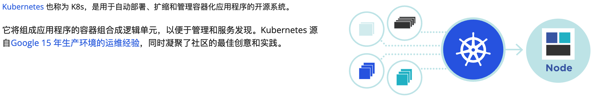
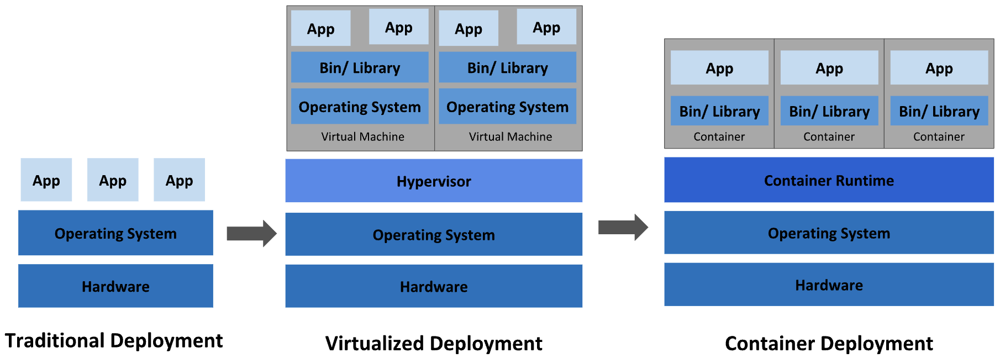
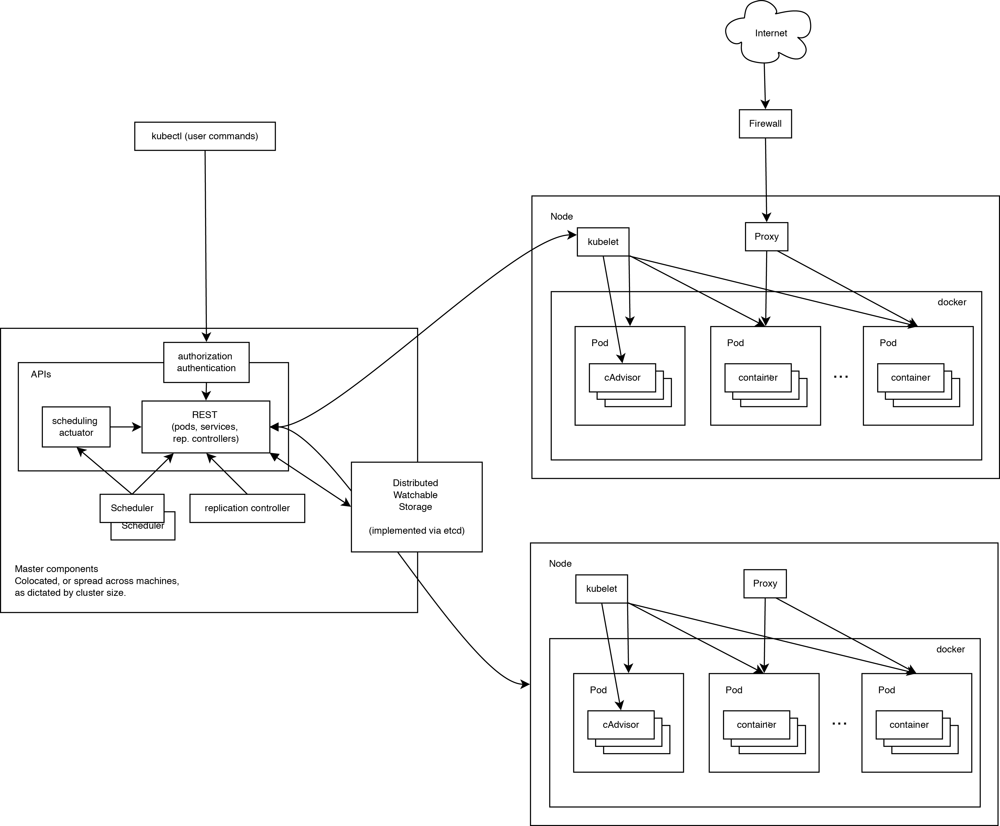

# [Kubernetes](https://kubernetes.io/zh-cn/)

# 第一章 [初识 Kubernetes](https://kubernetes.io/zh-cn/docs/concepts/overview/)

**Kubernetes** 这个名字源于希腊语，意为`舵手`或`飞行员`。k8s 这个缩写是因为 k 和 s 之间有八个字符的关系。 Google 在 2014 年开源了 Kubernetes 项目。 Kubernetes 建立在 [Google 大规模运行生产工作负载十几年经验](https://research.google/pubs/pub43438)的基础上， 结合了社区中最优秀的想法和实践。



Kubernetes 是一个可移植、可扩展的开源平台，用于`管理容器化的工作负载和服务，可促进声明式配置和自动化`。 Kubernetes 拥有一个庞大且快速增长的生态，其服务、支持和工具的使用范围相当广泛。

从 2014 年第一个版本发布以来，Kuberetes 迅速获得开源社区的追捧，包括 Red Hat、VMware 在内的很多有影响力的公司加入到开发和推广的阵营。目前 Kubernetes 已经成为发展最快、市场占有率最高的容器编排引攀产品。

## 2 [为什么需要 k8s](https://kubernetes.io/zh-cn/docs/concepts/overview/)



**传统部署时代：**

早期，各个组织是在物理服务器上运行应用程序。`由于无法限制在物理服务器中运行的应用程序资源使用，因此会导致资源分配问题`。 例如，如果在同一台物理服务器上运行多个应用程序， 则可能会出现一个应用程序占用大部分资源的情况，而导致其他应用程序的性能下降。 `一种解决方案是将每个应用程序都运行在不同的物理服务器上， 但是当某个应用程式资源利用率不高时，剩余资源无法被分配给其他应用程式， 而且维护许多物理服务器的成本很高`。

**虚拟化部署时代：**

因此，虚拟化技术被引入了。虚拟化技术允许你在单个物理服务器的 CPU 上运行多台虚拟机（VM）。 `虚拟化能使应用程序在不同 VM 之间被彼此隔离，且能提供一定程度的安全性， 因为一个应用程序的信息不能被另一应用程序随意访问`。

虚拟化技术能够更好地利用物理服务器的资源，并且因为可轻松地添加或更新应用程序， 而因此可以具有更高的可扩缩性，以及降低硬件成本等等的好处。 通过虚拟化，你可以将一组物理资源呈现为可丢弃的虚拟机集群。

`每个 VM 是一台完整的计算机，在虚拟化硬件之上运行所有组件，包括其自己的操作系统`。

**容器部署时代：**

容器类似于 VM，但是更宽松的隔离特性，使容器之间可以共享操作系统（OS）。 因此，容器比起 VM 被认为是更轻量级的。且与 VM 类似，每个容器都具有自己的文件系统、CPU、内存、进程空间等。 由于它们与基础架构分离，因此可以跨云和 OS 发行版本进行移植。`容器的出现解决了应用和基础环境异构的问题，让应用可以做到一次构建，多次部署`。不可否认容器是打包和运行应用程序的好方式，因此容器方式部署变得流行起来。但随着容器部署流行，仅仅是基于容器的部署仍有一些问题没有解决:

- 生产环境中， 你需要管理运行着应用程序的容器，并确保服务不会下线。 例如，如果一个容器发生故障，则你需要启动另一个容器。
- 高并发时，你需要启动多个应用程序容器为系统提高高可用，并保证多个容器能负载均衡。
- 在维护、升级版本时，你需要将运行应用程序容器从新部署，部署时必须对之前应用容器备份，一旦出现错误，需要手动启动之前容器保证系统运行。

`如果以上行为交由给系统处理，是不是会更容易一些？那么谁能做到这些?`

## 3 [k8s 能做什么?](https://kubernetes.io/zh-cn/docs/concepts/overview/)

这就是 Kubernetes 要来做的事情！ `Kubernetes 为你提供了一个可弹性运行分布式系统的框架`。 Kubernetes 会满足你的扩展要求、故障转移你的应用、提供部署模式等。Kubernetes 为你提供：

- **服务发现和负载均衡**
  Kubernetes 可以使用 DNS 名称或自己的 IP 地址来暴露容器。 如果进入容器的流量很大， Kubernetes 可以负载均衡并分配网络流量，从而使部署稳定。

- **存储编排**
  Kubernetes 允许你自动挂载你选择的存储系统，例如本地存储、公共云提供商等。

- **自动部署和回滚**
  你可以使用 Kubernetes 描述已部署容器的所需状态， 它可以以受控的速率将实际状态更改为期望状态。 例如，你可以自动化 Kubernetes 来为你的部署创建新容器， 删除现有容器并将它们的所有资源用于新容器。

- **自动完成装箱计算/资源调度**
  你为 Kubernetes 提供许多节点组成的集群，在这个集群上运行容器化的任务。 你告诉 Kubernetes 每个容器需要多少 CPU 和内存 (RAM)。 Kubernetes 可以将这些容器按实际情况调度到你的节点上，以最佳方式利用你的资源。

- **自我修复/自愈能力**
  Kubernetes 将重新启动失败的容器、替换容器、杀死不响应用户定义的运行状况检查的容器， 并且在准备好服务之前不将其通告给客户端。

- **密钥与配置管理**
  Kubernetes 允许你存储和管理敏感信息，例如密码、OAuth 令牌和 ssh 密钥。 你可以在不重建容器镜像的情况下部署和更新密钥和应用程序配置，也无需在堆栈配置中暴露密钥。

## 4 k8s 不是什么?

`Kubernetes 不是传统的、包罗万象的 PaaS（平台即服务）系统`。 由于 Kubernetes 是在容器级别运行，而非在硬件级别，它提供了 PaaS 产品共有的一些普遍适用的功能， 例如部署、扩展、负载均衡，允许用户集成他们的日志记录、监控和警报方案。 但是，`Kubernetes 不是单体式（monolithic）系统`，那些默认解决方案都是可选、可插拔的。 Kubernetes 为构建开发人员平台提供了基础，但是在重要的地方保留了用户选择权，能有更高的灵活性。

- 不限制支持的应用程序类型。 Kubernetes 旨在支持极其多种多样的工作负载，包括无状态、有状态和数据处理工作负载。 如果应用程序可以在容器中运行，那么它应该可以在 Kubernetes 上很好地运行。
- 不部署源代码，也不构建你的应用程序。 持续集成（CI）、交付和部署（CI/CD）工作流取决于组织的文化和偏好以及技术要求。
- 不提供应用程序级别的服务作为内置服务，例如中间件（例如消息中间件）、 数据处理框架（例如 Spark）、数据库（例如 MySQL）、缓存、集群存储系统 （例如 Ceph）。这样的组件可以在 Kubernetes 上运行，并且/或者可以由运行在 Kubernetes 上的应用程序通过可移植机制（例如[开放服务代理](https://openservicebrokerapi.org/)）来访问。

- 不是日志记录、监视或警报的解决方案。 它集成了一些功能作为概念证明，并提供了收集和导出指标的机制。
- 不提供也不要求配置用的语言、系统（例如 jsonnet），它提供了声明性 API， 该声明性 API 可以由任意形式的声明性规范所构成。
- 不提供也不采用任何全面的机器配置、维护、管理或自我修复系统。
- 此外，Kubernetes 不仅仅是一个编排系统，实际上它消除了编排的需要。 编排的技术定义是执行已定义的工作流程：首先执行 A，然后执行 B，再执行 C。 而 Kubernetes 包含了一组独立可组合的控制过程，可以连续地将当前状态驱动到所提供的预期状态。 你不需要在乎如何从 A 移动到 C，也不需要集中控制，这使得系统更易于使用且功能更强大、 系统更健壮，更为弹性和可扩展。

----

# 第二章 组件&架构

## 1 集群组件

- 集群 cluster : 将同一个软件服务多个节点组织到一起共同为系统提供服务过程称之为该软件的集群。redis 集群、es集群、mongo 等。
- k8s 集群: 多个节点: 3 个节点  角色:  
  - 1.master 节点/control plane 控制节点
  - 2.work node: 工作节点(pod 容器:应用程序容器)


当部署完 Kubernetes，便拥有了一个完整的集群。一组工作机器，称为节点， 会运行容器化应用程序。`每个集群至少有一个工作节点`。工作节点会`托管 Pod `，而 Pod 就是作为应用负载的组件。 ==控制平面==管理集群中的==工作节点==和==Pod==。


### 1.1 控制平面组件（Control Plane Components）

控制平面组件会为集群做出全局决策，比如`资源的调度。 以及检测和响应集群事件`（例如当不满足部署的 replicas 字段时， 要启动新的 pod）

> 控制平面组件可以在集群中的任何节点上运行。 然而，为了简单起见，设置脚本通常会在同一个计算机上启动所有控制平面组件， 并且不会在此计算机上运行用户容器。

- **kube-apiserver**

  该组件负责公开 Kubernetes API，负责处理接受请求的工作。 API server 是 Kubernetes 控制平面的前端。Kubernetes API 服务器的主要实现是 kube-apiserver。 

  `kube-apiserver` 设计上考虑了水平扩缩，也就是说，它可通过部署多个实例来进行扩缩。 你可以运行 `kube-apiserver` 的多个实例，并在这些实例之间平衡流量。

- **etcd**

  `一致且高度可用的键值存储，用作 Kubernetes 的所有集群数据的后台数据库`。

- **kube-scheduler**

  负责监视新创建的、未指定运行节点的 Pods， 并将 Pods 指派到节点上。调度决策考虑的因素包括单个 Pod 及 Pods 集合的资源需求、软硬件及策略约束、 亲和性及反亲和性规范、数据位置、工作负载间的干扰及最后时限。

- **kube-controller-manager**

  是一个守护进程，内嵌随 K8S 一起发布的核心控制回路。 在机器人和自动化的应用中，控制回路是一个永不休止的循环，用于调节系统状态。 在 K8S 中，每个控制器是一个控制回路，通过 API 服务器监视集群的共享状态， 并尝试进行更改以将当前状态转为期望状态。 这些控制器包括：

  - 节点控制器（Node Controller）：负责在节点出现故障时进行通知和响应
  - 任务控制器（Job Controller）：监测代表一次性任务的 Job 对象，然后创建 Pods 来运行这些任务直至完成
  - 端点分片控制器（EndpointSlice controller）：填充端点分片（EndpointSlice）对象（以提供 Service 和 Pod 之间的链接）。
  - 服务账号控制器（ServiceAccount controller）：为新的命名空间创建默认的服务账号（ServiceAccount）。

- **cloud-controller-manager** (optional 可选)

  一个 K8S 控制平面组件， 嵌入了特定于云平台的控制逻辑。 云控制器管理器（Cloud Controller Manager）允许你将你的集群连接到云提供商的 API 之上， 并将与该云平台交互的组件同与你的集群交互的组件分离开来。`cloud-controller-manager` 仅运行特定于云平台的控制器。 因此如果你在自己的环境中运行 K8S ，或者在本地计算机中运行学习环境， 所部署的集群不需要有云控制器管理器。与 `kube-controller-manager` 类似，`cloud-controller-manager` 将若干逻辑上独立的控制回路组合到同一个可执行文件中， 供你以同一进程的方式运行。 你可以对其执行水平扩容（运行不止一个副本）以提升性能或者增强容错能力。

  下面的控制器都包含对云平台驱动的依赖：

  - 节点控制器（Node Controller）：用于在节点终止响应后检查云提供商以确定节点是否已被删除

  - 路由控制器（Route Controller）：用于在底层云基础架构中设置路由

  - 服务控制器（Service Controller）：用于创建、更新和删除云提供商负载均衡器

### 1.2 运行平面组件

> node节点组件会在每个节点上运行，负责维护运行的 Pod 并提供 Kubernetes 运行环境。

- **kubelet**

  kubelet 会在集群中每个节点（node）上运行。 它保证容器（containers）都运行在 Pods 中。

  kubelet 接收一组通过各类机制提供给它的 PodSpecs， 确保这些 PodSpecs 中描述的容器处于运行状态且健康。 kubelet 不会管理不是由 Kubernetes 创建的容器。

- **kube-proxy**

  kube-proxy是集群中每个节点（node）上所运行的网络代理，维护节点上的一些网络规则，这些网络规则会允许从集群内部或外部的网络会话与 Pod 进行网络通信。可以执行简单的 TCP、UDP 和 SCTP 流转发，或者在一组后端进行 循环 TCP、UDP 和 SCTP 转发。是实现 Kubernetes 服务（Service）概念的一部分。

  如果操作系统提供了可用的数据包过滤层，则 kube-proxy 会通过它来实现网络规则。 否则，kube-proxy 仅做流量转发。

- **容器运行时（Container Runtime）**

  容器运行环境是负责运行容器的软件。K8S支持许多容器运行环境，例如 containerd、 CRI-0、Docker 以及 Kubernetes CRI 的其他任何实现。


### 1.3 插件 (Addons)

- **DNS**

  尽管其他插件都并非严格意义上的必需组件，但几乎所有 Kubernetes 集群都应该有集群 DNS因为很多示例都需要 DNS 服务。

- **Dashboard （仪表盘）**

  Dashboard 是 Kubernetes 集群的通用的、基于 Web 的用户界面。 它使用户可以管理集群中运行的应用程序以及集群本身， 并进行故障排除。

- **容器资源监控**

  容器资源监控将关于容器的一些常见的时间序列度量值保存到一个集中的数据库中， 并提供浏览这些数据的界面。

- **集群层面日志**

  集群层面日志机制负责将容器的日志数据保存到一个集中的日志存储中， 这种集中日志存储提供搜索和浏览接口。

## 2 集群架构详细



- **总结**

  Kubernetes 集群由多个节点组成，节点分为两类：一类是属于管理平面的主节点/控制节点（Master Node）；一类是属于运行平面的工作节点（Worker Node）。显然，复杂的工作肯定都交给控制节点去做了，工作节点负责提供稳定的操作接口和能力抽象即可。

# 词汇表

点击 [[+\]](javascript:void(0)) 下面的指示符号获取特定术语的更为完整的描述。

- **API Group (API 组)**Kubernetes API 中的一组相关路径。[[+\]](javascript:void(0))

- **API 服务器**是 Kubernetes [控制平面](https://kubernetes.io/zh-cn/docs/reference/glossary/?all=true#term-control-plane)的组件， 该组件负责公开了 Kubernetes API，负责处理接受请求的工作。 API 服务器是 Kubernetes 控制平面的前端。 [[+\]](javascript:void(0))

- **CustomResourceDefinition（CRD）**：通过定制化的代码给你的 Kubernetes API 服务器增加资源对象，而无需编译完整的定制 API 服务器。 [[+\]](javascript:void(0))

- **DaemonSet** 确保 [Pod](https://kubernetes.io/zh-cn/docs/concepts/workloads/pods/) 的副本在[集群](https://kubernetes.io/zh-cn/docs/reference/glossary/?all=true#term-cluster)中的一组节点上运行。[[+\]](javascript:void(0))

- **Deployment**管理多副本应用的一种 API 对象，通常通过运行没有本地状态的 Pod 来完成工作。 [[+\]](javascript:void(0))

- **Docker**（这里特指 Docker Engine）是一种可以提供操作系统级别虚拟化 （也称作[容器](https://kubernetes.io/zh-cn/docs/concepts/containers/)）的软件技术。[[+\]](javascript:void(0))

- **Dockershim**是 Kubernetes v1.23 及之前版本中的一个组件。 这个组件使得 [kubelet](https://kubernetes.io/docs/reference/generated/kubelet) 能够与 [Docker Engine](https://docs.docker.com/engine/) 通信。[[+\]](javascript:void(0))

- **Finalizer** Finalizer 是带有命名空间的键，告诉 Kubernetes 等到特定的条件被满足后， 再完全删除被标记为删除的资源。 Finalizer 提醒[控制器](https://kubernetes.io/zh-cn/docs/concepts/architecture/controller/)清理被删除的对象拥有的资源。[[+\]](javascript:void(0))

- **Init 容器（Init Container）**应用[容器](https://kubernetes.io/zh-cn/docs/concepts/containers/)运行前必须先运行完成的一个或多个 Init 容器（Init Container）。[[+\]](javascript:void(0))

- **Job** 是需要运行完成的确定性的或批量的任务。[[+\]](javascript:void(0))

- **kube-controller-manager**[kube-controller-manager](https://kubernetes.io/zh-cn/docs/reference/command-line-tools-reference/kube-controller-manager/) 是[控制平面](https://kubernetes.io/zh-cn/docs/reference/glossary/?all=true#term-control-plane)的组件， 负责运行[控制器](https://kubernetes.io/zh-cn/docs/concepts/architecture/controller/)进程。 [[+\]](javascript:void(0))

- **kube-proxy**[kube-proxy](https://kubernetes.io/zh-cn/docs/reference/command-line-tools-reference/kube-proxy/) 是集群中每个[节点（node）](https://kubernetes.io/zh-cn/docs/concepts/architecture/nodes/)上所运行的网络代理， 实现 Kubernetes [服务（Service）](https://kubernetes.io/zh-cn/docs/concepts/services-networking/service/) 概念的一部分。[[+\]](javascript:void(0))

- **Kubectl**:是使用 Kubernetes API 与 Kubernetes 集群的[控制面](https://kubernetes.io/zh-cn/docs/reference/glossary/?all=true#term-control-plane)进行通信的命令行工具。[[+\]](javascript:void(0))

- **Kubelet**会在集群中每个[节点（node）](https://kubernetes.io/zh-cn/docs/concepts/architecture/nodes/)上运行。 它保证[容器（containers）](https://kubernetes.io/zh-cn/docs/concepts/containers/)都运行在 [Pod](https://kubernetes.io/zh-cn/docs/concepts/workloads/pods/) 中。 [[+\]](javascript:void(0))

- **Kubernetes API**是通过 RESTful 接口提供 Kubernetes 功能服务并负责集群状态存储的应用程序。[[+\]](javascript:void(0))

- **LimitRange**提供约束来限制命名空间中每个 [容器（Containers）](https://kubernetes.io/zh-cn/docs/concepts/containers/) 或 [Pod](https://kubernetes.io/zh-cn/docs/concepts/workloads/pods/) 的资源消耗。[[+\]](javascript:void(0))

- **Master**遗留术语，作为运行 [控制平面](https://kubernetes.io/zh-cn/docs/reference/glossary/?all=true#term-control-plane) 的 [节点](https://kubernetes.io/zh-cn/docs/concepts/architecture/nodes/) 的同义词使用。 [[+\]](javascript:void(0))

- **Minikube**是用来在本地运行 Kubernetes 的一种工具。[[+\]](javascript:void(0))

- **Pod**是 Kubernetes 的原子对象。 Pod 表示你的集群上一组正在运行的[容器（Container）](https://kubernetes.io/zh-cn/docs/concepts/containers/)。[[+\]](javascript:void(0))

- **Pod 安全策略**为 [Pod](https://kubernetes.io/zh-cn/docs/concepts/workloads/pods/) 的创建和更新操作启用细粒度的授权。[[+\]](javascript:void(0))

- **Pod 生命周期**关于 Pod 在其生命周期中处于哪个阶段的更高层次概述。[[+\]](javascript:void(0))

- **QoS 类（QoS Class）** QoS Class（Quality of Service Class）为 Kubernetes 提供了一种将集群中的 Pod 分为几个类并做出有关调度和驱逐决策的方法。[[+\]](javascript:void(0))

- **ReplicaSet**是下一代副本控制器。rs [[+\]](javascript:void(0))

- **ServiceAccount**为在 [Pod](https://kubernetes.io/zh-cn/docs/concepts/workloads/pods/) 中运行的进程提供标识。[[+\]](javascript:void(0))

- **Sidecar Container**：One or more [containers](https://kubernetes.io/docs/concepts/containers/) that are typically started before any app containers run. [[+\]](javascript:void(0))

- **Spec**：Defines how each object, like Pods or Services, should be configured and its desired state.[[+\]](javascript:void(0))

- **StatefulSet**用来管理某 [Pod](https://kubernetes.io/zh-cn/docs/concepts/workloads/pods/) 集合的部署和扩缩， 并为这些 Pod 提供持久存储和持久标识符。 [[+\]](javascript:void(0))

- **UID**：Kubernetes 系统生成的字符串，唯一标识对象。 [[+\]](javascript:void(0))

- **标签（Label）**用来为对象设置可标识的属性标记；这些标记对用户而言是有意义且重要的。[[+\]](javascript:void(0))

- **对象（Object）**Kubernetes 系统中的实体。Kubernetes API 用这些实体表示集群的状态。[[+\]](javascript:void(0))

- **服务（Service）**将运行在一个或一组 [Pod](https://kubernetes.io/zh-cn/docs/concepts/workloads/pods/) 上的网络应用程序公开为网络服务的方法。[[+\]](javascript:void(0))

- **副本（Replica）**单个 [Pod](https://kubernetes.io/zh-cn/docs/concepts/workloads/pods/) 或一组 Pod 的复制拷贝。 Replicas 通过维护多个相同的 Pod 实例保证了高可用性、可扩缩性和容错性。 [[+\]](javascript:void(0))

- **干扰（Disruption）**干扰（Disruption）是指导致一个或者多个 [Pod](https://kubernetes.io/zh-cn/docs/concepts/workloads/pods/) 服务停止的事件。 干扰会影响依赖于受影响的 Pod 的资源，例如 [Deployment](https://kubernetes.io/zh-cn/docs/concepts/workloads/controllers/deployment/)。[[+\]](javascript:void(0))

- **工作负载（Workload）**工作负载是在 Kubernetes 上运行的应用程序。[[+\]](javascript:void(0))

- **混排切片（Shuffle Sharding）**混排切片（Shuffle Sharding）是指一种将请求指派给队列的技术，其隔离性好过对队列个数哈希取模的方式。[[+\]](javascript:void(0))

- **基于角色的访问控制（RBAC）**管理授权决策，允许管理员通过 [Kubernetes API](https://kubernetes.io/zh-cn/docs/concepts/overview/kubernetes-api/) 动态配置访问策略。[[+\]](javascript:void(0))

- **集群（Cluster）**一组工作机器，称为[节点](https://kubernetes.io/zh-cn/docs/concepts/architecture/nodes/)， 会运行容器化应用程序。每个集群至少有一个工作节点。 [[+\]](javascript:void(0))

- **节点（Node）**Kubernetes 中的工作机器称作节点。[[+\]](javascript:void(0))

- **静态 Pod（Static Pod）**由特定节点上的 kubelet 守护进程直接管理的 Pod。 API 服务器不了解它的存在。 静态 Pod 不支持临时容器。 [[+\]](javascript:void(0))

- **镜像（Image）**镜像（Image）是保存的[容器](https://kubernetes.io/zh-cn/docs/concepts/containers/)实例，它打包了应用运行所需的一组软件。[[+\]](javascript:void(0))

- **卷（Volume）**包含可被 Pod 中容器访问的数据的目录。 每个 Kubernetes 卷在所处的 Pod 存在期间保持存在状态。 因此，卷的生命期会超出 Pod 中运行的容器， 并且保证容器重启之后仍保留数据。 更多信息可参考存储 [[+\]](javascript:void(0))

- **控制平面（Control Plane）**控制平面（Control Plane）是指容器编排层，它暴露 API 和接口来定义、 部署容器和管理容器的生命周期。[[+\]](javascript:void(0))

- **控制器（Controller）**在 Kubernetes 中，控制器通过监控[集群](https://kubernetes.io/zh-cn/docs/reference/glossary/?all=true#term-cluster) 的公共状态，并致力于将当前状态转变为期望的状态。 [[+\]](javascript:void(0))

- **控制组（cgroup；control group）**一组具有可选资源隔离、审计和限制的 Linux 进程。[[+\]](javascript:void(0))

- **扩展组件（Extensions）**扩展组件（Extensions）是扩展并与 Kubernetes 深度集成以支持新型硬件的软件组件。[[+\]](javascript:void(0))

- **垃圾收集（Garbage Collection）**垃圾收集（Garbage Collection）是 Kubernetes 用于清理集群资源的各种机制的统称。 [[+\]](javascript:void(0))

- **临时容器（Ephemeral Container）**你可以在 [Pod](https://kubernetes.io/zh-cn/docs/concepts/workloads/pods/) 中临时运行的一种 [容器（Container）](https://kubernetes.io/zh-cn/docs/concepts/containers/) 类型。[[+\]](javascript:void(0))

- **名称（Name）**客户端提供的字符串，引用资源 URL 中的对象，如`/api/v1/pods/some name`。[[+\]](javascript:void(0))

- **名字空间（Namespace）**名字空间是 Kubernetes 用来支持隔离单个 [集群](https://kubernetes.io/zh-cn/docs/reference/glossary/?all=true#term-cluster)中的资源组的一种抽象。[[+\]](javascript:void(0))

- **亲和性（Affinity）**在 Kubernetes 中 **亲和性（affinity）** 是一组规则，它们为调度程序提供在何处放置 Pod 提示信息。[[+\]](javascript:void(0))

- **清单（Manifest）**JSON 或 YAML 格式的 Kubernetes API 对象规范。[[+\]](javascript:void(0))

- **日志（Logging）**日志是 [集群（cluster）](https://kubernetes.io/zh-cn/docs/reference/glossary/?all=true#term-cluster) 或应用程序记录的事件列表。 [[+\]](javascript:void(0))

- **容器（Container）**容器是可移植、可执行的轻量级的镜像，包含其中的软件及其相关依赖。[[+\]](javascript:void(0))

- **容器环境变量（Container Environment Variables）**容器环境变量提供了 name=value 形式的、在 [Pod](https://kubernetes.io/zh-cn/docs/concepts/workloads/pods/) 中运行的容器所必须的一些重要信息。[[+\]](javascript:void(0))

- **容器运行时（Container Runtime）**这个基础组件使 Kubernetes 能够有效运行容器。 它负责管理 Kubernetes 环境中容器的执行和生命周期。[[+\]](javascript:void(0))

- **容器运行时接口（Container Runtime Interface；CRI）**容器运行时接口（Container Runtime Interface；CRI）是一组让容器运行时与节点上 [kubelet](https://kubernetes.io/docs/reference/generated/kubelet) 集成的 API。 [[+\]](javascript:void(0))

- **容忍度（Toleration）**容忍度是一种核心对象，包含三个必需的属性：key、value 和 effect。容忍度允许将 Pod 调度到具有对应[污点](https://kubernetes.io/zh-cn/docs/concepts/scheduling-eviction/taint-and-toleration/)的节点或节点组上。[[+\]](javascript:void(0))

- **设备插件（Device Plugin）**设备插件在工作[节点](https://kubernetes.io/zh-cn/docs/concepts/architecture/nodes/)上运行并为 [Pod](https://kubernetes.io/zh-cn/docs/concepts/workloads/pods/) 提供访问资源的能力， 例如：本地硬件这类资源需要特定于供应商的初始化或安装步骤。[[+\]](javascript:void(0))

- **事件（Event）**事件（Event）是描述系统状态变化以及需要注意的事情的 Kubernetes 对象。[[+\]](javascript:void(0))

- **数据平面（Data Plane）**提供诸如 CPU、内存、网络和存储的能力，以便容器可以运行并连接到网络。 [[+\]](javascript:void(0))

- **特性门控（Feature gate）**特性门控是一组键（非透明的字符串值），你可以用它来控制在你的集群中启用哪些 Kubernetes 特性。[[+\]](javascript:void(0))

- **污点（Taint）**污点是一种核心对象，包含三个必需的属性：key、value 和 effect。 污点会阻止在[节点](https://kubernetes.io/zh-cn/docs/concepts/architecture/nodes/)或节点组上调度 [Pod](https://kubernetes.io/zh-cn/docs/concepts/workloads/pods/)。 [[+\]](javascript:void(0))

- **选择算符（Selector）**选择算符允许用户通过[标签（labels）](https://kubernetes.io/zh-cn/docs/concepts/overview/working-with-objects/labels/)对一组资源对象进行筛选过滤。[[+\]](javascript:void(0))

- **应用（Applications）**各种容器化应用运行所在的层。 [[+\]](javascript:void(0))

- **注解（Annotation）**注解是以键值对的形式给资源对象附加随机的无法标识的元数据。[[+\]](javascript:void(0))

- **资源配额（Resource Quotas）**资源配额提供了限制每个 [命名空间](https://kubernetes.io/zh-cn/docs/concepts/overview/working-with-objects/namespaces/) 的资源消耗总和的约束。[[+\]](javascript:void(0))


# 自动扩缩工作负载

在 Kubernetes 中，你可以根据当前的资源需求**扩缩**工作负载。 这让你的集群可以更灵活、更高效地面对资源需求的变化。

**水平扩缩**：增加或减少工作负载所管理的副本数量。

**垂直扩缩**：调整副本的可用资源。CPU or RAM

扩缩工作负载有手动和自动两种方式，这取决于你的使用情况。

## 手动扩缩工作负载

Kubernetes 支持工作负载的手动扩缩。水平扩缩可以使用 `kubectl` 命令行工具完成。 对于垂直扩缩，你需要**更新**工作负载的资源定义。这两种策略的示例见下文。

- **水平扩缩**：[运行应用程序的多个实例](https://kubernetes.io/docs/tutorials/kubernetes-basics/scale/scale-intro/)
- **垂直扩缩**：[调整分配给容器的 CPU 和内存资源](https://kubernetes.io/docs/tasks/configure-pod-container/resize-container-resources)

## 自动扩缩工作负载

Kubernetes 也支持工作负载的**自动扩缩**，这也是本页的重点。

在 Kubernetes 中**自动扩缩**的概念是指自动更新管理一组 Pod 的能力（例如 [Deployment](https://kubernetes.io/zh-cn/docs/concepts/workloads/controllers/deployment/)）。

### 水平扩缩工作负载

在 Kubernetes 中，你可以使用 HorizontalPodAutoscaler (HPA) 实现工作负载的自动水平扩缩。

它以 Kubernetes API 资源和[控制器](https://kubernetes.io/zh-cn/docs/concepts/architecture/controller/)的方式实现， 并定期调整工作负载中[副本](https://kubernetes.io/zh-cn/docs/reference/glossary/?all=true#term-replica)的数量 以满足设置的资源利用率，如 CPU 或内存利用率。

这是一个为 Deployment 部署配置 HorizontalPodAutoscaler 的[示例教程](https://kubernetes.io/docs/tasks/run-application/horizontal-pod-autoscale-walkthrough)。

### 垂直扩缩工作负载

你可以使用 VerticalPodAutoscaler (VPA) 实现工作负载的垂直扩缩。 不同于 HPA，VPA 并非默认来源于 Kubernetes，而是一个独立的项目， 参见 [on GitHub](https://github.com/kubernetes/autoscaler/tree/9f87b78df0f1d6e142234bb32e8acbd71295585a/vertical-pod-autoscaler)。

安装后，你可以为工作负载创建 [CustomResourceDefinitions](https://kubernetes.io/zh-cn/docs/tasks/extend-kubernetes/custom-resources/custom-resource-definitions/)(CRDs)， 定义**如何**以及**何时**扩缩被管理副本的资源。

> **说明：**你需要在集群中安装 [Metrics Server](https://github.com/kubernetes-sigs/metrics-server)，这样，你的 HPA 才能正常工作。

目前，VPA 可以有四种不同的运行模式：

| 模式       | 描述                                                         |
| :--------- | :----------------------------------------------------------- |
| `Auto`     | 目前是 `Recreate`，将来可能改为就地更新                      |
| `Recreate` | VPA 会在创建 Pod 时分配资源请求，并且当请求的资源与新的建议值区别很大时通过驱逐 Pod 的方式来更新现存的 Pod |
| `Initial`  | VPA 只有在创建时分配资源请求，之后不做更改                   |
| `Off`      | VPA 不会自动更改 Pod 的资源需求，建议值仍会计算并可在 VPA 对象中查看 |

#### 就地调整的要求

在**不**重启 [Pod](https://kubernetes.io/zh-cn/docs/concepts/workloads/pods/) 或其中[容器](https://kubernetes.io/zh-cn/docs/concepts/containers/)就地调整工作负载的情况下要求 Kubernetes 版本大于 1.27。 此外，特性门控 `InPlaceVerticalScaling` 需要开启。

`InPlacePodVerticalScaling`：启用就地 Pod 垂直扩缩。

### 根据集群规模自动扩缩

对于需要根据集群规模实现扩缩的工作负载（例如：`cluster-dns` 或者其他系统组件）， 你可以使用 [Cluster Proportional Autoscaler](https://github.com/kubernetes-sigs/cluster-proportional-autoscaler)。 与 VPA 一样，这个项目不是 Kubernetes 核心项目的一部分，它在 GitHub 上有自己的项目。

集群弹性伸缩器 (Cluster Proportional Autoscaler) 会观测可调度 [节点](https://kubernetes.io/zh-cn/docs/concepts/architecture/nodes/) 和 内核数量， 并调整目标工作负载的副本数量。

如果副本的数量需要保持一致，你可以使用 [Cluster Proportional Vertical Autoscaler](https://github.com/kubernetes-sigs/cluster-proportional-vertical-autoscaler) 来根据集群规模进行垂直扩缩。 这个项目目前处于 **beta** 阶段，你可以在 GitHub 上找到它。

集群弹性伸缩器会扩缩工作负载的副本数量，垂直集群弹性伸缩器 (Cluster Proportional Vertical Autoscaler) 会根据节点和/或核心的数量 调整工作负载的资源请求（例如 Deployment 和 DaemonSet）。

### 事件驱动型自动扩缩

通过事件驱动实现工作负载的扩缩也是可行的， 例如使用 [Kubernetes Event Driven Autoscaler (**KEDA**)](https://keda.sh/)。

KEDA 是 CNCF 的毕业项目，能让你根据要处理事件的数量对工作负载进行扩缩，例如队列中消息的数量。 有多种针对不同事件源的适配可供选择。

### 根据计划自动扩缩

扩缩工作负载的另一种策略是**计划**进行扩缩，例如在非高峰时段减少资源消耗。

与事件驱动型自动扩缩相似，这种行为可以使用 KEDA 和 [`Cron` scaler](https://keda.sh/docs/2.13/scalers/cron/) 实现。 你可以在计划扩缩器 (Cron scaler) 中定义计划来实现工作负载的横向扩缩。

## 扩缩集群基础设施

如果扩缩工作负载无法满足你的需求，你也可以扩缩集群基础设施本身。

扩缩集群基础设施通常是指增加或移除[节点](https://kubernetes.io/zh-cn/docs/concepts/architecture/nodes/)。


# [Kubernetes 对象](https://kubernetes.io/zh-cn/docs/concepts/overview/working-with-objects/)

本页说明了在 Kubernetes API 中是如何表示 Kubernetes 对象的， 以及如何使用 `.yaml` 格式的文件表示 Kubernetes 对象。

## 理解 Kubernetes 对象

在 Kubernetes 系统中，**Kubernetes 对象**是持久化的实体。 Kubernetes 使用这些实体去表示整个集群的状态。它们描述了如下信息：

- 哪些容器化应用正在运行（以及在哪些节点上运行）
- 可以被应用使用的资源
- 关于应用运行时行为的策略，比如重启策略、升级策略以及容错策略

Kubernetes 对象是一种“意向表达（Record of Intent）”。一旦创建该对象， Kubernetes 系统将不断工作以确保该对象存在。通过创建对象，你本质上是在告知 Kubernetes 系统，你想要的集群工作负载状态看起来应是什么样子的， 这就是 Kubernetes 集群所谓的**期望状态（Desired State）**。

操作 Kubernetes 对象 —— 无论是创建、修改或者删除 —— 需要使用 [Kubernetes API](https://kubernetes.io/zh-cn/docs/concepts/overview/kubernetes-api)。 比如，当使用 `kubectl` 命令行接口（CLI）时，CLI 会调用必要的 Kubernetes API； 也可以在程序中使用[客户端库](https://kubernetes.io/zh-cn/docs/reference/using-api/client-libraries/)， 来直接调用 Kubernetes API。

### 对象规约（Spec）与状态（Status）

几乎每个 Kubernetes 对象包含两个嵌套的对象字段，它们负责管理对象的配置： 对象 **`spec`（规约）** 和对象 **`status`（状态）**。 对于具有 `spec` 的对象，你必须在创建对象时设置其内容，描述你希望对象所具有的特征： **期望状态（Desired State）**。

`status` 描述了对象的**当前状态（Current State）**，它是由 Kubernetes 系统和组件设置并更新的。在任何时刻，Kubernetes [控制平面](https://kubernetes.io/zh-cn/docs/reference/glossary/?all=true#term-control-plane) 都一直在积极地管理着对象的实际状态，以使之达成期望状态。

例如，Kubernetes 中的 Deployment 对象能够表示运行在集群中的应用。 当创建 Deployment 时，你可能会设置 Deployment 的 `spec`，指定该应用要有 3 个副本运行。 Kubernetes 系统读取 Deployment 的 `spec`， 并启动我们所期望的应用的 3 个实例 —— 更新状态以与规约相匹配。 如果这些实例中有的失败了（一种状态变更），Kubernetes 系统会通过执行修正操作来响应 `spec` 和 `status` 间的不一致 —— 意味着它会启动一个新的实例来替换。

关于对象 spec、status 和 metadata 的更多信息，可参阅 [Kubernetes API 约定](https://git.k8s.io/community/contributors/devel/sig-architecture/api-conventions.md)。

### 描述 Kubernetes 对象

创建 Kubernetes 对象时，必须提供对象的 `spec`，用来描述该对象的期望状态， 以及关于对象的一些基本信息（例如名称）。 当使用 Kubernetes API 创建对象时（直接创建或经由 `kubectl` 创建）， API 请求必须在请求主体中包含 JSON 格式的信息。 大多数情况下，你会通过 **清单（Manifest)** 文件为 `kubectl` 提供这些信息。 按照惯例，清单是 YAML 格式的（你也可以使用 JSON 格式）。 像 `kubectl` 这样的工具在通过 HTTP 进行 API 请求时， 会将清单中的信息转换为 JSON 或其他受支持的序列化格式。

这里有一个清单示例文件，展示了 Deployment 的必需字段和对象 `spec`：application/deployment.yaml

```yaml
apiVersion: apps/v1
kind: Deployment
metadata:
  name: nginx-deployment
spec:
  selector:
    matchLabels:
      app: nginx
  replicas: 2 # 告知 Deployment 运行 2 个与该模板匹配的 Pod
  template:
    metadata:
      labels:
        app: nginx
    spec:
      containers:
      - name: nginx
        image: nginx:1.14.2
        ports:
        - containerPort: 80
```

与上面使用清单文件来创建 Deployment 类似，另一种方式是使用 `kubectl` 命令行接口（CLI）的 [`kubectl apply`](https://kubernetes.io/docs/reference/generated/kubectl/kubectl-commands#apply) 命令， 将 `.yaml` 文件作为参数。下面是一个示例：

```shell
kubectl apply -f https://k8s.io/examples/application/deployment.yaml
```

输出类似下面这样：

```
deployment.apps/nginx-deployment created
```

### 必需字段

在想要创建的 Kubernetes 对象所对应的清单（YAML 或 JSON 文件）中，需要配置的字段如下：

- `apiVersion` - 创建该对象所使用的 Kubernetes API 的版本
- `kind` - 想要创建的对象的类别
- `metadata` - 帮助唯一标识对象的一些数据，包括一个 `name` 字符串、`UID` 和可选的 `namespace`
- `spec` - 你所期望的该对象的状态

对每个 Kubernetes 对象而言，其 `spec` 之精确格式都是不同的，包含了特定于该对象的嵌套字段。 [Kubernetes API 参考](https://kubernetes.io/zh-cn/docs/reference/kubernetes-api/)可以帮助你找到想要使用 Kubernetes 创建的所有对象的规约格式。

例如，参阅 Pod API 参考文档中 [`spec` 字段](https://kubernetes.io/zh-cn/docs/reference/kubernetes-api/workload-resources/pod-v1/#PodSpec)。 对于每个 Pod，其 `.spec` 字段设置了 Pod 及其期望状态（例如 Pod 中每个容器的容器镜像名称）。 另一个对象规约的例子是 StatefulSet API 中的 [`spec` 字段](https://kubernetes.io/zh-cn/docs/reference/kubernetes-api/workload-resources/stateful-set-v1/#StatefulSetSpec)。 对于 StatefulSet 而言，其 `.spec` 字段设置了 StatefulSet 及其期望状态。 在 StatefulSet 的 `.spec` 内，有一个为 Pod 对象提供的[模板](https://kubernetes.io/zh-cn/docs/concepts/workloads/pods/#pod-templates)。 该模板描述了 StatefulSet 控制器为了满足 StatefulSet 规约而要创建的 Pod。 不同类型的对象可以有不同的 `.status` 信息。API 参考页面给出了 `.status` 字段的详细结构， 以及针对不同类型 API 对象的具体内容。

> **说明：**：请查看[配置最佳实践](https://kubernetes.io/zh-cn/docs/concepts/configuration/overview/)来获取有关编写 YAML 配置文件的更多信息。

## 服务器端字段验证

从 Kubernetes v1.25 开始，API 服务器提供了服务器端[字段验证](https://kubernetes.io/zh-cn/docs/reference/using-api/api-concepts/#field-validation)， 可以检测对象中未被识别或重复的字段。它在服务器端提供了 `kubectl --validate` 的所有功能。

`kubectl` 工具使用 `--validate` 标志来设置字段验证级别。它接受值 `ignore`、`warn` 和 `strict`，同时还接受值 `true`（等同于 `strict`）和 `false`（等同于 `ignore`）。`kubectl` 的默认验证设置为 `--validate=true`。

- `Strict`：严格的字段验证，验证失败时会报错

- `Warn`：执行字段验证，但错误会以警告形式提供而不是拒绝请求

- `Ignore`：不执行服务器端字段验证

当 `kubectl` 无法连接到支持字段验证的 API 服务器时，它将回退为使用客户端验证。 Kubernetes 1.27 及更高版本始终提供字段验证；较早的 Kubernetes 版本可能没有此功能。 如果你的集群版本低于 v1.27，可以查阅适用于你的 Kubernetes 版本的文档。

# [Kubernetes 组件](https://kubernetes.io/zh-cn/docs/concepts/overview/components/)


# [Kubernetes API](https://kubernetes.io/zh-cn/docs/concepts/overview/kubernetes-api/)

Kubernetes [控制面](https://kubernetes.io/zh-cn/docs/reference/glossary/?all=true#term-control-plane)的核心是 [API 服务器](https://kubernetes.io/zh-cn/docs/concepts/overview/components/#kube-apiserver)。 API 服务器负责提供 HTTP API，以供用户、集群中的不同部分和集群外部组件相互通信。

Kubernetes API 使你可以在 Kubernetes 中查询和操纵 API 对象 （例如 Pod、Namespace、ConfigMap 和 Event）的状态。

大部分操作都可以通过 [kubectl](https://kubernetes.io/zh-cn/docs/reference/kubectl/) 命令行接口或类似 [kubeadm](https://kubernetes.io/zh-cn/docs/reference/setup-tools/kubeadm/) 这类命令行工具来执行， 这些工具在背后也是调用 API。不过，你也可以使用 REST 调用来访问这些 API。 Kubernetes 为那些希望使用 Kubernetes API 编写应用的开发者提供一组[客户端库](https://kubernetes.io/zh-cn/docs/reference/using-api/client-libraries/)。


# Kubeadm命令

Kubeadm 是一个提供了 `kubeadm init` 和 `kubeadm join` 的工具， 作为创建 Kubernetes 集群的 “快捷途径” 的最佳实践。

kubeadm 通过执行必要的操作来启动和运行最小可用集群。 按照设计，它只关注启动引导，而非配置机器。同样的， 安装各种 “锦上添花” 的扩展，例如 Kubernetes Dashboard、 监控方案、以及特定云平台的扩展，都不在讨论范围内。

相反，我们希望在 kubeadm 之上构建更高级别以及更加合规的工具， 理想情况下，使用 kubeadm 作为所有部署工作的基准将会更加易于创建一致性集群。

## 如何安装

要安装 kubeadm, 请查阅 [安装指南](https://kubernetes.io/zh-cn/docs/setup/production-environment/tools/kubeadm/install-kubeadm/).

## 接下来

- [kubeadm init](https://kubernetes.io/zh-cn/docs/reference/setup-tools/kubeadm/kubeadm-init) 用于搭建控制平面节点
- [kubeadm join](https://kubernetes.io/zh-cn/docs/reference/setup-tools/kubeadm/kubeadm-join) 用于搭建工作节点并将其加入到集群中
- [kubeadm upgrade](https://kubernetes.io/zh-cn/docs/reference/setup-tools/kubeadm/kubeadm-upgrade) 用于升级 Kubernetes 集群到新版本
- [kubeadm config](https://kubernetes.io/zh-cn/docs/reference/setup-tools/kubeadm/kubeadm-config) 如果你使用了 v1.7.x 或更低版本的 kubeadm 版本初始化你的集群，则使用 `kubeadm upgrade` 来配置你的集群
- [kubeadm token](https://kubernetes.io/zh-cn/docs/reference/setup-tools/kubeadm/kubeadm-token) 用于管理 `kubeadm join` 使用的令牌
- [kubeadm reset](https://kubernetes.io/zh-cn/docs/reference/setup-tools/kubeadm/kubeadm-reset) 用于恢复通过 `kubeadm init` 或者 `kubeadm join` 命令对节点进行的任何变更
- [kubeadm certs](https://kubernetes.io/zh-cn/docs/reference/setup-tools/kubeadm/kubeadm-certs) 用于管理 Kubernetes 证书
- [kubeadm kubeconfig](https://kubernetes.io/zh-cn/docs/reference/setup-tools/kubeadm/kubeadm-kubeconfig) 用于管理 kubeconfig 文件
- [kubeadm version](https://kubernetes.io/zh-cn/docs/reference/setup-tools/kubeadm/kubeadm-version) 用于打印 kubeadm 的版本信息
- [kubeadm alpha](https://kubernetes.io/zh-cn/docs/reference/setup-tools/kubeadm/kubeadm-alpha) 用于预览一组可用于收集社区反馈的特性


# kubectl 快速参考

kubectl 是 Kubernetes CLI 版本的瑞士军刀，可以胜任多种多样的任务。

[kubectl 子命令|  reference详细参考](https://kubernetes.io/docs/reference/kubectl/generated/)

> **说明：**：这些指令适用于 Kubernetes v1.30。要检查版本，请使用 `kubectl version` 命令。

## Kubectl 上下文和配置

设置 `kubectl` 与哪个 Kubernetes 集群进行通信并修改配置信息。 查看[使用 kubeconfig 跨集群授权访问](https://kubernetes.io/zh-cn/docs/tasks/access-application-cluster/configure-access-multiple-clusters/) 文档获取配置文件详细信息。

```bash
kubectl config view # 显示合并的 kubeconfig 配置
```

## Kubectl apply

`apply` 通过定义 Kubernetes 资源的文件来管理应用。 它通过运行 `kubectl apply` 在集群中创建和更新资源。 这是在生产中管理 Kubernetes 应用的推荐方法。 参见 [Kubectl 文档](https://kubectl.docs.kubernetes.io/zh/)。

## 创建对象

Kubernetes 配置可以用 YAML 或 JSON 定义。可以使用的文件扩展名有 `.yaml`、`.yml` 和 `.json`。

```bash
kubectl apply -f ./my-manifest.yaml                  # 创建资源
kubectl apply -f ./my1.yaml -f ./my2.yaml            # 使用多个文件创建
kubectl apply -f ./dir                               # 基于目录下的所有清单文件创建资源
kubectl apply -f https://example.com/manifest.yaml   # 从 URL 中创建资源（注意：这是一个示例域名，不包含有效的清单）
kubectl create deployment nginx --image=nginx        # 启动单实例 nginx

# 创建一个打印 “Hello World” 的 Job
kubectl create job hello --image=busybox:1.28 -- echo "Hello World" 

# 创建一个打印 “Hello World” 间隔 1 分钟的 CronJob
kubectl create cronjob hello --image=busybox:1.28   --schedule="*/1 * * * *" -- echo "Hello World"    

kubectl explain pods # 获取 Pod 的文档说明

# 从标准输入创建多个 YAML 对象
kubectl apply -f - <<EOF
apiVersion: v1
kind: Pod
metadata:
  name: busybox-sleep
spec:
  containers:
  - name: busybox
    image: busybox:1.28
    args:
    - sleep
    - "1000000"
---
apiVersion: v1
kind: Pod
metadata:
  name: busybox-sleep-less
spec:
  containers:
  - name: busybox
    image: busybox:1.28
    args:
    - sleep
    - "1000"
EOF

# 创建有多个 key 的 Secret
kubectl apply -f - <<EOF
apiVersion: v1
kind: Secret
metadata:
  name: mysecret
type: Opaque
data:
  password: $(echo -n "s33msi4" | base64 -w0)
  username: $(echo -n "jane" | base64 -w0)
EOF
```

## 查看和查找资源

```bash
# get 命令的基本输出
kubectl get services                          # 列出当前命名空间下的所有 Service
kubectl get pods --all-namespaces             # 列出所有命名空间下的全部的 Pod
kubectl get pods -o wide                      # 列出当前命名空间下的全部 Pod 并显示更详细的信息
kubectl get deployment my-dep                 # 列出某个特定的 Deployment
kubectl get pods                              # 列出当前命名空间下的全部 Pod
kubectl get pod my-pod -o yaml                # 获取一个 Pod 的 YAML

# describe 命令的详细输出
kubectl describe nodes my-node
kubectl describe pods my-pod

# 列出当前名字空间下所有 Service，按名称排序
kubectl get services --sort-by=.metadata.name

# 列出 Pod，按重启次数排序
kubectl get pods --sort-by='.status.containerStatuses[0].restartCount'

# 列举所有 PV 持久卷，按容量排序
kubectl get pv --sort-by=.spec.capacity.storage

# 获取包含 app=cassandra 标签的所有 Pod 的 version 标签
kubectl get pods --selector=app=cassandra -o jsonpath='{.items[*].metadata.labels.version}'

# 检索带有 “.” 键值，例如 'ca.crt'
kubectl get configmap myconfig -o jsonpath='{.data.ca\.crt}'

# 检索一个 base64 编码的值，其中的键名应该包含减号而不是下划线
kubectl get secret my-secret --template='{{index .data "key-name-with-dashes"}}'

# 获取所有工作节点（使用选择算符以排除标签名称为 'node-role.kubernetes.io/control-plane' 的结果）
kubectl get node --selector='!node-role.kubernetes.io/control-plane'

# 获取当前命名空间中正在运行的 Pod
kubectl get pods --field-selector=status.phase=Running

# 获取全部节点的 ExternalIP 地址
kubectl get nodes -o jsonpath='{.items[*].status.addresses[?(@.type=="ExternalIP")].address}'

# 列出属于某个特定 RC 的 Pod 的名称
# 在转换对于 jsonpath 过于复杂的场合，"jq" 命令很有用；可以在 https://jqlang.github.io/jq/ 找到它
sel=${$(kubectl get rc my-rc --output=json | jq -j '.spec.selector | to_entries | .[] | "\(.key)=\(.value),"')%?}
echo $(kubectl get pods --selector=$sel --output=jsonpath={.items..metadata.name})

# 显示所有 Pod 的标签（或任何其他支持标签的 Kubernetes 对象）
kubectl get pods --show-labels

# 检查哪些节点处于就绪状态
JSONPATH='{range .items[*]}{@.metadata.name}:{range @.status.conditions[*]}{@.type}={@.status};{end}{end}' \
 && kubectl get nodes -o jsonpath="$JSONPATH" | grep "Ready=True"
 
# 使用自定义列检查哪些节点处于就绪状态
kubectl get node -o custom-columns='NODE_NAME:.metadata.name,STATUS:.status.conditions[?(@.type=="Ready")].status'

# 不使用外部工具来输出解码后的 Secret
kubectl get secret my-secret -o go-template='{{range $k,$v := .data}}{{"### "}}{{$k}}{{"\n"}}{{$v|base64decode}}{{"\n\n"}}{{end}}'

# 列出被一个 Pod 使用的全部 Secret
kubectl get pods -o json | jq '.items[].spec.containers[].env[]?.valueFrom.secretKeyRef.name' | grep -v null | sort | uniq

# 列举所有 Pod 中初始化容器的容器 ID（containerID）
# 可用于在清理已停止的容器时避免删除初始化容器
kubectl get pods --all-namespaces -o jsonpath='{range .items[*].status.initContainerStatuses[*]}{.containerID}{"\n"}{end}' | cut -d/ -f3

# 列出事件（Event），按时间戳排序
kubectl get events --sort-by=.metadata.creationTimestamp

# 列出所有警告事件
kubectl events --types=Warning

# 比较当前的集群状态和假定某清单被应用之后的集群状态
kubectl diff -f ./my-manifest.yaml

# 生成一个句点分隔的树，其中包含为节点返回的所有键
# 在复杂的嵌套JSON结构中定位键时非常有用
kubectl get nodes -o json | jq -c 'paths|join(".")'

# 生成一个句点分隔的树，其中包含为 Pod 等返回的所有键
kubectl get pods -o json | jq -c 'paths|join(".")'

# 假设你的 Pod 有默认的容器和默认的名字空间，并且支持 'env' 命令，可以使用以下脚本为所有 Pod 生成 ENV 变量。
# 该脚本也可用于在所有的 Pod 里运行任何受支持的命令，而不仅仅是 'env'。
for pod in $(kubectl get po --output=jsonpath={.items..metadata.name}); do echo $pod && kubectl exec -it $pod -- env; done

# 获取一个 Deployment 的 status 子资源
kubectl get deployment nginx-deployment --subresource=status
```

## 更新资源

```bash
kubectl set image deployment/frontend www=image:v2           # 滚动更新 "frontend" Deployment 的 "www" 容器镜像
kubectl rollout history deployment/frontend                  # 查看 Deployment 的历史记录，包括版本
kubectl rollout undo deployment/frontend                     # 回滚到上次部署版本
kubectl rollout undo deployment/frontend --to-revision=2     # 回滚到特定部署版本
kubectl rollout status -w deployment/frontend                # 监视 "frontend" Deployment 的滚动升级状态直到完成
kubectl rollout restart deployment/frontend                  # 轮替重启 "frontend" Deployment

cat pod.json | kubectl replace -f -                          # 通过传入到标准输入的 JSON 来替换 Pod

# 强制替换，删除后重建资源。会导致服务不可用。
kubectl replace --force -f ./pod.json

# 为多副本的 nginx 创建服务，使用 80 端口提供服务，连接到容器的 8000 端口
kubectl expose rc nginx --port=80 --target-port=8000

# 将某单容器 Pod 的镜像版本（标签）更新到 v4
kubectl get pod mypod -o yaml | sed 's/\(image: myimage\):.*$/\1:v4/' | kubectl replace -f -

kubectl label pods my-pod new-label=awesome                      # 添加标签
kubectl label pods my-pod new-label-                             # 移除标签
kubectl label pods my-pod new-label=new-value --overwrite        # 覆盖现有的值
kubectl annotate pods my-pod icon-url=http://goo.gl/XXBTWq       # 添加注解
kubectl annotate pods my-pod icon-url-                           # 移除注解
kubectl autoscale deployment foo --min=2 --max=10                # 对 "foo" Deployment 自动扩缩容
```

## 部分更新资源

```bash
# 部分更新某节点
kubectl patch node k8s-node-1 -p '{"spec":{"unschedulable":true}}'

# 更新容器的镜像；spec.containers[*].name 是必需的。因为它是一个合并性质的主键。
kubectl patch pod valid-pod -p '{"spec":{"containers":[{"name":"kubernetes-serve-hostname","image":"new image"}]}}'

# 使用带位置数组的 JSON patch 更新容器的镜像
kubectl patch pod valid-pod --type='json' -p='[{"op": "replace", "path": "/spec/containers/0/image", "value":"new image"}]'

# 使用带位置数组的 JSON patch 禁用某 Deployment 的 livenessProbe
kubectl patch deployment valid-deployment  --type json   -p='[{"op": "remove", "path": "/spec/template/spec/containers/0/livenessProbe"}]'

# 在带位置数组中添加元素
kubectl patch sa default --type='json' -p='[{"op": "add", "path": "/secrets/1", "value": {"name": "whatever" } }]'

# 通过修正 scale 子资源来更新 Deployment 的副本数
kubectl patch deployment nginx-deployment --subresource='scale' --type='merge' -p '{"spec":{"replicas":2}}'
```

## 编辑资源

使用你偏爱的编辑器编辑 API 资源。

```bash
kubectl edit svc/docker-registry                      # 编辑名为 docker-registry 的服务
KUBE_EDITOR="nano" kubectl edit svc/docker-registry   # 使用其他编辑器
```

## 对资源进行扩缩

```bash
kubectl scale --replicas=3 rs/foo                                 # 将名为 'foo' 的副本集扩缩到 3 副本
kubectl scale --replicas=3 -f foo.yaml                            # 将在 "foo.yaml" 中的特定资源扩缩到 3 个副本
kubectl scale --current-replicas=2 --replicas=3 deployment/mysql  # 如果名为 mysql 的 Deployment 的副本当前是 2，那么将它扩缩到 3
kubectl scale --replicas=5 rc/foo rc/bar rc/baz                   # 扩缩多个副本控制器
```

## 删除资源

```bash
kubectl delete -f ./pod.json                                  # 删除在 pod.json 中指定的类型和名称的 Pod
kubectl delete pod unwanted --now                             # 删除 Pod 且无宽限期限（无优雅时段）
kubectl delete pod,service baz foo                            # 删除名称为 "baz" 和 "foo" 的 Pod 和服务
kubectl delete pods,services -l name=myLabel                  # 删除包含 name=myLabel 标签的 Pod 和服务
kubectl -n my-ns delete pod,svc --all                         # 删除在 my-ns 名字空间中全部的 Pod 和服务
# 删除所有与 pattern1 或 pattern2 awk 模式匹配的 Pod
kubectl get pods  -n mynamespace --no-headers=true | awk '/pattern1|pattern2/{print $1}' | xargs  kubectl delete -n mynamespace pod
```

## 与运行中的 Pod 进行交互

```bash
kubectl logs my-pod                                 # 获取 Pod 日志（标准输出）
kubectl logs -l name=myLabel                        # 获取含 name=myLabel 标签的 Pod 的日志（标准输出）
kubectl logs my-pod --previous                      # 获取上个容器实例的 Pod 日志（标准输出）
kubectl logs my-pod -c my-container                 # 获取 Pod 容器的日志（标准输出, 多容器场景）
kubectl logs -l name=myLabel -c my-container        # 获取含 name=myLabel 标签的 Pod 容器日志（标准输出, 多容器场景）
kubectl logs my-pod -c my-container --previous      # 获取 Pod 中某容器的上个实例的日志（标准输出, 多容器场景）
kubectl logs -f my-pod                              # 流式输出 Pod 的日志（标准输出）
kubectl logs -f my-pod -c my-container              # 流式输出 Pod 容器的日志（标准输出, 多容器场景）
kubectl logs -f -l name=myLabel --all-containers    # 流式输出含 name=myLabel 标签的 Pod 的所有日志（标准输出）
kubectl run -i --tty busybox --image=busybox:1.28 -- sh  # 以交互式 Shell 运行 Pod
kubectl run nginx --image=nginx -n mynamespace      # 在 “mynamespace” 命名空间中运行单个 nginx Pod
kubectl run nginx --image=nginx --dry-run=client -o yaml > pod.yaml
                                                    # 为运行 nginx Pod 生成规约并将其写入到名为 pod.yaml 的文件
kubectl attach my-pod -i                            # 挂接到一个运行的容器中
kubectl port-forward my-pod 5000:6000               # 在本地计算机上侦听端口 5000 并转发到 my-pod 上的端口 6000
kubectl exec my-pod -- ls /                         # 在已有的 Pod 中运行命令（单容器场景）
kubectl exec --stdin --tty my-pod -- /bin/sh        # 使用交互 shell 访问正在运行的 Pod (一个容器场景)
kubectl exec my-pod -c my-container -- ls /         # 在已有的 Pod 中运行命令（多容器场景）
kubectl top pod                                     # 显示默认命名空间中所有 Pod 的度量值
kubectl top pod POD_NAME --containers               # 显示给定 Pod 和其中容器的度量值
kubectl top pod POD_NAME --sort-by=cpu              # 显示给定 Pod 的指标并且按照 'cpu' 或者 'memory' 排序
```

## 从容器中复制文件和目录

```bash
kubectl cp /tmp/foo_dir my-pod:/tmp/bar_dir            # 将 /tmp/foo_dir 本地目录复制到远程当前命名空间中 Pod 中的 /tmp/bar_dir
kubectl cp /tmp/foo my-pod:/tmp/bar -c my-container    # 将 /tmp/foo 本地文件复制到远程 Pod 中特定容器的 /tmp/bar 下
kubectl cp /tmp/foo my-namespace/my-pod:/tmp/bar       # 将 /tmp/foo 本地文件复制到远程 “my-namespace” 命名空间内指定 Pod 中的 /tmp/bar
kubectl cp my-namespace/my-pod:/tmp/foo /tmp/bar       # 将 /tmp/foo 从远程 Pod 复制到本地 /tmp/bar
```

**说明：**

`kubectl cp` 要求容器镜像中存在 “tar” 二进制文件。如果 “tar” 不存在，`kubectl cp` 将失败。 对于进阶用例，例如符号链接、通配符扩展或保留文件权限，请考虑使用 `kubectl exec`。

```bash
tar cf - /tmp/foo | kubectl exec -i -n my-namespace my-pod -- tar xf - -C /tmp/bar  # 将 /tmp/foo 本地文件复制到远程 “my-namespace” 命名空间中 Pod 中的 /tmp/bar
kubectl exec -n my-namespace my-pod -- tar cf - /tmp/foo | tar xf - -C /tmp/bar    # 将 /tmp/foo 从远程 Pod 复制到本地 /tmp/bar
```

## 与 Deployments 和 Services 进行交互

```bash
kubectl logs deploy/my-deployment                         # 获取一个 Deployment 的 Pod 的日志（单容器例子）
kubectl logs deploy/my-deployment -c my-container         # 获取一个 Deployment 的 Pod 的日志（多容器例子）

kubectl port-forward svc/my-service 5000                  # 侦听本地端口 5000 并转发到 Service 后端端口 5000
kubectl port-forward svc/my-service 5000:my-service-port  # 侦听本地端口 5000 并转发到名字为 <my-service-port> 的 Service 目标端口
kubectl port-forward deploy/my-deployment 5000:6000       # 侦听本地端口 5000 并转发到 <my-deployment> 创建的 Pod 里的端口 6000
kubectl exec deploy/my-deployment -- ls                   # 在 Deployment 里的第一个 Pod 的第一个容器里运行命令（单容器和多容器例子）
```

## 与节点和集群进行交互

```bash
kubectl cordon my-node                                                # 标记 my-node 节点为不可调度
kubectl drain my-node                                                 # 对 my-node 节点进行清空操作，为节点维护做准备
kubectl uncordon my-node                                              # 标记 my-node 节点为可以调度
kubectl top node                                                      # 显示所有节点的度量值
kubectl top node my-node                                              # 显示给定节点的度量值
kubectl cluster-info                                                  # 显示主控节点和服务的地址
kubectl cluster-info dump                                             # 将当前集群状态转储到标准输出
kubectl cluster-info dump --output-directory=/path/to/cluster-state   # 将当前集群状态输出到 /path/to/cluster-state

# 查看当前节点上存在的现有污点
kubectl get nodes -o='custom-columns=NodeName:.metadata.name,TaintKey:.spec.taints[*].key,TaintValue:.spec.taints[*].value,TaintEffect:.spec.taints[*].effect'

# 如果已存在具有指定键和效果的污点，则替换其值为指定值
kubectl taint nodes foo dedicated=special-user:NoSchedule
```

### 资源类型

列出所支持的全部资源类型和它们的简称、 [API 组](https://kubernetes.io/zh-cn/docs/concepts/overview/kubernetes-api/#api-groups-and-versioning)、 是否是[名字空间作用域](https://kubernetes.io/zh-cn/docs/concepts/overview/working-with-objects/namespaces)和 [Kind](https://kubernetes.io/zh-cn/docs/concepts/overview/working-with-objects/)。

```bash
kubectl api-resources
```

用于探索 API 资源的其他操作：

```bash
kubectl api-resources --namespaced=true      # 所有命名空间作用域的资源
kubectl api-resources --namespaced=false     # 所有非命名空间作用域的资源
kubectl api-resources -o name                # 用简单格式列举所有资源（仅显示资源名称）
kubectl api-resources -o wide                # 用扩展格式列举所有资源（又称 "wide" 格式）
kubectl api-resources --verbs=list,get       # 支持 "list" 和 "get" 请求动词的所有资源
kubectl api-resources --api-group=extensions # "extensions" API 组中的所有资源
```

### 格式化输出

要以特定格式将详细信息输出到终端窗口，将 `-o`（或者 `--output`）参数添加到支持的 `kubectl` 命令中。

| 输出格式                            | 描述                                                         |
| ----------------------------------- | ------------------------------------------------------------ |
| `-o=custom-columns=<spec>`          | 使用逗号分隔的自定义列来打印表格                             |
| `-o=custom-columns-file=<filename>` | 使用 `<filename>` 文件中的自定义列模板打印表格               |
| `-o=go-template=<template>`         | 打印在 [golang 模板](https://pkg.go.dev/text/template)中定义的字段 |
| `-o=go-template-file=<filename>`    | 打印在 `<filename>` 文件中由 [golang 模板](https://pkg.go.dev/text/template)定义的字段 |
| `-o=json`                           | 输出 JSON 格式的 API 对象                                    |
| `-o=jsonpath=<template>`            | 打印 [jsonpath](https://kubernetes.io/zh-cn/docs/reference/kubectl/jsonpath) 表达式中定义的字段 |
| `-o=jsonpath-file=<filename>`       | 打印在 `<filename>` 文件中定义的 [jsonpath](https://kubernetes.io/zh-cn/docs/reference/kubectl/jsonpath) 表达式所指定的字段 |
| `-o=name`                           | 仅打印资源名称而不打印其他内容                               |
| `-o=wide`                           | 以纯文本格式输出额外信息，对于 Pod 来说，输出中包含了节点名称 |
| `-o=yaml`                           | 输出 YAML 格式的 API 对象                                    |

使用 `-o=custom-columns` 的示例：

```bash
# 集群中运行着的所有镜像
kubectl get pods -A -o=custom-columns='DATA:spec.containers[*].image'

# 列举 default 名字空间中运行的所有镜像，按 Pod 分组
kubectl get pods --namespace default --output=custom-columns="NAME:.metadata.name,IMAGE:.spec.containers[*].image"

# 除 "registry.k8s.io/coredns:1.6.2" 之外的所有镜像
kubectl get pods -A -o=custom-columns='DATA:spec.containers[?(@.image!="registry.k8s.io/coredns:1.6.2")].image'

# 输出 metadata 下面的所有字段，无论 Pod 名字为何
kubectl get pods -A -o=custom-columns='DATA:metadata.*'
```

有关更多示例，请参看 kubectl [参考文档](https://kubernetes.io/zh-cn/docs/reference/kubectl/#custom-columns)。

### Kubectl 日志输出详细程度和调试

Kubectl 日志输出详细程度是通过 `-v` 或者 `--v` 来控制的，参数后跟一个数字表示日志的级别。 Kubernetes 通用的日志习惯和相关的日志级别在 [这里](https://github.com/kubernetes/community/blob/master/contributors/devel/sig-instrumentation/logging.md)有相应的描述。

| 详细程度 | 描述                                                         |
| -------- | ------------------------------------------------------------ |
| `--v=0`  | 用于那些应该 **始终** 对运维人员可见的信息，因为这些信息一般很有用。 |
| `--v=1`  | 如果你不想要看到冗余信息，此值是一个合理的默认日志级别。     |
| `--v=2`  | 输出有关服务的稳定状态的信息以及重要的日志消息，这些信息可能与系统中的重大变化有关。这是建议大多数系统设置的默认日志级别。 |
| `--v=3`  | 包含有关系统状态变化的扩展信息。                             |
| `--v=4`  | 包含调试级别的冗余信息。                                     |
| `--v=5`  | 跟踪级别的详细程度。                                         |
| `--v=6`  | 显示所请求的资源。                                           |
| `--v=7`  | 显示 HTTP 请求头。                                           |
| `--v=8`  | 显示 HTTP 请求内容。                                         |
| `--v=9`  | 显示 HTTP 请求内容而且不截断内容。                           |
