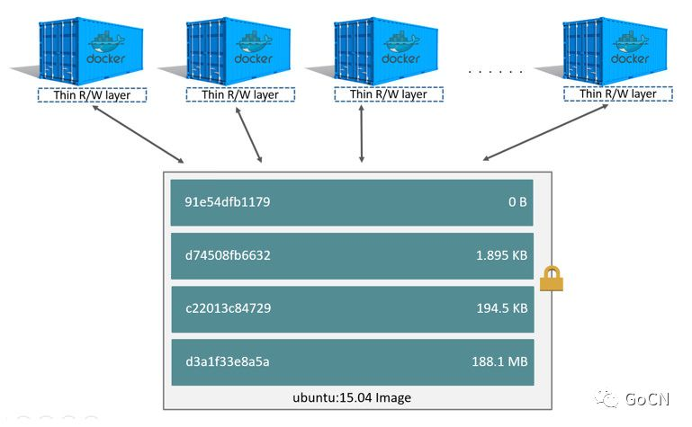

容器到底是什么？容器是怎么工作的？容器如何隔离资源？为啥容器启动那么快？...如果你是个好奇宝宝，平时在使用容器的时候内心定会泛起类似疑问。本文将通过讲解其三大核心技术：Linux Namespace，Control Groups（cgroups）和UnionFS （联合文件系统）来解答你心中对容器原理的种种疑问。

# Linux Namespace

Linux Namespaces是Linux内核提供的一种资源隔离方案。Namespaces之间的资源相互独立。目前Linux中提供七种namespace。 参考：http://man7.org/linux/man-pages/man7/namespaces.7.html

| Namespace | Flag            | 说明                 |
| --------- | --------------- | -------------------- |
| Cgroup    | CLONE_NEWCGROUP | 隔离cgroup           |
| IPC       | CLONE_NEWIPC    | 隔离进程间通信       |
| Network   | CLONE_NEWN      | 隔离网络资源         |
| Mount     | CLONE_NEWNS     | 隔离挂载点           |
| PID       | CLONE_NEWPID    | 隔离进程的ID         |
| User      | CLONE_NEWUSER   | 隔离用户和用户组的ID |
| UTS       | CLONE_NEWUTS    | 隔离主机名和域名信息 |

向clone系统调用传入上述表格中对应的Flag参数，可以为新建的进程创建相应的namespace。也可以使用setns系统调用将进程加入到一个已经存在的namespace中。容器通过namespace技术来实现资源隔离。

> namespaces限制容器能看到哪些资源。
>

> **示例**：linux下通过shell创建一个容器
> Talk is cheap, show me the code。

我们直接用一个示例来演示一下namespace隔离资源的效果。在命令行下，我们可以通过unshare命令来启动一个新进程，并为其新建相应的命名空间。在这个示例中，我们将通过unshare为我们的容器创建除cgroup和user之外的所有命名空间，这也是docker run something默认为容器创建的命名空间。本示例依赖docker环境来为我们提供一些配置上的便利。完整的示例script放在这里，方便大家scriptreplay回看过程。

```sh
git clone https://github.com/DrmagicE/build-container-in-shell
cd ./build-container-in-shell
scriptreplay build_container.time build_container.his
```

**step1: 准备一个rootfs**
首先，我们要为我们的容器准备自己的rootfs，用来为容器进程提供隔离后执行环境的文件系统。这里我们直接导出alpine镜像作为我们的rootfs，选择/root/container目录作为镜像rootfs：

```sh
[root@drmagic container]# pwd 
/root/container
[root@drmagic container]# # 修改mount类型为private，确保后续的mount/umount不会在namespace之间传播
[root@drmagic container]# mount --make-rprivate / 
[root@drmagic container]# CID=$(docker run -d alpine true)
[root@drmagic container]# docker export $CID | tar  -xf-
[root@drmagic container]# ls # rootfs建立好啦
bin  dev  etc  home  lib  media  mnt  opt  proc  root  run  sbin  srv  sys  tmp  usr  var
```

**step2: 命名空间隔离**

```sh
[root@drmagic container]# # 使用unshare为新的shell创建命名空间
[root@drmagic container]# unshare --mount --uts --ipc --net --pid --fork /bin/bash
[root@drmagic container]# echo $$ # 看看新进程的pid
1
[root@drmagic container]# hostname unshare-bash # 修改一下hostname
[root@drmagic container]# exec bash #替换bash，显现hostname修改后的效果
[root@unshare-bash container]# # hostname变化了
```

通过上面的过程，我们可以看到UTS和PID这两个命名空间的隔离效果。

> 如果你在这一步使用ps来查看所有的进程，结果可能会令你失望——你仍然会看到系统中的所有进程，就像没有隔离成功一样。但这是正常的，因为ps读取/proc下的信息，此时的/proc还是host的/proc，所以ps还是能看到所有的进程。
>

**step3：隔离挂载信息**

```
[root@unshare-bash container]# mount # 还是能看到host上的mount
/dev/vda2 on / type xfs (rw,relatime,attr2,inode64,noquota)
devtmpfs on /dev type devtmpfs (rw,nosuid,size=1929332k,nr_inodes=482333,mode=755)
tmpfs on /dev/shm type tmpfs (rw,nosuid,nodev)
devpts on /dev/pts type devpts (rw,nosuid,noexec,relatime,gid=5,mode=620,ptmxmode=000)
mqueue on /dev/mqueue type mqueue (rw,relatime)
hugetlbfs on /dev/hugepages type hugetlbfs (rw,relatime)
.....
```

我们发现mount依然能够获取全局挂载信息，难道是mount命名空间隔离没生效？非也，mount命名空间已经生效了。当新建一个mount命名空间时，他会拷贝父进程的挂载点，但对该命名空间挂载点的后续修改将不会影响到其他命名空间。

> 参考：http://man7.org/linux/man-pages/man7/mount_namespaces.7.html#DESCRIPTION
>
> 命名空间内挂载点的修改不影响其他命名空间有一个前提条件——mount的propagation type要设置为MS_PRIVATE，这也是为什么一开始我们要执行 mount --make-rprivate / 的原因

因此我们看到的mount信息是父进程的一份拷贝，我们重新mount一下/proc，好让ps能正常显示。 

```sh
[root@unshare-bash ~]# # 重新mount一下/proc
[root@unshare-bash ~]# mount -t proc none /proc
[root@unshare-bash ~]# ps -ef
UID        PID  PPID  C STIME TTY          TIME CMD
root         1     0  0 21:29 pts/0    00:00:00 bash
root        77     1  0 21:47 pts/0    00:00:00 ps -ef
[root@unshare-bash ~]# # 啊哈，现在我们的ps正常了!
```


处理完了/proc的挂载，我们还需要清理旧的挂载点，将他们umount掉，这一步我们需要借助pivot_root(new_root,put_old)来完成。pivot_root将当前mount namespace下的所有进程（线程）的根目录挂载点切换至new_root，并将旧的根目录挂载点放到put_old目录下。使用pivot_root的主要目的是用来umount一些从父进程copy过来的挂载点。

> http://man7.org/linux/man-pages/man2/pivot_root.2.html
>

为了满足pivot_root的一些参数要求，需要额外做一次bind mount：

```sh
[root@unshare-bash container]# mount --bind /root/container/ /root/container/
[root@unshare-bash container]# cd /root/container/
[root@unshare-bash container]# mkdir oldroot/
[root@unshare-bash container]# pivot_root . oldroot/ 
[root@unshare-bash container]# cd /
[root@unshare-bash /]# PATH=$PATH:/bin:/sbin 
[root@unshare-bash /]# mount -t proc none /proc
[root@unshare-bash /]# ps -ef
PID   USER     TIME  COMMAND
    1 root      0:00 bash
   70 root      0:00 ps -ef
[root@unshare-bash /]# mount # 依旧能看到host上的信息
rootfs on / type rootfs (rw)
/dev/vda2 on /oldroot type xfs (rw,relatime,attr2,inode64,noquota)
devtmpfs on /oldroot/dev type devtmpfs (rw,nosuid,size=1929332k,nr_inodes=482333,mode=755)
tmpfs on /oldroot/dev/shm type tmpfs (rw,nosuid,nodev)
....
[root@unshare-bash /]# umount -a # umount全部
umount: can't unmount /: Resource busy
umount: can't unmount /oldroot: Resource busy
umount: can't unmount /: Resource busy
[root@unshare-bash /]# mount -t proc none /proc # 重新mount /proc
[root@unshare-bash /]# mount
rootfs on / type rootfs (rw)
/dev/vda2 on /oldroot type xfs (rw,relatime,attr2,inode64,noquota)  <-- oldroot 还在
/dev/vda2 on / type xfs (rw,relatime,attr2,inode64,noquota)
none on /proc type proc (rw,relatime)
```

可以看到oldroot这个旧跟目录的挂载信息还在，我们把它unmount掉:

```sh
[root@unshare-bash /]# umount -l oldroot/ # lazy umount
[root@unshare-bash /]# mount
rootfs on / type rootfs (rw)
/dev/vda2 on / type xfs (rw,relatime,attr2,inode64,noquota)
none on /proc type proc (rw,relatime)
```

至此，容器只能看到自己的挂载信息了，挂载隔离完成.

**step4：为我们的容器添加网络**
接下来，我们初始化容器的网络。使用veth pair，借助docker提供的docker0网桥，打通容器与主机的网络。

```sh
[root@unshare-bash /]# ping 8.8.8.8 # 配置网络前，网络显然是不通的
PING 8.8.8.8 (8.8.8.8): 56 data bytes
ping: sendto: Network unreachable
[root@unshare-bash /]# ifconfig -a
lo        Link encap:Local Loopback
          LOOPBACK  MTU:65536  Metric:1
          RX packets:0 errors:0 dropped:0 overruns:0 frame:0
          TX packets:0 errors:0 dropped:0 overruns:0 carrier:0
          collisions:0 txqueuelen:1000
          RX bytes:0 (0.0 B)  TX bytes:0 (0.0 B)
```

回到host的shell，添加veth pair：

```
[root@drmagic ~]# pidof unshare # 容器的pid
11363
[root@drmagic ~]# CPID=11363
[root@drmagic ~]# # 添加veth pair
[root@drmagic ~]# ip link add name h$CPID type veth peer name c$CPID
[root@drmagic ~]# # 将veth一边塞到容器里
[root@drmagic ~]# ip link set c$CPID netns $CPID
[root@drmagic ~]# # 将veth另一边挂到docker0网桥上
[root@drmagic ~]# ip link set h$CPID master docker0 up
```

设置完veth pair，回到容器中：

```sh
[root@unshare-bash /]# ifconfig -a # 设置完之后回来看
c11363    Link encap:Ethernet  HWaddr 1A:47:BF:B8:FB:88
          BROADCAST MULTICAST  MTU:1500  Metric:1
          RX packets:0 errors:0 dropped:0 overruns:0 frame:0
          TX packets:0 errors:0 dropped:0 overruns:0 carrier:0
          collisions:0 txqueuelen:1000
          RX bytes:0 (0.0 B)  TX bytes:0 (0.0 B)


lo        Link encap:Local Loopback
          LOOPBACK  MTU:65536  Metric:1
          RX packets:0 errors:0 dropped:0 overruns:0 frame:0
          TX packets:0 errors:0 dropped:0 overruns:0 carrier:0
          collisions:0 txqueuelen:1000
          RX bytes:0 (0.0 B)  TX bytes:0 (0.0 B)

[root@unshare-bash /]# ip link set lo up
[root@unshare-bash /]# ip link set c11363 name eth0 up
[root@unshare-bash /]# # 为eth0设置一个随机的docker网段内的IP地址
[root@unshare-bash /]# ip addr add 172.17.42.3/16 dev eth0
[root@unshare-bash /]# # 配置默认路由走docker的默认网关
[root@unshare-bash /]# ip route add default via 172.17.0.1
[root@unshare-bash /]# ping 8.8.8.8
PING 8.8.8.8 (8.8.8.8): 56 data bytes
64 bytes from 8.8.8.8: seq=0 ttl=43 time=17.220 ms
64 bytes from 8.8.8.8: seq=1 ttl=43 time=16.996 ms
64 bytes from 8.8.8.8: seq=2 ttl=43 time=17.099 ms
64 bytes from 8.8.8.8: seq=3 ttl=43 time=17.118 ms
^C
--- 8.8.8.8 ping statistics ---
5 packets transmitted, 4 packets received, 20% packet loss
round-trip min/avg/max = 16.996/17.108/17.220 ms
```


网络配置完成，现在整个容器的资源已经跟宿主机隔离起来了。docker其实也是通过类似的步骤来创建容器的。

# Cgroups

cgroups，其名称源自控制组群（control groups）的简写，也是Linux内核的一个功能，**用来限制、控制与统计一个进程组的资源**（如CPU、内存、磁盘输入输出等）。

> cgroups用于限制容器能使用多少资源。
>

cgroups的API以一个伪文件系统的方式实现，即用户可以通过文件操作实现cgroups的组织管理。在大部分系统中，cgroups已经被自动挂载到/sys/fs/cgroup目录下。

cgroups包含不同的子系统（subsystem），每一个子系统其实是一种资源的控制器。查看/sys/fs/cgroup目录:

```
$ ll /sys/fs/cgroup/
drwxr-xr-x 7 root root  0 11月 11 22:49 blkio
lrwxrwxrwx 1 root root 11 11月 11 22:49 cpu -> cpu,cpuacct
lrwxrwxrwx 1 root root 11 11月 11 22:49 cpuacct -> cpu,cpuacct
drwxr-xr-x 6 root root  0 11月 11 22:49 cpu,cpuacct
drwxr-xr-x 4 root root  0 11月 11 22:49 cpuset
drwxr-xr-x 6 root root  0 11月 11 23:40 devices
drwxr-xr-x 4 root root  0 11月 11 22:49 freezer
drwxr-xr-x 4 root root  0 11月 11 22:49 hugetlb
drwxr-xr-x 6 root root  0 11月 11 22:49 memory
lrwxrwxrwx 1 root root 16 11月 11 22:49 net_cls -> net_cls,net_prio
drwxr-xr-x 4 root root  0 11月 11 22:49 net_cls,net_prio
lrwxrwxrwx 1 root root 16 11月 11 22:49 net_prio -> net_cls,net_prio
drwxr-xr-x 4 root root  0 11月 11 22:49 perf_event
drwxr-xr-x 6 root root  0 11月 11 22:49 pids
drwxr-xr-x 6 root root  0 11月 11 22:49 systemd
```

除了systemd以外, 上述目录中的每一个目录都代表着一个子系统，从上图中可以看出其包含有cpu相关(cpu,cpuacct,cpuset), 内存相关(memory)，块设备I/O相关(blkio)，网络相关(net_cls,net_prio)等子系统。

cgroups用树形的层级关系来管理各项子系统，每个子系统下都有它们自己的树形结构。树中的节点就是一组进程（或线程），不同子系统的层级关系是相互独立的。例如cpu子系统和memory子系统的层级结构可以是不一样的：

```sh
cpu/                                
├── batch
│   ├── bitcoins
│   │   └── 52   // <-- 进程ID
│   └── hadoop
│       ├── 109
│       └── 88
└── docker
    ├── container1
    │   ├── 1
    │   ├── 2
    │   └── 3
    └── container2
        └── 4

memory/
├── 109
├── 52
├── 88
└── docker
    ├── container1
    │   ├── 1
    │   ├── 2
    │   └── 3
    └── container2
        └── 4
```


将一个进程加入一个分组很简单，只需要往对应分组目录中的tasks文件写入Pid即可:echo “pid” > tasks。

如果你使用docker启动一个容器，那么docker会为该容器在每个子系统目录下创建docker/$container_id目录。这样cgroups就能对该容器的资源进行管理和限制了。

## memory cgroup
memory cgroup是管理内存的cgroup，其两个主要功能是：

统计当前分组的内存使用情。

限制当前分组的内存用量。

**统计**
memory cgroup以内存页为单位，追踪统计每个分组的内存使用大小。以docker为例，使用下列命令启动一个nginx容器，并读取容器的内存占用情况：

```
$ container_id=$(docker run -d nginx)d
$ cat /sys/fs/cgroup/memory/docker/$container_id/memory.usage_in_bytes
2666496
```

由于统计是以页为单位的，所以统计结果只能是页大小的倍数（通常4096）。

**限制**
memory cgroup可以限制整个分组对内存的使用（默认没有限制）。共有两种限制能力:

硬限制（hard limit）。

软限制（soft limit）。

> 如果内存超出了硬限制，会触发当前分组的OOM-killer来杀死进程。
>
> 如果你不想让进程被杀掉，可以禁用当前分组的OOM -killer：echo 1 > memory.oom_control
>
> 相比硬限制的强硬手段，软限制不会强制kill掉进程，软限制仅会在系统内存不足的时候才会起作用。当出现内存不足时，cgroup会尽最大努力将各分组的内存限制在软限制以下，保证系统的总体可用性。
>

依旧举docker为例，我们使用下列命令将nginx容器的硬限制和软限制分别设置成100M和50M，可以看到对应cgroup文件的变化：

```
$ container_id=$(docker run -d -m 100m --memory-reservation 50m nginx)
$ cat /sys/fs/cgroup/memory/docker/$container_id/memory.limit_in_bytes
104857600  <-- 100m
$ cat /sys/fs/cgroup/memory/docker/$container_id/memory.soft_limit_in_bytes
52428800 <-- 50m
```

## cpu 和 cpuacct cgroup
cpu和cpuset是两个cgroup，但一般这两个cgroup会挂载在一个目录下:

```
lrwxrwxrwx 1 root root 11 11月 11 22:49 cpu -> cpu,cpuacct
lrwxrwxrwx 1 root root 11 11月 11 22:49 cpuacct -> cpu,cpuacct
drwxr-xr-x 6 root root  0 11月 11 22:49 cpu,cpuacct
```

cpu与cpuacct（CPU Accounting）结合起来的主要功能有：

统计当前分组的CPU使用情况。

限制分组使用CPU的能力（通过影响调度策略）。

## 统计
统计功能主要由cpuacct提供，例如读取当前分组的cpu总耗时：

```
$ cat cpuacct.usage
1196687732756025 //单位是ns
```

## 限制
通过影响调度器的调度行为，可以限制当前分组对CPU的使用能力，这也是容器限制CPU核数的原理。cpu cgroup可以控制以下两种调度器的调度行为：

Completely Fair Scheduler (CFS) 基于完全公平算法的调度器。

Real-Time scheduler (RT) 基于实时调度算法的调度器。

在绝大部分情况下，我们使用的都是默认的CFS调度器，所以在此也仅讨论对CFS调度器的控制行为。在cpu cgroup的目录下，我们可以看到如下两个文件：

```
$ cat cpu.cfs_period_us
100000
$ cat cpu.cfs_quota_us
-1
```

## cpu.cfs_period_us
表示调度周期，微秒(μs)为单位。表示每隔多长时间执行一次调度，默认为100ms(100000μs）

> 调度周期越长，cpu执行任务的吞吐量越大，延迟则相应增加。反之， 调度周期越短，则延迟越小，但cpu的吞吐量也随之降低了（因为要耗费大量的时间在“无价值”的进程切换上）。
>

cpu.cfs_quota_us

表示在一个调度周期时间内（即cpu.cfs_period_us设定的时间），当前组内所有的进程允许在单个CPU上运行的总时长，微秒（μs）为单位。默认为-1，即不限制。假设当前分组要充分利用双核CPU资源，可以设置：

```
cpu.cfs_quota_us = 200000
cpu.cfs_period_us= 100000
```

同样的，如果我们要给当前分组设置只允许使用0.5个核，则：

```
cpu.cfs_quota_us = 50000
cpu.cfs_period_us= 100000
cpu.cfs_quota_us/cpu.cfs_period_us = 分配给当前组的cpu核数
```

当我们使用docker指定容器核数时，其实就是在调整cpu.cfs_quota_us文件的参数。

## cpuset cgroup

cpuset用的比较少，当追求极致性能的时候，可以通过其实现绑核，绑NUMA内存节点等功能：

cpuset.cpus用于标明当前分组可以使用哪些CPU。

cpuset.mems用于标明当前分组可以使用哪些NUMA节点。

NUMA(Non-Uniform Memory Access)架构将CPU模块拆分成多个，组成多个NUMA节点，每个CPU模块由多个CPU(如4个)组成，并且具有独立的本地内存、I/O槽口等。CPU访问本NUMA节点的内存的速度是很快的，相当于内存之上的一层缓存。

NUMA不在本文讨论范围内（我没也搞太清楚），感兴趣的小伙伴请自行查阅相关资料。


例如在我本机查看CPU和NUMA节点信息有：

```
$ lscpu
...
CPU(s):                2
On-line CPU(s) list:   0,1  <- 双核cpu
....
NUMA 节点：1  <- 只有一个numa节点
....
NUMA 节点0 CPU：0,1 <- numa节点上的CPU
....
```

复制代码我们查看cpuset目录下对应的文件：

```
$ cat cpuset.cpus
0-1  
$ cat cpuset.mems
0
```

即cgroup默认让当前分组使用所有的CPU和NUMA内存节点。通过docker命令可以实现绑核和NUMA节点的功能：

> 参考：https://docs.docker.com/engine/reference/run/#runtime-constraints-on-resources
>

## blkio cgroup

blkio cgroup 是块设备I/O相关的cgroup。 blkio cgroup的两个主要功能是：

统计当前分组对每个块设备的使用情况

限制当前分组对块设备的使用

## 统计
blkio统计当前分组对所有块设备的使用情况，统计维度有：read,write,sync,async四种。以统计字节数为例，与之相关的两个文件是blkio.io_service_bytes和blkio.throttle.io_service_bytes：

```
$ cat blkio.io_service_bytes
Total 0
$ cat blkio.throttle.io_service_bytes
253:0 Read 0
253:0 Write 8192
253:0 Sync 8192
253:0 Async 0
253:0 Total 8192
Total 8192
```

blkio.io_service_bytes仅统计使用CFQ调度器的块设备的使用情况，大多数情况下都是0，一般统计的话主要看blkio.throttle.*开头的文件。

## 限制
blkio可以限制分组对块设备的使用，其提供两种限制策略：

权重调度策略：仅当该块设备使用CFQ（Completely Fair Queuing）调度策略时才有效，通过为分组设置一个权重大小来限制分组使用块设备的能力。

I/O限流策略（I/O Throttling）：该策略通过设置块设备的I/O速率上限来限制分组使用该块设备的能力。

权重调度仅在使用CFQ调度器时才有效，而I/O限流策略工作在通用设备层（generic block layer），其不受I/O调度策略影响，更为广泛通用。

可以通过如下命令查看块设备的调度策略（把vda换成需要查看的块设备）：

```
cat /sys/block/vda/queue/scheduler 

[mq-deadline] kyber none 
```

如果你看到cfq，则权重调度策略才生效。

以更为通用的I/O限流策略为例，有下列四个文件来限制每秒的读写字节数和I/O操作次数：

```
blkio.throttle.read_bps_device 每秒读取字节数
blkio.throttle.read_iops_device 每秒读操作次数
blkio.throttle.write_bps_device 每秒写字节数
blkio.throttle.write_iops_device 每秒写操作次数
```

向上述四个文件中写入"major:minor 每秒字节数/次数"即可设置对应设备的最大读写字节数/操作数。

major和minor是块设备对应的主次设备号，可以通过ls -lt /dev/查看主机上块设备的对应编号。

以blkio.throttle.write_bps_device为例，限制当前分组对设备253:0（/dev/vda）的写速度不超过10MB/s:

$ echo "253:0 10485760" > blkio.throttle.write_bps_device
要注意的是blkio的限制是在块设备的I/O操作上，常规写操作都会先经过page cache缓存，再异步flush到磁盘，写到page cache缓存的速度不受blkio的限制。如果想要看到限流效果，要使用direct I/O，如：

```
$ dd if=/dev/zero of=test bs=10M count=5 oflag=direct
5+0 records in
5+0 records out
52428800 bytes (52 MB, 50 MiB) copied, 4.94449 s, 10.6 MB/s
```

可以看到限流后的写入速率大致为10.6MB/s，大差不差。

net_cls 和 net_prio cgroup
net_cls和net_prio是两个网络相关的cgroup：

net_cls 通过使用等级识别符（classid）标记网络数据包，从而允许流量控制程序（TC：Traffic Controller）识别从具体cgroup中生成的数据包。

net_prio可以设置各个网络接口的使用优先级。

我们无法直接通过net_cls来达到类似blkio那样限制速率的功能，如果想实现限流的功能，还需要搭配TC来实现——由net_cls负责标记数据包，TC识别后进行流量限制。

## devices cgroup
devices cgroup用于控制分组对设备的使用权限——包括read,write和mknod权限。

查看cgroup下的devices.list文件可以获取当前分组的设备权限：

```
$ cat devices.list
c 1:5 rwm
b *:* m
```

其每一行的格式为：type(设备类型) major:minor access(访问权限)。

设备类型有三种： 

a 表示所有设备，包括字符设备和块设备。

b 表示块设备。

c 表示字符设备。

major:minor在blkio中已介绍过，在这里可以使用*作为通配符表示所有的编号，例如*:*表示所有设备号。

访问权限是一个字符串，包含一个或多个代表不同权限的字母：

r 读权限。

w 写权限。

m 创建设备文件的权限。

除去一些特殊虚拟设备，docker默认禁止容器访问主机的任何设备。可以通过--devices参数为容器添加设备权限，或者使用--privileged参数开启privileged模式，使用--privileged参数启动的容器会获得主机所有设备的所有权限：

[参考](https://docs.docker.com/engine/reference/run/#runtime-privilege-and-linux-capabilities)

```
$ container_id=$(docker run -d --privileged nginx)
$ cat /sys/fs/cgroup/devices/docker/$container_id/devices.list
a *:* rwm  <--- 所有设备的所有权限
```

[默认开放的虚拟设备参考](https://github.com/containerd/containerd/blob/f01665aa02d8b26c581fdfcc93d837ce3b275edd/oci/spec_opts.go#L1029)

## freezer cgroup

freezer cgroup可以暂停和恢复组内的进程。freezer.state文件记录了当前实际状态：

THAWED 解冻状态（正常运行状态）。

FREEZING 冻结中。

FROZEN 已冻结（暂停）。

向freezer.state中写入可以改变当前分组的状态，只允许写入FROZEN（冻结）或THAWED（恢复）。

docker pause就是利用freezer来实现容器的暂停与恢复：

```
$ container_id=$(docker run -d nginx)
$ docker pause $container_id
$ cat /sys/fs/cgroup/freezer/docker/$container_id/freezer.state
FROZEN  <--- 冻结了
```

## pids cgroup
pids cgroup用于限制组内的任务（task，表示线程或进程）数。要启用任务数限制时，往pids.max文件中写入允许的最大的数量即可，写入字符串"max"则表示无限制（默认）。通过读取pids.current文件，可得到当前分组的所有任务数。

docker 可以通过--pids-limit参数来限制容器内的进程数量：

```
$ container_id=$(docker run -d --pids-limit 3 nginx)
$ cat /sys/fs/cgroup/pids/docker/$container_id/pids.max
3
```

# UnionFS

UnionFS是一种文件系统，**它允许将多个目录组合成一个逻辑目录**，该逻辑目录包含这些目录中的所有内容，并对外提供一个统一的视图。

举个例子，假设我们需要更新一块CD-ROM中的内容，但是CD-ROM是不可写的，这个时候可以将CD-ROM与另一个可写目录挂载成UnionFS。当我们更新文件的时候，内容会被写入可写的目录，就好像CD-ROM中的内容被更新了一样。

容器镜像（image）提供了一个描述容器的“静态视图”，镜像中包含了容器运行所依赖的各种文件。我们可以在运行的容器中修改这些文件而不会影响到镜像本身。这是因为容器内目录与镜像目录联合成了一个UnionFS，从容器的视角来看，镜像就好比CD-ROM（不可写），容器对目录的修改仅会写入容器自身的目录，并不会影响到镜像中的内容。

镜像是由许多仅可读的层组成的，当你使用该镜像创建一个容器时，一个可写层会被加到镜像的可读层之上，容器内所有文件的变化都会保存在这个可写层。



Copy-on-write
容器的启动速度是很快的（即便在镜像很大的情况下），这得益于copy-on-write（COW，写时复制）技术的运用。当我们启动一个容器时候，并不需要将整个镜像中的文件copy一份，容器直接引用镜像中的文件，任何的读操作都直接直接从镜像读即可，当发生写操作时，才需要将镜像中的相应文件copy到容器的可写层，在可写层进行写入。

[docker文档中有对COW的详细介绍和示例](https://docs.docker.com/storage/storagedriver/#the-copy-on-write-cow-strategy)

OverlayFS

UnionFS的实现有许多种，docker也可以配置多种类型的storage driver，其比较耳熟的有：overlay2,aufs,devicemapper。

[参考](https://docs.docker.com/storage/storagedriver/select-storage-driver/)

随着OverlayFS被合入Linux kernel mainline，overlay2越来越常用，也成为了docker推荐使用的storage driver。本文就以OverlayFS和overlay2为例，说明容器是如何得益于UnionFS和copy-on-write的。

挂载OverlayFS：

```
$ mount -t overlay overlay -o lowerdir=lower1:lower2:lower3...,upperdir=upper,workdir=work  merged
```

[参考（搜overlay）](http://man7.org/linux/man-pages/man8/mount.8.html#FILESYSTEM-SPECIFIC_MOUNT_OPTIONS)

上述命令将merged目录挂载成OverlayFS，其中lowerdir是只读层（镜像层），允许有多层，upperdir则是可写层（容器层）。这意味着当我们向merged目录写入文件时，文件会被写入upperdir。从merged目录读文件时，如果文件在upperdir不存在，则向下一层层从lowerdir中找。

workdir是系统用于做挂载前的一些准备工作。需要一个空目录，且跟upperdir在同一文件系统下。

通过一个示例直观展示OverlayFS的读写行为：

```sh
$ mkdir lower upper work merged
$ echo "lowerdir" > lower/test
$ echo "upper" > upper/test # upper跟lower都有相同的文件test
$ echo "lowerdir" > lower/lower # lower才有的文件
$ mount -t overlay overlay -o lowerdir=lower,upperdir=upper,workdir=work  merged
$ ls merged/ # mount后看到lower跟upper的统一视图
lower  test
$ cat merged/test
upper # upper, lower都有该文件，读upper的文件
$ cat merged/lower # upper没有该文件，读lower文件
lowerdir
$ echo "write something" >> merged/test
$ cat upper/test # 向merged的写入仅影响upper层
upper
write something
$ cat lower/test
lowerdir
```

使用docker run创建一个容器后，docker就会为容器mount一个OverlayFS：

```sh
$ docker run -itd alpine /bin/sh
$ mount | grep overlay2
overlay on /var/lib/docker/overlay2/a2a37f61c515f641dbaee62cf948817696ae838834fd62cf9395483ef19f2f55/merged type overlay
(rw,relatime,
lowerdir=/var/lib/docker/overlay2/l/RALFTJC6S7NV4INMLE5G2DUYVM:
         /var/lib/docker/overlay2/l/WQJ3RXIAJMUHQWBH7DMCM56PNK,
upperdir=/var/lib/docker/overlay2/a2a37f61c515f641dbaee62cf948817696ae838834fd62cf9395483ef19f2f55/diff,
workdir=/var/lib/docker/overlay2/a2a37f61c515f641dbaee62cf948817696ae838834fd62cf9395483ef19f2f55/work)
```

docker将镜像中的每个layer按顺序添加到lowerdir中，将upperdir设置为容器的可写层。

当我们使用docker pull image的时候，docker就已经将镜像中各只读层的目录创建好了，执行docker run时，基本上只需创建容器的可写层，并将它们挂载成OverlayFS即可。所以就算镜像很大，容器的启动依旧是非常迅速。

当你使用docker pull拉镜像的时候，一定出现过Already exists的标识。

```sh
docker pull xxxx
...
68ced04f60ab: Already exists <---
e6edbc456071: Pull complete
...
```

docker pull时如果本地已经有该层的内容了，就不需要再拉了。不同的镜像会共享相同的层，在/var/lib/docker/overlay2下也只会保存一份与之对应的文件目录，减少了磁盘开销。

docker文档对overlay2工作过程的详细介绍：

https://docs.docker.com/storage/storagedriver/overlayfs-driver/#how-the-overlay2-driver-works

其他参考

文档类 

http://man7.org/linux/man-pages/man7/cgroups.7.html  

https://www.kernel.org/doc/Documentation/cgroup-v1/

https://access.redhat.com/documentation/en-us/red_hat_enterprise_linux/6/html/resource_management_guide/ch-Subsystems_and_Tunable_Parameters  

https://android.googlesource.com/kernel/common/+/bcmdhd-3.10/Documentation/cgroups/

blog类 

https://www.kernel.org/doc/Documentation/cgroup-v1/

https://access.redhat.com/documentation/en-us/red_hat_enterprise_linux/6/html/resource_management_guide/ch-Subsystems_and_Tunable_Parameters  

https://android.googlesource.com/kernel/common/+/bcmdhd-3.10/Documentation/cgroups/

视频类 

Cgroups, namespaces, and beyond: what are containers made from?:  

https://www.youtube.com/watch?v=sK5i-N34im8  

（宝藏视频，强推）