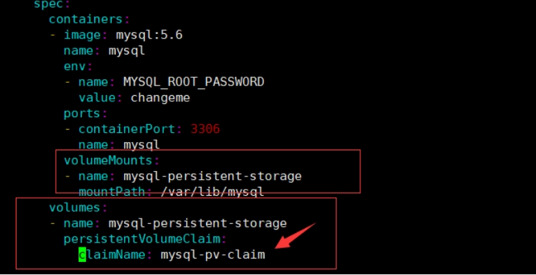

# 云原生存储[Rook](https://rook.io/docs/rook/latest-release/Getting-Started/intro/)

Rook 是一个开源**的云原生存储编排器**。为 Ceph 存储提供平台、框架和支持，以便与云原生环境原生集成。

[Ceph](https://ceph.com/) 是一个分布式存储系统，提供文件、块和对象存储，并部署在大规模生产集群中。

Rook 并不是存储系统，在存储和k8s之前搭建了一个桥梁，使存储系统的搭建或者维护变得特别简单，Rook 自动部署和管理 Ceph，以提供自我管理、自我扩展和自我修复的存储服务。Rook Operator 通过构建 Kubernetes 资源来部署、配置、配置、扩展、升级和监控 Ceph。并且Rook支持CSI，可以利用CSI做一些PVC的快照、扩容、克隆等操作。

[Rook Ceph Documentation - latest](https://rook.io/docs/rook/latest/Getting-Started/intro/) | [Rook Ceph Documentation - V1.9](https://rook.io/docs/rook/v1.9/Getting-Started/intro/)

#  前置条件

1. 生产环境需要至少 3 台以上节点，用于作为 osd 节点存储数据使用。每个 osd 节点，至少拥有一块裸盘，用于部署 rook ceph 时初始化用。
2. 我们使用的 rook ceph 版本较高，需要 kubernetes 版本 1.22 或更高。
3. **虚拟机参考配置：mater（cpu>4，mem>6），node（cpu>2，mem>4）**

# Rook安装

**每个节点都需要独立的磁盘**。rook的版本大于1.3，不要使用目录创建集群，要使用单独的裸盘进行创建，也就是创建一个新的磁盘，挂载到宿主机，不进行格式化，直接使用即可。对于节点添加磁盘sdb如下：

```sh
[root@k8s-node1 examples]# lsblk
NAME            MAJ:MIN RM  SIZE RO TYPE MOUNTPOINT
sda               8:0    0   50G  0 disk
├─sda1            8:1    0    1G  0 part /boot
└─sda2            8:2    0   49G  0 part
  ├─centos-root 253:0    0   47G  0 lvm  /
  └─centos-swap 253:1    0    2G  0 lvm
sdb               8:16   0    1G  0 disk
```

## 下载Rook安装文件

下载指定版本Rook，也可以参考视频中的步骤下载最新版

```sh
git clone --single-branch --branch v1.6.3 https://github.com/rook/rook.git
```

## 配置更改

修改Rook CSI镜像地址，原本的地址可能是gcr的镜像，但是gcr的镜像无法被国内访问，所以需要同步gcr的镜像到阿里云镜像仓库，文档版本已经为大家完成同步，可以直接rook/deploy/examples/operator.yaml修改如下：

```yaml
  # ROOK_CSI_CEPH_IMAGE: "quay.io/cephcsi/cephcsi:v3.11.0"
  # ROOK_CSI_REGISTRAR_IMAGE: "registry.k8s.io/sig-storage/csi-node-driver-registrar:v2.10.1"
  # ROOK_CSI_RESIZER_IMAGE: "registry.k8s.io/sig-storage/csi-resizer:v1.10.1"
  # ROOK_CSI_PROVISIONER_IMAGE: "registry.k8s.io/sig-storage/csi-provisioner:v4.0.1"
  # ROOK_CSI_SNAPSHOTTER_IMAGE: "registry.k8s.io/sig-storage/csi-snapshotter:v7.0.2"
  # ROOK_CSI_ATTACHER_IMAGE: "registry.k8s.io/sig-storage/csi-attacher:v4.5.1"
```

改为:

```yaml
 ROOK_CSI_REGISTRAR_IMAGE: "registry.cn-beijing.aliyuncs.com/dotbalo/csi-node-driver-registrar:v2.0.1"
 ROOK_CSI_RESIZER_IMAGE: "registry.cn-beijing.aliyuncs.com/dotbalo/csi-resizer:v1.0.1"
 ROOK_CSI_PROVISIONER_IMAGE: "registry.cn-beijing.aliyuncs.com/dotbalo/csi-provisioner:v2.0.4"
 ROOK_CSI_SNAPSHOTTER_IMAGE: "registry.cn-beijing.aliyuncs.com/dotbalo/csi-snapshotter:v4.0.0"
 ROOK_CSI_ATTACHER_IMAGE: "registry.cn-beijing.aliyuncs.com/dotbalo/csi-attacher:v3.0.2"
```

如果是其他版本，需要自行同步，同步方法可以在网上找到相关文章。可以参考https://blog.csdn.net/sinat_35543900/article/details/103290782

还是operator文件，新版本rook默认关闭了自动发现容器的部署，可以找到：

```yaml
ROOK_ENABLE_DISCOVERY_DAEMON: "true"
```

## 部署rook

vi operator.yaml文件master节点允许污点存在，1.5.3版本的部署步骤如下：

```sh
cd rook/deploy/examples/
kubectl taint nodes --all node-role.kubernetes.io/control-plane:NoSchedule-		# 去除master节点误点
kubectl create -f crds.yaml -f common.yaml -f operator.yaml -n rook-ceph
```

等待operator容器和discover容器启动

```sh
[root@k8s-master01 ceph]# kubectl get pod -n rook-ceph
NAME                                                     READY   STATUS      RESTARTS   AGE
rook-ceph-operator-7c7d8846f4-fsv9f                      1/1     Running     0          25h
rook-discover-qw2ln                                      1/1     Running     0          28h
rook-discover-wf8t7                                      1/1     Running     0          28h
rook-discover-z6dhq                                      1/1     Running     0          28h
```

> 全部变成1/1   Running 才可以创建Ceph集群

# 创建ceph集群

更多配置https://rook.io/docs/rook/v1.9/ceph-csi-snapshot.html | [Host Storage Cluster - Rook Ceph Documentation](https://rook.io/docs/rook/latest-release/CRDs/Cluster/host-cluster/#specific-nodes-and-devices)

更改`cluster.yaml`配置。主要更改的是osd节点所在的位置：

```yaml
  storage: # cluster level storage configuration and selection
    useAllNodes: false
    useAllDevices: false
    #deviceFilter:
    config:
    nodes:
    - name: "k8s-node1"
      devices:
      - name: "sdb"
    nodes:
    - name: "k8s-node2"
      devices:
      - name: "sdb"
    nodes:
    - name: "k8s-node3"
      devices:
      - name: "sdb"
```

注意：新版必须采用裸盘，即未格式化的磁盘。其中k8s-master03 k8s-node01 node02有新加的一个磁盘，可以通过lsblk -f查看新添加的磁盘名称。建议最少三个节点，否则后面的试验可能会出现问题

## 创建Ceph集群

```sh
kubectl create -f cluster.yaml
```

创建完成后，可以查看pod的状态：

```sh
[root@k8s-master01 ceph]# kubectl -n rook-ceph get pod
NAME                                                     READY   STATUS      RESTARTS   AGE
csi-cephfsplugin-6nwbp                                   3/3     Running     0          25h
csi-cephfsplugin-b7h6k                                   3/3     Running     0          25h
csi-cephfsplugin-provisioner-785798bc8f-78tvr            6/6     Running     0          25h
csi-cephfsplugin-provisioner-785798bc8f-krsdx            6/6     Running     0          25h
csi-rbdplugin-2mmmj                                      3/3     Running     0          25h
csi-rbdplugin-85sbg                                      3/3     Running     0          25h
csi-rbdplugin-provisioner-75cdf8cd6d-ghl8f               6/6     Running     0          25h
csi-rbdplugin-provisioner-75cdf8cd6d-wf6h8               6/6     Running     0          25h
rook-ceph-crashcollector-k8s-master03-64c56d8d8b-9vqrk   1/1     Running     0          28h
rook-ceph-crashcollector-k8s-node01-7fc9b79798-6r2rn     1/1     Running     0          28h
rook-ceph-crashcollector-k8s-node02-6954497cb9-pqll7     1/1     Running     0          28h
rook-ceph-mgr-a-dd4bf8445-scsrt                          1/1     Running     0          25h
rook-ceph-mon-a-856779ddfd-8v7s2                         1/1     Running     0          28h
rook-ceph-mon-b-6c94bddf8c-wb69x                         1/1     Running     0          28h
rook-ceph-mon-c-5659bcb5c9-pjn5f                         1/1     Running     0          28h
rook-ceph-operator-7c7d8846f4-fsv9f                      1/1     Running     0          25h
rook-ceph-osd-0-7c6cdb8546-kkcts                         1/1     Running     0          28h
rook-ceph-osd-1-f8b598d47-qjnwl                          1/1     Running     0          28h
rook-ceph-osd-2-55846dbcd9-jvm62                         1/1     Running     0          28h
rook-ceph-osd-prepare-k8s-master03-h8lt2                 0/1     Completed   0          5h1m
rook-ceph-osd-prepare-k8s-node01-jqz7x                   0/1     Completed   0          5h1m
rook-ceph-osd-prepare-k8s-node02-hm8lc                   0/1     Completed   0          5h1m
rook-discover-qw2ln                                      1/1     Running     0          29h
rook-discover-wf8t7                                      1/1     Running     0          29h
rook-discover-z6dhq                                      1/1     Running     0          29h
```

需要注意的是，osd-x的容器必须是存在的，且是正常的。如果上述Pod均正常，则认为集群安装成功。

## 安装ceph的snapshot控制器

k8s 1.19版本以上需要单独安装snapshot控制器，才能完成pvc的快照功能，所以在此提前安装下，如果是1.19以下版本，不需要单独安装，直接参考视频即可。[具体文档](https://rook.io/docs/rook/v1.9/ceph-csi-snapshot.html)

```sh
git clone -b manual-installation-v1.28.x https://githubfast.com/dotbalo/k8s-ha-install.git
```

> 注意：snapshot控制器的部署在集群安装时的k8s-ha-install项目中，需要切换到1.20.x分支：
>

创建snapshot controller：

```sh
$ kubectl create -f snapshotter/ -n kube-system
$ kubectl get po -n kube-system -l app=snapshot-controller
NAME                    READY   STATUS    RESTARTS   AGE
snapshot-controller-0   1/1     Running   0          27h
```

## 安装ceph客户端工具

```sh
[root@k8s-master01 ceph]# kubectl  create -f toolbox.yaml -n rook-ceph
deployment.apps/rook-ceph-tools created
```

待容器Running后，即可执行相关命令

```sh
[root@k8s-master01 ceph]# kubectl  get po -n rook-ceph -l app=rook-ceph-tools
NAME                               READY   STATUS    RESTARTS   AGE
rook-ceph-tools-6f7467bb4d-qzsvg   1/1     Running   0          <invalid>
```

```sh
[root@k8s-master01 ceph]# kubectl -n rook-ceph exec -it deploy/rook-ceph-tools -- bash
[root@rook-ceph-tools-6f7467bb4d-qzsvg /]# ceph status
  cluster:
    id:     356e0bac-b3e3-4abc-891b-ee6b8a0bc56f
    health: HEALTH_OK
 
  services:
    mon: 3 daemons, quorum a,b,c (age 29h)
    mgr: a(active, since 5h)
    osd: 3 osds: 3 up (since 29h), 3 in (since 29h)
 
  data:
    pools:   1 pools, 1 pgs
    objects: 0 objects, 0 B
    usage:   3.0 GiB used, 57 GiB / 60 GiB avail
    pgs:     1 active+clean
 
[root@rook-ceph-tools-6f7467bb4d-qzsvg /]# ceph osd status
ID  HOST           USED  AVAIL  WR OPS  WR DATA  RD OPS  RD DATA  STATE      
 0  k8s-node01    1029M  18.9G      0        0       0        0   exists,up  
 1  k8s-master03  1029M  18.9G      0        0       0        0   exists,up  
 2  k8s-node02    1029M  18.9G      0        0       0        0   exists,up  
[root@rook-ceph-tools-6f7467bb4d-qzsvg /]# ceph df
--- RAW STORAGE ---
CLASS  SIZE    AVAIL   USED    RAW USED  %RAW USED
hdd    60 GiB  57 GiB  17 MiB   3.0 GiB       5.03
TOTAL  60 GiB  57 GiB  17 MiB   3.0 GiB       5.03
--- POOLS ---
POOL                   ID  STORED  OBJECTS  USED  %USED  MAX AVAIL
device_health_metrics   1     0 B        0   0 B      0     18 GiB
```

# Ceph dashboard

## 暴露服务

默认情况下，ceph dashboard是打开的，可以创建一个nodePort类型的Service暴露服务：

```yaml
# vim dashboard-np.yaml
apiVersion: v1
kind: Service
metadata:
  labels:
    app: rook-ceph-mgr
    ceph_daemon_id: a
    rook_cluster: rook-ceph
  name: rook-ceph-mgr-dashboard-np
  namespace: rook-ceph
spec:
  ports:
  - name: http-dashboard
    port: 7000
    protocol: TCP
    targetPort: 7000
  selector:
    app: rook-ceph-mgr
    ceph_daemon_id: a
    rook_cluster: rook-ceph
  sessionAffinity: None
  type: NodePort
```

保存退出后，会创建一个端口，然后通过任意k8s节点的IP+该端口即可访问该dashboard：

```sh
[root@k8s-master01 ceph]# kubectl  get svc -n rook-ceph rook-ceph-mgr-dashboard-np
NAME                      TYPE       CLUSTER-IP       EXTERNAL-IP   PORT(S)          AGE
rook-ceph-mgr-dashboard-np   NodePort   192.168.85.223   <none>        7000:30583/TCP   29h
```


## 登录

账号为admin，查看密码：

```sh
kubectl -n rook-ceph get secret rook-ceph-dashboard-password -o jsonpath="{['data']['password']}" | base64 --decode && echo
```


警告解决：https://docs.ceph.com/en/octopus/rados/operations/health-checks/

# ceph块存储的使用

块存储一般用于一个Pod挂载一块存储使用，相当于一个服务器新挂了一个盘，只给一个应用使用。[参考文档](https://rook.io/docs/rook/v1.9/ceph-block.html)

## 创建StorageClass和ceph的存储池

```sh
[root@k8s-master01 ceph]# pwd
/root/rook/deploy/examples/
[root@k8s-master01 ceph]# vim csi/rbd/storageclass.yaml
```

因为我是试验环境，所以将replicated副本数生产环境最少为3，且要小于等于osd的数量，其他配置可以参考视频：

```yaml
apiVersion: ceph.rook.io/v1
kind: CephBlockPool
metadata:
  name: replicapool
  namespace: rook-ceph # namespace:cluster
spec:
  failureDomain: host
  replicated:
    size: 3
```

创建StorageClass和存储池：

```sh
[root@k8s-master01 ceph]# kubectl  create -f csi/rbd/storageclass.yaml -n rook-ceph
cephblockpool.ceph.rook.io/replicapool created
storageclass.storage.k8s.io/rook-ceph-block created
```

查看创建的cephblockpool和storageClass（StorageClass没有namespace隔离性）：

```sh
[root@k8s-master01 ceph]# kubectl  get cephblockpool -n rook-ceph
NAME          AGE
replicapool   39s
[root@k8s-master01 ceph]# kubectl  get sc 
NAME              PROVISIONER                  RECLAIMPOLICY   VOLUMEBINDINGMODE   ALLOWVOLUMEEXPANSION   AGE
rook-ceph-block   rook-ceph.rbd.csi.ceph.com   Delete          Immediate           true                   107s
```

此时可以在ceph dashboard查看到改Pool，如果没有显示说明没有创建成功


## 挂载测试

创建一个MySQL服务

```sh
[root@k8s-master01 kubernetes]# pwd
/root/rook/cluster/examples/kubernetes
[root@k8s-master01 kubernetes]# kubectl create -f mysql.yaml 
service/wordpress-mysql created
persistentvolumeclaim/mysql-pv-claim created
deployment.apps/wordpress-mysql created
```

​	该文件有一段pvc的配置


pvc会连接刚才创建的storageClass，然后动态创建pv，然后连接到ceph创建对应的存储

之后创建pvc只需要指定storageClassName为刚才创建的StorageClass名称即可连接到rook的ceph。如果是statefulset，只需要将volumeTemplateClaim里面的Claim名称改为StorageClass名称即可动态创建Pod，具体请听视频。

其中MySQL deployment的volumes配置挂载了该pvc：



claimName为pvc的名称，因为MySQL的数据不能多个MySQL实例连接同一个存储，所以一般只能用块存储。相当于新加了一块盘给MySQL使用。创建完成后可以查看创建的pvc和pv


此时在ceph dashboard上面也可以查看到对应的image

 

## StatefulSet与VolumeClaimTemplates

```yaml
apiVersion: v1
kind: Service
metadata:
  name: nginx
  labels:
    app: nginx
spec:
  ports:
  - port: 80
    name: web
  clusterIP: None
  selector:
    app: nginx
---
apiVersion: apps/v1
kind: StatefulSet
metadata:
  name: web
spec:
  selector:
    matchLabels:
      app: nginx # has to match .spec.template.metadata.labels
  serviceName: "nginx"
  replicas: 3 # by default is 1
  template:
    metadata:
      labels:
        app: nginx # has to match .spec.selector.matchLabels
    spec:
      terminationGracePeriodSeconds: 10
      containers:
      - name: nginx
        image: nginx 
        ports:
        - containerPort: 80
          name: web
        volumeMounts:
        - name: www
          mountPath: /usr/share/nginx/html
  volumeClaimTemplates:
  - metadata:
      name: www
    spec:
      accessModes: [ "ReadWriteOnce" ]
      storageClassName: "rook-ceph-block"
      resources:
        requests:
          storage: 1Gi
```

# 共享文件系统的使用

共享文件系统一般用于多个Pod共享一个存储。官方文档：https://rook.io/docs/rook/v1.9/ceph-filesystem.html

## 创建共享类型的文件系统

```sh
[root@k8s-master01 ceph]# pwd
/root/rook/deploy/examples/
[root@k8s-master01 ceph]# kubectl  create -f filesystem.yaml 
cephfilesystem.ceph.rook.io/myfs created
```

创建完成后会启动mds容器，需要等待启动后才可进行创建pv

```sh
[root@k8s-master01 ceph]# kubectl -n rook-ceph get pod -l app=rook-ceph-mds
NAME                                    READY   STATUS    RESTARTS   AGE
rook-ceph-mds-myfs-a-5979d75f84-m9nv9   1/1     Running   0          2m38s
rook-ceph-mds-myfs-b-55c794c7b8-pr2vs   1/1     Running   0          2m37s
```

也可以在ceph dashboard上面查看状态

 


## 创建共享类型文件系统的StorageClass

```sh
[root@k8s-master01 cephfs]# pwd
/root/rook/deploy/examples/csi/cephfs
[root@k8s-master01 cephfs]# kubectl create -f storageclass.yaml 
storageclass.storage.k8s.io/rook-cephfs created
```

之后将pvc的storageClassName设置成rook-cephfs即可创建共享文件类型的存储，类似于NFS，可以给多个Pod共享数据。

## 挂载测试

```sh
[root@k8s-master01 cephfs]# pwd
/root/rook/deploy/examples/csi/cephfs
[root@k8s-master01 cephfs]# ls
kube-registry.yaml  pod.yaml  pvc-clone.yaml  pvc-restore.yaml  pvc.yaml  snapshotclass.yaml  snapshot.yaml  storageclass.yaml
[root@k8s-master01 cephfs]# kubectl create -f kube-registry.yaml 
persistentvolumeclaim/cephfs-pvc created
deployment.apps/kube-registry created
```

查看创建的pvc和pod

```sh
[root@k8s-master01 cephfs]# kubectl get po -n kube-system -l k8s-app=kube-registry
NAME                             READY   STATUS    RESTARTS   AGE
kube-registry-66d4c7bf47-46bpq   1/1     Running   0          34s
kube-registry-66d4c7bf47-jp88x   1/1     Running   0          34s
kube-registry-66d4c7bf47-xdtpx   1/1     Running   0          34s
[root@k8s-master01 cephfs]# kubectl  get pvc -n kube-system
NAME         STATUS   VOLUME                                     CAPACITY   ACCESS MODES   STORAGECLASS   AGE
cephfs-pvc   Bound    pvc-0149518a-7346-4d16-9030-97b2f9b8e9d2   1Gi        RWX            rook-cephfs    100s
```

该文件的pvc配置，用于连接ceph创建存储，如下：


然后在deployment的volumes配置添加了该pvc，并将其挂载到了/var/lib/registry

 

​	注意claimName为pvc的名称。

​	此时一共创建了三个Pod，这三个Pod共用了一个存储，挂载到了/var/lib/registry，该目录三个容器共享数据。

## Nginx挂载测试

```yaml
apiVersion: v1
kind: Service
metadata:
  name: nginx
  labels:
    app: nginx
spec:
  ports:
  - port: 80
    name: web
  selector:
    app: nginx
  type: ClusterIP
---
kind: PersistentVolumeClaim
apiVersion: v1
metadata:
  name: nginx-share-pvc
spec:
  storageClassName: rook-cephfs 
  accessModes:
    - ReadWriteMany
  resources:
    requests:
      storage: 1Gi
---
apiVersion: apps/v1
kind: Deployment 
metadata:
  name: web
spec:
  selector:
    matchLabels:
      app: nginx # has to match .spec.template.metadata.labels
  replicas: 3 # by default is 1
  template:
    metadata:
      labels:
        app: nginx # has to match .spec.selector.matchLabels
    spec:
      containers:
      - name: nginx
        image: nginx 
        imagePullPolicy: IfNotPresent
        ports:
        - containerPort: 80
          name: web
        volumeMounts:
        - name: www
          mountPath: /usr/share/nginx/html
      volumes:
        - name: www
          persistentVolumeClaim:
            claimName: nginx-share-pvc
```

# PVC扩容

- 文件共享类型的PVC扩容需要k8s 1.15+


- 块存储类型的PVC扩容需要k8s 1.16+


PVC扩容需要开启ExpandCSIVolumes，新版本的k8s已经默认打开了这个功能，可以查看自己的k8s版本是否已经默认打开了该功能：

```sh
[root@k8s-master01 kubernetes]# kube-apiserver -h |grep ExpandCSIVolumes
	ExpandCSIVolumes=true|false (BETA - default=true)
```

如果default为true就不需要打开此功能，如果default为false，需要开启该功能。

## 扩容文件共享型PVC

找到刚才创建的文件共享型StorageClass，将allowVolumeExpansion设置为true（新版rook默认为true，如果不为true更改后执行kubectl replace即可）：

 

找到第六章创建的pvc：

```sh
[root@k8s-master01 cephfs]# kubectl  get pvc -n kube-system
NAME         STATUS   VOLUME                                     CAPACITY   ACCESS MODES   STORAGECLASS   AGE
cephfs-pvc   Bound    pvc-0149518a-7346-4d16-9030-97b2f9b8e9d2   1Gi        RWX            rook-cephfs    44m
[root@k8s-master01 cephfs]# kubectl  edit pvc cephfs-pvc -n kube-system
```

将大小修改为2Gi，之前是1Gi

 

保存退出：

```sh
[root@k8s-master01 cephfs]# kubectl  edit pvc cephfs-pvc -n kube-system
persistentvolumeclaim/cephfs-pvc edited
```

查看PV和PVC的大小：

```sh
[root@k8s-master01 cephfs]# kubectl  get pvc -n kube-system
NAME         STATUS   VOLUME                                     CAPACITY   ACCESS MODES   STORAGECLASS   AGE
cephfs-pvc   Bound    pvc-0149518a-7346-4d16-9030-97b2f9b8e9d2   2Gi        RWX            rook-cephfs    46m
[root@k8s-master01 cephfs]# kubectl  get pv
NAME                                       CAPACITY   ACCESS MODES   RECLAIM POLICY   STATUS   CLAIM                    STORAGECLASS      REASON   AGE
pvc-0149518a-7346-4d16-9030-97b2f9b8e9d2   2Gi        RWX            Delete           Bound    kube-system/cephfs-pvc   rook-cephfs                47m
pvc-fd8b9860-c0d4-4797-8e1d-1fab880bc9fc   2Gi        RWO            Delete           Bound    default/mysql-pv-claim   rook-ceph-block            64m
```

查看容器内是否已经完成扩容：

```sh
[root@k8s-master01 cephfs]# kubectl  exec -ti kube-registry-66d4c7bf47-46bpq -n kube-system -- df -Th | grep "/var/lib/registry"
                     ceph            2.0G         0      2.0G   0% /var/lib/registry
```

同样的步骤可以扩容到3G：

 

 

## 扩容块存储

扩容步骤类似，找到第五章创建PVC，直接edit即可

```sh
[root@k8s-master01 cephfs]# kubectl  edit pvc mysql-pv-claim
persistentvolumeclaim/mysql-pv-claim edited
[root@k8s-master01 cephfs]# kubectl  get pvc
NAME             STATUS   VOLUME                                     CAPACITY   ACCESS MODES   STORAGECLASS      AGE
mysql-pv-claim   Bound    pvc-fd8b9860-c0d4-4797-8e1d-1fab880bc9fc   2Gi        RWO            rook-ceph-block   70m
```

可以看到此时pvc并没有扩容，但是pv已经扩容：

```sh
[root@k8s-master01 cephfs]# kubectl  get pv  | grep  default/mysql-pv-claim
pvc-fd8b9860-c0d4-4797-8e1d-1fab880bc9fc  3Gi     RWO       Delete      Bound   default/mysql-pv-claim  rook-ceph-block       75m
```

也可以看到ceph dashboard的image也完成了扩容，但是pvc和pod里面的状态会有延迟，大概等待5-10分钟后，即可完成扩容：


# PVC快照

注意：PVC快照功能需要k8s 1.17+

## 块存储快照

### 创建snapshotClass

```sh
[root@k8s-master01 rbd]# pwd
/root/rook/deploy/examples//csi/rbd
[root@k8s-master01 rbd]# kubectl create -f snapshotclass.yaml 
volumesnapshotclass.snapshot.storage.k8s.io/csi-rbdplugin-snapclass created
```

### 创建快照

首先在之前创建的MySQL容器里创建一个文件夹，并创建一个文件

```sh
[root@k8s-master01 rbd]# kubectl  get po 
NAME                               READY   STATUS    RESTARTS   AGE
nginx-6799fc88d8-m5gj5             1/1     Running   1          3d4h
wordpress-mysql-6965fc8cc8-6wt6j   1/1     Running   0          86m
[root@k8s-master01 rbd]# kubectl  exec -ti wordpress-mysql-6965fc8cc8-6wt6j   -- bash
root@wordpress-mysql-6965fc8cc8-6wt6j:/# ls
bin  boot  dev	docker-entrypoint-initdb.d  entrypoint.sh  etc	home  lib  lib64  media  mnt  opt  proc  root  run  sbin  srv  sys  tmp  usr  var
root@wordpress-mysql-6965fc8cc8-6wt6j:/# cd /var/lib/mysql
root@wordpress-mysql-6965fc8cc8-6wt6j:/var/lib/mysql# ls
auto.cnf  ib_logfile0  ib_logfile1  ibdata1  lost+found  mysql	performance_schema
root@wordpress-mysql-6965fc8cc8-6wt6j:/var/lib/mysql# mkdir test_snapshot
root@wordpress-mysql-6965fc8cc8-6wt6j:/var/lib/mysql# ls
auto.cnf  ib_logfile0  ib_logfile1  ibdata1  lost+found  mysql	performance_schema  test_snapshot
root@wordpress-mysql-6965fc8cc8-6wt6j:/var/lib/mysql# echo "test for snapshot" > test_snapshot/1.txt
root@wordpress-mysql-6965fc8cc8-6wt6j:/var/lib/mysql# cat test_snapshot/1.txt 
test for snapshot
```

修改snapshot.yaml文件的source pvc为创建的MySQL pvc：

 

创建快照及查看状态：

```sh
[root@k8s-master01 rbd]# kubectl  create -f snapshot.yaml 
volumesnapshot.snapshot.storage.k8s.io/rbd-pvc-snapshot created
[root@k8s-master01 rbd]# kubectl get volumesnapshotclass
NAME                      DRIVER                       DELETIONPOLICY   AGE
csi-rbdplugin-snapclass   rook-ceph.rbd.csi.ceph.com   Delete           8m37s
[root@k8s-master01 rbd]# kubectl get volumesnapshot
NAME               READYTOUSE   SOURCEPVC        SOURCESNAPSHOTCONTENT   RESTORESIZE   SNAPSHOTCLASS             SNAPSHOTCONTENT                                    CREATIONTIME   AGE
rbd-pvc-snapshot   true         mysql-pv-claim                           3Gi           csi-rbdplugin-snapclass   snapcontent-715c2841-d1ba-493a-9eb9-52178df3c2e6   <invalid>      <invalid>
```

### 指定快照创建PVC

如果想要创建一个具有某个数据的PVC，可以从某个快照恢复：

```yaml
[root@k8s-master01 rbd]# cat pvc-restore.yaml 
---
apiVersion: v1
kind: PersistentVolumeClaim
metadata:
  name: rbd-pvc-restore
spec:
  storageClassName: rook-ceph-block
  dataSource:
    name: rbd-pvc-snapshot
    kind: VolumeSnapshot
    apiGroup: snapshot.storage.k8s.io
  accessModes:
    - ReadWriteOnce
  resources:
    requests:
      storage: 3Gi
[root@k8s-master01 rbd]# kubectl create -f pvc-restore.yaml 
persistentvolumeclaim/rbd-pvc-restore created
```

注意：dataSource为快照名称，storageClassName为新建pvc的storageClass，storage的大小不能低于原pvc的大小。

```yaml
[root@k8s-master01 rbd]# kubectl create -f pvc-restore.yaml 
persistentvolumeclaim/rbd-pvc-restore created
[root@k8s-master01 rbd]# kubectl get pvc
NAME              STATUS   VOLUME                                     CAPACITY   ACCESS MODES   STORAGECLASS      AGE
mysql-pv-claim    Bound    pvc-fd8b9860-c0d4-4797-8e1d-1fab880bc9fc   3Gi        RWO            rook-ceph-block   95m
rbd-pvc-restore   Bound    pvc-d86a7535-2331-4fef-ae93-c570c8d3f9e7   3Gi        RWO            rook-ceph-block   2s
```

### 数据校验

创建一个容器，挂载该PVC，查看是否含有之前的文件：

```yaml
[root@k8s-master01 rbd]# cat restore-check-snapshot-rbd.yaml 
---
apiVersion: apps/v1
kind: Deployment
metadata:
  name: check-snapshot-restore
spec:
  selector:
    matchLabels:
      app: check 
  strategy:
    type: Recreate
  template:
    metadata:
      labels:
        app: check 
    spec:
      containers:
      - image: alpine:3.8
        name: check
        command:
        - sh
        - -c
        - sleep 36000
        volumeMounts:
        - name: check-mysql-persistent-storage
          mountPath: /mnt
      volumes:
      - name: check-mysql-persistent-storage
        persistentVolumeClaim:
          claimName: rbd-pvc-restore 
[root@k8s-master01 rbd]# kubectl  create -f restore-check-snapshot-rbd.yaml 
deployment.apps/check-snapshot-restore created
```

查看数据是否存在

```yaml
[root@k8s-master01 rbd]# kubectl  get po
NAME                                      READY   STATUS    RESTARTS   AGE
check-snapshot-restore-64b85c5f88-zvr62   1/1     Running   0          97s
nginx-6799fc88d8-m5gj5                    1/1     Running   1          3d5h
wordpress-mysql-6965fc8cc8-6wt6j          1/1     Running   0          104m
You have new mail in /var/spool/mail/root
[root@k8s-master01 rbd]# kubectl  exec -ti check-snapshot-restore-64b85c5f88-zvr62  -- ls
bin    etc    lib    mnt    root   sbin   sys    usr
dev    home   media  proc   run    srv    tmp    var
[root@k8s-master01 rbd]# kubectl  exec -ti check-snapshot-restore-64b85c5f88-zvr62  -- ls /mnt
auto.cnf            ibdata1             performance_schema
ib_logfile0         lost+found          test_snapshot
ib_logfile1         mysql
[root@k8s-master01 rbd]# kubectl  exec -ti check-snapshot-restore-64b85c5f88-zvr62  -- ls /mnt/test_snapshot
1.txt
[root@k8s-master01 rbd]# kubectl  exec -ti check-snapshot-restore-64b85c5f88-zvr62  -- cat /mnt/test_snapshot/1.txt
test for snapshot
```

测试无误后清理数据（snapshotclass可以不删除，后期创建rbd快照直接用该snapshotclass即可）：

```yaml
[root@k8s-master01 rbd]# kubectl  delete -f restore-check-snapshot-rbd.yaml -f pvc-restore.yaml -f snapshot.yaml 
deployment.apps "check-snapshot-restore" deleted
persistentvolumeclaim "rbd-pvc-restore" deleted
volumesnapshot.snapshot.storage.k8s.io "rbd-pvc-snapshot" deleted
```

## 文件共享类型快照

操作步骤和块存储类型无区别，可以[参考](https://rook.io/docs/rook/v1.9/ceph-csi-snapshot.html#cephfs-snapshots)

# PVC克隆

```sh
[root@k8s-master01 rbd]# pwd
/root/rook/deploy/examples//csi/rbd
[root@k8s-master01 rbd]# cat pvc-clone.yaml 
---
apiVersion: v1
kind: PersistentVolumeClaim
metadata:
  name: rbd-pvc-clone
spec:
  storageClassName: rook-ceph-block
  dataSource:
    name: mysql-pv-claim
    kind: PersistentVolumeClaim
  accessModes:
    - ReadWriteOnce
  resources:
    requests:
      storage: 3Gi
[root@k8s-master01 rbd]# kubectl create -f pvc-clone.yaml 
persistentvolumeclaim/rbd-pvc-clone created
[root@k8s-master01 rbd]# kubectl  get pvc
NAME             STATUS   VOLUME                                     CAPACITY   ACCESS MODES   STORAGECLASS      AGE
mysql-pv-claim   Bound    pvc-fd8b9860-c0d4-4797-8e1d-1fab880bc9fc   3Gi        RWO            rook-ceph-block   110m
rbd-pvc-clone    Bound    pvc-6dda14c9-9d98-41e6-9d92-9d4ea382c614   3Gi        RWO            rook-ceph-block   4s
```

需要注意的是pvc-clone.yaml的dataSource的name是被克隆的pvc名称，在此是mysql-pv-claim，storageClassName为新建pvc的storageClass名称，storage不能小于之前pvc的大小。

# k8s连接外部ceph集群(Ceph-CSI)

## 使⽤Ceph-CSI为默认storageClass

### 1.1 cephCSI存储配置

ceph存储由外部提供,以下步骤在ceph上操作,⽬的是为kubenetes访问ceph使⽤

1. ceph新建ceph pool

```sh
$ ceph osd pool create k8s
3 pool ' k8s' created
```

2. 新建ceph⽤⼾

```sh
$ ceph auth get-or-create client.k8s mon 'profile rbd' osd 'profile rbd pool=k8s' mgr 'profile rbd pool=k8s'
[client.k8s]
	key: AQCVBgVgJs+uBBAfasfadGDDggdEapHd2uICOdlCeiA==
```

2. 查看ceph 信息

a. 记录fsid的信息(集群ID)

b. mon_host 信息(Ceph监视器),暂时只⽀持V1, 参考⽂档

```sh
[root@uic_sh_gw ceph]# cat ceph.conf
[global]
fsid = 6553e7de-1b81-454c-a381-40fdsaFfas9 # 重点
mon_initial_members = uic_sh_gw, uic_sh_stack03, uic_sh_stack04, uic_sh_stack05,
uic_sh_stack06
mon_host = 10.10.160.2,10.10.160.3,10.10.160.4,10.10.160.5,10.10.160.6 #重点
auth_cluster_required = cephx
auth_service_required = cephx
auth_client_required = cephx
```

rbd 就是由 Ceph 集群提供出来的块设备。

### 1.2 kubenetes 环境配置

Kubenetes 系统环境

```sh
[root@k8smaster01 ~]# kubectl get node 
NAME          STATUS   ROLES    AGE   VERSION
 k8smaster01   Ready    <none>   47d   v1.19.4
 k8smaster02   Ready    <none>   47d   v1.19.4
 k8smaster03   Ready    <none>   48d   v1.19.4
 node01        Ready    <none>   48d   v1.19.4
 node02        Ready    <none>   48d   v1.19.4
```

1.部署Ceph-CSI

1-1、[Ceph-CSI下载](https://github.com/ceph/ceph-csi/tree/v3.1.0)

```sh
 git clone --depth 1 --branch v3.1.0 https://gitclone.com/github.com/ceph/ceph-csi
```

2. 修改ConfigMap信息

修改访问Ceph集群配置,进⼊⽬录(/root/ceph-csi/deploy/rbd/kubernetes)

```sh
[root@k8smaster01 kubernetes]# pwd
2 /root/ceph-csi/deploy/rbd/kubernetes
3 [root@k8smaster01 kubernetes]# ll
4 total 44
5 -rw-r--r-- 1 root root 317 Jan 18 12:43 csi-config-map.yaml
6 -rw-r--r-- 1 root root 1689 Jan 18 12:53 csi-nodeplugin-psp.yaml
7 -rw-r--r-- 1 root root 881 Jan 18 12:53 csi-nodeplugin-rbac.yaml
8 -rw-r--r-- 1 root root 1315 Jan 18 12:53 csi-provisioner-psp.yaml
9 -rw-r--r-- 1 root root 3131 Jan 18 12:53 csi-provisioner-rbac.yaml
10 -rw-r--r-- 1 root root 5502 Jan 18 13:08 csi-rbdplugin-provisioner.yaml
11 -rw-r--r-- 1 root root 5857 Jan 18 18:21 csi-rbdplugin.yaml
12 -rw-r--r-- 1 root root 161 Jan 18 17:19 csi-rbd-secret.yaml #⾃⼰⽣成的secret
13 -rw-r--r-- 1 root root 706 Jan 18 13:21 storageclass.yaml #⾃⼰⽣成的动态存储
```

修改ConfigMap的信息, vim csi-config-map.yaml

使⽤configmap将服务的clusterID等信息录⼊到集群(namespace)中

```yaml
apiVersion: v1
 kind: ConfigMap
 data:
  config.json: |
    [
     {
        "clusterID": "6552e7de-1b81-45ec-a081-40e5Gcf1d1e9",
        "monitors": [
          "10.10.160.2",
          "10.10.160.4",
          "10.10.160.5",
          "10.10.160.6"
        ]
      }
    ]
 metadata:
  name: ceph-csi-config
 ~
```

3. 创建ceph-CSI的namespace空间

• ceph-CSI 单独使⽤的ns资源

```sh
 kubectl create ns ceph-csi
 kubectl -n ceph-csi apply -f csi-config-map.yaml
```

4. ⽣成ceph⽤⼾(k8s)密钥

新建secret⽂件:vim csi-rbd-secret.yaml

将ceph创建的k8s的⽤⼾名和密码⽣成secret

```yaml
 apiVersion: v1
 kind: Secret
 metadata:
  name: csi-rbd-secret
  namespace: ceph-csi
 stringData:
  userID: k8s
  userKey: AQCVBgVgJFGsfff8oHCJnGGpHd2GHCOdlCeiA==
```

⽣成secret: `kubectl create -f csi-rbd-secret.yaml`

## RBAC 权限配置

1、更改默认配置的namespace

将所有配置清单中的 namespace 改成 ceph-csi ：

```sh
sed -i "s/namespace: default/namespace: ceph-csi/g" $(grep -rl "namespace:default" ./)
sed -i -e "/^kind: ServiceAccount/{N;N;a\ namespace: ceph-csi }" $(egrep -rl "^kind: ServiceAccount" ./) # 输⼊到这⾥的时候需要按⼀下回⻋键，在下⼀⾏继续输⼊
```

2、创建 ServiceAccount 和 RBAC ClusterRole/ClusterRoleBinding 资源对象：

```sh
 kubectl create -f csi-provisioner-rbac.yaml
 kubectl create -f csi-nodeplugin-rbac.yaml
```

3、创建 PodSecurityPolicy：

```sh
kubectl create -f csi-provisioner-psp.yaml
kubectl create -f csi-nodeplugin-psp.yaml
```

3. CSI sidecar 和 RBD CSI driver

CSI sidecar : ⽤来简化开发和部署, ⽤来監控Kubernetes API、針對CSI容器觸發⼀些適當的操作,根据需求更新API,⼀般配合 CSi Drive去使⽤

修改配置⽂件将 csi-rbdplugin-provisioner.yaml 和 csi-rbdplugin.yaml 中的 kms 部分配置注释掉：csi-rbdplugin-provisioner.yaml


csi-rbdplugin.yaml :


部署 Sidecar 容器:

包括 external-provisioner 、external-attacher 、csi-resizer 和 csi-rbdplugin

```sh
kubectl -n ceph-csi create -f csi-rbdplugin-provisioner.yaml
```

部署 RBD CSI Driver容器:

```sh
kubectl -n ceph-csi create -f csi-rbdplugin.yaml
```

查看部署信息:注意这⾥的状态：

```sh
kubectl get pod -n ceph-csi
```


4. 创建 Storageclass

- clusterID : 对应的fsid( ceph )

- imageFeatures : 这是磁盘映像⽂件的特征，需要 uname -r 查看集群系统内核所⽀持的特性，centos7可以⽤ layering

```yaml
 cat <<EOF > storageclass.yaml--
apiVersion: storage.k8s.io/v1
 kind: StorageClass
 metadata:
   name: csi-rbd-sc
 provisioner: rbd.csi.ceph.com
 parameters:
   clusterID: 6552e7de-1b81-45ec-a081-40e50cf1d1e9
   pool: k8s
   imageFeatures: layering
   csi.storage.k8s.io/provisioner-secret-name: csi-rbd-secret
   csi.storage.k8s.io/provisioner-secret-namespace: ceph-csi
   csi.storage.k8s.io/controller-expand-secret-name: csi-rbd-secret
   csi.storage.k8s.io/controller-expand-secret-namespace: ceph-csi
   csi.storage.k8s.io/node-stage-secret-name: csi-rbd-secret
   csi.storage.k8s.io/node-stage-secret-namespace: ceph-csi
   csi.storage.k8s.io/fstype: ext4
 reclaimPolicy: Delete
 allowVolumeExpansion: true
 mountOptions:
   - discard
 EOF
```

5. 创建storageClass

a. 查询

```sh
 [root@k8smaster01 rbd]# kubectl get StorageClass
 NAME         PROVISIONER        RECLAIMPOLICY   VOLUMEBINDINGMODE    ALLOWVOLUMEEXPANSION   AGE
 csi-rbd-sc   rbd.csi.ceph.com   Delete          Immediate            true          		 41m
```

设置成默认存储( 可选 )

```sh
$ kubectl patch storageclass csi-rbd-sc -p '{"metadata": {"annotations":{"storageclass.kubernetes.io/is-default-class":"true"}}}'
$ kubectl get StorageClass
 NAME                   PROVISIONER        RECLAIMPOLICY   VOLUMEBINDINGMODE   ALLOWVOLUMEEXPANSION   AGE
 csi-rbd-sc (default)   rbd.csi.ceph.com   Delete          Immediate           true                   25h
```

5. 验证: PVC

使⽤官⽅PVCyaml,创建pvc资源()

```sh
cd /root/ceph-csi/examples/rbd
 kubectl apply -f pvc.yaml
```

查看:STATUS显⽰Bound表⽰成功

```sh
[root@k8smaster01 rbd]# kubectl get pvc
 NAME      STATUS   VOLUME                                     CAPACITY   ACCESS 
MODES   STORAGECLASS   AGE
 rbd-pvc   Bound    pvc-7f79cfc7-46ee-4dc9-9bc3-c3f1ab98002b   1Gi        RWO     
csi-rbd-sc     21h
```

也有⼀些其他测试,这⾥不做表述了,下⾯是参考的⽂章连接 注意事项:comfigmap和secret都是⾃⼰⽣成的,不要粘贴 

参考链接： http://docs.ceph.org.cn/rados/configuration/ceph-conf/

http://www.kubeasy.com/

https://fuckcloudnative.io/posts/kubernetes-storage-using-ceph-rbd/


# 测试数据清理

数据清理步骤（必须听课）：

1、首先清理挂载了PVC和Pod，可能需要清理单独创建的Pod和Deployment或者是其他的高级资源

2、之后清理PVC，清理掉所有通过ceph StorageClass创建的PVC后，最好检查下PV是否被清理

3、之后清理快照：

```sh
kubectl delete volumesnapshot XXXXXXXX
```

4、之后清理创建的Pool，包括块存储和文件存储

```sh
a) kubectl delete -n rook-ceph cephblockpool replicapool
b) kubectl delete -n rook-ceph cephfilesystem myfs
```

5、清理StorageClass：

```sh
kubectl delete sc rook-ceph-block  rook-cephfs
```

6、清理Ceph集群：

```sh
kubectl -n rook-ceph delete cephcluster rook-ceph
```

7、删除Rook资源：

```sh
a) kubectl delete -f operator.yaml
b) kubectl delete -f common.yaml
c) kubectl delete -f crds.yaml
```

8. [如果卡住需要参考Rook的troubleshooting](https://rook.io/docs/rook/v1.9/ceph-teardown.html#troubleshooting)

```yaml
for CRD in $(kubectl get crd -n rook-ceph | awk '/ceph.rook.io/ {print $1}'); do     kubectl get -n rook-ceph "$CRD" -o name |     xargs -I {} kubectl patch {} --type merge -p '{"metadata":{"finalizers": [null]}}' -n rook-ceph; done
```

9、清理数据目录和磁盘。[参考链接](https://rook.io/docs/rook/v1.9/ceph-teardown.html#delete-the-data-on-hosts)

参考链接：https://rook.io/docs/rook/v1.9/ceph-teardown.html

