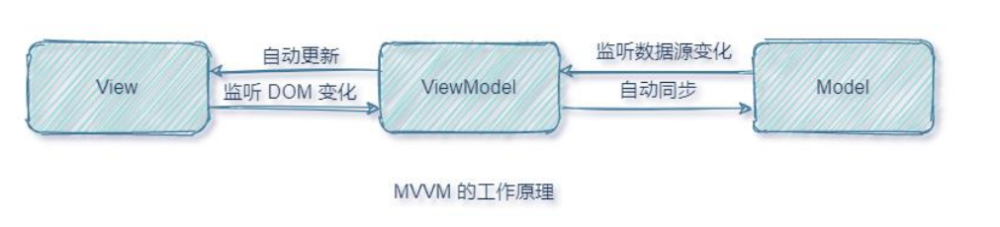
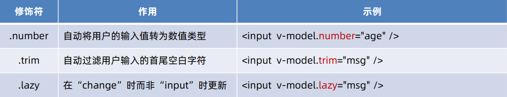

[Vue 3 文档整理 (yuque.com)](https://www.yuque.com/yuqueyonghua0uca7/os6eyf/ov66ta?#CuulB)

在电脑上安装完以下软件或服务：

1.  [NodeJs安装](https://nodejs.org/en)
2.  WebStorm安装或者VsCode  + Volar
3.  在`Microsoft Edge`浏览器访问 [Microsoft Edge Addons](https://microsoftedge.microsoft.com/addons/Microsoft-Edge-Extensions-Home?hl=zh-CN) 搜索 `vue devtools`获取并添加扩展
# 新建项目

```sh
cd <your-project-name> //切换到项目目录
npm create vue@3 //启动 Vite 驱动的 Vue 项目的推荐方法
npm install  //安装项目依赖，node_modules
npm run dev  //运行该项目
npm run build  //构建静态文件，将应用发布到生产环境，生产dist目录
```

# 目录结构

| 目录           | 说明                                                  |
| -------------- | ----------------------------------------------------- |
| .vscode        | //vscode工具的配置文件夹                              |
| node_modules   | //Vue项目的运行依赖文件夹                             |
| public         | //资源文件夹(浏览器图标)                              |
| src            | //源码文件夹                                          |
| gitignore      | //git忽略文件                                         |
| index.html     | //单页面程序唯一的界面文件                            |
| package.json   | //信息描述文件                                        |
| README. md     | //注释文件                                            |
| vite.config.js | //Vue配置文件                                         |
| App.vue        | //用来编写待渲染的模板结构，也成为根组件              |
| main.js        | //项目的主入口文件，把 App.vue 渲染到了 index.html 中 |

# 简介

## 1.1：什么是 Vue

`Vue`是一款用于构建用户界面的`JavaScript`框架；它基于标准 `HTML`、`CSS`和 `JavaScript`构建，并提供了一套声明式的、组件化的编程模型，帮助你高效地开发用户界面

## 1.2：MVVM 工作原理

MVVM 指的是**Model**、**View**和**ViewModel**

-   `Model`：页面渲染用到的数据源
-   `View`：页面所渲染的 DOM 结构
-   `ViewModel`：表示 vue 的实例

-   当数据源发生变化时，会被 VM 监听到，VM 会根据最新的数据源自动更新页面的结构
-   当表单元素的值发生变化时，也会被 VM 监听到，VM 会把变化过后最新的值自动同步到 Model 数据源中

## 1.3：Vue 的组件风格书写

Vue 的组件可以按两种不同的风格书写
-   选项式 API
```vue
<script>
    export default { // vue 实例对象（viewModel）
        data: () => ({ // 数据源存放到 data 节点中（model）
            account: 'Abc'
        }),
        methods: { // 方法节点
            changeAccount() {
                this.account += "="
            }
        }
    }
</script>

<template> <!-- 视图区域（view） -->
    <input type="text" v-model="account">  <!-- 使用数据源得 DOM -->
    <button @click="changeAccount">点我更改account</button>
</template>
```
-   组合式 API
```vue
<script setup>
    import { ref } from 'vue' // 引入 API 函数
    let account = ref('Abc') // 数据源
    function chageAccount() { // 方法
        account.value += '='
    }
</script>
```

### 1.3.1：选项式 API
-   使用选项式 API，我们可以用包含多个选项的对象来描述组件的逻辑，例如`data`、`methods`和 `mounted`
-   选项所定义的属性都会暴露在函数内部的`this`上，它会指向当前的组件实例

### 1.3.2：组合式 API
-   通过组合式 API，我们可以使用导入的 API 函数来描述组件逻辑
-   在单文件组件中，组合式 API 通常会与`<script setup>`搭配使用
-   这个`setup`属性是一个标识，告诉 Vue 需要在编译时进行一些处理，让我们可以更简洁地使用组合式 API
-   `<script setup>`中的导入和顶层变量/函数都能够在模板中直接使用

# 3：响应式数据

## 3.1：选项式 API 的响应式数据

如果在组合式 API 中直接声明普通变量的数据源，他们并不具备响应式数据

```vue
<script setup>
    let account = 123 // 普通的变量不具备响应式
    function changeAccount() {
        account+= 1
        console.log(account)
    }

    let emp = { // 普通类型的对象，不具备响应式
        salary: 7000,
        name: 'Annie'
    }
    function changeEmpSalary() {
        emp.salary += 100
        console.log(emp)
    }
</script>

<template>
    <h1>账号：{{ account }}</h1>
    <button @click="changeAccount">点我更改账号</button>
    <hr>
    <h1>学生：{{ student }}</h1>
    <button @click="changeStudentAge">点我更改学生年龄</button>
</template>
```

-   可用`data`选项来声明组件的响应式状态；该`data`选项的值应为返回一个对象的函数；
-   `data`函数返回对象的所有顶层属性都会被代理到组件实例（即方法和生命周期钩子中的 `this`）上

```vue
<script>
    export default {
        data: () => ({ // data 选项的值应该是一个函数返回的对象
            account: 'Abc',
            student: {
                name: 'Jack',
                age: 30
            }
        }),
        methods: {
            changeAccount() {
                // 取出数据源可通过 this（当前组件得实例对象） 关键字获取
                this.account += '='
            },
            changeStudentAge() {
                this.student.age ++
            }
        }
    }
</script>
```

### 3.2.1：`reactive()` 函数

`reactive()`函数只对对象类型有效（对象、数组、`Map`、`Set`），对`string`、`number`和 `boolean`这样的原始类型无效

```vue
<script setup>
    import { reactive } from 'vue'  // 引入 reactive 函数
    
    let account = reactive('Abc') // reactive 对原始类型是无效（不具备响应式）
    function changeAccount() {
        account += '='
        console.log(account)
    }

    let emp = reactive({ // reactive 对象数据源（具有响应式）
        name: 'Jack',
        salary: 7000
    })
    function changeEmpSalary() {
        emp.salary += 1
        console.log(emp)
    }
</script>

<template>
    <hr>
    <h1>账号：{{ account }}</h1>
    <button @click="changeAccount">点我更改账号</button>

    <hr>
    <h1>员工：{{ emp }}</h1>
    <button @click="changeEmpSalary">点我更改员工薪资</button>
</template>

```
### 3.2.2：`ref()` 函数

-   使用`ref()`方法我们可以创建任何类型的响应式数据，获取时需要通过`.value`来进行获取
-   当值为对象类型时，会用`reactive()`自动转换它的 `.value`
```vue
<script setup>
    import { ref } from 'vue' // 引入 ref 函数，来声明响应式对象
    
    let account = ref('Abc') // 使用 ref 函数来声明原始类型的数据源，具备响应式
    function changeAccount() { // 更改账号，控制台查看最新值
        // 通过 ref 函数声明的响应式数据，需要使用 .value 来获取数据的值
        account.value += '='
        console.log(account)
    }

    let emp = ref({ // 使用 ref 函数来声明对象类型的数据源：具备响应式
        salary: 7000,
        name: 'Jack'
    })
    function changeEmpSalary() { // 更改员工薪资，控制台查看最新值
        emp.value.salary += 100 // 通过 ref 函数声明的响应式数据，需要使用 .value 来获取数据的值
        console.log(emp)
    }
</script>

<template>
    <h1>账号：{{ account }}</h1>
    <button @click="changeAccount">点我更改账号</button>

    <hr>
    <h1>员工：{{ emp }}</h1>
    <button @click="changeEmpSalary">点我更改员工薪资</button>
</template>
```

# 4：模板语法

Vue 使用一种基于 HTML 的模板语法，使我们能够声明式地将其组件实例的数据绑定到呈现的 DOM 上

## 4.1：内容渲染指令

内容渲染指令用来辅助开发者渲染 DOM 元素的文本内容

### 4.1.1：`v-text`

使用`v-text`指令，将数据采用纯文本方式填充其空元素中

```sh
<script setup>
    import { reactive } from 'vue'
    let student = reactive({
        name: 'Jack',
        desc: '<h3>我是来自中国的小朋友！</h3>'
    })
</script>

<template>
    <!-- 使用v-text指令，将数据采用纯文本方式填充其空元素中 -->
    <div v-text="student.name"></div>

    <!-- v-text：以纯文本的方式显示数据 -->
    <div v-text="student.desc"></div>

    <!-- 下面的代码会报错：div 元素不是空元素 -->
    <!-- <div v-text="student.name">这是原始的div数据</div> -->
</template>
```

```sh
<script>
export default {
    data: () => ({
        student: {
            name: 'Jack',
            desc: '<h3>我是来自中国的小朋友！</h3>'
        }
    })
}
</script>
```


### 4.1.2：`{{ }}`插值表达式

在元素中的某一位置采用纯文本的方式渲染数据

```vue
<script setup>
import { reactive } from 'vue'

let student = reactive({
    name: 'Jack',
    desc: '<h3>我是来自中国的小朋友！</h3>'
})
</script>

<template>	<!-- 插值表达式：在元素中的某一位置采用纯文本的方式渲染数据 -->
    <div>这是一个 DIV 元素，{{ student.name }}，{{ student.desc }}</div>
</template>
```

```vue
<script>
export default {
    data: () => ({
        student: {
            name: 'Jack',
            desc: '<h3>我是来自中国的小朋友！</h3>'
        }
    })
}
</script>
```

### 4.1.3：`v-html`

使用`v-html`指令，将数据采用HTML语法填充其空元素中

```vue
<script setup>
import { reactive } from 'vue'

let student = reactive({
    name: 'Jack',
    desc: '<h3>我是来自中国的小朋友！</h3>'
})
</script>

<template>
    <!-- 使用v-html指令，将数据采用HTML语法填充其空元素中 -->
    <div v-html="student.name"></div>

    <!-- v-html：以 HTML 语法显示数据 -->
    <div v-html="student.desc"></div>

    <!-- 下面的代码会报错：div 元素不是空元素 -->
    <!-- <div v-html="student.name">这是原始的div数据</div> -->
</template>
```

```vue
<script>
export default {
    data: () => ({
        student: {
            name: 'Jack',
            desc: '<h3>我是来自中国的小朋友！</h3>'
        }
    })
}
</script>
```

## 4.2：双向内容绑定指令

### 4.2.1：`v-model`

`v-model`双向数据绑定指令，视图数据和数据源同步

一般情况下`v-model`指令用在表单元素中：

1. 文本类型的`<input>`和`<textarea>`元素会绑定`value`属性并侦听`input`事件
2. `<input type="checkbox">`和`<input type="radio">`会绑定`checked`属性并侦听`change`事件，将定义的值传入给变量
3. `<select>`会绑定`value`属性并侦听`change`事件

```vue
<script setup>
import { ref } from 'vue' 
let inputText = ref('ABC')  // 单行文本框
let message = ref('本次更新有以下几点：……') // 多行文本框
let open = ref(true) // 开灯（复选框）
let determine = ref('不确定') // 是否确定（复选框）
let likes = ref(['YMQ']) // 兴趣爱好（复选框）
let sex = ref('woman') // 性别（单选按钮）
let level = ref('B') //  // 证书等级（单选下拉框）
let city = ref(['苏C', '苏B']) // 去过的城市（多选下拉框）
</script>

<template>
    <!-- 单行文本框 -->
    <input type="text" v-model="inputText">
    <hr>	<!-- 多行文本框 -->
    <textarea v-model="message"></textarea>
    <hr>	<!-- 默认情况下，复选框的值：true/false -->
    <input type="checkbox" v-model="open"> 灯
    <hr>	<!-- 自定义复选框值： true-value/false-value -->
    <input type="checkbox" true-value="确定" false-value="不确定" v-model="determine"> 是否确定

    <hr>
    <input type="checkbox" value="LQ" v-model="likes"> 篮球
    <input type="checkbox" value="ZQ" v-model="likes"> 足球
    <input type="checkbox" value="YMQ" v-model="likes"> 羽毛球
    <input type="checkbox" value="PPQ" v-model="likes"> 乒乓球

    <hr>
    <input type="radio" value="man" v-model="sex"> 男
    <input type="radio" value="woman" v-model="sex"> 女

    <hr>
    证书等级：
    <select v-model="level">
        <option value="C">初级</option>
        <option value="B">中级</option>
        <option value="A">高级</option>
    </select>

    <hr>
    去过的城市：
    <select multiple v-model="city">
        <option value="苏A">南京</option>
        <option value="苏B">无锡</option>
        <option value="苏C">徐州</option>
        <option value="苏D">常州</option>
    </select>
</template>
```

```vue
<script>
export default {
    data: () => ({
        inputText: 'ABC', // 单行文本框
        message: '本次更新有以下几点：……', // 多行文本框
        open: true, // 开灯（复选框）
        determine: '不确定', // 是否确定（复选框）
        likes: ['YMQ'], // 兴趣爱好（复选框）
        sex: 'woman', // 性别（单选按钮）
        level: 'B', // 证书等级（单选下拉框）
        city: ['苏C', '苏B'], // 去过的城市（多选下拉框）
    })
}
</script>
```

### 4.2.2：`v-model`的修饰符



```vue
<script setup>
import { ref } from 'vue' 

let age = ref(20)
let nickname = ref('')
</script>

<template>
    <p>将用户输入的值转成数值 .number，懒更新 .lazy</p>
    <!-- 。number 将用户输入的值转成数值，如果用户输入的内容无法转成数字，将不会更新数据源 -->
    <!-- .lazy 在 change 跟新数据源，而不是 input  -->
    <input type="text" v-model.lazy.number="age">

    <hr>
    <p>去掉首尾空白字符</p>
    <input type="text" v-model.trim="nickname">
</template>
```

```vue
<script>
export default {
    data: () => ({
        age: 20,
        nickname: ''
    })
}
</script>
```

## 4.3：双向属性绑定指令

- 响应式地绑定一个元素属性，应该使用`v-bind:`指令 + 属性进行绑定如：`v-bind:src`
- 如果绑定的值是`null`或者`undefined`，那么该属性将会从渲染的元素上移除
- 因为`v-bind`非常常用，我们提供了特定的简写语法`:src`

```vue
<script setup>
import { reactive } from 'vue'
let picture = reactive({
    src: 'https://uploadfile.bizhizu.cn/2015/0424/20150424015229741.jpg', // 图像地址
    width: 200 // 显示宽度
})
</script>

<template>
    <input type="range" min="100" max="500" v-model="picture.width">
    <hr>
    <!-- v-bind: 为 src 属性绑定指定的数据源 -->
    
    <hr>
    <!-- : 是 v-bind: 的缩写形式 -->
    
    <hr>
    <!-- 如果绑定的值是 null 或者 undefined，那么该属性将会从渲染的元素上移除 -->
    <button @click="picture.width = null">设置宽度为NULL</button>
</template>
```

```vue
<script>
export default {
    data: () => ({
        picture: {
            width: 200,
            src: 'https://uploadfile.bizhizu.cn/2015/0424/20150424015229741.jpg'
        }
    })
}
</script>
```


### 4.3.1：动态绑定属性值对象

直接使用`v-bind`来为元素绑定多个属性及其值

```vue
<script setup>
import {reactive} from 'vue'
let attrs = reactive({
    class: 'error',
    id: 'borderBlue'
})
</script>

<template>  <!-- 直接使用 v-bind 来为元素绑定多个属性及其值 -->
    <button v-bind="attrs">我是一个普通的按钮</button>
</template>

<style>
    .error {
        background-color: rgb(167, 58, 58);
        color: white;
    }

    #borderBlue {
        border: 2px solid rgb(44, 67, 167);
    }
</style>
```

```vue
<script>
    export default {
        name: 'App',
        data: () => ({
            attrs: {
                class: 'redBack',
                id: 'btnBorderBlue'
            }
        })
    }
</script>
```

渲染结果：

```vue
<button class="redBack" id="btnBorderBlue">我是一个普通按钮</button>
```

### 4.3.2：绑定`class`和`style`属性

`class`和`style`可以和其他属性一样使用`v-bind`将它们和动态的字符串绑定；但是，在处理比较复杂的绑定时，通过拼接生成字符串是麻烦且易出错的；因此，`Vue`专门为`class`和`style`的`v-bind`用法提供了特殊的功能增强；除了字符串外，表达式的值也可以是对象或数组。

#### 4.3.2.1：`class`属性绑定

**绑定对象**

```vue
<script setup>
import { ref, reactive } from 'vue'
let btnClassObject = reactive({
    error: false, // 主题色
    flat: false // 阴影
})
let capsule = ref(false)// 胶囊
let block = ref(false)// 块
</script>

<template>
    <input type="checkbox" v-model="btnClassObject.error"> error
    <input type="checkbox" v-model="btnClassObject.flat"> flat
    <br>
    <br>
    <button :class="btnClassObject">我是一个普通的按钮</button>

    <hr>
    <input type="checkbox" v-model="capsule"> 胶囊
    <input type="checkbox" v-model="block"> 块
    <br>
    <br>
    <button :class="{ 'rounded': capsule, 'fullWidth':  block }">我是一个普通的按钮</button>
</template>

<style>
button {
    border: none;
    padding: 15px 20px;
    background-color: rgb(179, 175, 175);
}
.error {
    background-color: rgb(167, 58, 58);
    color: white;
}
.flat {
    box-shadow: 0 0 8px gray;
}
.rounded {
    border-radius: 100px;
}
.fullWidth {
    width: 100%;
}
</style>
```

```vue
<script>
export default {
    data: () => ({
        btnClassObject: {
            error: false, // 主题色
            flat: false // 阴影
        },
        capsule: false, // 胶囊
        block: false // 块
    })
}
</script>
```

**绑定数组**

```vue
<script setup>
import { ref, reactive } from 'vue'
let btnTheme = ref([]) // 按钮class数组
let capsule = ref(false)// 胶囊
let widthTheme = ref([])// 宽度数组
</script>

<template>
    <input type="checkbox" value="error" v-model="btnTheme"> error
    <input type="checkbox" value="flat" v-model="btnTheme"> flat
    <br>
    <br>
    <!-- 直接使用数组数据源，数组中有哪些值，直接在该元素的class里出现对应的类名 -->
    <button :class="btnTheme">我是一个普通的按钮</button>
    <hr>
    <input type="checkbox" v-model="capsule"> 胶囊
    <input type="checkbox" value="fullWidth" v-model="widthTheme"> 块
    <br>
    <br>
    <!-- 数组和对象一起使用 -->
    <button :class="[{ 'rounded': capsule }, widthTheme]">我是一个普通的按钮</button>
</template>

<style>
button {
    border: none;
    padding: 15px 20px;
    background-color: rgb(179, 175, 175);
}
.error {
    background-color: rgb(167, 58, 58);
    color: white;
}
.flat {
    box-shadow: 0 0 8px gray;
}
.rounded {
    border-radius: 100px;
}
.fullWidth {
    width: 100%;
}
</style>
```

```vue
<script>
export default {
    data: () => ({
        btnTheme: [],// 按钮class数组
        capsule: false,// 胶囊
        widthTheme: [] // 宽度数组
    })
}
</script>
```


#### 4.3.2.2：`style`属性绑定

**绑定数组**

```vue
<script setup>
import { ref, reactive } from 'vue'
let btnTheme = ref([]) // 按钮class数组
let capsule = ref(false)// 胶囊
let widthTheme = ref([])// 宽度数组
</script>

<template>
    <input type="checkbox" value="error" v-model="btnTheme"> error
    <input type="checkbox" value="flat" v-model="btnTheme"> flat
    <br>
    <br>
    <!-- 直接使用数组数据源，数组中有哪些值，直接在该元素的class里出现对应的类名 -->
    <button :class="btnTheme">我是一个普通的按钮</button>
    <hr>
    <input type="checkbox" v-model="capsule"> 胶囊
    <input type="checkbox" value="fullWidth" v-model="widthTheme"> 块
    <br>
    <br>
    <!-- 数组和对象一起使用 -->
    <button :class="[{ 'rounded': capsule }, widthTheme]">我是一个普通的按钮</button>
</template>

<style>
button {
    border: none;
    padding: 15px 20px;
    background-color: rgb(179, 175, 175);
}

.error {
    background-color: rgb(167, 58, 58);
    color: white;
}

.flat {
    box-shadow: 0 0 8px gray;
}

.rounded {
    border-radius: 100px;
}

.fullWidth {
    width: 100%;
}
</style>
```

```vue
<script>
export default {
    data: () => ({
        btnTheme: [],// 按钮class数组
        capsule: false,// 胶囊
        widthTheme: [] // 宽度数组
    })
}

</script>
```

## 4.4：条件渲染指令

### 4.4.1：`v-if`、`v-else-if`、`v-else`

1. `v-if` 指令用于条件性地渲染元素；该内容只会在指令的表达式返回真值时才被渲染
2. `v-else-if`提供的是相应于`v-if`的`else if`区块，它可以连续多次重复使用
3. 你也可以使用`v-else`为`v-if`添加一个`else`区块
4. `v-else`和`v-else-if`指令必须配合`v-if`指令一起使用 ，否则它将不会被识别，而且语句块中间不能出现无关其他元素
5. `v-if`支持在`<template>`元素上使用，这只是一个不可见的包装器元素，最后渲染的结果并不会包含这个 `<template>`元素

```vue
<script setup>
import { ref } from 'vue'
let isShow = ref(false)  // 是否显示
let age = ref(20)  // 年龄
let week = ref(3)  // 周几
</script>

<template>
    是否显示：<input type="checkbox" v-model="isShow">
    <!--v-if：指令表达式为真时才会渲染该元素为true时会创建该元素，为false时会销毁该元素-->
    <h3 v-if="isShow">这是一个普通的标题标签</h3>

    <hr>
    年龄: <input type="range" min="0" max="100" v-model="age"> {{ age }}
    <!-- v-if：可以配合 v-else-if 和 v-else 来搭建多重判断条件，他们中间不要参杂无关紧要的元素-->
    <h1 v-if="age < 18">未成年</h1>
    <!-- <span>无关紧要的元素</span> -->
    <h2 v-else-if="age < 35">青年</h2>
    <h3 v-else-if="age < 50">中年</h3>
    <h4 v-else>老年</h4>

    <hr>
    周几: <input type="range" min="1" max="7" v-model="week"> {{ week }}
    <!-- v-if：可以配合 template 元素使用，最后渲染的结果并不会包含这个 <template>元素 -->
    <template v-if="week == 1 || week == 3 || week == 5 || week == 7">
        <h1>可以游泳</h1>
    </template>
    <template v-else>
        <h1>不可以游泳</h1>
    </template>
</template>
```

```vue
<script>
export default {
    data: () => ({
        isShow: false, // 是否显示
        age: 20, // 年龄
        week: 3 // 周几
    })
}
</script>
```


### 4.4.2：`v-show`

- `v-show`按条件显示一个元素的指令
-  `v-show`会在 DOM 渲染中保留该元素
- `v-show`仅切换了该元素上名为`display`的 CSS 属性
- `v-show`不支持在`<template>`元素上使用，也不能和`v-else`搭配使用

```vue
<script setup>
import { ref } from 'vue'
let isShow = ref(false)  // 是否显示
let age = ref(20)  // 年龄
let week = ref(3)  // 周几
</script>

<template>
    是否显示：<input type="checkbox" v-model="isShow">
    <!-- v-show：指令表达式为真时才会渲染该元素无论该指令的表达式是否 true 或 false，该元素在元素中是保留该元素的
        为 true 时会删除该元素的 display:none 样式，为 false 时会给该元素添加 display:none 样式 -->
    <h3 v-show="isShow">这是一个普通的标题标签</h3>

    <hr>
    年龄: <input type="range" min="0" max="100" v-model="age"> {{ age }}
    <h1 v-show="age < 18">未成年</h1>
    <h2 v-show="age >= 18 && age < 35">青年</h2>
    <h3 v-show="age >= 35 && age < 50">中年</h3>
    <h4 v-show="age >= 50">老年</h4>

    <hr>
    周几: <input type="range" min="1" max="7" v-model="week"> {{ week }}
    <!-- v-show：不可以配合 template 元素使用 -->
    <!-- <template v-show="week == 1 || week == 3 || week == 5 || week == 7">
        <h1>可以游泳</h1>
    </template>
    <template v-show="week == 12 || week == 4 || week == 6">
        <h1>不可以游泳</h1>
    </template> -->
</template>
```

```vue
<script>
export default {
    data: () => ({
        isShow: false, // 是否显示
        age: 20, // 年龄
        week: 3// 周几
    })
}
</script>
```


### **4.4.3：`v-if`和`v-show`的区别**

- `v-if`是“真实的”按条件渲染，因为它确保了在切换时，条件区块内的事件监听器和子组件都会被销毁与重建
- `v-if`也是惰性的：如果在初次渲染时条件值为`false`，则不会做任何事；条件区块只有当条件首次变为`true`时才被渲染
- `v-show`元素无论初始条件如何，始终会被渲染，只有 CSS`display`属性会被切换
- `v-if`有更高的切换开销，而`v-show`有更高的初始渲染开销；如果需要频繁切换，则使用`v-show` 较好；如果在运行时绑定条件很少改变，则`v-if`会更合适

## 4.5：事件绑定指令

我们可以使用`v-on:`指令 (简写为`@`) 来监听 DOM 事件，并在事件触发时执行对应的`JavaScript`

用法：`v-on:click=""`或 `@click=""`

```vue
<script setup>
import { ref } from 'vue'
let volume = ref(5) // 音量[0, 10]

function addVolume() {	// 增大音量
    if (volume.value !== 10) {	// 如果音量没有在最高值，则添加音量
        volume.value++
    }
}
function subVolume() {	// 减小音量
    if (volume.value !== 0) {	// 如果音量没有在最小值，则减小音量
        volume.value--
    }
}
function setVolume(value) {	// 设置音量
    if (value >= 0 && value <= 10) {	 // 判断音量是否在取值范围之间
        volume.value = value
    }
}
</script>

<template>
    <h3>当前音量：{{ volume }}</h3>
    <!-- v-on: 事件绑定 -->
    <button v-on:click="addVolume">添加音量</button>
    <button v-on:click="subVolume">减小音量</button>

    <hr>
    <!-- @ 是 v-on: 的缩写 -->
    <button @click="setVolume(0)">静音</button>
    <button @click="setVolume(5)">音量适中</button>
    <button @click="setVolume(10)">音量最大</button>
</template>
```

```vue
<script>
export default {
    data: () => ({
        volume: 5  // 音量[0, 10]
    }),
    methods: {
        addVolume() {	// 添大音量
            if (this.volume !== 10) {	// 如果音量没有在最高值，则添加音量
                this.volume++
            }
        },
        subVolume() {	// 减小音量
            if (this.volume !== 0) {	// 如果音量没有在最小值，则减小音量
                this.volume--
            }
        },
        setVolume(value) {	// 设置音量
            if (value >= 0 && value <= 10) {	// 判断音量是否在取值范围之间
                this.volume = value
            }
        }
    }
}
</script>
```


### 4.5.1：事件修饰符

| **事件修饰符** | **说明**                                                     |
| -------------- | ------------------------------------------------------------ |
| `.prevent` | **阻止默认行为**                                             |
| `.passive` | **向浏览器表明了不想阻止事件的默认行为**                       |
| `.capture` | **以捕获模式触发当前的事件处理函数**                         |
| `.once`    | **绑定的事件只触发1次**                                      |
| `.self`    | **只有在`event.target`是当前元素自身时触发事件处理函数** |
| `.stop` | **阻止事件冒泡**           |

#### 4.5.1.1：`.prevent`

`.prevent`：阻止该事件的默认行为

```vue
<script setup>
function say(name) {	// 打招呼
    window.alert('你好：' + name)
}
</script>

<template>
    <!-- .prevent 修饰符阻止了超链接的默认行为（跳转到百度页） -->
    <a href="http://www.baidu.com" @click.prevent="say('baiDu')">百度</a>
</template>
```

```vue
<script>
export default {
    methods: {
        // 打招呼
        say(name) {
            window.alert('你好：' + name)
        }
    }
}
</script>
```


#### 4.5.1.2：`.stop`

`.stop`：阻止事件产生的冒泡现象

```vue
<script setup>
function say(name) { // 打招呼
    console.log('你好：' + name)
}
</script>

<template>
    <div class="divArea" @click="say('DIV')">
        <!-- .stop：阻止产生冒泡事件 -->
        <button @click.stop="say('BUTTON')">冒泡按钮</button>
    </div>
</template>

<style>
.divArea {
    padding: 30px;
    border: 2px solid blue;
}
</style>
```

```vue
<script>
export default {
    methods: {
        say(name) { // 打招呼
            console.log('你好：' + name)
        }
    }
}
</script>
```


#### 4.5.1.3：`.once`

`.once`：绑定的事件只触发`1`次

```vue
<script setup>
function say(name) {	// 打招呼
    window.alert('你好：' + name)
}
</script>

<template>
    <!-- .once：绑定的事件只触发一次 -->
    <button @click.once="say('BUTTON')">点我试一下</button>
</template>
```

```vue
<script>
export default {
    methods: {
        say(name) { // 打招呼
            window.alert('你好：' + name)
        }
    }
}
</script>
```


#### 4.5.1.4：`.self`

`.self`：只有在`event.target`是当前元素自身时触发事件处理函数（默认点击父元素时也会触发函数）。

```vue
<script setup>
function say(name) {	// 打招呼
    window.alert('你好：' + name)
}
</script>

<template>
    <!-- .self：只在该元素上触发事件有效，其子元素无效 -->
    <div class="divArea" @click.self="say('DIV')">
        <button>我是一普通的按钮</button>
    </div>
</template>

<style>
.divArea {
    padding: 30px;
    border: 2px solid blue;
}
</style>
```

```vue
<script>
export default {
    methods: {
        say(name) {	// 打招呼
            window.alert('你好：' + name)
        }
    }
}
</script>
```


#### 4.5.1.5：`.capture`

`.capture`给元素添加一个监听器

1. 当元素事件产生冒泡时，先触发的是该修饰符的元素的事件
2.  如果有多个该修饰符，则由外向内依次触发

```vue
<script setup>
function say(name) {	// 打招呼
    console.log('你好：' + name)
}
</script>

<template>
    <!--  .capture 给元素添加一个监听器
        1：当元素事件产生冒泡时，先触发的是该修饰符的元素的事件
        2：如果有多个该修饰符，则由外向内依次触发 -->
    <div class="divArea" @click.capture="say('DIV-1')">
        <div class="divArea" @click="say('DIV-2')">
            <div class="divArea" @click.capture="say('DIV-3')">
                <button>我是一普通的按钮</button>
            </div>
        </div>
    </div>
</template>

<style>
.divArea {
    padding: 30px;
    border: 2px solid blue;
}
</style>
```

```vue
<script>
export default {
    methods: {
        // 打招呼
        say(name) {
            console.log('你好：' + name)
        }
    }
}
</script>
```


#### 4.5.1.6：`.passive`

`.passive`：不阻止事件的默认行为，与`.prevent`不要同时使用

```vue
<script setup>
function eventPrevent() {
    event.preventDefault()	// 阻止事件默认行为
}
</script>

<template>
    <!-- .passive：先执行默认行为，不考虑执行的代码中是否包含 event.preventDefault() -->
    <a href="http://www.baidu.com" @click.passive="eventPrevent">百度</a>
</template>
```

```vue
<script>
export default {
    methods: {
        eventPrevent() {
            event.preventDefault()	// 阻止事件默认行为
        }
    }
}
</script>
```


### 4.5.2：按键修饰符

按键别名：`.enter`、`.tab`、`.esc`、`.space`、`.up`、`.down`、`.left`、`.right`、`.delete` (捕获`Delete`和`Backspace`两个按键)

系统修饰符：`.ctrl`、`.alt`、`.shift`、`.meta`

准确的修饰符：`.exact`

```vue
<script setup>
function showMessage(message) {	// 弹出消息
    window.alert(message)
}
</script>

<template>
    按下的键中包含 Enter 键事件： <input type="text" @keydown.enter="showMessage('你按下了 Enter 键')">
    <hr>
    按下的键中包含 Shift Enter 键事件：<input type="text" @keydown.enter.shift="showMessage('你按下了 Shift + Enter 键')" />
    <hr>
    按下的键只有 Shift Enter 键事件：<input type="text" @keydown.enter.shift.exact="showMessage('你只按下了 Shift + Enter 键')" />
</template>
```

```vue
<script>
export default {
    methods: {
        showMessage(message) {	// 弹出消息
            window.alert(message)
        }
    }
}
</script>
```


### 4.5.3：鼠标按键修饰符

鼠标按键修饰符：`.left`、`.right`、`.middle`

```vue
<script setup>
    function showTest(text) {
        window.alert(text)
    }
</script>

<template>
    <!-- 按下的键中包含，鼠标左键 -->
    <button @mousedown.left="showMessage('按下鼠标左键')">按下鼠标左键</button>
    <hr>
    <!-- 按下的键中包含，鼠标中键 -->
    <button @mousedown.middle="showMessage('按下鼠标中键')">按下鼠标中键</button>
    <hr>
    <!-- 按下的键中包含，鼠标右键 -->
    <button @mousedown.right="showMessage('按下鼠标右键')">按下鼠标右键</button>
</template>
```

```vue
<script>
export default {
    methods: {
        showMessage(message) {	// 弹出消息
            window.alert(message)
        }
    }
}
</script>
```


## 4.6：列表渲染指令

使用`v-for`指令基于一个数组来渲染一个列表

### 4.6.1：`v-for`渲染数组

语法：

`in`前1或2个参数：`item in items` 	`(value, index) in items` 
				`value`：值
				`index`：索引 
				`items`：需要循环的数组

```vue
<script setup>
import { ref } from 'vue'
let subject = ref([	// 课程
    { id: 1, name: 'Vue' },
    { id: 2, name: 'Java' },
    { id: 3, name: 'UI设计' },
    { id: 4, name: 'Hadoop' },
    { id: 5, name: '影视后期' },
])
</script>

<template>
    <h6>v-for 渲染数组， v-for="item in itmes"</h6>
    <ul>
        <li v-for="sub in subject">
            编号：{{ sub.id }} --- 名称：{{ sub.name }}
        </li>
    </ul>

    <hr> <!-- 解构对象 -->
    <h6>v-for 渲染数组， v-for="{ 解构…… } in itmes"</h6>
    <ul>
        <li v-for="{ id , name } in subject">
            编号：{{ id }} --- 名称：{{ name }}
        </li>
    </ul>

    <hr>
    <h6>v-for 渲染数组， v-for="(value, index) in itmes"</h6>
    <ul>
        <li v-for="(sub, index) in subject">
            编号：{{ sub.id }} --- 名称：{{ sub.name }} --- 索引：{{ index }}
        </li>
    </ul>

    <hr>  <!-- 解构对象 -->
    <h6>v-for 渲染数组， v-for="({ 解构…… }, index) in itmes"</h6>
    <ul>
        <li v-for="({ id , name } , index) in subject">
            编号：{{ id }} --- 名称：{{ name }} --- 索引：{{ index }}
        </li>
    </ul>
</template>
```

```vue
<script>
export default {
    data: () => ({
        subject: [	// 课程
            { id: 1, name: 'Vue' },
            { id: 2, name: 'Java' },
            { id: 3, name: 'UI设计' },
            { id: 4, name: 'Hadoop' },
            { id: 5, name: '影视后期' },
        ]
    })
}
</script>
```


### 4.6.2：`v-for`渲染对象

使用`v-for`来遍历一个对象的所有属性，遍历的顺序会基于对该对象调用`Object.keys()`的返回值来决定

语法：

1. `in`前一个参数：`value in object` 
2. `in`前两个参数：`(value, name) in object` 
3. `in`前三个参数：`(value, name, index) in object` 
   `value`：属性值 
   `name`：键 
   `index`：索引 
   `items`：需要循环的对象

```vue
<script setup>
import { reactive } from 'vue'
let student = reactive({
    styNum: '007', // 学号
    name: 'Jack', // 名字
    age: 18 //年龄
})
</script>

<template>
    <h6>v-for 渲染对象， v-for="value in object"</h6>
    <ul>
        <li v-for="value in student">
            {{ value }}
        </li>
    </ul>

    <hr>
     <h6>v-for 渲染对象， v-for="(value, name) in object"</h6>
    <ul>
        <li v-for="(value, name) in student">
            属性名：{{ name }} --- 属性值： {{ value }}
        </li>
    </ul>

    <hr>
     <h6>v-for 渲染对象， v-for="(value, name, index) in object"</h6>
    <ul>
        <li v-for="(value, name, index) in student">
            属性名：{{ name }} --- 属性值： {{ value }} --- 索引：{{ index }}
        </li>
    </ul>
</template>
```

```vue
<script>
export default {
    data: () => ({
        student: {
            styNum: '007', // 学号
            name: 'Jack', // 名字
            age: 18 // 年龄
        }
    })
}
</script>
```


### 4.6.3：通过 key 管理状态

当列表的数据变化时，默认情况下，`vue`会尽可能的复用已存在的`DOM`元素，从而提升渲染的性能；但这种默认的性能优化策略，会导致有状态的列表无法被正确更新。

为了给`vue`一个提示，以便它能跟踪每个节点的身份，从而在保证有状态的列表被正确更新的前提下，提升渲染的性能；此时，需要为每项提供一个唯一的`key`属性：

`key`的注意事项：

- `key`的类型只能是`Number/String`
- `key`值必须具有唯一性
- 建议循环的列表有一个属性当`key`（该属性的值在此列表中唯一）
- 不使用索引当`key`
- 建议使用`v-for`指令时一定要指定`key`的值

```vue
<script setup>
import { ref } from 'vue'

let subject = ref([	// 课程
    { id: 1, name: 'Vue' },
    { id: 2, name: 'Java' },
    { id: 3, name: 'Hadoop' }
])

function addSubject() {	// 添加课程
    subject.value.unshift({ id: 4, name: 'Python' })	// （数组最前面）添加
}
</script>

<template>
    <button @click.once="addSubject">添加课程（数组最前面）</button>

    <h3>不使用key值</h3>
    <ul>
        <li v-for="sub in subject">
            <input type="checkbox">
            {{ sub }}
        </li>
    </ul>

    <hr>
    <h3>使用索引当key值</h3>
    <ul>
        <li v-for="(sub, index) in subject" :key="index">
            <input type="checkbox">
            {{ sub }}
        </li>
    </ul>

    <hr>
    <h3>使用列表属性当key值（该属性必须再此列表中唯一）</h3>
    <ul>
        <li v-for="sub in subject" :key="sub.id">
            <input type="checkbox">
            {{ sub }}
        </li>
    </ul>
</template>
```

```vue
<script>
export default {
    data: () => ({
        subject: [
            { id: 1, name: 'Vue' },
            { id: 2, name: 'Java' },
            { id: 3, name: 'Hadoop' }
        ]
    }),
    methods: {
        addSubject() {	// 添加课程
            this.subject.unshift({ id: 4, name: 'Python' })	// （数组最前面）添加
        }
    }
}
</script>
```

