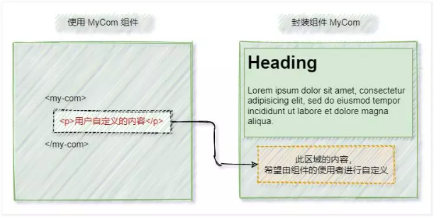

## 7.1：注册组件
一个`Vue`组件在使用前需要先被“注册”，这样`Vue`才能在渲染模板时找到其对应的实现；组件注册有两种方式：全局注册、局部注册

### 7.1.1：全局注册

可使用`app.component(name, Component)` 注册组件的方法，在此应用的任意组件的模板中使用
- `name`：注册的名字

- `Component`：需要注册的组件

  `main.js` 中全局注册组件


**需要全局注册的组件 Login.vue**

```vue
<script setup>
import { ref } from 'vue';

let account = ref('') // 账号
let password = ref('') // 密码
</script>

<template>
    <hr>
    账号：<input type="text" v-model="account">
    <br>
    密码：<input type="password" v-model="password">
    <br>
    <button>登录</button>
    <hr>
</template>
```

```vue
<script>
export default {
    data: () => ({
        account: '', // 账号
        password: ''  // 密码
    })
}
</script>
```


**main.js 中全局注册组件**

```vue
import { createApp } from 'vue'
import App from './App.vue'
import Login from './components/Login.vue' 	// 1：引入需要被注册的组件

const app = createApp(App)
app.component('MLogin', Login)	// 2：全局注册组件
app.mount('#app')
```


**我们使用注册的组件**

```vue
<template>
    <h3>登录系统</h3>
    <MLogin />	<!-- 使用全局注册的组件 -->
</template>
```


### 7.1.2：局部注册

局部注册的组件需要在使用它的父组件中显式导入，并且只能在该父组件中使用
在选项式 API 中，我们可以使用`components`选项来局部注册组件

```vue
<script>
import LoginVue from './components/Login.vue';	// 1：引入需要注册的组件

export default {
    components: { LoginVue }	// 2：注册组件选项
}	
</script>

<template>
    <h3>登录系统</h3>
    <LoginVue />	<!-- 3：使用全局注册的组件 -->
</template>
```

在组合式 API 中的`<script setup>`内，直接导入的组件就可以在模板中直接可用，无需注册
```vue
<script setup>
import LoginVue from './components/Login.vue';	// 1：引入需要注册的组件，无需注册
</script>
```

## 7.2：传递数据【父 -> 子】

如果父组件向子组件进行传递数据，那么我们需要在子组件中声明`props`来接收传递数据的属性，可采用字符串数组式或对象式来声明`props`

父组件向子组件传递数据，在使用组件的标签上采用属性方式传递的`props`值，可使用`v-bind:`或`:`来绑定属性

组件中`props`中的数据是只读的，不可直接更改，只能通过父组件进行更改

> 声明与使用
>
> 1.  在选项式 API 中
> 	（1.  我们可以提供`props`选项来声明接收传递的数据
> 	（2.  在`JS`中可使用`this.$props`来访问声明的自定义的属性
> 	（3.  在视图模板中，可直接访问`props`中声明的自定义属性
> 2.  在组合式 API 中
> 	(1.  我们可以采用`defineProps`宏来声明接收传递的数据
> 	(2.  在`JS`中可使用`defineProps`返回的对象来访问声明的自定义的属性
> 	(3.  在视图模板中，可直接访问`defineProps`中声明的自定义属性
>

#### 7.2.1：字符串数组的形式

```vue
<script setup> //字符串数组的形式【组合式】
	defineProps(['flat', 'title']) // 使用 defineProps 宏来声明父组件传过来的属性名
</script>

<script> //字符串数组的形式【选项式】
export default {
	props: ['flat', 'title'] // 使用 props 选项来声明父组件传过来的属性值
}
</script>
```

需要注册的组件 Button.vue【组合式】

```vue
<script setup>	
let propsData = defineProps(['title', 'error', 'flat'])	// 声明接收父组件传递的属性值：自定义属性

function showPropsData() {	
    console.log(propsData) // 打印对象的值
    console.log(propsData.title) // 通过 defineProps 返回对象来访问 props 的内容
    console.log(propsData.error)
    console.log(propsData.flat)
}
function changeErrorProps() { // 不能直接修改 props 的数据，因为是只读的
    propsData.error = !propsData.error
}
</script>

<template> <!-- 在视图模板上，可直接使用 props 中的属性 -->
    <button :class="{ error, flat }" @click="showPropsData" @mousedown.right="changeErrorProps">
        {{ title }}
    </button>
</template>

<script>
    export default {	// 在 props 选项里使用字符串数组的形式来声明自定义的属性
        props: ['flat', 'title', 'error'],
        methods: {
            showPropsData() {
                console.log(this.$props)	// 在选项式 API 的 JS 代码中，通过 this.$props 来访问 props 的内容
                console.log(this.$props.title)
                console.log(this.$props.error)
                console.log(this.$props.flat)
            },
            changeErrorProps(){
                this.$props.error = !this.$props.error	// 不能直接修改 props 的数据，因为是只读的
            }
        }
    }
</script>
```

父组件使用 Button.vue 组件【组合式】

```vue
<script setup>
import { ref } from 'vue';
import ButtonVue from './components/Button.vue';

let isError = ref(false) // 主题
let isFlat = ref(false) // 阴影
let btnText = ref('普通按钮') // 按钮文本
</script>

<template>
    主题：<input type="checkbox" v-model="isError">
    阴影：<input type="checkbox" v-model="isFlat">
    按钮文本：<input type="text" v-model="btnText">
    <hr>	<!-- 父向子传值，可采用属性的方式赋值 -->
    <ButtonVue :title="btnText" :error="isError" :flat="isFlat"/>
</template>

<script>
import ButtonVue from './components/Button.vue';
export default {
    components: { ButtonVue },
    data: () => ({
        isError: false, 	// 主题
        isFlat: false, 		// 阴影
        btnText: '普通按钮'	// 按钮文本
    })
}
</script>
```


#### 7.2.2：对象的形式
对象形式声明的`props`，可以对传来的值进行校验，如果传入的值不满足类型要求，会在浏览器控制台中抛出警告来提醒使用者

对象形式声明的`props`，`key`是`prop`的名称，值则为约束的条件

> 对象中的属性：
> `type`：类型，如`String`、`Number`、`Boolean`、`Array`、`Object`、`Date`、`Function`、`Symbol`
> `default`：默认值；对象或者数组应当用工厂函数返回
> `required`：是否必填，布尔值
> `validator`：自定义校验，函数类型

```vue
<script setup> //对象形式声明 props【组合式】
    defineProps({  // 使用 defineProps 宏来声明父组件传过来的属性名（如propA）
        propA: Number, // （给出 `null` 和 `undefined` 值则会跳过任何类型检查）
        propB: [String, Number], // 多种可能的类型
        propC: { 
            type: String,
            required: true // 必传，且为 String 类型
        },
        propD: {
            type: Number, 
            default: 100 // Number 类型的默认值
        },
        propE: {  
            type: Object, // 对象类型的默认值
            default(rawProps) { // 该函数接收组件所接收到的原始 prop 作为参数。
                return { message: 'hello' }  // 必须从一个工厂函数返回, 对象或数组的默认值
            }
        },
        propF: { 
            validator(value) {// 自定义类型校验函数
                return ['success', 'warning', 'danger'].includes(value) // The value must match one of these strings
            }
        },
        propG: { 
            type: Function, // 函数类型的默认值
            default() { 
                return 'Default function' // 不像对象或数组的默认，这不是一个工厂函数。这会是一个用来作为默认值的函数
            }
        }
    })
</script>
```

```vue
<script> //对象形式声明 props【选项式】
    export default {
        props: {  // 基础类型检查
            propA: Number, //（给出 `null` 和 `undefined` 值则会跳过任何类型检查）
            propB: [String, Number],  // 多种可能的类型
            propC: {
                type: String, 
                required: true // 必传，且为 String 类型
            },
            propD: {
                type: Number, 
                default: 100  // Number 类型的默认值
            },
            propE: {
                type: Object, // 对象类型的默认值
                default(rawProps) { // 工厂函数会收到组件所接收的原始 props , 作为参数
                    return { message: 'hello' } // 对象或者数组应当用工厂函数返回
                }
            },
            propF: {
                validator(value) { // 自定义类型校验函数
                    return ['success', 'warning', 'danger'].includes(value) // The value must match one of these strings
                }
            },
            propG: {
                type: Function, // 函数类型的默认值
                default() { // 不像对象或数组的默认，这不是一个工厂函数。这会是一个用来作为默认值的函数
                    return 'Default function'
                }
            }
        }
    }
</script>
```

需要注册的组件 Button.vue【组合式】

```vue
<script setup> // 声明接收父组件传递的属性值：自定义属性
let propsData = defineProps({
    title: {
        type: String,
        required: true
    },
    error: Boolean,
    flat: Boolean,
    tips: {
        type: String,
        default: '我是一个普通的按钮'
    }
})

function showPropsData() { // 在 JS 中，需要通过 defineProps 返回对象来访问 props 的内容
    console.log(propsData)
    console.log(propsData.title)
    console.log(propsData.error)
    console.log(propsData.flat)
}

function changeErrorProps() {	// 不能直接修改 props 的数据，因为是只读的
    propsData.error = !propsData.error
}
</script>

<template>	<!-- 在视图模板上，可直接使用 props 中的属性 -->
    <button :title="tips" :class="{ error, flat }" @click="showPropsData" @mousedown.right="changeErrorProps">
        {{ title }}
    </button>
</template>

<script>
export default { // 自定义属性选项
    props: {
        title: {
            type: String,
            required: true
        },
        error: Boolean,
        flat: Boolean,
        tips: {
            type: String,
            default: '我是一个普通的按钮'
        }
    },
    methods: {
        showPropsData() { // 在选项式 API JS 中，可以通过 this.$props 来访问 props 中的内容
            console.log(this.$props)
            console.log(this.$props.title)
            console.log(this.$props.error)
            console.log(this.$props.flat)
        },
        changeErrorProps() { // 不能直接修改 props 的数据，因为是只读的
            this.$props.error = !this.$props.error
        }
    }
}
</script>
```

父组件使用 Button.vue 组件【组合式】

```vue
<script setup>
import { ref } from 'vue';
import ButtonVue from './components/Button.vue';

let isError = ref(false) // 主题
let isFlat = ref(false) // 阴影
let btnText = ref('普通按钮') // 按钮文本
</script>

<template>
    主题：<input type="checkbox" v-model="isError">
    阴影：<input type="checkbox" v-model="isFlat">
    按钮文本：<input type="text" v-model="btnText">
    <hr> <!-- 父向子传值，可采用属性的方式赋值 -->
    <ButtonVue :title="btnText" :error="isError" :flat="isFlat"/>
</template>

<script>
import ButtonVue from './components/Button.vue';
export default {
    components: { ButtonVue },
    data: () => ({
        isError: false, // 主题
        isFlat: false, // 阴影
        btnText: '普通按钮'// 按钮文本
    })
}
</script>
```

**注意**：

1.  所有`prop`默认都是可选的，除非声明了`required: true`
2.  除`Boolean`外的未传递的可选`prop`将会有一个默认值`undefined`
3.  `Boolean`类型的未传递`prop`将被转换为`false`；
4.  当`prop`的校验失败后，Vue 会抛出一个控制台警告【在开发模式下】
5.  注意`prop`的校验是在组件实例被创建之前
    1.  在选项式 API 中，实例的属性（比如`data`、`computed`等) 将在`default`或`validator`函数中不可用
    2.  在组合式 API 中，`defineProps`宏中的参数不可以访问`<script setup>`中定义的其他变量，因为在编译时整个表达式都会被移到外部的函数中

**特别提醒**：
关于`Boolean`类型转换：
为了更贴近原生`boolean attributes`的行为，声明为`Boolean`类型的`props`有特别的类型转换规则

如声明时：`defineProps({ error: Boolean })`
传递数据时：

-   `<MyComponent error/>`：相当于 `<MyComponent :error="true" />`
-   `<MyComponent />`：相当于 `<MyComponent :error="false" />`

## 7.3：组件事件【子 -> 父】

有的时候，父组件在使用子组件时，子组件如何给父组件传值呢？
1.  子组件声明自定义的事件
2.  子组件中触发自定义事件（可传值）
3.  父组件使用子组件时监听对应的自定义事件，并执行父组件中的函数（获取子组件传递的值）

### 7.3.1：【子组件】声明组件事件

1.  在选项式 API 中，子组件可通过`emits`选项来声明自定义的事件
2.  在组合式 API 中，子组件可通过`defineEmits()`宏来声明自定义的事件

#### 7.3.1.1：字符串数组式声明自定义事件  
采用字符串数组可以声明简单的自定义事件：
```vue
<script setup> //数组式自定义事件【组合式】
    defineEmits(['inFocus', 'submit'])
</script>

<script> //数组式自定义事件【选项式】
    export default {
        emits: ['inFocus', 'submit']
    }
</script>
```

#### 7.3.1.2：对象式声明自定义事件  
采用对象式声明自定义事件，还可以进行校验传递的参数是否符合预期要求
对象式声明自定义事件中，属性名为自定义事件名，属性值则是是否验证传递的参数：  

1.  属性值为null则不需要验证  
2. 属性值为函数时，参数为传递的数据，函数返回true则验证通过，返回false则验证失败，验证失败可以用警告语句提示开发者【注意：无论是true还是false都会继续执行下去的，父组件都会获取到传递的值】  

```vue
<script setup> //对象式自定义事件【组合式】
defineEmits({
    autoEvent1: null, // 无需校验
    autoEvent2: (param) => {  // 需要校验，param 可以是多个参数，返回布尔值来表明事件是否合法
    // true 则通过, false 则不通过，可以在控制台输入警告语句
    }
})
</script>

<script> //对象式自定义事件【选项式】
    export default {
        emits: {
            autoEvent1: null, // 无需校验
            autoEvent2: (param) => {  // 需要校验，param 可以是多个参数，返回布尔值来表明事件是否合法
	            // true 则通过, false 则不通过，可以在控制台输入警告语句
            }
        }
    }
</script>
```

### 7.3.2：【子组件】触发组件事件  
在选项式 API 中，可通过组件当前实例this.$emit(event, ...args)来触发当前组件自定义的事件
在组合式 API 中，可调用defineEmits宏返回的emit(event, ...args)函数来触发当前组件自定义的事件
其中上方两个参数分别为：
	●event：触发事件名，字符串类型 
	●...args：传递参数，可没有，可多个

```vue
<script setup> //Button.vue 触发自定义事件【组合式】
const emit = defineEmits(['changeAge']) // 自定义事件，并返回 emit 函数

function emitAgeEvent() {
    emit('changeAge', 1, 20) // 触发自定义事件 changeAge，并传递参数 1，20
}
</script>

<template>
    <button @click="emitAgeEvent">触发自定义事件方式1</button>
    <hr> <!-- 触发自定义事件 changeAge，并传递参数 30 -->
    <button @click="$emit('changeAge', 30)">触发自定义事件方式2</button>
</template>

<script> //Button.vue 触发自定义事件【选项式】
export default {
    emits: ['changeAge'], // 自定义事件
    methods: {
        emitAgeEvent() {
            this.$emit('changeAge', 1, 20) // 触发自定义事件 changeAge，并传递参数 1，20
        }
    }
}
</script>
```

### 7.3.2：【父组件】监听子组件自定义事件

使用`v-on:event="callback"`或者`@event="callback"`来监听子组件是否触发了该事件
1、`event`：事件名字（camelCase 形式命名的事件，在父组件中可以使用kebab-case形式来监听）
2、`callback`：回调函数，如果子组件触发该事件，那么在父组件中执行对应的回调函数，回调函数声明参数可自动接收到触发事件传来的值  

```vue
<script setup> //监听子组件自定义事件【组合式】
import { ref } from 'vue';
import ButtonVue from './components/Button.vue';

let startAge = ref(0)
let endAge = ref(0)

function addAge(start_age, end_age) { // 子组件触发事件的回调函数
    console.log('----------------');
    console.log(start_age)
    console.log(end_age)
    startAge.value = start_age
    endAge.value = end_age
}
</script>

<template>
    <h3> 开始年龄：{{ startAge }}</h3>
    <h3>结束年龄：{{ endAge }}</h3>

    <ButtonVue @change-age="addAge" /> <!-- 使用引入的组件，并通过属性传递数据（驼峰转换-函数名） -->
</template>

<script> //监听子组件自定义事件【选项式】
import ButtonVue from './components/Button.vue';
export default {
    components: { ButtonVue },
    data: () => ({
        startAge: 0, // 开始年龄 
        endAge: 0 // 结束年龄
    }),
    methods: {
        addAge(start_age, end_age) { // 子组件触发事件的回调函数
            console.log('----------------');
            console.log(start_age)
            console.log(end_age)
            this.startAge = start_age
            this.endAge = end_age
        }
    }
}
</script>
```

### 7.3.4：组件事件例子

#### 7.3.4.1：字符串数组式声明自定义事件

```vue
<script setup> // 父组件
import {reactive} from 'vue';
import StudentVue from './组件事件--子.vue';

let student = reactive({
    name: 'Jack',
    age: 18,
    sex: '男'
})

function getNewAge(newAge) {// 获取子组件传递值
    console.log('年龄的新值：' + newAge)
    student.age = newAge
}
</script>

<template>
  {{ student }}
    <hr>
    <StudentVue
            @change-student="getNewStudent"
            @change-age-and-name="getNewAgeAndName"
            @change-age="getNewAge"/> <!-- 监听子组件事件，并与触发本地事件 -->
</template>

<script>
import StudentVue from './组件事件--子.vue';
export default {
    components: {StudentVue},
    data: () => ({
        student: {
            name: 'Jack',
            age: 18,
            sex: '男'
        }
    }),
    methods: {
        getNewAge(newAge) { // 获取子组件传递值
            console.log('年龄的新值：' + newAge)
            this.student.age = newAge
        },
    }
}
</script>
```

```vue
<script setup> //子组件
let emit = defineEmits(['changeAge', 'changeAgeAndName', 'changeStudent']) // 自定义事件

function emitEventAge() {
    emit('changeAge', 30) // 选项式通过 this.$emit 触发自定义事件，并传值
}
</script>

<template>
    <button @click="emitEventAge">更改年龄</button>
    <br>
    <br>
    <button @click="$emit('changeAgeAndName', 10, 'Annie')">
        更改年龄和名字
    </button>
    <br>
    <br>
    <button @click="$emit('changeStudent', { age: 40, name: 'Tom', sex: '男' })">
        更改学生
    </button>
</template>

<script>
export default {
    emits: ['changeAge', 'changeAgeAndName', 'changeStudent'], // 自定义事件选项
    methods: {
        emitEventAge() {
            this.$emit('changeAge', 30) // 选项式通过 this.$emit 触发自定义事件，并传值
        }
    }
}
</script>
```

#### 7.3.4.2：对象式声明自定义事件

```vue
<script setup> //子组件
let emit = defineEmits({ // 自定义事件
    changeAge: null, // 无需验证
    changeAgeAndName: null, // 无需验证
    changeStudent: stu => {
        if (stu.age <= 0) {
            console.warn('年龄不得小于等于0')
            return false // false：验证不通过，会有警告语句，父组件依旧可以获取该值
        }
        return true // true：验证通过
    }
})

function emitEventAge() {
    emit('changeAge', 30)  // 选项式通过 this.$emit 触发自定义事件，并传值
}
</script>

<template>
    <button @click="emitEventAge">更改年龄</button>
    <br>
    <br>
    <button @click="$emit('changeAgeAndName', 10, 'Annie')">
        更改年龄和名字
    </button>
    <br>
    <br>
    <button @click="$emit('changeStudent', { age: 40, name: 'Drew', sex: '男' })">
        更改学生（验证通过）
    </button>
    <br>
    <br>
    <button @click="$emit('changeStudent', { age: -10, name: 'Tom', sex: '男' })">
        更改学生（验证失败）
    </button>
</template>

<script>
export default {
    emits: { // 自定义事件选项
        changeAge: null,  // 无需验证
        changeAgeAndName: null,  // 无需验证
        changeStudent: stu => {
            if (stu.age <= 0) {
                console.warn('年龄不得小于等于0')
                return false // false：验证不通过，会有警告语句，父组件依旧可以获取该值
            }
            return true // true：验证通过
        }
    },
    methods: {
        emitEventAge() {
            this.$emit('changeAge', 30) // 选项式通过 this.$emit 触发自定义事件，并传值
        }
    }
}
</script>
```

```vue
<script setup> //父组件
import {reactive} from 'vue';
import StudentVue from './组件事件--对象式--子.vue';

let student = reactive({
    name: 'Jack',
    age: 18,
    sex: '男'
})

function getNewAge(newAge) { // 获取子组件传递值
    console.log('年龄的新值：' + newAge)
    student.age = newAge
}
</script>

<template> 
  {{ student }}
    <hr>
    <StudentVue
            @change-student="getNewStudent"
            @change-age-and-name="getNewAgeAndName"
            @change-age="getNewAge"/>
</template>

<script>
import StudentVue from './组件事件--对象式--子.vue';

export default {
    components: {StudentVue},
    data: () => ({
        student: {
            name: 'Jack',
            age: 18,
            sex: '男'
        }
    }),
    methods: {
        getNewAge(newAge) { // 获取子组件传递值
            console.log('年龄的新值：' + newAge)
            this.student.age = newAge
        },
    }
}
</script>
```

## 7.4：属性和事件透传

### 7.4.1：如何“透传属性和事件”

父组件在使用子组件的时候，如何“透传属性和事件”给子组件呢？
1透传属性和事件并没有在子组件中用props和emits声明
2透传属性和事件最常见的如@click和class、id、style
3当子组件只有一个根元素时，透传属性和事件会自动添加到该根元素上；如果根元素已有class或style属性，它会自动合并  

```vue
<script setup> //父组件 APP.vue【组合式】
import ChipVue from './子组件 Chip.vue'
function say() {
    alert('Hello')
}
</script>

<template>
  <!-- 透传的属性（style，class，title）在子组件中并没有在 props 声明 -->
  <!-- 透传的事件（click）在子组件中并没有在 emits 声明 -->
    <ChipVue
            class="rounded"
            style="border: 1px solid blue;"
            title="纸片"
            @click="say"
    />
</template>

<script> //父组件 APP.vue【选项式】
import ChipVue from './子组件 Chip.vue'

export default {
    components: {ChipVue},
    methods: {
        say() {
            alert('Hello')
        }
    }
}
</script>
```

```vue
<template> //子组件 Chip.vue
  <!--当子组件只有一个根元素时，透传属性和事件会自动添加到该根元素上
      如果根元素已有 class 或 style 属性，它会自动合并-->
    <button class="chip" style="box-shadow: 0 0 8px grey;">
        普通纸片
    </button>
</template>

<style>
.chip {
    border: none;
    background-color: rgb(231, 231, 231);
    padding: 8px 15px;
}

.rounded {
    border-radius: 100px;
}
</style>
```
渲染的结果：


### 7.4.2：如何禁止“透传属性和事件”

1.  当子组件**只有一个根元素时**，透传属性和事件会自动添加到该根元素上，那怎么阻止呢？
2.  在选项式 API 中，你可以在组件选项中设置`inheritAttrs: false`来阻止；
3.  在组合式 API 的`<script setup>`中，你需要一个额外的`<script>`块来书写`inheritAttrs: false`选项声明来禁止

> 从3.3开始，组合式API中可直接在<script setup>中使用defineOptions({inheritAttrs: false})来禁止自动透传属性和事件
```vue
<script setup> //父组件
import ChipVue from './components/Chip.vue';

function say() {
    alert('Hello')
}
</script>

<template>
    <!-- 透传的属性（style，class，title）在子组件中并没有在 props 声明 -->
    <!-- 透传的事件（click）在子组件中并没有在 emits 声明 -->
    <ChipVue
        class="rounded"
        style="border: 1px solid blue;"
        title="纸片"
        @click="say"
    />
</template>

<script>
import ChipVue from './components/Chip.vue'

export default {
    components: { ChipVue },
    methods:{
        say(){
            alert('Hello')
        }
    }
}
</script>
```


```vue
<script setup> //子组件 Chip.vue
	defineOptions({
  name: 'Foo',
  inheritAttrs: false,
  // ... 更多自定义属性
})
</script>

<template>
<!-- 当子组件只有一个根元素时，透传属性和事件会自动添加到该根元素上
     如果根元素已有 class 或 style 属性，它会自动合并-->
    <button class="chip" style="box-shadow: 0 0 8px grey;">
        普通纸片
    </button>
</template>

<script>
export default {
    inheritAttrs: false // 阻止自动透传给唯一的根组件
}
</script>

<style>
.chip {
    border: none;
    background-color: rgb(231, 231, 231);
    padding: 8px 15px;
}

.rounded {
    border-radius: 100px;
}
</style>
```


### 7.4.3：多根元素的“透传属性和事件”

多根节点的组件并没有自动“透传属性和事件”的行为，由于`Vue`不确定要将“透传属性和事件”透传到哪里，所以我们需要`v-bind="$attrs"`来显式绑定，否则将会抛出一个运行时警告
```vue
<script setup> //父组件 App.vue
import ChipVue from './components/Chip.vue';

function say() {
    alert('Hello')
}
</script>

<template>
  <!-- 透传的属性（style，class，title）在子组件中并没有在 props 声明 -->
  <!-- 透传的事件（click）在子组件中并没有在 emits 声明 -->
    <ChipVue
            class="rounded"
            style="border: 1px solid blue;"
            title="纸片"
            @click="say"
    />
</template>

<script> 
import ChipVue from './多根元素的“透传属性和事件”--子.vue'

export default {
    components: {ChipVue},
    methods: {
        say() {
            alert('Hello')
        }
    }
}
</script>
```

```vue
<template> //子组件 Chip
    <button class="chip">  <!-- 多根节点的组件并没有自动“透传属性和事件”的行为 -->
        普通纸片
    </button>

    <hr>
    <button class="chip" v-bind="$attrs"> <！-- 显式继承属性 -->
        普通纸片
    </button>

    <hr>
    <button class="chip" v-bind="$attrs">
        普通纸片
    </button>
</template>

<style>
.chip {
    border: none;
    background-color: rgb(231, 231, 231);
    padding: 8px 15px;
}

.rounded {
    border-radius: 100px;
}
</style>
```

### 7.4.4：访问“透传属性和事件”
1.  在选项式 API 中，我们可通过`this.$attrs`来访问“透传属性和事件”
2.  在组合式 API 中的`<script setup>`中引入`useAttrs()`来访问一个组件的“透传属性和事件”

```vue
<script setup> //父组件
import ChipVue from './components/Chip.vue';

function say() {
    alert('Hello')
}
</script>

<template>
    <!-- 透传的属性（style，class，title）在子组件中并没有在 props 声明 -->
    <!-- 透传的事件（click）在子组件中并没有在 emits 声明 -->
    <ChipVue
        class="rounded"
        style="border: 1px solid blue;"
        title="纸片"
        @click="say"
    />
</template>

<script>
import ChipVue from './components/Chip.vue'

export default {
    components: { ChipVue },
    methods:{
        say(){
            alert('Hello')
        }
    }
}
</script>
```

```vue
<script setup> //子组件
import { useAttrs } from 'vue';

let attrs = useAttrs()	// 透传的属性和事件对象

function showAttrs() {	// 在 JS 中访问透传的属性和事件
    console.log(attrs)
    console.log(attrs.class)
    console.log(attrs.title)
    console.log(attrs.style)
    attrs.onClick() <!-- attrs显示声明，调用透传的事件 -->
} 
</script>

<template>
    <button class="chip" v-bind="$attrs">
        普通纸片
    </button>

    <hr>
    <h6>{{ $attrs }}</h6>
    <ul>
        <li>{{ $attrs.title }}</li>
        <li>{{ $attrs.class }}</li>
        <li>{{ $attrs.style }}</li>
    </ul>
    <button @click="$attrs.onClick()">执行透传的事件</button>

    <hr>
    <button @click="showAttrs">在 JS 中访问透传的属性和事件</button>
</template>

<script>
export default {
    methods: {
        showAttrs() { // 在 JS 中访问透传的属性和事件
            console.log(this.$attrs)
            console.log(this.$attrs.class)
            console.log(this.$attrs.title)
            console.log(this.$attrs.style)
            this.$attrs.onClick()
        }
    }
}
</script>
```
注意：

-   虽然这里的`attrs`对象总是反映为最新的“透传属性和事件”，但它并不是响应式的 (考虑到性能因素)，你不能通过侦听器去监听它的变化
-   如果你需要响应性，可以使用`prop`或者你也可以使用`onUpdated()`使得在每次更新时结合最新的`attrs`执行副作用


### 二次封装组件

```vue
<script setup> //App.vue
import { ref } from "vue";
import NInput from "./components/NInput.vue";

const inputType = ref("date");	// 输入框的类型
const inputData = ref("");	// 输入框的数据
const inputPlaceholder = ref("请输入……");	// 输入框的提示语句
const sayHello = () => {	// 按钮点击后的需要执行的函数
    console.log("你好！");
};
</script>

<template>
    <div style="width: 400px;">
        <n-input
            v-model="inputData"
            :placeholder="inputPlaceholder"
            :type="inputType"
            @click="sayHello"
        ></n-input>
    </div>
    {{inputData}}
</template>
```

```vue
<script setup> //NInput.vue
import { useAttrs } from "vue";
defineProps(["modelValue"]);	// 自定义属性
defineEmits(["update:modelValue"]);	// 自定义事件	
defineOptions({	// 取消自动透传
    inheritAttrs: false,
});

const attribute = useAttrs();	// 获取所有需要透传的事件和属性
const { placeholder, type } = attribute;	// 需要输入框透传的属性和事件
const inputAttr = { placeholder, type };
const { onClick } = attribute;	// 需要按钮透传的属性和事件
const buttonAttr = { onClick };
</script>

<template>
    <div class="n-input">
        <!-- v-model，placeholder，type -->
        <input
            v-bind="inputAttr"
            :value="modelValue"
            @input="$emit('update:modelValue', $event.target.value)"
        >
        <!-- onClick -->
        <button v-bind="buttonAttr">搜索</button>
    </div>
</template>

<style>
div.n-input {
    border: 1px solid black;
    padding-left: 12px;
    border-radius: 4px;
    height: 36px;
    background-color: rgb(243, 243, 243);
}
:root {
    --input-button-width: 70px;
}
div.n-input > button {
    width: var(--input-button-width);
    height: 100%;
    background: transparent;
    border: none;
    cursor: pointer;
}
div.n-input > input {
    width: calc(100% - var(--input-button-width) - 24px);
    border: none;
    background: transparent;
}
div.n-input > input:focus {
    outline: none;
}
</style>
```


## 7.5：插槽
在某些场景中，我们可能想要从父组件向子组件传递一些模板片段（如button元素），让子组件在它们的组件中渲染这些片段，为此 vue 提供了组件的插槽

### 7.5.1：什么是插槽
子组件中可以用`<slot>`元素把不确定的、希望由用户指定的部分定义为插槽；

插槽可以理解为给预留的内容提供占位符
插槽也可以提供默认内容，如果组件的使用者没有为插槽提供任何内容，则插槽内的默认内容会生效

> 注意：如果在封装组件时没有预留任何`<slot>`插槽，用户提供传递一些模板片段将会被遗弃



```vue
<script setup> // 父组件 App.vue
import CardVue from './components/Card.vue'
</script>

<template>
    <CardVue>  <!-- 向子组件插槽中提供内容 -->
        <button>关闭</button>
    </CardVue>
</template>

<script>
import CardVue from './slot插槽--子.vue'
export default {
    components: {CardVue},
}
</script>
```

```vue
<template> //子组件 Card.vue
    <div class="card">
        <h2 class="title"></h2>
        <div class="subtitle"></div>
        <div class="content"></div>
        <div class="action"> 
            <slot>卡片功能区域</slot> <!-- 定义一个插槽 --> <!-- 插槽的默认内容，只有没有提供内容时，才会显示 -->
        </div>
    </div>
</template>
```

### 7.5.2：具名插槽
1.  如果在封装组件时需要预留多个插槽节点，则需要为每个`<slot>`插槽指定具体的`name`名称，这种带有具体名称的插槽叫做“具名插槽”
2.  没有指定`name`名称的插槽，默认隐含的名称叫 `#default`
3.  在`<template>`元素上使用 `v-slot:slotName`或者`#slotName`向指定的具名插槽提供内容

```vue
<script setup> //父组件
import CardVue from './components/Card.vue'
</script>

<template> 
    <CardVue>
        <!-- v-slot:slotName 向子组件，具名插槽提供内容 -->
        <template v-slot:cardTitle>博客</template>
        <!-- #slotName 向具名插槽提供内容 -->
        <template #cardSubtitle><i>百万博主分享经验</i></template>
        <!-- 向子组件默认插槽中提供内容 -->
        <template #default><button>关闭</button></template>
    </CardVue>
</template>

<script>
import CardVue from './components/Card.vue'
export default {
    components: { CardVue },
}
</script>
```

```vue
<template> //子组件 Card.vue
    <div class="card">
        <h2 class="title">
            <slot name="cardTitle"></slot> <!-- 带有 name 的属性的插槽，称为具名插槽 -->
        </h2>
        <div class="subtitle">
            <slot name="cardSubtitle"></slot>
        </div>
        <div class="content">
            <slot name="cardContent"></slot>
        </div>
        <div class="action">
            <!-- 定义一个插槽 --> <!-- 插槽的默认内容，只有没有提供内容时，才会显示 -->
            <slot>卡片功能区域</slot> <!-- 没有 name 属性的插槽称为默认插槽，会有一个隐含的名字：default -->
        </div>
    </div>
</template>
```

### 7.5.3：作用域插槽
在声明插槽时使用属性值的方式来传递子组件的数据，这种带有数据的插槽称之为作用域插槽

如何在向插槽提供的内容时获得子组件域内的数据呢？
1.  在`<template>`元素上使用`v-slot:slotName="slotProps"`或`#slotName="slotProps"`的方式来访问插槽传递属性值
2.  如果没有使用`<template>`元素，而是直接在使用子组件中直接给默认插槽提供内容，可以在使用该子组件时用`v-slot="slotProps"`来接收该插槽传递的数据对象

注意：`<slot>`插槽上的`name`是一个`Vue`特别保留的属性，不会在作用域插槽中访问到
```vue
<script setup> //父组件
import CardVue from './components/Card.vue'
</script>

<template>
    <CardVue>
        <template v-slot:cardTitle> 	<!-- 向具名插槽提供内容 -->
            博客
        </template>

        <template #cardSubtitle>
            <i>百万博主分享经验</i>
        </template>

        <template #cardContent="dataProps">	<!-- 访问插槽中提供的数据 -->
            <ul>
                <li>{{ dataProps }}</li>
                <li>博客的标题：{{ dataProps.cardBlog.title }}</li>
                <li>博客的时间：{{ dataProps.cardBlog.time }}</li>
                <li>博主：{{ dataProps.cardAuthor }}</li>
            </ul>
        </template>

        <!-- 向子组件默认插槽中提供内容 --> <!-- <button>关闭</button> -->
        <template #default>
            <button>关闭</button>
        </template>
    </CardVue>

    <hr>
    <CardVue v-slot="dataProps">
        <!-- 如果使用子组件时用到了 v-slot，则该子组件标签中将无法向其他具名插槽中提供内容 -->
        <!-- <template #cardSubtitle>  <i>百万博主分享经验</i>  </template>  -->
        <button>{{dataProps.close}}</button>
        <button>{{dataProps.sure}}</button>
    </CardVue>
</template>
```

```vue
<script setup> //子组件
import { reactive, ref } from 'vue';

let blog = reactive({
    title: 'Java 如何实现上传文件',
    time: '2021-12-25 15:33:25'
})
let author = ref('爱思考的飞飞')
let closeBth = ref('关闭')
let determine = ref('确定')
</script>

<template>
    <div class="card">
        <h2 class="title">
            <slot name="cardTitle"></slot>	<!-- 带有 name 的属性的插槽，称为具名插槽 -->
        </h2>
        <div class="subtitle">
            <slot name="cardSubtitle"></slot>
        </div>
        <div class="content">
            <!-- 带有数据的插槽称之为作用域插槽 -->
            <!-- <slot>插槽上的 name 是一个Vue特别保留的属性，不会在作用域插槽中访问到 -->
            <slot name="cardContent" :cardBlog="blog" :cardAuthor="author"></slot>
        </div>
        <div class="action">
            <!-- 定义一个插槽 -->
            <!-- 插槽的默认内容，只有没有提供内容时，才会显示 -->
            <!-- 没有 name 属性的插槽称为默认插槽，会有一个隐含的名字：default -->
            <slot :close="closeBth" :sure="determine">卡片功能区域</slot>
        </div>
    </div>
</template>

<script>
  export default {
    data: () => ({
      blog: {
        title: 'Java 如何实现上传文件',
        time: '2021-12-25 15:33:25'
      },
      author: '爱思考的飞飞',
      closeBth: '关闭',
      determine: '确定'
    })
  }
</script>
```

## 7.6：单文件组件`CSS`功能

默认情况下，写在`.vue`组件中的样式会全局生效，很容易造成多个组件之间的样式冲突问题

导致组件之间样式冲突的根本原因是：

1.  单页面应用程序中，所有组件的`DOM`结构，都是基于唯一的`index.html`页面进行呈现的
2.  每个组件中的样式，都会影响整个`index.html`页面中的`DOM`元素

### 7.6.1：组件作用域`CSS`

当`<style>`标签带有`scoped`属性的后：

1.  让下方的选择器的样式只作用在该组件中，或者子组件的根元素上该组件中的所有元素及子组件中的根元素会加上固定的属性（`data-v-~`）该 css 选择器都会自动添加固定的属性选择器（`[data-v-~]`）
2.  该组件的所有元素编译后会自带一个特定的属性
3.  该`<style scoped>`内的选择器，在编译后会自动添加特定的属性选择器
4.  子组件的根节点会同时被父组件的作用域样式和子组件的作用域样式影响，主要是为了让父组件可以从布局的角度出发，调整其子组件根元素的样式,

```vue
<style scoped>	//转换前
.error {
    color: red;
}
</style>

<template>
    <div class="error">hi</div>
</template>
```

```vue
<style> //转换后
.error[data-v-f3f3eg9] {
    color: red;
}
</style>

<template>
    <div class="example" data-v-f3f3eg9>hi</div>
</template>
```


### 7.6.2：深度选择器

处于scoped样式中的选择器如果想要做更“深度”的选择，即影响到子组件，可以使用`:deep()`这个伪类  

```vue
<style scoped> //编译前
    .a :deep(.b) { /* ... */ }	
</style>
```

```vue
<style> //编译后
    .a[data-v-f3f3eg9] .b { /* ... */ }
</style>
```

### 7.6.3：`CSS`中的`v-bind()`

1.  单文件组件的`<style>`标签支持使用`v-bind``CSS`函数将`CSS`的值链接到动态的组件状态
2.  这个语法同样也适用于`<script setup>`，且支持`JavaScript`表达式（需要用引号包裹起来）
3.  实际的值会被编译成哈希化的`CSS`自定义属性，因此`CSS`本身仍然是静态的
4.  自定义属性会通过内联样式的方式应用到组件的某个元素上，并且在源值变更的时候响应式地更新

```vue
<script setup>
import {reactive} from 'vue';
let btnTheme = reactive({ // 按钮主题
    backColor: '#000000', // 背景色
    textColor: '#FFFFFF' // 文本色
})
</script>

<template>
    <button>普通按钮</button>
    <hr>
  背景色：<input v-model="btnTheme.backColor" type="color">
  文本色：<input v-model="btnTheme.textColor" type="color">
</template>

<style scoped>
button { /* 使用 v-bind() 可以使用该组件的中数据源，如果绑定的数据源值发生变化，则样式也会随着更新 */
    background-color: v-bind('btnTheme.backColor');
    color: v-bind('btnTheme.textColor');
}
</style>
```

```vue
<script>
export default {
    data: () => ({
        btnTheme: {
            backColor: '#000000', // 背景色
            textColor: '#FFFFFF' // 文本色
        }
    })
}
</script>
```


## 7.7：依赖注入

如果有一个深层的子组件需要一个较远的祖先组件中的部分数据，如果实现呢？

1.  可使用`props`沿着组件链逐级传递下去，如图 7.1
    

2.  我们可在祖先组件使用`provide`提供数据，后代组件使用`inject`注入数据，如图 7.2
    

### 7.7.1：`provide`(提供)

**1、在应用层如何提供** **：**
在应用层方面可通过`app.provide()`为后代提供数据
应用层提供数据

```vue
import { createApp } from 'vue'
const app = createApp({ })
app.provide('message', 'hello!') // message 注入名， 'hello' 值
```

**2、在组件中如何提供**
（1.  在选项式 API 中，可通过`provide`选项为后代提供数据

```vue
export default { //Provide 选项提供数据【选项式】
    // 为后代组件提供数据选项
    provide: { title: '博客!' } // message：注入名，'hello'：值
}
```

（2.  如果想访问到组件的实例`this`，`provide`必须采用函数的方式（不能用箭头函数），为保证注入方和供给方之间的响应性链接，必须借助组合式 API 中的`computed()`函数提供计算属性，还可以提供修改响应式数据的函数（响应式数据的修改，尽量放在同一个组件中，为了好维护）


```vue
export default { //Provide 函数选项提供数据【选项式】
    data: () => ({
        title: '博客',
        subtitle: '百万博主分享经验'
    }),
    methods: {
        changeSubtitle(sub) {
            this.subtitle = sub
        }
    },
    provide() { // 使用函数的形式，可以访问到组件的实例 `this`
        return {
            title: this.title,	// 传递数据的值为数据源 title，此方式注入方和供给方之间没有响应性链接
            subtitle: computed(() => this.subtitle), // 传递数据的值为数据源 subtitle，此方式注入方和供给方之间具有响应性链接
            changeSubtitle: this.changeSubtitle  // 为后代组件提供修改响应式数据 subtitle 的函数
        }
	}
}
```

【组合式】 API `<script setup>` 中，可通过`provide()`函数来为后代组件提供数据
使用 provide 函数提供数据

```vue
<script setup>
import { ref, provide } from 'vue'

const message = 'hello'
const title = ref('博客')
const subtitle = ref('百万博主分享经验')

function changeSubtitle(sub) {
    this.subtitle = sub
}

provide('message', message) // 提供固定数据
provide('title', title) // 提供响应式数据
provide('subtitle', subtitle) // 提供响应式数据
provide('changeSubtitle', changeSubtitle) // 为后代组件提供修改响应式数据 subtitle 的函数
</script>
```

**注意：**`provide`选项中通过`computed`函数提供的响应式的数据，需要设置
`app.config.unwrapInjectedRef = true`  //以保证注入会自动解包这个计算属性。
这将会在 Vue 3.3 后成为一个默认行为，而我们暂时在此告知此项配置以避免后续升级对代码的破坏性。在 3.3 后就不需要这样做了。

### 7.7.2：`inject`(注入)

1.  **在选项式 API 中**，可通过`inject`选项来声明需要注入祖先组件提供的数据，他们可以在`JS`中直接通过`this`来访问，在视图模板中也可直接访问

```vue
export default {
    inject: ['message', 'title', 'subtitle', 'changeSubtitle'] 	// 注入祖先组件提供的数据
}
```

2.  `inject`采用对象的形式来注入祖先组件提供的数据有哪些好处？
    a.  可用本地属性名注入祖先组件提供的数据（如相同时，`from`选项可省略）
    b.  如果注入的数据并没有在祖先组件中提供，则会抛出警告，可采用`defalut`选项设置默认值来解决


```vue
export default { //inject 对象形式【选项式】
    inject: {// 注入祖先组件提供的数据
        c_message: { 
            from: 'message', // 注入的哪个数据
        },
        // 本地属性名和需要注入的数据名一致时，from 可省略
        title, // 普通数据
        c_subtitle: {from: 'subtitle'}, // 响应式数据
        c_changeSub: {from: 'changeSubtitle'}, // 修改响应式数据 subtitle 的函数
        c_content: {
            from: 'content', // 祖先组件并未提供 content，则会报警告
            default: '暂时还未有内容' // 设置默认值（可为函数等），解决警告问题
        } 
    }
}
```


**在组合式 API 中**，使用`inject()`函数的返回值来注入祖先组件提供的数据

1.  如果提供数据的值是一个`ref`，注入进来的会是该`ref`对象，和提供方保持响应式连接
2.  如果注入的数据并没有在祖先组件中提供，则会抛出警告，可在`provide()`函数的第二个参数设置默认值来解决
3.  他们可以在`JS`和视图模板中直接访问

```vue
<script setup>
import { inject } from 'vue'

const c_message = inject('message')
const title = inject('title')
const c_subtitle = inject('subtitle')
const c_changeSub = inject('changeSubtitle')
const c_content = inject('content',  '暂时还未有内容') 	// 祖先组件并未提供 content，则会报警告，设置默认值来解决
</script>
```

### 7.2.3：例子

main.js

Vue

复制代码

App.vue【选项式】

Footer.vue【选项式】

DeepChild.vue【选项式】

App.vue【组合式】

Footer.vue【组合式】

DeepChild.vue【组合式】

