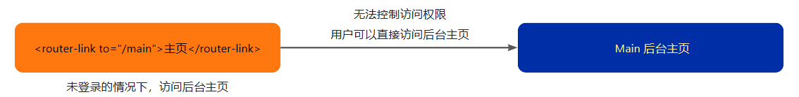
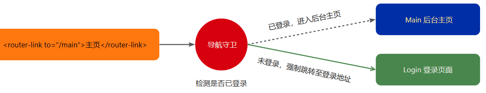
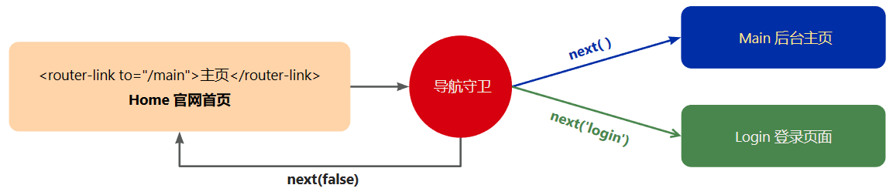

[Vue Router官方文档](https://router.vuejs.org/zh/guide/)

1.  `vue-router`是`vue.js`官方给出的路由解决方案，能够轻松的管理`SPA`项目中组件的切换
2.  安装：`npm install vue-router`

## 10.1：快速使用

### 10.1.1：创建路由模块
1.  在项目中的`src`文件夹中创建一个`router`文件夹，在其中创建`index.js`模块
2.  采用`createRouter()`创建路由，并暴露出去
3.  在`main.js`文件中初始化路由模块`app.use(router)`

**创建路由**

```vue
import { createRouter } from 'vue-router'

const router = createRouter({  // 创建路由
    history: createWebHistory(), 
	  routes: [{
        path: "/", name: "home", component: App
    }, {
        path: "/index", name: "index", component: index
    },]
})

export default router // 暴露出去
```

**main.js 中使用路由**

```vue
import { createApp } from 'vue'
import App from './App.vue'
import router from './router'  // 1、引入路由模块

let app = createApp(App)
app.use(router) // 2、使用路由插件
app.mount('#app') //3、挂载
```

> 先申明，后使用，再挂载

### 10.1.2：规定路由模式

`history`路由模式可采用：

1.  `createWebHashHistory()`：`Hash`模式
	a.  它在内部传递的实际`URL`之前使用了一个哈希字符`#`，如`https://example.com/#/user/id`
	b.  由于这部分 URL 从未被发送到服务器，所以它不需要在服务器层面上进行任何特殊处理

2.  `createWebHistory()`：`html5`模式，推荐使用
	a.  当使用这种历史模式时，`URL`会看起来很“正常”，如`https://example.com/user/id`
	b.  由于我们的应用是一个单页的客户端应用，如果没有适当的服务器配置，用户在浏览器中直接访问`https://example.com/user/id`，就会得到一个`404`错误；要解决这个问题，你需要做的就是在你的服务器上添加一个简单的回退路由，如果`URL`不匹配任何静态资源，它应提供与你的应用程序中的`index.html`相同的页面

规定路由模式：`history 模式路由`
```
import { createRouter, createWebHistory } from 'vue-router'

const router = createRouter({  // 创建路由
    history: createWebHistory(), // 使用 history 模式路由
	  routes: [{
        path: "/", name: "home", component: App
    }, {
        path: "/index", name: "index", component: index
    },]
})

export default router
```


### 10.1.3：使用路由规则

`routes`配置路由规则：
-   `path`：路由分配的`URL`
-   `name`：当路由指向此页面时显示的名字
-   `component`：路由调用这个页面时加载的组件
-   `redirect`：来重定向另一个地址

使用路由规则
```vue
import { createRouter, createWebHistory } from 'vue-router'
import BlogHomeView from '@/views/BlogHomeView.vue'

let routes = [
    {
        path: '/home', // URL 地址
        name: 'home',  // 名称
        component: () => import('@/views/HomeView.vue')  // 渲染该组件
    },
    {
        path: '/blog',
        name: 'blog',
        component: BlogHomeView
    }
]

const router = createRouter({	// 创建路由
    history: createWebHistory(), // 使用 history 模式路由
    routes // 路由规则
})

export default router // 将路由对象暴露出去
```

```vue
<template> // HomeView.vue【路由模块用到的组件】
    <div class="home">网站首页界面</div>
</template>

<style scoped>
    div.home {
        padding: 50px;
        background-color: pink;
    }
</style>
```

```vue
<template> // BlogHomeView【路由模块用到的组件】
    <div class="blog">博客首页界面</div>
</template>

<style scoped>
div.blog {
    padding: 50px;
    background-color: yellow;
}
</style>
```


### 10.1.4：声明路由链接和占位符

在组件模板中声明路由连接和占位符
-   `<router-link>`：路由链接，`to`属性则为点击此元素，需要切换的路由地址
-   `<router-view>`：路由占位符，路由切换的视图展示的位置
```vue
<template>
    <router-link to="/home">首页</router-link> <!--路由链接，点击是路由地址会切换到属性 to 的地方-->
    |
    <router-link to="/blog">博客</router-link>
    
    <hr>
    <router-view/> <!--路由试图，切换路由时要展示组件的地方-->
</template>
```


## 10.2：重定向路由

在路由规则中，可采用`redirect`来重定向另一个地址

路由模块【重定向路由】

```vue
import { createRouter, createWebHistory } from 'vue-router'
import HomeView from '@/views/HomeView.vue'
  
let routes = [
    {
        path: '/',
        redirect: '/home' // 如果访问是 / 则强制跳转到 /home
    },
    {
        path: '/home',
        component: HomeView
    },
]
  
const router = createRouter({
    history: createWebHistory(),
    routes
})

export default router
```

App.vue【添加重定向路由链接】

```vue
<template>
    <!-- 点击首页，查看是否路由地址重定向为 /home --> 
    <router-link to="/">重定向到首页</router-link>
    |
    <router-link to="/home">首页</router-link>
    |
    <router-link to="/blog">博客</router-link>
    
    <hr>
    <router-view/>
</template>
```


## 10.3：嵌套路由

如果在路由视图中展示的组件中包含自己的路由占位符，则此处会用到嵌套路由

如图所示：点击关于链接，则会显示`About`组件，在其组件中又包含了路由链接和路由占位符

嵌套路由规则

1.  在某一个路由规则中采用`children`来声明嵌套路由的规则
2.  嵌套路由规则中的`path`不能以`/`开头，访问需使用`_/father/son_`的形式

路由模块【新增嵌套路由 /school】

```vue
import { createRouter, createWebHistory } from 'vue-router'
import HomeView from '@/views/HomeView.vue'
import SchoolHomeView from '@/views/SchoolHomeView.vue.vue'
import MathView from '@/views/MathView.vue'

let routes = [
    { 
        path: '/home', 
        name: 'home', 
        component: HomeView 
    },
    {
        path: '/school',
        name: 'school',
        component: SchoolHomeView,
        children: [	//  嵌套路由，下面要展示的组件需要在父级路由的组件中（router-view）进行展示
            {
                path: 'english', // 嵌套路由中的 path 前面不要加 /
                name: 'school-english',
                component: () => import('@/views/EnglishView.vue')
            },
            {
                path: 'math',
                name: 'school-math',
                component: MathView
            }
        ]
    }
]

const router = createRouter({
    history: createWebHistory(),
    routes
})

export default router
```

```vue
<template> //app.vue【新增 /school 路由链接】
    <router-link to="/home">首页</router-link>
    |
		<!--  学堂组件中有嵌套路由链接和占位符  -->
    <router-link to="/school">学堂</router-link>
    <hr>
    <router-view/>  
</template>
```

```vue
<template> // HomeView.vue
    <div class="home">网站首页界面</div>
</template>

<style scoped>
    div.home {
        padding: 50px;
        background-color: pink;
    }
</style>
```


```vue
<template> //SchoolHomeView.vue【新增的，该组件中有自己的路由链
    <div class="school">
        学堂首页界面：
        <router-link to="/school/english">英语</router-link>
        |
        <router-link to="/school/math">数学</router-link>
      
        <hr>
        <router-view />	<!-- 该组件中自己的路由视图 -->
    </div>
</template>

<style scoped>
div.school {
    padding: 50px;
    background-color: rgb(99, 228, 99);
}
</style>
```

EnglishView.vue【嵌套路由中用到的组件】

MathView.vue【嵌套路由中用到的组件】


## 10.4：路径参数
1.  很多时候，我们需要将给定匹配模式的路由映射到同一个组件，例如：想渲染不同博客的内容，其实只是渲染到同一个组件上，只是博客的编号不同而已
2.  在`Vue Router`中，可以在路径中使用一个动态字段来实现，我们称之为“路径参数” ，语法如：`path: '/_url_/_:_param_'`
3.  在展示的组件中访问路径参数
    a.  在**选项式 API** 中，采用`this.$route.params`来访问，试图模板上采用`$route.params`来访问
    b.  在**组合式 API **中，需要`import { useRoute } from 'vue-router'`，`JS`和视图模板上通过`useRoute().params`来访问
    c.  还可以通过在路由规则上添加`props: true`，将路由参数传递给组件的`props`中

路由模块【新增路径传参】

```vue
import { createRouter, createWebHistory } from 'vue-router'
import HomeView from '@/views/HomeView.vue'
import SchoolView from '@/views/SchoolView.vue'
import BlogContentView from '@/views/blog/BlogContentView.vue'

let routes = [
    {
        path: '/',
        redirect: '/home'
    },
    {
        path: '/home',
        name: 'home',
        component: HomeView
    },
    {
        path: '/blog-content/:id',  // 路径传参
        name: 'blog-content',
        component: BlogContentView,
        props: true  // 同意，将路径参数传递到展示组件的 props 中
    }
]

const router = createRouter({
    history: createWebHistory(),
    routes
})

export default router
```
```vue
<template> // app.vue
    <router-link to="/home">首页</router-link>
    |
    <router-link to="/blog">博客</router-link>
    <hr>
    <router-view/>
</template>
```

```vue
<template> // HomeView.vue
    <div class="home">网站首页界面</div>
</template>

<style scoped>
    div.home {
        padding: 50px;
        background-color: pink;
    }
</style>
```

```vue
<template> // BlogContentView.vue
    <div class="blog">
        博客首页界面：
        <router-link to="/blog-content/23">博客23</router-link> <!-- 路径参数 23 -->
        |
        <router-link to="/blog-content/75">博客75</router-link>
    </div>
</template>
```

```vue
<script setup> //BlogContentView.vue
import { useRoute } from 'vue-router'

const routeObj = useRoute() // 获取路由路径参数对象
const propsData = defineProps(['id'])

function showRouteParams() {
    console.log(routeObj.params) // 获取路由路径参数对象
    console.log(routeObj.params.id) // 获取路由路径参数对象指定的属性
    console.log(propsData.id) // 在 props 取出路由路径参数
}
</script>

<template>
    <div class="blog-content">
        博客详情界面
        <ul>
            <li>{{ $route.params }}</li>
            <li>{{ $route.params.id }}</li>
            <li>{{ id }}</li>
        </ul>
        <button @click="showRouteParams">在 JS 中获取路由路径参数</button>
    </div>
</template>

<script> // BlogContentView.vue
export default {
    props: ['id'],
    methods: {
        showRouteParams() {
            console.log(this.$route.params) // 获取路由路径参数对象
            console.log(this.$route.params.id) // 获取路由路径参数对象指定的属性
            console.log(this.id) // 在 props 取出路由路径参数
        }
    }
}
</script>
```

## 10.5：声明式与编程式导航
### 10.5.1：push()导航到不同的路径地址

声明式 `<router-link :to="...">`

编程式【选项式】`this.$router.push(...)`
			【组合式】`useRouter().push(...)`

**描述**
会向`history`栈添加一个新的记录，所以，当用户点击浏览器后退按钮时，会回到之前的`URL`

**提示**：
编程式的`router.push(...)`的语法

1.  其的参数可以是一个字符串路径，或者一个描述地址的对象
2.  如果参数是描述地址的对象的话，其对象中`path`和`params`不能同时使用

router.push【选项式 API】
```vue 
this.$router.push('/home') // 简单的字符串地址
this.$router.push({ path : '/home' }) // 路径地址对象 path（路由地址）
this.$router.push({ name : 'home' }) // 路径地址对象 name（路由名称）

// --------------------- 嵌套路由 -------------------------
this.$router.push('/school/english') // 简单的字符串地址
this.$router.push({ path : '/school/english' }) // 路径地址对象 path（路由地址）
this.$router.push({ name : 'schoo-english' }) // 路径地址对象 name（路由名称）

// --------------------- 路径传参 -------------------------
const id_one = 110
const id_two = 119
const id_three = 120

this.$router.push(`/blog-content/${ id_one }`) // 简单的字符串地址
this.$router.push({ path : `/blog-content/${ id_two }`}) // 路径地址对象 path（路由地址）
this.$router.push({ name : 'blog-content' , params: { id_three } }) // 路径地址对象 name（路由名称）
```

router.push【组合式】
```vue
import { useRouter } from 'vue-router'
const router = useRouter()

// ===============================================
router.push('/home') // 简单的字符串地址
router.push({ path : '/home' }) // 路径地址对象 path（路由地址）
router.push({ name : 'home' }) // 路径地址对象 name（路由名称）

// --------------------- 嵌套路由 ----------------
router.push('/school/english') // 简单的字符串地址
router.push({ path : '/school/english' }) // 路径地址对象 path（路由地址）
router.push({ name : 'schoo-english' }) // 路径地址对象 name（路由名称）

// --------------------- 路径传参 ----------------
const id_one = 110
const id_two = 119
const id_three = 120

router.push(`/blog-content/${ id_one }`) // 简单的字符串地址
router.push({ path : `/blog-content/${ id_two }`}) // 路径地址对象 path（路由地址）
router.push({ name : 'blog-content' , params: { id_three } }) // 路径地址对象 name（路由名称）
```


### 10.5.2：替换当前位置
**声明式**

```vue
<router-link :to="..." replace> //替换当前路径下的vue,即更改router路径
```

**编程式**

【选项式】`this.$router.replace(...)`
	作用类似于`push(...)`唯一不同的是：它在导航时不会向`history`添加新记录，只是取代了当前的条目

【组合式】`useRouter().replace(...)`

**描述**

作用类似于`push(...)`唯一不同的是：它在导航时不会向`history`添加新记录，只是取代了当前的条目

> 提示：也可以直接在`router.push(...)`的参数中采用路径地址对象，其路径地址对象中增加一个属性`replace: true`

```
// ----------------- 选项式的 JS 中 -------------------
this.$router.push({ path: '/home', replace: true })
this.$router.replace({ path: '/home' })
```

```
// ----------------- 组合式的 JS 中 -------------------
import { useRouter } from 'vue-router'
const rouetr = useRouter()

rouetr.push({ path: '/home', replace: true })
rouetr.replace({ path: '/home' })
```

### 10.5.3：路由历史

```vue
this.$router.go(_n_) //选项式

useRouter().go(_n_) //组合式
```

描述
该方法采用一个整数作为参数，表示在历史堆栈中前进或后退多少步，类似于`window.history.go(n)`

提示：
1. `router.go(1)`：前进`1`条记录，相当于`router.forward()`

2. `router.go(-1)`：后退`1`条记录，相当于`router.back()`

3. 如果前进或者后退的步数大于实际的历史记录数，则什么都不会发生

路由历史【选项式】

```vue
this.$router.go(1) // 前进 1 条记录
this.$router.go(-1) // 后退 1 条记录
this.$router.go(3) // 前进 3 条记录

this.$router.go(-100) // 如果没有那么多记录，静默失败
this.$router.go(100)
```

路由历史【组合式】

```vue
import { useRouter } from 'vue-router'
const router = useRouter()

router.go(1) // 前进 1 条记录
router.go(-1) // 后退 1 条记录
router.go(3) // 前进 3 条记录

router.go(-100) // 如果没有那么多记录，静默失败
router.go(100)
```

## 10.6：导航守卫

查看以下情形：

1.  点击主页链接时，默认情况下可直接进入指定界面，如图，但是问题是该跳转的界面是需要用户登录后方可访问的


2.  可设置导航守卫来检测用户是否登录，如果已登录，则进入后台页，如果未登录，则强制进入登录页，如图


### 10.6.1：全局前置守卫

每次发生路由的导航跳转时，都会触发全局前置守卫，因此，在全局前置守卫中，程序员可以对每个路由进行访问权限的控制

使用`router.beforeEach((to, from, next) => {})`注册一个全局前置守卫

1.  `_to_`：将要访问的路由信息对象
2.  `_from_`：将要离开的路由信息对象
3.  `_next_`：函数

1.  调用`next()`表示放行，允许这次路由导航
2.  调用`next(_false_)`表示不放行，不允许此次路由导航
3.  调用`next({ _routerPath_ })`表示导航到此地址，一般情况用户未登录时，会导航到登陆界面

提示：该函数在前置守卫中可出现多次，但是只能被调用一次!!!



```vue
// 注册全局前置守卫 // main.js文件
// to：将要访问的路由信息对象
// from：将要离开的路由信息对象
router.beforeEach((to, from, next) => {
    if (to.meta.isLogin) { // 判断将要访问的路由信息对象是否需要用户登录
        let userLogin = localStorage.getItem('loginUser') // 获取存储对象
        if(userLogin == null) {  // 判断用户是否已经登陆了
            return next({ path: '/login' })  // 未登录 --> 跳转至登录页
        }
    }
    return next() // 放行
})
```


### 10.6.2：其他守卫

课程提示：

1.  导航守卫可分为：全局前置守卫、全局解析守卫、全局后置守卫、路由独享的守卫、组件内的守卫
2.  本教程最要讲述全局前置守卫的用法，其他守卫大家可移步[Vue Router](https://router.vuejs.org/zh/guide/advanced/navigation-guards.html)官网查看
