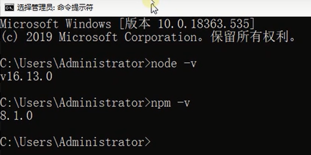
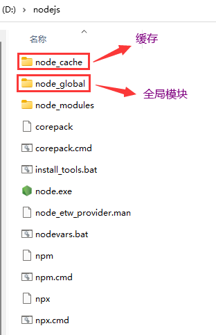
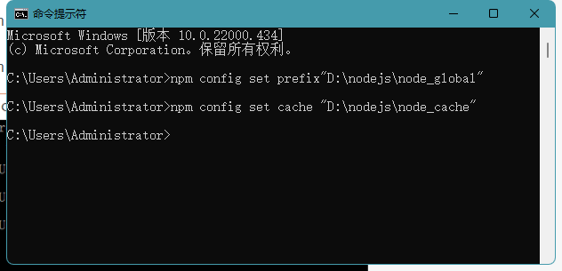
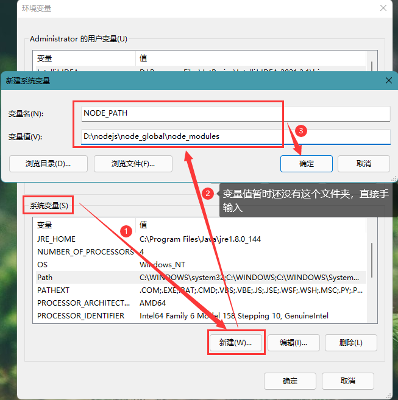
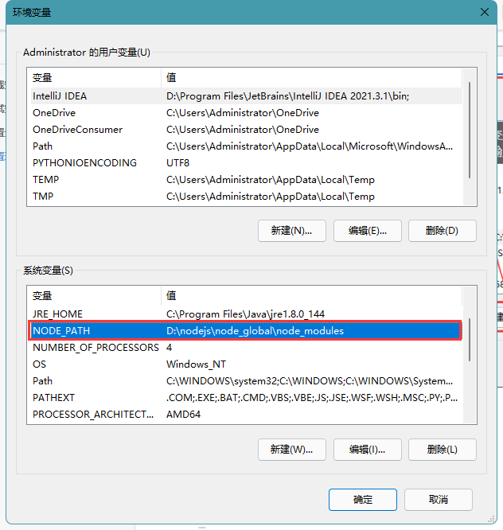
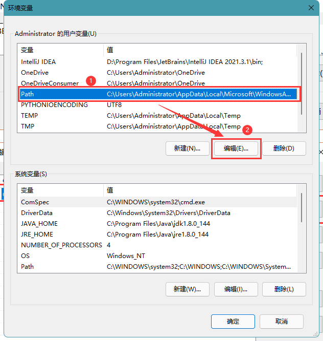
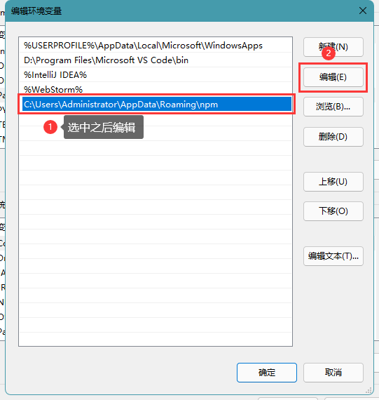
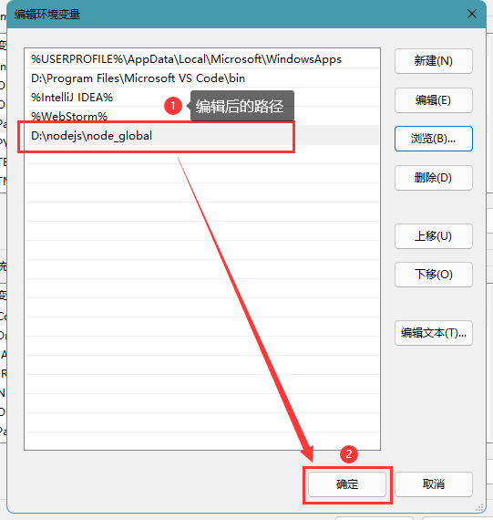
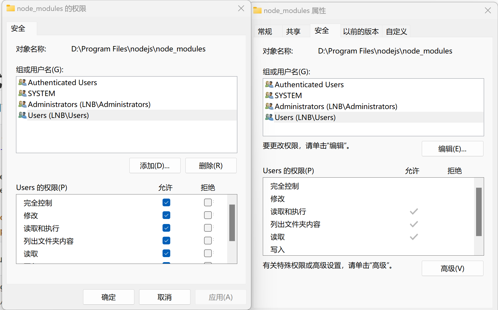

一、NodeJS基本介绍

- Node.js是一个基于Chrome V8引擎的JavaScript运行时环境，用于在服务器端运行JavaScript代码
- NodeJS是为了开发高性能的服务器而诞生的一种技术
- 它提供了许多内置模块和API，使开发者能够轻松地构建服务器端应用程序、命令行工具和网络服务等
- Node.js采用事件驱动、非阻塞I/O模型，使得它非常适合处理高并发和实时性要求较高的应用

二、学习node的意义

 1、 开发沟通：开发时更容易理解后端实现，降低交流成本

 2、 后端开发：想写些自己感兴趣的项目时，可以自己独立完成，即使没有后端支持，且成本特别低。

 3、 中间层开发：为了进一步的前后端分离，提高性能，使用nodejs做中间层是一个非常好的实践（由于nodejs具有异步io的特点）

# 安装方式

## win安装方式

1、先安装 [NodeJs安装](https://nodejs.org/en)

### 测试安装是否成功

**运行命令提示符窗口，输入以下指令**

进入js交互界面：`node`

查看 nodejs 的版本：`node -v`

查看 nodejs 安装后自带的 npm 版本：`npm -v`



### 配置全局模块路径和缓存路径

在 nodejs 安装的根目录下创建两个文件夹：

- `node_global`：全局模块
- `node_cache`：缓存



通过指令为`nodejs`设置自定义的【缓存】和【全局模块】的路径 

- 设置全局模块地址：`npm config set prefix "D:\nodejs\node_global" `
- 设置缓存地址：`npm config set cache "D:\nodejs\node_cache"`



#### 设置环境变量

设置 NODE_PATH 系统变量名

**“我的电脑”-- 右键 --“属性”--“高级系统设置”--“高级”--“环境变量”**

**设置 NODE_PATH 系统变量名，值：D:\nodejs\node_global\node_modules**



### **修改用户变量中的 path**





### 配置镜像

为了能快速通过 npm 下载资源，我们可以设置国内的镜像仓库，下面二选一

- 淘宝镜像仓库：`npm config set registry https://registry.npm.taobao.org`
- 华为镜像仓库：`npm config set registry https://mirrors.huaweicloud.com/repository/npm/`

查看是否配置镜像成功：`npm config get registry`


### 文件夹添加权限



## NPM 方法

由于 npm 安装速度慢，本教程使用了淘宝的镜像及其命令 cnpm

```sh
$ npm install -g cnpm --registry=https://registry.npmmirror.com
$ cnpm install @vitejs/plugin-vue -D # 安装vitejs 插件
$ cnpm install element-plus --save # 安装element-plus 插件
$ cnpm -v	# 查看版本
2.3.0

$ cnpm install npm -g	#升级 npm
$ cnpm install cnpm -g	# 升级或安装 cnpm
```

在用 Vue.js 构建大型应用时推荐使用 cnpm 安装，cnpm 能很好地和 Webpack 或 Browserify 模块打包器配合使用，然后在命令行中运行以下命令：

```sh
$ cnpm init vue@latest	# 淘宝cnpm工具安装最新稳定版，一路回车，默认安装即可
```


## linux安装方式

方法一：源码包安装 官网下载最新版10.9 

```shell
$ wget https://nodejs.org/dist/v10.9.0/node-v10.9.0-linux-x64.tar.xz
$ tar -xzvf node-v10.9.0-linux-x64.tar.gz mv node-v10.9.0-linux-x64 -C  /usr/local #建立软连接，变为全局
$ cd /usr/local/node-v20.9.0/
$ ./configure
$ make
$ make install

①ln -s /usr/local/nodejs/bin/npm /usr/local/bin/     
②ln -s /usr/local/nodejs/bin/node /usr/local/bin/ #查看安装的版本 

[root@localhost]# node -v v10.9.0
[root@localhost]# npm -v  6.2.0
```

方法二：nvm方式安装 curl: 

```shell
$ curl https://raw.github.com/creationix/nvm/master/install.sh | sh  
$ wget -qO- https://raw.github.com/creationix/nvm/master/install.sh | sh  #安装完成后，执行下列命令即可安装 Node.js
$ nvm install stable 查看安装的版本 [root@localhost]# node -v v10.9.0
[root@localhost]# npm -v  6.2.0
```

 方法三：yum方式

```shell
[root@localhost /]# curl -fsSL https://rpm.nodesource.com/setup_19.x | bash -
[root@localhost /]# yum install -y nodejs
[root@localhost /]# node -v
v10.9.0
[root@localhost /]# npm -v
6.2.0
```


# linux下部署安装

Node.js 安装包及源码下载地址为：https://nodejs.org/en/download/，选择Linux Binaries (x64)

或者：`wget https://nodejs.org/dist/latest-v14.x/node-v14.4.0-linux-x64.tar.gz`

```sh
tar -xzvf node-v14.4.0-linux-x64.tar.gz # 进行解压
echo "export PATH=/usr/local/lib/node-v14.4.0-linux-x64/bin:$PATH" >>/etc/profile # 设置环境
source /etc/profile # 刷新文件
node -v && npm version && npx -v # 使用测试安装
```

