# mysql数据库管理系统

# mysql备份还原

```sh
mysqld --initialize #重新初始化命令
```

跳过密码认证

```sql
vim /etc/my.cnf

[mysqld]
skip-grant-tables      //指定位置加一行
```

之后会生成随机密码在my.cnf或者哪个目录下s

```bash
grep 'password'  /var/log/mysqld.log  #过滤初始密码
```

mysql备份内容还原

```sh
rsync -avz /mnt/sata/* /var/lib/mysql/data
```


## 日志

### 错误日志

错误日志是MySQL中最重要的日志之一，它记录了当mysqld启动和停止时，以及服务器在运行过程中发生任何严重错误时的相关信息。当数据库出现任何故障导致无法正常使用时，建议首先查看此日志。
该日志是默认开启的，默认存放目录/var/log/mysqld.log ,默认的日志文件名为mysqld.log 。查看日志位置:

```sh
mysql> show variables like '%log_ error%';
root@node1:~# cat /var/lib/mysql/auto.cnf  //mysql服务的uuid值
[auto]
server-uuid=8ad434ed-2186-11ee-907c-000c29bd8e90
```


### 二进制日志

● 介绍
二进制日志(BINLOG) 记录了所有的DDL (数据定义语言)语句和DML (数据操纵语言)语句，但不包括数据查询(SELECT、 SHOW)语句。
作用：①.灾难时的数据恢复;②. MySQL的主从复制(就是基于二进制日志)。在MySQL .8版本中，默认二进制日志是开启着的，涉及到的参数如下:

```sql
show variables like '%log_ bin%';
```

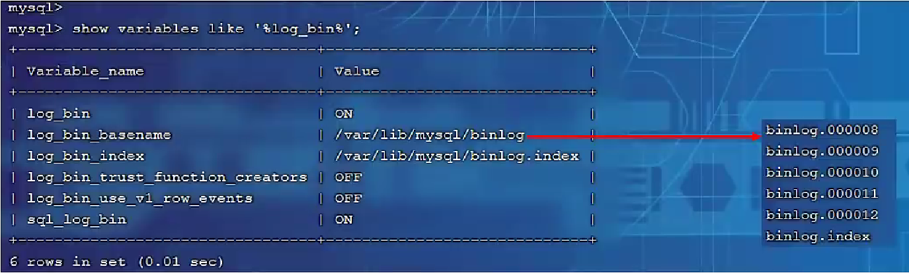

#### 日志格式

MySQL服务器中提供了多种格式来记录二进制日志，具体格式及特点如下:

| 日志格式  | 含义                                                         |
| --------- | ------------------------------------------------------------ |
| STATEMENT | 基于SQL语句的日志记录，记录的是SQL语句，对数据进行修改的SQL都会记录在日志文件中。 |
| ROW       | 基于行的日志记录，记录的是每- -行的数据变更。(默认)          |
| MIXED     | 混合了STATEMENT和ROW两种格式，默认采用STATEMENT,在某些特殊情况下会自动切换为ROW进行记录。 |

```sql
show variables like '%binlog_ format%';
```

#### 日志查看

由于日志是以二进制方式存储的，不能直接读取，需要通过二进制日志查询工具mysqlbinlog来查看，具体语法:

```sql
mysqlbinlog [ 参数选项] logfilename
参数选项:
-d	指定数据库名称，只列出指定的数据库相关操作
-o	忽略掉日志中的前n行命令
-v	将行事件(数据变更)重构为SQL语句
-W	将行事件(数据变更)重构为SQL语句，并输出注释信息
```


#### 日志删除

对于比较繁忙的业务系统，每天生成的binlog数据巨大，如果长时间不清除，将会占用大量磁盘空间。可以通过以下几种方式清理日志:

| 指令                                             | 含义                                                         |
| ------------------------------------------------ | ------------------------------------------------------------ |
| reset master;                                    | 删除全部binlog日志，删除之后，日志编号，将从binlog.000001重新开始 |
| purge master logs to ‘birf.*****’;               | 删除*****编号之前的所有日志                                  |
| purge master logs before 'yyy-mm-dd hh24:mi:ss'; | 删除日志为"yyyy-mm-dd hh24:mi:ss"之前产生的所有日志          |

也可以在mysql的配置文件中配置二进制日志的过期时间。设置了之后,二进制日志过期会自动删除。

```sql
show variables like '%binlog_expire_logs_seconds%';
```


### 查询日志

查询日志中记录了客户端的所有操作语句，而二进制日志不包含查询数据的SQL语句。默认情况下，查询日志是未开启的。如果需要开启查询日志，可以设置以下配置:

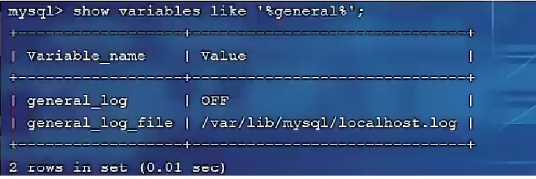

修改MySQL的配置文件/etc/my.cnf文件，添加如下内容:

```sql
general log=1  #该选项用来开启查询日志，可选值: 0或者1 ; 0代表关闭，1 代表开启
general_log_file=mysql_querytog  #设置日志的文件名，如果没有指定， 默认的文件名为host_ name.log
```


### 慢查询日志

慢查询日志记录了所有执行时间超过参数long_ query_ time 设置值并且扫描记录数不小于min_examined_row_limit。localhost-slow.log慢查询日志文件的所有的SQL语句的日志，默认未开启。long_query_time默认为10秒,最小为0，精度可以到微秒。

```sql
slow_query_log=1   #慢查询日志
long_query_time=2  #执行时间参数
```


默认情况下，不会记录管理语句，也不会记录不使用索引进行查找的查询。可以使用log_ slow_ admin_ statements和更改此行为log_ queries_ _not_ _using_ indexes, 如下所述。

```sql
log_slow_ admin_statements=1 #记录执行较慢的管理语句
log_queries_not_using_jindexes=1 #记录执行较慢的未使用索弓|的语句
```


## 主从复制

### 概述

​	主从复制是指将主数据库的DDL和DML操作通过二进制日志传到从库服务器中，然后在从库上对这些日志重新执行(也叫重做) ，从而使得从库和主库的数据保持同步。

​	MySQL支持一台主库同时向多 台从库进行复制，从库同时 也可以作为其他从服务器的主库,实现链状复制。

MySQL复制的有点主要包含以下三个方面:
1、主，库出现问题，可以快速切换到从库提供服务。
2、实现读写分离，降低主库的访问压力。
3、可以在从库中执行备份，以避免备份期间影响主库服务。

### 原理

MySQL的主从复制原理如下：

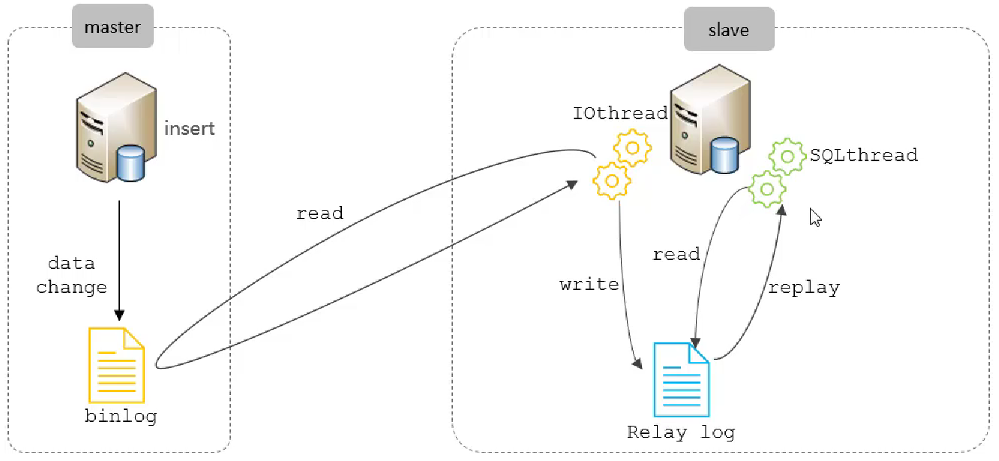

从上图来看，复制分成三步：
1、Master 主库在事务提交时会把数据变更记录在:二进制日志文件Binlog中。
2、从库读取主库的二进制日志文件Binlog，写入到从库的中继日志Relay Log。
3、slave重做中继 日志中的事件,将改变反映它自己的数据。

### 搭建

**主库配置操作**
1、修改配置文件/etc/my.cnf 

```sql
server-id=1		#mysql服务ID，保证整个集群环境中唯一， 取值范围: 1-2^32-1， 默认为1
read-only=0		#是否只读,1代表只读, 0代表读写
#binlog-ignore-db=mysql		#忽略的数据，指不需要同步的数据库
#binlog-do-db=db01 			#指定同步的数据库
```

2、重启mysql数据库

```sh
service mysql restart
```

3、登录mysql,创建远程连接的账号，并授予主从复制权限

```sql
#创建itcast用户，并设置密码，该用户可在任意主机连接该MySQL服务
CREATE USER 'itcast'@'%' IDENTIFIED WITH mysql_native_password BY 'Root@123456' ;
#为'itcast'@'%'用户分配主从复制权限
GRANT REPLICATION SLAVE ON *.* TO 'itcast'@'%';
```

4、通过指令，查看二进制日志坐标

```sql
show master status ;
# 输出内容字段含义说明:
file :					从哪个日志文件开始推送日志文件
position:				从哪个位置开始推送日志
binlog_ignore_db :		指定不需要同步的数据库
```

**从库配置操作**
1、修改配置文件/etc/my.cnf

```sql
server-id=2		#mysql服务ID，保证整个集群环境中唯一，取值范围: 1-2^32-1，和主库不一样即可
read-only=1		#是否只读，1代表只读，0代表读写
```

2、重启mysql数据库

```sh
service mysql restart
```

3.登录mysql,设置主库配置

```sql
CHANGE REPLICATION SOURCE TO SOURCE_ HOST='192.168.1.1', SOURCE_USER='itcast', SOURCE_PASSWORD='root@123', SOURCE_LOG_FILE='binlog.00004', SOURCE_LOG_POS=663;
```

上述是8.0.23中的语法。如果mysql是8.0.23之前的版本，执行如下SQL：

```sql
CHANGE MASTER TO MASTER_HOST='xxxx.xxx' MASTER_USER-='xx', MASTER_PASSWORD='xxx', MASTER_LOG_FILE='xx', MASTER_LOG_POS=xxx;
```

| 参数名          | 含义               | 8.0.23之前       |
| --------------- | ------------------ | ---------------- |
| SOURCE_HOST     | 主库IP地址         | MASTER_HOST      |
| SOURCE_USER     | 连接主库的用户名   | MASTER_USER      |
| SOURCE PASSWORD | 连接主库的密码     | MASTER_PASSWORD  |
| SOURCE LOG_FILE | binlog日志文件名   | MASTER_ LOG_FILE |
| SOURCE_LOG_POS  | binlog日志文件位置 | MASTER_LOG_POS   |

4.开启同步操作

```sql
start replica;  #8.0.22之后
start slave;	#8.0.22之前
```

slave验证是否开始同步：

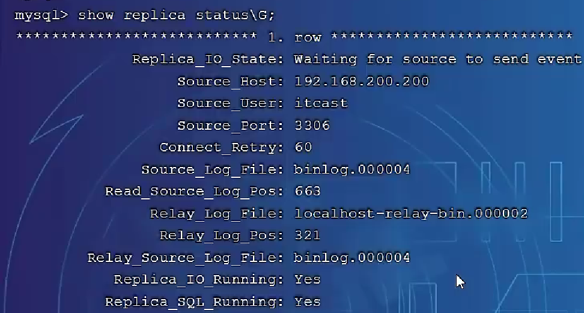


之后就可以在主从之间进行测试了。


## 分库分表

随着互联网及移动互联网的发展,应用系统的数据量也是成指数式增长,若采用单数据库进行数据存储,存在以下性能瓶颈:

1. I0瓶颈:热点数据太多,数据库缓存不足,产生大量磁盘I0,效率较低。请求数据太多,带宽不够,网络I0瓶颈。

2. CPU瓶颈:排序、分组、连接查询、聚合统计等SQL会耗费大量的CPU资源，请求数太多, CPU出现瓶颈。


分库分表的中心思想都是将数据分散存储，使得单一数据库/表的数据量变小来缓解单一数据库的性能问题，从而达到提升数据库性能的目的。

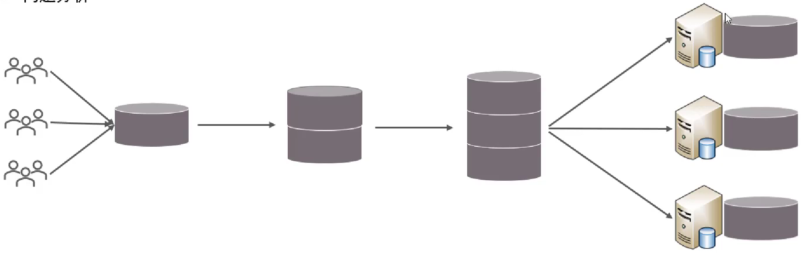

### 拆分策略

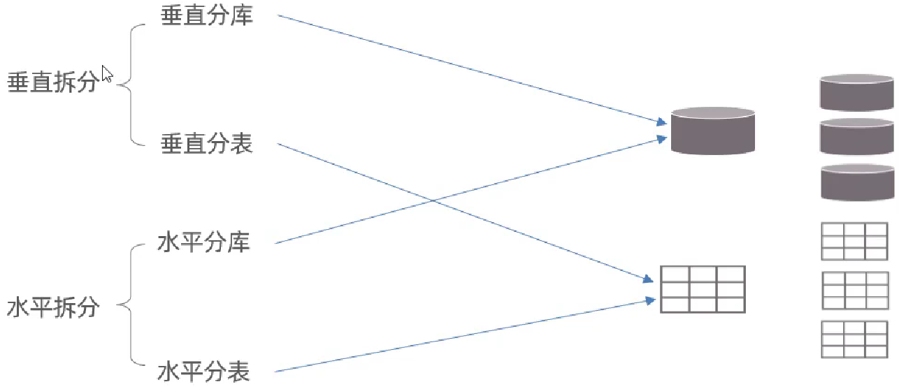

垂直分库:以表为依据，根据业务将不同表拆分到不同库中，
特点:
1、每个库的表结构都不一样。
2、每个库的数据也不一 样。
3、所有库的并集是全量数据。

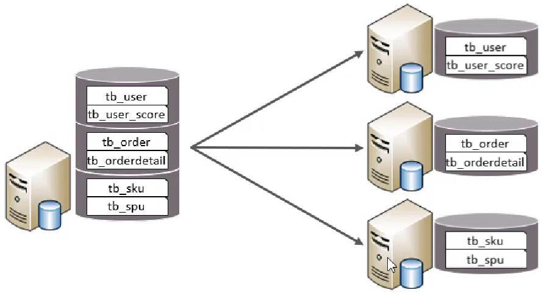

垂直分表:以字段为依据，根据字段属性将不同字段拆分到不同表中。
特点:

1. 每个表的结构都不一样。
2. 每个表的数据也不一样，一般通过一列(主键/外键)关联。
3. 所有表的并集是全量数据 。

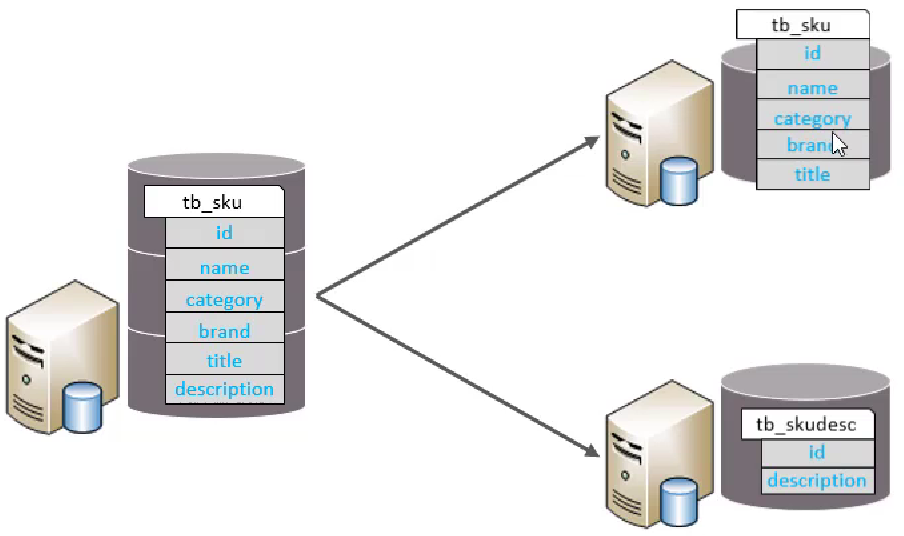

水平分库:以字段为依据，按照一定策略, 将-一个库的数据拆分到多个库中，
特点:
1、每个库的表结构都一样。
2、每个库的数据都不一样。
3、所有库的并集是全量数据。

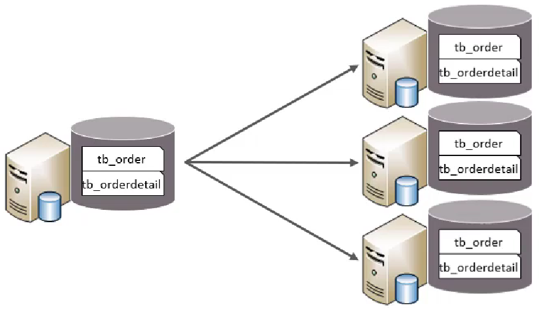


水平分表:以字段为依据，按照一定策略,将- -个表的数据拆分到多个表中。
特点:
1、每个表的表结构都一样。
2、每个表的数据都不一样。
3、所有表的并集是全量数据。

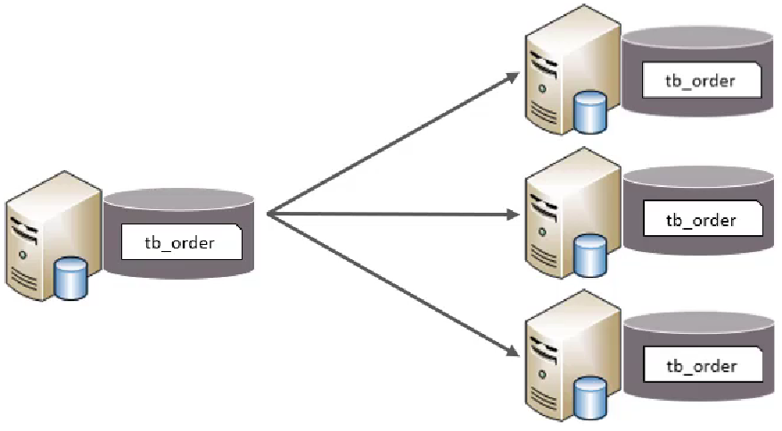

### 实现技术

shardingJDBC：基于AOP原理,在应用程序中对本地执行的SQL进行拦截，解析、改写、路由处理。需要自行编码配置实现,只支持java语言，性能较高。
MyCat：数据库分库分表中间件，不用调整代码即可实现分库分表，支持多种语言，性能不及前者。

### Mycat概述

Mycat是开源的、活跃的、基于Java语言编写的MySQL数据库中间件。可以像使用mysql-样来使用mycat,对于开发人员来说根本感觉不到mycat的存在。

优势:
●性能可靠稳定				●强大的技术团队			●体系完善				●社区活跃

[Mycat1.6稳定版本下载](http://www.mycat.org.cn/mycat1.html)

#### 安装

Mycat是采用java语言开发的开源的数据库中间件，支持Windows和Linux运行环境 ，下 面介绍MyCat的Linux中的环境搭建。我们需要在准备好的服务器中安装如下软件。MySQL、JDK、Mycat

| 服务器          | 安装软件   | 说明              |
| --------------- | ---------- | ----------------- |
| 192.168.200.210 | JDK、Mycat | MyCat中间件服务器 |
| 192.168.200.210 | MySQL      | 分片服务器        |
| 192.168.200.213 | MySQL      | 分片服务器        |
| 192.168.200.214 | MySQL      | 分片服务器        |

首先下载[Mycat](https://so.csdn.net/so/search?q=Mycat&spm=1001.2101.3001.7020),目前最新版本是1.6

下载地址：https://[github](https://so.csdn.net/so/search?q=github&spm=1001.2101.3001.7020).com/MyCATApache/Mycat-download/tree/master/1.6-RELEASE

进入安装包所在目录，解压文件

```sh
cd /opt/mycat
tar -zxvf Mycat-server-1.6-RELEASE-20161028204710-linux.tar.gz
mv mycat mycat-1.6
vi /etc/profile
JAVA HOME=/usr/local/jdkl.8.0 171  #配置系统变量
PATH=$PATH:$JAVA_HOME/bin
```

| **目录** | **说明**                                    |
| -------- | ------------------------------------------- |
| bin      | mycat命令，启动、重启、停止等               |
| catlet   | catlet为Mycat的一个扩展功能                 |
| conf     | Mycat 配置信息,重点关注                     |
| lib      | Mycat引用的jar包，Mycat是java开发的         |
| logs     | 日志文件，包括Mycat启动的日志和运行的日志。 |

```sh
mycat start#启动			mycat stop#停止			mycat restart#重启
```


# 读写分离

读写分离,简单地说是把对数据库的读和写操作分开,以对应不同的数据库服务器。主数据库提供写操作,从数据库提供读操作,这样能有效地减轻单台数据库的压力。
通过MyCat即可轻易实现.上述功能，不仅可以支持MySQL,也可以支持Oracle和SQL Server。

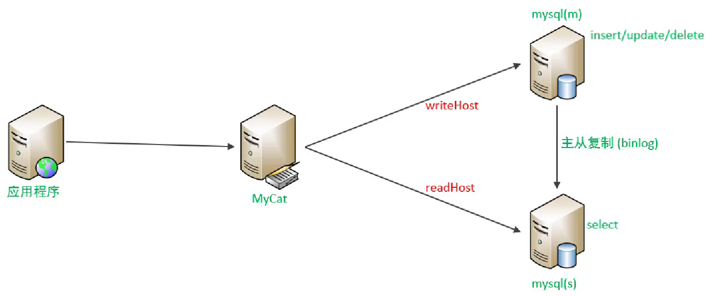

# 一主一从

原理：MySQL的主从复制，是基于二进制日志(binlog) 实现的。

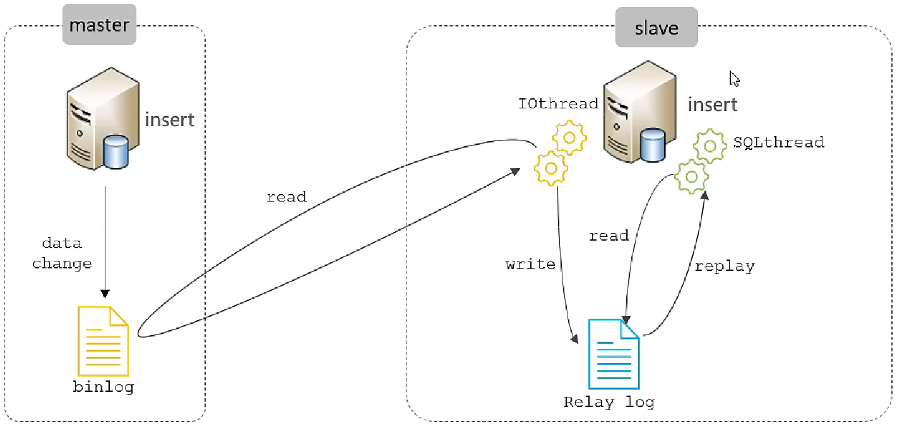


# 安装与授权

数据库管理系统分	Oracle	MySQL---开发相同---Mariadb

`vim /etc/yum.repos.d/CentOS-MariaDB.repo`

```sh
[mariadb]
name=MariaDB
baseurl=http://yum.mariadb.org/10.3/centos7-amd64
gpgkey=https://yum.mariadb.org/RPM-GPG-KEY-MariaDB
gpgcheck=1
```

`yum install mariadb-* -y` #安装

MyCLI ：一个支持自动补全和语法高亮的 MySQL/MariaDB 客户端  //`yum install pip`，`pip install mycli`

包：mariadb*			端口号：3306		服务名：mariadb

-u, --user=name         #指定用户名		-p, --password          #指定密码

-h, --host=name         #指定主机名		-P, --port            	#指定端口

```sql
[root@localhost ~]# mysql -uroot -p123456 #登录
mysql> use mysql #使用数据库
mysql> update user set host='%' where user='root'; #使能够远程连接
mysql> flush privileges; #刷新权限

#卸载安装mysql时报错，无法正常卸载或安装
#需要删除或者mv掉mysql的数据目录
mv /var/lib/mysql /var/lib/mysql-bak

#编译安装mysql停止方式
mysqladmin -u root shutdown


mysql> create user test@'localhost' identified by '123456';
mysql> grant all privileges on tpcc1g.* to test@'localhost';
mysql> flush privileges;

root@kylin-pc:/home/tpcc-mysql# mysqladmin create tpcc1g
root@kylin-pc:/home/tpcc-mysql# mysql tpcc1g < create_table.sql
root@kylin-pc:/home/tpcc-mysql# mysql tpcc1g < add_fkey_idx.sql
```

/var/log/mariadb/mariadb.log日志文件		/var/lib/mysql/数据库实体文件

```sh
[root@server23 ~]# grep -Ev "^#|^$" /etc/my.cnf	//数据库服务默认主配置文件
```

```conf
[mysqld]
datadir = /data/mysql # 数据库数据文件存放目录
socket  = /tmp/mysql.sock #为MySQL客户端程序和服务器之间的本地通讯指定一个套接字文件
symbolic-links=0

[mysqld_safe]
log-error=/var/log/mariadb/mariadb.log	#记录错误日志文件
pid-file=/var/run/mariadb/mariadb.pid	#pid所在的目录
!includedir /etc/my.cnf.d
```


## GRANT命令用于对用户进行授权：

```sql
grant create ON 数据库.表单名称 TO 用户名@主机名	//对某个特定数据库中的特定表单给予授权
grant select，delete ON 数据库.* TO 用户名@主机名	//对某个特定数据库中的所有表单给予授权
grant 权限 ON *.* TO 用户名@主机名				//对所有数据库及所有表单给予授权
grant 权限1,权限2 ON 数据库.* TO 用户名@主机名	//对某个数据库中的所有表单给予多个授权
grant all privileges on xd_db.* to 'user'@'%' identified by 'redhat' 
//允许本地用户user在%任何主机IP地址远程登陆对xd_db数据库下*.*所有表格有访问权限设置密码为redhat

GRANT ALL PRIVILEGES ON *.* TO 'root'@'%' IDENTIFIED BY 'root' WITH GRANT OPTION;

# 5.6 版本：
update mysql.user set password=password('123456') where User="root" and Host = "%";
set password for root@localhost = password('123456');

# 5.7 以上版本，password 字段被设置为了authentication_string，因此更新命令为：
update mysql.user set authentication_string=password('123456') where User="root" and Host="localhost";

# 8.0 以上的版本，以上的命令都不支持，有以下两个命令可用
alter user 'root'@'localhost' identified by 'root';
ALTER USER 'root'@'%' IDENTIFIED WITH mysql_native_password BY '123456';
update user set host='%' where user='root'; // 更新root用户远程权限
flush privileges;

create user 'xiandian'@'localhost' identified by 'xd_paas'; 创建一个xiandian用户在本地授权密码xd_paas
create user '[用户名称]'@'%' identified by '[用户密码]';	//创建用户
create user Luigi@localhost identified by "redhat";		//增加管理员账户Luigi及密码redhat

SELECT HOST,USER,PASSWORD FROM user WHERE USER="luke";
```


## 问题1

外界无法访问mysql主机

```go
2002-can‘t connect to server on localhost（10061）
```

一般情况下，我们只需要去修改/etc/mysql/my.cnf配置文件即可，将my.cnf配置文件中的bind-address=127.0.0.1改成bind-address=0.0.0.0，并且把skip-networking注释掉即可；

```sh
port           		    = 3306
bind-address            = 0.0.0.0
mysqlx-bind-address     = 0.0.0.0
```

## 问题2

```go
1130- Host xxx is not allowed to connect to this MySQL server
```
问题通常在于缺少必要的权限。解决方法包括登录MySQL，切换到mysql库，更新root用户的host为%，刷新权限。完成后，即可成功远程连接。
```go
mysql> use mysql #使用数据库
mysql> update user set host='%' where user='root'; #使能够远程连接
mysql> flush privileges; #刷新权限
```

## 问题3

```go
1698 (28000): Access denied for user 'root'@'localhost'
```

尝试使用*root*用户连接到 MySQL 时，通常会在新安装 MySQL 时出现此错误消息。

```go
ALTER USER 'root'@'%' IDENTIFIED WITH mysql_native_password BY '123456';
```


## 查询luck主机名称、账户名称以及经过加密的密码值信息

```sh
show grants for alex@'localhost';	//查看alex所有的权限
mysqladmin -u root password 123456	//设置mysql数据库密码
mysql -uroot -p XXX < /home/renwole.sql	//导入数据库
```

```sh
[root@rhel ~]# mysql_secure_installation	//更改超级用户管理权限
Enter current password for root (enter for none): 当前数据库密码为空，直接按回车键
Set root password? [Y/n]				设置root用户密码
Remove anonymous users? [Y/n] y		删除匿名用户可登录数据库？
Disallow root login remotely? [Y/n]		禁止用户远程登陆
Remove test database and access to it?	删除test测试数据库并访问它？
Reload privilege tables now?			现在重新加载权限表？

[root@rhel ~]# mysql -u root -p123456	现在需指定用户登录
MariaDB [(none)]> flush privileges #使配置生效
```


# sql语句中的快捷键

```sql
\G格式化输出(文本式，竖立显示)			\s查看服务器端信息
\c结束命令输入操作							\q退出当前sq|命令行模式				\h查看帮助
```

# 数据库操作

```sql
use xxx	//使用数据库
show databases;							//查看数据库
show create database xxx;		//查看数据库详细信息
show engines								//查看数据库引擎
create database （if not exists ） 表名；	//创建数据库（如果不存在则创建）
alter database xxx;							//修改数据库
alter database xxx character set utf8; 		//修改数据库编码的命令
drop database xxx;							//删除数据库
exit	//推出数据库命令
```

## 导入/导出数据库

```sh
#导出数据库文件，mysqldump命令用于备份数据库
mysqldump -u root -p linuxprobe > /root/linuxprobeDB.sql

#导入数据库文件-1，mysql命令用于导入数据库
mysql -u root -p linuxprobe < /root/linuxprobeDB.sql
#导入数据库文件-2
mysql> create database onlinedb;
mysql> use onlinedb;
mysql> source d:/onlinedb sql;
```


## 数据库字符集-查看和修改

### 查看字符集

查看MYSQL数据库服务器和数据库字符集

```go
方法一：show variables like '%character%';
方法二：show variables like 'collation%';
```

查看库的字符集

```go
语法：show database status from 库名 like  表名;
```


查看表的字符集

```go
语法：show table status from 库名 like  表名;
```

查看表中所有列的字符集

```go
语法：show full columns from 表名;
```

### 设置字符集

设置字符集一般有两种方法，一种是在创建表的时候设置字符集，另一种是表建成之后修改字符集。

1.创建时指定字符集

```go
创建库的时候指定字符集：
语法：create database 库名 default character set=字符集；

创建表的时候指定字符集：
语法：create table 表名（属性）default character set = 字符集；
```

2.修改字符集

```go
修改库的字符集
语法：alter database 库名 default character set 字符集;
ALTER DATABASE database_name CHARACTER SET = utf8mb4 COLLATE = utf8mb4_unicode_ci

修改表的字符集
语法：alter table 表名 convert to character set 字符集;
只修改表默认的字符集:	ALTER TABLE table_name DEFAULT CHARACTER SET utf8mb4 COLLATE utf8mb4_unicode_ci;
修改表默认的字符集和所有字符列的字符集: ALTER TABLE table_name CONVERT TO CHARACTER SET utf8mb4 COLLATE utf8mb4_unicode_ci;

修改字段的字符集
语法：alter table 表名 modify 字段名 字段属性 character set gbk；
ALTER TABLE table_name CHANGE column_name column_name VARCHAR(191) CHARACTER SET utf8mb4 COLLATE utf8mb4_unicode_ci;
```


# 数据库模式

```sh
creat schema <模式名> authorization <用户名>
create schema test authorization U1
```


drop schema <模式名> <cascade|restrict>

cascade(级联)表示在删除模式的同时把该模式中所有的数据库对象全部删除

restrict(限制)表示如果该模式中已经定义了下属的数据库对象，如表或视图等，则拒绝该删除语句的执行

| 数据查询                                                 | select （查询出数据，也可用于变量赋值）        |
| -------------------------------------------------------- | ---------------------------------------------- |
| 数据定义(表/视图/查询/存储过程/自定义函数/索引/触发器等) | create (创建)、drop(删除)、alter(修改)         |
| 数据操纵                                                 | insert（插入）、update（更新）、delete（删除） |
| 数据控制                                                 | grant（授权）、revoke（回收权限）              |

# 数据表操作

数据操作DML操作：添加数据、修改数据、删除数据

## 表定义

```sql
use xxx;		//使用数据表
create table XXX_back select * from XXX //数据表进行备份
```

### 创建数据表

**主键约束**：使某个字段不重复且不得为空，确保表内所有数据的唯一性。

```sql
CREATE TABLE<表名> (<表字段名><数据类型> [列级完整性约束条件]
[,<表字段名><数据类型> [列级完整性约束条件]]
[,<表级完整性约束条件>]) ;

CREATE TABLE Student(Sno CHAR(9) PRIMARY KEY,	/*列级完整性约束条件，Sno 是主码*/
	Sname CHAR(20) UNIQUE,		/* Sname取唯一值*/
	Ssex CHAR(2),
	Sage SMALLINT,
	Sdept CHAR(20)
)engine=innodb default charset=utf8； //设置引擎和字符集
```

```sql
create table xxx（列名字  类型（20））
create table 新表 as select  from 旧表	复制数据表结构及数据到新表
create table 新表 as select  from 旧表 where false	复制数据表结构到新表
```

### 创建函数

```sql
create function xxx()
	return varcher（225）	//返回的数形
begin
	return (select  from xxx );
end
```

### 创建储存过程(参数化)	

```sql
delimiter  //------使用作为结束提交符号
	create procedure spXXX(id int)
reads sql data
begin
	select  from goods where gdID = id;
end 
```

### 修改函数

```sql
alter function xxx()
	return type_数值
begin
	return (select  from xxx );
end
```

## 修改表

```sql
alter table 原表名 rename 新表名	重命名数据表；
alter table 数据表 add num int;						//添加字段
alter table 数据表 chang 原表名 新表名  数据类型；	 	//更改字段名
alter table 数据表 modify 字段名 新数据类型 after uSex	；//修改字段排列在uSex字段之后
alter table 数据表 auto_increment =1000；			//修改表的自增值
alter table 数据表 engine = 'myisam';				//修改表引擎
alter table 表名 drop uPwd(字段名)	删除字段；
truncate xxx	清空数据表所有记录；
```

### 删除表及约束

```sql
drop table xxx1,xxx2，		//删除多个数据表
drop index 索引名 on 表名 //删除索引
drop function fnXXX			//删除函数
drop procedure psXXX		//删除储存过程
show databases tables  (注意加s)	//查询展示数据库查询展示数据表
```

```sql
alter table xxx drop primary key	//删除主键
alter table xxx drop index 索引名	/删除索引
```


## 查看表

```sql
show table engine	//查看数据表引擎
show tables;		//查看数据表
describe xxx		//查看数据表结构
show  from xxx;	//查看表中记录内容
show create table xxx	;			//查看表结构和索引
show create function fnXXX; 		//查看函数的定义
show create procedure spXXX;	//查看储存过程的定义
```


## 数据查询

### 一般查询格式：

```sql
select 输出的表达式 

from 表名/视图名 [as] 别名

where 条件的表达式
[group by] 分组名 having 聚集函数表达式
[order by] (asc|descj降序])
```


### 运算符

 

**聚集函数：平均值**：avg()		**最小值**：min()	**最大值**：max()	**总和**：sum()		**计数**：count()

聚集函数只能用于select子句和having子句


### 连接查询格式：

| where  |                    |                                        |
| ------ | ------------------ | -------------------------------------- |
| join   | 内连接             | [inner] join (内连接)，默认 ... on ... |
| 左连接 | left [outer] join  |                                        |
|        | full [outer] join  |                                        |
| 右连接 | right [outer] join |                                        |

### 嵌套查询格式：

```sql
select function fnXXX	//使用函数
call psXXX(1)		//使用储存过程---1代表参数
select  from student where order by s_class desc;		//以s_class降序查询student数据表
```

## 数据添加与修改

语法一：   `INSERT INTO 表名(字段1,字段2,字段3…字段n) VALUES(值1,值2,值3…值n);`

语法二： `  INSERT INTO 表名 VALUES (值1,值2,值3…值n);`

`insert into 表名 values('804', '李诚', '男', '1958-12-02', '副教授', '计算机系')	向数据表中插入数据`

语法三（插入多条记录）：  ` INSERT INTO 表名 VALUES     `

`(值1,值2,值3…值n),     `

`(值1,值2,值3…值n),     `

`(值1,值2,值3…值n);`

语法四：  ` UPDATE 表名 SET     字段1=值1,     字段2=值2,     WHERE CONDITION;`

```sql
update 表名 set name = 'squirrel' where owner = 'Diane'	//修改更新修改数据
```


## 数据删除

语法：   `DELETE FROM 表名      WHERE CONITION;`

```sql
delect from 表名 where name = 'squirrel'	//删除数据表中记录where添加条件
TRUNCATE TABLE tablename;			//删除所有数据，保留表结构，不能撤消还原。
DROP TABLE table_name ; 			//删除指定数据库
```


# 详解mysql引擎

 

MySQL服务器把数据的存储和提取操作都封装到了一个叫存储引擎的模块里。我们知道表是由一行一行的记录组成的，但这只是一个逻辑上的概念，物理上如何表示记录，怎么从表中读取数据，怎么把数据写入具体的物理存储器上，这都是存储引擎负责的事情。为了实现不同的功能，MySQL 提供了各式各样的存储引擎，不同存储引擎管理的表具体的存储结构可能不同，采用的存取算法也可能不同。

存储引擎以前叫做表处理器，它的功能就是接收上层传下来的指令，然后对表中的数据进行提取或写压操作。

为了管理方便，人们把连接管理、查询缓存、语法解析、查询优化这些并不涉及真实数据存储的功能划分为MySQLserver的功能，把真实存取数据的功能划分为存储引擎的功能。各种不同的存储引擎向上边的MySQL server 层提供统一的调用接口(也就是存储引擎API) ，包含了几十个底层函数，像"读取索引第一条内容"、 "读取索引下一条内容"、"插入记录"等等。所以在MySQL server 完成了查询优化后，只需按照生成的执行计划调用底层存储引擎提供的API,获取到数据后返回给客户端就好了。

 **MySQL支持非常多种存储引擎**

| 存储引擎 | 描述                               | 存储引擎  | 描述                           |
| -------- | ---------------------------------- | --------- | ------------------------------ |
| ARCHIVE  | 用于数据存档(行被插入后不能再修改) | BLACKHOLE | 丢弃写操作，读操作会返回空内容 |
| CSV      | 在存储数据时，以逗号分隔各个数据项 | FEDERATED | 用来访问远程表                 |
| InnoDB   | 具备外键支持功能的事务存储引擎     | MEMORY    | 置于内存的表                   |
| MERGE    | 用来管理多个MyISAM表构成的表集合   | MyISAM    | 主要的非事务处理存储引擎       |
| NDB      | MySQL集群专用存储引擎              |           |                                |


MyISAM和InnoDB表引擎的区别

1)、事务支持

2)、存储结构

3)、表锁差异

4)、表主键

5)、表的具体行数

6)、CURD操作

7)、外键

8)、查询效率

