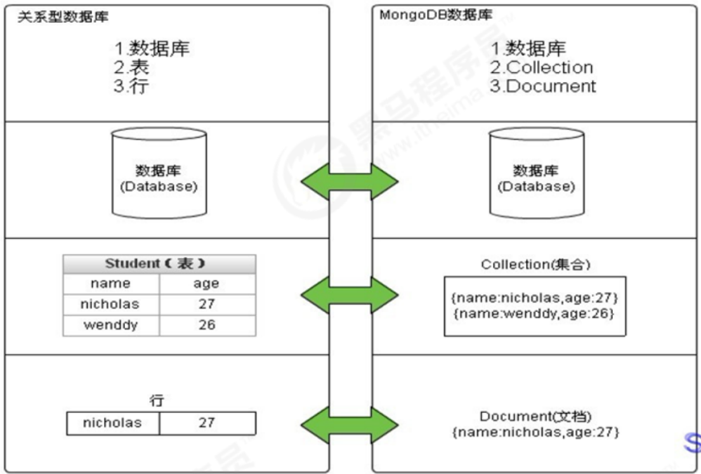
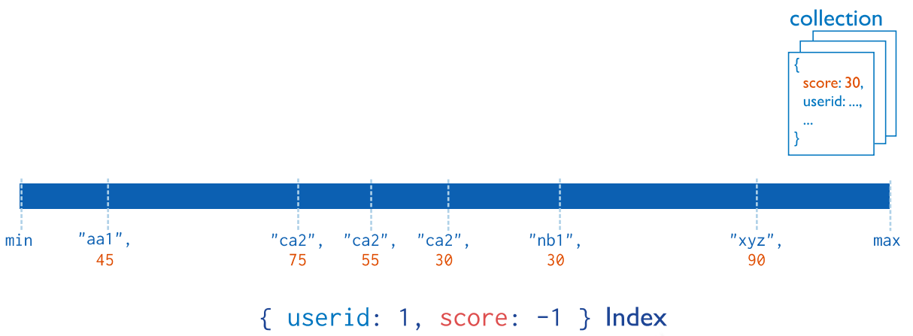

# ==MongoDB==

[官方中文文档](https://docs.mongoing.com)  | [菜鸟教程文档](https://www.runoob.com/mongodb/mongodb-databases-documents-collections.html)  |  [官方文档](https://docs.mongodb.com/manual/mongo/)  |  [中文社区](https://mongoing.com)

什么是MongoDB?

MongoDB是一个开源、高性能、无模式的文档型数据库，当初的设计就是用于简化开发和方便扩展，是NoSQL数据库产品中的一种。是最像关系型数据库（MySQL）的非关系型数据库。

它支持的数据结构非常松散，是一种类似于 JSON 的 格式叫BSON，所以它既可以存储比较复杂的数据类型，又相当的灵活。

MongoDB中的记录是一个文档，它是一个由字段和值对（field:value）组成的数据结构。MongoDB文档类似于JSON对象，即一个文档认为就是一个对象。字段的数据类型是字符型，它的值除了使用基本的一些类型外，还可以包括其他文档、普通数组和文档数组。

# 什么是NoSQL?

NoSQL（Not Only SQL）非关系型数据库。是对不同于传统的关系型数据库的数据库管理系统的统称。

NoSQL用于超大规模数据的存储。（例如谷歌或Facebook每天为他们的用户收集万亿比特的数据）。这些类型的数据存储不需要固定的模式，无需多余操作就可以横向扩展。

# CAP定理

分布式架构中 CAP定理（CAP theorem）它指出对于一个分布式计算系统来说，不可能同时满足以下三点:

- **一致性(Consistency)**：所有节点在同一时间具有相同的数据
- **可用性(Availability)**：保证**每个请求**不管成功或者失败都有响应
- **分区容错性(Partition tolerance)**：系统中**任意信息**的丢失或失败不会影响系统的继续运作

CAP理论的核心是：一个分布式系统不可能同时很好的满足一致性，可用性和分区容错性这三个需求，最多只能同时较好的满足两个。

因此，根据 CAP 原理将 NoSQL 数据库分成了满足 CA 原则、满足 CP 原则和满足 AP 原则三 大类：

- CA - 单点集群，满足一致性，可用性的系统，通常在可扩展性上不太强大。
- CP - 满足一致性，分区容忍性的系统，通常性能不是特别高。
- AP - 满足可用性，分区容忍性的系统，通常可能对一致性要求低一些。

# MongoDB相关概念

## MongoDB数据库分类

- 数据库(database)：用来存储集合的，而且数据库也有分大小
- 集合(collection)：集合类似于数组，用于存放文档的
- 文档(document)：文档是MongoDB数据库中最小的单位



| SQL 术语/概念 | MongoDB 术语/概念 | 解释/说明                           |
| :------------ | :---------------- | :---------------------------------- |
| database      | database          | 数据库                              |
| table         | collection        | 数据库表/集合                       |
| row           | document          | 数据记录行/文档                     |
| column        | field             | 数据字段/域                         |
| index         | index             | 索引                                |
| table joins   |                   | 表连接,MongoDB不支持                |
| primary key   | primary key       | 主键,MongoDB自动将_id字段设置为主键 |

## 数据模型

MongoDB的最小存储单位就是文档(document)对象。文档(document)对象对应于关系型数据库的行。数据在MongoDB中以

BSON（Binary-JSON）文档的格式存储在磁盘上。是一种类json的一种二进制形式的存储格式。BSON和JSON一样，支持内嵌的文档对象和数组对象，但是BSON有JSON没有的一些数据类型，如Date和BinData类型。

BSON采用了类似于 C 语言结构体的名称、对表示方法，支持内嵌的文档对象和数组对象，具有轻量性、可遍历性、高效性的三个特点，可以有效描述非结构化数据和结构化数据。这种格式的优点是灵活性高，但它的缺点是空间利用率不是很理想。

BSON数据类型参考列表：

| 数据类型           | 描述                                                         |
| :----------------- | :----------------------------------------------------------- |
| String             | 字符串。存储数据常用的数据类型。在 MongoDB 中，UTF-8 编码的字符串才是合法的。 |
| Integer            | 整型数值。用于存储数值。根据你所采用的服务器，可分为 32 位或 64 位。 |
| Boolean            | 布尔值。用于存储布尔值（真/假）。                            |
| Double             | 双精度浮点值。用于存储浮点值。                               |
| Min/Max keys       | 将一个值与 BSON（二进制的 JSON）元素的最低值和最高值相对比。 |
| Array              | 用于将数组或列表或多个值存储为一个键。                       |
| Timestamp          | 时间戳。记录文档修改或添加的具体时间。                       |
| Object             | 用于内嵌文档。                                               |
| Null               | 用于创建空值。                                               |
| Symbol             | 符号。该数据类型基本上等同于字符串类型，但不同的是，它一般用于采用特殊符号类型的语言。 |
| Date               | 日期时间。用 UNIX 时间格式来存储当前日期或时间。你可以指定自己的日期时间：创建 Date 对象，传入年月日信息。 |
| Object ID          | 对象 ID。用于创建文档的 ID。                                 |
| Binary Data        | 二进制数据。用于存储二进制数据。                             |
| Code               | 代码类型。用于在文档中存储 JavaScript 代码。                 |
| Regular expression | 正则表达式类型。用于存储正则表达式。                         |

> 提示：shell默认使用64位浮点型数值。{“x”：3.14}或{“x”：3}。对于整型值，可以使用NumberInt（4字节符号整数）或NumberLong（8字节符号整数），{“x”:NumberInt(“3”)}{“x”:NumberLong(“3”)}

##  MongoDB的特点

MongoDB主要有如下特点：

（1）高性能：

MongoDB提供高性能的数据持久性。特别是,对嵌入式数据模型的支持减少了数据库系统上的I/O活动。

索引支持更快的查询，并且可以包含来自嵌入式文档和数组的键。（文本索引解决搜索的需求、TTL索引解决历史数据自动过期的需求、地理位置索引可用于构建各种 O2O 应用）mmapv1、wiredtiger、mongorocks（rocksdb）、in-memory 等多引擎支持满足各种场景需求。

Gridfs解决文件存储的需求。

（2）高可用性：

MongoDB的复制工具称为副本集（replica set），它可提供自动故障转移和数据冗余。

（3）高扩展性：

MongoDB提供了水平可扩展性作为其核心功能的一部分。

分片将数据分布在一组集群的机器上。（海量数据存储，服务能力水平扩展）

从3.4开始，MongoDB支持基于片键创建数据区域。在一个平衡的集群中，MongoDB将一个区域所覆盖的读写只定向到该区域内的那些片。

（4）丰富的查询支持：

MongoDB支持丰富的查询语言，支持读和写操作(CRUD)，比如数据聚合、文本搜索和地理空间查询等。

（5）其他特点：

如无模式（动态模式）、灵活的文档模型

**业务应用场景**

1）社交场景，使用 MongoDB 存储存储用户信息，以及用户发表的朋友圈信息，通过地理位置索引实现附近的人、地点等功能。

2）游戏场景，使用 MongoDB 存储游戏用户信息，用户的装备、积分等直接以内嵌文档的形式存储，方便查询、高效率存储和访问。

3）物流场景，使用 MongoDB 存储订单信息，订单状态在运送过程中会不断更新，以 MongoDB 内嵌数组的形式来存储，一次查询就能将订单所有的变更读取出来。

4）物联网场景，使用 MongoDB 存储所有接入的智能设备信息，以及设备汇报的日志信息，并对这些信息进行多维度的分析。

5）视频直播，使用 MongoDB 存储用户信息、点赞互动信息等。

这些应用场景中，数据操作方面的共同特点是：

（1）数据量大

（2）写入操作频繁（读写都很频繁）

（3）价值较低的数据，对事务性要求不高

对于这样的数据，我们更适合使用MongoDB来实现数据的存储。

## 什么时候选择 MongoDB

在架构选型上，除了上述的三个特点外，如果你还犹豫是否要选择它？可以考虑以下的一些问题：

- 应用不需要事务及复杂 join 支持

- 新应用，需求会变，数据模型无法确定，想快速迭代开发

- 应用需要2000-3000以上的读写QPS（更高也可以）

- 应用需要TB甚至 PB 级别数据存储

- 应用发展迅速，需要能快速水平扩展

- 应用要求存储的数据不丢失

- 应用需要99.999%高可用

- 应用需要大量的地理位置查询、文本查询


如果上述有1个符合，可以考虑 MongoDB，2个及以上的符合，选择 MongoDB 绝不会后悔。

思考：如果用MySQL呢？

答：相对MySQL，可以以更低的成本解决问题（包括学习、开发、运维等成本）

**MongoDB的优点**：

可以快速开发web型应用，因为灵活，不用像关系型数据库一样需要建表

MongoDB存储的是文档(document)，文档内存储的是类似json的结构，所谓json就是字符串数组

## MongoDB 支持哪些存储引擎？

存储引擎（Storage Engine）是数据库的核心组件，负责管理数据在内存和磁盘中的存储方式。

与 MySQL 一样，MongoDB 采用的也是 **插件式的存储引擎架构** ，支持不同类型的存储引擎，不同的存储引擎解决不同场景的问题。在创建数据库或集合时，可以指定存储引擎。

> 插件式的存储引擎架构可以实现 Server 层和存储引擎层的解耦，可以支持多种存储引擎，如MySQL既可以支持B-Tree结构的InnoDB存储引擎，还可以支持LSM结构的RocksDB存储引擎。

在存储引擎刚出来的时候，默认是使用 MMAPV1 存储引擎，MongoDB4.x 版本不再支持 MMAPv1 存储引擎。

现在主要有下面这两种存储引擎：

- **WiredTiger 存储引擎** ：自 MongoDB 3.2 以后，默认的存储引擎为 [WiredTiger 存储引擎](https://link.juejin.cn?target=https%3A%2F%2Fwww.mongodb.com%2Fdocs%2Fmanual%2Fcore%2Fwiredtiger%2F) 。非常适合大多数工作负载，建议用于新部署。WiredTiger 提供文档级并发模型、检查点和数据压缩（后文会介绍到）等功能。
- **In-Memory 存储引擎** ：[In-Memory 存储引擎](https://link.juejin.cn?target=https%3A%2F%2Fwww.mongodb.com%2Fdocs%2Fmanual%2Fcore%2Finmemory%2F)在 MongoDB Enterprise 中可用。它不是将文档存储在磁盘上，而是将它们保留在内存中以获得更可预测的数据延迟。

此外，MongoDB 3.0 提供了 **可插拔的存储引擎 API** ，允许第三方为 MongoDB 开发存储引擎，这点和 MySQL 也比较类似。

# 基本操作

案例需求：存放文章评论的数据存放到MongoDB中，数据结构参考如下：

数据库：articledb

| 专栏文章评论   | comment        |                  |                           |
| -------------- | -------------- | ---------------- | ------------------------- |
| 字段名称       | 字段含义       | 字段类型         | 备注                      |
| _id            | ID             | ObjectId或String | Mongo的主键的字段         |
| articleid      | 文章ID         | String           |                           |
| content        | 评论内容       | String           |                           |
| userid         | 评论人ID       | String           |                           |
| nickname       | 评论人昵称     | String           |                           |
| createdatetime | 评论的日期时间 | Date             |                           |
| likenum        | 点赞数         | Int32            |                           |
| replynum       | 回复数         | Int32            |                           |
| state          | 状态           | String           | 0：不可见；1：可见；      |
| parentid       | 上级ID         | String           | 如果为0表示文章的顶级评论 |

## 数据库操作

 选择和创建数据库

选择和创建数据库的语法格式：

```sql
use 数据库名称
```

如果数据库不存在则自动创建，例如，以下语句创建 spitdb 数据库：

```sql
use articledb
```

查看有权限查看的所有的数据库命令

```sql
show dbs
或
show databases
```

> 注意：在 MongoDB 中，集合只有在内容插入后才会创建! 就是说，创建集合(数据表)后要再插入一个文档(记录)，集合才会真正创建。

### 查看当前数据库命令

```sql
db
```

MongoDB 中默认的数据库为 test，如果你没有选择数据库，集合将存放在 test 数据库中。

另外：

数据库名可以是满足以下条件的任意UTF-8字符串。

- 不能是空字符串（"")。
- 不得含有' '（空格)、.、$、/、\和\0 (空字符)。
- 应全部小写。
- 最多64字节。

有一些数据库名是保留的，可以直接访问这些有特殊作用的数据库。

- admin： 从权限的角度来看，这是"root"数据库。要是将一个用户添加到这个数据库，这个用户自动继承所有数据库的权限。一些特
- 定的服务器端命令也只能从这个数据库运行，比如列出所有的数据库或者关闭服务器。
- local: 这个数据永远不会被复制，可以用来存储限于本地单台服务器的任意集合
- config: 当Mongo用于分片设置时，config数据库在内部使用，用于保存分片的相关信息。

### 数据库的删除

MongoDB 删除数据库的语法格式如下：

```sql
db.dropDatabase()
```

提示：主要用来删除已经持久化的数据库

## 集合操作

集合，类似关系型数据库中的表。可以显示的创建，也可以隐式的创建。

基本语法格式：

```sql
db.createCollection(name)
db.createCollection("mycollection") # 创建一个名为 mycollection 的普通集合
```

查看当前库中的表：

```sql
show collections
或
show tables
```

集合的命名规范：

- 集合名不能是空字符串""。
- 集合名不能含有\0字符（空字符)，这个字符表示集合名的结尾。
- 集合名不能以"system."开头，这是为系统集合保留的前缀。
- 用户创建的集合名字不能含有保留字符。有些驱动程序的确支持在集合名里面包含，这是因为某些系统生成的集合中包含该字符。除
- 非你要访问这种系统创建的集合，否则千万不要在名字里出现$。

**集合的隐式创建**

当向一个集合中插入一个文档的时候，如果集合不存在，则会自动创建集合。

详见 `文档的插入` 章节。

> 提示：通常我们使用隐式创建文档即可。

###  集合的删除

集合删除语法格式如下：

```sql
db.集合.drop()
db.collection.drop()
db.mycollection.drop()  # 要删除mycollection集合	# 如果成功删除选定集合，则 drop() 方法返回 true，否则返回 false。
```


## 文档操作

文档（document）的数据结构和 JSON 基本一样。

所有存储在集合中的数据都是 BSON 格式。

###  插入

（1）单个文档插入

使用insert() 或 save() 方法向集合中插入文档，语法如下：

```json
db.collection.insert(
    <document or array of documents>,
    {
    writeConcern: <document>,
    ordered: <boolean>
    }
)

// 向comment的集合(表)中插入一条测试数据
db.comment.insert({"articleid":"100000","content":"今天天气真好，阳光明           媚","userid":"1001","nickname":"Rose","createdatetime":newDate(),"likenum":NumberInt(10),"state":null})
```

参数：

| Parameter | Type          | Description                                              |
| ------------- | ----------------- | ------------------------------------------------------------ |
| document      | document or array | 要插入到集合中的文档或文档数组。（(json格式）                |
| writeConcern  | document          | Optional. A document expressing the write concern. Omit to use the default write concern.See Write Concern.Do not explicitly set the write concern for the operation if run in a |
| ordered       | boolean           | 可选。如果为真，则按顺序插入数组中的文档，如果其中一个文档出现错误，MongoDB将返回而 |

提示：

- 1）comment集合如果不存在，则会隐式创建
- 2）mongo中的数字，默认情况下是double类型，如果要存整型，必须使用函数NumberInt(整型数字)，否则取出来就有问题了。
- 3）插入当前日期使用 new Date()
- 4）插入的数据没有指定 _id ，会自动生成主键值
- 5）如果某字段没值，可以赋值为null，或不写该字段。

执行后，如下，说明插入一个数据成功了。

```sql
WriteResult({ "nInserted" : 1 })
```

> 注意：
>
> 1. 文档中的键/值对是有序的。
> 2. 文档中的值不仅可以是在双引号里面的字符串，还可以是其他几种数据类型（甚至可以是整个嵌入的文档)。
> 3. MongoDB区分类型和大小写。
> 4. MongoDB的文档不能有重复的键。
> 5. 文档的键是字符串。除了少数例外情况，键可以使用任意UTF-8字符。

文档键命名规范：

- 键不能含有\0 (空字符)。这个字符用来表示键的结尾。
- .和$有特别的意义，只有在特定环境下才能使用。
- 以下划线"_"开头的键是保留的(不是严格要求的)。


（2）批量插入

```sql
db.collection.insertMany(
    [ <document 1> , <document 2>, ... ],
    {
    writeConcern: <document>,
    ordered: <boolean>
    }
)

# 批量插入多条文章评论
db.comment.insertMany([
{"_id":"1","articleid":"100001","content":"我们不应该把清晨浪费在手机上，健康很重要，一杯温水幸福你我
他。","userid":"1002","nickname":"相忘于江湖","createdatetime":new Date("2019-08-
05T22:08:15.522Z"),"likenum":NumberInt(1000),"state":"1"},
{"_id":"2","articleid":"100001","content":"我夏天空腹喝凉开水，冬天喝温开水","userid":"1005","nickname":"伊人憔
悴","createdatetime":new Date("2019-08-05T23:58:51.485Z"),"likenum":NumberInt(888),"state":"1"},
{"_id":"3","articleid":"100001","content":"我一直喝凉开水，冬天夏天都喝。","userid":"1004","nickname":"杰克船
长","createdatetime":new Date("2019-08-06T01:05:06.321Z"),"likenum":NumberInt(666),"state":"1"},
{"_id":"4","articleid":"100001","content":"专家说不能空腹吃饭，影响健康。","userid":"1003","nickname":"凯
撒","createdatetime":new Date("2019-08-06T08:18:35.288Z"),"likenum":NumberInt(2000),"state":"1"},
{"_id":"5","articleid":"100001","content":"研究表明，刚烧开的水千万不能喝，因为烫
嘴。","userid":"1003","nickname":"凯撒","createdatetime":new Date("2019-08-
06T11:01:02.521Z"),"likenum":NumberInt(3000),"state":"1"}
]);
```

> 提示：插入时指定了 _id ，则主键就是该值。
>
> 如果某条数据插入失败，将会终止插入，但已经插入成功的数据不会回滚掉。
>
> 因为批量插入由于数据较多容易出现失败，因此，可以使用try catch进行异常捕捉处理，测试的时候可以不处理。如（了解）：

### 查询

查询数据的语法格式如下：

```sql
db.collection.find(<query>, [projection])
```

参数：

| Parameter | Type | Description                                              |
| ------------- | -------- | ------------------------------------------------------------ |
| query         | document | 可选。使用查询运算符指定选择筛选器。若要返回集合中的所有文档，请省略此参数或传递空文档( {} )。 |
| projection    | document | 可选。指定要在与查询筛选器匹配的文档中返回的字段（投影）。若要返回匹配文档中的所有字段，请省略此参数。 |

【示例】

（1）查询所有

如果我们要查询spit集合的所有文档，我们输入以下命令

```sql
db.comment.find()
db.comment.find({})
```

这里你会发现每条文档会有一个叫_id的字段，这个相当于我们原来关系数据库中表的主键，当你在插入文档记录时没有指定该字段，

MongoDB会自动创建，其类型是ObjectID类型。

如果我们在插入文档记录时指定该字段也可以，其类型可以是ObjectID类型，也可以是MongoDB支持的任意类型。

如果我想按一定条件来查询，比如我想查询userid为1003的记录，怎么办？很简单！只要在find()中添加参数即可，参数也是json格式，如下：

```sql
db.comment.find({userid:'1003'})
```

如果你只需要返回符合条件的第一条数据，我们可以使用findOne命令来实现，语法和find一样。

如：查询用户编号是1003的记录，但只最多返回符合条件的第一条记录：

```sql
db.comment.findOne({userid:'1003'})
```

（2）投影查询（Projection Query）：

如果要查询结果返回部分字段，则需要使用投影查询（不显示所有字段，只显示指定的字段）。

如：查询结果只显示` _id、userid、nickname`:

```sql
>db.comment.find({userid:"1003"},{userid:1,nickname:1})
{ "_id" : "4", "userid" : "1003", "nickname" : "凯撒" }
{ "_id" : "5", "userid" : "1003", "nickname" : "凯撒" }
```

默认 _id 会显示。

如：查询结果只显示 、userid、nickname ，不显示 _id ：

```sql
>db.comment.find({userid:"1003"},{userid:1,nickname:1,_id:0})
{ "userid" : "1003", "nickname" : "凯撒" }
{ "userid" : "1003", "nickname" : "凯撒" }
```

再例如：查询所有数据，但只显示 _id、userid、nickname :

```sql
>db.comment.find({},{userid:1,nickname:1})
```

### 更新

更新文档的语法：

```go
db.collection.update(query, update, options)
db.collection.update(
    <query>,
    <update>,
    {
        upsert: <boolean>,
        multi: <boolean>,
        writeConcern: <document>,
        collation: <document>,
        arrayFilters: [ <filterdocument1>, ... ],
        hint: <document|string> // Available starting in MongoDB 4.2
    }
)
```

参数：

| Parameter | Type            | Description                                              |
| ------------- | ------------------- | ------------------------------------------------------------ |
| query         | document            | 更新的选择条件。可以使用与find（）方法中相同的查询选择器，类似sql update查询内where后面的。。在3.0版中进行了更改：当使用upsert:true执行update（）时，如果查询使用点表示法在_id字段上指定条件，则MongoDB将拒绝插入新文档。 |
| update        | document or boolean | 要应用的修改。该值可以是：包含更新运算符表达式的文档，或仅包含：对的替换文档，或在MongoDB 4.2中启动聚合管道。管道可以由以下阶段组成： |
| upsert        | pipeline            | 可选。如果设置为true，则在没有与查询条件匹配的文档时创建新文档。默认值为false，如果找不到匹配项，则不会插入新文档。 |
| multi         | boolean             | 可选。如果设置为true，则更新符合查询条件的多个文档。如果设置为false，则更新一个文档。默认值为false。 |

（1）覆盖的修改

如果我们想修改_id为1的记录，点赞量为1001，输入以下语句：

```sql
db.comment.update({_id:"1"},{likenum:NumberInt(1001)})
```

执行后，我们会发现，这条文档除了likenum字段其它字段都不见了

（2）局部修改

为了解决这个问题，我们需要使用修改器$set来实现，命令如下：

我们想修改_id为2的记录，浏览量为889，输入以下语句：

```sql
db.comment.update({_id:"2"},{$set:{likenum:NumberInt(889)}})
```

这样就OK啦

（3）批量的修改

更新所有用户为 1003 的用户的昵称为 凯撒大帝 。

```sql
db.comment.update({userid:"1003"},{$set:{nickname:"凯撒2"}})	//默认只修改第一条数据
db.comment.update({userid:"1003"},{$set:{nickname:"凯撒大帝"}},{multi:true}) //修改所有符合条件的数据
```

提示：如果不加后面的参数，则只更新符合条件的第一条记录

（3）列值增长的修改

如果我们想实现对某列值在原有值的基础上进行增加或减少，可以使用 $inc 运算符来实现。

需求：对3号数据的点赞数，每次递增1

```sql
db.comment.update({_id:"3"},{$inc:{likenum:NumberInt(1)}})
```

###  删除文档

删除文档的语法结构：

```sql
db.集合名称.remove(条件)
```

以下语句可以将数据全部删除，请慎用

```sql
db.comment.remove({})
```

如果删除_id=1的记录，输入以下语句

```sql
db.comment.remove({_id:"1"})
```

### 分页查询

统计查询，使用count()方法，语法如下：

```sql
db.collection.count(query, options)
# query 查询选择条件。
# options 可选。用于修改计数的额外选项。

# （1）统计所有记录数
db.comment.count() # 统计comment集合的所有的记录数
# （2）按条件统计记录数
db.comment.count({userid:"1003"}) # 统计userid为1003的记录条数
```

> 提示：默认情况下 count() 方法返回符合条件的全部记录条数。

**分页列表查询**

可以使用limit()方法来读取指定数量的数据，使用skip()方法来跳过指定数量的数据。

基本语法如下所示：

```sql
db.collection.find().limit(NUMBER).skip(NUMBER)
```

如果你想返回指定条数的记录，可以在find方法后调用limit来返回结果(TopN)，默认值20，例如：

```sql
db.comment.find().limit(3)
```

skip方法同样接受一个数字参数作为跳过的记录条数。（前N个不要）,默认值是0

```sql
db.comment.find().skip(3)
```

分页查询：需求：每页2个，第二页开始：跳过前两条数据，接着值显示3和4条数据

```sql
db.comment.find().skip(0).limit(2)	//第一页
db.comment.find().skip(2).limit(2)	//第二页
db.comment.find().skip(4).limit(2)	//第三页
```

### 排序查询

sort() 方法对数据进行排序，sort() 方法可以通过参数指定排序的字段，并使用 1 和 -1 来指定排序的方式，其中 1 为升序排列，而 -1 是用于降序排列。

```sql
db.集合名称.find().sort(排序方式)
db.comment.find().sort({userid:-1,likenum:1}) # 对userid降序排列，并对访问量进行升序排列
```

> 提示：skip(), limilt(), sort()三个放在一起执行的时候，执行的顺序是先 sort(), 然后是 skip()，最后是显示的 limit()，和命令编写顺序无关。

### 文档的更多查询

正则的复杂条件查询

MongoDB的模糊查询是通过正则表达式的方式实现的。格式为：

```sql
db.集合.find({字段:/正则表达式/})

db.comment.find({content:/开水/}) # 我要查询评论内容包含“开水”的所有文档
db.comment.find({content:/^专家/} # 要查询评论的内容中以“专家”开头的
```

> 提示：正则表达式是js的语法，直接量的写法。

比较查询

<, <=, >, >= 这个操作符也是很常用的，格式如下:

```sql
db.集合名称.find({ "field" : { $gt: value }}) // 大于: field > value
db.集合名称.find({ "field" : { $lt: value }}) // 小于: field < value
db.集合名称.find({ "field" : { $gte: value }}) // 大于等于: field >= value
db.集合名称.find({ "field" : { $lte: value }}) // 小于等于: field <= value
db.集合名称.find({ "field" : { $ne: value }}) // 不等于: field != value

db.comment.find({likenum:{$gt:NumberInt(700)}}) # 示例：查询评论点赞数量大于700的记录
```

包含查询

包含使用$in操作符。 示例：查询评论的集合中userid字段包含1003或1004的文档

```sql
db.comment.find({userid:{$in:["1003","1004"]}})
db.comment.find({userid:{$nin:["1003","1004"]}}) # 查询评论集合中userid字段不包含1003和1004的文档
```

 条件连接查询

我们如果需要查询同时满足两个以上条件，需要使用$and操作符将条件进行关联。（相 当于SQL的and） 格式为：

```sql
$and:[ { },{ },{ } ]

# 查询评论集合中likenum大于等于700 并且小于2000的文档
db.comment.find({$and:[{likenum:{$gte:NumberInt(700)}},{likenum:{$lt:NumberInt(2000)}}]})
# 如果两个以上条件之间是或者的关系，我们使用 操作符进行关联，与前面 and的使用方式相同 格式为
$or:[ { },{ },{ } ]
# 查询评论集合中userid为1003，或者点赞数小于1000的文档记录
db.comment.find({$or:[ {userid:"1003"} ,{likenum:{$lt:1000} }]})
```

## 常用命令小结

```sql
选择切换数据库：use articledb
插入数据：db.comment.insert({bson数据})
查询所有数据：db.comment.find();
条件查询数据：db.comment.find({条件})
查询符合条件的第一条记录：db.comment.findOne({条件})
查询符合条件的前几条记录：db.comment.find({条件}).limit(条数)
查询符合条件的跳过的记录：db.comment.find({条件}).skip(条数)
修改数据：db.comment.update({条件},{修改后的数据}) 或db.comment.update({条件},{$set:{要修改部分的字段:数据})
修改数据并自增某字段值：db.comment.update({条件},{$inc:{自增的字段:步进值}})
删除数据：db.comment.remove({条件})
统计查询：db.comment.count({条件})
模糊查询：db.comment.find({字段名:/正则表达式/})
条件比较运算：db.comment.find({字段名:{$gt:值}})
包含查询：db.comment.find({字段名:{$in:[值1，值2]}})或db.comment.find({字段名:{$nin:[值1，值2]}})
条件连接查询：db.comment.find({$and:[{条件1},{条件2}]})或db.comment.find({$or:[{条件1},{条件2}]})
```

 

# MongoDB 聚合

## MongoDB 聚合有什么用？

实际项目中，我们经常需要将多个文档甚至是多个集合汇总到一起计算分析（比如求和、取最大值）并返回计算后的结果，这个过程被称为 **聚合操作** 。

根据官方文档介绍，我们可以使用聚合操作来：

- 将来自多个文档的值组合在一起。
- 对集合中的数据进行的一系列运算。
- 分析数据随时间的变化。

## MongoDB 提供了哪几种执行聚合的方法？

MongoDB 提供了两种执行聚合的方法：

- **聚合管道（Aggregation Pipeline）** ：执行聚合操作的首选方法。
- **单一目的聚合方法（Single purpose aggregation methods）** ：也就是单一作用的聚合函数比如 `count()`、`distinct()`、`estimatedDocumentCount()`。

绝大部分文章中还提到了 **map-reduce** 这种聚合方法。不过，从 MongoDB 5.0 开始，map-reduce 已经不被官方推荐使用了，替代方案是 [聚合管道](https://link.juejin.cn?target=https%3A%2F%2Fwww.mongodb.com%2Fdocs%2Fmanual%2Fcore%2Faggregation-pipeline%2F)。聚合管道提供比 map-reduce 更好的性能和可用性。

MongoDB 聚合管道由多个阶段组成，每个阶段在文档通过管道时转换文档。每个阶段接收前一个阶段的输出，进一步处理数据，并将其作为输入数据发送到下一个阶段。

每个管道的工作流程是：

1. 接受一系列原始数据文档
2. 对这些文档进行一系列运算
3. 结果文档输出给下一个阶段


**常用阶段操作符** ：

| 操作符   | 简述                                                         |
| -------- | ------------------------------------------------------------ |
| $match   | 匹配操作符，用于对文档集合进行筛选                           |
| $project | 投射操作符，用于重构每一个文档的字段，可以提取字段，重命名字段，甚至可以对原有字段进行操作后新增字段 |
| $sort    | 排序操作符，用于根据一个或多个字段对文档进行排序             |
| $limit   | 限制操作符，用于限制返回文档的数量                           |
| $skip    | 跳过操作符，用于跳过指定数量的文档                           |
| $count   | 统计操作符，用于统计文档的数量                               |
| $group   | 分组操作符，用于对文档集合进行分组                           |
| $unwind  | 拆分操作符，用于将数组中的每一个值拆分为单独的文档           |
| $lookup  | 连接操作符，用于连接同一个数据库中另一个集合，并获取指定的文档，类似于 populate |

更多操作符介绍详见官方文档：[docs.mongodb.com/manual/refe…](https://link.juejin.cn?target=https%3A%2F%2Fdocs.mongodb.com%2Fmanual%2Freference%2Foperator%2Faggregation%2F)

阶段操作符用于 `db.collection.aggregate` 方法里面，数组参数中的第一层。

```sql
db.collection.aggregate( [ { 阶段操作符：表述 }, { 阶段操作符：表述 }, ... ] )
```

下面是 MongoDB 官方文档中的一个例子：

```sql
sql 代码解读复制代码db.orders.aggregate([
   # 第一阶段：$match阶段按status字段过滤文档，并将status等于"A"的文档传递到下一阶段。
    { $match: { status: "A" } },
  # 第二阶段：$group阶段按cust_id字段将文档分组，以计算每个cust_id唯一值的金额总和。
    { $group: { _id: "$cust_id", total: { $sum: "$amount" } } }
])
```

# 事务

> MongoDB 事务想要搞懂原理还是比较花费时间的，我自己也没有搞太明白。因此，我这里只是简单介绍一下 MongoDB 事务，想要了解原理的小伙伴，可以自行搜索查阅相关资料。
>
> 这里推荐几篇文章，供大家参考：
>
> - [技术干货| MongoDB 事务原理](https://link.juejin.cn?target=https%3A%2F%2Fmongoing.com%2Farchives%2F82187)
> - [MongoDB 一致性模型设计与实现](https://link.juejin.cn?target=https%3A%2F%2Fdeveloper.aliyun.com%2Farticle%2F782494)
> - [MongoDB 官方文档对事务的介绍](https://link.juejin.cn?target=https%3A%2F%2Fwww.mongodb.com%2Fdocs%2Fupcoming%2Fcore%2Ftransactions%2F)

我们在介绍 NoSQL 数据的时候也说过，NoSQL 数据库通常不支持事务，为了可扩展和高性能进行了权衡。不过，也有例外，MongoDB 就支持事务。

与关系型数据库一样，MongoDB 事务同样具有 ACID 特性：

- **原子性**（`Atomicity`） ： 事务是最小的执行单位，不允许分割。事务的原子性确保动作要么全部完成，要么完全不起作用；
- **一致性**（`Consistency`）： 执行事务前后，数据保持一致，例如转账业务中，无论事务是否成功，转账者和收款人的总额应该是不变的；
- **隔离性**（`Isolation`）： 并发访问数据库时，一个用户的事务不被其他事务所干扰，各并发事务之间数据库是独立的。WiredTiger 存储引擎支持读未提交（ read-uncommitted ）、读已提交（ read-committed ）和快照（ snapshot ）隔离，MongoDB 启动时默认选快照隔离。在不同隔离级别下，一个事务的生命周期内，可能出现脏读、不可重复读、幻读等现象。
- **持久性**（`Durability`）： 一个事务被提交之后。它对数据库中数据的改变是持久的，即使数据库发生故障也不应该对其有任何影响。

MongoDB 单文档原生支持原子性，也具备事务的特性。当谈论 MongoDB 事务的时候，通常指的是 **多文档** 。MongoDB 4.0 加入了对多文档 ACID 事务的支持，但只支持复制集部署模式下的 ACID 事务，也就是说事务的作用域限制为一个副本集内。MongoDB 4.2 引入了 **分布式事务** ，增加了对分片集群上多文档事务的支持，并合并了对副本集上多文档事务的现有支持。

根据官方文档介绍：

> 从 MongoDB 4.2 开始，分布式事务和多文档事务在 MongoDB 中是一个意思。分布式事务是指分片集群和副本集上的多文档事务。从 MongoDB 4.2 开始，多文档事务（无论是在分片集群还是副本集上）也称为分布式事务。

在大多数情况下，多文档事务比单文档写入会产生更大的性能成本。对于大部分场景来说， [非规范化数据模型（嵌入式文档和数组）](https://link.juejin.cn?target=https%3A%2F%2Fwww.mongodb.com%2Fdocs%2Fupcoming%2Fcore%2Fdata-model-design%2F%23std-label-data-modeling-embedding) 依然是最佳选择。也就是说，适当地对数据进行建模可以最大限度地减少对多文档事务的需求。

**注意** ：

- 从MongoDB 4.2开始，多文档事务支持副本集和分片集群，其中：主节点使用WiredTiger存储引擎，同时从节点使用WiredTiger存储引擎或In-Memory存储引擎。在MongoDB 4.0中，只有使用WiredTiger存储引擎的副本集支持事务。
- 在MongoDB 4.2及更早版本中，你无法在事务中创建集合。从 MongoDB 4.4 开始，您可以在事务中创建集合和索引。有关详细信息，请参阅 [在事务中创建集合和索引](https://link.juejin.cn?target=https%3A%2F%2Fwww.mongodb.com%2Fdocs%2Fupcoming%2Fcore%2Ftransactions%2F%23std-label-transactions-create-collections-indexes)。

# 索引

索引支持在MongoDB中高效地执行查询。如果没有索引，MongoDB必须执行全集合扫描，即扫描集合中的每个文档，以选择与查询语句匹配的文档。这种扫描全集合的查询效率是非常低的，特别在处理大量的数据时，查询可以要花费几十秒甚至几分钟，这对网站的性能是非常致命的。

如果查询存在适当的索引，MongoDB可以使用该索引限制必须检查的文档数。

索引是特殊的数据结构，它以易于遍历的形式存储集合数据集的一小部分。索引存储特定字段或一组字段的值，按字段值排序。索引项的排序支持有效的相等匹配和基于范围的查询操作。此外，MongoDB还可以使用索引中的排序返回排序结果。

[官网文档](https://docs.mongodb.com/manual/indexes/)：

了解：MongoDB索引使用B树数据结构（确切的说是B-Tree，MySQL是B+Tree）

## 索引的类型

**单字段索引**

MongoDB支持在文档的单个字段上创建用户定义的升序/降序索引，称为单字段索引（Single Field Index）。

对于单个字段索引和排序操作，索引键的排序顺序（即升序或降序）并不重要，因为MongoDB可以在任何方向上遍历索引


**复合索引**

MongoDB还支持多个字段的用户定义索引，即复合索引（Compound Index）。

复合索引中列出的字段顺序具有重要意义。例如，如果复合索引由 { userid: 1, score: -1 } 组成，则索引首先按userid正序排序，然后

在每个userid的值内，再在按score倒序排序。



**其他索引**

- 地理空间索引（Geospatial Index）

为了支持对地理空间坐标数据的有效查询，MongoDB提供了两种特殊的索引：返回结果时使用平面几何的二维索引和返回结果时使用球面几何的二维球面索引。

- 文本索引（Text Indexes）

MongoDB提供了一种文本索引类型，支持在集合中搜索字符串内容。这些文本索引不存储特定于语言的停止词（如“the”、“a”、“or”），而将集合中的词作为词干，只存储根词。

- 哈希索引（Hashed Indexes）

为了支持基于散列的分片，MongoDB提供了散列索引类型，它对字段值的散列进行索引。这些索引在其范围内的值分布更加随机，但只支持相等匹配，不支持基于范围的查询。

## 索引的管理操作

索引的查看

说明：返回一个集合中的所有索引的数组。

```go
db.collection.getIndexes()
db.comment.getIndexes() // 查看comment集合中所有的索引情况
[
    {
        "v" : 2,
        "key" : {
            "_id" : 1
        },
        "name" : "_id_",
        "ns" : "articledb.comment"
    }
]
```

结果中显示的是默认 _id 索引。

默认\_id索引：MongoDB在创建集合的过程中，在 _id 字段上创建一个唯一的索引，默认名字为 _id_ ，该索引可防止客户端插入两个具有相同值的文档，您不能在_id字段上删除此索引。

> 注意：该索引是唯一索引，因此值不能重复，即 _id 值不能重复的。在分片集群中，通常使用 _id 作为片键。

### 索引的创建

在集合上创建索引。

```sql
db.collection.createIndex(keys, options)

# keys 包含字段和值对的文档，其中字段是索引键，值描述该字段的索引类型。对于字段上的升序索引，请指定值1；对于降序索引，请指定值-1。比如： {字段:1或-1} ，其中1 为指定按升序创建索引，如果你想按降序来创建索引指定为 -1 即可。另外，MongoDB支持几种不同的索引类型，包括文本、地理空间和哈希索引。
# options 可选。包含一组控制索引创建的选项的文档。有关详细信息，请参见选项详情列表。
```

【示例】

（1）单字段索引示例：对 userid 字段建立索引：

```sql
> db.comment.createIndex({userid:1})
{
"createdCollectionAutomatically" : false,
"numIndexesBefore" : 1,
"numIndexesAfter" : 2,
"ok" : 1
}
```

参数1：按升序创建索引

可以查看一下：

```js
> db.comment.getIndexes()
[
    {
        "v" : 2,
        "key" : {
            "_id" : 1
        },
        "name" : "_id_",
        "ns" : "articledb.comment"
    },
    {
        "v" : 2,
        "key" : {
            "userid" : 1
        },
        "name" : "userid_1",
        "ns" : "articledb.comment"
    }
]
```

索引名字为`userid_1


（2）复合索引：对 userid 和 nickname 同时建立复合（Compound）索引：

```go
> db.comment.createIndex({userid:1,nickname:-1})
{
    "createdCollectionAutomatically" : false,
    "numIndexesBefore" : 2,
    "numIndexesAfter" : 3,
    "ok" : 1
}
```

查看一下索引：

```js
> db.comment.getIndexes()
[
    {
        "v" : 2,
        "key" : {
            "_id" : 1
        },
        "name" : "_id_",
        "ns" : "articledb.comment"
    },
    {
        "v" : 2,
        "key" : {
            "userid" : 1
        },
        "name" : "userid_1",
        "ns" : "articledb.comment"
    },
    {
        "v" : 2,
        "key" : {
            "userid" : 1,
            "nickname" : -1
        },
        "name" : "userid_1_nickname_-1",
        "ns" : "articledb.comment"
    }
]
```

###  索引的移除

说明：可以移除指定的索引，或移除所有索引

一、指定索引的移除

```sql
db.collection.dropIndex(index)
# index 指定要删除的索引。可以通过索引名称或索引规范文档指定索引。若要删除文本索引，请指定索引名称。

> db.comment.dropIndex({userid:1}) # 删除 comment 集合中 userid 字段上的升序索引
{ "nIndexesWas" : 3, "ok" : 1 }
```

二、所有索引的移除

```sql
db.collection.dropIndexes()
db.comment.dropIndexes()	# 删除 spit 集合中所有索引
{
"nIndexesWas" : 2,
"msg" : "non-_id indexes dropped for collection",
"ok" : 1
}
```

> 提示： _id 的字段的索引是无法删除的，只能删除非 _id 字段的索引。

### 索引的使用

执行计划

分析查询性能（Analyze Query Performance）通常使用执行计划（解释计划、Explain Plan）来查看查询的情况，如查询耗费的时间、是否基于索引查询等。

那么，通常，我们想知道，建立的索引是否有效，效果如何，都需要通过执行计划查看。

```go
db.collection.find(query,options).explain(options)
> db.comment.find({userid:"1003"}).explain()	# 查看根据userid查询数据的情况
{
    "queryPlanner" : {
        "plannerVersion" : 1,
        "namespace" : "articledb.comment",
        "indexFilterSet" : false,
        "parsedQuery" : {
            "userid" : {
                "$eq" : "1003"
            }
        },
        "winningPlan" : {
            "stage" : "COLLSCAN",
            "filter" : {
                "userid" : {
                    "$eq" : "1003"
                }
            },
            "direction" : "forward"
        },
        "rejectedPlans" : [ ]
    },
    "serverInfo" : {
        "host" : "9ef3740277ad",
        "port" : 27017,
        "version" : "4.0.10",
        "gitVersion" : "c389e7f69f637f7a1ac3cc9fae843b635f20b766"
    },
    "ok" : 1
}
```

> 关键点看： "stage" : "COLLSCAN", 表示全集合扫描

下面对userid建立索引

```go
> db.comment.createIndex({userid:1})
{
    "createdCollectionAutomatically" : false,
    "numIndexesBefore" : 1,
    "numIndexesAfter" : 2,
    "ok" : 1
}
```

再次查看执行计划：

```go
> db.comment.find({userid:"1013"}).explain()
{
    "queryPlanner" : {
        "plannerVersion" : 1,
        "namespace" : "articledb.comment",
        "indexFilterSet" : false,
        "parsedQuery" : {
            "userid" : {
                "$eq" : "1013"
            }
        },
        "winningPlan" : {
            "stage" : "FETCH",
            "inputStage" : {
                "stage" : "IXSCAN",
                "keyPattern" : {
                    "userid" : 1
                },
                "indexName" : "userid_1",
                "isMultiKey" : false,
                "multiKeyPaths" : {
                    "userid" : [ ]
                },
                "isUnique" : false,
                "isSparse" : false,
                "isPartial" : false,
                "indexVersion" : 2,
                "direction" : "forward",
                "indexBounds" : {
                    "userid" : [
                        "[\"1013\", \"1013\"]"
                    ]
                }
            }
        },
        "rejectedPlans" : [ ]
    },
    "serverInfo" : {
        "host" : "9ef3740277ad",
        "port" : 27017,
        "version" : "4.0.10",
        "gitVersion" : "c389e7f69f637f7a1ac3cc9fae843b635f20b766"
    },
    "ok" : 1
}
```

关键点看： "stage" : "IXSCAN" ,基于索引的扫描


### 索引覆盖的查询

当查询条件和查询的投影仅包含索引字段时，MongoDB直接从索引返回结果，而不扫描任何文档或将文档带入内存。 这些覆盖的查询可以非常有效。


更多：https://docs.mongodb.com/manual/core/query-optimization/#read-operations-covered-query

```go
> db.comment.find({userid:"1003"},{userid:1,_id:0})
{ "userid" : "1003" }
{ "userid" : "1003" }
> db.comment.find({userid:"1003"},{userid:1,_id:0}).explain()
{
    "queryPlanner" : {
        "plannerVersion" : 1,
        "namespace" : "articledb.comment",
        "indexFilterSet" : false,
        "parsedQuery" : {
            "userid" : {
                "$eq" : "1003"
            }
        },
        "winningPlan" : {
            "stage" : "PROJECTION",
            "transformBy" : {
                "userid" : 1,
                "_id" : 0
            },
            "inputStage" : {
                "stage" : "IXSCAN",
                "keyPattern" : {
                    "userid" : 1
                },
                "indexName" : "userid_1",
                "isMultiKey" : false,
                "multiKeyPaths" : {
                    "userid" : [ ]
                },
                "isUnique" : false,
                "isSparse" : false,
                "isPartial" : false,
                "indexVersion" : 2,
                "direction" : "forward",
                "indexBounds" : {
                    "userid" : [
                        "[\"1003\", \"1003\"]"
                    ]
                }
            }
        },
        "rejectedPlans" : [ ]
    },
    "serverInfo" : {
        "host" : "bobohost.localdomain",
        "port" : 27017,
        "version" : "4.0.10",
        "gitVersion" : "c389e7f69f637f7a1ac3cc9fae843b635f20b766"
    },
    "ok" : 1
}
```

Compass中：


# 案例：文章评论

**需求分析**：某头条的文章评论业务如下


需要实现以下功能：

- 1）基本增删改查API
- 2）根据文章id查询评论
- 3）评论点赞

表结构分析

## 表结构分析

数据库：articledb


## 技术选型

**mongodb-driver（了解）**

mongodb-driver是mongo官方推出的java连接mongoDB的驱动包，相当于JDBC驱动。我们通过一个入门的案例来了解mongodb-driver的基本使用。

官方驱动说明和下载：http://mongodb.github.io/mongo-java-driver/

官方驱动示例文档：http://mongodb.github.io/mongo-java-driver/3.8/driver/getting-started/quick-start/

**SpringDataMongoDB**

SpringData家族成员之一，用于操作MongoDB的持久层框架，封装了底层的mongodb-driver。

官网主页： https://projects.spring.io/spring-data-mongodb/

我们十次方项目的吐槽微服务就采用SpringDataMongoDB框架。

# 备份还原

语法：

```bash
在终端中执行，该命令不是mongo命令
导出：mongodump -h -port -u -p -d -o
导出语法说明
-h host 服务器IP地址（一般不写 默认本机）
-port port 端口（不写默认27017）
-u user 用户
-p pwd 密码
-d database 数据库（不写默认导出全部）
-o open 备份到指定目录下

mongodump -u admin -p 123456 -o /Users/didi/xzy文件/mongo
#注意 最新的mongodb版本4.4中，是没有mongodump工具的，需要通过使用brew命令单独下载
#brew install mongodb-database-tools

单独备份一个指定数据库：
mongodump -u shop2 -p 123456 -d shop -o /Users/didi/xzy文件/mongo
#此时好像不能使用admin作为用户来备份，可能是因为这个不是创建在shop中的用户？
```

# ==MongoDB集群和安全==

# 副本集  Replica Sets

MongoDB中的副本集（Replica Set）是一组维护相同数据集的mongod服务。 副本集可提供冗余和高可用性，是所有生产部署的基础。

也可以说，副本集类似于有自动故障恢复功能的主从集群。通俗的讲就是用多台机器进行同一数据的异步同步，从而使多台机器拥有同一数据的多个副本，并且当主库当掉时在不需要用户干预的情况下自动切换其他备份服务器做主库。而且还可以利用副本服务器做只读服务器，实现读写分离，提高负载。

（1）冗余和数据可用性

复制提供冗余并提高数据可用性。通过在不同数据库服务器上提供多个数据副本，复制可提高一定级别的容错功能，以防止丢失单个数据库服务器。

某些情况下，复制可以提供增加的读取性能，因为客户端可以将读取操作发送到不同的服务上，在不同数据中心维护数据副本可以增加分布式应用程序的数据位置和可以性。还可以用于维护其他副本，灾难恢复，报告或者备份。

（2）复制

副本集时一组维护相同数据集的mongod实例。包含多个数据承载节点和可选的一个仲裁节点。在承载数据的节点中，一个且仅有一个成为被视为主节点，其他节点被视为次要节点。

主节点接收所有写操作，副本集只有一个主要能够确认具有{w:"most"}写入关注的写日；虽然某些情况下，另一个mongod实例可能暂时认为自己也是主要的。主要记录其操作日志中的数据集的所有更改，即oplog。


（3）主从复制和副本集区别

主从集群和副本集最大区别就是副本集没有固定的"主节点"；整个集群会选出一个"主节点"，当其挂掉后，又在剩下的从节点中选中其他节点为"主节点"，副本集总有一个活跃点{主、primary}和一个或多个备份节点{从、secondary}.

## 副本集的三个角色

副本集有两种类型三种角色

两种类型：

- 主节点（Primary）类型：数据操作的主要连接点，可读写。
- 次要（辅助、从）节点（Secondaries）类型：数据冗余备份节点，可以读或选举。

三种角色：

- 主要成员（Primary）：主要接收所有写操作。就是主节点。
- 副本成员（Replicate）：从主节点通过复制操作以维护相同的数据集，即备份数据，不可写操作，但可以读操作（但需要配置）。是默认的一种从节点类型。
- 仲裁者（Arbiter）：不保留任何数据的副本，只具有投票选举作用。当然也可以将仲裁服务器维护为副本集的一部分，即副本成员同时也可以是仲裁者。也是一种从节点类型。


关于仲裁者的额外说明：

您可以将额外的mongod实例添加到副本集作为仲裁者。 仲裁者不维护数据集。 仲裁者的目的是通过响应其他副本集成员的心跳和选举请求来维护副本集中的仲裁。 因为它们不存储数据集，所以仲裁器可以是提供副本集仲裁功能的好方法，其资源成本比具有数据集的全功能副本集成员更便宜。

如果您的副本集具有偶数个成员，请添加仲裁者以获得主要选举中的“大多数”投票。 仲裁者不需要专用硬件。

仲裁者将永远是仲裁者，而主要人员可能会退出并成为次要人员，而次要人员可能成为选举期间的主要人员。

- 如果你的副本+主节点的个数是偶数，建议加一个仲裁者，形成奇数，容易满足大多数的投票。

- 如果你的副本+主节点的个数是奇数，可以不加仲裁者。

# 副本集架构目标

一主一从一仲裁。


## 创建主节点

建立存放数据和日志的目录

```bash
#---------myrs
#主节点
mkdir -p /Users/didi/xzy/replica_sets/myrs_27017/log
mkdir -p /Users/didi/xzy/replica_sets/myrs_27017/data/db
```

新建或修改配置文件：

```bash
vim /Users/didi/xzy/replica_sets/myrs_27017/mongod.conf
```

myrs_27017:

```yaml
systemLog:
  #MongoDB发送所有日志输出的目标指定为文件
  destination: file
  #mongod或mongos应向其发送所有诊断日志记录信息的日志文件的路径
  path: "/Users/didi/xzy/replica_sets/myrs_27017/log/mongod.log"
  #当mongos或mongod实例重新启动时，mongos或mongod会将新条目附加到现有日志文件的末尾。
  logAppend: true
storage:
  #mongod实例存储其数据的目录，storage.dbPath设置仅适用于mongod。
  dbPath: "/Users/didi/xzy/replica_sets/myrs_27017/data/db"
  journal:
    #启用或禁用持久性日志以确保数据文件保持有效和可恢复。
    enabled: true
processManagement:
  #启用在后台运行mongos或mongod进程的守护进程模式
  fork: true
  #指定用于保存mongos或mongod进程的进程ID的文件位置，其中mongos或mongod将写入其PID
  pidFilePath: "/Users/didi/xzy/replica_sets/myrs_27017/log/mongod.pid"
net:
  #服务实例绑定所有IP，有副作用，副本集初始化的时候，节点名字会自动设置为本地域名，而不是ip
  #bindIpAll:true
  #服务实例绑定的IP
  bindIp: localhost
  #bindIp
  #绑定的端口
  port: 27017
replication:
  #副本集的名称
  replSetName: myrs
```

启动节点服务：

```bash
mongod -f /Users/didi/xzy/replica_sets/myrs_27017/mongod.conf

mongod --dbpath /Users/didi/xzy/replica_sets/myrs_27017/data/db --logpath /Users/didi/xzy/replica_sets/myrs_27017/log/mongod.log --fork
```

## 创建副本节点

建立存放数据和日志的目录

```shell
#---------myrs
#从节点
mkdir -p /Users/didi/xzy/replica_sets/myrs_27018/log
mkdir -p /Users/didi/xzy/replica_sets/myrs_27018/data/db
```

新建或修改配置文件：

```shell
vim /Users/didi/xzy/replica_sets/myrs_27018/mongod.conf
```

myrs_27018:

```shell
systemLog:
  #MongoDB发送所有日志输出的目标指定为文件
  destination: file
  #mongod或mongos应向其发送所有诊断日志记录信息的日志文件的路径
  path: "/Users/didi/xzy/replica_sets/myrs_27018/log/mongod.log"
  #当mongos或mongod实例重新启动时，mongos或mongod会将新条目附加到现有日志文件的末尾。
  logAppend: true
storage:
  #mongod实例存储其数据的目录，storage.dbPath设置仅适用于mongod。
  dbPath: "/Users/didi/xzy/replica_sets/myrs_27018/data/db"
  journal:
    #启用或禁用持久性日志以确保数据文件保持有效和可恢复。
    enabled: true
processManagement:
  #启用在后台运行mongos或mongod进程的守护进程模式
  fork: true
  #指定用于保存mongos或mongod进程的进程ID的文件位置，其中mongos或mongod将写入其PID
  pidFilePath: "/Users/didi/xzy/replica_sets/myrs_27018/log/mongod.pid"
net:
  #服务实例绑定所有IP，有副作用，副本集初始化的时候，节点名字会自动设置为本地域名，而不是ip
  #bindIpAll:true
  #服务实例绑定的IP
  bindIp: localhost
  #bindIp
  #绑定的端口
  port: 27018
replication:
  #副本集的名称
  replSetName: myrs
```

启动服务

```shell
mongod -f /Users/didi/xzy/replica_sets/myrs_27018/mongod.conf

mongod --dbpath /Users/didi/xzy/replica_sets/myrs_27018/data/db --logpath /Users/didi/xzy/replica_sets/myrs_27018/log/mongod.log --fork
```


## 创建仲裁节点

建立存放数据和日志的目录

```shell
#---------myrs
#仲裁节点
mkdir -p /Users/didi/xzy/replica_sets/myrs_27019/log
mkdir -p /Users/didi/xzy/replica_sets/myrs_27019/data/db
```

新建或修改配置文件：

```shell
vim /Users/didi/xzy/replica_sets/myrs_27019/mongod.conf
```

myrs_27019:

```bash
systemLog:
  #MongoDB发送所有日志输出的目标指定为文件
  destination: file
  #mongod或mongos应向其发送所有诊断日志记录信息的日志文件的路径
  path: "/Users/didi/xzy/replica_sets/myrs_27019/log/mongod.log"
  #当mongos或mongod实例重新启动时，mongos或mongod会将新条目附加到现有日志文件的末尾。
  logAppend: true
storage:
  #mongod实例存储其数据的目录，storage.dbPath设置仅适用于mongod。
  dbPath: "/Users/didi/xzy/replica_sets/myrs_27019/data/db"
  journal:
    #启用或禁用持久性日志以确保数据文件保持有效和可恢复。
    enabled: true
processManagement:
  #启用在后台运行mongos或mongod进程的守护进程模式
  fork: true
  #指定用于保存mongos或mongod进程的进程ID的文件位置，其中mongos或mongod将写入其PID
  pidFilePath: "/Users/didi/xzy/replica_sets/myrs_27019/log/mongod.pid"
net:
  #服务实例绑定所有IP，有副作用，副本集初始化的时候，节点名字会自动设置为本地域名，而不是ip
  #bindIpAll:true
  #服务实例绑定的IP
  bindIp: localhost
  #bindIp
  #绑定的端口
  port: 27019
replication:
  #副本集的名称
  replSetName: myrs
```

启动服务

```shell
mongod -f /Users/didi/xzy/replica_sets/myrs_27019/mongod.conf

mongod --dbpath /Users/didi/xzy/replica_sets/myrs_27019/data/db --logpath /Users/didi/xzy/replica_sets/myrs_27019/log/mongod.log --fork
```


## 初始化副本集和主节点

使用客户端命令连接任意一个节点，但这里尽量要连接主节点（27017节点）使之成为主节点：

```shell
mongo --host=localhost --port=27017
```

连入后必须初始化副本才行

```go
rs.initiate()  #可加参数configuration
> rs.initiate()
{
    "info2" : "no configuration specified. Using a default configuration for
    the set",
    "me" : "180.76.159.126:27017",
    "ok" : 1,
    "operationTime" : Timestamp(1565760476, 1),
    "$clusterTime" : {
        "clusterTime" : Timestamp(1565760476, 1),
        "signature" : {
            "hash" : BinData(0,"AAAAAAAAAAAAAAAAAAAAAAAAAAA="),
            "keyId" : NumberLong(0)
        }
    }
}
myrs:SECONDARY>
myrs:PRIMARY>
```

初始化之后按一下回车从secondary变为primary之后可以使用rs.conf()和rs.status()来查看相应的信息

> 提示：
>
> 1）“ok”的值为1，说明创建成功。
>
> 2）命令行提示符发生变化，变成了一个从节点角色，此时默认不能读写。稍等片刻，回车，变成主节点。


## 查看副本集的配置内容

返回包含当前副本集配置的文档

```go
rs.conf(configuration) 	# rs.config() 是该方法的别名。configuration：可选，如果没有配置，则使用默认主节点配置
myrs:PRIMARY> rs.conf()	 # 在27017上执行副本集中当前节点的默认节点配置
{
    "_id" : "myrs",
    "version" : 1,
    "protocolVersion" : NumberLong(1),
    "writeConcernMajorityJournalDefault" : true,
    "members" : [
        {
            "_id" : 0,
            "host" : "180.76.159.126:27017",
            "arbiterOnly" : false,
            "buildIndexes" : true,
            "hidden" : false,
            "priority" : 1,
            "tags" : {
            },
            "slaveDelay" : NumberLong(0),
            "votes" : 1
        }
    ],
    "settings" : {
        "chainingAllowed" : true,
        "heartbeatIntervalMillis" : 2000,
        "heartbeatTimeoutSecs" : 10,
        "electionTimeoutMillis" : 10000,
        "catchUpTimeoutMillis" : -1,
        "catchUpTakeoverDelayMillis" : 30000,
        "getLastErrorModes" : {
        },
        "getLastErrorDefaults" : {
            "w" : 1,
            "wtimeout" : 0
        },
        "replicaSetId" : ObjectId("5d539bdcd6a308e600d126bb")
    }
}
```

> 说明：
>
> 1） "_id" : "myrs" ：副本集的配置数据存储的主键值，默认就是副本集的名字
>
> 2） "members" ：副本集成员数组，此时只有一个： "host" : "180.76.159.126:27017" ，该成员不
>
> 是仲裁节点： "arbiterOnly" : false ，优先级（权重值）： "priority" : 1,
>
> 3） "settings" ：副本集的参数配置。

提示：副本集配置的查看命令，本质是查询的是 system.replset 的表中的数据：

```go
myrs:PRIMARY> use local
switched to db local
myrs:PRIMARY> show collections
oplog.rs
replset.election
replset.minvalid
replset.oplogTruncateAfterPoint
startup_log
system.replset
system.rollback.id
myrs:PRIMARY> db.system.replset.find()
{ "_id" : "myrs", "version" : 1, "protocolVersion" : NumberLong(1),
"writeConcernMajorityJournalDefault" : true, "members" : [ { "_id" : 0, "host" :
"180.76.159.126:27017", "arbiterOnly" : false, "buildIndexes" : true, "hidden" :
false, "priority" : 1, "tags" : { }, "slaveDelay" : NumberLong(0), "votes" : 1
} ], "settings" : { "chainingAllowed" : true, "heartbeatIntervalMillis" : 2000,
"heartbeatTimeoutSecs" : 10, "electionTimeoutMillis" : 10000,
"catchUpTimeoutMillis" : -1, "catchUpTakeoverDelayMillis" : 30000,
"getLastErrorModes" : { }, "getLastErrorDefaults" : { "w" : 1, "wtimeout" : 0
}, "replicaSetId" : ObjectId("5d539bdcd6a308e600d126bb") } }
myrs:PRIMARY>
```

## 查看副本集状态

检查副本集状态。

```go
rs.status()  # 返回包含状态信息的文档。此输出使用从副本集的其他成员发送的心跳包中获得的数据反映副本集的当前状态
myrs:PRIMARY> rs.status() # 在27017上查看副本集状态
{
    "set" : "myrs",
    "date" : ISODate("2019-08-14T05:29:45.161Z"),
    "myState" : 1,
    "term" : NumberLong(1),
    "syncingTo" : "",
    "syncSourceHost" : "",
    "syncSourceId" : -1,
    "heartbeatIntervalMillis" : NumberLong(2000),
    "optimes" : {
        "lastCommittedOpTime" : {
            "ts" : Timestamp(1565760578, 1),
            "t" : NumberLong(1)
        },
        "readConcernMajorityOpTime" : {
            "ts" : Timestamp(1565760578, 1),
            "t" : NumberLong(1)
        },
        "appliedOpTime" : {
            "ts" : Timestamp(1565760578, 1),
            "t" : NumberLong(1)
        },
        "durableOpTime" : {
            "ts" : Timestamp(1565760578, 1),
            "t" : NumberLong(1)
        }
    },
    "lastStableCheckpointTimestamp" : Timestamp(1565760528, 1),
    "members" : [
        {
            "_id" : 0,
            "name" : "180.76.159.126:27017",
            "health" : 1,
            "state" : 1,
            "stateStr" : "PRIMARY",
            "uptime" : 419,
            "optime" : {
                "ts" : Timestamp(1565760578, 1),
                "t" : NumberLong(1)
            },
            "optimeDate" : ISODate("2019-08-14T05:29:38Z"),
            "syncingTo" : "",
            "syncSourceHost" : "",
            "syncSourceId" : -1,
            "infoMessage" : "could not find member to sync from",
            "electionTime" : Timestamp(1565760476, 2),
            "electionDate" : ISODate("2019-08-14T05:27:56Z"),
            "configVersion" : 1,
            "self" : true,
            "lastHeartbeatMessage" : ""
        }
    ],
    "ok" : 1,
    "operationTime" : Timestamp(1565760578, 1),
    "$clusterTime" : {
        "clusterTime" : Timestamp(1565760578, 1),
        "signature" : {
            "hash" : BinData(0,"AAAAAAAAAAAAAAAAAAAAAAAAAAA="),
            "keyId" : NumberLong(0)
        }
    }
}
```

> 说明：
>
> - 1） "set" : "myrs" ：副本集的名字
> - 2） "myState" : 1：说明状态正常
> - 3） "members" ：副本集成员数组，此时只有一个： "name" : "180.76.159.126:27017" ，该成员的
> - 角色是 "stateStr" : "PRIMARY", 该节点是健康的： "health" : 1 。

## 添加副本从节点

在主节点添加从节点，将其他成员加入到副本集中

```shell
rs.add(host,arbiterOnly)
```

| Parameter   | Type               | Description                                                  |
| ----------- | ------------------ | ------------------------------------------------------------ |
| host        | string or document | 要添加到副本集的新成员。指定为字符串或配置文档：1）如果是一个字符串，则需要指定新成员的主机名和可选的端口号；2）如果是一个文档，请指定在members数组中找到的副本集成员配置文档。您必须在成员配置文档中指定主机字段。有关文档配置字段的说明，详见下方文档："主机成员的配置文档" |
| arbiterOnly | boolean            | 可选的。仅在<host>值为字符串时适用。如果为true，则添加的主机是仲裁者。 |

主机成员的配置文档：

```json
{
  _id:<int>,
  host:<string>,
  arbiterOnly:<boolean>,
  buildIndexes:<boolean>,
  hidden:<boolean>,
  priority:<number>,
  tags:<document>,
  slaveDelay:<int>,
  votes:<number>
}
```

示例：

将27018的副本节点加添加到副本集汇总：

```json
myrs:PRIMARY> rs.add("180.76.159.126:27018")
{
    "ok" : 1,
    "operationTime" : Timestamp(1565761757, 1),
    "$clusterTime" : {
        "clusterTime" : Timestamp(1565761757, 1),
        "signature" : {
            "hash" : BinData(0,"AAAAAAAAAAAAAAAAAAAAAAAAAAA="),
            "keyId" : NumberLong(0)
        }
    }
}
```

> 说明： "ok" : 1 ：说明添加成功。

查看副本集状态

```json
myrs:PRIMARY> rs.status()
{
    "set" : "myrs",
    "date" : ISODate("2019-08-14T05:50:05.738Z"),
    "myState" : 1,
    "term" : NumberLong(1),
    "syncingTo" : "",
    "syncSourceHost" : "",
    "syncSourceId" : -1,
    "heartbeatIntervalMillis" : NumberLong(2000),
    "optimes" : {
        "lastCommittedOpTime" : {
            "ts" : Timestamp(1565761798, 1),
            "t" : NumberLong(1)
        },
        "readConcernMajorityOpTime" : {
            "ts" : Timestamp(1565761798, 1),
            "t" : NumberLong(1)
        },
        "appliedOpTime" : {
            "ts" : Timestamp(1565761798, 1),
            "t" : NumberLong(1)
        },
        "durableOpTime" : {
            "ts" : Timestamp(1565761798, 1),
            "t" : NumberLong(1)
        }
    },
    "lastStableCheckpointTimestamp" : Timestamp(1565761798, 1),
    "members" : [
        {
            "_id" : 0,
            "name" : "180.76.159.126:27017",
            "health" : 1,
            "state" : 1,
            "stateStr" : "PRIMARY",
            "uptime" : 1639,
            "optime" : {
                "ts" : Timestamp(1565761798, 1),
                "t" : NumberLong(1)
            },
            "optimeDate" : ISODate("2019-08-14T05:49:58Z"),
            "syncingTo" : "",
            "syncSourceHost" : "",
            "syncSourceId" : -1,
            "infoMessage" : "",
            "electionTime" : Timestamp(1565760476, 2),
            "electionDate" : ISODate("2019-08-14T05:27:56Z"),
            "configVersion" : 2,
            "self" : true,
            "lastHeartbeatMessage" : ""
        },
        {
            "_id" : 1,
            "name" : "180.76.159.126:27018",
            "health" : 1,
            "state" : 2,
            "stateStr" : "SECONDARY",
            "uptime" : 48,
            "optime" : {
                "ts" : Timestamp(1565761798, 1),
                "t" : NumberLong(1)
            },
            "optimeDurable" : {
                "ts" : Timestamp(1565761798, 1),
                "t" : NumberLong(1)
            },
            "optimeDate" : ISODate("2019-08-14T05:49:58Z"),
            "optimeDurableDate" : ISODate("2019-08-14T05:49:58Z"),
            "lastHeartbeat" : ISODate("2019-08-14T05:50:05.294Z"),
            "lastHeartbeatRecv" : ISODate("2019-08-
                                          14T05:50:05.476Z"),
                                          "pingMs" : NumberLong(0),
            "lastHeartbeatMessage" : "",
            "syncingTo" : "180.76.159.126:27017",
            "syncSourceHost" : "180.76.159.126:27017",
            "syncSourceId" : 0,
            "infoMessage" : "",
            "configVersion" : 2
        }
    ],
    "ok" : 1,
    "operationTime" : Timestamp(1565761798, 1),
    "$clusterTime" : {
        "clusterTime" : Timestamp(1565761798, 1),
        "signature" : {
            "hash" : BinData(0,"AAAAAAAAAAAAAAAAAAAAAAAAAAA="),
            "keyId" : NumberLong(0)
        }
    }
}
```

> 说明：1） "name" : "180.76.159.126:27018" 是第二个节点的名字，其角色是 "stateStr" :"SECONDARY"


## 添加仲裁者节点

添加一个仲裁节点到副本集

```json
rs.addArb(host)

myrs:PRIMARY> rs.addArb("localhost:27019") # 将27019的仲裁节点添加到副本集中
{
    "ok" : 1,
    "operationTime" : Timestamp(1565761959, 1),
    "$clusterTime" : {
        "clusterTime" : Timestamp(1565761959, 1),
        "signature" : {
            "hash" : BinData(0,"AAAAAAAAAAAAAAAAAAAAAAAAAAA="),
            "keyId" : NumberLong(0)
        }
    }
}
```

> 说明：1） "ok" : 1 ：说明添加成功。

查看副本集状态

```json
myrs:PRIMARY> rs.status()
{
    "set" : "myrs",
    "date" : ISODate("2019-08-14T05:53:27.198Z"),
    "myState" : 1,
    "term" : NumberLong(1),
    "syncingTo" : "",
    "syncSourceHost" : "",
    "syncSourceId" : -1,
    "heartbeatIntervalMillis" : NumberLong(2000),
    "optimes" : {
        "lastCommittedOpTime" : {
            "ts" : Timestamp(1565761998, 1),
            "t" : NumberLong(1)
        },
        "readConcernMajorityOpTime" : {
            "ts" : Timestamp(1565761998, 1),
            "t" : NumberLong(1)
        },
        "appliedOpTime" : {
            "ts" : Timestamp(1565761998, 1),
            "t" : NumberLong(1)
        },
        "durableOpTime" : {
            "ts" : Timestamp(1565761998, 1),
            "t" : NumberLong(1)
        }
    },
    "lastStableCheckpointTimestamp" : Timestamp(1565761978, 1),
    "members" : [
        {
            "_id" : 0,
            "name" : "180.76.159.126:27017",
            "health" : 1,
            "state" : 1,
            "stateStr" : "PRIMARY",
            "uptime" : 1841,
            "optime" : {
                "ts" : Timestamp(1565761998, 1),
                "t" : NumberLong(1)
            },
            "optimeDate" : ISODate("2019-08-14T05:53:18Z"),
            "syncingTo" : "",
            "syncSourceHost" : "",
            "syncSourceId" : -1,
            "infoMessage" : "",
            "electionTime" : Timestamp(1565760476, 2),
            "electionDate" : ISODate("2019-08-14T05:27:56Z"),
            "configVersion" : 3,
            "self" : true,
            "lastHeartbeatMessage" : ""
        },
        {
            "_id" : 1,
            "name" : "180.76.159.126:27018",
            "health" : 1,
            "state" : 2,
            "stateStr" : "SECONDARY",
            "uptime" : 249,
            "optime" : {
                "ts" : Timestamp(1565761998, 1),
                "t" : NumberLong(1)
            },
            "optimeDurable" : {
                "ts" : Timestamp(1565761998, 1),
                "t" : NumberLong(1)
            },
            "optimeDate" : ISODate("2019-08-14T05:53:18Z"),
            "optimeDurableDate" : ISODate("2019-08-14T05:53:18Z"),
            "lastHeartbeat" : ISODate("2019-08-14T05:53:25.668Z"),
            "lastHeartbeatRecv" : ISODate("2019-08-
                                          14T05:53:26.702Z"),
                                          "pingMs" : NumberLong(0),
            "lastHeartbeatMessage" : "",
            "syncingTo" : "180.76.159.126:27017",
            "syncSourceHost" : "180.76.159.126:27017",
            "syncSourceId" : 0,
            "infoMessage" : "",
            "configVersion" : 3
        },
        {
            "_id" : 2,
            "name" : "180.76.159.126:27019",
            "health" : 1,
            "state" : 7,
            "stateStr" : "ARBITER",
            "uptime" : 47,
            "lastHeartbeat" : ISODate("2019-08-14T05:53:25.668Z"),
            "lastHeartbeatRecv" : ISODate("2019-08-
                                          14T05:53:25.685Z"),
                                          "pingMs" : NumberLong(0),
            "lastHeartbeatMessage" : "",
            "syncingTo" : "",
            "syncSourceHost" : "",
            "syncSourceId" : -1,
            "infoMessage" : "",
            "configVersion" : 3
        }
    ],
    "ok" : 1,
    "operationTime" : Timestamp(1565761998, 1),
    "$clusterTime" : {
        "clusterTime" : Timestamp(1565761998, 1),
        "signature" : {
            "hash" : BinData(0,"AAAAAAAAAAAAAAAAAAAAAAAAAAA="),
            "keyId" : NumberLong(0)
        }
    }
}
```

> 说明：1） "name" : "180.76.159.126:27019" 是第二个节点的名字，其角色是 "stateStr" : "ARBITER"


## 副本集读写操作

目标：测试三个不同角色的节点的数据读写情况

登陆主节点27017，写入和读取数据：

```json
[root@bobohost ~]# /usr/local/mongodb/bin/mongo --host 180.76.159.126 --port
27017
myrs:PRIMARY> use articledb
switched to db articledb
myrs:PRIMARY> db
articledb
myrs:PRIMARY> db.comment.insert({"articleid":"100000","content":"今天天气真好，阳光
                                 明媚","userid":"1001","nickname":"Rose","createdatetime":new Date()})
                                 WriteResult({ "nInserted" : 1 })
myrs:PRIMARY> db.comment.find()
{ "_id" : ObjectId("5d4d2ae3068138b4570f53bf"), "articleid" : "100000",
 "content" : "今天天气真好，阳光明媚", "userid" : "1001", "nickname" : "Rose",
 "createdatetime" : ISODate("2019-08-09T08:12:19.427Z") }
```

登录从节点27018：

```jaon
[root@bobohost ~]# /usr/local/mongodb/bin/mongo --host 180.76.159.126 --port
27018
myrs:SECONDARY> show dbs;
2019-09-10T10:56:51.953+0800 E QUERY [js] Error: listDatabases failed:{
"operationTime" : Timestamp(1568084204, 1),
"ok" : 0,
"errmsg" : "not master and slaveOk=false",
"code" : 13435,
"codeName" : "NotMasterNoSlaveOk",
"$clusterTime" : {
"clusterTime" : Timestamp(1568084204, 1),
"signature" : {
"hash" : BinData(0,"AAAAAAAAAAAAAAAAAAAAAAAAAAA="),
"keyId" : NumberLong(0)
}
}
} :
_getErrorWithCode@src/mongo/shell/utils.js:25:13
Mongo.prototype.getDBs@src/mongo/shell/mongo.js:139:1
shellHelper.show@src/mongo/shell/utils.js:882:13
shellHelper@src/mongo/shell/utils.js:766:15
@(shellhelp2):1:1
```

发现，不能读取集合的数据。当前从节点只是一个备份，不是奴隶节点，无法读取数据，写当然更不行。

因为默认情况下，从节点是没有读写权限的，可以增加读的权限，但需要进行设置

设置读操作权限：

设置为奴隶节点，允许在从成员上运行读的操作

```json
rs.slaveOk() // 该命令是 db.getMongo().setSlaveOk() 的简化命令, 默认true
rs:SECONDARY> rs.slaveOk()  // 在27018上设置作为奴隶节点权限，具备读权限
```

此时，在执行查询命令，运行成功！

但仍然不允许插入。

```json
myrs:SECONDARY> rs.slaveOk()
myrs:SECONDARY> show dbs;
admin 0.000GB
articledb 0.000GB
config 0.000GB
local 0.000GB
myrs:SECONDARY> use articledb
switched to db articledb
myrs:SECONDARY> show collections
comment
myrs:SECONDARY> db.comment.find()
{ "_id" : ObjectId("5d7710c04cfd7eee2e3cdabe"), "articleid" : "100000",
 "content" : "今天天气真好，阳光明媚", "userid" : "1001", "nickname" : "Rose",
 "createdatetime" : ISODate("2019-09-10T02:56:00.467Z") }
myrs:SECONDARY> db.comment.insert({"_id":"1","articleid":"100001","content":"我们
                                   不应该把清晨浪费在手机上，健康很重要，k一杯温水幸福你我
                                   他。","userid":"1002","nickname":"相忘于江湖","createdatetime":new Date("2019-08-
                                   05T22:08:15.522Z"),"likenum":NumberInt(1000),"state":"1"})
                                   WriteCommandError({
                                   "operationTime" : Timestamp(1568084434, 1),
"ok" : 0,
"errmsg" : "not master",
"code" : 10107,
"codeName" : "NotMaster",
"$clusterTime" : {
    "clusterTime" : Timestamp(1568084434, 1),
    "signature" : {
        "hash" : BinData(0,"AAAAAAAAAAAAAAAAAAAAAAAAAAA="),
        "keyId" : NumberLong(0)
    }
}
})
```

现在可实现了读写分离，让主插入数据，让从来读取数据。

如果要取消作为奴隶节点的读权限

```json
myrs:SECONDARY> rs.slaveOk(false)
myrs:SECONDARY> db.comment.find()
Error: error: {
    "operationTime" : Timestamp(1568084459, 1),
    "ok" : 0,
    "errmsg" : "not master and slaveOk=false",
    "code" : 13435,
    "codeName" : "NotMasterNoSlaveOk",
    "$clusterTime" : {
        "clusterTime" : Timestamp(1568084459, 1),
        "signature" : {
            "hash" : BinData(0,"AAAAAAAAAAAAAAAAAAAAAAAAAAA="),
            "keyId" : NumberLong(0)
        }
    }
}
```

仲裁者节点，不存放任何业务数据的，可以登录查看

```json
[root@bobohost ~]# /usr/local/mongodb/bin/mongo --host 180.76.159.126 --port
27019
myrs:ARBITER> rs.slaveOk()
myrs:ARBITER> show dbs
local 0.000GB
myrs:ARBITER> use local
switched to db local
myrs:ARBITER> show collections
replset.minvalid
replset.oplogTruncateAfterPoint
startup_log
system.replset
system.rollback.id
myrs:ARBITER>
```

发现，只存放副本集配置等数据


## 主节点的选举原则

MongoDB在副本集中，会自动进行主节点的选举，主节点选举的触发条件：

1. 主节点故障
2. 主节点网络不可达（默认心跳信息为10秒）
3. 人工干预（rs.stepDown(600))

一旦触发选举，就要根据一定的规则来选主节点

选举规则是根据票数来决定谁获胜：

- 票数最高，且获得了"大多数"成员的投票支持的节点获胜

"大多数"的定义为：假设复制集内投票成员数量为N，则大多数为N/2+1。例如：3个投票成员，则大多数的值是2.当复制集内存活的数量不足大多数时，整个复制集将无法选举出Primary，复制集将无法提供写服务，处于只读状态。

- 若票数相同，且都获得了"大多数"成员的投票支持的，数据新的节点获胜。

数据的新旧是通过操作日志oplog来对比的。


在获得票数的时候，优先级（priority）参数影响重大。

可以通过设置优先级（priority）来设置额外票数。优先级即权重，取值为0-1000，相当于可额外增加

0-1000的票数，优先级的值越大，就越可能获得多数成员的投票（votes）数。指定较高的值可使成员

更有资格成为主要成员，更低的值可使成员更不符合条件。

默认情况下，优先级的值是1

```json
myrs:PRIMARY> rs.conf()
{
    "_id" : "myrs",
    "version" : 3,
    "protocolVersion" : NumberLong(1),
    "writeConcernMajorityJournalDefault" : true,
    "members" : [
        {
            "_id" : 0,
            "host" : "180.76.159.126:27017",
            "arbiterOnly" : false,
            "buildIndexes" : true,
            "hidden" : false,
            "priority" : 1,
            "tags" : {
            },
            "slaveDelay" : NumberLong(0),
            "votes" : 1
        },
        {
            "_id" : 1,
            "host" : "180.76.159.126:27018",
            "arbiterOnly" : false,
            "buildIndexes" : true,
            "hidden" : false,
            "priority" : 1,
            "tags" : {
            },
            "slaveDelay" : NumberLong(0),
            "votes" : 1
        },
        {
            "_id" : 2,
            "host" : "180.76.159.126:27019",
            "arbiterOnly" : true,
            "buildIndexes" : true,
            "hidden" : false,
            "priority" : 0,
            "tags" : {
        },
        "slaveDelay" : NumberLong(0),
    "votes" : 1
}
],
"settings" : {
    "chainingAllowed" : true,
    "heartbeatIntervalMillis" : 2000,
    "heartbeatTimeoutSecs" : 10,
    "electionTimeoutMillis" : 10000,
    "catchUpTimeoutMillis" : -1,
    "catchUpTakeoverDelayMillis" : 30000,
    "getLastErrorModes" : {
    },
    "getLastErrorDefaults" : {
        "w" : 1,
        "wtimeout" : 0
    },
    "replicaSetId" : ObjectId("5d539bdcd6a308e600d126bb")
}
}
```

可以看出，主节点和副本节点的优先级各为1，即，默认可以认为都已经有了一票。但选举节点，优先级是0，（要注意是，官方说了，选举节点的优先级必须是0，不能是别的值。即不具备选举权，但具有投票权）

# 修改优先级【了解】

比如，下面提升从节点的优先级：

1）先将配置导入cfg变量

```json
myrs:SECONDARY> cfg=rs.conf()
```

2）然后修改值（ID号默认从0开始）：

```json
myrs:SECONDARY> cfg.members[1].priority=2
2
```

3）重新加载配置

```json
myrs:SECONDARY> rs.reconfig(cfg)
{ "ok" : 1 }
```

稍等片刻会重新开始选举。

# 副本集架构故障测试

 ## 副本节点故障测试

关闭27018副本节点：

发现，主节点和仲裁节点对27018的心跳失败。因为主节点还在，因此，没有触发投票选举。如果此时，在主节点写入数据

```json
db.comment.insert({"_id":"1","articleid":"100001","content":"我们不应该把清晨浪费在
                   手机上，健康很重要，一杯温水幸福你我他。","userid":"1002","nickname":"相忘于江
                   湖","createdatetime":new Date("2019-08-
                   05T22:08:15.522Z"),"likenum":NumberInt(1000),"state":"1"})
```

再启动从节点，会发现，主节点写入的数据，会自动同步给从节点。

## 主节点故障测试

关闭27017节点

发现，从节点和仲裁节点对27017的心跳失败，当失败超过10秒，此时因为没有主节点了，会自动发起投票。

而副本节点只有27018，因此，候选人只有一个就是27018，开始投票。

27019向27018投了一票，27018本身自带一票，因此共两票，超过了“大多数”

27019是仲裁节点，没有选举权，27018不向其投票，其票数是0.

最终结果，27018成为主节点。具备读写功能。在27018写入数据查看。

```json
db.comment.insert({"_id":"2","articleid":"100001","content":"我夏天空腹喝凉开水，冬
                   天喝温开水","userid":"1005","nickname":"伊人憔悴","createdatetime":new Date("2019-
                   08-05T23:58:51.485Z"),"likenum":NumberInt(888),"state":"1"})
```

再启动27017节点，发现27017变成了从节点，27018仍保持主节点。

登录27017节点，发现是从节点了，数据自动从27018同步。

从而实现了高可用。

## 仲裁节点和主节点故障

先关掉仲裁节点27019，

关掉现在的主节点27018

登录27017后，发现，27017仍然是从节点，副本集中没有主节点了，导致此时，副本集是只读状态，无法写入。为啥不选举了？因为27017的票数，没有获得大多数，即没有大于等于2，它只有默认的一票（优先级是1）

如果要触发选举，随便加入一个成员即可。

- 如果只加入27019仲裁节点成员，则主节点一定是27017，因为没得选了，仲裁节点不参与选举，

  但参与投票。（不演示）

  如果只加入27018节点，会发起选举。因为27017和27018都是两票，则按照谁数据新，谁当主节

  点

## 仲裁节点和从节点故障

先关掉仲裁节点27019，

关掉现在的副本节点27018

10秒后，27017主节点自动降级为副本节点。（服务降级）

副本集不可写数据了，已经故障了。


# 分片集群 Sharded Cluster

## 分片概念

分片（sharding）是一种跨多台机器分布数据的方法， MongoDB使用分片来支持具有非常大的数据集和高吞吐量操作的部署。

换句话说：分片(sharding)是指将数据拆分，将其分散存在不同的机器上的过程。有时也用分区(partitioning)来表示这个概念。将数据分散到不同的机器上，不需要功能强大的大型计算机就可以储存更多的数据，处理更多的负载。

具有大型数据集或高吞吐量应用程序的数据库系统可以会挑战单个服务器的容量。例如，高查询率会耗尽服务器的CPU容量。工作集大小大于系统的RAM会强调磁盘驱动器的I / O容量。

有两种解决系统增长的方法：**垂直扩展和水平扩展**。

**垂直扩展**：意味着增加单个服务器的容量，例如使用更强大的CPU，添加更多RAM或增加存储空间量。可用技术的局限性可能会限制单个机器对于给定工作负载而言足够强大。此外，基于云的提供商基于可用的硬件配置具有硬性上限。结果，垂直缩放有实际的最大值。

**水平扩展**：意味着划分系统数据集并加载多个服务器，添加其他服务器以根据需要增加容量。虽然单个机器的总体速度或容量可能不高，但每台机器处理整个工作负载的子集，可能提供比单个高速大容量服务器更高的效率。扩展部署容量只需要根据需要添加额外的服务器，这可能比单个机器的高端硬件的总体成本更低。权衡是基础架构和部署维护的复杂性增加。

MongoDB支持通过分片进行水平扩展。

## 包含组件

- shard分片存储：每个分片包含分片数据的子集。每个分片都可以部署为副本集。
- mongos路由：mongos充当查询路由器，在客户端应用程序和分片集群之间提供接口。
- config servers（"调度"的配置）：配置服务器存储群集的元数据和配置设置。

下图描述了分片集群中组件的交互：


MongoDB在集合级别对数据进行分片，将集合数据分布在集群中的分片上。

27018 if mongod is a shard member；

27019 if mongod is a config server member

## 分片集群架构目标

两个分片节点副本集（3+3）+一个配置节点副本集（3）+两个路由节点（2），共11个服务节点。


## 分片（存储）节点副本集的创建

所有的的配置文件都直接放到 sharded_cluster 的相应的子目录下面，默认配置文件名字：mongod.conf

## 第一套副本集

准备存放数据和日志的目录

```shell
#--------------------myshardrs01
mkdir -p /Users/didi/xzy/sharded_cluster/myshardrs01_27018/log
mkdir -p /Users/didi/xzy/sharded_cluster/myshardrs01_27018/data/db

mkdir -p /Users/didi/xzy/sharded_cluster/myshardrs01_27118/log
mkdir -p /Users/didi/xzy/sharded_cluster/myshardrs01_27118/data/db

mkdir -p /Users/didi/xzy/sharded_cluster/myshardrs01_27218/log
mkdir -p /Users/didi/xzy/sharded_cluster/myshardrs01_27318/data/db
```

新建或修改配置文件

```shell
vim /Users/didi/xzy/sharded_cluster/myshardrs01_27018/mongod.conf
```

Myshardrs01_27018

```bash
systemLog:
  #MongoDB发送所有日志输出的目标指定为文件
  destination: file
  #mongod或mongos应向其发送所有诊断日志记录信息的日志文件的路径
  path: "/Users/didi/xzy/sharded_cluster/myshardrs01_27018/log/mongod.log"
  #当mongos或mongod实例重新启动时，mongos或mongod会将新条目附加到现有日志文件的末尾。
  logAppend: true
storage:
  #mongod实例存储其数据的目录，storage.dbPath设置仅适用于mongod。
  dbPath: "/Users/didi/xzy/sharded_cluster/myshardrs01_27018/data/db"
  journal:
    #启用或禁用持久性日志以确保数据文件保持有效和可恢复。
    enabled: true
processManagement:
  #启用在后台运行mongos或mongod进程的守护进程模式
  fork: true
  #指定用于保存mongos或mongod进程的进程ID的文件位置，其中mongos或mongod将写入其PID
  pidFilePath: "/Users/didi/xzy/sharded_cluster/myshardrs01_27018/log/mongod.pid"
net:
  #服务实例绑定所有IP，有副作用，副本集初始化的时候，节点名字会自动设置为本地域名，而不是ip
  #bindIpAll:true
  #服务实例绑定的IP
  bindIp: localhost
  #bindIp
  #绑定的端口
  port: 27018
replication:
  #副本集的名称
  replSetName: myshardrs01
sharding:
	#分片角色
	clusterRole: shardsvr
```

sharding.clusterRole:

| Value     | Description                                                  |
| --------- | ------------------------------------------------------------ |
| configsvr | Start this instance as a config server.The instance starts on port 27019 by default. |
| shardsvr  | Start this instance as a shard.The instance starts on port 27018 by default. |

> 注意：设置sharding.clusterRole需要mongod示例运行复制。要将实例部署为副本集成员，请使用replSetName设置并指定副本集的名称。
>

第二个服务：

新建或修改配置文件：

```shell
vim /Users/didi/xzy/sharded_cluster/myshardrs01_27118/mongod.conf
```

Myshardrs01_27118

```bash
systemLog:
  #MongoDB发送所有日志输出的目标指定为文件
  destination: file
  #mongod或mongos应向其发送所有诊断日志记录信息的日志文件的路径
  path: "/Users/didi/xzy/sharded_cluster/myshardrs01_27118/log/mongod.log"
  #当mongos或mongod实例重新启动时，mongos或mongod会将新条目附加到现有日志文件的末尾。
  logAppend: true
storage:
  #mongod实例存储其数据的目录，storage.dbPath设置仅适用于mongod。
  dbPath: "/Users/didi/xzy/sharded_cluster/myshardrs01_27118/data/db"
  journal:
    #启用或禁用持久性日志以确保数据文件保持有效和可恢复。
    enabled: true
processManagement:
  #启用在后台运行mongos或mongod进程的守护进程模式
  fork: true
  #指定用于保存mongos或mongod进程的进程ID的文件位置，其中mongos或mongod将写入其PID
  pidFilePath: "/Users/didi/xzy/sharded_cluster/myshardrs01_27118/log/mongod.pid"
net:
  #服务实例绑定所有IP，有副作用，副本集初始化的时候，节点名字会自动设置为本地域名，而不是ip
  #bindIpAll:true
  #服务实例绑定的IP
  bindIp: localhost
  #bindIp
  #绑定的端口
  port: 27118
replication:
  #副本集的名称
  replSetName: myshardrs01
sharding:
	#分片角色
	clusterRole: shardsvr
```


第三个服务：

新建或修改配置文件：

```shell
vim /Users/didi/xzy/sharded_cluster/myshardrs01_27218/mongod.conf
```

Myshardrs01_27218

```bash
systemLog:
  #MongoDB发送所有日志输出的目标指定为文件
  destination: file
  #mongod或mongos应向其发送所有诊断日志记录信息的日志文件的路径
  path: "/Users/didi/xzy/sharded_cluster/myshardrs01_27218/log/mongod.log"
  #当mongos或mongod实例重新启动时，mongos或mongod会将新条目附加到现有日志文件的末尾。
  logAppend: true
storage:
  #mongod实例存储其数据的目录，storage.dbPath设置仅适用于mongod。
  dbPath: "/Users/didi/xzy/sharded_cluster/myshardrs01_27218/data/db"
  journal:
    #启用或禁用持久性日志以确保数据文件保持有效和可恢复。
    enabled: true
processManagement:
  #启用在后台运行mongos或mongod进程的守护进程模式
  fork: true
  #指定用于保存mongos或mongod进程的进程ID的文件位置，其中mongos或mongod将写入其PID
  pidFilePath: "/Users/didi/xzy/sharded_cluster/myshardrs01_27218/log/mongod.pid"
net:
  #服务实例绑定所有IP，有副作用，副本集初始化的时候，节点名字会自动设置为本地域名，而不是ip
  #bindIpAll:true
  #服务实例绑定的IP
  bindIp: localhost
  #bindIp
  #绑定的端口
  port: 27218
replication:
  #副本集的名称
  replSetName: myshardrs01
sharding:
	#分片角色
	clusterRole: shardsvr
```

启动第一套副本集：一主一副本一仲裁

```sh
[root@bobohost bin]# /usr/local/mongodb/bin/mongod -f
/mongodb/sharded_cluster/myshardrs01_27018/mongod.conf
about to fork child process, waiting until server is ready for connections.
forked process: 123223
child process started successfully, parent exiting
[root@bobohost bin]# /usr/local/mongodb/bin/mongod -f
/mongodb/sharded_cluster/myshardrs01_27118/mongod.conf
about to fork child process, waiting until server is ready for connections.
forked process: 123292
child process started successfully, parent exiting
[root@bobohost bin]# /usr/local/mongodb/bin/mongod -f
/mongodb/sharded_cluster/myshardrs01_27218/mongod.conf
about to fork child process, waiting until server is ready for connections.
forked process: 123326
child process started successfully, parent exiting
```

（1）初始化副本集和创建主节点：

使用客户端命令连接任意一个节点，但这里尽量要连接主节点：

```sh
/usr/local/mongodb/bin/mongo --host 180.76.159.126 --port 27018
```

执行初始化副本集命令

```json
> rs.initiate()
{
    "info2" : "no configuration specified. Using a default configuration for the set",
    "me" : "180.76.159.126:27018",
    "ok" : 1,
    "operationTime" : Timestamp(1564593349, 1),
"$clusterTime" : {
    "clusterTime" : Timestamp(1564593349, 1),
    "signature" : {
        "hash" : BinData(0,"AAAAAAAAAAAAAAAAAAAAAAAAAAA="),
        "keyId" : NumberLong(0)
    }
}
```

查看副本集情况(节选内容)：

```json
myshardrs01:SECONDARY> rs.status()
{
"set" : "myshardrs01",
......
}
```

（2）主节点配置查看：

```json
myshardrs01:PRIMARY> rs.conf()
{
    "_id" : "myshardrs01",
    "version" : 1,
    "protocolVersion" : NumberLong(1),
    "writeConcernMajorityJournalDefault" : true,
    "members" : [
        {
            "_id" : 0,
            "host" : "180.76.159.126:27018",
            "arbiterOnly" : false,
            "buildIndexes" : true,
            "hidden" : false,
            "priority" : 1,
            "tags" : {
            },
            "slaveDelay" : NumberLong(0),
            "votes" : 1
        }
    ],
```

（3）添加副本节点：

```json
myshardrs01:PRIMARY> rs.add("180.76.159.126:27118")
{
    "ok" : 1,
    "operationTime" : Timestamp(1564593626, 1),
    "$clusterTime" : {
        "clusterTime" : Timestamp(1564593626, 1),
        "signature" : {
            "hash" : BinData(0,"AAAAAAAAAAAAAAAAAAAAAAAAAAA="),
            "keyId" : NumberLong(0)
        }
    }
}
```

（4）添加仲裁节点：

```json
myshardrs01:PRIMARY> rs.addArb("180.76.159.126:27218")
{
    "ok" : 1,
    "operationTime" : Timestamp(1564593675, 1),
    "$clusterTime" : {
        "clusterTime" : Timestamp(1564593675, 1),
        "signature" : {
            "hash" : BinData(0,"AAAAAAAAAAAAAAAAAAAAAAAAAAA="),
            "keyId" : NumberLong(0)
        }
    }
}
```

查看副本集的配置情况：

```json
myshardrs01:PRIMARY> rs.conf()
{
    "_id" : "myshardrs01",
    "version" : 3,
    "protocolVersion" : NumberLong(1),
    "writeConcernMajorityJournalDefault" : true,
    "members" : [
        {
            "_id" : 0,
            "host" : "180.76.159.126:27018",
            "arbiterOnly" : false,
            "buildIndexes" : true,
            "hidden" : false,
            "priority" : 1,
            "tags" : {
            },
            "slaveDelay" : NumberLong(0),
            "votes" : 1
        },
        {
            "_id" : 1,
            "host" : "180.76.159.126:27118",
            "arbiterOnly" : false,
            "buildIndexes" : true,
            "hidden" : false,
            "priority" : 1,
            "tags" : {
            },
            "slaveDelay" : NumberLong(0),
            "votes" : 1
        },
        {
            "_id" : 2,
            "host" : "180.76.159.126:27218",
            "arbiterOnly" : true,
            "buildIndexes" : true,
            "hidden" : false,
            "priority" : 0,
            "tags" : {
            },
            "slaveDelay" : NumberLong(0),
            "votes" : 1
        }
    ],
```

## 第二个副本集

创建三个服务，将端口和存储路径以及副本集名称改为myshardrs02即可，其他都相同

## 配置集

同样创建三个服务

新建或修改配置文件：

```shell
vim /Users/didi/xzy/sharded_cluster/myconfigrs_27019/mongod.conf
```

Myconfigrs_27019:

```bash
systemLog:
  #MongoDB发送所有日志输出的目标指定为文件
  destination: file
  #mongod或mongos应向其发送所有诊断日志记录信息的日志文件的路径
  path: "/Users/didi/xzy/sharded_cluster/myconfigrs_27019/log/mongod.log"
  #当mongos或mongod实例重新启动时，mongos或mongod会将新条目附加到现有日志文件的末尾。
  logAppend: true
storage:
  #mongod实例存储其数据的目录，storage.dbPath设置仅适用于mongod。
  dbPath: "/Users/didi/xzy/sharded_cluster/myconfigrs_27019/data/db"
  journal:
    #启用或禁用持久性日志以确保数据文件保持有效和可恢复。
    enabled: true
processManagement:
  #启用在后台运行mongos或mongod进程的守护进程模式
  fork: true
  #指定用于保存mongos或mongod进程的进程ID的文件位置，其中mongos或mongod将写入其PID
  pidFilePath: "/Users/didi/xzy/sharded_cluster/myconfigrs_27019/log/mongod.pid"
net:
  #服务实例绑定所有IP，有副作用，副本集初始化的时候，节点名字会自动设置为本地域名，而不是ip
  #bindIpAll:true
  #服务实例绑定的IP
  bindIp: localhost
  #bindIp
  #绑定的端口
  port: 27019
replication:
  #副本集的名称
  replSetName: myconfigrs
sharding:
	#分片角色
	clusterRole: configsvr
```

## 初始化副本集

与上面连接节点处相同

但是配置集中不需要添加仲裁节点，将两个节点以从节点的方式加入即可。

## 路由集

是mongos的服务，不是mongod的服务

第一步：准备存放日志的目录：

```shell
#-------------------mongos01  路由节点不存放数据，所以不需要存放数据的目录
mkdir /Users/didi/xzy/sharded_cluster/mymongos_27019/log
```

Mymongos_27017:

新建或修改配置文件：

```shell
vim /Users/didi/xzy/sharded_cluster/mymongos_27017/mongos.conf
```

mongos.conf

```bash
systemLog:
  #MongoDB发送所有日志输出的目标指定为文件
  destination: file
  #mongod或mongos应向其发送所有诊断日志记录信息的日志文件的路径
  path: "/Users/didi/xzy/sharded_cluster/mymongos_27017/log/mongod.log"
  #当mongos或mongod实例重新启动时，mongos或mongod会将新条目附加到现有日志文件的末尾。
  logAppend: true
storage:
  #mongod实例存储其数据的目录，storage.dbPath设置仅适用于mongod。
  dbPath: "/Users/didi/xzy/sharded_cluster/mymongos_27017/data/db"
  journal:
    #启用或禁用持久性日志以确保数据文件保持有效和可恢复。
    enabled: true
processManagement:
  #启用在后台运行mongos或mongod进程的守护进程模式
  fork: true
  #指定用于保存mongos或mongod进程的进程ID的文件位置，其中mongos或mongod将写入其PID
  pidFilePath: "/Users/didi/xzy/sharded_cluster/mymongos_27017/log/mongod.pid"
net:
  #服务实例绑定所有IP，有副作用，副本集初始化的时候，节点名字会自动设置为本地域名，而不是ip
  #bindIpAll:true
  #服务实例绑定的IP
  bindIp: localhost
  #bindIp
  #绑定的端口
  port: 27017
sharding:
	#指定配置节点副本集
	configDB: myconfigrs/localhost:27019,localhost:27119,localhost:27219
```

启动mongos:

```shell
mongoa -f /Users/didi/xzy/sharded_cluster/mymongos_27017/mongos.conf
```

此时路由还不能找到分片，所要要添加分片到路由中。

使用命令添加分片：

## (1)添加分片：

语法：

```shell
sh.addShard("IP:Port")
```

将第一套副本集添加进来：

```shell
mongos>
sh.addShard("myshardrs01/localhost:27018,localhost:27118,localhost:27218")
#---------------查看分片状况情况
sh.status()
```

将第二套副本集添加进来：

```shell
mongos>
sh.addShard("myshardrs01/localhost:27318,localhost:27418,localhost:27518")
#---------------查看分片状况情况
sh.status()
```

## (2)开启分片功能

sh.enableSharding("库名")、sh.shardCollection("库名.集合名",{"key":1})

```
sh.enableSharding("")
```

## (3)集合分片

对集合分片，必须使用sh.shardCollection()方法指定集合和分片键

语法：

```bash
sh.shardCollection(namespace,key,unique)
```

| Parameter | Type     | Description                                                  |
| --------- | -------- | ------------------------------------------------------------ |
| namespace | string   | 要（分片）共享对目标集合对命名空间，格式：<databse>.<collection> |
| key       | document | 用作分片键对所以规则文档。shard键决定MongoDB如何在shard之间分法文档。除非集合为空，否则索引必须在shard collection命令之前存在。如果集合为空，则MongoDB在对集合进行分片之前创建索引，前提是支持分片键的索引不存在。简单来说：由包含字段和该字段的索引遍历方向的文档组成。 |
| unique    | boolean  | 当值为true，片键字段上会限制为确保是唯一索引，哈希策略片键不支持唯一索引，默认为false |

例如在articled库中的comment集合中，以nickname为键，以哈希策略来分片。

```shell
#-------------------------首先开启article库的分片功能
sh.enableSharding("articledb")

sh.shardCollection("articledb.comment",{"nickname":"hashed"})
```

增加第二个路由节点：

和创建第一个节点的方式相同，开启服务后不需要再添加分配，会由配置服务自动同步。

# 安全认证

## 用户和角色权限简介

默认情况下，MongoDB实例启动运行时是没有启用用户访问权限控制的，也就是说，在实例本机服务器上都可以随意连接到实例进行各种操作，MongoDB不会对连接客户端进行用户验证，这是非常危险的。

mongodb官网上说，为了能保障mongodb的安全可以做以下几个步骤：

- 1）使用新的端口，默认的27017端口如果一旦知道了ip就能连接上，不太安全。
- 2）设置mongodb的网络环境，最好将mongodb部署到公司服务器内网，这样外网是访问不到的。公司内部访问使用vpn等。

- 3）开启安全认证。认证要同时设置服务器之间的内部认证方式，同时要设置客户端连接到集群的账号密码认证方式。

为了强制开启用户访问控制(用户验证)，则需要在MongoDB实例启动时使用选项 --auth 或在指定启动配置文件中添加选项 auth=true 。

在开始之前需要了解一下概念

1）启用访问控制：

MongoDB使用的是基于角色的访问控制(Role-Based Access Control,RBAC)来管理用户对实例的访问。通过对用户授予一个或多个角色来控制用户访问数据库资源的权限和数据库操作的权限，在对用户分配角色之前，用户无法访问实例。

在实例启动时添加选项 --auth 或指定启动配置文件中添加选项 auth=true 。

2）角色：

在MongoDB中通过角色对用户授予相应数据库资源的操作权限，每个角色当中的权限可以显式指定，也可以通过继承其他角色的权限，或者两都都存在的权限。

3）权限：

权限由指定的数据库资源(resource)以及允许在指定资源上进行的操作(action)组成。

1. 资源(resource)包括：数据库、集合、部分集合和集群；
2. 操作(action)包括：对资源进行的增、删、改、查(CRUD)操作。

在角色定义时可以包含一个或多个已存在的角色，新创建的角色会继承包含的角色所有的权限。在同一个数据库中，新创建角色可以继承其他角色的权限，在 admin 数据库中创建的角色可以继承在其它任意数据库中角色的权限。

关于角色权限的查看，可以通过如下命令查询（了解）：

```json
// 查询所有角色权限(仅用户自定义角色)
> db.runCommand({ rolesInfo: 1 })
// 查询所有角色权限(包含内置角色)
> db.runCommand({ rolesInfo: 1, showBuiltinRoles: true })
// 查询当前数据库中的某角色的权限
> db.runCommand({ rolesInfo: "<rolename>" })
// 查询其它数据库中指定的角色权限
> db.runCommand({ rolesInfo: { role: "<rolename>", db: "<database>" } }
// 查询多个角色权限
> db.runCommand(
    {
        rolesInfo: [
            "<rolename>",
            { role: "<rolename>", db: "<database>" },
            ...
        ]
    }
)
```

常用的内置角色：

- 数据库用户角色：read、readWrite
- 所有数据库用户角色：readAnyDatabase、readWriteAnyDatabase、userAdminAnyDatabase、dbAdminAnyDatabase
- 数据库管理角色：dbAdmin、dbOwner、userAdmin
- 集群管理角色：clusterAdmin、clusterManager、clusterMonitor、hostManager
- 备份恢复角色：backup、restore
- 超级用户角色：root
- 内部角色：system

角色说明：

| 角色                 | 权限描述                                                     |
| -------------------- | ------------------------------------------------------------ |
| read                 | 可以读取数据库中任何数据。                                   |
| readWrite            | 可以读写所有数据库中任何数据，包括创建、重命名、删除集合     |
| readAnyDatabase      | 可以读取所有数据库中任何数据（除了数据库config和local之外）  |
| readWriteAnyDatabase | 可以读写所有数据库中任何数据（除了数据库config和local之外）  |
| userAdminAnyDatabase | 可以在指定数据库创建和修改用户（除了数据库config和local之外） |
| dbAdminAnyDatabase   | 可以读取任何数据库以及数据库进行清理、修改、压缩、获取统计信息、执行检查等操作（除了数据库config和local之外）。 |
| dbAdmin              | 可以读取指定数据库以及对数据库进行清理、修改、压缩、获取统计信息、执行检查等操作。 |
| userAdmin            | 可以指定数据库创建和修改用户                                 |
| clusterAdmin         | 可以对整个集群或数据库系统进行管理操作                       |
| backup               | 备份MongoDB数据最小的权限                                    |
| restore              | 从备份文件中还原恢复MongoDB数据（处理system.profile集合）的权限 |
| root                 | 超级账号，超级权限                                           |

## 单实例环境

目标：对单实例的MongoDB服务开启安全认证，这里的单实例指的是未开启副本集或分片的MongoDB实例。

## 关闭已开启的服务（可选）

增加mongod的单实例的安全认证功能，可以在服务搭建的时候直接添加，也可以在之前搭建好的服务上添加。

本文使用之前搭建好的服务，因此，先停止之前的服务

停止服务的方式有两种：快速关闭和标准关闭，下面依次说明：

（1）快速关闭方法（快速，简单，数据可能会出错）

```json
kill -2 54410
```

如果一旦是因为数据损坏，则需要进行如下操作（了解）：

1）删除lock文件：

```json
rm -f /mongodb/single/data/db/*.lock
```

2）修复数据：

```sh
/usr/local/mongodb/bin/mongod --repair --dbpath=/mongodb/single/data/db
```

（2）标准的关闭方法（数据不容易出错，但麻烦）：

目标：通过mongo客户端中的shutdownServer命令来关闭服务

主要的操作步骤参考如下：

```json
mongo --port 27017 //客户端登录服务，注意，这里通过localhost登录，如果需要远程登录，必须先登录认证才行。

use admin // #切换到admin库
db.shutdownServer() //关闭服务
```

## 添加用户和权限

（1）先按照普通无授权认证的配置，来配置服务端的配置文件 /mongodb/single/mongod.conf ：（参考，复用之前课程的）

```conf
systemLog:
#MongoDB发送所有日志输出的目标指定为文件
destination: file
#mongod或mongos应向其发送所有诊断日志记录信息的日志文件的路径
path: "/mongodb/single/log/mongod.log"
#当mongos或mongod实例重新启动时，mongos或mongod会将新条目附加到现有日志文件的末尾。
logAppend: true
storage:
#mongod实例存储其数据的目录。storage.dbPath设置仅适用于mongod。
dbPath: "/mongodb/single/data/db"
journal:
#启用或禁用持久性日志以确保数据文件保持有效和可恢复。
enabled: true
processManagement:
#启用在后台运行mongos或mongod进程的守护进程模式。
fork: true
#指定用于保存mongos或mongod进程的进程ID的文件位置，其中mongos或mongod将写入其PID
pidFilePath: "/mongodb/single/log/mongod.pid"
net:
#服务实例绑定的IP
bindIp: localhost,192.168.0.2
#绑定的端口
port: 27017
```

（2）按之前未开启认证的方式（不添加 --auth 参数）来启动MongoDB服务：

```sh
/usr/local/mongodb/bin/mongod -f /mongodb/single/mongod.conf
```

> 提示：在操作用户时，启动mongod服务时尽量不要开启授权。

（3）使用Mongo客户端登录：

```sh
/usr/local/mongodb/bin/mongo --host 180.76.159.126 --port 27017
```

（4）创建两个管理员用户，一个是系统的超级管理员 myroot ，一个是admin库的管理用户

myadmin ：

```json
//切换到admin库
> use admin
//创建系统超级用户 myroot,设置密码123456，设置角色root
//> db.createUser({user:"myroot",pwd:"123456",roles:[ { "role" : "root", "db" :
"admin" } ]})
//或
> db.createUser({user:"myroot",pwd:"123456",roles:["root"]})
Successfully added user: { "user" : "myroot", "roles" : [ "root" ] }
//创建专门用来管理admin库的账号myadmin，只用来作为用户权限的管理
> db.createUser({user:"myadmin",pwd:"123456",roles:
                 [{role:"userAdminAnyDatabase",db:"admin"}]})
Successfully added user: {
    "user" : "myadmin",
    "roles" : [
        {
            "role" : "userAdminAnyDatabase",
            "db" : "admin"
        }
    ]
}
//查看已经创建了的用户的情况：
> db.system.users.find()
{ "_id" : "admin.myroot", "userId" : UUID("9a0a698c-73ad-4c45-8f33-
e8a90d3ad689"), "user" : "myroot", "db" : "admin", "credentials" : { "SCRAM-SHA-
1" : { "iterationCount" : 10000, "salt" : "4tXXi9g9wMlrR32e+NleyA==",
"storedKey" : "78EXQoWeA6lLYTTzcQrtJuWLcmg=", "serverKey" :
"xwze/lGcQ7FI5cSFoilY4CW4Wks=" }, "SCRAM-SHA-256" : { "iterationCount" : 15000,
"salt" : "+Hq2Y6PiNFkDEBYFertTaZSWI9FqbkYGdHaFkg==", "storedKey" :
"gUZ5Wyl7dsjtu77Isw2dsJ+Ck4fKiKZteUh/CuJoQj4=", "serverKey" :
"4WiBApuB435LNPP49DxKwJ+YGcRaWZNvEq/Ibkr5Lxo=" } }, "roles" : [ { "role" :
"root", "db" : "admin" } ] }
{ "_id" : "admin.myadmin", "userId" : UUID("be9c832e-f894-4ffd-b76b-
62940707aab2"), "user" : "myadmin", "db" : "admin", "credentials" : { "SCRAMSHA-1" : { "iterationCount" : 10000, "salt" : "KIIoSNfp5kTgpUExtTKDTA==",
"storedKey" : "39509XHQiWi8HWLc6qMDf13WcSs=", "serverKey" :
"zKkJAKH3HgPL35/a6hkhBaCD1WE=" }, "SCRAM-SHA-256" : { "iterationCount" : 15000,
"salt" : "v76GZgBAKsWNewB7mo6dhSE59ME3HFJ5T9UXlQ==", "storedKey" :
"CwHtBiww04Y0hycHKqq4VIS5QnnuAne59+iPFooIhkk=", "serverKey" :
"HQk3RTSWDABGwxYPEiEC2+iK/rGTL6ROAD0HQEJI0F8=" } }, "roles" : [ { "role" :
"userAdminAnyDatabase", "db" : "admin" } ] }
//删除用户
> db.dropUser("myadmin")
true
> db.system.users.find()
//修改密码
> db.changeUserPassword("myroot", "123456")
```

> 提示：
>
> 1）本案例创建了两个用户，分别对应超管和专门用来管理用户的角色，事实上，你只需要一个用户即可。如果你对安全要求很高，防止超管泄漏，则不要创建超管用户。
>
> 2）和其它数据库（MySQL）一样，权限的管理都差不多一样，也是将用户和权限信息保存到数据库对应的表中。Mongodb存储所有的用户信息在admin 数据库的集合system.users中，保存用户名、密码和数据库信息。
>
> 3）如果不指定数据库，则创建的指定的权限的用户在所有的数据库上有效，如 {role:"userAdminAnyDatabase", db:""}

（5）认证测试

测试添加的用户是否正确

```json
//切换到admin
> use admin
//密码输错
> db.auth("myroot","12345")
Error: Authentication failed.
0
//密码正确
> db.auth("myroot","123456")
1
```

（6）创建普通用户

创建普通用户可以在没有开启认证的时候添加，也可以在开启认证之后添加，但开启认证之后，必须使用有操作admin库的用户登录认证后才能操作。底层都是将用户信息保存在了admin数据库的集合system.users中。

```json
//创建(切换)将来要操作的数据库articledb,
> use articledb
switched to db articledb
//创建用户，拥有articledb数据库的读写权限readWrite，密码是123456
> db.createUser({user: "bobo", pwd: "123456", roles: [{ role: "readWrite", db:
                                                       "articledb" }]})
//> db.createUser({user: "bobo", pwd: "123456", roles: ["readWrite"]})
Successfully added user: {
    "user" : "bobo",
    "roles" : [
        {
            "role" : "readWrite",
            "db" : "articledb"
        }
    ]
}
//测试是否可用
> db.auth("bobo","123456")
1
```

> 提示：如果开启了认证后，登录的客户端的用户必须使用admin库的角色，如拥有root角色的myadmin用户，再通过myadmin用户去创建其他角色的用户

## 服务端开启认证和客户端连接登录

（1）关闭已经启动的服务

1）使用linux命令杀死进程：

2）在mongo客户端中使用shutdownServer命令来关闭。

```json
> db.shutdownServer()
shutdown command only works with the admin database; try 'use admin'
> use admin
switched to db admin
> db.shutdownServer()
2019-08-14T11:20:16.450+0800 E QUERY [js] Error: shutdownServer failed: {
    "ok" : 0,
    "errmsg" : "shutdown must run from localhost when running db without
    auth",
    "code" : 13,
    "codeName" : "Unauthorized"
} :
_getErrorWithCode@src/mongo/shell/utils.js:25:13
DB.prototype.shutdownServer@src/mongo/shell/db.js:453:1
@(shell):1:1
```

需要几个条件：

- 必须是在admin库下执行该关闭服务命令。
- 如果没有开启认证，必须是从localhost登陆的，才能执行关闭服务命令。
- 非localhost的、通过远程登录的，必须有登录且必须登录用户有对admin操作权限才可以。

（2）以开启认证的方式启动服务

有两种方式开启权限认证启动服务：一种是参数方式，一种是配置文件方式。

1）参数方式

在启动时指定参数 --auth ，如：

```sh
/usr/local/mongodb/bin/mongod -f /mongodb/single/mongod.conf --auth
```

2）配置文件方式

在mongod.conf配置文件中加入：

vim /mongodb/single/mongod.conf

```sh
security:
#开启授权认证
authorization: enabled
```

（3）开启了认证的情况下的客户端登录

有两种认证方式，一种是先登录，在mongo shell中认证；一种是登录时直接认证。

1）先连接再认证

```json
[root@bobohost bin]# /usr/local/mongodb/bin/mongo --host 180.76.159.126 --port
27017
MongoDB shell version v4.0.10
connecting to: mongodb://180.76.159.126:27017/?gssapiServiceName=mongodb
Implicit session: session { "id" : UUID("53fef661-35d6-4d29-b07c-020291d62e1a")
}
MongoDB server version: 4.0.10
```

> 提示：开启认证后再登录，发现打印的日志比较少了。

相关操作需要认证才可以：

查询admin库中的system.users集合的用户：

```json
> use admin
switched to db admin
> db.system.users.find()
Error: error: {
    "ok" : 0,
    "errmsg" : "command find requires authentication",
    "code" : 13,
    "codeName" : "Unauthorized"
}
> db.auth("myroot","123456")
1
> db.system.users.find()
```

查询articledb库中的comment集合的内容：

```json
> use articledb
switched to db articledb
> db.comment.find()
Error: error: {
    "ok" : 0,
    "errmsg" : "not authorized on articledb to execute command { find:
    \"comment\", filter: {}, lsid: { id: UUID(\"53fef661-35d6-4d29-b07c-
    020291d62e1a\") }, $db: \"articledb\" }",
    "code" : 13,
    "codeName" : "Unauthorized"
}
> db.auth("bobo","123456")
1
> db.comment.find()
Error: error: {
    "ok" : 0,
    "errmsg" : "too many users are authenticated",
    "code" : 13,
    "codeName" : "Unauthorized"
}
```

> 提示：这里可能出现错误，说是太多的用户正在认证了。因为我们确实连续登录了两个用户了。

解决方案：退出shell，重新进来登录认证。

2）连接时直接认证

对admin数据库进行登录认证和相关操作

```json
[root@bobohost ~]# /usr/local/mongodb/bin/mongo --host 180.76.159.126 --port
27017 --authenticationDatabase admin -u myroot -p 123456
```

对articledb数据库进行登录认证和相关操作：

```json
[root@bobohost bin]# /usr/local/mongodb/bin/mongo --host 180.76.159.126 --port
27017 --authenticationDatabase articledb -u bobo -p 123456
MongoDB shell version v4.0.10
connecting to: mongodb://180.76.159.126:27017/?
authSource=articledb&gssapiServiceName=mongodb
Implicit session: session { "id" : UUID("e5d4148f-373b-45b8-9cff-a927ce617100")
}
MongoDB server version: 4.0.10
> use articledb
switched to db articledb
> db.comment.find()
```

> 提示：--authenticationDatabase ：指定连接到哪个库。当登录是指定用户名密码时，必须指定对应的

#  安全认证-副本集环境

## 前言

对于搭建好的mongodb副本集，为了安全，启动安全认证，使用账号密码登录。

副本集环境使用之前搭建好的，架构如下：


对副本集执行访问控制需要配置两个方面：

1）副本集和共享集群的各个节点成员之间使用内部身份验证，可以使用密钥文件或x.509证书。密钥文件比较简单，本文使用密钥文件，官方推荐如果是测试环境可以使用密钥文件，但是正式环境，官方推荐x.509证书。原理就是，集群中每一个实例彼此连接的时候都检验彼此使用的证书的内容是否相同。

只有证书相同的实例彼此才可以访问

2）使用客户端连接到mongodb集群时，开启访问授权。对于集群外部的访问。如通过可视化客户端，或者通过代码连接的时候，需要开启授权。

在keyfile身份验证中，副本集中的每个mongod实例都使用keyfile的内容作为共享密码，只有具有正确密钥文件的mongod或者mongos实例可以连接到副本集。密钥文件的内容必须在6到1024个字符之间，并且在unix/linux系统中文件所有者必须有对文件至少有读的权限。

关闭已开启的副本集服务（可选）

增加副本集的安全认证和服务鉴权功能，可以在副本集搭建的时候直接添加，也可以在之前搭建好的副本集服务上添加。

本文使用之前搭建好的副本集服务，因此，先停止之前的集群服务。停止服务的方式有两种：快速关闭和标准关闭，

## 通过主节点添加一个管理员帐号

只需要在主节点上添加用户，副本集会自动同步。

开启认证之前，创建超管用户：myroot，密码：123456

```json
myrs:PRIMARY> use admin
switched to db admin
myrs:PRIMARY> db.createUser({user:"myroot",pwd:"123456",roles:["root"]})
Successfully added user: { "user" : "myroot", "roles" : [ "root" ] }
```

详细操作详见单实例环境的 添加用户和权限 的相关操作。

> 提示：该步骤也可以在开启认证之后，但需要通过localhost登录才允许添加用户，用户数据也会自动同步到副本集。

后续再创建其他用户，都可以使用该超管用户创建。

## 创建副本集认证的key文件

第一步：生成一个key文件到当前文件夹中。

可以使用任何方法生成密钥文件。例如，以下操作使用openssl生成密码文件，然后使用chmod来更改

文件权限，仅为文件所有者提供读取权限

```json
[root@bobohost ~]# openssl rand -base64 90 -out ./mongo.keyfile
[root@bobohost ~]# chmod 400 ./mongo.keyfile
[root@bobohost ~]# ll mongo.keyfile
-r--------. 1 root root 122 8月 14 14:23 mongo.keyfile
```

提示：所有副本集节点都必须要用同一份keyfile，一般是在一台机器上生成，然后拷贝到其他机器上，且必须

有读的权限，否则将来会报错： permissions on

/mongodb/replica_sets/myrs_27017/mongo.keyfile are too open

一定要保证密钥文件一致，文件位置随便。但是为了方便查找，建议每台机器都放到一个固定的位置，

都放到和配置文件一起的目录中。

这里将该文件分别拷贝到多个目录中：

```sh
[root@bobohost ~]# cp mongo.keyfile /mongodb/replica_sets/myrs_27017
[root@bobohost ~]# cp mongo.keyfile /mongodb/replica_sets/myrs_27018
[root@bobohost ~]# cp mongo.keyfile /mongodb/replica_sets/myrs_27019
```

## 修改配置文件指定keyfile

分别编辑几个服务的mongod.conf文件，添加相关内容：

/mongodb/replica_sets/myrs_27017/mongod.conf

```sh
security:
#KeyFile鉴权文件
keyFile: /mongodb/replica_sets/myrs_27017/mongo.keyfile
#开启认证方式运行
authorization: enabled
```

/mongodb/replica_sets/myrs_27018/mongod.conf

```sh
security:
#KeyFile鉴权文件
keyFile: /mongodb/replica_sets/myrs_27018/mongo.keyfile
#开启认证方式运行
authorization: enabled
```

/mongodb/replica_sets/myrs_27019/mongod.conf

```sh
security:
#KeyFile鉴权文件
keyFile: /mongodb/replica_sets/myrs_27019/mongo.keyfile
#开启认证方式运行
authorization: enabled
```

## 重新启动副本集

如果副本集是开启状态，则先分别关闭关闭复本集中的每个mongod，从次节点开始。直到副本集的所有成员都离线，包括任何仲裁者。主节点必须是最后一个成员关闭以避免潜在的回滚。

```json
#通过进程编号关闭三个节点
kill -2 54410 54361 54257
```

分别启动副本集节点：

```sh
/usr/local/mongodb/bin/mongod -f /mongodb/replica_sets/myrs_27017/mongod.conf
/usr/local/mongodb/bin/mongod -f /mongodb/replica_sets/myrs_27018/mongod.conf
/usr/local/mongodb/bin/mongod -f /mongodb/replica_sets/myrs_27019/mongod.conf
```

## 在主节点上添加普通账号

```json
#先用管理员账号登录
#切换到admin库
use admin
#管理员账号认证
db.auth("myroot","123456")
#切换到要认证的库
use articledb
#添加普通用户
db.createUser({user: "bobo", pwd: "123456", roles: ["readWrite"]})
```

重新连接，使用普通用户bobo重新登录，查看数据。

注意：也要使用rs.status()命令查看副本集是否健康

# MongoDB 数据压缩

借助 WiredTiger 存储引擎（ MongoDB 3.2 后的默认存储引擎），MongoDB 支持对所有集合和索引进行压缩。压缩以额外的 CPU 为代价最大限度地减少存储使用。

默认情况下，WiredTiger 使用 [Snappy](https://link.juejin.cn?target=https%3A%2F%2Fgithub.com%2Fgoogle%2Fsnappy) 压缩算法（谷歌开源，旨在实现非常高的速度和合理的压缩，压缩比 3 ～ 5 倍）对所有集合使用块压缩，对所有索引使用前缀压缩。

除了 Snappy 之外，对于集合还有下面这些压缩算法：

- [zlib](https://link.juejin.cn?target=https%3A%2F%2Fgithub.com%2Fmadler%2Fzlib)：高度压缩算法，压缩比 5 ～ 7 倍
- [Zstandard](https://link.juejin.cn?target=https%3A%2F%2Fgithub.com%2Ffacebook%2Fzstd)（简称 zstd）：Facebook 开源的一种快速无损压缩算法，针对 zlib 级别的实时压缩场景和更好的压缩比，提供更高的压缩率和更低的 CPU 使用率，MongoDB 4.2 开始可用。

WiredTiger 日志也会被压缩，默认使用的也是 Snappy 压缩算法。如果日志记录小于或等于 128 字节，WiredTiger 不会压缩该记录。

------

title: MongoDB常见面试题总结（下） category: 数据库 tag:

- NoSQL
- MongoDB

# Compass连接副本集

[mongodb.com/zh-cn/docs/compass/current/](https://www.mongodb.com/zh-cn/docs/compass/current/)

# MongoDB安装

[官方安装教程](https://docs.mongodb.com/manual/administration/install-community/)  | [官网下载地址](https://www.mongodb.com/download-center/community)

ubuntu安装

```sh
apt-get install gnupg curl -y 
curl -fsSL https://www.mongodb.org/static/pgp/server-7.0.asc | \
   sudo gpg -o /usr/share/keyrings/mongodb-server-7.0.gpg \
   --dearmor
   
# 为 MongoDB 创建列表文件
echo "deb [ arch=amd64,arm64 signed-by=/usr/share/keyrings/mongodb-server-7.0.gpg ] https://repo.mongodb.org/apt/ubuntu jammy/mongodb-org/7.0 multiverse" | sudo tee /etc/apt/sources.list.d/mongodb-org-7.0.list

sudo apt-get update
apt-get install -y mongodb-org
```

在命令提示符输入以下shell命令即可完成登陆

```sql
mongo
或
mongo --host=127.0.0.1 --port=27017
```

查看已经有的数据库

```sql
>show databases
```

退出mongodb

```sql
exit
```

更多参数可以通过帮助查看：

```sql
mongo --help
```

> 提示：MongoDB javascript shell是一个基于javascript的解释器，故是支持js程序的。

启动服务

```sql
#fork 后台运行  若要使用账号密码服务 需要在启动时加 --auth
mongod --dbpath /usr/local/var/mongodb --logpath /usr/local/var/log/mongodb/mongo.log --fork
#不在后端运行，可以在控制台上查看运行过程，使用配置文件启动
mongod --config /usr/local/etc/mongod.conf

//关闭方法db.shutdownServer()  之后exit
需要账号密码的登陆方式：
# 方法一：
mongo 服务器IP地址：mongo 127.0.0.1/admin -u admin -p 123456
# 方法二：
mongo进入shell
use admin
db.auth('admin','123456') 返回1则验证成功
```

# 面试题

1. **什么是MongoDB？**
MongoDB是一种非关系型数据库，被广泛用于大型数据存储和分布式系统的构建。MongoDB支持的数据模型比传统的关系型数据库更加灵活，支持动态查询和索引，也支持BSON格式的数据存储，这种格式可以支持读取和写入大量的数据。

2. **MongoDB的优势是什么？**
MongoDB的优势主要包括：

灵活的数据模型：MongoDB支持动态查询和索引，可以支持更大的数据集。
分布式扩展：MongoDB可以轻松地横向扩展，支持跨多个服务器分布数据，实现高可用性和负载均衡。
大规模数据存储：MongoDB支持海量数据存储，提供非常高的性能和可扩展性。
易于使用：MongoDB提供简单的命令行工具和可视化界面，支持多种编程语言，易于使用和自定义。
3. **MongoDB的工作原理是什么？**
MongoDB基于JSON格式存储数据，并使用BSON格式处理数据。它支持多个数据节点的分布式存储，每个数据节点都可以独立扩展。MongoDB可以自动化控制数据的复制和故障转移。需要注意的是，MongoDB不支持跨节点的事务。

4. **MongoDB的数据存储格式是什么？**
MongoDB将数据存储为对应的BSON格式文件，这个文件是二进制的，可以通过MongoDB提供的命令行工具进行读取和写入。BSON是Binary JSON的缩写，是JSON的一种扩展，能够更快地将数据存储和读取到MongoDB数据库中。

5. **什么是MongoDB索引？**
MongoDB索引是为一个或者多个文档字段创建的数据结构，能够帮助MongoDB更加快速地执行查询操作。索引可以被定义为唯一的，如果这样定义，MongoDB将确保所有的值都不同。MongoDB支持单边和多边索引，可以深度嵌套和数组字段的嵌套索引。

使用db.collection.createIndex()在集合中创建一个索引
6. **如何优化MongoDB查询性能？**
MongoDB查询性能可以优化的方法包括：

为查询字段创建索引：在查询频繁的字段上创建索引，能够提高查询速度。
限制查询结果的数量：可以使用skip()和limit()方法分页，减少查询结果大小。
只查询需要的字段：使用projection或者特定字段查询的方式，避免查询所有字段，减少网络传输带宽。
使用聚合查询：使用聚合查询代替多个单独的查询语句，可以提高性能。
为数据结构优化设计：为了优化结构设计，尽可能减少重复的数据。
7. **MongoDB的复制如何工作？**
MongoDB的复制工作是基于主从复制实现的。其中一个节点被定义为主节点，使用replica set的方式，其他的节点被定义为备份节点，数据会进行实时同步。在某些情况下，主节点可能会失效或消失，这时候从节点将被提升为主节点继续工作。

8. **MongoDB的副本集是什么？**
MongoDB的副本集是一组备份节点，用于实现高度的可用性。副本集维护多个数据节点，其中的一个被定义为主节点，其他的节点都被定义为备份节点。如果主节点在崩溃，选择另外一个节点作为主节点。

9. **如何区分MongoDB和关系型数据库？**
MongoDB相较关系型数据库有以下几个显著的不同点：

数据结构不同：MongoDB使用文档形式存储数据，而关系型数据库使用表这种结构体来存储数据。
索引不同：MongoDB支持的索引比关系型数据库更加灵活。
分布式和可扩展性强：MongoDB具有高度的可扩展性和分布式数据库的特性，能够支持海量数据存储。而关系型数据库的可扩展性较差，虽然引入到分布式系统，但是需要较多的数据库连接和配置。

10. **什么是MongoDB的聚合函数？**
MongoDB的聚合函数用于对文档进行分组和汇总操作，支持对数据进行复杂计算和处理。聚合函数对于数据分析和统计非常有用，通过数据分组可以更快的获取收集数据中的关键信息。聚合函数可以支持多个匹配条件，同时也可以支持分组计算，并提供了丰富可运算算法和运算符支持。

db.COLLECTION_NAME.aggregate(AGGREGATE_OPERATION)
11. **MongoDB成为最好NoSQL数据库的原因是什么?**
以下特点使得MongoDB成为最好的NoSQL数据库：

面向文件的
高性能
高可用性
易扩展性
丰富的查询语言
12. **在哪些场景使用MongoDB？**
    大数据
    内容管理系统
    移动端Apps
    数据管理
13. **MongoDB支持哪些数据类型**
    String
    Integer
    Double
    Boolean
    Object
    Object ID
    Arrays
    Min/Max Keys
    Datetime
    Code
    Regular Expression等
14. **如何查询集合中的文档**
    db.collectionName.find({key:value})
15. **用什么方法可以格式化输出结果**
    db.collectionName.find().pretty()
16. **更新数据**
    db.collectionName.update({key:value},{$set:{newkey:newValue}})
17. **如何删除文档**
    db.collectionName.remove({key:value})
18. **在MongoDB中如何排序**
    并使用 1 和 -1 来指定排序方式，其中 1 表示升序，而 -1 表示降序。

db.connectionName.find({key:value}).sort({columnName:1})
19. **如何理解MongoDB中的GridFS机制，MongoDB为何使用GridFS来存储文件？**
GridFS是一种将大型文件存储在MongoDB中的文件规范。使用GridFS可以将大文件分隔成多个小文档存放，这样我们能够有效的保存大文档，而且解决了BSON对象有限制的问题

20. **索引类型有哪些？**
单字段索引(Single Field Indexes)
复合索引(Compound Indexes)
多键索引(Multikey Indexes)
全文索引(text Indexes)
Hash 索引(Hash Indexes)
通配符索引(Wildcard Index)
2dsphere索引(2dsphere Indexes)
21. **复制集节点类型有哪些？**
优先级0型(Priority 0)节点
隐藏型(Hidden)节点
延迟型(Delayed)节点
投票型(Vote)节点以及不可投票节点
22. **更新操作立刻fsync到磁盘?**
不会,磁盘写操作默认是延迟执行的.写操作可能在两三秒(默认在60秒内)后到达磁盘.例如,如果一秒内数据库收到一千个对一个对象递增的操作,仅刷新磁盘一次.

23. **我怎么查看 Mongo 正在使用的链接?**
db._adminCommand("connPoolStats");
24. **MongoDB支持存储过程吗？如果支持的话，怎么用？**
MongoDB支持存储过程，它是javascript写的，保存在db.system.js表中。

25.如果一个分片（Shard）停止或很慢的时候，发起一个查询会怎样？
如果一个分片停止了，除非查询设置了“Partial”选项，否则查询会返回一个错误。如果一个分片响应很慢，MongoDB会等待它的响应。

26. **分片(sharding)和复制(replication)是怎样工作的?**
每一个分片(shard)是一个分区数据的逻辑集合。分片可能由单一服务器或者集群组成，我们推荐为每一个分片(shard)使用集群。

27. **数据在什么时候才会扩展到多个分片(shard)里?**
MongoDB 分片是基于区域(range)的。所以一个集合(collection)中的所有的对象都被存放到一个块(chunk)中。只有当存在多余一个块的时候，才会有多个分片获取数据的选项。现在，每个默认块的大小是 64Mb，所以你需要至少 64 Mb 空间才可以实施一个迁移。

28. **什么是master或primary?**
它是当前备份集群(replica set)中负责处理所有写入操作的主要节点/成员。在一个备份集群中，当失效备援(failover)事件发生时，一个另外的成员会变成primary。

29. **什么是secondary或slave?**
Seconday从当前的primary上复制相应的操作。它是通过跟踪复制oplog(local.oplog.rs)做到的。
